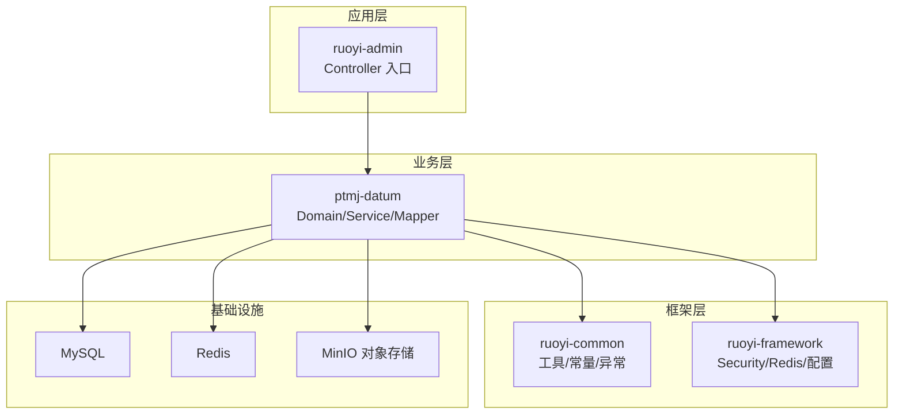
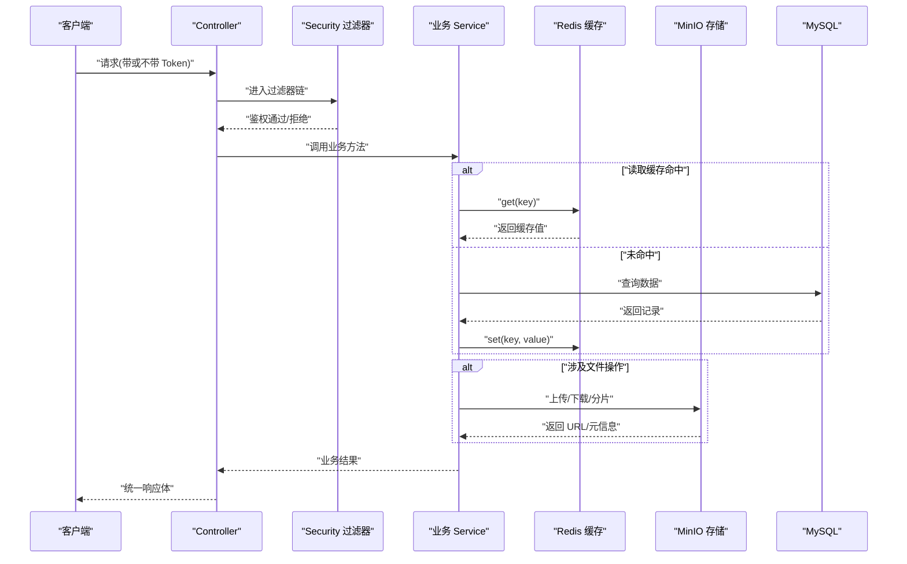
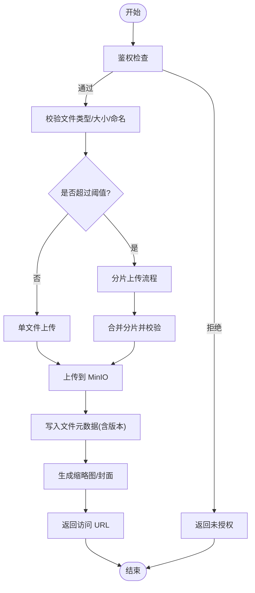
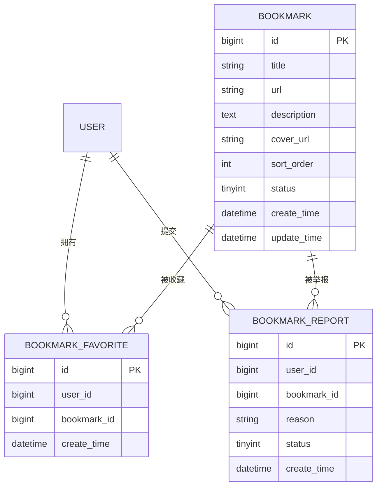
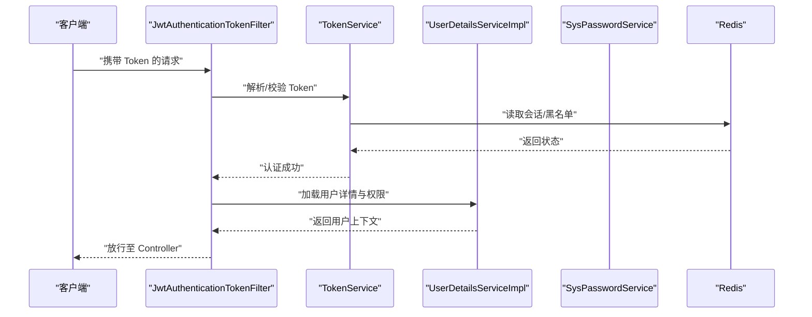
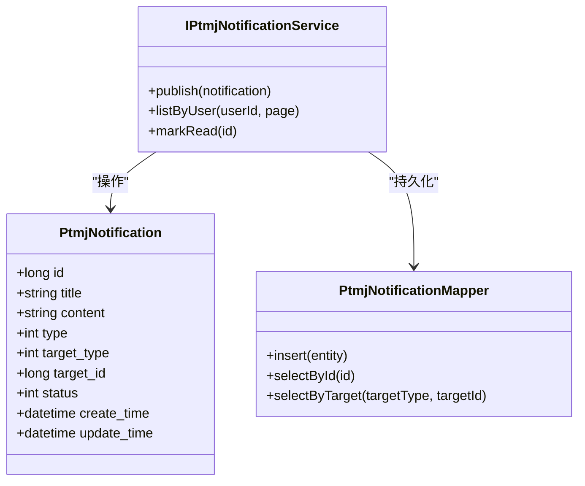
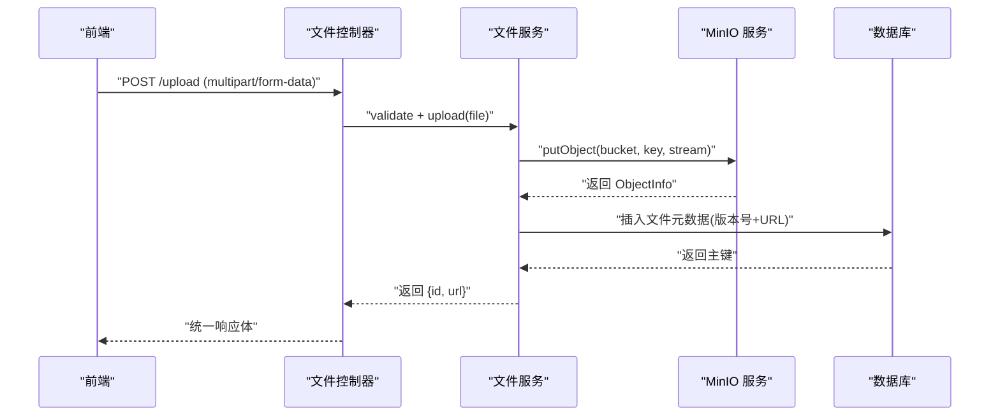
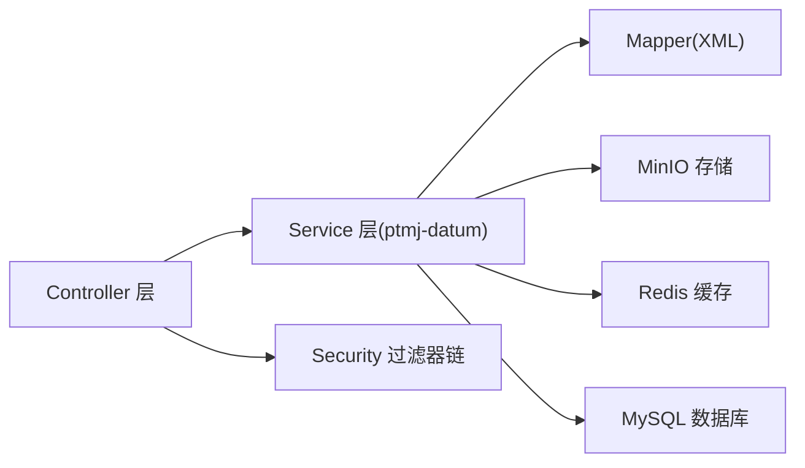

# 核心功能实现

<cite>
**本文引用的文件**   
- [README.md](file://PezMax-Backend/README.md)
- [pom.xml](file://PezMax-Backend/pom.xml)
- [application.yml](file://PezMax-Backend/ruoyi-admin/src/main/resources/application.yml)
- [application-druid.yml](file://PezMax-Backend/ruoyi-admin/src/main/resources/application-druid.yml)
- [MinioConfig.java](file://PezMax-Backend/ruoyi-common/src/main/java/com/ruoyi/common/config/MinioConfig.java)
- [MinioStorageService.java](file://PezMax-Backend/ruoyi-common/src/main/java/com/ruoyi/common/utils/file/MinioStorageService.java)
- [FileUploadUtils.java](file://PezMax-Backend/ruoyi-common/src/main/java/com/ruoyi/common/utils/file/FileUploadUtils.java)
- [MimeTypeUtils.java](file://PezMax-Backend/ruoyi-common/src/main/java/com/ruoyi/common/utils/file/MimeTypeUtils.java)
- [ImageUtils.java](file://PezMax-Backend/ruoyi-common/src/main/java/com/ruoyi/common/utils/file/ImageUtils.java)
- [SecurityConfig.java](file://PezMax-Backend/ruoyi-framework/src/main/java/com/ruoyi/framework/config/SecurityConfig.java)
- [JwtAuthenticationTokenFilter.java](file://PezMax-Backend/ruoyi-framework/src/main/java/com/ruoyi/framework/security/filter/JwtAuthenticationTokenFilter.java)
- [TokenService.java](file://PezMax-Backend/ruoyi-framework/src/main/java/com/ruoyi/framework/web/service/TokenService.java)
- [SysPasswordService.java](file://PezMax-Backend/ruoyi-framework/src/main/java/com/ruoyi/framework/web/service/SysPasswordService.java)
- [UserDetailsServiceImpl.java](file://PezMax-Backend/ruoyi-framework/src/main/java/com/ruoyi/framework/web/service/UserDetailsServiceImpl.java)
- [Anonymous.java](file://PezMax-Backend/ruoyi-common/src/main/java/com/ruoyi/common/annotation/Anonymous.java)
- [PtmjBookmark.java](file://PezMax-Backend/ptmj-datum/src/main/java/com/ptmj/datum/domain/PtmjBookmark.java)
- [PtmjBookmarkFavorite.java](file://PezMax-Backend/ptmj-datum/src/main/java/com/ptmj/datum/domain/PtmjBookmarkFavorite.java)
- [PtmjBookmarkReport.java](file://PezMax-Backend/ptmj-datum/src/main/java/com/ptmj/datum/domain/PtmjBookmarkReport.java)
- [PtmjBookmarkMapper.xml](file://PezMax-Backend/ptmj-datum/src/main/resources/mapper/datum/PtmjBookmarkMapper.xml)
- [PtmjBookmarkFavoriteMapper.xml](file://PezMax-Backend/ptmj-datum/src/main/resources/mapper/datum/PtmjBookmarkFavoriteMapper.xml)
- [PtmjBookmarkReportMapper.xml](file://PezMax-Backend/ptmj-datum/src/main/resources/mapper/datum/PtmjBookmarkReportMapper.xml)
- [IPtmjBookmarkService.java](file://PezMax-Backend/ptmj-datum/src/main/java/com/ptmj/datum/service/IPtmjBookmarkService.java)
- [PtmjFile.java](file://PezMax-Backend/ptmj-datum/src/main/java/com/ptmj/datum/domain/PtmjFile.java)
- [PtmjFileDownload.java](file://PezMax-Backend/ptmj-datum/src/main/java/com/ptmj/datum/domain/PtmjFileDownload.java)
- [PtmjFileFavorite.java](file://PezMax-Backend/ptmj-datum/src/main/java/com/ptmj/datum/domain/PtmjFileFavorite.java)
- [PtmjFileMapper.xml](file://PezMax-Backend/ptmj-datum/src/main/resources/mapper/datum/PtmjFileMapper.xml)
- [PtmjFileDownloadMapper.xml](file://PezMax-Backend/ptmj-datum/src/main/resources/mapper/datum/PtmjFileDownloadMapper.xml)
- [PtmjFileFavoriteMapper.xml](file://PezMax-Backend/ptmj-datum/src/main/resources/mapper/datum/PtmjFileFavoriteMapper.xml)
- [IPtmjFileService.java](file://PezMax-Backend/ptmj-datum/src/main/java/com/ptmj/datum/service/IPtmjFileService.java)
- [PtmjNotification.java](file://PezMax-Backend/ptmj-datum/src/main/java/com/ptmj/datum/domain/PtmjNotification.java)
- [PtmjNotificationMapper.xml](file://PezMax-Backend/ptmj-datum/src/main/resources/mapper/datum/PtmjNotificationMapper.xml)
- [IPtmjNotificationService.java](file://PezMax-Backend/ptmj-datum/src/main/java/com/ptmj/datum/service/IPtmjNotificationService.java)
- [GlobalException.java](file://PezMax-Backend/ruoyi-common/src/main/java/com/ruoyi/common/exception/GlobalException.java)
- [GlobalExceptionHandler.java](file://PezMax-Backend/ruoyi-framework/src/main/java/com/ruoyi/framework/web/exception/GlobalExceptionHandler.java)
- [CacheConstants.java](file://PezMax-Backend/ruoyi-common/src/main/java/com/ruoyi/common/constant/CacheConstants.java)
- [RedisCache.java](file://PezMax-Backend/ruoyi-common/src/main/java/com/ruoyi/common/core/redis/RedisCache.java)
- [pezmax.sql](file://PezMax-Backend/sql/pezmax.sql)
</cite>

## 目录
1. [引言](#引言)
2. [项目结构](#项目结构)
3. [核心组件](#核心组件)
4. [架构总览](#架构总览)
5. [详细组件分析](#详细组件分析)
6. [依赖分析](#依赖分析)
7. [性能考虑](#性能考虑)
8. [故障排查指南](#故障排查指南)
9. [结论](#结论)
10. [附录](#附录)

## 引言
本文件聚焦于 PezMax-One 后端的核心业务模块，围绕以下能力进行系统化文档化：
- 文件管理系统：多格式上传下载、大文件切片处理、在线预览、版本控制
- 书签管理系统：网页收藏、分类标签、封面自动抓取、分享机制
- 用户认证体系：JWT 令牌管理、角色权限控制、密码加密存储、会话管理
- 通知推送系统：实时消息、系统公告、审核结果通知
- 接口设计、数据流转、异常处理与性能优化方案

## 项目结构
后端采用模块化分层架构，核心业务位于 ptmj-datum 模块，通用能力在 ruoyi-common，安全与框架配置在 ruoyi-framework，Web 入口在 ruoyi-admin。数据库脚本位于 sql 目录。

图表来源
- [README.md:76-89](file://PezMax-Backend/README.md#L76-L89)

章节来源
- [README.md:1-105](file://PezMax-Backend/README.md#L1-L105)

## 核心组件
- 文件服务：封装 MinIO 上传/下载/分片合并、类型校验、缩略图生成、访问策略与缓存
- 书签服务：书签 CRUD、收藏/举报、封面抓取、分享链接生成
- 通知服务：系统公告、审核结果、站内消息的持久化与查询
- 安全与认证：Spring Security + JWT + Redis 的无状态鉴权与权限控制
- 全局异常与统一响应：标准化错误码与异常捕获

章节来源
- [README.md:23-29](file://PezMax-Backend/README.md#L23-L29)

## 架构总览
整体采用“控制器-服务-数据访问”三层架构，结合 Spring Security 过滤器链完成鉴权；MinIO 作为对象存储承载文件实体；Redis 用于缓存热点数据与会话信息；MyBatis 负责关系型数据持久化。

图表来源
- [SecurityConfig.java](file://PezMax-Backend/ruoyi-framework/src/main/java/com/ruoyi/framework/config/SecurityConfig.java)
- [JwtAuthenticationTokenFilter.java](file://PezMax-Backend/ruoyi-framework/src/main/java/com/ruoyi/framework/security/filter/JwtAuthenticationTokenFilter.java)
- [TokenService.java](file://PezMax-Backend/ruoyi-framework/src/main/java/com/ruoyi/framework/web/service/TokenService.java)
- [RedisCache.java](file://PezMax-Backend/ruoyi-common/src/main/java/com/ruoyi/common/core/redis/RedisCache.java)
- [MinioStorageService.java](file://PezMax-Backend/ruoyi-common/src/main/java/com/ruoyi/common/utils/file/MinioStorageService.java)

## 详细组件分析

### 文件管理系统
- 多格式上传下载
  - 上传流程：前端分片或整包上传 -> 服务端校验 MIME/大小 -> 写入 MinIO -> 落库文件元数据（含版本）-> 返回可访问 URL
  - 下载流程：鉴权 -> 解析路径/桶名 -> 从 MinIO 流式输出 -> 记录下载日志
- 大文件切片处理
  - 分片上传：计算分片 MD5、断点续传、并发合并、幂等去重
  - 合并策略：按序号拼接、完整性校验、失败重试
- 在线预览
  - 图片/文本直接预览；文档通过 LibreOffice 转换 PDF/图片后预览
  - 预览 URL 使用临时签名或公开桶策略
- 版本控制
  - 同一资源多次上传生成新版本号；保留历史版本并支持回滚查看
- 缩略图与封面
  - 图片自动生成缩略图；书签封面自动抓取

图表来源
- [MinioStorageService.java](file://PezMax-Backend/ruoyi-common/src/main/java/com/ruoyi/common/utils/file/MinioStorageService.java)
- [FileUploadUtils.java](file://PezMax-Backend/ruoyi-common/src/main/java/com/ruoyi/common/utils/file/FileUploadUtils.java)
- [MimeTypeUtils.java](file://PezMax-Backend/ruoyi-common/src/main/java/com/ruoyi/common/utils/file/MimeTypeUtils.java)
- [ImageUtils.java](file://PezMax-Backend/ruoyi-common/src/main/java/com/ruoyi/common/utils/file/ImageUtils.java)
- [PtmjFile.java](file://PezMax-Backend/ptmj-datum/src/main/java/com/ptmj/datum/domain/PtmjFile.java)
- [PtmjFileDownload.java](file://PezMax-Backend/ptmj-datum/src/main/java/com/ptmj/datum/domain/PtmjFileDownload.java)
- [PtmjFileMapper.xml](file://PezMax-Backend/ptmj-datum/src/main/resources/mapper/datum/PtmjFileMapper.xml)
- [PtmjFileDownloadMapper.xml](file://PezMax-Backend/ptmj-datum/src/main/resources/mapper/datum/PtmjFileDownloadMapper.xml)

章节来源
- [MinioConfig.java](file://PezMax-Backend/ruoyi-common/src/main/java/com/ruoyi/common/config/MinioConfig.java)
- [MinioStorageService.java](file://PezMax-Backend/ruoyi-common/src/main/java/com/ruoyi/common/utils/file/MinioStorageService.java)
- [FileUploadUtils.java](file://PezMax-Backend/ruoyi-common/src/main/java/com/ruoyi/common/utils/file/FileUploadUtils.java)
- [MimeTypeUtils.java](file://PezMax-Backend/ruoyi-common/src/main/java/com/ruoyi/common/utils/file/MimeTypeUtils.java)
- [ImageUtils.java](file://PezMax-Backend/ruoyi-common/src/main/java/com/ruoyi/common/utils/file/ImageUtils.java)
- [PtmjFile.java](file://PezMax-Backend/ptmj-datum/src/main/java/com/ptmj/datum/domain/PtmjFile.java)
- [PtmjFileDownload.java](file://PezMax-Backend/ptmj-datum/src/main/java/com/ptmj/datum/domain/PtmjFileDownload.java)
- [PtmjFileMapper.xml](file://PezMax-Backend/ptmj-datum/src/main/resources/mapper/datum/PtmjFileMapper.xml)
- [PtmjFileDownloadMapper.xml](file://PezMax-Backend/ptmj-datum/src/main/resources/mapper/datum/PtmjFileDownloadMapper.xml)

### 书签管理系统
- 书签模型与关系
  - 书签主表：标题、URL、描述、封面、排序、状态等
  - 收藏关系：用户-书签多对多
  - 举报记录：用户-书签-原因
- 功能要点
  - 收藏/取消收藏、列表分页、搜索过滤
  - 分类标签：基于字段或扩展表组织
  - 封面自动抓取：根据 URL 获取站点图标或首图
  - 分享机制：生成短链或公开访问链接，支持匿名访问
- 匿名访问
  - 部分查询接口标注匿名注解，无需登录即可浏览

图表来源
- [PtmjBookmark.java](file://PezMax-Backend/ptmj-datum/src/main/java/com/ptmj/datum/domain/PtmjBookmark.java)
- [PtmjBookmarkFavorite.java](file://PezMax-Backend/ptmj-datum/src/main/java/com/ptmj/datum/domain/PtmjBookmarkFavorite.java)
- [PtmjBookmarkReport.java](file://PezMax-Backend/ptmj-datum/src/main/java/com/ptmj/datum/domain/PtmjBookmarkReport.java)
- [PtmjBookmarkMapper.xml](file://PezMax-Backend/ptmj-datum/src/main/resources/mapper/datum/PtmjBookmarkMapper.xml)
- [PtmjBookmarkFavoriteMapper.xml](file://PezMax-Backend/ptmj-datum/src/main/resources/mapper/datum/PtmjBookmarkFavoriteMapper.xml)
- [PtmjBookmarkReportMapper.xml](file://PezMax-Backend/ptmj-datum/src/main/resources/mapper/datum/PtmjBookmarkReportMapper.xml)

章节来源
- [IPtmjBookmarkService.java](file://PezMax-Backend/ptmj-datum/src/main/java/com/ptmj/datum/service/IPtmjBookmarkService.java)
- [PtmjBookmark.java](file://PezMax-Backend/ptmj-datum/src/main/java/com/ptmj/datum/domain/PtmjBookmark.java)
- [PtmjBookmarkFavorite.java](file://PezMax-Backend/ptmj-datum/src/main/java/com/ptmj/datum/domain/PtmjBookmarkFavorite.java)
- [PtmjBookmarkReport.java](file://PezMax-Backend/ptmj-datum/src/main/java/com/ptmj/datum/domain/PtmjBookmarkReport.java)
- [PtmjBookmarkMapper.xml](file://PezMax-Backend/ptmj-datum/src/main/resources/mapper/datum/PtmjBookmarkMapper.xml)
- [PtmjBookmarkFavoriteMapper.xml](file://PezMax-Backend/ptmj-datum/src/main/resources/mapper/datum/PtmjBookmarkFavoriteMapper.xml)
- [PtmjBookmarkReportMapper.xml](file://PezMax-Backend/ptmj-datum/src/main/resources/mapper/datum/PtmjBookmarkReportMapper.xml)
- [Anonymous.java](file://PezMax-Backend/ruoyi-common/src/main/java/com/ruoyi/common/annotation/Anonymous.java)

### 用户认证与安全
- 认证流程
  - 登录成功签发 JWT，存入 Redis 并设置过期时间
  - 请求携带 Token，过滤器解析并注入当前用户上下文
  - 基于角色的访问控制，配合注解限制接口权限
- 密码安全
  - 密码加盐哈希存储，登录时比对
- 会话管理
  - 无状态 Token + Redis 黑名单/刷新机制，支持强制下线与限流

图表来源
- [SecurityConfig.java](file://PezMax-Backend/ruoyi-framework/src/main/java/com/ruoyi/framework/config/SecurityConfig.java)
- [JwtAuthenticationTokenFilter.java](file://PezMax-Backend/ruoyi-framework/src/main/java/com/ruoyi/framework/security/filter/JwtAuthenticationTokenFilter.java)
- [TokenService.java](file://PezMax-Backend/ruoyi-framework/src/main/java/com/ruoyi/framework/web/service/TokenService.java)
- [UserDetailsServiceImpl.java](file://PezMax-Backend/ruoyi-framework/src/main/java/com/ruoyi/framework/web/service/UserDetailsServiceImpl.java)
- [SysPasswordService.java](file://PezMax-Backend/ruoyi-framework/src/main/java/com/ruoyi/framework/web/service/SysPasswordService.java)
- [CacheConstants.java](file://PezMax-Backend/ruoyi-common/src/main/java/com/ruoyi/common/constant/CacheConstants.java)

章节来源
- [SecurityConfig.java](file://PezMax-Backend/ruoyi-framework/src/main/java/com/ruoyi/framework/config/SecurityConfig.java)
- [JwtAuthenticationTokenFilter.java](file://PezMax-Backend/ruoyi-framework/src/main/java/com/ruoyi/framework/security/filter/JwtAuthenticationTokenFilter.java)
- [TokenService.java](file://PezMax-Backend/ruoyi-framework/src/main/java/com/ruoyi/framework/web/service/TokenService.java)
- [UserDetailsServiceImpl.java](file://PezMax-Backend/ruoyi-framework/src/main/java/com/ruoyi/framework/web/service/UserDetailsServiceImpl.java)
- [SysPasswordService.java](file://PezMax-Backend/ruoyi-framework/src/main/java/com/ruoyi/framework/web/service/SysPasswordService.java)
- [CacheConstants.java](file://PezMax-Backend/ruoyi-common/src/main/java/com/ruoyi/common/constant/CacheConstants.java)

### 通知推送系统
- 通知模型
  - 内容、类型（系统公告/审核结果/私信）、目标用户、状态、创建时间
- 业务流程
  - 管理员发布公告 -> 持久化 -> 用户端轮询或长连接拉取
  - 审核完成后触发通知写入，用户可在通知中心查看
- 缓存与检索
  - 热门公告缓存至 Redis，提升读取性能

图表来源
- [PtmjNotification.java](file://PezMax-Backend/ptmj-datum/src/main/java/com/ptmj/datum/domain/PtmjNotification.java)
- [IPtmjNotificationService.java](file://PezMax-Backend/ptmj-datum/src/main/java/com/ptmj/datum/service/IPtmjNotificationService.java)
- [PtmjNotificationMapper.xml](file://PezMax-Backend/ptmj-datum/src/main/resources/mapper/datum/PtmjNotificationMapper.xml)

章节来源
- [PtmjNotification.java](file://PezMax-Backend/ptmj-datum/src/main/java/com/ptmj/datum/domain/PtmjNotification.java)
- [IPtmjNotificationService.java](file://PezMax-Backend/ptmj-datum/src/main/java/com/ptmj/datum/service/IPtmjNotificationService.java)
- [PtmjNotificationMapper.xml](file://PezMax-Backend/ptmj-datum/src/main/resources/mapper/datum/PtmjNotificationMapper.xml)

### 接口设计与数据流转
- 文件相关
  - 上传：支持单文件与大文件分片，返回文件 ID 与访问 URL
  - 下载：按文件 ID 或路径下载，记录下载统计
  - 预览：根据 MIME 类型选择直链或转换后预览
- 书签相关
  - 列表/详情/收藏/举报/分享链接
- 通知相关
  - 公告列表、已读标记、按用户维度查询

图表来源
- [MinioStorageService.java](file://PezMax-Backend/ruoyi-common/src/main/java/com/ruoyi/common/utils/file/MinioStorageService.java)
- [PtmjFile.java](file://PezMax-Backend/ptmj-datum/src/main/java/com/ptmj/datum/domain/PtmjFile.java)
- [PtmjFileMapper.xml](file://PezMax-Backend/ptmj-datum/src/main/resources/mapper/datum/PtmjFileMapper.xml)

章节来源
- [PtmjFile.java](file://PezMax-Backend/ptmj-datum/src/main/java/com/ptmj/datum/domain/PtmjFile.java)
- [PtmjFileDownload.java](file://PezMax-Backend/ptmj-datum/src/main/java/com/ptmj/datum/domain/PtmjFileDownload.java)
- [PtmjFileMapper.xml](file://PezMax-Backend/ptmj-datum/src/main/resources/mapper/datum/PtmjFileMapper.xml)
- [PtmjFileDownloadMapper.xml](file://PezMax-Backend/ptmj-datum/src/main/resources/mapper/datum/PtmjFileDownloadMapper.xml)

## 依赖分析
- 外部依赖
  - MySQL：持久化业务数据
  - Redis：缓存、会话、限流
  - MinIO：对象存储
- 内部依赖
  - Controller 依赖 Service，Service 依赖 Mapper 与工具类
  - 安全过滤器链贯穿所有受保护接口

图表来源
- [pom.xml](file://PezMax-Backend/pom.xml)
- [application.yml](file://PezMax-Backend/ruoyi-admin/src/main/resources/application.yml)
- [application-druid.yml](file://PezMax-Backend/ruoyi-admin/src/main/resources/application-druid.yml)

章节来源
- [pom.xml](file://PezMax-Backend/pom.xml)
- [application.yml](file://PezMax-Backend/ruoyi-admin/src/main/resources/application.yml)
- [application-druid.yml](file://PezMax-Backend/ruoyi-admin/src/main/resources/application-druid.yml)

## 性能考虑
- 文件上传
  - 启用分片上传与并发合并，降低超时风险
  - 使用 MinIO 预签名 URL 直传，减轻网关压力
  - 缩略图异步生成，避免阻塞主流程
- 缓存策略
  - 热点书签与公告使用 Redis 缓存，设置合理 TTL
  - 文件元数据与排行榜缓存，减少数据库压力
- 数据库优化
  - 针对常用查询建立索引（如用户ID、书签状态、文件类型）
  - 分页查询使用游标或延迟关联优化
- 安全与限流
  - 登录接口限流，防止暴力破解
  - Token 刷新与黑名单机制，保障会话安全

[本节为通用指导，不直接分析具体文件]

## 故障排查指南
- 常见问题
  - 上传失败：检查 MinIO 连通性与桶策略、MIME 白名单、文件大小限制
  - 预览异常：确认 LibreOffice 服务可用、转换产物存在
  - 鉴权失败：核对 Token 有效性、Redis 中会话状态、跨域与 Referer 配置
  - 通知未达：检查通知类型与目标用户匹配、缓存一致性
- 定位手段
  - 全局异常处理器统一捕获并打印堆栈
  - 关键路径埋点日志（上传、下载、鉴权、通知）
  - 监控 MinIO/Redis/MySQL 健康指标

章节来源
- [GlobalException.java](file://PezMax-Backend/ruoyi-common/src/main/java/com/ruoyi/common/exception/GlobalException.java)
- [GlobalExceptionHandler.java](file://PezMax-Backend/ruoyi-framework/src/main/java/com/ruoyi/framework/web/exception/GlobalExceptionHandler.java)

## 结论
PezMax-One 后端以 RuoYi 为基础，结合 MinIO、Redis、Spring Security 构建了高可用的文件与书签管理能力，并通过统一的异常处理与缓存策略提升了稳定性与性能。后续可在通知通道（WebSocket/长轮询）、文件转码流水线与审计追踪方面持续演进。

[本节为总结性内容，不直接分析具体文件]

## 附录
- 初始化脚本
  - 执行数据库脚本以创建基础表结构与初始数据

章节来源
- [pezmax.sql](file://PezMax-Backend/sql/pezmax.sql)