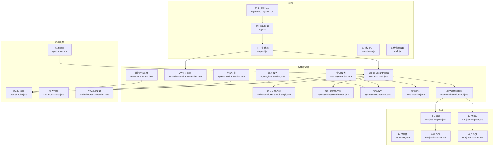
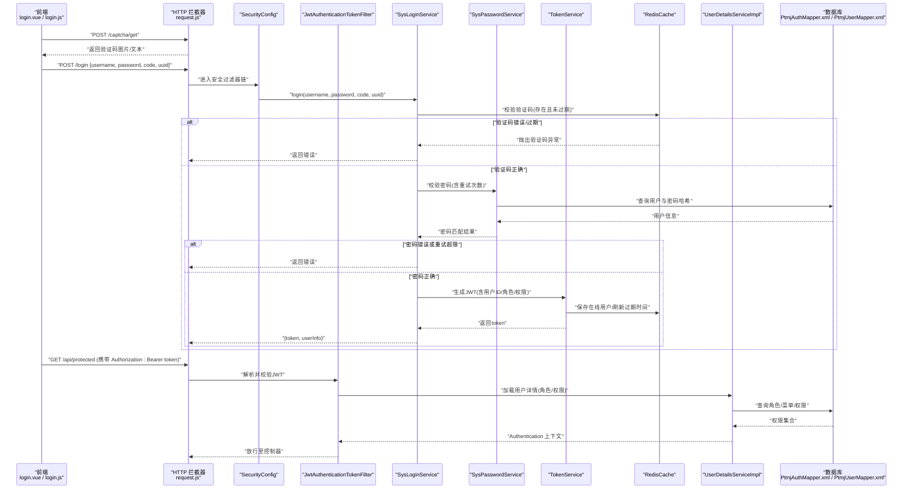
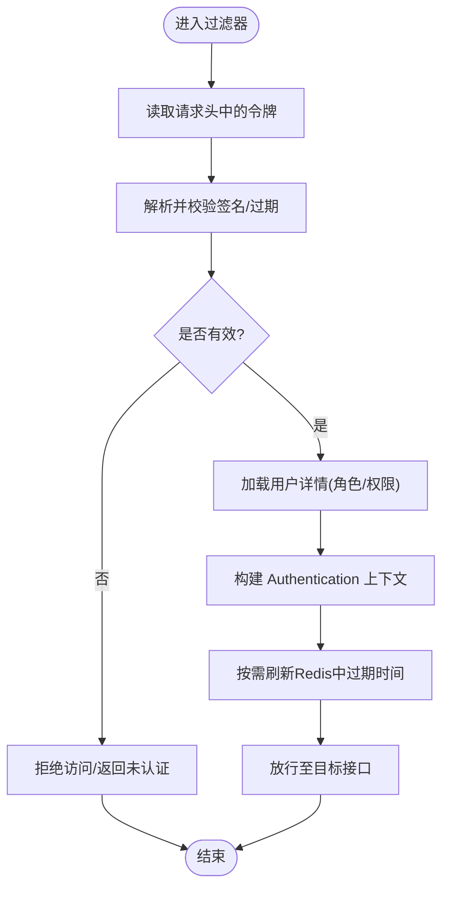
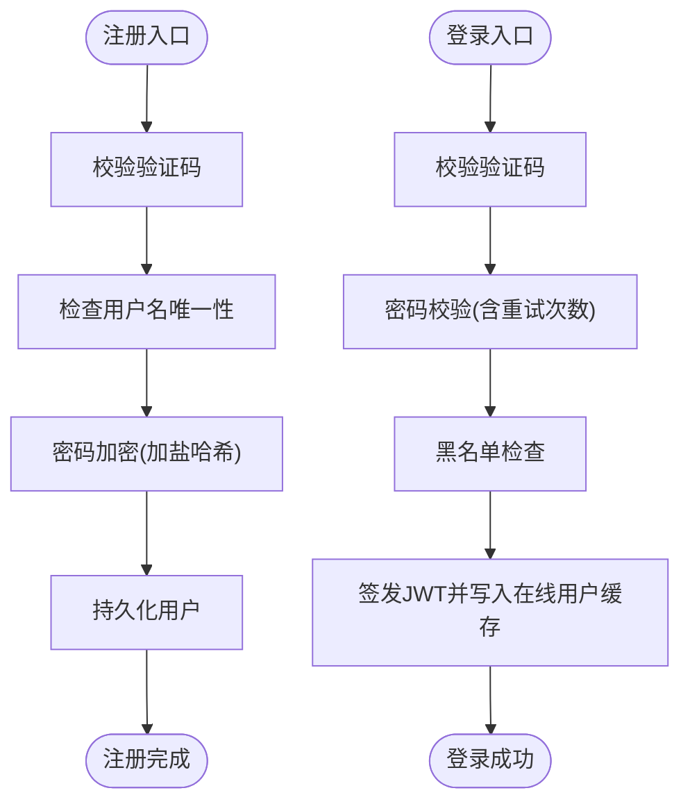
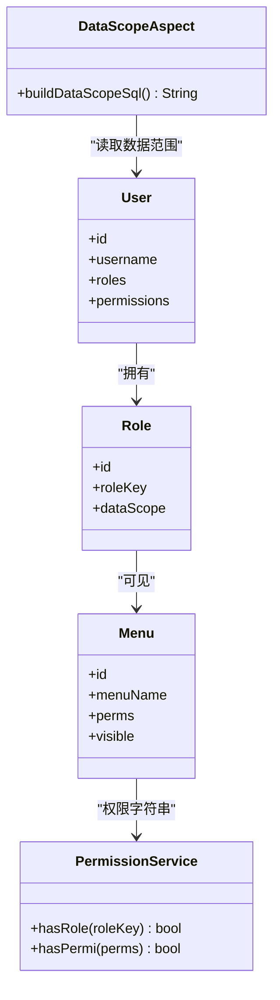
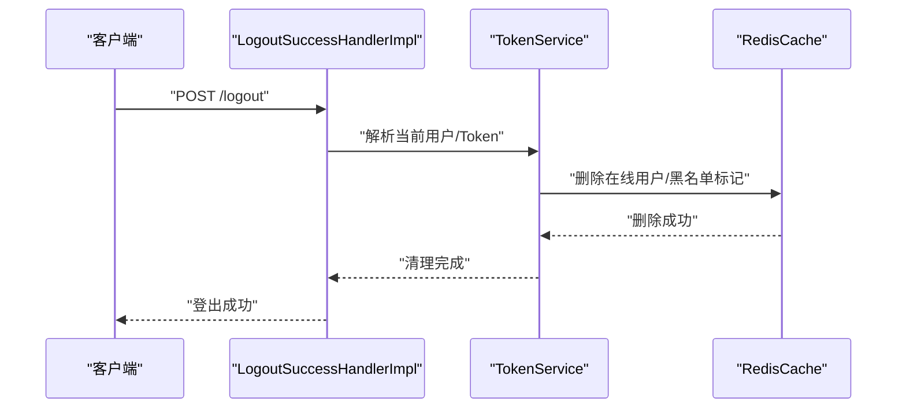
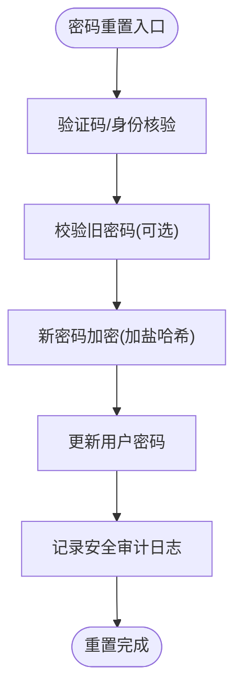
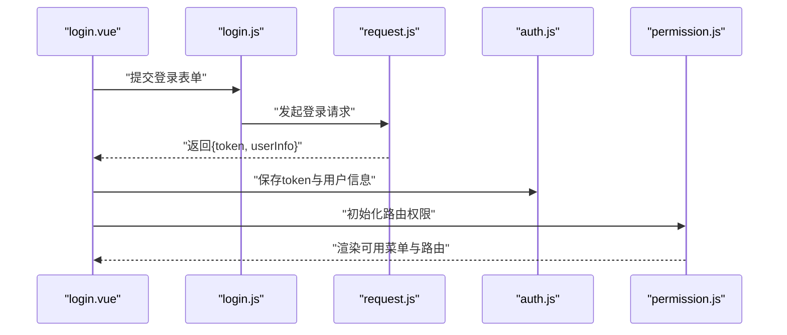
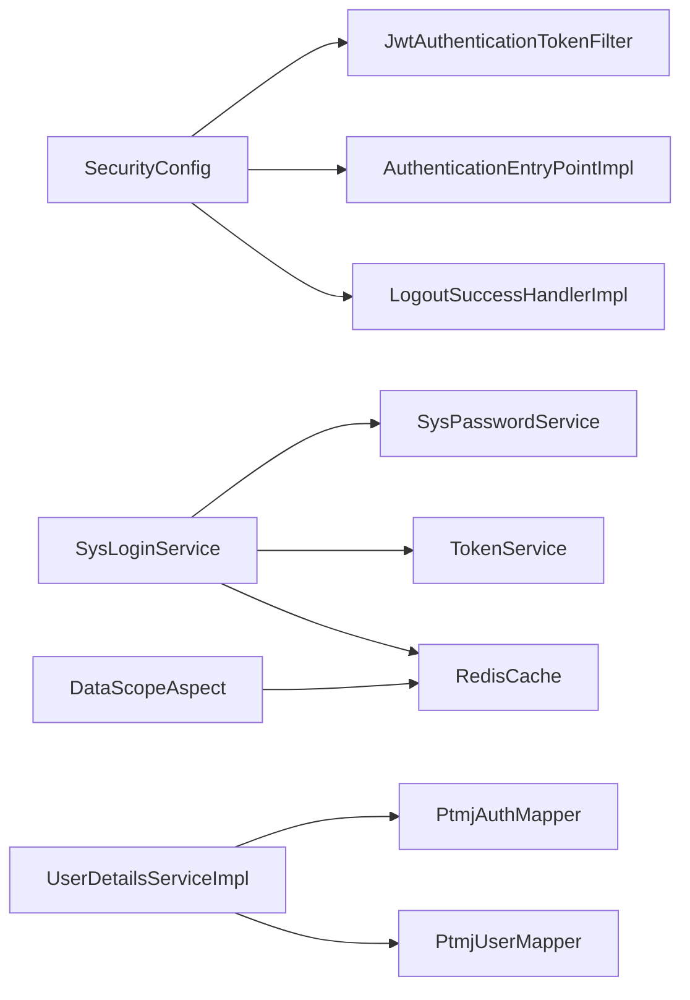

# 用户认证系统

<cite>
**本文引用的文件**   
- [SecurityConfig.java](file://PezMax-Backend/ruoyi-framework/src/main/java/com/ruoyi/framework/config/SecurityConfig.java)
- [JwtAuthenticationTokenFilter.java](file://PezMax-Backend/ruoyi-framework/src/main/java/com/ruoyi/framework/security/filter/JwtAuthenticationTokenFilter.java)
- [AuthenticationEntryPointImpl.java](file://PezMax-Backend/ruoyi-framework/src/main/java/com/ruoyi/framework/security/handle/AuthenticationEntryPointImpl.java)
- [LogoutSuccessHandlerImpl.java](file://PezMax-Backend/ruoyi-framework/src/main/java/com/ruoyi/framework/security/handle/LogoutSuccessHandlerImpl.java)
- [SysLoginService.java](file://PezMax-Backend/ruoyi-framework/src/main/java/com/ruoyi/framework/web/service/SysLoginService.java)
- [SysRegisterService.java](file://PezMax-Backend/ruoyi-framework/src/main/java/com/ruoyi/framework/web/service/SysRegisterService.java)
- [SysPasswordService.java](file://PezMax-Backend/ruoyi-framework/src/main/java/com/ruoyi/framework/web/service/SysPasswordService.java)
- [TokenService.java](file://PezMax-Backend/ruoyi-framework/src/main/java/com/ruoyi/framework/web/service/TokenService.java)
- [UserDetailsServiceImpl.java](file://PezMax-Backend/ruoyi-framework/src/main/java/com/ruoyi/framework/web/service/UserDetailsServiceImpl.java)
- [PermissionService.java](file://PezMax-Backend/ruoyi-framework/src/main/java/com/ruoyi/framework/web/service/PermissionService.java)
- [SysPermissionService.java](file://PezMax-Backend/ruoyi-framework/src/main/java/com/ruoyi/framework/web/service/SysPermissionService.java)
- [DataScopeAspect.java](file://PezMax-Backend/ruoyi-framework/src/main/java/com/ruoyi/framework/aspectj/DataScopeAspect.java)
- [CacheConstants.java](file://PezMax-Backend/ruoyi-common/src/main/java/com/ruoyi/common/constant/CacheConstants.java)
- [RedisCache.java](file://PezMax-Backend/ruoyi-common/src/main/java/com/ruoyi/common/core/redis/RedisCache.java)
- [CaptchaException.java](file://PezMax-Backend/ruoyi-common/src/main/java/com/ruoyi/common/exception/user/CaptchaException.java)
- [CaptchaExpireException.java](file://PezMax-Backend/ruoyi-common/src/main/java/com/ruoyi/common/exception/user/CaptchaExpireException.java)
- [UserNotExistsException.java](file://PezMax-Backend/ruoyi-common/src/main/java/com/ruoyi/common/exception/user/UserNotExistsException.java)
- [UserPasswordNotMatchException.java](file://PezMax-Backend/ruoyi-common/src/main/java/com/ruoyi/common/exception/user/UserPasswordNotMatchException.java)
- [UserPasswordRetryLimitExceedException.java](file://PezMax-Backend/ruoyi-common/src/main/java/com/ruoyi/common/exception/user/UserPasswordRetryLimitExceedException.java)
- [GlobalExceptionHandler.java](file://PezMax-Backend/ruoyi-framework/src/main/java/com/ruoyi/framework/web/exception/GlobalExceptionHandler.java)
- [application.yml](file://PezMax-Backend/ruoyi-admin/src/main/resources/application.yml)
- [PtmjUser.java](file://PezMax-Backend/ptmj-datum/src/main/java/com/ptmj/datum/domain/PtmjUser.java)
- [PtmjAuthMapper.java](file://PezMax-Backend/ptmj-datum/src/main/java/com/ptmj/datum/mapper/PtmjAuthMapper.java)
- [PtmjUserMapper.java](file://PezMax-Backend/ptmj-datum/src/main/java/com/ptmj/datum/mapper/PtmjUserMapper.java)
- [PtmjAuthMapper.xml](file://PezMax-Backend/ptmj-datum/src/main/java/com/ptmj/datum/mapper/PtmjAuthMapper.xml)
- [PtmjUserMapper.xml](file://PezMax-Backend/ptmj-datum/src/main/java/com/ptmj/datum/mapper/PtmjUserMapper.xml)
- [login.vue](file://PezMax-Backend/ruoyi-ui/src/views/login.vue)
- [register.vue](file://PezMax-Backend/ruoyi-ui/src/views/register.vue)
- [login.js](file://PezMax-Backend/ruoyi-ui/src/api/login.js)
- [auth.js](file://PezMax-Backend/ruoyi-ui/src/utils/auth.js)
- [request.js](file://PezMax-Backend/ruoyi-ui/src/utils/request.js)
- [permission.js](file://PezMax-Backend/ruoyi-ui/src/permission.js)
</cite>

## 目录
1. [简介](#简介)
2. [项目结构](#项目结构)
3. [核心组件](#核心组件)
4. [架构总览](#架构总览)
5. [详细组件分析](#详细组件分析)
6. [依赖关系分析](#依赖关系分析)
7. [性能考虑](#性能考虑)
8. [故障排查指南](#故障排查指南)
9. [结论](#结论)
10. [附录](#附录)

## 简介
本文件系统性梳理 PezMax-One 的用户认证与安全体系，覆盖以下关键能力：
- JWT 令牌认证机制：令牌的签发、校验、刷新与过期处理。
- 用户注册与登录：表单验证、验证码校验、密码加密存储、登录状态管理。
- 角色权限控制（RBAC）：菜单权限、接口访问授权、数据权限过滤。
- 会话管理：用户状态维护、并发登录控制、登出清理。
- 安全相关功能：密码重置、安全设置、账户管理等实现细节。

## 项目结构
本项目采用前后端分离的架构，后端基于 Spring Security + JWT + Redis 实现无状态认证与鉴权；前端通过拦截器统一注入 Token、处理未授权跳转与错误提示。

**图表来源**
- [SecurityConfig.java](file://PezMax-Backend/ruoyi-framework/src/main/java/com/ruoyi/framework/config/SecurityConfig.java)
- [JwtAuthenticationTokenFilter.java](file://PezMax-Backend/ruoyi-framework/src/main/java/com/ruoyi/framework/security/filter/JwtAuthenticationTokenFilter.java)
- [AuthenticationEntryPointImpl.java](file://PezMax-Backend/ruoyi-framework/src/main/java/com/ruoyi/framework/security/handle/AuthenticationEntryPointImpl.java)
- [LogoutSuccessHandlerImpl.java](file://PezMax-Backend/ruoyi-framework/src/main/java/com/ruoyi/framework/security/handle/LogoutSuccessHandlerImpl.java)
- [SysLoginService.java](file://PezMax-Backend/ruoyi-framework/src/main/java/com/ruoyi/framework/web/service/SysLoginService.java)
- [SysRegisterService.java](file://PezMax-Backend/ruoyi-framework/src/main/java/com/ruoyi/framework/web/service/SysRegisterService.java)
- [SysPasswordService.java](file://PezMax-Backend/ruoyi-framework/src/main/java/com/ruoyi/framework/web/service/SysPasswordService.java)
- [TokenService.java](file://PezMax-Backend/ruoyi-framework/src/main/java/com/ruoyi/framework/web/service/TokenService.java)
- [UserDetailsServiceImpl.java](file://PezMax-Backend/ruoyi-framework/src/main/java/com/ruoyi/framework/web/service/UserDetailsServiceImpl.java)
- [SysPermissionService.java](file://PezMax-Backend/ruoyi-framework/src/main/java/com/ruoyi/framework/web/service/SysPermissionService.java)
- [DataScopeAspect.java](file://PezMax-Backend/ruoyi-framework/src/main/java/com/ruoyi/framework/aspectj/DataScopeAspect.java)
- [PtmjUser.java](file://PezMax-Backend/ptmj-datum/src/main/java/com/ptmj/datum/domain/PtmjUser.java)
- [PtmjAuthMapper.java](file://PezMax-Backend/ptmj-datum/src/main/java/com/ptmj/datum/mapper/PtmjAuthMapper.java)
- [PtmjUserMapper.java](file://PezMax-Backend/ptmj-datum/src/main/java/com/ptmj/datum/mapper/PtmjUserMapper.java)
- [PtmjAuthMapper.xml](file://PezMax-Backend/ptmj-datum/src/main/java/com/ptmj/datum/mapper/PtmjAuthMapper.xml)
- [PtmjUserMapper.xml](file://PezMax-Backend/ptmj-datum/src/main/java/com/ptmj/datum/mapper/PtmjUserMapper.xml)
- [RedisCache.java](file://PezMax-Backend/ruoyi-common/src/main/java/com/ruoyi/common/core/redis/RedisCache.java)
- [CacheConstants.java](file://PezMax-Backend/ruoyi-common/src/main/java/com/ruoyi/common/constant/CacheConstants.java)
- [GlobalExceptionHandler.java](file://PezMax-Backend/ruoyi-framework/src/main/java/com/ruoyi/framework/web/exception/GlobalExceptionHandler.java)
- [application.yml](file://PezMax-Backend/ruoyi-admin/src/main/resources/application.yml)

**章节来源**
- [SecurityConfig.java](file://PezMax-Backend/ruoyi-framework/src/main/java/com/ruoyi/framework/config/SecurityConfig.java)
- [JwtAuthenticationTokenFilter.java](file://PezMax-Backend/ruoyi-framework/src/main/java/com/ruoyi/framework/security/filter/JwtAuthenticationTokenFilter.java)
- [application.yml](file://PezMax-Backend/ruoyi-admin/src/main/resources/application.yml)

## 核心组件
- 安全配置与过滤器
  - SecurityConfig：定义放行路径、登录/登出处理器、跨域策略、JWT 过滤器链等。
  - JwtAuthenticationTokenFilter：从请求头解析 JWT，构建 Authentication 并写入上下文。
  - AuthenticationEntryPointImpl：未认证时的统一响应。
  - LogoutSuccessHandlerImpl：登出成功后清理会话与缓存。
- 认证与授权服务
  - SysLoginService：登录流程编排（验证码校验、密码校验、黑名单检查、生成 Token、记录登录日志）。
  - SysRegisterService：注册流程编排（验证码校验、用户名唯一性、密码加密、创建用户）。
  - SysPasswordService：密码加盐哈希、匹配校验、重试次数限制。
  - TokenService：JWT 签发、解析、刷新、过期续期、在线用户管理。
  - UserDetailsServiceImpl：根据用户名加载用户、角色、权限集合。
  - SysPermissionService：提供权限判断方法（如 hasRole、hasPermi），供注解或代码使用。
  - DataScopeAspect：数据权限切面，按角色/用户的数据范围动态改写 SQL。
- 持久化与缓存
  - PtmjAuthMapper/PtmjUserMapper 及其 XML：用户、角色、菜单、权限等数据访问。
  - RedisCache/CacheConstants：在线用户、验证码、登录失败计数等缓存键与操作。
- 前端集成
  - login.vue/register.vue：表单与交互。
  - login.js：调用后端登录/注册/验证码接口。
  - request.js：统一拦截器，自动携带 Token、处理 401/403。
  - permission.js：路由级权限守卫。
  - auth.js：本地存取 Token、用户信息。

**章节来源**
- [SysLoginService.java](file://PezMax-Backend/ruoyi-framework/src/main/java/com/ruoyi/framework/web/service/SysLoginService.java)
- [SysRegisterService.java](file://PezMax-Backend/ruoyi-framework/src/main/java/com/ruoyi/framework/web/service/SysRegisterService.java)
- [SysPasswordService.java](file://PezMax-Backend/ruoyi-framework/src/main/java/com/ruoyi/framework/web/service/SysPasswordService.java)
- [TokenService.java](file://PezMax-Backend/ruoyi-framework/src/main/java/com/ruoyi/framework/web/service/TokenService.java)
- [UserDetailsServiceImpl.java](file://PezMax-Backend/ruoyi-framework/src/main/java/com/ruoyi/framework/web/service/UserDetailsServiceImpl.java)
- [SysPermissionService.java](file://PezMax-Backend/ruoyi-framework/src/main/java/com/ruoyi/framework/web/service/SysPermissionService.java)
- [DataScopeAspect.java](file://PezMax-Backend/ruoyi-framework/src/main/java/com/ruoyi/framework/aspectj/DataScopeAspect.java)
- [PtmjAuthMapper.java](file://PezMax-Backend/ptmj-datum/src/main/java/com/ptmj/datum/mapper/PtmjAuthMapper.java)
- [PtmjUserMapper.java](file://PezMax-Backend/ptmj-datum/src/main/java/com/ptmj/datum/mapper/PtmjUserMapper.java)
- [PtmjAuthMapper.xml](file://PezMax-Backend/ptmj-datum/src/main/java/com/ptmj/datum/mapper/PtmjAuthMapper.xml)
- [PtmjUserMapper.xml](file://PezMax-Backend/ptmj-datum/src/main/java/com/ptmj/datum/mapper/PtmjUserMapper.xml)
- [RedisCache.java](file://PezMax-Backend/ruoyi-common/src/main/java/com/ruoyi/common/core/redis/RedisCache.java)
- [CacheConstants.java](file://PezMax-Backend/ruoyi-common/src/main/java/com/ruoyi/common/constant/CacheConstants.java)
- [login.vue](file://PezMax-Backend/ruoyi-ui/src/views/login.vue)
- [register.vue](file://PezMax-Backend/ruoyi-ui/src/views/register.vue)
- [login.js](file://PezMax-Backend/ruoyi-ui/src/api/login.js)
- [request.js](file://PezMax-Backend/ruoyi-ui/src/utils/request.js)
- [permission.js](file://PezMax-Backend/ruoyi-ui/src/permission.js)
- [auth.js](file://PezMax-Backend/ruoyi-ui/src/utils/auth.js)

## 架构总览
下图展示一次典型登录到受保护资源访问的完整链路，包括验证码校验、密码校验、JWT 签发、前端存储、后续请求携带 Token、服务端过滤器校验与权限判定。

**图表来源**
- [SecurityConfig.java](file://PezMax-Backend/ruoyi-framework/src/main/java/com/ruoyi/framework/config/SecurityConfig.java)
- [JwtAuthenticationTokenFilter.java](file://PezMax-Backend/ruoyi-framework/src/main/java/com/ruoyi/framework/security/filter/JwtAuthenticationTokenFilter.java)
- [SysLoginService.java](file://PezMax-Backend/ruoyi-framework/src/main/java/com/ruoyi/framework/web/service/SysLoginService.java)
- [SysPasswordService.java](file://PezMax-Backend/ruoyi-framework/src/main/java/com/ruoyi/framework/web/service/SysPasswordService.java)
- [TokenService.java](file://PezMax-Backend/ruoyi-framework/src/main/java/com/ruoyi/framework/web/service/TokenService.java)
- [UserDetailsServiceImpl.java](file://PezMax-Backend/ruoyi-framework/src/main/java/com/ruoyi/framework/web/service/UserDetailsServiceImpl.java)
- [PtmjAuthMapper.xml](file://PezMax-Backend/ptmj-datum/src/main/java/com/ptmj/datum/mapper/PtmjAuthMapper.xml)
- [PtmjUserMapper.xml](file://PezMax-Backend/ptmj-datum/src/main/java/com/ptmj/datum/mapper/PtmjUserMapper.xml)
- [RedisCache.java](file://PezMax-Backend/ruoyi-common/src/main/java/com/ruoyi/common/core/redis/RedisCache.java)
- [request.js](file://PezMax-Backend/ruoyi-ui/src/utils/request.js)
- [login.js](file://PezMax-Backend/ruoyi-ui/src/api/login.js)
- [login.vue](file://PezMax-Backend/ruoyi-ui/src/views/login.vue)

## 详细组件分析

### JWT 令牌认证机制
- 令牌生成
  - 由登录成功后调用 TokenService 签发，载荷包含用户标识、角色与权限集合，设置过期时间。
  - 同时向 Redis 写入在线用户信息，用于集中管理与踢人下线。
- 令牌校验
  - 每次请求经 JwtAuthenticationTokenFilter 解析 Authorization 头，校验签名与有效期，若有效则构建 Authentication 对象并写入 SecurityContext。
- 令牌刷新
  - 支持在接近过期时刷新，更新 Redis 中的过期时间，避免频繁重新登录。
- 过期处理
  - 前端 request.js 拦截 401，引导重新登录；服务端可结合黑名单或强制失效策略。

**图表来源**
- [JwtAuthenticationTokenFilter.java](file://PezMax-Backend/ruoyi-framework/src/main/java/com/ruoyi/framework/security/filter/JwtAuthenticationTokenFilter.java)
- [TokenService.java](file://PezMax-Backend/ruoyi-framework/src/main/java/com/ruoyi/framework/web/service/TokenService.java)
- [UserDetailsServiceImpl.java](file://PezMax-Backend/ruoyi-framework/src/main/java/com/ruoyi/framework/web/service/UserDetailsServiceImpl.java)
- [RedisCache.java](file://PezMax-Backend/ruoyi-common/src/main/java/com/ruoyi/common/core/redis/RedisCache.java)

**章节来源**
- [JwtAuthenticationTokenFilter.java](file://PezMax-Backend/ruoyi-framework/src/main/java/com/ruoyi/framework/security/filter/JwtAuthenticationTokenFilter.java)
- [TokenService.java](file://PezMax-Backend/ruoyi-framework/src/main/java/com/ruoyi/framework/web/service/TokenService.java)
- [UserDetailsServiceImpl.java](file://PezMax-Backend/ruoyi-framework/src/main/java/com/ruoyi/framework/web/service/UserDetailsServiceImpl.java)
- [RedisCache.java](file://PezMax-Backend/ruoyi-common/src/main/java/com/ruoyi/common/core/redis/RedisCache.java)

### 用户注册与登录
- 注册流程
  - 前端提交用户名、密码、验证码。
  - 后端校验验证码有效性，检查用户名唯一性，使用 SysPasswordService 对密码进行加盐哈希后落库，并记录注册日志。
- 登录流程
  - 前端提交用户名、密码、验证码。
  - 后端校验验证码、密码（含重试次数限制）、黑名单状态，成功后签发 JWT，写入在线用户缓存，返回前端。
- 表单验证与错误处理
  - 前端进行基础格式校验；后端统一异常捕获并通过 GlobalExceptionHandler 返回标准错误码与消息。

**图表来源**
- [SysRegisterService.java](file://PezMax-Backend/ruoyi-framework/src/main/java/com/ruoyi/framework/web/service/SysRegisterService.java)
- [SysLoginService.java](file://PezMax-Backend/ruoyi-framework/src/main/java/com/ruoyi/framework/web/service/SysLoginService.java)
- [SysPasswordService.java](file://PezMax-Backend/ruoyi-framework/src/main/java/com/ruoyi/framework/web/service/SysPasswordService.java)
- [RedisCache.java](file://PezMax-Backend/ruoyi-common/src/main/java/com/ruoyi/common/core/redis/RedisCache.java)
- [GlobalExceptionHandler.java](file://PezMax-Backend/ruoyi-framework/src/main/java/com/ruoyi/framework/web/exception/GlobalExceptionHandler.java)

**章节来源**
- [SysRegisterService.java](file://PezMax-Backend/ruoyi-framework/src/main/java/com/ruoyi/framework/web/service/SysRegisterService.java)
- [SysLoginService.java](file://PezMax-Backend/ruoyi-framework/src/main/java/com/ruoyi/framework/web/service/SysLoginService.java)
- [SysPasswordService.java](file://PezMax-Backend/ruoyi-framework/src/main/java/com/ruoyi/framework/web/service/SysPasswordService.java)
- [CaptchaException.java](file://PezMax-Backend/ruoyi-common/src/main/java/com/ruoyi/common/exception/user/CaptchaException.java)
- [CaptchaExpireException.java](file://PezMax-Backend/ruoyi-common/src/main/java/com/ruoyi/common/exception/user/CaptchaExpireException.java)
- [UserPasswordRetryLimitExceedException.java](file://PezMax-Backend/ruoyi-common/src/main/java/com/ruoyi/common/exception/user/UserPasswordRetryLimitExceedException.java)
- [GlobalExceptionHandler.java](file://PezMax-Backend/ruoyi-framework/src/main/java/com/ruoyi/framework/web/exception/GlobalExceptionHandler.java)

### 角色权限控制系统（RBAC）
- 模型与数据
  - 用户-角色-菜单-权限四表关联，通过 Mapper 与 XML 完成查询。
- 权限加载
  - UserDetailsServiceImpl 根据用户名加载用户、角色、菜单及权限集合，放入 SecurityContext。
- 接口访问授权
  - 通过注解或自定义规则在 Controller 层声明所需角色/权限，由 SecurityConfig 与 PermissionService 共同保障。
- 菜单权限控制
  - 前端根据后端返回的权限集合渲染菜单与按钮，配合 permission.js 进行路由级守卫。
- 数据权限过滤
  - DataScopeAspect 根据当前用户角色/部门的数据范围，动态改写 SQL，实现行级数据隔离。

**图表来源**
- [UserDetailsServiceImpl.java](file://PezMax-Backend/ruoyi-framework/src/main/java/com/ruoyi/framework/web/service/UserDetailsServiceImpl.java)
- [SysPermissionService.java](file://PezMax-Backend/ruoyi-framework/src/main/java/com/ruoyi/framework/web/service/SysPermissionService.java)
- [DataScopeAspect.java](file://PezMax-Backend/ruoyi-framework/src/main/java/com/ruoyi/framework/aspectj/DataScopeAspect.java)
- [PtmjAuthMapper.java](file://PezMax-Backend/ptmj-datum/src/main/java/com/ptmj/datum/mapper/PtmjAuthMapper.java)
- [PtmjUserMapper.java](file://PezMax-Backend/ptmj-datum/src/main/java/com/ptmj/datum/mapper/PtmjUserMapper.java)
- [PtmjAuthMapper.xml](file://PezMax-Backend/ptmj-datum/src/main/java/com/ptmj/datum/mapper/PtmjAuthMapper.xml)
- [PtmjUserMapper.xml](file://PezMax-Backend/ptmj-datum/src/main/java/com/ptmj/datum/mapper/PtmjUserMapper.xml)

**章节来源**
- [UserDetailsServiceImpl.java](file://PezMax-Backend/ruoyi-framework/src/main/java/com/ruoyi/framework/web/service/UserDetailsServiceImpl.java)
- [SysPermissionService.java](file://PezMax-Backend/ruoyi-framework/src/main/java/com/ruoyi/framework/web/service/SysPermissionService.java)
- [DataScopeAspect.java](file://PezMax-Backend/ruoyi-framework/src/main/java/com/ruoyi/framework/aspectj/DataScopeAspect.java)
- [PtmjAuthMapper.java](file://PezMax-Backend/ptmj-datum/src/main/java/com/ptmj/datum/mapper/PtmjAuthMapper.java)
- [PtmjUserMapper.java](file://PezMax-Backend/ptmj-datum/src/main/java/com/ptmj/datum/mapper/PtmjUserMapper.java)
- [PtmjAuthMapper.xml](file://PezMax-Backend/ptmj-datum/src/main/java/com/ptmj/datum/mapper/PtmjAuthMapper.xml)
- [PtmjUserMapper.xml](file://PezMax-Backend/ptmj-datum/src/main/java/com/ptmj/datum/mapper/PtmjUserMapper.xml)

### 会话管理机制
- 用户状态维护
  - 登录成功后将用户基本信息与 Token 元数据写入 Redis，作为在线用户清单。
- 并发登录控制
  - 可通过在线用户清单与黑名单机制实现单点或多设备登录控制。
- 登出清理
  - 登出处理器移除 Redis 中的在线用户信息与 Token 黑名单条目，确保立即失效。

**图表来源**
- [LogoutSuccessHandlerImpl.java](file://PezMax-Backend/ruoyi-framework/src/main/java/com/ruoyi/framework/security/handle/LogoutSuccessHandlerImpl.java)
- [TokenService.java](file://PezMax-Backend/ruoyi-framework/src/main/java/com/ruoyi/framework/web/service/TokenService.java)
- [RedisCache.java](file://PezMax-Backend/ruoyi-common/src/main/java/com/ruoyi/common/core/redis/RedisCache.java)

**章节来源**
- [LogoutSuccessHandlerImpl.java](file://PezMax-Backend/ruoyi-framework/src/main/java/com/ruoyi/framework/security/handle/LogoutSuccessHandlerImpl.java)
- [TokenService.java](file://PezMax-Backend/ruoyi-framework/src/main/java/com/ruoyi/framework/web/service/TokenService.java)
- [RedisCache.java](file://PezMax-Backend/ruoyi-common/src/main/java/com/ruoyi/common/core/redis/RedisCache.java)

### 密码重置与安全设置
- 密码重置
  - 通过验证码通道验证身份后，调用密码服务进行新密码加密与更新。
- 安全设置
  - 修改密码前需校验旧密码，防止误改；必要时增加二次确认与审计日志。
- 账户管理
  - 支持锁定/解锁、重置密码、查看登录历史等，均通过统一异常处理与权限控制保障安全。

**图表来源**
- [SysPasswordService.java](file://PezMax-Backend/ruoyi-framework/src/main/java/com/ruoyi/framework/web/service/SysPasswordService.java)
- [GlobalExceptionHandler.java](file://PezMax-Backend/ruoyi-framework/src/main/java/com/ruoyi/framework/web/exception/GlobalExceptionHandler.java)

**章节来源**
- [SysPasswordService.java](file://PezMax-Backend/ruoyi-framework/src/main/java/com/ruoyi/framework/web/service/SysPasswordService.java)
- [GlobalExceptionHandler.java](file://PezMax-Backend/ruoyi-framework/src/main/java/com/ruoyi/framework/web/exception/GlobalExceptionHandler.java)

### 前端集成要点
- 登录/注册页面
  - 提交表单时附带验证码参数，成功后将 Token 存入本地存储。
- 请求拦截器
  - 自动在请求头附加 Authorization，统一处理 401/403 错误，触发重新登录或权限提示。
- 路由权限守卫
  - 根据用户权限集合与路由 meta 控制访问，未授权时重定向至 403 页面。

**图表来源**
- [login.vue](file://PezMax-Backend/ruoyi-ui/src/views/login.vue)
- [login.js](file://PezMax-Backend/ruoyi-ui/src/api/login.js)
- [request.js](file://PezMax-Backend/ruoyi-ui/src/utils/request.js)
- [auth.js](file://PezMax-Backend/ruoyi-ui/src/utils/auth.js)
- [permission.js](file://PezMax-Backend/ruoyi-ui/src/permission.js)

**章节来源**
- [login.vue](file://PezMax-Backend/ruoyi-ui/src/views/login.vue)
- [register.vue](file://PezMax-Backend/ruoyi-ui/src/views/register.vue)
- [login.js](file://PezMax-Backend/ruoyi-ui/src/api/login.js)
- [request.js](file://PezMax-Backend/ruoyi-ui/src/utils/request.js)
- [auth.js](file://PezMax-Backend/ruoyi-ui/src/utils/auth.js)
- [permission.js](file://PezMax-Backend/ruoyi-ui/src/permission.js)

## 依赖关系分析
- 组件耦合
  - SecurityConfig 聚合过滤器与处理器，低耦合地接入各服务。
  - SysLoginService 组合密码服务、令牌服务与缓存服务，职责清晰。
  - TokenService 与 RedisCache 紧密协作，负责在线用户与令牌生命周期。
- 外部依赖
  - Redis：在线用户、验证码、登录失败计数等。
  - 数据库：用户、角色、菜单、权限等持久化数据。
- 潜在循环依赖
  - 通过接口与服务分层避免循环引用；Mapper 仅面向数据访问层。

**图表来源**
- [SecurityConfig.java](file://PezMax-Backend/ruoyi-framework/src/main/java/com/ruoyi/framework/config/SecurityConfig.java)
- [JwtAuthenticationTokenFilter.java](file://PezMax-Backend/ruoyi-framework/src/main/java/com/ruoyi/framework/security/filter/JwtAuthenticationTokenFilter.java)
- [AuthenticationEntryPointImpl.java](file://PezMax-Backend/ruoyi-framework/src/main/java/com/ruoyi/framework/security/handle/AuthenticationEntryPointImpl.java)
- [LogoutSuccessHandlerImpl.java](file://PezMax-Backend/ruoyi-framework/src/main/java/com/ruoyi/framework/security/handle/LogoutSuccessHandlerImpl.java)
- [SysLoginService.java](file://PezMax-Backend/ruoyi-framework/src/main/java/com/ruoyi/framework/web/service/SysLoginService.java)
- [SysPasswordService.java](file://PezMax-Backend/ruoyi-framework/src/main/java/com/ruoyi/framework/web/service/SysPasswordService.java)
- [TokenService.java](file://PezMax-Backend/ruoyi-framework/src/main/java/com/ruoyi/framework/web/service/TokenService.java)
- [UserDetailsServiceImpl.java](file://PezMax-Backend/ruoyi-framework/src/main/java/com/ruoyi/framework/web/service/UserDetailsServiceImpl.java)
- [PtmjAuthMapper.java](file://PezMax-Backend/ptmj-datum/src/main/java/com/ptmj/datum/mapper/PtmjAuthMapper.java)
- [PtmjUserMapper.java](file://PezMax-Backend/ptmj-datum/src/main/java/com/ptmj/datum/mapper/PtmjUserMapper.java)
- [DataScopeAspect.java](file://PezMax-Backend/ruoyi-framework/src/main/java/com/ruoyi/framework/aspectj/DataScopeAspect.java)
- [RedisCache.java](file://PezMax-Backend/ruoyi-common/src/main/java/com/ruoyi/common/core/redis/RedisCache.java)

**章节来源**
- [SecurityConfig.java](file://PezMax-Backend/ruoyi-framework/src/main/java/com/ruoyi/framework/config/SecurityConfig.java)
- [SysLoginService.java](file://PezMax-Backend/ruoyi-framework/src/main/java/com/ruoyi/framework/web/service/SysLoginService.java)
- [TokenService.java](file://PezMax-Backend/ruoyi-framework/src/main/java/com/ruoyi/framework/web/service/TokenService.java)
- [UserDetailsServiceImpl.java](file://PezMax-Backend/ruoyi-framework/src/main/java/com/ruoyi/framework/web/service/UserDetailsServiceImpl.java)
- [DataScopeAspect.java](file://PezMax-Backend/ruoyi-framework/src/main/java/com/ruoyi/framework/aspectj/DataScopeAspect.java)
- [RedisCache.java](file://PezMax-Backend/ruoyi-common/src/main/java/com/ruoyi/common/core/redis/RedisCache.java)

## 性能考虑
- 缓存命中
  - 验证码、在线用户、权限集合尽量走 Redis，降低数据库压力。
- 令牌刷新
  - 采用滑动过期策略，减少重复登录带来的开销。
- 权限预取
  - 登录后一次性拉取权限集合，避免频繁查询。
- 连接池与超时
  - 合理配置数据库连接池与 Redis 超时，避免阻塞。

[本节为通用指导，不直接分析具体文件]

## 故障排查指南
- 常见异常
  - 验证码异常：验证码不存在或已过期。
  - 用户不存在/密码不匹配：检查用户名与密码输入。
  - 密码重试超限：短时间内多次失败导致临时锁定。
- 定位步骤
  - 检查前端是否正确携带 Token 与验证码参数。
  - 查看后端全局异常处理器返回的错误码与消息。
  - 核对 Redis 中验证码与在线用户键值是否存在。
- 建议日志
  - 登录成功/失败、密码重试、登出、权限拒绝等关键路径均需记录审计日志。

**章节来源**
- [CaptchaException.java](file://PezMax-Backend/ruoyi-common/src/main/java/com/ruoyi/common/exception/user/CaptchaException.java)
- [CaptchaExpireException.java](file://PezMax-Backend/ruoyi-common/src/main/java/com/ruoyi/common/exception/user/CaptchaExpireException.java)
- [UserNotExistsException.java](file://PezMax-Backend/ruoyi-common/src/main/java/com/ruoyi/common/exception/user/UserNotExistsException.java)
- [UserPasswordNotMatchException.java](file://PezMax-Backend/ruoyi-common/src/main/java/com/ruoyi/common/exception/user/UserPasswordNotMatchException.java)
- [UserPasswordRetryLimitExceedException.java](file://PezMax-Backend/ruoyi-common/src/main/java/com/ruoyi/common/exception/user/UserPasswordRetryLimitExceedException.java)
- [GlobalExceptionHandler.java](file://PezMax-Backend/ruoyi-framework/src/main/java/com/ruoyi/framework/web/exception/GlobalExceptionHandler.java)

## 结论
PezMax-One 的安全体系以 Spring Security 为核心，结合 JWT 与 Redis 实现了无状态认证、细粒度权限控制与完善的会话管理。通过统一的异常处理与前端拦截器，提供了良好的用户体验与安全性。建议在后续迭代中持续完善审计日志、增强并发登录策略与优化缓存命中率。

[本节为总结性内容，不直接分析具体文件]

## 附录
- 关键配置项
  - application.yml 中应包含 JWT 密钥、过期时间、Redis 连接信息等。
- 数据模型参考
  - PtmjUser 为用户实体，承载用户基本信息与扩展字段。

**章节来源**
- [application.yml](file://PezMax-Backend/ruoyi-admin/src/main/resources/application.yml)
- [PtmjUser.java](file://PezMax-Backend/ptmj-datum/src/main/java/com/ptmj/datum/domain/PtmjUser.java)