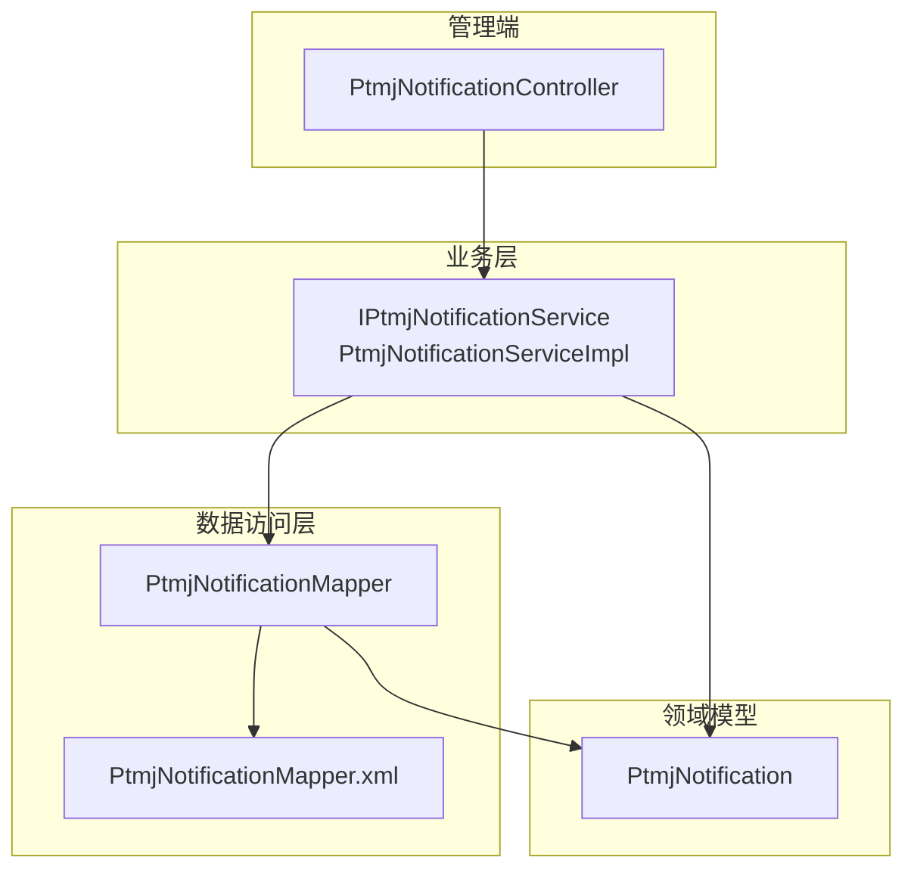
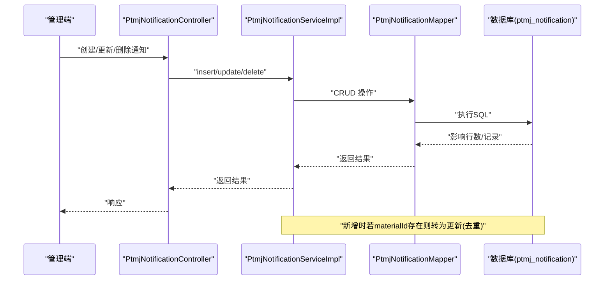
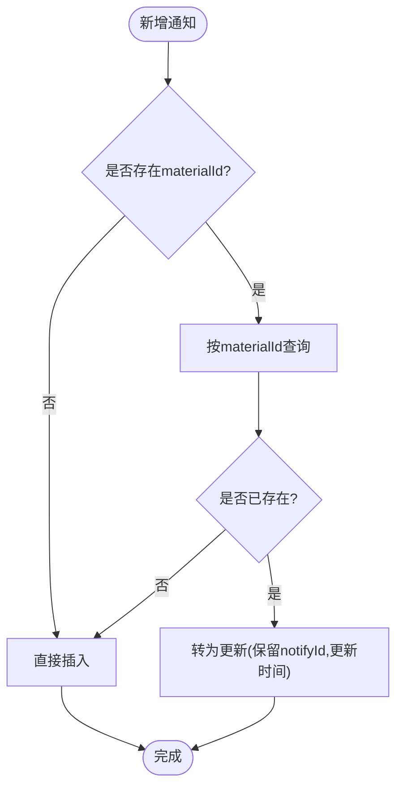
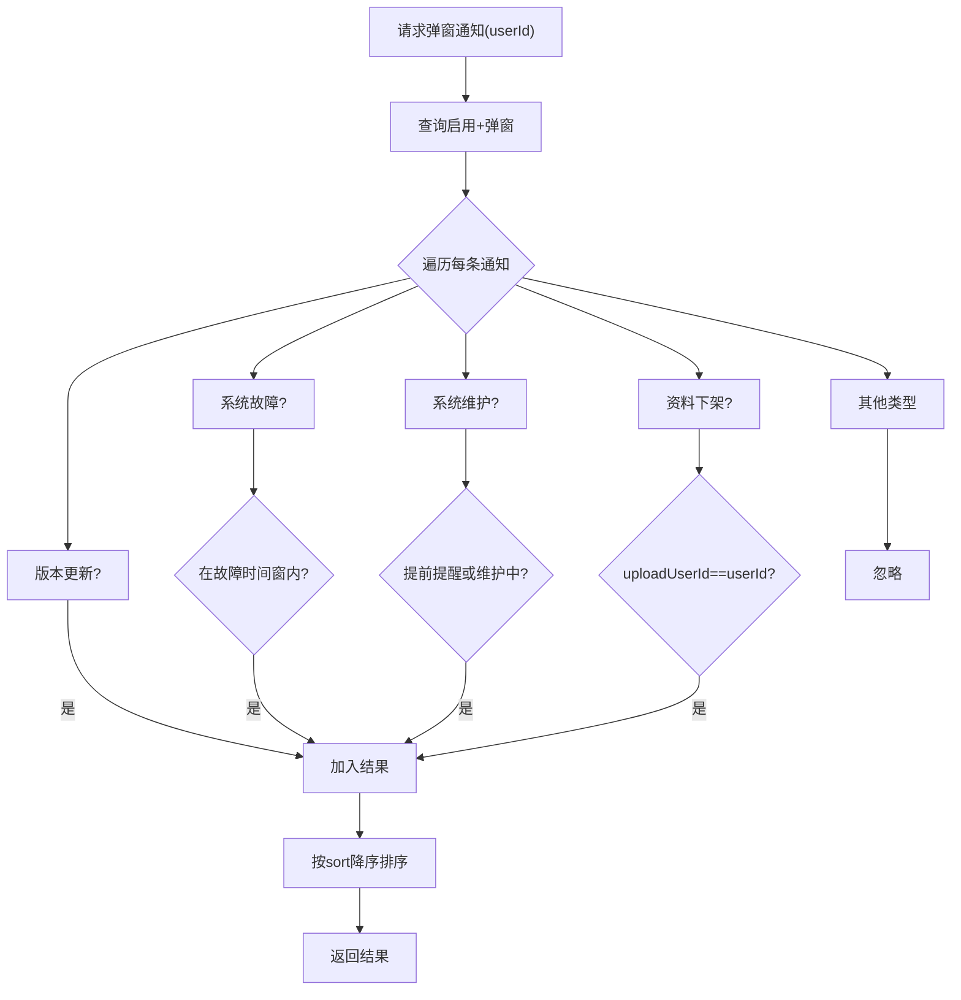
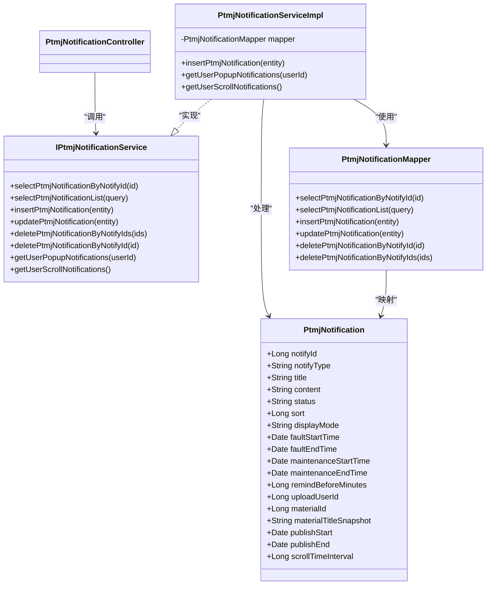

# 通知推送系统

<cite>
**本文引用的文件**   
- [PtmjNotification.java](file://PezMax-Backend/ptmj-datum/src/main/java/com/ptmj/datum/domain/PtmjNotification.java)
- [PtmjNotificationMapper.java](file://PezMax-Backend/ptmj-datum/src/main/java/com/ptmj/datum/mapper/PtmjNotificationMapper.java)
- [PtmjNotificationServiceImpl.java](file://PezMax-Backend/ptmj-datum/src/main/java/com/ptmj/datum/service/impl/PtmjNotificationServiceImpl.java)
- [IPtmjNotificationService.java](file://PezMax-Backend/ptmj-datum/src/main/java/com/ptmj/datum/service/IPtmjNotificationService.java)
- [PtmjNotificationMapper.xml](file://PezMax-Backend/ptmj-datum/src/main/resources/mapper/datum/PtmjNotificationMapper.xml)
- [PtmjNotificationController.java](file://PezMax-Backend/ruoyi-admin/src/main/java/com/ruoyi/web/controller/datum/PtmjNotificationController.java)
</cite>

## 目录
1. [简介](#简介)
2. [项目结构](#项目结构)
3. [核心组件](#核心组件)
4. [架构总览](#架构总览)
5. [详细组件分析](#详细组件分析)
6. [依赖关系分析](#依赖关系分析)
7. [性能与扩展性](#性能与扩展性)
8. [故障排查指南](#故障排查指南)
9. [结论](#结论)
10. [附录](#附录)

## 简介
本文件系统化梳理 PezMax-One 的通知推送体系，围绕“通知类型设计、存储与管理、展示与过滤、优先级策略、模板与定时能力”等维度展开。当前仓库已实现后端通知数据模型、持久化与查询服务，以及面向客户端的弹窗与滚动通知筛选逻辑；同时预留了管理员端控制器接口，便于后续接入站内信、桌面通知、邮件等渠道。

## 项目结构
通知相关代码位于后端模块 ptmj-datum（领域模型、映射与服务）与 ruoyi-admin（管理端控制器）。整体采用分层架构：Controller -> Service -> Mapper -> XML SQL。

图表来源
- [PtmjNotificationController.java](file://PezMax-Backend/ruoyi-admin/src/main/java/com/ruoyi/web/controller/datum/PtmjNotificationController.java)
- [IPtmjNotificationService.java](file://PezMax-Backend/ptmj-datum/src/main/java/com/ptmj/datum/service/IPtmjNotificationService.java)
- [PtmjNotificationServiceImpl.java](file://PezMax-Backend/ptmj-datum/src/main/java/com/ptmj/datum/service/impl/PtmjNotificationServiceImpl.java)
- [PtmjNotificationMapper.java](file://PezMax-Backend/ptmj-datum/src/main/java/com/ptmj/datum/mapper/PtmjNotificationMapper.java)
- [PtmjNotificationMapper.xml](file://PezMax-Backend/ptmj-datum/src/main/resources/mapper/datum/PtmjNotificationMapper.xml)
- [PtmjNotification.java](file://PezMax-Backend/ptmj-datum/src/main/java/com/ptmj/datum/domain/PtmjNotification.java)

章节来源
- [PtmjNotificationController.java](file://PezMax-Backend/ruoyi-admin/src/main/java/com/ruoyi/web/controller/datum/PtmjNotificationController.java)
- [PtmjNotificationServiceImpl.java](file://PezMax-Backend/ptmj-datum/src/main/java/com/ptmj/datum/service/impl/PtmjNotificationServiceImpl.java)
- [PtmjNotificationMapper.xml](file://PezMax-Backend/ptmj-datum/src/main/resources/mapper/datum/PtmjNotificationMapper.xml)

## 核心组件
- 领域模型 PtmjNotification：定义通知类型、标题正文、状态、优先级、展示形态、时间窗口、受众与滚动参数等字段，支撑多类通知场景。
- 服务接口 IPtmjNotificationService：提供 CRUD 与两类用户端聚合查询（弹窗/滚动）。
- 服务实现 PtmjNotificationServiceImpl：封装业务规则，包括资料下架通知去重、按类型与时间窗口的过滤、按优先级排序等。
- 数据访问 PtmjNotificationMapper + XML：提供基础 CRUD 与动态条件查询（支持按标题模糊匹配、展示形态、材料ID、故障/维护时间段交集等）。
- 管理端控制器 PtmjNotificationController：对外暴露通知管理能力（增删改查、批量删除等），为运营与运维提供入口。

章节来源
- [PtmjNotification.java](file://PezMax-Backend/ptmj-datum/src/main/java/com/ptmj/datum/domain/PtmjNotification.java)
- [IPtmjNotificationService.java](file://PezMax-Backend/ptmj-datum/src/main/java/com/ptmj/datum/service/IPtmjNotificationService.java)
- [PtmjNotificationServiceImpl.java](file://PezMax-Backend/ptmj-datum/src/main/java/com/ptmj/datum/service/impl/PtmjNotificationServiceImpl.java)
- [PtmjNotificationMapper.java](file://PezMax-Backend/ptmj-datum/src/main/java/com/ptmj/datum/mapper/PtmjNotificationMapper.java)
- [PtmjNotificationMapper.xml](file://PezMax-Backend/ptmj-datum/src/main/resources/mapper/datum/PtmjNotificationMapper.xml)
- [PtmjNotificationController.java](file://PezMax-Backend/ruoyi-admin/src/main/java/com/ruoyi/web/controller/datum/PtmjNotificationController.java)

## 架构总览
下图展示了从管理端到数据层的调用链路，以及服务端对不同类型通知的过滤与排序策略。

图表来源
- [PtmjNotificationController.java](file://PezMax-Backend/ruoyi-admin/src/main/java/com/ruoyi/web/controller/datum/PtmjNotificationController.java)
- [PtmjNotificationServiceImpl.java](file://PezMax-Backend/ptmj-datum/src/main/java/com/ptmj/datum/service/impl/PtmjNotificationServiceImpl.java)
- [PtmjNotificationMapper.java](file://PezMax-Backend/ptmj-datum/src/main/java/com/ptmj/datum/mapper/PtmjNotificationMapper.java)
- [PtmjNotificationMapper.xml](file://PezMax-Backend/ptmj-datum/src/main/resources/mapper/datum/PtmjNotificationMapper.xml)

## 详细组件分析

### 通知类型与展示形态
- 通知类型
  - 版本更新：强制提示，无需时间窗限制。
  - 系统故障：需在故障开始时间之后且未过结束时间（可为空表示持续）。
  - 系统维护：支持提前提醒与维护期间展示，默认提前分钟数为60。
  - 资料下架：仅向指定上传者展示，并携带被下架资料快照标题。
  - 日常滚动：仅在发布起止时间内生效，用于滚动字幕。
- 展示形态
  - 弹窗：面向重要或紧急信息，结合优先级排序。
  - 滚动字幕：面向日常公告，按时间窗控制可见性。

章节来源
- [PtmjNotification.java](file://PezMax-Backend/ptmj-datum/src/main/java/com/ptmj/datum/domain/PtmjNotification.java)
- [PtmjNotificationServiceImpl.java](file://PezMax-Backend/ptmj-datum/src/main/java/com/ptmj/datum/service/impl/PtmjNotificationServiceImpl.java)

### 存储与管理机制
- 持久化表：ptmj_notification，包含通知类型、标题、正文、状态、优先级、展示形态、各类时间窗、受众与滚动参数等。
- 管理端能力：通过 Controller 暴露标准 CRUD 与批量删除，便于运营配置。
- 查询能力：支持按标题模糊、展示形态、材料ID、故障/维护时间段交集等条件检索。
- 去重策略：当 materialId 非空时，新增会先检查是否已有同材料通知，若有则转为更新，避免重复。

图表来源
- [PtmjNotificationServiceImpl.java](file://PezMax-Backend/ptmj-datum/src/main/java/com/ptmj/datum/service/impl/PtmjNotificationServiceImpl.java)
- [PtmjNotificationMapper.xml](file://PezMax-Backend/ptmj-datum/src/main/resources/mapper/datum/PtmjNotificationMapper.xml)

章节来源
- [PtmjNotificationMapper.xml](file://PezMax-Backend/ptmj-datum/src/main/resources/mapper/datum/PtmjNotificationMapper.xml)
- [PtmjNotificationServiceImpl.java](file://PezMax-Backend/ptmj-datum/src/main/java/com/ptmj/datum/service/impl/PtmjNotificationServiceImpl.java)

### 用户端获取与过滤流程
- 弹窗通知：只取启用且展示形态为弹窗的记录，再按类型进行时间窗与受众过滤，最后按 sort 降序排列。
- 滚动通知：只取启用且展示形态为滚动的记录，再按类型=日常滚动及发布起止时间过滤。

图表来源
- [PtmjNotificationServiceImpl.java](file://PezMax-Backend/ptmj-datum/src/main/java/com/ptmj/datum/service/impl/PtmjNotificationServiceImpl.java)

章节来源
- [PtmjNotificationServiceImpl.java](file://PezMax-Backend/ptmj-datum/src/main/java/com/ptmj/datum/service/impl/PtmjNotificationServiceImpl.java)

### 数据结构与复杂度
- 数据结构：单条通知实体包含类型、内容、状态、优先级、展示形态、时间窗、受众与滚动参数等字段，满足多场景表达。
- 查询复杂度：列表查询基于 MyBatis 动态 SQL，常见过滤条件为常量级判断；流式过滤与排序在服务端内存中进行，时间复杂度近似 O(n log n)。
- 优化建议：对高频查询字段建立索引（如 status、display_mode、notify_type、publish_start/publish_end、fault_start_time/fault_end_time、maintenance_start_time/maintenance_end_time、upload_user_id、material_id），以降低 IO 成本。

章节来源
- [PtmjNotification.java](file://PezMax-Backend/ptmj-datum/src/main/java/com/ptmj/datum/domain/PtmjNotification.java)
- [PtmjNotificationMapper.xml](file://PezMax-Backend/ptmj-datum/src/main/resources/mapper/datum/PtmjNotificationMapper.xml)
- [PtmjNotificationServiceImpl.java](file://PezMax-Backend/ptmj-datum/src/main/java/com/ptmj/datum/service/impl/PtmjNotificationServiceImpl.java)

### 推送渠道集成现状与建议
- 现状：当前仓库未实现具体推送通道（站内信、桌面通知、邮件等）的代码，但提供了完善的数据模型与管理端接口，可作为统一通知源。
- 建议方案：
  - 站内信：由前端轮询或 WebSocket 拉取弹窗/滚动通知列表，渲染至 UI。
  - 桌面通知：Electron 主进程监听新通知事件后调用系统通知 API。
  - 邮件通知：针对特定类型（如资料下架）异步发送邮件，可复用现有队列或任务调度。
  - 去重与幂等：以 notify_id 作为幂等键，确保多次投递不重复。
  - 用户偏好：可在用户侧缓存“已读/屏蔽”标记，结合服务端“已读未读”记录做最终决策。

[本节为概念性说明，不直接分析具体文件]

### 模板管理与高级功能
- 模板管理：可将 title/content 抽象为模板变量，在创建通知时填充（例如版本号、材料标题快照等）。
- 定时推送：利用 Quartz 或 Spring Task 扫描即将进入时间窗的通知，生成待推送清单。
- 批量发送：对同一批用户（如全体用户或某角色）批量写入或触发推送任务，注意限流与重试。
- 历史查询：基于现有列表查询能力，增加分页与时间范围，即可实现历史回溯。

[本节为概念性说明，不直接分析具体文件]

## 依赖关系分析
- 组件耦合：Controller 依赖 Service，Service 依赖 Mapper 与领域模型，Mapper 依赖 XML 中的 SQL 定义。
- 外部依赖：MyBatis、Spring、日志框架、日期工具等。
- 潜在风险：大量内存过滤可能在高并发下带来 CPU 压力，应配合数据库侧过滤与索引优化。

图表来源
- [PtmjNotification.java](file://PezMax-Backend/ptmj-datum/src/main/java/com/ptmj/datum/domain/PtmjNotification.java)
- [IPtmjNotificationService.java](file://PezMax-Backend/ptmj-datum/src/main/java/com/ptmj/datum/service/IPtmjNotificationService.java)
- [PtmjNotificationServiceImpl.java](file://PezMax-Backend/ptmj-datum/src/main/java/com/ptmj/datum/service/impl/PtmjNotificationServiceImpl.java)
- [PtmjNotificationMapper.java](file://PezMax-Backend/ptmj-datum/src/main/java/com/ptmj/datum/mapper/PtmjNotificationMapper.java)
- [PtmjNotificationController.java](file://PezMax-Backend/ruoyi-admin/src/main/java/com/ruoyi/web/controller/datum/PtmjNotificationController.java)

章节来源
- [PtmjNotificationServiceImpl.java](file://PezMax-Backend/ptmj-datum/src/main/java/com/ptmj/datum/service/impl/PtmjNotificationServiceImpl.java)
- [PtmjNotificationMapper.java](file://PezMax-Backend/ptmj-datum/src/main/java/com/ptmj/datum/mapper/PtmjNotificationMapper.java)
- [PtmjNotificationController.java](file://PezMax-Backend/ruoyi-admin/src/main/java/com/ruoyi/web/controller/datum/PtmjNotificationController.java)

## 性能与扩展性
- 查询优化：将常用过滤条件下沉到 SQL（XML 已支持部分动态条件），并对关键字段加索引。
- 内存计算：当前弹窗/滚动过滤在服务端内存中进行，建议在数据量大时改为数据库侧过滤或引入缓存（如 Redis）预计算热点集合。
- 去重与幂等：以 materialId 为业务键的去重已在新增路径实现；可扩展为全局唯一键（如 notify_id）保证幂等。
- 扩展点：在 Service 层增加“渠道分发器”，根据 notifyType 路由到不同推送通道，保持高内聚低耦合。

[本节为通用指导，不直接分析具体文件]

## 故障排查指南
- 新增失败：检查 insert 动态 SQL 字段是否为空导致缺失列；确认 useGeneratedKeys 是否正确回填主键。
- 更新未生效：确认 update 动态 SET 片段是否包含必要字段；核对 where 条件 notify_id 是否正确。
- 列表为空：检查 status 与 display_mode 过滤条件；确认时间窗字段是否符合预期。
- 去重异常：核查 materialId 是否一致；确认 select 条件是否命中既有记录。
- 排序不符合预期：确认 sort 值大小与排序方向（当前为降序）。

章节来源
- [PtmjNotificationMapper.xml](file://PezMax-Backend/ptmj-datum/src/main/resources/mapper/datum/PtmjNotificationMapper.xml)
- [PtmjNotificationServiceImpl.java](file://PezMax-Backend/ptmj-datum/src/main/java/com/ptmj/datum/service/impl/PtmjNotificationServiceImpl.java)

## 结论
当前通知系统在后端已完成“模型-服务-持久化-管理端”闭环，具备多类型通知、时间窗控制、优先级排序与去重等关键能力。下一步可在此基础上扩展多渠道推送、用户偏好与已读未读状态、模板化与定时任务，并通过索引与缓存提升大规模场景下的性能表现。

[本节为总结性内容，不直接分析具体文件]

## 附录
- 字段与含义参考：见领域模型文件。
- 管理端接口参考：见控制器文件。
- SQL 映射参考：见 MyBatis XML 文件。

章节来源
- [PtmjNotification.java](file://PezMax-Backend/ptmj-datum/src/main/java/com/ptmj/datum/domain/PtmjNotification.java)
- [PtmjNotificationController.java](file://PezMax-Backend/ruoyi-admin/src/main/java/com/ruoyi/web/controller/datum/PtmjNotificationController.java)
- [PtmjNotificationMapper.xml](file://PezMax-Backend/ptmj-datum/src/main/resources/mapper/datum/PtmjNotificationMapper.xml)