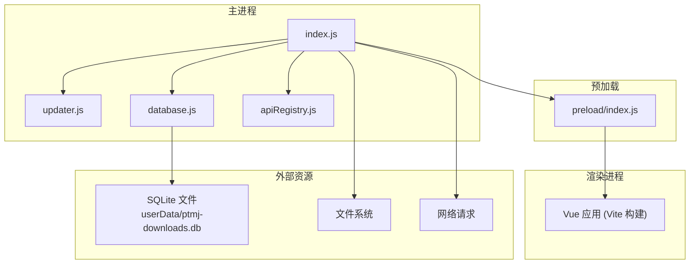
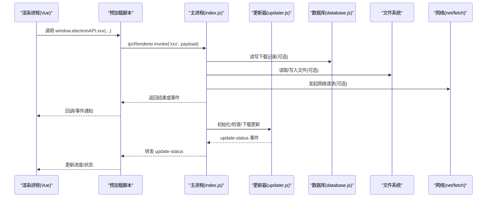
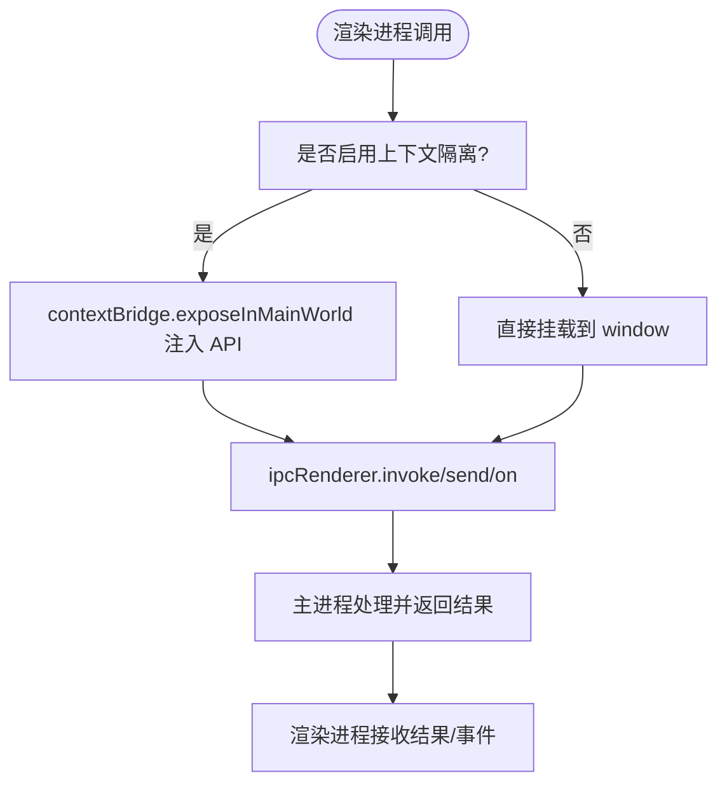
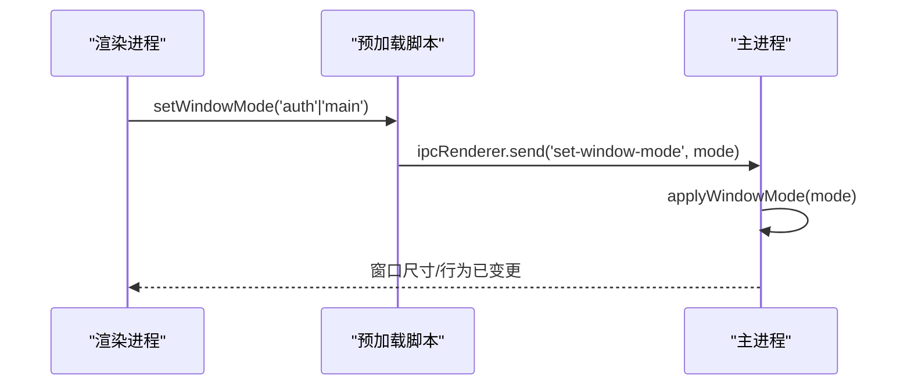
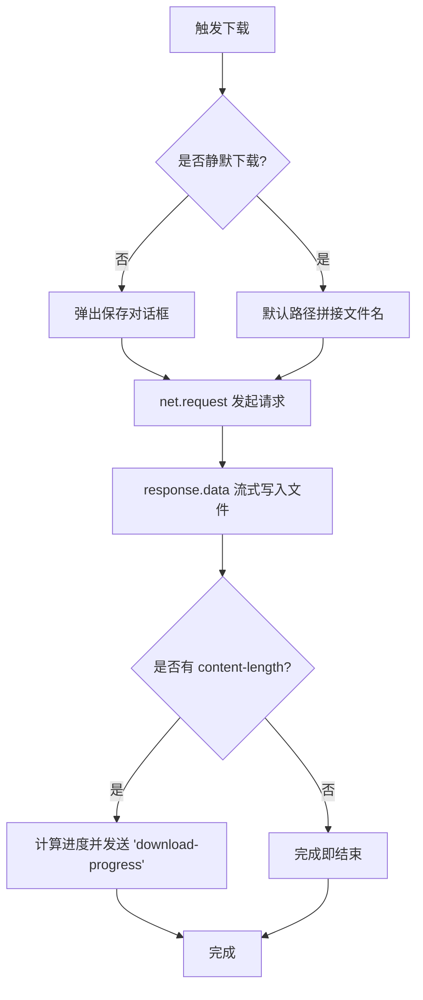
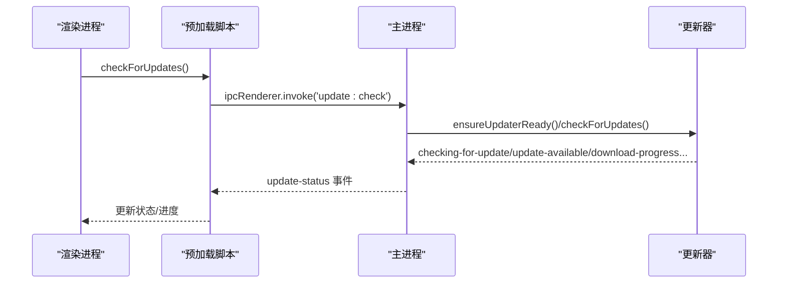
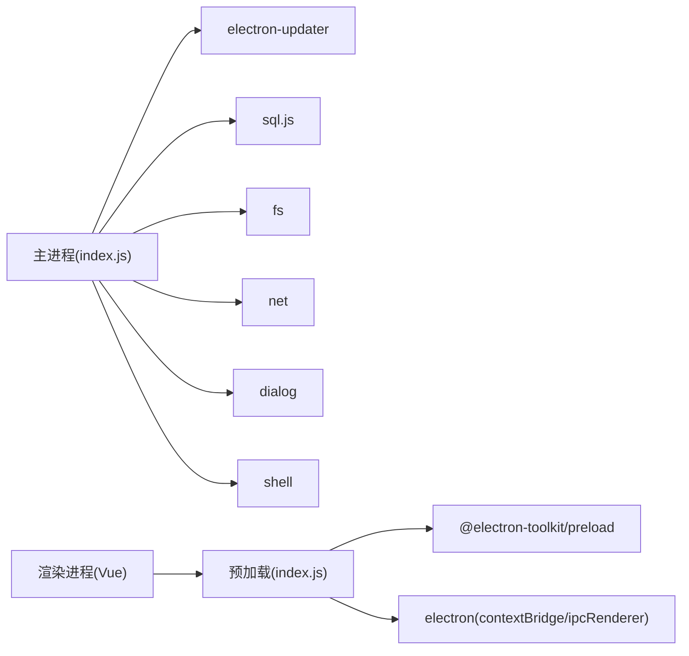

# Electron 架构设计

<cite>
**本文引用的文件**   
- [src/main/index.js](file://PezMax-Desktop/src/main/index.js)
- [src/preload/index.js](file://PezMax-Desktop/src/preload/index.js)
- [package.json](file://PezMax-Desktop/package.json)
- [electron.vite.config.mjs](file://PezMax-Desktop/electron.vite.config.mjs)
- [src/main/main-utils/apiRegistry.js](file://PezMax-Desktop/src/main/main-utils/apiRegistry.js)
- [src/main/main-utils/database.js](file://PezMax-Desktop/src/main/main-utils/database.js)
- [src/main/main-utils/updater.js](file://PezMax-Desktop/src/main/main-utils/updater.js)
</cite>

## 目录
1. [简介](#简介)
2. [项目结构](#项目结构)
3. [核心组件](#核心组件)
4. [架构总览](#架构总览)
5. [详细组件分析](#详细组件分析)
6. [依赖关系分析](#依赖关系分析)
7. [性能与内存特性](#性能与内存特性)
8. [故障排查指南](#故障排查指南)
9. [结论](#结论)
10. [附录](#附录)

## 简介
本文件面向使用 Electron 构建桌面应用的技术团队，围绕主进程与渲染进程的分离架构、进程生命周期管理、内存隔离与安全模型、预加载脚本与上下文隔离配置、窗口管理系统（多窗口支持、状态监听、尺寸控制、主题切换）、以及开发/生产环境下的最佳实践进行系统化说明。文档同时提供架构图与数据流图，帮助读者快速理解各组件间的交互关系。

## 项目结构
本项目采用 electron-vite 工程化方案，将主进程、预加载脚本与渲染进程代码分目录组织：
- 主进程入口位于 src/main/index.js，负责窗口创建、IPC 路由、系统能力调用、更新机制、下载与本地存储等。
- 预加载脚本位于 src/preload/index.js，通过 contextBridge 暴露最小 API 给渲染进程。
- 渲染进程基于 Vue 3 + Vite，打包输出到 out/renderer。
- 构建与开发配置集中在 electron.vite.config.mjs。
- 包管理与脚本定义在 package.json。
- 主进程工具模块位于 src/main/main-utils，包含 API 注册表、SQLite 本地数据库、自动更新与快捷方式管理等。

图表来源
- [src/main/index.js:1-20](file://PezMax-Desktop/src/main/index.js#L1-L20)
- [src/preload/index.js:1-20](file://PezMax-Desktop/src/preload/index.js#L1-L20)
- [src/main/main-utils/updater.js:1-40](file://PezMax-Desktop/src/main/main-utils/updater.js#L1-L40)
- [src/main/main-utils/database.js:1-30](file://PezMax-Desktop/src/main/main-utils/database.js#L1-L30)
- [src/main/main-utils/apiRegistry.js:1-21](file://PezMax-Desktop/src/main/main-utils/apiRegistry.js#L1-L21)

章节来源
- [package.json:1-27](file://PezMax-Desktop/package.json#L1-L27)
- [electron.vite.config.mjs:1-40](file://PezMax-Desktop/electron.vite.config.mjs#L1-L40)

## 核心组件
- 主进程入口 index.js
  - 应用生命周期与窗口创建
  - IPC 路由与处理（设置、下载、上传、缓存清理、窗口控制）
  - 全局快捷键与开机自启
  - 版本更新集成与快捷方式重建
- 预加载脚本 preload/index.js
  - 通过 contextBridge 暴露安全 API 给渲染进程
  - 封装 ipcRenderer.invoke/send/on 调用
- 本地数据库 database.js
  - 基于 sql.js 的 SQLite 实现，持久化下载记录
- 自动更新 updater.js
  - 支持 GitHub/Generic 源，环境变量/配置文件/用户覆盖的多级解析
  - 事件驱动的状态广播与安装流程
- API 注册表 apiRegistry.js
  - 预留按名称查找 API 的能力，便于扩展主进程服务

章节来源
- [src/main/index.js:217-290](file://PezMax-Desktop/src/main/index.js#L217-L290)
- [src/preload/index.js:10-57](file://PezMax-Desktop/src/preload/index.js#L10-L57)
- [src/main/main-utils/database.js:1-56](file://PezMax-Desktop/src/main/main-utils/database.js#L1-L56)
- [src/main/main-utils/updater.js:119-204](file://PezMax-Desktop/src/main/main-utils/updater.js#L119-L204)
- [src/main/main-utils/apiRegistry.js:8-21](file://PezMax-Desktop/src/main/main-utils/apiRegistry.js#L8-L21)

## 架构总览
下图展示主进程、预加载脚本与渲染进程之间的交互关系，以及关键子系统（更新、下载、本地存储）的位置。

图表来源
- [src/main/index.js:293-305](file://PezMax-Desktop/src/main/index.js#L293-L305)
- [src/preload/index.js:14-46](file://PezMax-Desktop/src/preload/index.js#L14-L46)
- [src/main/main-utils/updater.js:167-253](file://PezMax-Desktop/src/main/main-utils/updater.js#L167-L253)
- [src/main/main-utils/database.js:87-147](file://PezMax-Desktop/src/main/main-utils/database.js#L87-L147)

## 详细组件分析

### 主进程与渲染进程分离架构
- 进程边界
  - 主进程负责系统能力（窗口、文件系统、网络、全局快捷键、更新）。
  - 渲染进程仅运行前端代码，通过预加载脚本暴露的最小 API 访问主进程能力。
- 生命周期管理
  - app.whenReady() 后创建窗口、注册 IPC、初始化更新器与全局快捷键。
  - app.on('window-all-closed') 在非 macOS 平台退出；macOS 下保持活跃直到显式退出。
  - app.on('activate') 在无窗口时重新创建主窗口。
- 内存隔离机制
  - 通过 contextIsolation: true 与 nodeIntegration: false 确保渲染进程无法直接访问 Node 环境。
  - 所有系统能力均通过预加载脚本以白名单形式暴露，避免任意执行。
- 安全模型
  - sandbox: false 用于兼容部分功能（如 PDF 插件预览），但配合 contextIsolation 与禁用 Node 集成降低风险。
  - webSecurity: false 允许从 file:// 协议跨域访问远程 API，需结合后端鉴权与严格输入校验。
  - allowRunningInsecureContent: true 允许在 file:// 中加载 http 内容，建议仅在受控场景启用。
  - setWindowOpenHandler 拦截新窗口打开，统一由 shell.openExternal 处理，防止意外导航。

章节来源
- [src/main/index.js:217-242](file://PezMax-Desktop/src/main/index.js#L217-L242)
- [src/main/index.js:251-254](file://PezMax-Desktop/src/main/index.js#L251-L254)
- [src/main/index.js:318-327](file://PezMax-Desktop/src/main/index.js#L318-L327)
- [src/main/index.js:891-898](file://PezMax-Desktop/src/main/index.js#L891-L898)
- [src/main/index.js:913-917](file://PezMax-Desktop/src/main/index.js#L913-L917)

### 预加载脚本与上下文隔离配置
- 作用
  - 作为“可信桥”，将有限的 Electron API 暴露给渲染进程。
  - 封装 IPC 调用，统一管理错误与事件订阅。
- 上下文隔离配置
  - 主进程开启 contextIsolation: true，预加载脚本通过 contextBridge.exposeInMainWorld 注入对象。
  - 当 process.contextIsolated 为真时，使用 contextBridge；否则回退到全局挂载（兼容旧模式）。
- 暴露的 API 示例
  - callApi、selectFile、uploadFile、cancelUpload、selectFolder、readFolderPath
  - windowControl、setWindowMode、onWindowMaximized
  - getSettings、saveSettings、getAppVersion、clearAppCache、openPath
  - downloadFileDirectly、onDownloadProgress
  - 更新相关：getUpdateInfo、checkForUpdates、downloadUpdate、quitAndInstallUpdate、onUpdateStatus
  - 本地下载记录：list/add/delete/flush/checkFiles/deleteLocalFile

图表来源
- [src/preload/index.js:10-24](file://PezMax-Desktop/src/preload/index.js#L10-L24)
- [src/preload/index.js:25-57](file://PezMax-Desktop/src/preload/index.js#L25-L57)

章节来源
- [src/preload/index.js:1-65](file://PezMax-Desktop/src/preload/index.js#L1-L65)

### 为什么关闭沙箱与禁用 Node 集成
- 关闭沙箱(sandbox: false)
  - 目的：启用浏览器插件支持（例如原生 PDF 预览），某些 Electron 功能在沙箱模式下受限。
  - 风险：沙箱会限制 Node 与 WebAssembly 等能力，关闭后需更严格的上下文隔离与白名单暴露。
- 禁用 Node 集成(nodeIntegration: false)
  - 目的：阻止渲染进程直接访问 Node 模块，避免任意代码执行风险。
  - 替代：通过预加载脚本以最小权限暴露必要能力。
- 综合权衡
  - 在需要插件或特定能力的场景下，可考虑关闭沙箱，但必须配合 contextIsolation: true 与 nodeIntegration: false，并对所有暴露 API 做严格校验与审计。

章节来源
- [src/main/index.js:233-241](file://PezMax-Desktop/src/main/index.js#L233-L241)

### 窗口管理系统
- 多窗口支持
  - 当前实现单窗口为主，但通过 BrowserWindow.getAllWindows 与 fromWebContents 获取当前窗口，具备扩展到多窗口的能力。
- 窗口状态监听
  - 监听 maximize/unmaximize 事件，并通过 IPC 向渲染进程发送 window-maximized 状态。
- 尺寸控制与模式切换
  - 认证页固定尺寸且不可拖拽缩放，主页面支持自由调整大小与最大化。
  - applyWindowMode 根据 mode 动态设置 resizable/maximizable/fullscreenable/min/max size，并在切换时居中窗口。
- 主题切换
  - 启动前读取 settings.theme，提前设置 backgroundColor，避免启动闪烁。
  - 保存设置后同步更新全局快捷键与自启项。

图表来源
- [src/main/index.js:182-213](file://PezMax-Desktop/src/main/index.js#L182-L213)
- [src/main/index.js:633-637](file://PezMax-Desktop/src/main/index.js#L633-L637)
- [src/preload/index.js:23](file://PezMax-Desktop/src/preload/index.js#L23)

章节来源
- [src/main/index.js:257-263](file://PezMax-Desktop/src/main/index.js#L257-L263)
- [src/main/index.js:121-147](file://PezMax-Desktop/src/main/index.js#L121-L147)
- [src/main/index.js:92-93](file://PezMax-Desktop/src/main/index.js#L92-L93)

### 下载与本地存储
- 直写下载
  - 使用 net.request 建立连接，响应流式写入磁盘，计算进度并通过 IPC 推送至渲染进程。
  - 支持静默下载与对话框选择路径两种模式，失败时清理残余文件。
- 本地下载记录
  - 基于 sql.js 的 SQLite 数据库，持久化到 userData 目录。
  - 提供 list/add/delete/flush/checkFiles/deleteLocalFile 等接口，支持批量刷盘优化 IO。
- 文件选择与文件夹遍历
  - 支持选择单个文件与文件夹，递归读取文件夹内容并以 webkitRelativePath 规范返回。

图表来源
- [src/main/index.js:528-608](file://PezMax-Desktop/src/main/index.js#L528-L608)
- [src/main/main-utils/database.js:87-147](file://PezMax-Desktop/src/main/main-utils/database.js#L87-L147)

章节来源
- [src/main/index.js:528-608](file://PezMax-Desktop/src/main/index.js#L528-L608)
- [src/main/main-utils/database.js:1-56](file://PezMax-Desktop/src/main/main-utils/database.js#L1-L56)

### 自动更新与快捷方式管理
- 更新源解析优先级
  - 用户手动配置 > 环境变量 > 配置文件(electron-builder.yml/dev-app-update.yml/app-update.yml) > 未配置。
- 事件驱动状态广播
  - 检查/可用/不可用/下载进度/下载完成/错误等状态通过 update-status 事件推送至渲染进程。
- 快捷方式重建
  - Windows 平台在更新前保存桌面快捷方式存在状态，更新后尝试重建，提升用户体验。

图表来源
- [src/main/main-utils/updater.js:119-204](file://PezMax-Desktop/src/main/main-utils/updater.js#L119-L204)
- [src/main/main-utils/updater.js:206-253](file://PezMax-Desktop/src/main/main-utils/updater.js#L206-L253)
- [src/main/main-utils/updater.js:319-348](file://PezMax-Desktop/src/main/main-utils/updater.js#L319-L348)
- [src/main/main-utils/updater.js:505-532](file://PezMax-Desktop/src/main/main-utils/updater.js#L505-L532)

章节来源
- [src/main/main-utils/updater.js:1-40](file://PezMax-Desktop/src/main/main-utils/updater.js#L1-L40)
- [src/main/main-utils/updater.js:395-532](file://PezMax-Desktop/src/main/main-utils/updater.js#L395-L532)

### 开发环境与生产环境配置
- 开发环境
  - electron-vite 提供 dev 命令，支持热重载与代理转发。
  - renderer.server.proxy 将 /dev-api 转发到后端地址，便于联调。
  - 开发时可启用 DevTools 快捷键，便于调试。
- 生产环境
  - 构建产物输出到 out/renderer，静态资源命名带 hash，利于缓存。
  - 压缩插件在生产构建时启用，减少体积。
  - 更新检查与安装需在打包环境下生效。

章节来源
- [electron.vite.config.mjs:71-86](file://PezMax-Desktop/electron.vite.config.mjs#L71-L86)
- [electron.vite.config.mjs:87-100](file://PezMax-Desktop/electron.vite.config.mjs#L87-L100)
- [package.json:11-26](file://PezMax-Desktop/package.json#L11-L26)

## 依赖关系分析
- 主进程依赖
  - electron-updater：自动更新
  - sql.js：SQLite 本地数据库
  - fs/net/dialog/shell：文件系统、网络、对话框、系统外壳
- 预加载脚本依赖
  - @electron-toolkit/preload：通用预加载 API
  - electron：contextBridge/ipcRenderer
- 渲染进程依赖
  - Vue 3、Vite、Pinia、Element Plus 等前端生态

图表来源
- [package.json:28-53](file://PezMax-Desktop/package.json#L28-L53)
- [src/main/index.js:1-9](file://PezMax-Desktop/src/main/index.js#L1-L9)
- [src/preload/index.js:1-3](file://PezMax-Desktop/src/preload/index.js#L1-L3)

章节来源
- [package.json:28-53](file://PezMax-Desktop/package.json#L28-L53)

## 性能与内存特性
- 流式下载
  - 使用 net.request 的 response 流式写入磁盘，避免一次性加载大文件到内存，降低峰值内存占用。
- 批量刷盘
  - 下载记录插入后延迟 flushDb，减少频繁磁盘 IO，提高批量操作性能。
- 构建优化
  - 生产构建启用压缩与 chunk 拆分，减小首屏加载体积。
- 窗口背景色预置
  - 启动前读取 theme 设置并设置 backgroundColor，避免首次渲染白屏闪烁。

[本节为通用性能讨论，不直接分析具体文件]

## 故障排查指南
- 未捕获异常与 Promise 拒绝
  - 主进程监听 uncaughtException 与 unhandledRejection，打印堆栈便于定位问题。
- 更新失败
  - 检查更新源配置（环境变量/配置文件/用户覆盖），确认是否在打包环境测试。
  - 关注 update-status 事件中的 message 字段，定位错误原因。
- 下载失败
  - 检查服务器返回状态码与 content-length 头，确认网络连通性与鉴权头是否正确。
  - 失败时会清理残余文件，检查目标目录权限与磁盘空间。
- 窗口尺寸异常
  - 确认 setWindowMode 调用时机与参数，检查 applyWindowMode 设置的 min/max 尺寸是否合理。

章节来源
- [src/main/index.js:902-908](file://PezMax-Desktop/src/main/index.js#L902-L908)
- [src/main/main-utils/updater.js:248-253](file://PezMax-Desktop/src/main/main-utils/updater.js#L248-L253)
- [src/main/index.js:588-595](file://PezMax-Desktop/src/main/index.js#L588-L595)
- [src/main/index.js:182-213](file://PezMax-Desktop/src/main/index.js#L182-L213)

## 结论
本项目通过主进程与渲染进程的清晰分离、预加载脚本的安全桥接、严格的上下文隔离与最小权限暴露，构建了稳健的桌面应用架构。窗口管理、下载与本地存储、自动更新等功能在主进程中集中实现，既保证了安全性，又提升了用户体验。建议在后续迭代中持续评估安全配置（尤其是 webSecurity 与沙箱开关），并结合业务需求完善多窗口支持与更细粒度的权限控制。

[本节为总结性内容，不直接分析具体文件]

## 附录
- 最佳实践清单
  - 始终启用 contextIsolation: true 与 nodeIntegration: false。
  - 谨慎关闭沙箱，仅在必要时启用，并确保所有暴露 API 经过严格校验。
  - 对 webSecurity 与 allowRunningInsecureContent 的使用进行风险评估与审计。
  - 使用预加载脚本集中管理 IPC 调用，避免在渲染进程直接耦合主进程细节。
  - 生产环境启用构建压缩与资源哈希，合理设置缓存策略。
  - 更新检查与安装需在打包环境下验证，避免开发环境误判。

[本节为通用指导，不直接分析具体文件]