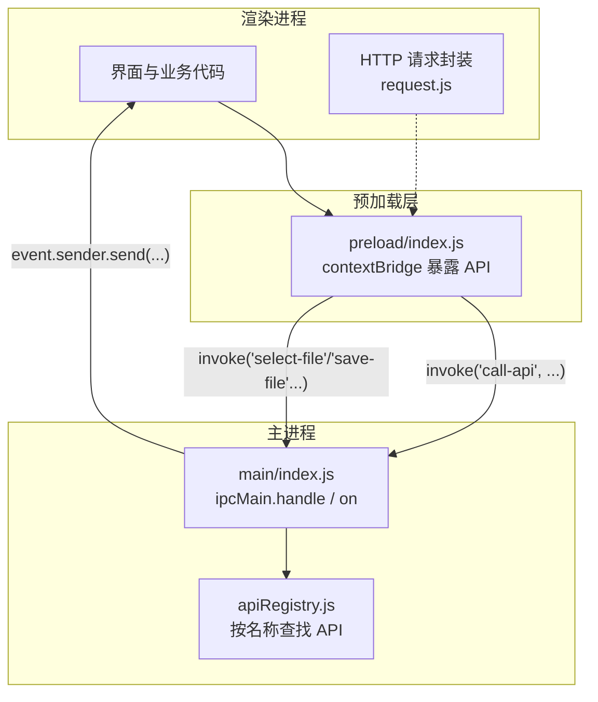
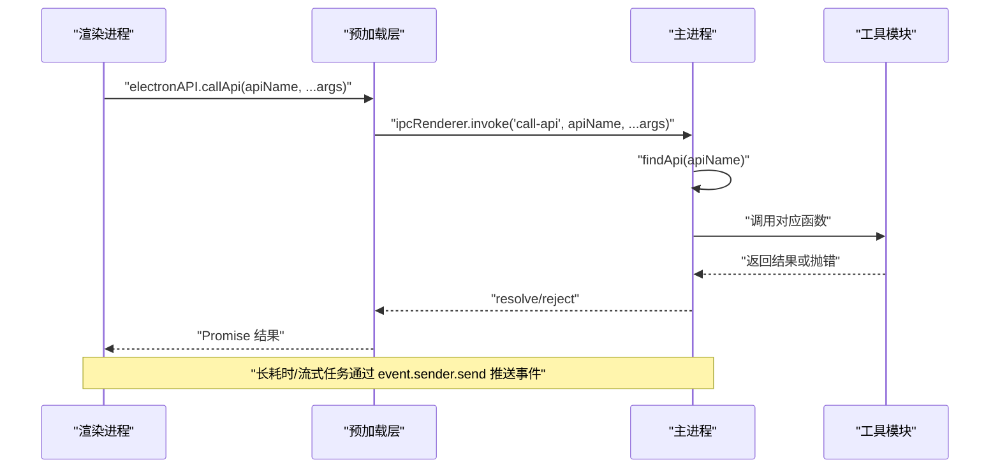
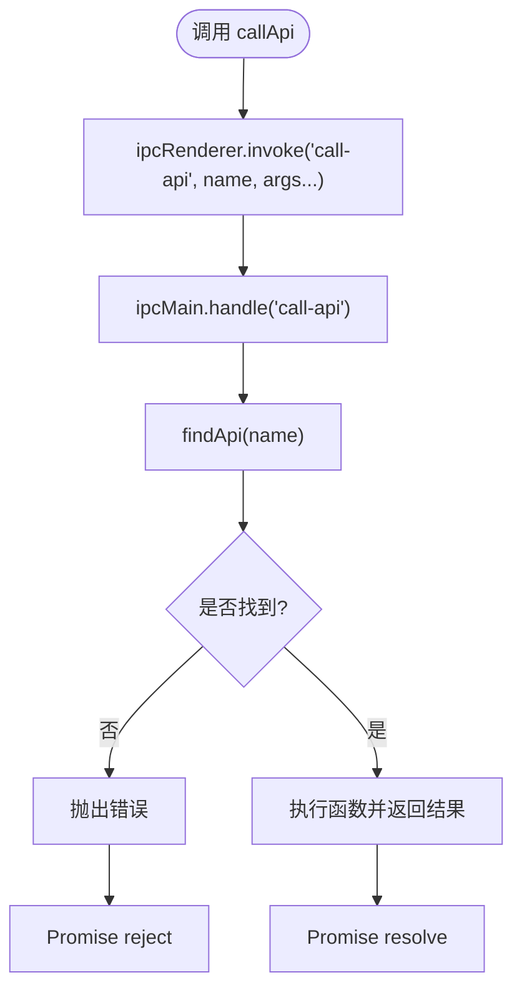
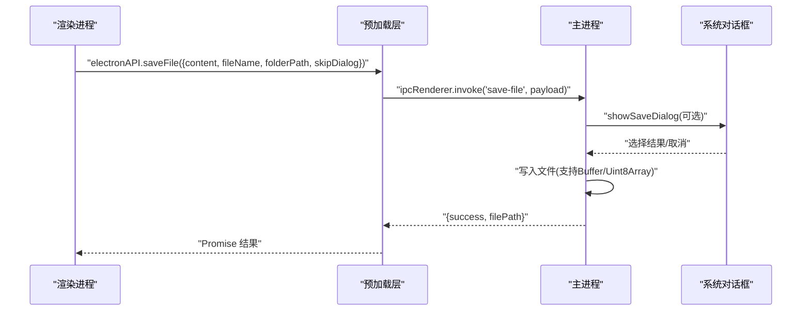
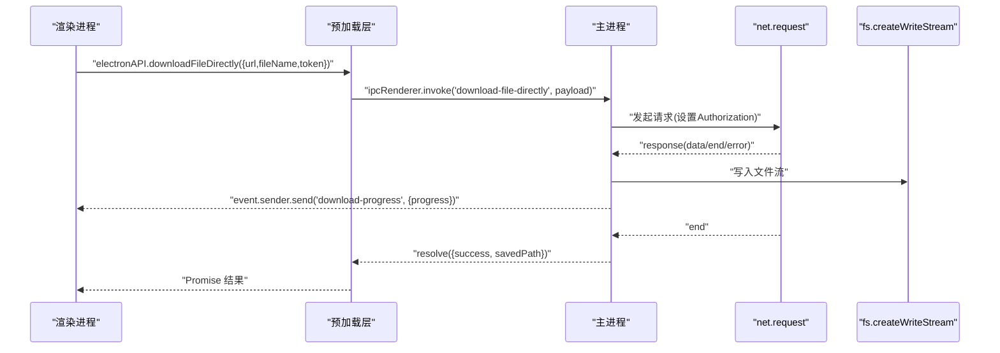
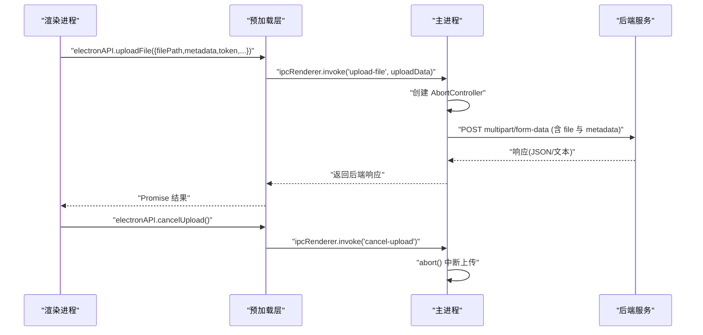
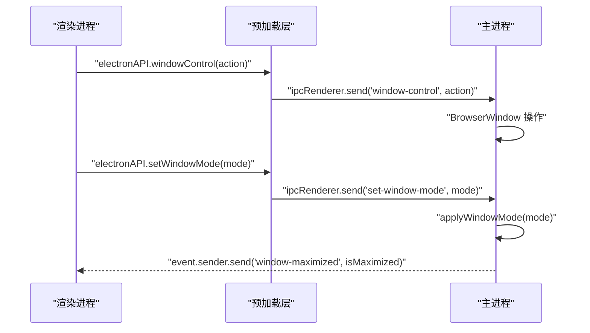
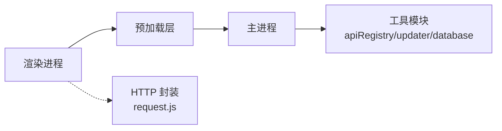

# IPC 通信机制

<cite>
**本文引用的文件**   
- [src/main/index.js](file://PezMax-Desktop/src/main/index.js)
- [src/preload/index.js](file://PezMax-Desktop/src/preload/index.js)
- [src/main/main-utils/apiRegistry.js](file://PezMax-Desktop/src/main/main-utils/apiRegistry.js)
- [src/renderer/utils/request.js](file://PezMax-Desktop/src/renderer/utils/request.js)
</cite>

## 目录
1. [简介](#简介)
2. [项目结构](#项目结构)
3. [核心组件](#核心组件)
4. [架构总览](#架构总览)
5. [详细组件分析](#详细组件分析)
6. [依赖关系分析](#依赖关系分析)
7. [性能考虑](#性能考虑)
8. [故障排查指南](#故障排查指南)
9. [结论](#结论)
10. [附录：最佳实践与示例路径](#附录最佳实践与示例路径)

## 简介
本文件系统性梳理并文档化本项目中 Electron 的 IPC 通信机制，覆盖主进程与渲染进程之间的双向通信、异步消息传递（invoke/handle）、事件监听（send/on）以及 Promise 模式的使用。同时说明数据传输格式与序列化策略、复杂对象与大文件传输方案、错误处理与异常传播，并提供性能优化建议与典型场景的最佳实践路径。

## 项目结构
本项目采用标准的 Electron 三层结构：
- 主进程（main）：负责系统能力调用、文件系统操作、网络请求、窗口控制、更新管理等。
- 预加载脚本（preload）：通过 contextBridge 暴露安全的 API 给渲染进程，屏蔽底层 ipcRenderer 细节。
- 渲染进程（renderer）：业务逻辑与 UI，通过 window.electronAPI 调用主进程能力。

图示来源
- [src/preload/index.js:1-65](file://PezMax-Desktop/src/preload/index.js#L1-L65)
- [src/main/index.js:293-305](file://PezMax-Desktop/src/main/index.js#L293-L305)
- [src/main/main-utils/apiRegistry.js:1-21](file://PezMax-Desktop/src/main/main-utils/apiRegistry.js#L1-L21)

章节来源
- [src/main/index.js:1-921](file://PezMax-Desktop/src/main/index.js#L1-L921)
- [src/preload/index.js:1-65](file://PezMax-Desktop/src/preload/index.js#L1-L65)
- [src/main/main-utils/apiRegistry.js:1-21](file://PezMax-Desktop/src/main/main-utils/apiRegistry.js#L1-L21)

## 核心组件
- 主进程入口与 IPC 注册
  - 使用 ipcMain.handle 提供异步 RPC 风格接口（返回 Promise），如 call-api、save-file、download-file-directly、update:*、download:* 等。
  - 使用 ipcMain.on 提供单向事件通道，如 window-control、set-window-mode、ping 等。
  - 通过 event.sender.send 向渲染进程推送事件，如 download-progress、window-maximized、update-status。
- 预加载桥接
  - 通过 contextBridge.exposeInMainWorld 将 electronAPI 暴露到渲染进程全局，统一封装 invoke/send/on 调用。
  - 提供 callApi、selectFile、uploadFile、cancelUpload、selectFolder、readFolderPath、windowControl、getSettings、saveSettings、downloadFileDirectly、onDownloadProgress、clearAppCache、openPath、update 相关方法、下载记录 CRUD 等。
- 通用 API 路由
  - 通过 apiRegistry + findApi 实现“按名称动态分发”的 RPC 路由，便于扩展模块化 API。
- 渲染侧 HTTP 封装
  - request.js 为 Web 请求封装，主要面向后端 REST API；与 IPC 解耦，但可与 IPC 协作完成大文件上传/下载等场景。

章节来源
- [src/main/index.js:293-305](file://PezMax-Desktop/src/main/index.js#L293-L305)
- [src/main/index.js:333-382](file://PezMax-Desktop/src/main/index.js#L333-L382)
- [src/main/index.js:385-427](file://PezMax-Desktop/src/main/index.js#L385-L427)
- [src/main/index.js:435-513](file://PezMax-Desktop/src/main/index.js#L435-L513)
- [src/main/index.js:528-608](file://PezMax-Desktop/src/main/index.js#L528-L608)
- [src/main/index.js:611-637](file://PezMax-Desktop/src/main/index.js#L611-L637)
- [src/main/index.js:640-713](file://PezMax-Desktop/src/main/index.js#L640-L713)
- [src/main/index.js:760-787](file://PezMax-Desktop/src/main/index.js#L760-L787)
- [src/main/index.js:801-881](file://PezMax-Desktop/src/main/index.js#L801-L881)
- [src/preload/index.js:1-65](file://PezMax-Desktop/src/preload/index.js#L1-L65)
- [src/main/main-utils/apiRegistry.js:1-21](file://PezMax-Desktop/src/main/main-utils/apiRegistry.js#L1-L21)

## 架构总览
IPC 通信采用“安全桥接 + 异步 RPC + 事件推送”的组合模式：
- 渲染进程通过 window.electronAPI 调用主进程能力，内部基于 ipcRenderer.invoke（Promise 模式）。
- 主进程在 ipcMain.handle 中实现具体逻辑，支持同步返回结果或抛出异常，异常会沿 Promise 链回传到渲染端。
- 对于长耗时或流式任务（如下载进度、更新状态），主进程通过 event.sender.send 推送事件，渲染端通过 ipcRenderer.on 订阅。

图示来源
- [src/preload/index.js:14-16](file://PezMax-Desktop/src/preload/index.js#L14-L16)
- [src/main/index.js:293-305](file://PezMax-Desktop/src/main/index.js#L293-L305)
- [src/main/main-utils/apiRegistry.js:13-18](file://PezMax-Desktop/src/main/main-utils/apiRegistry.js#L13-L18)

## 详细组件分析

### 组件一：通用 RPC 路由（call-api）
- 设计要点
  - 渲染端通过 electronAPI.callApi 发起调用，内部走 ipcRenderer.invoke('call-api', ...)。
  - 主进程在 'call-api' 处理器中根据 apiName 动态查找并执行对应函数，返回 Promise 结果。
  - 未找到 API 时抛出错误，由 invoke 自动转换为 Promise reject。
- 数据格式
  - 参数与返回值遵循结构化 JSON 可序列化对象；复杂类型需确保可被结构化克隆。
- 错误处理
  - 主进程 throw error 会被 invoke 捕获并作为 reject 原因传回渲染端。
- 适用场景
  - 需要集中管理、按名称分发的跨进程调用，适合未来扩展多模块 API。

图示来源
- [src/preload/index.js:14-16](file://PezMax-Desktop/src/preload/index.js#L14-L16)
- [src/main/index.js:293-305](file://PezMax-Desktop/src/main/index.js#L293-L305)
- [src/main/main-utils/apiRegistry.js:13-18](file://PezMax-Desktop/src/main/main-utils/apiRegistry.js#L13-L18)

章节来源
- [src/preload/index.js:14-16](file://PezMax-Desktop/src/preload/index.js#L14-L16)
- [src/main/index.js:293-305](file://PezMax-Desktop/src/main/index.js#L293-L305)
- [src/main/main-utils/apiRegistry.js:13-18](file://PezMax-Desktop/src/main/main-utils/apiRegistry.js#L13-L18)

### 组件二：文件选择与保存（select-file / save-file）
- 设计要点
  - select-file：主进程弹出系统对话框，返回文件路径、名称、大小及图片预览（Base64）。
  - save-file：支持静默保存或弹出保存对话框；若存在同名文件则自动重命名；content 支持 Buffer/Uint8Array。
- 数据格式
  - 输入：{ content, fileName, folderPath, skipDialog }
  - 输出：{ success, filePath? | reason?, message? }
- 错误处理
  - 失败返回 { success: false, message }；用户取消返回 { success: false, reason: 'canceled' }。
- 适用场景
  - 本地文件读写、导出报表、截图保存等。

图示来源
- [src/preload/index.js:30](file://PezMax-Desktop/src/preload/index.js#L30)
- [src/main/index.js:385-427](file://PezMax-Desktop/src/main/index.js#L385-L427)

章节来源
- [src/preload/index.js:30](file://PezMax-Desktop/src/preload/index.js#L30)
- [src/main/index.js:385-427](file://PezMax-Desktop/src/main/index.js#L385-L427)

### 组件三：直接下载（download-file-directly）
- 设计要点
  - 主进程使用 net.request 发起下载，边接收边写入磁盘，避免内存溢出。
  - 支持 Bearer Token 认证；非静默模式下弹出保存对话框。
  - 通过 event.sender.send('download-progress', data) 推送进度。
- 数据格式
  - 输入：{ url, fileName, token }
  - 输出：{ success, savedPath? | reason? }
  - 事件：'download-progress' -> { fileName, progress }
- 错误处理
  - 网络错误、响应码非 200 均 reject；出错时清理残余文件。
- 适用场景
  - 大文件直连下载、后台批量下载、带进度的下载体验。

图示来源
- [src/preload/index.js:31-32](file://PezMax-Desktop/src/preload/index.js#L31-L32)
- [src/main/index.js:528-608](file://PezMax-Desktop/src/main/index.js#L528-L608)

章节来源
- [src/preload/index.js:31-32](file://PezMax-Desktop/src/preload/index.js#L31-L32)
- [src/main/index.js:528-608](file://PezMax-Desktop/src/main/index.js#L528-L608)

### 组件四：文件上传（upload-file）
- 设计要点
  - 主进程读取本地文件，构造 FormData，使用 Node fetch 直传后端。
  - 支持取消上传（AbortController），并在 cancel-upload 中触发中断。
  - 元数据以键值对追加到 FormData，匹配后端 @RequestParam。
- 数据格式
  - 输入：{ filePath, metadata, token, baseUrl, customApiUrl }
  - 输出：后端响应体（通常为 { code, msg, data }）
- 错误处理
  - 文件不存在、网络异常、JSON 解析失败均有明确日志与返回。
- 适用场景
  - 大文件上传、带元数据的表单提交、需要取消能力的上传流程。

图示来源
- [src/preload/index.js:17-18](file://PezMax-Desktop/src/preload/index.js#L17-L18)
- [src/main/index.js:801-881](file://PezMax-Desktop/src/main/index.js#L801-L881)

章节来源
- [src/preload/index.js:17-18](file://PezMax-Desktop/src/preload/index.js#L17-L18)
- [src/main/index.js:801-881](file://PezMax-Desktop/src/main/index.js#L801-L881)

### 组件五：窗口控制与模式切换（window-control / set-window-mode）
- 设计要点
  - window-control：最小化、最大化/还原、关闭。
  - set-window-mode：在认证页与主页面之间切换窗口尺寸与可缩放行为。
  - 主进程通过 send 推送窗口最大化状态变化，供渲染端适配 UI。
- 数据格式
  - 输入：action（close/minimize/maximize）、mode（auth/client/admin）
  - 事件：'window-maximized' -> boolean
- 适用场景
  - 自定义标题栏、登录页固定尺寸、主页面自由缩放。

图示来源
- [src/preload/index.js:21-24](file://PezMax-Desktop/src/preload/index.js#L21-L24)
- [src/main/index.js:611-637](file://PezMax-Desktop/src/main/index.js#L611-L637)

章节来源
- [src/preload/index.js:21-24](file://PezMax-Desktop/src/preload/index.js#L21-L24)
- [src/main/index.js:611-637](file://PezMax-Desktop/src/main/index.js#L611-L637)

### 组件六：应用设置与版本信息（get-settings / save-settings / get-app-version）
- 设计要点
  - 设置持久化到 userData 目录下的 JSON 文件；保存后同步更新开机自启与全局快捷键。
  - 获取应用版本号用于显示与更新检查。
- 数据格式
  - 设置对象包含主题、下载路径、快捷键、更新源等字段。
- 适用场景
  - 用户偏好配置、启动项管理、主题切换。

章节来源
- [src/main/index.js:355-370](file://PezMax-Desktop/src/main/index.js#L355-L370)
- [src/main/index.js:363](file://PezMax-Desktop/src/main/index.js#L363)
- [src/preload/index.js:25-27](file://PezMax-Desktop/src/preload/index.js#L25-L27)

### 组件七：更新管理（update:*）
- 设计要点
  - 提供查询更新信息、检查更新、下载更新、退出安装、保存快捷键状态、配置更新源等能力。
  - 通过事件 'update-status' 推送更新状态，渲染端订阅回调。
- 数据格式
  - 输入：更新源配置对象
  - 事件：'update-status' -> 状态对象
- 适用场景
  - 桌面应用自动更新、更新源切换。

章节来源
- [src/main/index.js:371-382](file://PezMax-Desktop/src/main/index.js#L371-L382)
- [src/preload/index.js:35-46](file://PezMax-Desktop/src/preload/index.js#L35-L46)

### 组件八：本地下载记录（SQLite）
- 设计要点
  - 提供 list/add/delete/flush/check-files/delete-local-file 等接口，支持批量插入与一次性刷盘。
  - 支持批量检查本地文件是否存在，删除记录时同步清理磁盘文件。
- 数据格式
  - 记录对象包含 userId、fileId、localPath、fileName 等字段。
- 适用场景
  - 离线缓存、断点续传辅助、下载历史管理。

章节来源
- [src/main/index.js:435-513](file://PezMax-Desktop/src/main/index.js#L435-L513)
- [src/preload/index.js:49-56](file://PezMax-Desktop/src/preload/index.js#L49-L56)

## 依赖关系分析
- 渲染进程依赖预加载层暴露的 API，不直接访问 ipcRenderer。
- 预加载层依赖 ipcRenderer，仅做转发与封装。
- 主进程依赖 ipcMain、系统模块（dialog、shell、fs、net）、工具模块（apiRegistry、updater、database）。
- 渲染侧 HTTP 封装（request.js）主要用于后端 REST 调用，与 IPC 解耦，但在某些场景可与 IPC 配合（例如先通过 IPC 选择文件再上传）。

图示来源
- [src/preload/index.js:1-65](file://PezMax-Desktop/src/preload/index.js#L1-L65)
- [src/main/index.js:1-10](file://PezMax-Desktop/src/main/index.js#L1-L10)
- [src/main/main-utils/apiRegistry.js:1-21](file://PezMax-Desktop/src/main/main-utils/apiRegistry.js#L1-L21)
- [src/renderer/utils/request.js:1-217](file://PezMax-Desktop/src/renderer/utils/request.js#L1-L217)

章节来源
- [src/preload/index.js:1-65](file://PezMax-Desktop/src/preload/index.js#L1-L65)
- [src/main/index.js:1-10](file://PezMax-Desktop/src/main/index.js#L1-L10)
- [src/main/main-utils/apiRegistry.js:1-21](file://PezMax-Desktop/src/main/main-utils/apiRegistry.js#L1-L21)
- [src/renderer/utils/request.js:1-217](file://PezMax-Desktop/src/renderer/utils/request.js#L1-L217)

## 性能考虑
- 批量操作
  - 下载记录批量插入后一次性 flush，减少频繁 I/O 开销。
  - 批量检查本地文件存在性，减少多次 IPC 往返。
- 连接池与并发
  - 当前实现未显式维护连接池；如需高频短连接，可在主进程侧复用 net 实例或引入连接池库。
- 流式传输
  - 下载采用流式直写，避免大文件占用内存；上传使用 FormData 流式发送。
- 事件驱动
  - 长耗时任务通过事件推送进度，避免阻塞主线程与渲染线程。
- 资源清理
  - 取消上传使用 AbortController；下载出错清理残余文件；应用退出注销全局快捷键与关闭数据库。

[本节为通用指导，无需源码引用]

## 故障排查指南
- 常见问题定位
  - 找不到 API：检查 apiRegistry 是否注册了目标函数名。
  - 权限/路径问题：确认用户数据目录与下载目录权限。
  - 网络错误：检查代理、证书、CORS（虽然主进程不受浏览器 CORS 限制，但仍需关注服务端策略）。
  - 取消失败：确认是否仍有正在运行的上传任务。
- 日志与调试
  - 主进程 console.error 输出关键错误；未捕获异常与未处理拒绝已注册监听器。
  - 开发环境可通过 F12 打开 DevTools 进行调试。
- 恢复策略
  - 清除应用缓存：调用 clear-app-cache 清理 WebContents 缓存与 Storage Data。
  - 重试机制：在网络不稳定时结合指数退避重试。

章节来源
- [src/main/index.js:902-908](file://PezMax-Desktop/src/main/index.js#L902-L908)
- [src/main/index.js:333-352](file://PezMax-Desktop/src/main/index.js#L333-L352)

## 结论
本项目通过“安全桥接 + 异步 RPC + 事件推送”的 IPC 架构，实现了主进程与渲染进程的高效、可扩展通信。针对大文件与长耗时任务，采用流式传输与事件驱动，保障用户体验与稳定性。通过统一的 API 路由与完善的错误处理，提升了可维护性与可观测性。后续可在连接池、限流与监控方面进一步优化。

[本节为总结性内容，无需源码引用]

## 附录：最佳实践与示例路径
- 通用 RPC 调用
  - 渲染端调用：electronAPI.callApi(apiName, ...args)
  - 主进程实现：ipcMain.handle('call-api', ...)
  - 参考路径：
    - [src/preload/index.js:14-16](file://PezMax-Desktop/src/preload/index.js#L14-L16)
    - [src/main/index.js:293-305](file://PezMax-Desktop/src/main/index.js#L293-L305)
- 文件保存
  - 渲染端调用：electronAPI.saveFile({content, fileName, folderPath, skipDialog})
  - 主进程实现：ipcMain.handle('save-file', ...)
  - 参考路径：
    - [src/preload/index.js:30](file://PezMax-Desktop/src/preload/index.js#L30)
    - [src/main/index.js:385-427](file://PezMax-Desktop/src/main/index.js#L385-L427)
- 直接下载（带进度）
  - 渲染端调用：electronAPI.downloadFileDirectly({url, fileName, token})
  - 事件监听：electronAPI.onDownloadProgress(callback)
  - 主进程实现：ipcMain.handle('download-file-directly', ...) 与 event.sender.send('download-progress', ...)
  - 参考路径：
    - [src/preload/index.js:31-32](file://PezMax-Desktop/src/preload/index.js#L31-L32)
    - [src/main/index.js:528-608](file://PezMax-Desktop/src/main/index.js#L528-L608)
- 文件上传（可取消）
  - 渲染端调用：electronAPI.uploadFile({filePath, metadata, token, baseUrl, customApiUrl})
  - 取消上传：electronAPI.cancelUpload()
  - 主进程实现：ipcMain.handle('upload-file', ...) 与 ipcMain.handle('cancel-upload', ...)
  - 参考路径：
    - [src/preload/index.js:17-18](file://PezMax-Desktop/src/preload/index.js#L17-L18)
    - [src/main/index.js:801-881](file://PezMax-Desktop/src/main/index.js#L801-L881)
- 窗口控制与模式切换
  - 渲染端调用：electronAPI.windowControl(action)、electronAPI.setWindowMode(mode)
  - 事件监听：electronAPI.onWindowMaximized(callback)
  - 主进程实现：ipcMain.on('window-control', ...)、ipcMain.on('set-window-mode', ...)
  - 参考路径：
    - [src/preload/index.js:21-24](file://PezMax-Desktop/src/preload/index.js#L21-L24)
    - [src/main/index.js:611-637](file://PezMax-Desktop/src/main/index.js#L611-L637)
- 设置与版本
  - 渲染端调用：electronAPI.getSettings()、electronAPI.saveSettings(settings)、electronAPI.getAppVersion()
  - 主进程实现：ipcMain.handle('get-settings', ...)、ipcMain.on('save-settings', ...)、ipcMain.handle('get-app-version', ...)
  - 参考路径：
    - [src/preload/index.js:25-27](file://PezMax-Desktop/src/preload/index.js#L25-L27)
    - [src/main/index.js:355-370](file://PezMax-Desktop/src/main/index.js#L355-L370)
- 更新管理
  - 渲染端调用：electronAPI.checkForUpdates()、electronAPI.downloadUpdate()、electronAPI.quitAndInstallUpdate() 等
  - 事件监听：electronAPI.onUpdateStatus(callback)
  - 主进程实现：ipcMain.handle('update:*', ...)
  - 参考路径：
    - [src/preload/index.js:35-46](file://PezMax-Desktop/src/preload/index.js#L35-L46)
    - [src/main/index.js:371-382](file://PezMax-Desktop/src/main/index.js#L371-L382)
- 本地下载记录（SQLite）
  - 渲染端调用：electronAPI.downloadRecords.list/add/delete/flush/checkFiles/deleteLocalFile(...)
  - 主进程实现：ipcMain.handle('download:*', ...)
  - 参考路径：
    - [src/preload/index.js:49-56](file://PezMax-Desktop/src/preload/index.js#L49-L56)
    - [src/main/index.js:435-513](file://PezMax-Desktop/src/main/index.js#L435-L513)