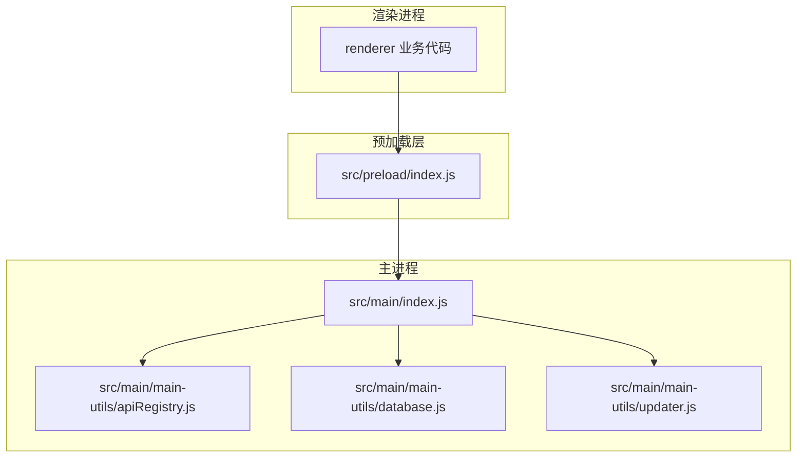
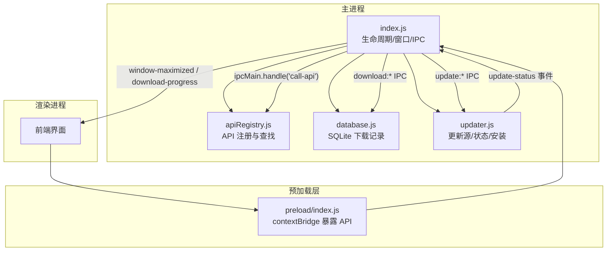
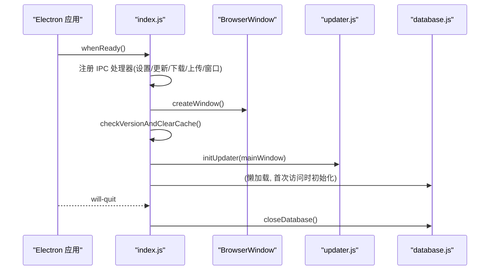
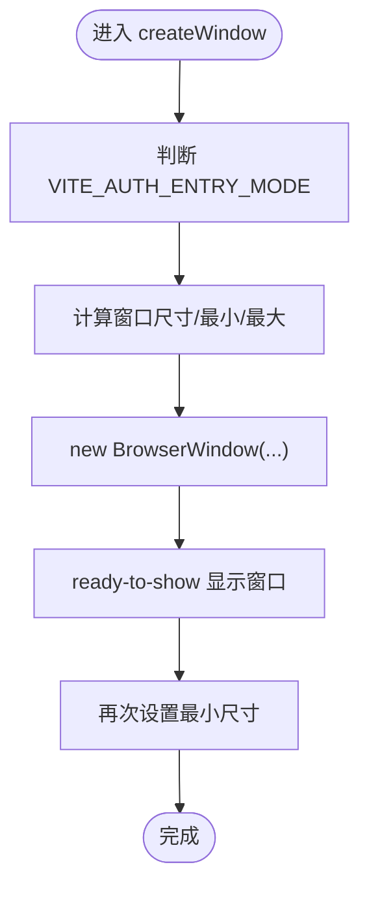
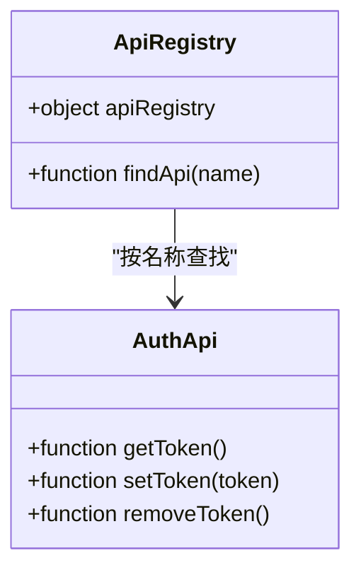
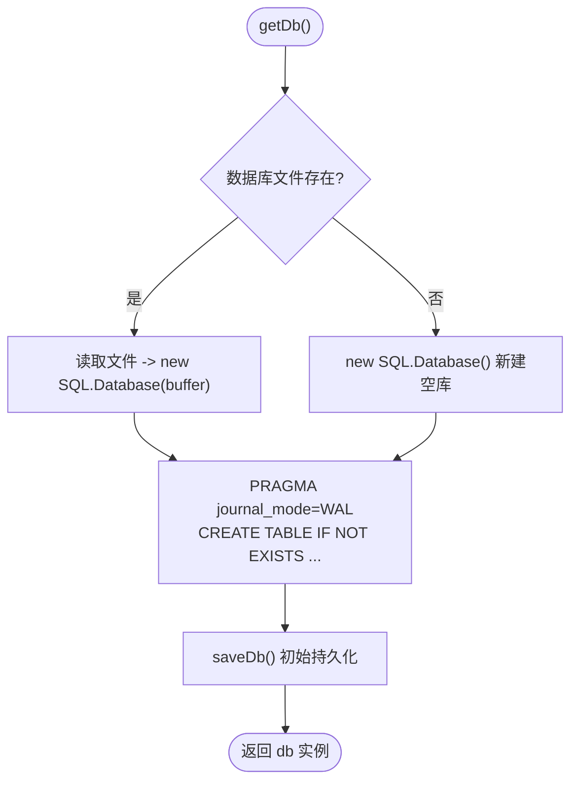
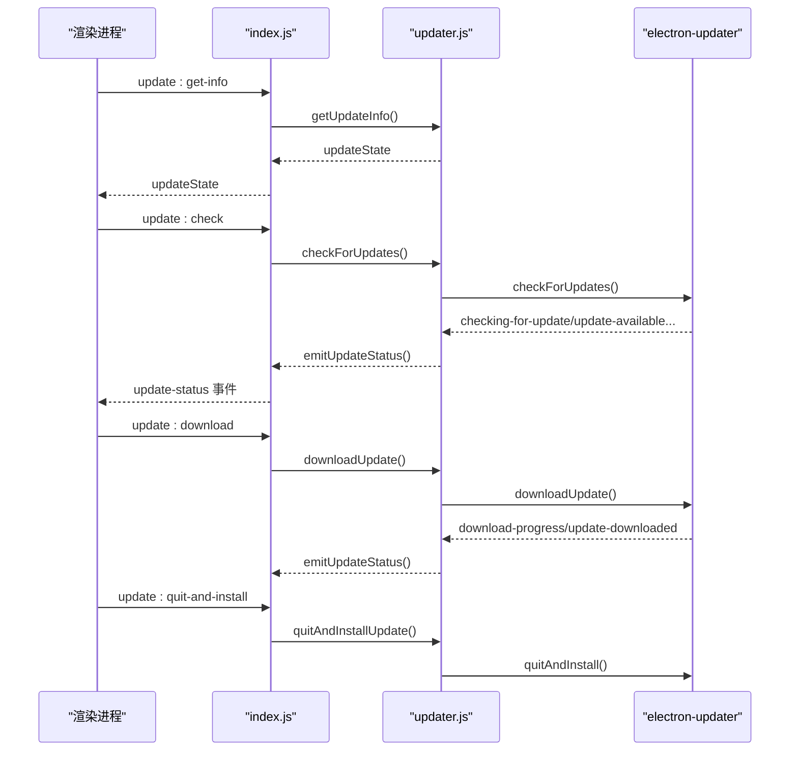
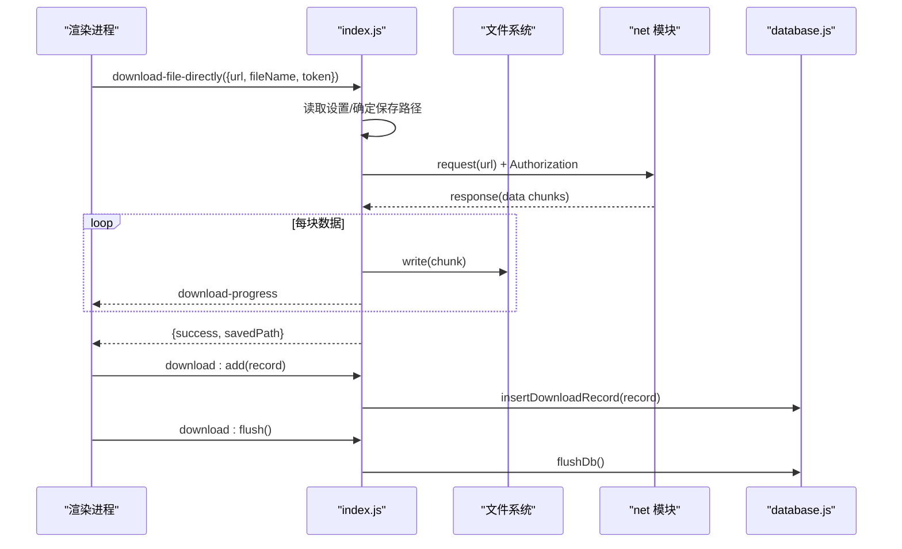
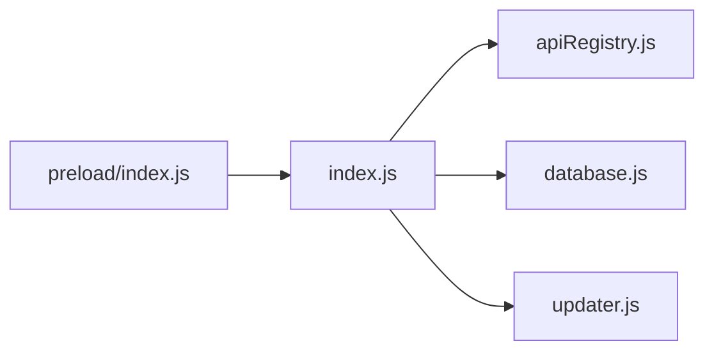

# 主进程架构

<cite>
**本文引用的文件**
- [index.js](file://PezMax-Desktop/src/main/index.js)
- [apiRegistry.js](file://PezMax-Desktop/src/main/main-utils/apiRegistry.js)
- [database.js](file://PezMax-Desktop/src/main/main-utils/database.js)
- [updater.js](file://PezMax-Desktop/src/main/main-utils/updater.js)
- [preload/index.js](file://PezMax-Desktop/src/preload/index.js)
</cite>

## 目录
1. [简介](#简介)
2. [项目结构](#项目结构)
3. [核心组件](#核心组件)
4. [架构总览](#架构总览)
5. [详细组件分析](#详细组件分析)
6. [依赖关系分析](#依赖关系分析)
7. [性能考量](#性能考量)
8. [故障排查指南](#故障排查指南)
9. [结论](#结论)
10. [附录](#附录)

## 简介
本文件聚焦于 Electron 桌面应用的主进程架构，系统性阐述以下方面：
- 主进程初始化流程与应用生命周期管理
- 窗口创建与配置（含认证页与主页面的模式切换）
- API 注册机制与动态路由调用处理
- 本地数据库模块（SQLite）实现、下载记录管理与持久化策略
- 更新系统架构（版本检查、自动更新流程、更新源配置）
- 主进程安全模型与权限控制
- 模块间依赖关系与数据流向的可视化说明

## 项目结构
主进程入口位于 src/main/index.js，模块化能力通过 main-utils 下的 apiRegistry、database、updater 提供。渲染进程通过 preload 暴露的安全桥接 API 与主进程通信。

图表来源
- [index.js:1-10](file://PezMax-Desktop/src/main/index.js#L1-L10)
- [apiRegistry.js:1-21](file://PezMax-Desktop/src/main/main-utils/apiRegistry.js#L1-L21)
- [database.js:1-10](file://PezMax-Desktop/src/main/main-utils/database.js#L1-L10)
- [updater.js:1-10](file://PezMax-Desktop/src/main/main-utils/updater.js#L1-L10)
- [preload/index.js:1-20](file://PezMax-Desktop/src/preload/index.js#L1-L20)

章节来源
- [index.js:1-10](file://PezMax-Desktop/src/main/index.js#L1-L10)
- [preload/index.js:1-20](file://PezMax-Desktop/src/preload/index.js#L1-L20)

## 核心组件
- 主进程入口 index.js
  - 负责应用生命周期事件监听、全局快捷键、窗口创建与模式切换、IPC 通道注册、下载与上传逻辑、更新系统集成等。
- API 注册器 apiRegistry.js
  - 提供按名称查找并调用已注册 API 的能力，支持从多个模块聚合导出函数。
- 数据库模块 database.js
  - 基于 sql.js 的 SQLite 内存数据库，持久化为单文件；提供下载记录的增删查与批量刷盘。
- 更新模块 updater.js
  - 基于 electron-updater，支持多更新源解析（环境变量、配置文件、用户覆盖），并提供状态广播与快捷方式重建。
- 预加载层 preload/index.js
  - 使用 contextBridge 暴露安全的 IPC 封装，供渲染进程调用。

章节来源
- [index.js:292-305](file://PezMax-Desktop/src/main/index.js#L292-L305)
- [apiRegistry.js:8-18](file://PezMax-Desktop/src/main/main-utils/apiRegistry.js#L8-L18)
- [database.js:8-56](file://PezMax-Desktop/src/main/main-utils/database.js#L8-L56)
- [updater.js:119-204](file://PezMax-Desktop/src/main/main-utils/updater.js#L119-L204)
- [preload/index.js:10-57](file://PezMax-Desktop/src/preload/index.js#L10-L57)

## 架构总览
下图展示主进程与各子模块及预加载层的交互关系，以及关键数据流（设置、更新状态、下载记录）。

图表来源
- [index.js:318-390](file://PezMax-Desktop/src/main/index.js#L318-L390)
- [apiRegistry.js:12-18](file://PezMax-Desktop/src/main/main-utils/apiRegistry.js#L12-L18)
- [database.js:87-147](file://PezMax-Desktop/src/main/main-utils/database.js#L87-L147)
- [updater.js:167-253](file://PezMax-Desktop/src/main/main-utils/updater.js#L167-L253)
- [preload/index.js:14-57](file://PezMax-Desktop/src/preload/index.js#L14-L57)

## 详细组件分析

### 主进程初始化与生命周期
- 应用就绪后执行：
  - 设置应用标识、开发工具快捷键、窗口快捷键优化。
  - 注册通用 IPC 处理器（设置、更新、缓存清理、文件操作、下载、上传、窗口控制等）。
  - 创建主窗口，根据环境决定加载远程或本地页面。
  - 启动时检测版本差异并清理浏览器缓存（保留 localStorage）。
  - 初始化更新模块并注册更新事件。
  - 注册全局快捷键（如全局唤醒、上传、设置等）。
- 退出时：
  - 注销所有全局快捷键，关闭数据库连接并持久化。

图表来源
- [index.js:318-390](file://PezMax-Desktop/src/main/index.js#L318-L390)
- [index.js:883-898](file://PezMax-Desktop/src/main/index.js#L883-L898)
- [index.js:308-313](file://PezMax-Desktop/src/main/index.js#L308-L313)
- [database.js:169-177](file://PezMax-Desktop/src/main/main-utils/database.js#L169-L177)

章节来源
- [index.js:318-390](file://PezMax-Desktop/src/main/index.js#L318-L390)
- [index.js:883-898](file://PezMax-Desktop/src/main/index.js#L883-L898)
- [index.js:308-313](file://PezMax-Desktop/src/main/index.js#L308-L313)

### 窗口创建与配置
- 窗口尺寸与最小/最大尺寸由环境变量与默认值组合计算，支持客户端与管理端两种模式。
- 认证页采用固定尺寸且不可拖拽缩放，主页面保持可调整大小。
- 通过 set-window-mode IPC 在认证页与主页面之间切换窗口模式。
- ready-to-show 中确保最小尺寸生效，避免打包后异常。

图表来源
- [index.js:217-249](file://PezMax-Desktop/src/main/index.js#L217-L249)
- [index.js:179-213](file://PezMax-Desktop/src/main/index.js#L179-L213)
- [index.js:154-177](file://PezMax-Desktop/src/main/index.js#L154-L177)

章节来源
- [index.js:217-249](file://PezMax-Desktop/src/main/index.js#L217-L249)
- [index.js:179-213](file://PezMax-Desktop/src/main/index.js#L179-L213)
- [index.js:154-177](file://PezMax-Desktop/src/main/index.js#L154-L177)

### API 注册机制与动态路由
- 设计目标：以“模块名 + 方法名”的方式统一注册和发现 API，便于扩展与维护。
- 工作方式：
  - apiRegistry 维护一个对象集合，每个键为一个模块对象，模块内包含若干命名函数。
  - findApi(name) 遍历所有模块，找到同名函数并返回。
  - 主进程通过 ipcMain.handle('call-api', ...) 接收渲染进程的调用请求，解析出 apiName 与参数，调用 findApi 获取函数并执行。
- 当前状态：authApi 模块预留为空，可按需扩展其他模块（如 system、datum、monitor、tool 等）。

图表来源
- [apiRegistry.js:8-18](file://PezMax-Desktop/src/main/main-utils/apiRegistry.js#L8-L18)
- [index.js:292-305](file://PezMax-Desktop/src/main/index.js#L292-L305)

章节来源
- [apiRegistry.js:8-18](file://PezMax-Desktop/src/main/main-utils/apiRegistry.js#L8-L18)
- [index.js:292-305](file://PezMax-Desktop/src/main/index.js#L292-L305)

### 数据库模块（SQLite 本地存储）
- 技术选型：sql.js 提供内存中的 SQLite 引擎，通过 export 将内存数据库导出为 Buffer 写入磁盘文件 ptmj-downloads.db。
- 表结构：download_records，包含文件元信息、本地路径、用户 ID、下载时间等字段，并支持旧库向后兼容添加新字段。
- 事务与持久化：
  - 插入记录不立即落盘，支持批量 flushDb 一次性持久化，减少频繁 IO。
  - 删除记录会即时 saveDb，保证一致性。
  - 关闭数据库时强制保存并释放资源。
- 查询策略：按 file_id 去重取最新一条，支持按 user_id 过滤，按时间倒序排列。

图表来源
- [database.js:9-56](file://PezMax-Desktop/src/main/main-utils/database.js#L9-L56)
- [database.js:58-73](file://PezMax-Desktop/src/main/main-utils/database.js#L58-L73)
- [database.js:87-147](file://PezMax-Desktop/src/main/main-utils/database.js#L87-L147)

章节来源
- [database.js:9-56](file://PezMax-Desktop/src/main/main-utils/database.js#L9-L56)
- [database.js:58-73](file://PezMax-Desktop/src/main/main-utils/database.js#L58-L73)
- [database.js:87-147](file://PezMax-Desktop/src/main/main-utils/database.js#L87-L147)

### 更新系统架构
- 更新源解析优先级：
  1) 用户手动配置的 updateSource（最高优先）
  2) 环境变量（PTMJ_UPDATE_PROVIDER/URL/GH_OWNER/GH_REPO）
  3) 配置文件（app-update.yml、dev-app-update.yml、electron-builder.yml）
  4) 未配置则标记为 unconfigured
- 支持的 provider：generic（直链）、github（owner/repo）
- 状态机：idle/checking/available/not-available/downloading/downloaded/installing/error/unconfigured
- 事件广播：通过 update-status 事件向渲染进程推送状态与进度
- 快捷方式管理（Windows）：
  - 更新前保存桌面快捷方式是否存在
  - 更新后重建快捷方式（指向新的可执行文件）

图表来源
- [updater.js:119-204](file://PezMax-Desktop/src/main/main-utils/updater.js#L119-L204)
- [updater.js:167-253](file://PezMax-Desktop/src/main/main-utils/updater.js#L167-L253)
- [updater.js:329-393](file://PezMax-Desktop/src/main/main-utils/updater.js#L329-L393)
- [index.js:371-382](file://PezMax-Desktop/src/main/index.js#L371-L382)

章节来源
- [updater.js:119-204](file://PezMax-Desktop/src/main/main-utils/updater.js#L119-L204)
- [updater.js:167-253](file://PezMax-Desktop/src/main/main-utils/updater.js#L167-L253)
- [updater.js:329-393](file://PezMax-Desktop/src/main/main-utils/updater.js#L329-L393)
- [index.js:371-382](file://PezMax-Desktop/src/main/index.js#L371-L382)

### 下载与文件操作
- 直接下载（底层 net 模块）：
  - 支持静默下载与选择保存路径
  - 使用 Bearer Token 鉴权
  - 实时进度通过 download-progress 事件上报
- 批量下载记录：
  - 新增记录到 SQLite（延迟落盘）
  - 批量完成后调用 flush 一次持久化
  - 支持检查本地文件是否存在、删除本地文件与对应记录
- 文件保存与打开：
  - save-file 支持静默与对话框模式，自动重命名冲突文件
  - open-path 使用系统默认程序打开文件

图表来源
- [index.js:528-608](file://PezMax-Desktop/src/main/index.js#L528-L608)
- [index.js:434-513](file://PezMax-Desktop/src/main/index.js#L434-L513)
- [database.js:87-147](file://PezMax-Desktop/src/main/main-utils/database.js#L87-L147)

章节来源
- [index.js:528-608](file://PezMax-Desktop/src/main/index.js#L528-L608)
- [index.js:434-513](file://PezMax-Desktop/src/main/index.js#L434-L513)
- [database.js:87-147](file://PezMax-Desktop/src/main/main-utils/database.js#L87-L147)

### 安全模型与权限控制
- 上下文隔离与 Node 集成：
  - 启用 contextIsolation，禁用 nodeIntegration，防止渲染进程直接访问 Node API。
  - 通过 preload 使用 contextBridge 暴露受限 API。
- 网络与安全策略：
  - webSecurity 关闭以允许从 file:// 跨域请求远程 API（注意风险）。
  - allowRunningInsecureContent 允许在 file:// 中加载 http 内容。
  - 外部链接通过 shell.openExternal 打开，阻止在新窗口中打开。
- 权限边界：
  - 仅通过 preload 暴露必要能力（文件选择、保存、下载、更新、窗口控制等）。
  - 敏感操作（如文件写入、系统命令）在主进程执行，渲染进程无法绕过。

章节来源
- [index.js:233-241](file://PezMax-Desktop/src/main/index.js#L233-L241)
- [index.js:251-254](file://PezMax-Desktop/src/main/index.js#L251-L254)
- [preload/index.js:10-57](file://PezMax-Desktop/src/preload/index.js#L10-L57)

## 依赖关系分析
- 主进程对模块的依赖：
  - index.js 依赖 apiRegistry（动态 API 路由）、database（下载记录）、updater（更新系统）
  - preload/index.js 作为安全桥接，将主进程能力暴露给渲染进程
- 更新系统与 electron-updater 的集成：
  - 通过 setFeedURL 配置 generic/github 两种更新源
  - 事件驱动的状态广播与下载控制

图表来源
- [index.js:1-10](file://PezMax-Desktop/src/main/index.js#L1-L10)
- [preload/index.js:1-20](file://PezMax-Desktop/src/preload/index.js#L1-L20)

章节来源
- [index.js:1-10](file://PezMax-Desktop/src/main/index.js#L1-L10)
- [preload/index.js:1-20](file://PezMax-Desktop/src/preload/index.js#L1-L20)

## 性能考量
- 数据库持久化策略：
  - 批量插入后一次性 flush，降低频繁 IO 开销
  - WAL 模式提升并发读写性能
- 下载性能：
  - 使用 net 模块流式写入，避免大文件占用内存
  - 可选进度上报，避免阻塞主线程
- 窗口初始化：
  - 提前加载主题背景色，减少白屏闪烁
  - 在 ready-to-show 后设置最小尺寸，避免打包后失效

[本节为通用指导，无需具体文件引用]

## 故障排查指南
- 更新失败或未检测到更新源：
  - 检查环境变量或配置文件是否有效，确认 provider 与 url/owner/repo 非占位符
  - 查看 update-status 事件输出，定位状态为 unconfigured 或 error
- 下载失败：
  - 检查服务器返回状态码与响应体
  - 确认 token 是否正确传递至 Authorization 头
  - 查看 download-progress 事件是否正常触发
- 数据库问题：
  - 确认 ptmj-downloads.db 文件存在且可读
  - 若出现字段缺失，检查 ALTER TABLE 兼容性逻辑
- 窗口模式异常：
  - 检查 set-window-mode 调用是否发生在正确的窗口实例上
  - 确认认证页与主页面的尺寸限制是否符合预期

章节来源
- [updater.js:119-204](file://PezMax-Desktop/src/main/main-utils/updater.js#L119-L204)
- [index.js:528-608](file://PezMax-Desktop/src/main/index.js#L528-L608)
- [database.js:45-53](file://PezMax-Desktop/src/main/main-utils/database.js#L45-L53)
- [index.js:179-213](file://PezMax-Desktop/src/main/index.js#L179-L213)

## 结论
该主进程架构以清晰的职责划分与安全的 IPC 机制为核心，结合灵活的 API 注册、可靠的本地数据库与完善的更新系统，实现了可扩展、易维护的桌面应用基础能力。通过合理的性能优化与安全策略，能够在生产环境中稳定运行。

[本节为总结性内容，无需具体文件引用]

## 附录
- 常用 IPC 接口清单（部分）
  - call-api：动态调用已注册 API
  - get-settings/save-settings：读取/保存应用设置
  - update:*：更新相关操作与信息获取
  - download:*：下载记录管理与文件操作
  - window-control/set-window-mode：窗口控制与模式切换
  - select-file/select-folder/save-file/open-path：文件操作

章节来源
- [preload/index.js:14-57](file://PezMax-Desktop/src/preload/index.js#L14-L57)
- [index.js:354-382](file://PezMax-Desktop/src/main/index.js#L354-L382)
- [index.js:434-513](file://PezMax-Desktop/src/main/index.js#L434-L513)
- [index.js:611-637](file://PezMax-Desktop/src/main/index.js#L611-L637)