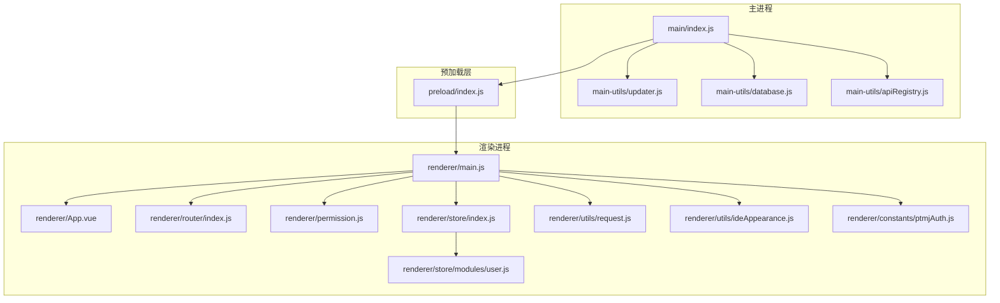
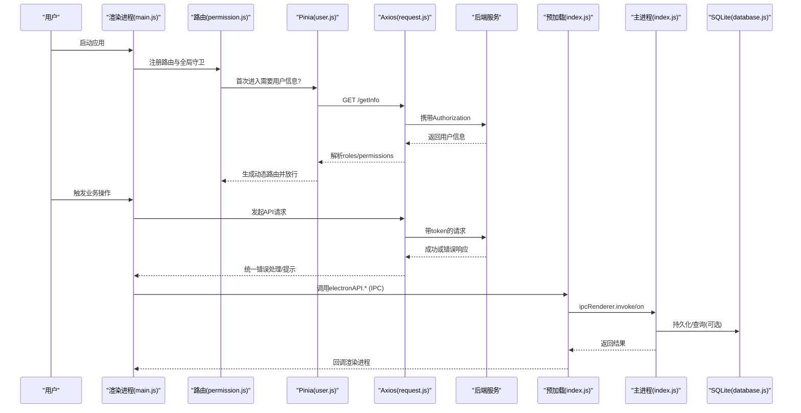
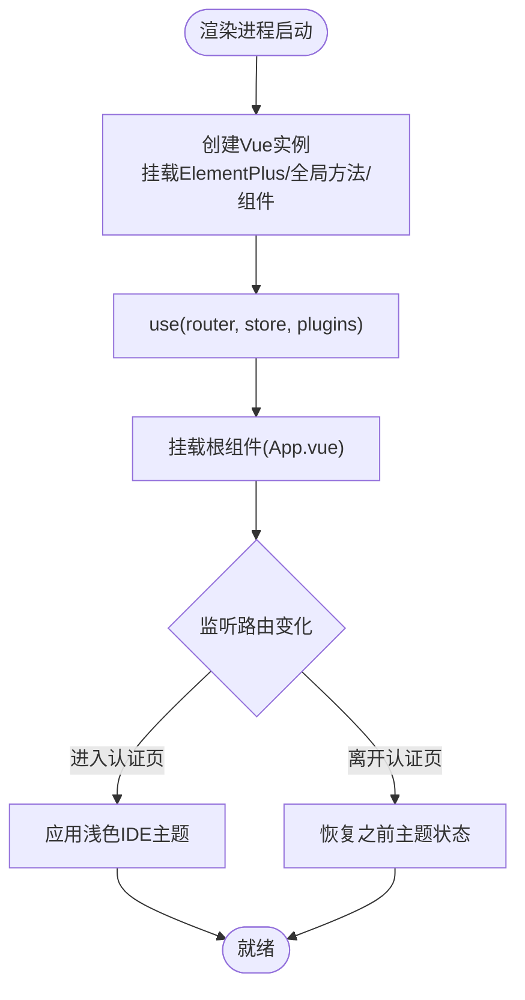
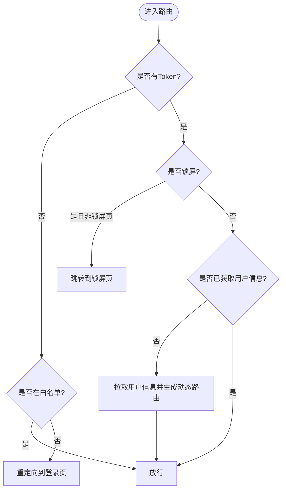
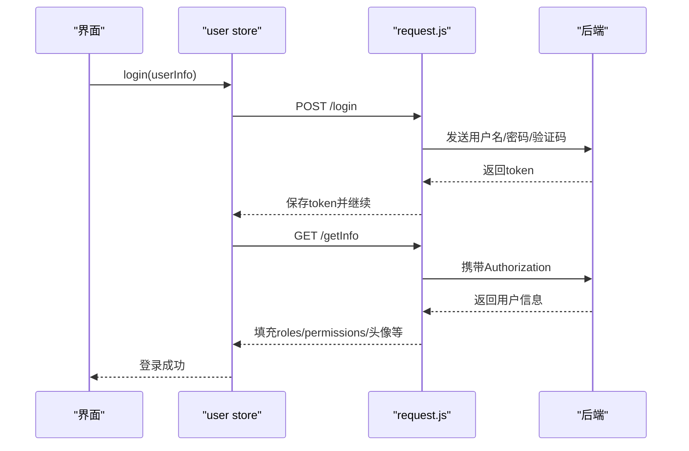
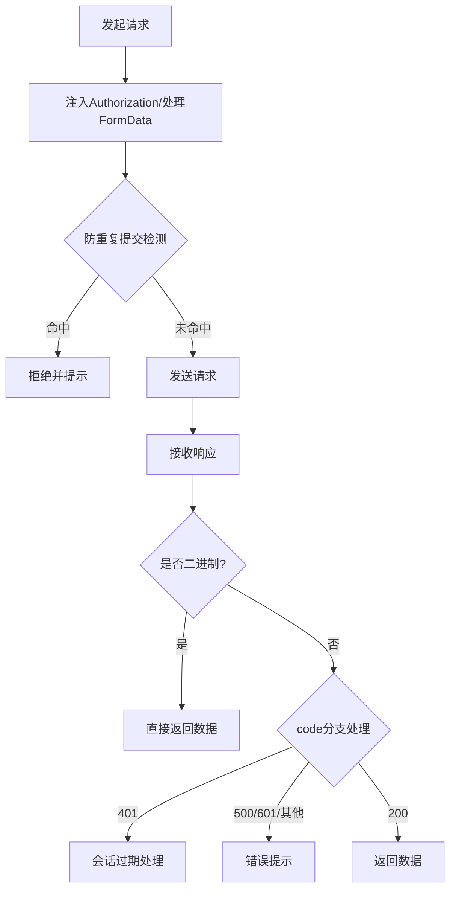
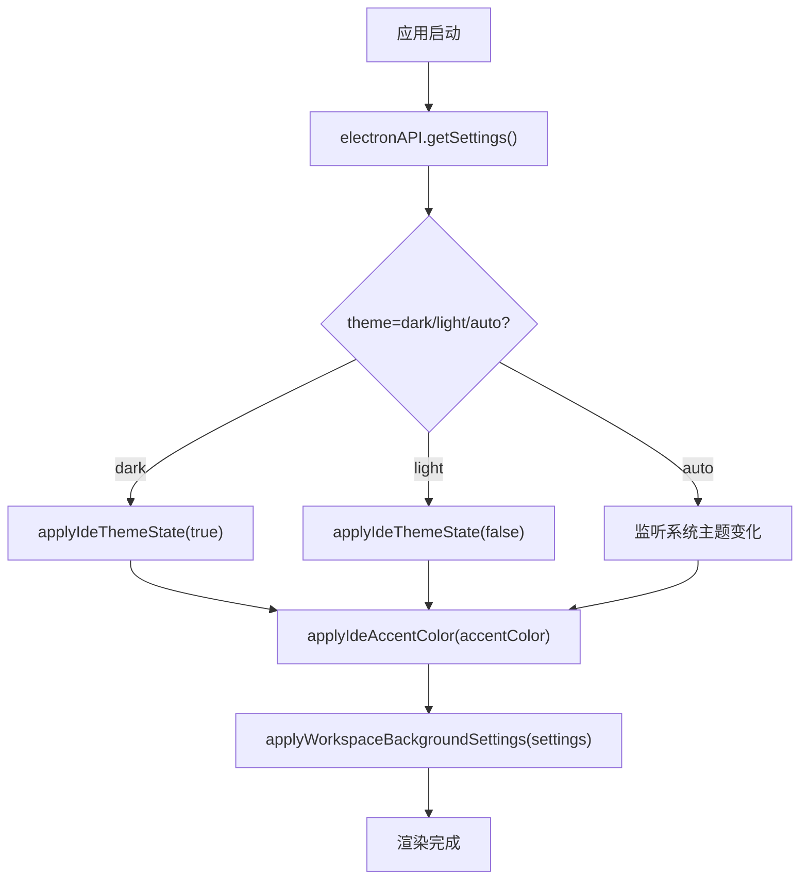
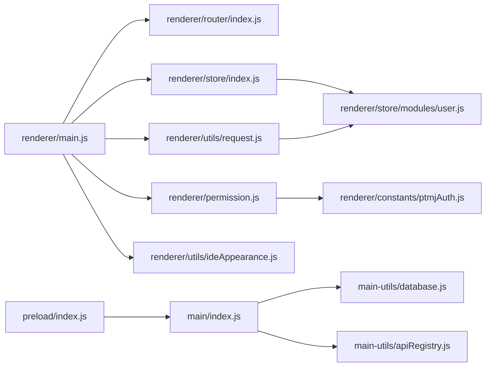

# 渲染进程架构

<cite>
**本文引用的文件**   
- [src/renderer/main.js](file://PezMax-Desktop/src/renderer/main.js)
- [src/preload/index.js](file://PezMax-Desktop/src/preload/index.js)
- [src/main/index.js](file://PezMax-Desktop/src/main/index.js)
- [src/renderer/router/index.js](file://PezMax-Desktop/src/renderer/router/index.js)
- [src/renderer/store/index.js](file://PezMax-Desktop/src/renderer/store/index.js)
- [src/renderer/utils/request.js](file://PezMax-Desktop/src/renderer/utils/request.js)
- [src/renderer/store/modules/user.js](file://PezMax-Desktop/src/renderer/store/modules/user.js)
- [src/renderer/permission.js](file://PezMax-Desktop/src/renderer/permission.js)
- [src/renderer/App.vue](file://PezMax-Desktop/src/renderer/App.vue)
- [src/renderer/constants/ptmjAuth.js](file://PezMax-Desktop/src/renderer/constants/ptmjAuth.js)
- [src/renderer/utils/theme.js](file://PezMax-Desktop/src/renderer/utils/theme.js)
- [src/renderer/utils/clientStorage.js](file://PezMax-Desktop/src/renderer/utils/clientStorage.js)
- [src/renderer/utils/ideAppearance.js](file://PezMax-Desktop/src/renderer/utils/ideAppearance.js)
- [src/main/main-utils/apiRegistry.js](file://PezMax-Desktop/src/main/main-utils/apiRegistry.js)
- [src/main/main-utils/database.js](file://PezMax-Desktop/src/main/main-utils/database.js)
</cite>

## 目录
1. [简介](#简介)
2. [项目结构](#项目结构)
3. [核心组件](#核心组件)
4. [架构总览](#架构总览)
5. [详细组件分析](#详细组件分析)
6. [依赖关系分析](#依赖关系分析)
7. [性能与内存优化](#性能与内存优化)
8. [故障排查指南](#故障排查指南)
9. [结论](#结论)

## 简介
本文件聚焦于 Electron 渲染进程的架构设计与实现，围绕 Vue 3 应用的初始化流程、Pinia 状态管理、路由配置与权限控制、组件加载机制、安全隔离（上下文隔离与预加载脚本）、前后端通信（API 客户端封装、错误处理与重试策略）、主题系统与用户偏好设置、以及渲染进程的性能优化与内存管理最佳实践进行系统化说明。文档同时提供架构图与流程图，帮助读者快速理解数据流与交互模式。

## 项目结构
渲染进程采用典型的 Electron + Vue 3 技术栈：
- 主进程负责窗口创建、IPC 桥接、系统能力访问（文件系统、对话框、更新等）
- 预加载脚本通过 contextBridge 暴露最小化 API 给渲染进程
- 渲染进程使用 Vue 3 + Element Plus + Pinia + Vue Router 构建 UI 与业务逻辑
- 前端通过 Axios 调用后端 REST API，并在拦截器中统一处理鉴权、错误提示与下载



图表来源
- [src/main/index.js:217-271](file://PezMax-Desktop/src/main/index.js#L217-L271)
- [src/preload/index.js:10-57](file://PezMax-Desktop/src/preload/index.js#L10-L57)
- [src/renderer/main.js:45-84](file://PezMax-Desktop/src/renderer/main.js#L45-L84)
- [src/renderer/App.vue:11-44](file://PezMax-Desktop/src/renderer/App.vue#L11-L44)
- [src/renderer/router/index.js:98-110](file://PezMax-Desktop/src/renderer/router/index.js#L98-L110)
- [src/renderer/permission.js:35-101](file://PezMax-Desktop/src/renderer/permission.js#L35-L101)
- [src/renderer/store/index.js:1-4](file://PezMax-Desktop/src/renderer/store/index.js#L1-L4)
- [src/renderer/store/modules/user.js:10-121](file://PezMax-Desktop/src/renderer/store/modules/user.js#L10-L121)
- [src/renderer/utils/request.js:18-29](file://PezMax-Desktop/src/renderer/utils/request.js#L18-L29)
- [src/renderer/utils/ideAppearance.js:177-208](file://PezMax-Desktop/src/renderer/utils/ideAppearance.js#L177-L208)
- [src/renderer/constants/ptmjAuth.js:12-27](file://PezMax-Desktop/src/renderer/constants/ptmjAuth.js#L12-L27)
- [src/main/main-utils/database.js:1-56](file://PezMax-Desktop/src/main/main-utils/database.js#L1-L56)
- [src/main/main-utils/apiRegistry.js:8-18](file://PezMax-Desktop/src/main/main-utils/apiRegistry.js#L8-L18)

章节来源
- [src/main/index.js:217-271](file://PezMax-Desktop/src/main/index.js#L217-L271)
- [src/preload/index.js:10-57](file://PezMax-Desktop/src/preload/index.js#L10-L57)
- [src/renderer/main.js:45-84](file://PezMax-Desktop/src/renderer/main.js#L45-L84)
- [src/renderer/router/index.js:98-110](file://PezMax-Desktop/src/renderer/router/index.js#L98-L110)
- [src/renderer/store/index.js:1-4](file://PezMax-Desktop/src/renderer/store/index.js#L1-L4)
- [src/renderer/utils/request.js:18-29](file://PezMax-Desktop/src/renderer/utils/request.js#L18-L29)
- [src/renderer/utils/ideAppearance.js:177-208](file://PezMax-Desktop/src/renderer/utils/ideAppearance.js#L177-L208)
- [src/renderer/constants/ptmjAuth.js:12-27](file://PezMax-Desktop/src/renderer/constants/ptmjAuth.js#L12-L27)
- [src/main/main-utils/database.js:1-56](file://PezMax-Desktop/src/main/main-utils/database.js#L1-L56)
- [src/main/main-utils/apiRegistry.js:8-18](file://PezMax-Desktop/src/main/main-utils/apiRegistry.js#L8-L18)

## 核心组件
- 应用入口与全局装配
  - 在渲染进程入口中完成 Element Plus 国际化与主题变量、全局方法挂载、全局组件注册、指令与插件安装、路由与 Pinia 的启用，最后挂载根组件。
- 路由与权限
  - 基于 Hash 历史模式定义静态路由；通过全局前置守卫实现白名单、锁屏、动态路由生成与角色权限校验，并同步窗口模式（认证页固定尺寸）。
- 状态管理（Pinia）
  - 用户模块维护 token、用户信息、角色与权限；登录成功后拉取用户信息并进行封号检查；退出时清理本地存储与会话。
- API 客户端
  - 基于 Axios 封装，统一注入 Authorization、防重复提交、参数序列化、响应码处理、会话过期引导、通用下载方法。
- 主题与外观
  - 从主进程读取主题、强调色与工作区背景设置，动态写入 CSS 变量，支持明暗切换与自动跟随系统主题。
- 预加载与安全
  - 通过 contextBridge 暴露最小 API，包括 IPC 调用、窗口控制、设置读写、文件选择与下载记录等，严格遵循上下文隔离。

章节来源
- [src/renderer/main.js:45-84](file://PezMax-Desktop/src/renderer/main.js#L45-L84)
- [src/renderer/router/index.js:98-110](file://PezMax-Desktop/src/renderer/router/index.js#L98-L110)
- [src/renderer/permission.js:35-101](file://PezMax-Desktop/src/renderer/permission.js#L35-L101)
- [src/renderer/store/modules/user.js:10-121](file://PezMax-Desktop/src/renderer/store/modules/user.js#L10-L121)
- [src/renderer/utils/request.js:58-186](file://PezMax-Desktop/src/renderer/utils/request.js#L58-L186)
- [src/renderer/utils/ideAppearance.js:177-208](file://PezMax-Desktop/src/renderer/utils/ideAppearance.js#L177-L208)
- [src/preload/index.js:10-57](file://PezMax-Desktop/src/preload/index.js#L10-L57)

## 架构总览
下图展示渲染进程与主进程、后端服务之间的整体交互路径，涵盖页面初始化、路由守卫、状态管理、网络请求与系统能力调用。



图表来源
- [src/renderer/main.js:45-84](file://PezMax-Desktop/src/renderer/main.js#L45-L84)
- [src/renderer/permission.js:35-101](file://PezMax-Desktop/src/renderer/permission.js#L35-L101)
- [src/renderer/store/modules/user.js:24-103](file://PezMax-Desktop/src/renderer/store/modules/user.js#L24-L103)
- [src/renderer/utils/request.js:58-186](file://PezMax-Desktop/src/renderer/utils/request.js#L58-L186)
- [src/preload/index.js:10-57](file://PezMax-Desktop/src/preload/index.js#L10-L57)
- [src/main/index.js:293-305](file://PezMax-Desktop/src/main/index.js#L293-L305)
- [src/main/main-utils/database.js:88-135](file://PezMax-Desktop/src/main/main-utils/database.js#L88-L135)

## 详细组件分析

### 渲染进程初始化与组件加载
- 入口装配
  - 引入 Element Plus 中文语言包与暗黑样式变量，注册全局方法与组件（分页、上传、富文本、图标等），挂载路由、Pinia、插件与自定义指令，最终挂载根组件。
- 根组件生命周期
  - 应用启动时根据当前路由判断是否处于认证页，必要时临时关闭 IDE 风格深色模式，离开认证页后恢复之前的主题状态。
- 组件懒加载
  - 路由采用异步 import 方式按需加载页面组件，减少首屏体积。



图表来源
- [src/renderer/main.js:45-84](file://PezMax-Desktop/src/renderer/main.js#L45-L84)
- [src/renderer/App.vue:21-40](file://PezMax-Desktop/src/renderer/App.vue#L21-L40)
- [src/renderer/router/index.js:98-110](file://PezMax-Desktop/src/renderer/router/index.js#L98-L110)

章节来源
- [src/renderer/main.js:45-84](file://PezMax-Desktop/src/renderer/main.js#L45-L84)
- [src/renderer/App.vue:21-40](file://PezMax-Desktop/src/renderer/App.vue#L21-L40)
- [src/renderer/router/index.js:98-110](file://PezMax-Desktop/src/renderer/router/index.js#L98-L110)

### 路由配置与权限控制
- 静态路由
  - 包含登录、注册、找回密码、首页、收藏、下载、404 等基础路由，部分隐藏路由用于内部跳转。
- 全局前置守卫
  - 白名单放行、锁屏保护、无 Token 重定向到登录页、有 Token 但缺失用户信息时拉取用户信息并生成动态路由，随后放行。
- 窗口模式同步
  - 进入认证页时通知主进程将窗口设置为固定尺寸且不可缩放，离开认证页恢复可缩放与默认尺寸。



图表来源
- [src/renderer/permission.js:35-101](file://PezMax-Desktop/src/renderer/permission.js#L35-L101)
- [src/renderer/constants/ptmjAuth.js:12-27](file://PezMax-Desktop/src/renderer/constants/ptmjAuth.js#L12-L27)

章节来源
- [src/renderer/router/index.js:25-93](file://PezMax-Desktop/src/renderer/router/index.js#L25-L93)
- [src/renderer/permission.js:35-101](file://PezMax-Desktop/src/renderer/permission.js#L35-L101)
- [src/renderer/constants/ptmjAuth.js:12-27](file://PezMax-Desktop/src/renderer/constants/ptmjAuth.js#L12-L27)

### Pinia 状态管理与用户模块
- 用户状态
  - 维护 token、用户基本信息、角色与权限数组。
- 登录流程
  - 调用登录接口，兼容不同字段命名；保存 token 后立即拉取用户信息，若账号被封禁则拒绝登录并清理状态。
- 获取用户信息
  - 兼容后端响应结构，规范化头像地址，填充 roles/permissions，并根据密码相关提示引导用户修改。
- 退出登录
  - 清空本地 token 与缓存，重置状态。



图表来源
- [src/renderer/store/modules/user.js:24-103](file://PezMax-Desktop/src/renderer/store/modules/user.js#L24-L103)
- [src/renderer/utils/request.js:58-186](file://PezMax-Desktop/src/renderer/utils/request.js#L58-L186)

章节来源
- [src/renderer/store/modules/user.js:10-121](file://PezMax-Desktop/src/renderer/store/modules/user.js#L10-L121)
- [src/renderer/utils/request.js:58-186](file://PezMax-Desktop/src/renderer/utils/request.js#L58-L186)

### 前端与后端通信架构（API 客户端）
- 请求拦截器
  - 自动注入 Authorization；对 FormData 请求移除 Content-Type 让浏览器自动设置；GET 请求将 params 拼接为 URL 查询串；防重复提交（基于 session 缓存最近一次请求对象与时间戳）。
- 响应拦截器
  - 二进制直接返回；按后端 code 分支处理：401 触发会话过期弹窗与重登；500/601/其他错误码分别给出消息提示；网络错误、超时、HTTP 状态码异常统一友好提示。
- 通用下载
  - 以 blob 形式下载，校验是否为有效 blob，失败时解析 JSON 错误信息并提示。



图表来源
- [src/renderer/utils/request.js:58-186](file://PezMax-Desktop/src/renderer/utils/request.js#L58-L186)

章节来源
- [src/renderer/utils/request.js:18-29](file://PezMax-Desktop/src/renderer/utils/request.js#L18-L29)
- [src/renderer/utils/request.js:58-186](file://PezMax-Desktop/src/renderer/utils/request.js#L58-L186)
- [src/renderer/utils/request.js:189-214](file://PezMax-Desktop/src/renderer/utils/request.js#L189-L214)

### 安全隔离与预加载脚本
- 上下文隔离
  - 主进程创建窗口时开启 contextIsolation，禁用 nodeIntegration，仅通过 preload 暴露必要 API。
- 预加载脚本职责
  - 使用 contextBridge.exposeInMainWorld 暴露 electronAPI，封装 IPC 调用（call-api、select-file、upload-file、cancel-upload、select-folder、read-folder-path、window-control、get-settings、save-settings、download-file-directly、update 系列、downloadRecords 等）。
- 主进程 IPC 处理
  - 统一 call-api 处理器通过 apiRegistry 查找并执行对应函数；其他 IPC 处理文件选择、文件夹读取、下载直写、窗口控制、设置读写、更新管理等。

```mermaid
classDiagram
class Preload {
+exposeInMainWorld("electronAPI", {...})
+ipcRenderer.invoke(...)
+ipcRenderer.on(...)
}
class Main {
+ipcMain.handle("call-api", ...)
+ipcMain.handle("select-file", ...)
+ipcMain.handle("download-file-directly", ...)
+ipcMain.handle("get-settings", ...)
+ipcMain.handle("save-settings", ...)
}
class Database {
+insertDownloadRecord(...)
+listDownloadRecords(...)
+deleteDownloadRecord(...)
+flushDb()
}
class ApiRegistry {
+findApi(name)
}
Preload --> Main : "IPC 调用"
Main --> Database : "持久化下载记录"
Main --> ApiRegistry : "动态查找API"
```

图表来源
- [src/preload/index.js:10-57](file://PezMax-Desktop/src/preload/index.js#L10-L57)
- [src/main/index.js:293-305](file://PezMax-Desktop/src/main/index.js#L293-L305)
- [src/main/main-utils/apiRegistry.js:8-18](file://PezMax-Desktop/src/main/main-utils/apiRegistry.js#L8-L18)
- [src/main/main-utils/database.js:88-135](file://PezMax-Desktop/src/main/main-utils/database.js#L88-L135)

章节来源
- [src/main/index.js:233-241](file://PezMax-Desktop/src/main/index.js#L233-L241)
- [src/preload/index.js:10-57](file://PezMax-Desktop/src/preload/index.js#L10-L57)
- [src/main/index.js:293-305](file://PezMax-Desktop/src/main/index.js#L293-L305)
- [src/main/main-utils/apiRegistry.js:8-18](file://PezMax-Desktop/src/main/main-utils/apiRegistry.js#L8-L18)
- [src/main/main-utils/database.js:88-135](file://PezMax-Desktop/src/main/main-utils/database.js#L88-L135)

### 主题系统与用户偏好设置
- 主题与强调色
  - 从主进程读取 theme/accentColor/backgroundImage 等设置，动态写入 CSS 变量，支持明/暗/自动三种模式，自动跟随系统主题。
- 工作区背景
  - 根据 editorVisibility 计算编辑器透明度与模糊度，设置背景图片、透明度与模糊效果，增强视觉层次。
- 本地存储
  - 提供 localStorage 的安全封装，避免在无 storage 环境报错。



图表来源
- [src/renderer/utils/ideAppearance.js:177-208](file://PezMax-Desktop/src/renderer/utils/ideAppearance.js#L177-L208)
- [src/renderer/utils/theme.js:2-15](file://PezMax-Desktop/src/renderer/utils/theme.js#L2-L15)
- [src/renderer/utils/clientStorage.js:9-21](file://PezMax-Desktop/src/renderer/utils/clientStorage.js#L9-L21)

章节来源
- [src/renderer/utils/ideAppearance.js:177-208](file://PezMax-Desktop/src/renderer/utils/ideAppearance.js#L177-L208)
- [src/renderer/utils/theme.js:2-15](file://PezMax-Desktop/src/renderer/utils/theme.js#L2-L15)
- [src/renderer/utils/clientStorage.js:9-21](file://PezMax-Desktop/src/renderer/utils/clientStorage.js#L9-L21)

## 依赖关系分析
- 渲染进程内部依赖
  - main.js 依赖 router、store、plugins、directive、全局组件与方法；App.vue 依赖路由与主题工具；permission.js 依赖 user/settings/permission store 与常量；request.js 依赖 axios、Element Plus、auth、errorCode、router、user store。
- 跨进程依赖
  - 预加载脚本依赖 electron 的 contextBridge/ipcRenderer；主进程依赖 BrowserWindow/ipcMain/net/fs/dialog/globalShortcut 等系统能力；数据库模块依赖 sql.js 与 app.getPath('userData')。
- 外部依赖
  - Vue 3、Vue Router、Pinia、Element Plus、Axios、@vueuse/core、nprogress、file-saver、sql.js。



图表来源
- [src/renderer/main.js:45-84](file://PezMax-Desktop/src/renderer/main.js#L45-L84)
- [src/renderer/router/index.js:98-110](file://PezMax-Desktop/src/renderer/router/index.js#L98-L110)
- [src/renderer/store/index.js:1-4](file://PezMax-Desktop/src/renderer/store/index.js#L1-L4)
- [src/renderer/permission.js:35-101](file://PezMax-Desktop/src/renderer/permission.js#L35-L101)
- [src/renderer/utils/request.js:18-29](file://PezMax-Desktop/src/renderer/utils/request.js#L18-L29)
- [src/renderer/utils/ideAppearance.js:177-208](file://PezMax-Desktop/src/renderer/utils/ideAppearance.js#L177-L208)
- [src/renderer/store/modules/user.js:10-121](file://PezMax-Desktop/src/renderer/store/modules/user.js#L10-L121)
- [src/renderer/constants/ptmjAuth.js:12-27](file://PezMax-Desktop/src/renderer/constants/ptmjAuth.js#L12-L27)
- [src/preload/index.js:10-57](file://PezMax-Desktop/src/preload/index.js#L10-L57)
- [src/main/index.js:293-305](file://PezMax-Desktop/src/main/index.js#L293-L305)
- [src/main/main-utils/database.js:1-56](file://PezMax-Desktop/src/main/main-utils/database.js#L1-L56)
- [src/main/main-utils/apiRegistry.js:8-18](file://PezMax-Desktop/src/main/main-utils/apiRegistry.js#L8-L18)

章节来源
- [src/renderer/main.js:45-84](file://PezMax-Desktop/src/renderer/main.js#L45-L84)
- [src/renderer/router/index.js:98-110](file://PezMax-Desktop/src/renderer/router/index.js#L98-L110)
- [src/renderer/store/index.js:1-4](file://PezMax-Desktop/src/renderer/store/index.js#L1-L4)
- [src/renderer/permission.js:35-101](file://PezMax-Desktop/src/renderer/permission.js#L35-L101)
- [src/renderer/utils/request.js:18-29](file://PezMax-Desktop/src/renderer/utils/request.js#L18-L29)
- [src/renderer/utils/ideAppearance.js:177-208](file://PezMax-Desktop/src/renderer/utils/ideAppearance.js#L177-L208)
- [src/renderer/store/modules/user.js:10-121](file://PezMax-Desktop/src/renderer/store/modules/user.js#L10-L121)
- [src/renderer/constants/ptmjAuth.js:12-27](file://PezMax-Desktop/src/renderer/constants/ptmjAuth.js#L12-L27)
- [src/preload/index.js:10-57](file://PezMax-Desktop/src/preload/index.js#L10-L57)
- [src/main/index.js:293-305](file://PezMax-Desktop/src/main/index.js#L293-L305)
- [src/main/main-utils/database.js:1-56](file://PezMax-Desktop/src/main/main-utils/database.js#L1-L56)
- [src/main/main-utils/apiRegistry.js:8-18](file://PezMax-Desktop/src/main/main-utils/apiRegistry.js#L8-L18)

## 性能与内存优化
- 路由与组件
  - 使用异步 import 按需加载页面组件，减少首屏资源体积；合理划分路由层级，避免一次性加载过多模块。
- 网络请求
  - 防重复提交降低无效请求；统一错误提示避免频繁 UI 刷新；大文件下载优先使用底层 net 模块直写磁盘，避免在渲染进程占用大量内存。
- 主题与样式
  - 通过 CSS 变量集中管理主题，避免频繁 DOM 操作；仅在主题切换时批量写入变量，减少重排重绘。
- 本地存储
  - 使用安全的 localStorage 封装，避免在无 storage 环境抛出异常；谨慎使用 IndexedDB 等大对象存储，及时释放引用。
- 主进程资源
  - 应用退出时注销全局快捷键、关闭 SQLite 连接；版本更新时选择性清理缓存，保留用户设置。

[本节为通用指导，不直接分析具体文件]

## 故障排查指南
- 会话过期与重登
  - 当后端返回 401 时，前端会弹出会话过期提示，确认后清理本地 token 与用户状态并重定向至登录页。
- 网络错误与超时
  - 网络错误、超时、HTTP 状态码异常均会统一提示，便于快速定位问题。
- 下载失败
  - 底层下载失败时会清理残余文件并返回错误；可通过主进程日志与前端提示联合排查。
- 设置与主题不一致
  - 确认主进程 settings.json 与渲染进程读取到的值一致；检查自动主题监听是否正确注册与销毁。

章节来源
- [src/renderer/utils/request.js:124-186](file://PezMax-Desktop/src/renderer/utils/request.js#L124-L186)
- [src/main/index.js:528-608](file://PezMax-Desktop/src/main/index.js#L528-L608)
- [src/renderer/utils/ideAppearance.js:177-208](file://PezMax-Desktop/src/renderer/utils/ideAppearance.js#L177-L208)

## 结论
本项目在渲染进程中实现了清晰的初始化流程、完善的路由与权限控制、健壮的网络请求封装、安全的上下文隔离与预加载 API 暴露、灵活的主题与偏好设置体系，并通过主进程提供的系统能力扩展了文件与下载体验。结合按需加载、统一错误处理与合理的内存管理策略，整体架构具备良好的可维护性与可扩展性。