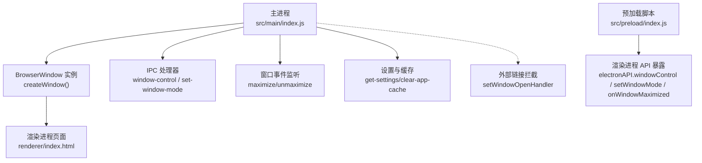
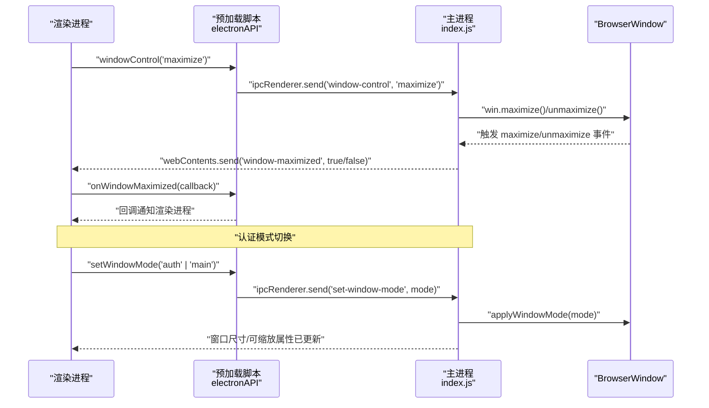
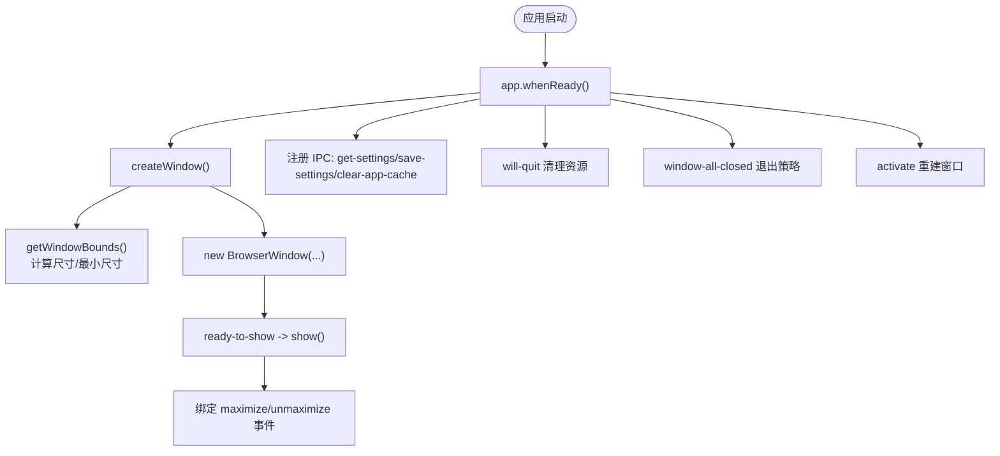
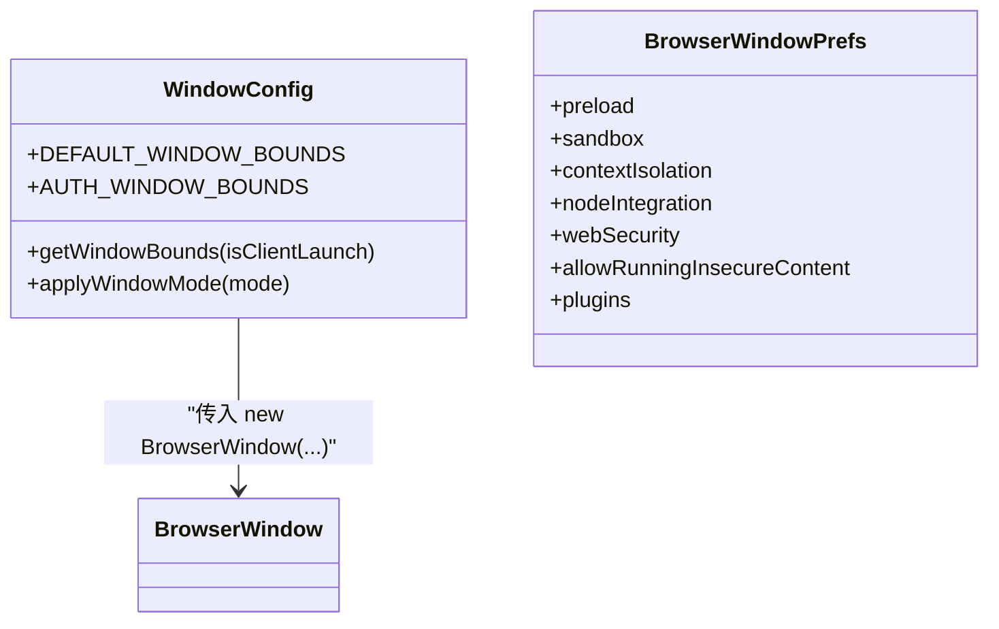
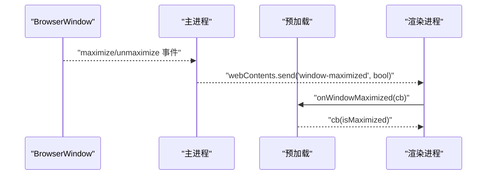
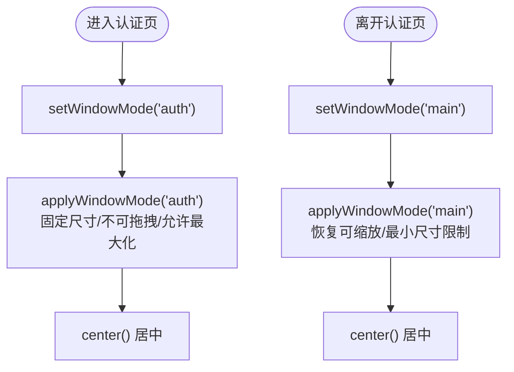
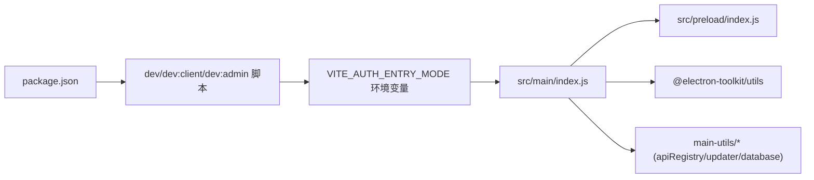

# 窗口管理系统

<cite>
**本文引用的文件**   
- [src/main/index.js](file://PezMax-Desktop/src/main/index.js)
- [src/preload/index.js](file://PezMax-Desktop/src/preload/index.js)
- [package.json](file://PezMax-Desktop/package.json)
</cite>

## 目录
1. [简介](#简介)
2. [项目结构](#项目结构)
3. [核心组件](#核心组件)
4. [架构总览](#架构总览)
5. [详细组件分析](#详细组件分析)
6. [依赖关系分析](#依赖关系分析)
7. [性能与内存优化](#性能与内存优化)
8. [故障排查指南](#故障排查指南)
9. [结论](#结论)
10. [附录：完整流程示例（代码片段路径）](#附录完整流程示例代码片段路径)

## 简介
本文件面向 Electron 桌面应用“PezMax”的窗口管理系统，聚焦多窗口架构设计、生命周期管理、窗口配置与安全策略、状态监听、窗口间通信、主题切换与外观定制、最佳实践与资源清理等。文档基于仓库中主进程与预加载脚本的实现进行系统化梳理，并提供可视化图示与可追溯的代码片段路径，帮助读者快速理解并落地相关能力。

## 项目结构
本项目采用单主窗口 + 认证页模式的多窗口形态：
- 主窗口：承载客户端/管理员两种业务入口，支持尺寸自适应、最大化/最小化、全屏等常规操作。
- 认证窗口：通过同一 BrowserWindow 实例在“认证模式”与“主界面模式”之间动态切换，以固定尺寸和不可拖拽缩放的方式呈现登录/注册/找回密码页面，提升安全与一致性体验。
- 辅助窗口：当前实现未创建独立子窗口，但提供了外部链接拦截与通用 IPC 通道，便于未来扩展为辅助窗口或弹窗。

图表来源
- [src/main/index.js:216-290](file://PezMax-Desktop/src/main/index.js#L216-L290)
- [src/main/index.js:256-263](file://PezMax-Desktop/src/main/index.js#L256-L263)
- [src/main/index.js:332-370](file://PezMax-Desktop/src/main/index.js#L332-L370)
- [src/preload/index.js:14-24](file://PezMax-Desktop/src/preload/index.js#L14-L24)

章节来源
- [src/main/index.js:216-290](file://PezMax-Desktop/src/main/index.js#L216-L290)
- [src/preload/index.js:14-24](file://PezMax-Desktop/src/preload/index.js#L14-L24)

## 核心组件
- 窗口创建与初始化
  - createWindow：构建 BrowserWindow，注入 webPreferences 安全策略，绑定 ready-to-show 显示逻辑与最小尺寸生效时机。
  - applyWindowMode：在“认证模式”与“主界面模式”之间切换窗口行为（可缩放、最大/最小尺寸、居中）。
  - getWindowBounds：根据环境变量与默认值计算初始尺寸与最小尺寸。
- 窗口控制与状态监听
  - window-control：响应关闭、最小化、最大化切换。
  - maximize/unmaximize：向渲染进程广播窗口最大化状态。
- 设置与缓存
  - get-settings/save-settings：读取/保存用户设置（主题、背景、快捷键、下载路径等），并在保存时同步更新全局快捷键与开机自启。
  - clear-app-cache：按需求清理 WebContents 缓存与存储数据。
- 预加载桥接
  - electronAPI：将窗口控制、模式切换、状态监听、设置读写、缓存清理等能力暴露给渲染进程。

章节来源
- [src/main/index.js:121-213](file://PezMax-Desktop/src/main/index.js#L121-L213)
- [src/main/index.js:216-290](file://PezMax-Desktop/src/main/index.js#L216-L290)
- [src/main/index.js:332-370](file://PezMax-Desktop/src/main/index.js#L332-L370)
- [src/preload/index.js:14-24](file://PezMax-Desktop/src/preload/index.js#L14-L24)

## 架构总览
下图展示了从渲染进程到主进程的窗口控制与状态监听链路，以及认证模式切换的关键交互。

图表来源
- [src/preload/index.js:21-24](file://PezMax-Desktop/src/preload/index.js#L21-L24)
- [src/main/index.js:610-637](file://PezMax-Desktop/src/main/index.js#L610-L637)
- [src/main/index.js:256-263](file://PezMax-Desktop/src/main/index.js#L256-L263)
- [src/main/index.js:182-213](file://PezMax-Desktop/src/main/index.js#L182-L213)

## 详细组件分析

### 窗口创建与生命周期
- 启动流程
  - app.whenReady 后调用 createWindow，依据环境变量决定 client/admin 模式，计算默认尺寸与最小尺寸。
  - 使用 show: false 避免白屏闪烁，ready-to-show 后再显示窗口，确保最小尺寸生效。
- 生命周期钩子
  - will-quit：注销全局快捷键、关闭数据库连接。
  - window-all-closed：非 macOS 平台退出应用；macOS 保持活跃。
  - activate：无窗口时重建主窗口并重新初始化更新器。

图表来源
- [src/main/index.js:216-290](file://PezMax-Desktop/src/main/index.js#L216-L290)
- [src/main/index.js:308-313](file://PezMax-Desktop/src/main/index.js#L308-L313)
- [src/main/index.js:913-917](file://PezMax-Desktop/src/main/index.js#L913-L917)
- [src/main/index.js:891-898](file://PezMax-Desktop/src/main/index.js#L891-L898)

章节来源
- [src/main/index.js:216-290](file://PezMax-Desktop/src/main/index.js#L216-L290)
- [src/main/index.js:308-313](file://PezMax-Desktop/src/main/index.js#L308-L313)
- [src/main/index.js:891-898](file://PezMax-Desktop/src/main/index.js#L891-L898)
- [src/main/index.js:913-917](file://PezMax-Desktop/src/main/index.js#L913-L917)

### 窗口配置选项（尺寸、显示模式、安全）
- 尺寸控制
  - DEFAULT_WINDOW_BOUNDS：client/admin 两套默认宽高与最小宽高。
  - AUTH_WINDOW_BOUNDS：认证页固定宽高、禁止拖拽缩放、允许最大化与全屏。
  - getWindowBounds：结合环境变量 VITE_CLIENT_WINDOW_* / VITE_ADMIN_WINDOW_* 覆盖默认值。
- 显示模式
  - applyWindowMode：在 auth 与 main 模式间切换 resizable/maximizable/fullscreenable/min/max 尺寸与居中。
- 安全设置（webPreferences）
  - contextIsolation: true
  - nodeIntegration: false
  - sandbox: false
  - webSecurity: false（允许 file:// 跨域访问远程 API）
  - allowRunningInsecureContent: true（允许在 file:// 中加载 http 内容）
  - plugins: true（原生 PDF 预览等插件支持）

图表来源
- [src/main/index.js:121-147](file://PezMax-Desktop/src/main/index.js#L121-L147)
- [src/main/index.js:154-177](file://PezMax-Desktop/src/main/index.js#L154-L177)
- [src/main/index.js:182-213](file://PezMax-Desktop/src/main/index.js#L182-L213)
- [src/main/index.js:221-242](file://PezMax-Desktop/src/main/index.js#L221-L242)

章节来源
- [src/main/index.js:121-147](file://PezMax-Desktop/src/main/index.js#L121-L147)
- [src/main/index.js:154-177](file://PezMax-Desktop/src/main/index.js#L154-L177)
- [src/main/index.js:182-213](file://PezMax-Desktop/src/main/index.js#L182-L213)
- [src/main/index.js:221-242](file://PezMax-Desktop/src/main/index.js#L221-L242)

### 窗口状态监听机制
- 主进程监听 maximize/unmaximize，并通过 webContents.send 向渲染进程推送 window-maximized 事件。
- 预加载暴露 onWindowMaximized，供渲染进程订阅。
- 渲染进程可在 UI 层根据 isMaximized 调整标题栏、布局或菜单项。

图表来源
- [src/main/index.js:256-263](file://PezMax-Desktop/src/main/index.js#L256-L263)
- [src/preload/index.js:23-24](file://PezMax-Desktop/src/preload/index.js#L23-L24)

章节来源
- [src/main/index.js:256-263](file://PezMax-Desktop/src/main/index.js#L256-L263)
- [src/preload/index.js:23-24](file://PezMax-Desktop/src/preload/index.js#L23-L24)

### 窗口间通信与数据共享
- 当前实现为单窗口模式，认证页与主界面通过同一窗口实例的模式切换完成，无需额外窗口间通信。
- 若未来引入辅助窗口，建议：
  - 使用 ipcMain/ipcRenderer 建立专用频道（如 channel: 'aux-win'）。
  - 通过 BrowserWindow.getAllWindows() 定位目标窗口并发送消息。
  - 对敏感数据采用一次性 token 或短时效会话，避免持久化泄露。

[本节为概念性说明，不直接分析具体文件]

### 窗口主题切换与外观定制
- 主题与背景
  - settings.theme 控制窗口 backgroundColor（深色/浅色），在 createWindow 时即应用，避免启动闪烁。
  - select-background-image：选择本地图片并以 base64 返回，前端可用于渲染背景图。
- 外观定制
  - titleBarStyle: 'hidden' 与 autoHideMenuBar: true 提供沉浸式外观。
  - 可通过 save-settings 持久化 theme/accentColor/backgroundImage 等字段。

章节来源
- [src/main/index.js:12-34](file://PezMax-Desktop/src/main/index.js#L12-L34)
- [src/main/index.js:221-242](file://PezMax-Desktop/src/main/index.js#L221-L242)
- [src/main/index.js:640-665](file://PezMax-Desktop/src/main/index.js#L640-L665)
- [src/preload/index.js:27-28](file://PezMax-Desktop/src/preload/index.js#L27-L28)

### 窗口控制与认证模式切换
- 窗口控制
  - window-control：close/minimize/maximize（切换最大化状态）。
- 认证模式切换
  - set-window-mode：在 'auth' 与 'main' 之间切换，锁定/解锁尺寸与可缩放能力，并居中窗口。

图表来源
- [src/main/index.js:632-637](file://PezMax-Desktop/src/main/index.js#L632-L637)
- [src/main/index.js:182-213](file://PezMax-Desktop/src/main/index.js#L182-L213)
- [src/preload/index.js:22-23](file://PezMax-Desktop/src/preload/index.js#L22-L23)

章节来源
- [src/main/index.js:610-637](file://PezMax-Desktop/src/main/index.js#L610-L637)
- [src/main/index.js:182-213](file://PezMax-Desktop/src/main/index.js#L182-L213)
- [src/preload/index.js:21-23](file://PezMax-Desktop/src/preload/index.js#L21-L23)

## 依赖关系分析
- 主进程依赖
  - Electron 模块：app、BrowserWindow、ipcMain、globalShortcut、dialog、net、shell。
  - 工具库：@electron-toolkit/utils（is.dev、optimizer.watchWindowShortcuts）。
  - 自定义模块：apiRegistry、updater、database。
- 预加载依赖
  - contextBridge、ipcRenderer、@electron-toolkit/preload。
- 构建与运行
  - package.json 定义 dev/build 脚本与环境变量 VITE_AUTH_ENTRY_MODE 控制入口模式。

图表来源
- [package.json:12-18](file://PezMax-Desktop/package.json#L12-L18)
- [src/main/index.js:1-9](file://PezMax-Desktop/src/main/index.js#L1-L9)
- [src/preload/index.js:1-3](file://PezMax-Desktop/src/preload/index.js#L1-L3)

章节来源
- [package.json:12-18](file://PezMax-Desktop/package.json#L12-L18)
- [src/main/index.js:1-9](file://PezMax-Desktop/src/main/index.js#L1-L9)
- [src/preload/index.js:1-3](file://PezMax-Desktop/src/preload/index.js#L1-L3)

## 性能与内存优化
- 启动优化
  - show: false + ready-to-show 显示，避免首帧闪烁。
  - 提前加载 settings 并设置 backgroundColor，减少视觉抖动。
- 资源清理
  - will-quit：注销全局快捷键、关闭数据库连接。
  - clear-app-cache：按需清理 WebContents 缓存与 storages（cookies/filesystem/indexdb 等），保留 localStorage 以维持用户设置。
- 下载与上传
  - 下载直写流式写入磁盘，避免大文件占用内存。
  - 上传使用 AbortController 支持取消任务，防止长时间阻塞。
- 窗口尺寸
  - 使用最小尺寸限制与 maximumSize(0,0) 解除上限，兼顾布局稳定与灵活性。

章节来源
- [src/main/index.js:244-249](file://PezMax-Desktop/src/main/index.js#L244-L249)
- [src/main/index.js:308-313](file://PezMax-Desktop/src/main/index.js#L308-L313)
- [src/main/index.js:332-352](file://PezMax-Desktop/src/main/index.js#L332-L352)
- [src/main/index.js:528-608](file://PezMax-Desktop/src/main/index.js#L528-L608)
- [src/main/index.js:801-881](file://PezMax-Desktop/src/main/index.js#L801-L881)

## 故障排查指南
- 窗口无法最大化/最小化
  - 检查是否处于认证模式（auth），该模式下仅允许最大化且禁止拖拽缩放。
  - 确认 set-window-mode 是否正确切换到 'main'。
- 窗口尺寸异常
  - 校验环境变量 VITE_CLIENT_WINDOW_* / VITE_ADMIN_WINDOW_* 是否有效数值。
  - 确认 applyWindowMode 中的最小尺寸逻辑与 setSize 顺序。
- 主题未生效
  - 检查 settings.theme 是否保存成功，createWindow 时 backgroundColor 是否正确。
- 缓存清理无效
  - 确认 clear-app-cache 调用时机与窗口实例是否存在。
- 下载失败
  - 检查网络权限与 net.request 的 Authorization 头是否正确传递。
  - 查看 download-progress 事件是否正常上报。

章节来源
- [src/main/index.js:182-213](file://PezMax-Desktop/src/main/index.js#L182-L213)
- [src/main/index.js:154-177](file://PezMax-Desktop/src/main/index.js#L154-L177)
- [src/main/index.js:221-242](file://PezMax-Desktop/src/main/index.js#L221-L242)
- [src/main/index.js:332-352](file://PezMax-Desktop/src/main/index.js#L332-L352)
- [src/main/index.js:528-608](file://PezMax-Desktop/src/main/index.js#L528-L608)

## 结论
本项目采用“单窗口 + 模式切换”的轻量多窗口方案，在保证安全与一致性的同时，实现了灵活的窗口控制、状态监听与主题定制。通过完善的 IPC 接口与预加载桥接，渲染进程可以便捷地驱动主进程行为。后续如需扩展辅助窗口，可沿用现有 IPC 模式与窗口生命周期管理策略，并结合最小尺寸限制与资源清理策略保障稳定性与性能。

## 附录：完整流程示例（代码片段路径）
以下列出关键流程对应的代码片段路径，便于快速定位实现细节：

- 创建主窗口与初始化
  - [src/main/index.js:216-290](file://PezMax-Desktop/src/main/index.js#L216-L290)
- 窗口尺寸与模式切换
  - [src/main/index.js:121-147](file://PezMax-Desktop/src/main/index.js#L121-L147)
  - [src/main/index.js:154-177](file://PezMax-Desktop/src/main/index.js#L154-L177)
  - [src/main/index.js:182-213](file://PezMax-Desktop/src/main/index.js#L182-L213)
- 窗口控制与状态监听
  - [src/main/index.js:610-637](file://PezMax-Desktop/src/main/index.js#L610-L637)
  - [src/main/index.js:256-263](file://PezMax-Desktop/src/main/index.js#L256-L263)
  - [src/preload/index.js:21-24](file://PezMax-Desktop/src/preload/index.js#L21-L24)
- 设置与缓存
  - [src/main/index.js:354-370](file://PezMax-Desktop/src/main/index.js#L354-370)
  - [src/main/index.js:332-352](file://PezMax-Desktop/src/main/index.js#L332-L352)
- 主题与背景
  - [src/main/index.js:12-34](file://PezMax-Desktop/src/main/index.js#L12-L34)
  - [src/main/index.js:640-665](file://PezMax-Desktop/src/main/index.js#L640-L665)
- 下载直写与进度
  - [src/main/index.js:528-608](file://PezMax-Desktop/src/main/index.js#L528-L608)
- 上传与取消
  - [src/main/index.js:801-881](file://PezMax-Desktop/src/main/index.js#L801-L881)
- 构建与运行环境
  - [package.json:12-18](file://PezMax-Desktop/package.json#L12-L18)