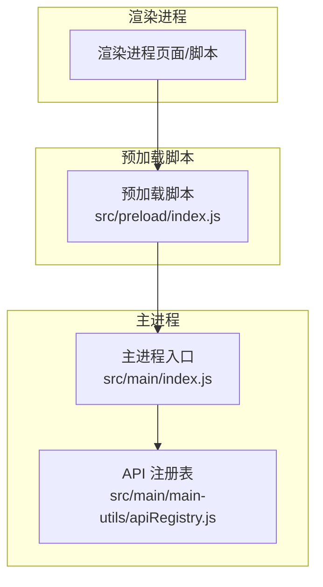
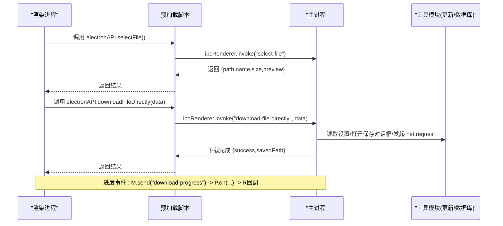
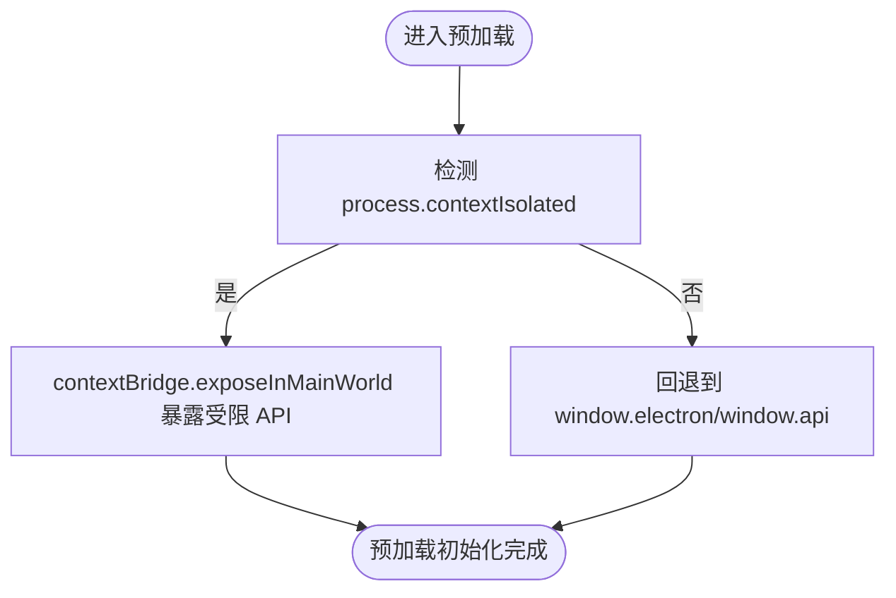
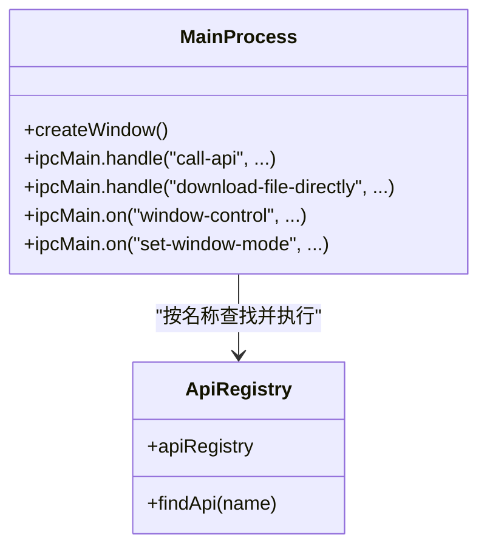
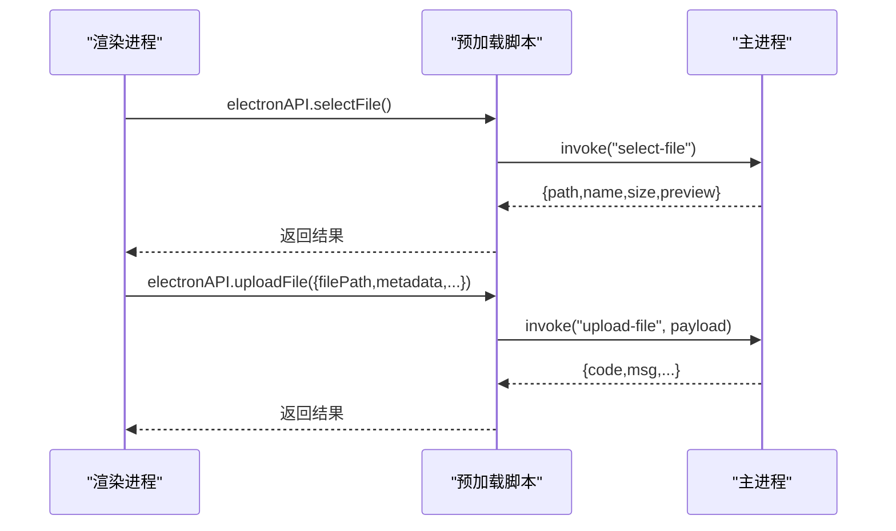
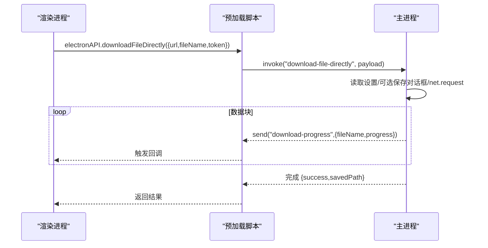
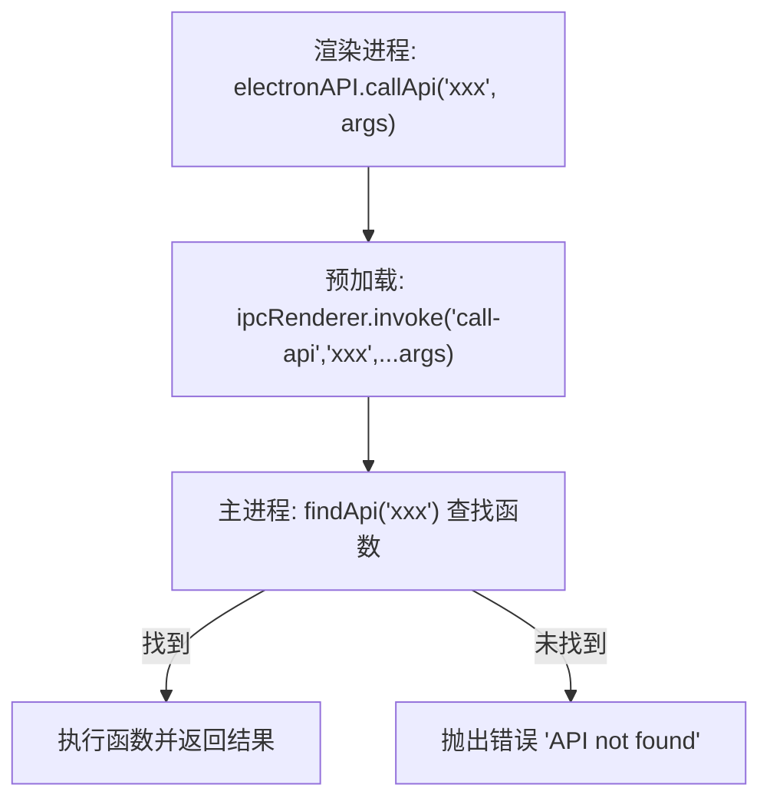
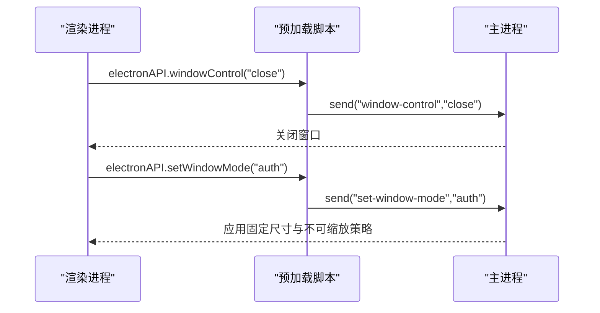
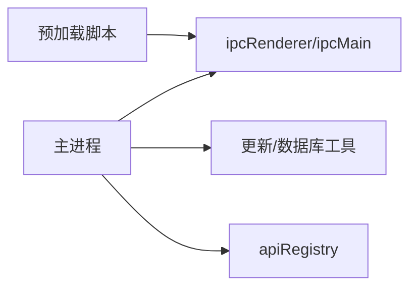

# 预加载脚本机制

<cite>
**本文引用的文件**   
- [src/preload/index.js](file://PezMax-Desktop/src/preload/index.js)
- [src/main/index.js](file://PezMax-Desktop/src/main/index.js)
- [src/main/main-utils/apiRegistry.js](file://PezMax-Desktop/src/main/main-utils/apiRegistry.js)
</cite>

## 目录
1. [简介](#简介)
2. [项目结构](#项目结构)
3. [核心组件](#核心组件)
4. [架构总览](#架构总览)
5. [详细组件分析](#详细组件分析)
6. [依赖关系分析](#依赖关系分析)
7. [性能考量](#性能考量)
8. [故障排查指南](#故障排查指南)
9. [结论](#结论)
10. [附录](#附录)

## 简介
本文件系统化阐述 Electron 预加载脚本在安全模型中的作用与实现，重点围绕上下文隔离、Node.js API 的安全暴露、IPC 白名单与权限控制、生命周期与初始化流程、扩展新系统 API 的方法，以及安全最佳实践与常见漏洞防护。文档结合仓库中的实际代码路径进行说明，帮助读者在不直接阅读源码的情况下理解并正确扩展预加载能力。

## 项目结构
本项目采用主进程（main）+ 渲染进程（renderer）+ 预加载脚本（preload）的经典分层：
- 主进程负责窗口管理、文件系统访问、网络请求、更新逻辑、全局快捷键等特权操作。
- 渲染进程运行用户界面，默认禁用 Node 集成与沙箱关闭以兼容业务需求，但通过上下文隔离限制其直接访问 Node API。
- 预加载脚本作为“受信任桥”，仅暴露最小必要接口给渲染进程，并通过 IPC 与主进程通信。

图表来源
- [src/main/index.js:233-242](file://PezMax-Desktop/src/main/index.js#L233-L242)
- [src/preload/index.js:1-65](file://PezMax-Desktop/src/preload/index.js#L1-L65)
- [src/main/main-utils/apiRegistry.js:1-21](file://PezMax-Desktop/src/main/main-utils/apiRegistry.js#L1-L21)

章节来源
- [src/main/index.js:233-242](file://PezMax-Desktop/src/main/index.js#L233-L242)
- [src/preload/index.js:1-65](file://PezMax-Desktop/src/preload/index.js#L1-L65)
- [src/main/main-utils/apiRegistry.js:1-21](file://PezMax-Desktop/src/main/main-utils/apiRegistry.js#L1-L21)

## 核心组件
- 上下文隔离与预加载注入
  - 主进程创建窗口时启用 contextIsolation=true，并在 webPreferences.preload 指向预加载脚本，确保渲染进程无法直接访问 Node 环境。
  - 预加载脚本使用 contextBridge.exposeInMainWorld 将受限的 API 对象挂载到 window，供渲染进程调用。
- IPC 白名单与路由
  - 预加载脚本仅封装了明确允许的 IPC 通道名称（如 select-file、upload-file、download-file-directly、window-control 等），形成显式白名单。
  - 主进程通过 ipcMain.handle/on 注册对应处理器，拒绝未注册的通道或函数名。
- 通用 API 路由
  - 提供 call-api 通道，按名称从 apiRegistry 查找并执行具体函数，便于集中管理与权限校验。

章节来源
- [src/main/index.js:233-242](file://PezMax-Desktop/src/main/index.js#L233-L242)
- [src/preload/index.js:10-64](file://PezMax-Desktop/src/preload/index.js#L10-L64)
- [src/main/index.js:292-305](file://PezMax-Desktop/src/main/index.js#L292-L305)
- [src/main/main-utils/apiRegistry.js:8-18](file://PezMax-Desktop/src/main/main-utils/apiRegistry.js#L8-L18)

## 架构总览
下图展示了从渲染进程发起调用到主进程处理并返回结果的完整链路，包括同步/异步 IPC 与事件回调模式。

图表来源
- [src/preload/index.js:14-32](file://PezMax-Desktop/src/preload/index.js#L14-L32)
- [src/main/index.js:527-608](file://PezMax-Desktop/src/main/index.js#L527-L608)

## 详细组件分析

### 预加载脚本：安全暴露与 IPC 白名单
- 作用
  - 在上下文隔离环境下，通过 contextBridge 将最小化 API 集合暴露给渲染进程。
  - 所有对主进程的访问均通过显式 IPC 通道，避免任意方法调用。
- 关键设计
  - 白名单式暴露：仅定义必要的函数与方法，不暴露原始 ipcRenderer 实例。
  - 统一错误处理：主进程侧 try/catch 后抛出异常，预加载层透传；渲染进程需捕获 Promise 拒绝。
  - 事件订阅：对需要推送的事件（如下载进度、窗口最大化状态）提供 onXxx 方法，返回取消监听器以便清理。
- 扩展建议
  - 新增 API 时，先在预加载中增加一个方法，再在主进程注册对应 handle/on 处理器，保持一一对应。

图表来源
- [src/preload/index.js:10-64](file://PezMax-Desktop/src/preload/index.js#L10-L64)

章节来源
- [src/preload/index.js:1-65](file://PezMax-Desktop/src/preload/index.js#L1-65)

### 主进程：窗口配置与安全策略
- 关键配置
  - preload 指向预加载脚本，contextIsolation=true，nodeIntegration=false，确保渲染进程无 Node 能力。
  - sandbox=false 用于兼容部分功能，但应配合严格的 IPC 白名单与输入校验。
  - webSecurity=false 与 allowRunningInsecureContent=true 降低跨域限制，需谨慎评估风险。
- IPC 路由
  - 使用 ipcMain.handle 处理请求-响应型调用（如 select-file、download-file-directly）。
  - 使用 ipcMain.on 处理单向命令（如 window-control、set-window-mode）。
  - 提供 call-api 通用路由，基于名称动态查找并执行 apiRegistry 中的函数，便于集中权限控制。
- 资源与生命周期
  - app.whenReady 后注册各类 IPC 处理器。
  - will-quit 注销全局快捷键并关闭数据库连接。

图表来源
- [src/main/index.js:217-242](file://PezMax-Desktop/src/main/index.js#L217-L242)
- [src/main/index.js:292-305](file://PezMax-Desktop/src/main/index.js#L292-L305)
- [src/main/main-utils/apiRegistry.js:8-18](file://PezMax-Desktop/src/main/main-utils/apiRegistry.js#L8-L18)

章节来源
- [src/main/index.js:217-242](file://PezMax-Desktop/src/main/index.js#L217-L242)
- [src/main/index.js:292-305](file://PezMax-Desktop/src/main/index.js#L292-L305)
- [src/main/main-utils/apiRegistry.js:1-21](file://PezMax-Desktop/src/main/main-utils/apiRegistry.js#L1-L21)

### 典型调用序列：文件选择与上传
- 文件选择
  - 渲染进程调用 electronAPI.selectFile()
  - 预加载通过 ipcRenderer.invoke("select-file") 请求主进程
  - 主进程弹出文件选择对话框并返回文件信息
- 文件上传
  - 渲染进程调用 electronAPI.uploadFile(uploadData)
  - 预加载转发至主进程
  - 主进程读取本地文件、构造表单数据、发起网络请求并返回结果

图表来源
- [src/preload/index.js:15-17](file://PezMax-Desktop/src/preload/index.js#L15-L17)
- [src/main/index.js:667-713](file://PezMax-Desktop/src/main/index.js#L667-L713)
- [src/main/index.js:801-881](file://PezMax-Desktop/src/main/index.js#L801-L881)

章节来源
- [src/preload/index.js:15-17](file://PezMax-Desktop/src/preload/index.js#L15-L17)
- [src/main/index.js:667-713](file://PezMax-Desktop/src/main/index.js#L667-L713)
- [src/main/index.js:801-881](file://PezMax-Desktop/src/main/index.js#L801-L881)

### 典型调用序列：底层直连下载与进度上报
- 渲染进程调用 electronAPI.downloadFileDirectly(data)
- 预加载转发至主进程
- 主进程根据设置决定是否弹出保存对话框，使用 net.request 流式下载，边写边计算进度并通过事件推送
- 渲染进程通过 electronAPI.onDownloadProgress(callback) 接收进度

图表来源
- [src/preload/index.js:31-32](file://PezMax-Desktop/src/preload/index.js#L31-L32)
- [src/main/index.js:527-608](file://PezMax-Desktop/src/main/index.js#L527-L608)

章节来源
- [src/preload/index.js:31-32](file://PezMax-Desktop/src/preload/index.js#L31-L32)
- [src/main/index.js:527-608](file://PezMax-Desktop/src/main/index.js#L527-L608)

### 通用 API 路由：call-api 与权限控制
- 预加载暴露 callApi(apiName, ...args)，通过 call-api 通道调用
- 主进程 findApi 在 apiRegistry 中查找同名函数并执行
- 扩展方式：在 apiRegistry 中添加模块与函数，即可通过 callApi 调用，便于集中鉴权与审计

图表来源
- [src/preload/index.js:15](file://PezMax-Desktop/src/preload/index.js#L15)
- [src/main/index.js:292-305](file://PezMax-Desktop/src/main/index.js#L292-L305)
- [src/main/main-utils/apiRegistry.js:13-18](file://PezMax-Desktop/src/main/main-utils/apiRegistry.js#L13-L18)

章节来源
- [src/preload/index.js:15](file://PezMax-Desktop/src/preload/index.js#L15)
- [src/main/index.js:292-305](file://PezMax-Desktop/src/main/index.js#L292-L305)
- [src/main/main-utils/apiRegistry.js:13-18](file://PezMax-Desktop/src/main/main-utils/apiRegistry.js#L13-L18)

### 窗口控制与模式切换
- 渲染进程通过 electronAPI.windowControl(action)、electronAPI.setWindowMode(mode) 控制窗口行为
- 主进程根据 action 执行 close/minimize/maximize，或在 set-window-mode 下应用不同尺寸与可缩放策略

图表来源
- [src/preload/index.js:21-23](file://PezMax-Desktop/src/preload/index.js#L21-L23)
- [src/main/index.js:611-637](file://PezMax-Desktop/src/main/index.js#L611-L637)

章节来源
- [src/preload/index.js:21-23](file://PezMax-Desktop/src/preload/index.js#L21-L23)
- [src/main/index.js:611-637](file://PezMax-Desktop/src/main/index.js#L611-L637)

## 依赖关系分析
- 预加载脚本依赖 electron 的 contextBridge 与 ipcRenderer，不直接依赖 Node 模块。
- 主进程依赖 electron 的 BrowserWindow、ipcMain、dialog、net、shell 等模块，以及自定义工具模块（更新、数据库）。
- 通用 API 路由依赖 apiRegistry 提供的函数集合。

图表来源
- [src/preload/index.js:1-2](file://PezMax-Desktop/src/preload/index.js#L1-L2)
- [src/main/index.js:1-9](file://PezMax-Desktop/src/main/index.js#L1-L9)
- [src/main/main-utils/apiRegistry.js:1-21](file://PezMax-Desktop/src/main/main-utils/apiRegistry.js#L1-L21)

章节来源
- [src/preload/index.js:1-2](file://PezMax-Desktop/src/preload/index.js#L1-L2)
- [src/main/index.js:1-9](file://PezMax-Desktop/src/main/index.js#L1-L9)
- [src/main/main-utils/apiRegistry.js:1-21](file://PezMax-Desktop/src/main/main-utils/apiRegistry.js#L1-L21)

## 性能考量
- 大文件下载采用流式写入，避免内存峰值过高。
- 批量下载记录支持 flush 一次性刷盘，减少频繁 I/O。
- 事件推送（下载进度、窗口状态）按需订阅，注意在组件卸载时移除监听器，防止内存泄漏。

[本节为通用指导，无需特定文件引用]

## 故障排查指南
- 常见问题
  - 预加载未生效：检查 webPreferences.preload 路径是否正确，contextIsolation 是否开启。
  - IPC 通道未注册：确认主进程已注册对应的 handle/on 处理器，且通道名称一致。
  - 调用失败：查看主进程日志，关注 catch 分支的错误信息与返回值。
- 定位步骤
  - 在预加载层打印调用参数与返回值。
  - 在主进程处理器内打印入参与异常堆栈。
  - 对于事件类接口，确认渲染端是否正确注册与移除监听器。

章节来源
- [src/main/index.js:292-305](file://PezMax-Desktop/src/main/index.js#L292-L305)
- [src/main/index.js:527-608](file://PezMax-Desktop/src/main/index.js#L527-L608)
- [src/main/index.js:801-881](file://PezMax-Desktop/src/main/index.js#L801-L881)

## 结论
通过上下文隔离与预加载脚本的最小化暴露，本项目实现了安全的 IPC 白名单机制。主进程集中管理敏感能力，预加载脚本充当受信任桥，渲染进程仅能调用经授权的接口。配合 call-api 通用路由与 apiRegistry，可扩展新的系统 API 访问点并保持统一的权限控制与错误处理策略。

[本节为总结性内容，无需特定文件引用]

## 附录

### 安全最佳实践清单
- 始终启用 contextIsolation=true，禁用 nodeIntegration。
- 仅通过 contextBridge 暴露必要 API，禁止直接暴露 ipcRenderer。
- 对所有 IPC 通道实施白名单与参数校验，拒绝未知通道与非法参数。
- 对涉及文件系统、网络、窗口控制的接口进行权限校验与审计。
- 对事件订阅提供取消监听器，避免内存泄漏。
- 谨慎使用 webSecurity=false 与 allowRunningInsecureContent，仅在必要时启用并做好输入过滤与输出编码。

[本节为通用指导，无需特定文件引用]

### 常见漏洞防护方案
- 路径遍历与越权访问：对传入路径进行规范化与白名单校验，限制可访问目录。
- 重放与重复提交：对关键操作引入幂等键或时间戳校验。
- 资源耗尽：对并发下载与上传进行限流与队列控制。
- 信息泄露：避免在日志中输出敏感字段（如 token、路径）。

[本节为通用指导，无需特定文件引用]

### 扩展新系统 API 的步骤
- 在预加载脚本中新增方法，封装为 ipcRenderer.invoke/send 调用。
- 在主进程中注册对应 IPC 处理器，实现业务逻辑与权限校验。
- 若需集中管理，可在 apiRegistry 中新增模块与函数，并通过 call-api 路由调用。
- 在渲染端调用新 API，并处理成功/失败与事件回调。

章节来源
- [src/preload/index.js:14-56](file://PezMax-Desktop/src/preload/index.js#L14-L56)
- [src/main/index.js:292-305](file://PezMax-Desktop/src/main/index.js#L292-L305)
- [src/main/main-utils/apiRegistry.js:8-18](file://PezMax-Desktop/src/main/main-utils/apiRegistry.js#L8-L18)