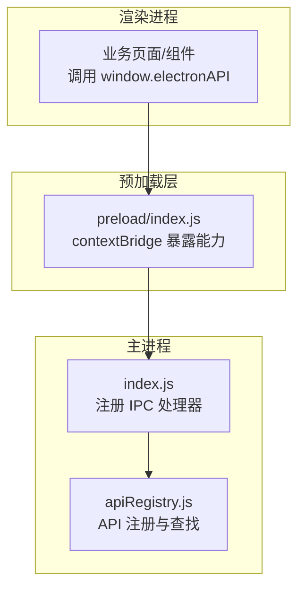
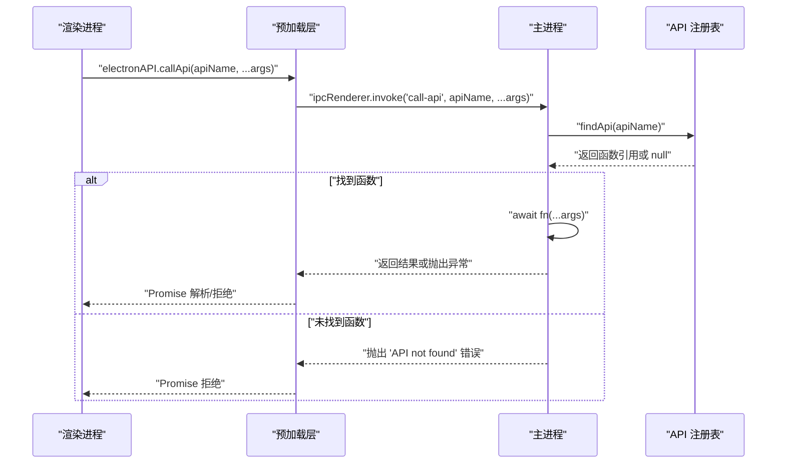
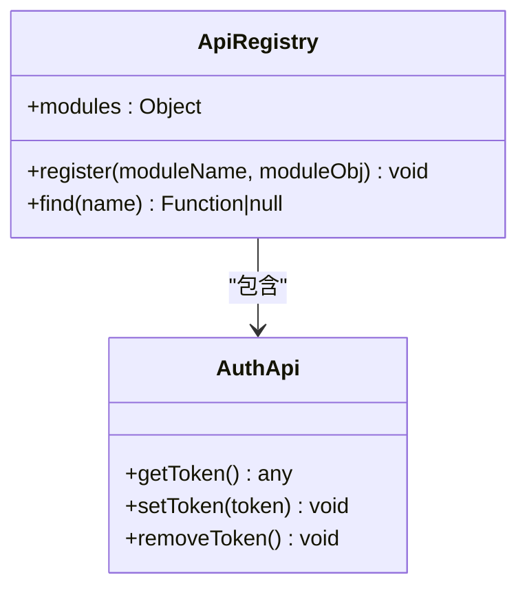
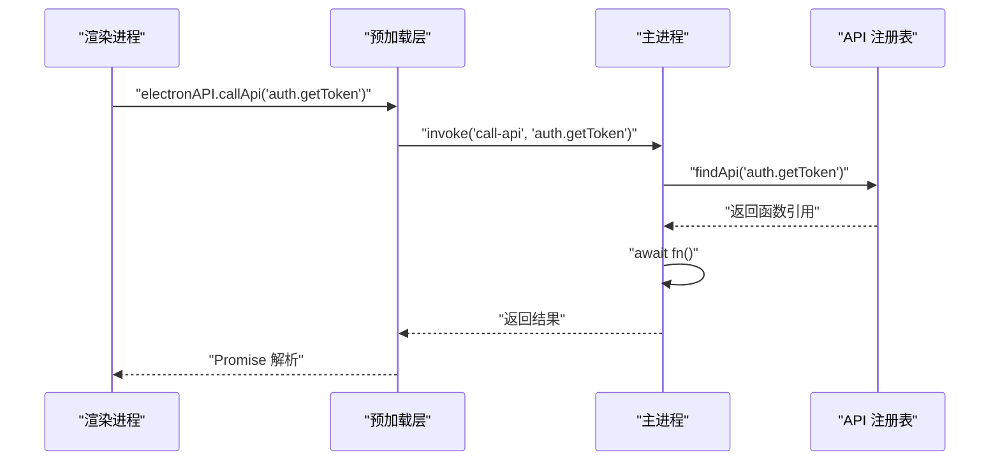
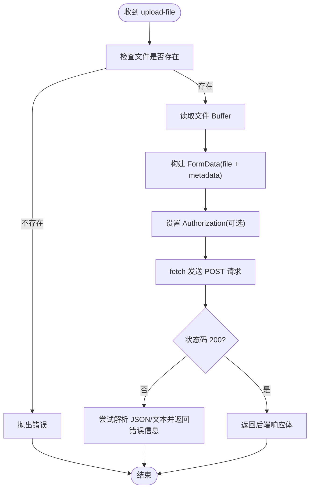
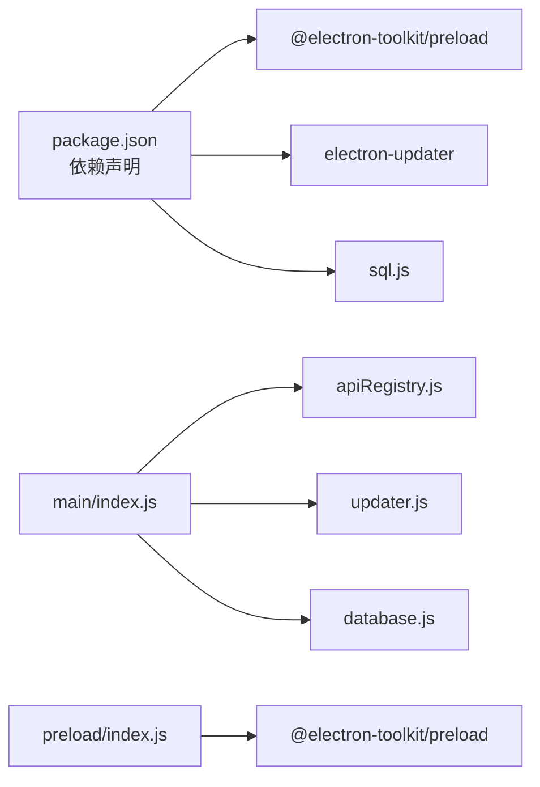

# IPC 进程间通信

<cite>
**本文引用的文件列表**
- [src/main/index.js](file://PezMax-Desktop/src/main/index.js)
- [src/preload/index.js](file://PezMax-Desktop/src/preload/index.js)
- [src/main/main-utils/apiRegistry.js](file://PezMax-Desktop/src/main/main-utils/apiRegistry.js)
- [package.json](file://PezMax-Desktop/package.json)
</cite>

## 目录
1. [简介](#简介)
2. [项目结构](#项目结构)
3. [核心组件](#核心组件)
4. [架构总览](#架构总览)
5. [详细组件分析](#详细组件分析)
6. [依赖关系分析](#依赖关系分析)
7. [性能与可观测性](#性能与可观测性)
8. [故障排查指南](#故障排查指南)
9. [结论](#结论)
10. [附录：常见通信模式示例](#附录常见通信模式示例)

## 简介
本技术文档聚焦于 Electron 桌面应用中的 IPC（进程间通信）机制，围绕主进程与渲染进程之间的安全、可扩展的通信设计展开。重点包括：
- 使用 ipcMain.handle 与 ipcRenderer.invoke 的请求/响应式通信
- 预加载脚本的安全边界与最小暴露原则
- API 注册与管理系统的动态调用机制（apiRegistry + findApi）
- 数据序列化、错误处理与异步通信最佳实践
- 调试技巧与性能监控方法（延迟分析、内存泄漏检测）
- 常见通信模式：请求/响应、事件广播、双向通信

## 项目结构
本项目采用 Electron + Vite 的工程结构，IPC 相关代码主要分布在以下位置：
- 主进程入口：src/main/index.js
- 预加载脚本：src/preload/index.js
- 主进程工具模块：src/main/main-utils/apiRegistry.js
- 构建与依赖配置：package.json

图表来源
- [src/main/index.js:292-305](file://PezMax-Desktop/src/main/index.js#L292-L305)
- [src/main/main-utils/apiRegistry.js:8-18](file://PezMax-Desktop/src/main/main-utils/apiRegistry.js#L8-L18)
- [src/preload/index.js:10-57](file://PezMax-Desktop/src/preload/index.js#L10-L57)

章节来源
- [src/main/index.js:1-120](file://PezMax-Desktop/src/main/index.js#L1-L120)
- [src/preload/index.js:1-65](file://PezMax-Desktop/src/preload/index.js#L1-L65)
- [src/main/main-utils/apiRegistry.js:1-21](file://PezMax-Desktop/src/main/main-utils/apiRegistry.js#L1-L21)
- [package.json:1-78](file://PezMax-Desktop/package.json#L1-L78)

## 核心组件
- 主进程 IPC 路由与处理器
  - 统一入口：通过 ipcMain.handle('call-api', ...) 接收渲染进程的动态 API 调用，内部根据 apiName 在 apiRegistry 中查找并执行对应函数。
  - 领域专用处理器：如设置、更新、文件保存、下载、窗口控制等，均通过 ipcMain.handle 或 ipcMain.on 注册。
- 预加载桥接层
  - 使用 contextBridge.exposeInMainWorld 将受限的 API 暴露给渲染进程，避免直接访问 Node/Electron 对象。
  - 封装 ipcRenderer.invoke 和 ipcRenderer.send/on，提供统一的 electronAPI 接口。
- API 注册与管理
  - apiRegistry 作为集中式命名空间，findApi 按名称遍历所有已注册模块以定位具体实现。
  - 当前为扩展点预留，便于后续按功能域拆分模块并动态挂载。

章节来源
- [src/main/index.js:292-305](file://PezMax-Desktop/src/main/index.js#L292-L305)
- [src/main/main-utils/apiRegistry.js:8-18](file://PezMax-Desktop/src/main/main-utils/apiRegistry.js#L8-L18)
- [src/preload/index.js:10-57](file://PezMax-Desktop/src/preload/index.js#L10-L57)

## 架构总览
下图展示了从渲染进程到主进程的核心调用链，以及动态 API 分发流程。

图表来源
- [src/preload/index.js:14-15](file://PezMax-Desktop/src/preload/index.js#L14-L15)
- [src/main/index.js:292-305](file://PezMax-Desktop/src/main/index.js#L292-L305)
- [src/main/main-utils/apiRegistry.js:12-18](file://PezMax-Desktop/src/main/main-utils/apiRegistry.js#L12-L18)

## 详细组件分析

### 主进程 IPC 路由与处理器
- 动态 API 路由
  - 通过 ipcMain.handle('call-api', ...) 统一拦截，依据 apiName 在 apiRegistry 中查找并调用。
  - 错误处理：若未找到 API，抛出明确错误；若调用失败，记录日志并向上抛出，供上层捕获。
- 领域专用处理器
  - 设置与版本：get-settings、save-settings、get-app-version
  - 更新：update:get-info / update:check / update:download / update:quit-and-install / update:configure-source 等
  - 文件系统：select-file、select-folder、read-folder-path、save-file、open-path
  - 下载：download-file-directly（基于 net 模块流式直写）、download:list/add/delete/flush/check-files/delete-local-file
  - 窗口控制：window-control、set-window-mode、window-maximized 事件
  - 缓存清理：clear-app-cache
- 资源清理
  - will-quit 时注销全局快捷键、关闭数据库连接，避免资源泄露。

章节来源
- [src/main/index.js:292-305](file://PezMax-Desktop/src/main/index.js#L292-L305)
- [src/main/index.js:332-352](file://PezMax-Desktop/src/main/index.js#L332-L352)
- [src/main/index.js:354-382](file://PezMax-Desktop/src/main/index.js#L354-L382)
- [src/main/index.js:384-427](file://PezMax-Desktop/src/main/index.js#L384-L427)
- [src/main/index.js:429-525](file://PezMax-Desktop/src/main/index.js#L429-L525)
- [src/main/index.js:527-608](file://PezMax-Desktop/src/main/index.js#L527-L608)
- [src/main/index.js:611-637](file://PezMax-Desktop/src/main/index.js#L611-L637)
- [src/main/index.js:639-713](file://PezMax-Desktop/src/main/index.js#L639-L713)
- [src/main/index.js:760-787](file://PezMax-Desktop/src/main/index.js#L760-L787)
- [src/main/index.js:801-881](file://PezMax-Desktop/src/main/index.js#L801-L881)
- [src/main/index.js:308-313](file://PezMax-Desktop/src/main/index.js#L308-L313)

### 预加载脚本与安全边界
- 安全隔离
  - 主进程启用 contextIsolation: true、nodeIntegration: false，确保渲染进程无法直接访问 Node 环境。
  - 预加载层仅通过 contextBridge.exposeInMainWorld 暴露必要能力，遵循最小权限原则。
- 暴露的 API 集合
  - 通用：callApi（动态调用）、platform
  - 文件与系统：selectFile、uploadFile、cancelUpload、selectFolder、readFolderPath、saveFile、openPath、selectBackgroundImage、selectDownloadPath
  - 下载：downloadFileDirectly、onDownloadProgress、downloadRecords.*
  - 设置与更新：getSettings、saveSettings、getAppVersion、getUpdateInfo、checkForUpdates、downloadUpdate、quitAndInstall、saveShortcutStateBeforeUpdate、getPresetUpdateSources、configureUpdateSource、onUpdateStatus
  - 窗口控制：windowControl、closeWindow、setWindowMode、onWindowMaximized
  - 缓存：clearAppCache
- 事件订阅管理
  - 对 on* 类监听器，建议返回取消监听函数，避免重复绑定导致内存增长。

章节来源
- [src/main/index.js:233-241](file://PezMax-Desktop/src/main/index.js#L233-L241)
- [src/preload/index.js:10-57](file://PezMax-Desktop/src/preload/index.js#L10-L57)

### API 注册与管理（apiRegistry）
- 设计模式
  - 集中式命名空间：apiRegistry 作为模块聚合容器，便于按功能域组织。
  - 动态查找：findApi 遍历所有模块导出，按名称匹配函数，支持运行时扩展。
- 扩展方式
  - 新增模块后，将其导出对象合并入 apiRegistry，即可通过 call-api 动态调用。
  - 建议在模块内做好参数校验与错误包装，保证跨进程调用的健壮性。

图表来源
- [src/main/main-utils/apiRegistry.js:8-18](file://PezMax-Desktop/src/main/main-utils/apiRegistry.js#L8-L18)

章节来源
- [src/main/main-utils/apiRegistry.js:1-21](file://PezMax-Desktop/src/main/main-utils/apiRegistry.js#L1-L21)

### 关键流程时序图

#### 动态 API 调用（call-api）

图表来源
- [src/preload/index.js:14-15](file://PezMax-Desktop/src/preload/index.js#L14-L15)
- [src/main/index.js:292-305](file://PezMax-Desktop/src/main/index.js#L292-L305)
- [src/main/main-utils/apiRegistry.js:12-18](file://PezMax-Desktop/src/main/main-utils/apiRegistry.js#L12-L18)

#### 文件上传（upload-file）

图表来源
- [src/main/index.js:801-881](file://PezMax-Desktop/src/main/index.js#L801-L881)

章节来源
- [src/main/index.js:801-881](file://PezMax-Desktop/src/main/index.js#L801-L881)

## 依赖关系分析
- 主进程依赖
  - Electron 核心模块：app、BrowserWindow、ipcMain、globalShortcut、dialog、net、shell
  - 自定义工具：apiRegistry、updater、database
- 预加载层依赖
  - contextBridge、ipcRenderer
  - @electron-toolkit/preload 提供的 electronAPI
- 渲染进程依赖
  - 通过 window.electronAPI 间接依赖上述能力

图表来源
- [package.json:28-52](file://PezMax-Desktop/package.json#L28-L52)
- [src/main/index.js:7-9](file://PezMax-Desktop/src/main/index.js#L7-L9)
- [src/preload/index.js:1-2](file://PezMax-Desktop/src/preload/index.js#L1-L2)

章节来源
- [package.json:1-78](file://PezMax-Desktop/package.json#L1-L78)
- [src/main/index.js:1-10](file://PezMax-Desktop/src/main/index.js#L1-L10)
- [src/preload/index.js:1-5](file://PezMax-Desktop/src/preload/index.js#L1-L5)

## 性能与可观测性
- 通信延迟分析
  - 在渲染侧对 electronAPI.* 调用前后打点，计算往返时间（RTT）。
  - 针对长耗时操作（如 download-file-directly、upload-file），在主进程侧统计各阶段耗时（网络、IO、序列化）。
- 内存泄漏检测
  - 事件监听器：确保 on* 监听器有对应的移除逻辑，避免重复绑定。
  - 大对象传输：避免在 IPC 中传递超大对象或二进制数据，优先使用流式或分块策略。
  - 资源释放：will-quit 中注销全局快捷键、关闭数据库连接，防止句柄泄露。
- 日志与诊断
  - 主进程关键路径增加结构化日志（含上下文、耗时、错误堆栈）。
  - 开发环境开启 DevTools，生产环境保留 F12 快捷键以便快速定位问题。

[本节为通用指导，不直接分析具体文件]

## 故障排查指南
- 常见问题
  - API 未找到：确认 apiRegistry 是否已正确注册目标模块，且 apiName 拼写一致。
  - 上传失败：检查 baseUrl/customApiUrl、token 是否正确；关注后端返回的状态码与响应体。
  - 下载中断：确认 URL 可达、Authorization 头有效；查看 download-progress 事件是否正常触发。
  - 窗口控制无效：确认 set-window-mode 与 window-control 消息是否发送到正确的窗口实例。
- 定位步骤
  - 在预加载层打印调用参数与返回值，验证 IPC 通道是否畅通。
  - 在主进程处理器中增加 try/catch 与日志输出，捕获异常并返回明确的错误信息。
  - 使用浏览器 DevTools 的 Network 面板观察底层 HTTP 请求（适用于 fetch/net 发起的网络调用）。

章节来源
- [src/main/index.js:292-305](file://PezMax-Desktop/src/main/index.js#L292-L305)
- [src/main/index.js:801-881](file://PezMax-Desktop/src/main/index.js#L801-L881)
- [src/main/index.js:527-608](file://PezMax-Desktop/src/main/index.js#L527-L608)
- [src/main/index.js:611-637](file://PezMax-Desktop/src/main/index.js#L611-L637)

## 结论
本项目通过“预加载桥接 + 主进程统一路由 + 动态 API 注册”的三层架构，实现了安全、可扩展的 IPC 通信体系。该设计既保证了渲染进程的最小权限暴露，又提供了灵活的运行时扩展能力。结合完善的错误处理、日志与资源清理策略，可在复杂业务场景下保持稳定的通信质量与良好的可维护性。

[本节为总结性内容，不直接分析具体文件]

## 附录：常见通信模式示例

### 请求/响应模式（推荐）
- 渲染进程
  - 使用 electronAPI.callApi('module.method', ...args) 或特定封装方法（如 selectFile、saveFile）。
- 主进程
  - 通过 ipcMain.handle('call-api', ...) 统一分发；或为特定能力注册独立 handle。
- 适用场景
  - 需要等待结果的同步式交互，如查询设置、保存文件、触发下载等。

章节来源
- [src/preload/index.js:14-34](file://PezMax-Desktop/src/preload/index.js#L14-L34)
- [src/main/index.js:292-305](file://PezMax-Desktop/src/main/index.js#L292-L305)
- [src/main/index.js:384-427](file://PezMax-Desktop/src/main/index.js#L384-L427)

### 事件广播模式
- 主进程
  - 使用 webContents.send 向渲染进程推送事件（如 window-maximized、download-progress、update-status）。
- 渲染进程
  - 在预加载层封装 on* 监听器，并在组件生命周期中及时移除监听，避免内存泄漏。
- 适用场景
  - 进度上报、状态变更通知、全局事件广播。

章节来源
- [src/main/index.js:257-263](file://PezMax-Desktop/src/main/index.js#L257-L263)
- [src/main/index.js:576-579](file://PezMax-Desktop/src/main/index.js#L576-L579)
- [src/preload/index.js:24-46](file://PezMax-Desktop/src/preload/index.js#L24-L46)

### 双向通信模式
- 典型组合
  - 请求/响应用于命令式调用（如 saveFile、download-file-directly）。
  - 事件用于回调与状态推送（如 onDownloadProgress、onUpdateStatus）。
- 注意事项
  - 避免在高频事件中传输大数据，必要时采用增量或分片策略。
  - 合理设置超时与重试策略，提升鲁棒性。

章节来源
- [src/preload/index.js:31-46](file://PezMax-Desktop/src/preload/index.js#L31-L46)
- [src/main/index.js:527-608](file://PezMax-Desktop/src/main/index.js#L527-L608)