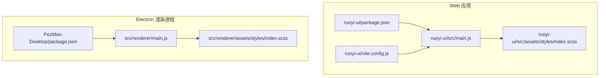
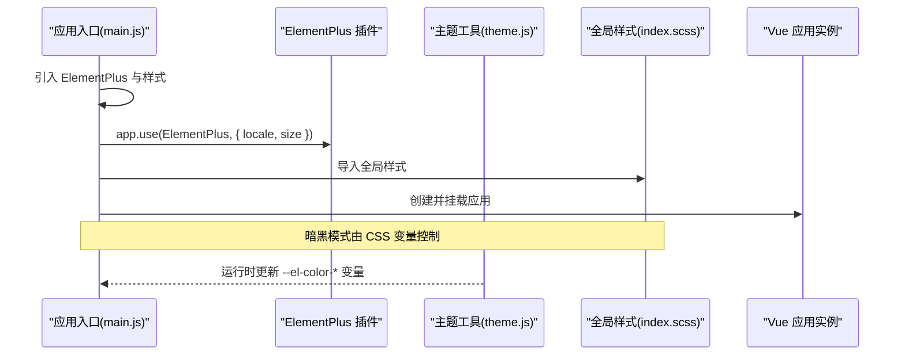
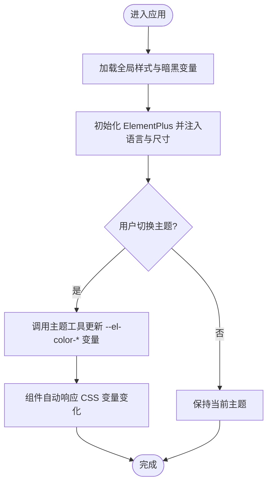
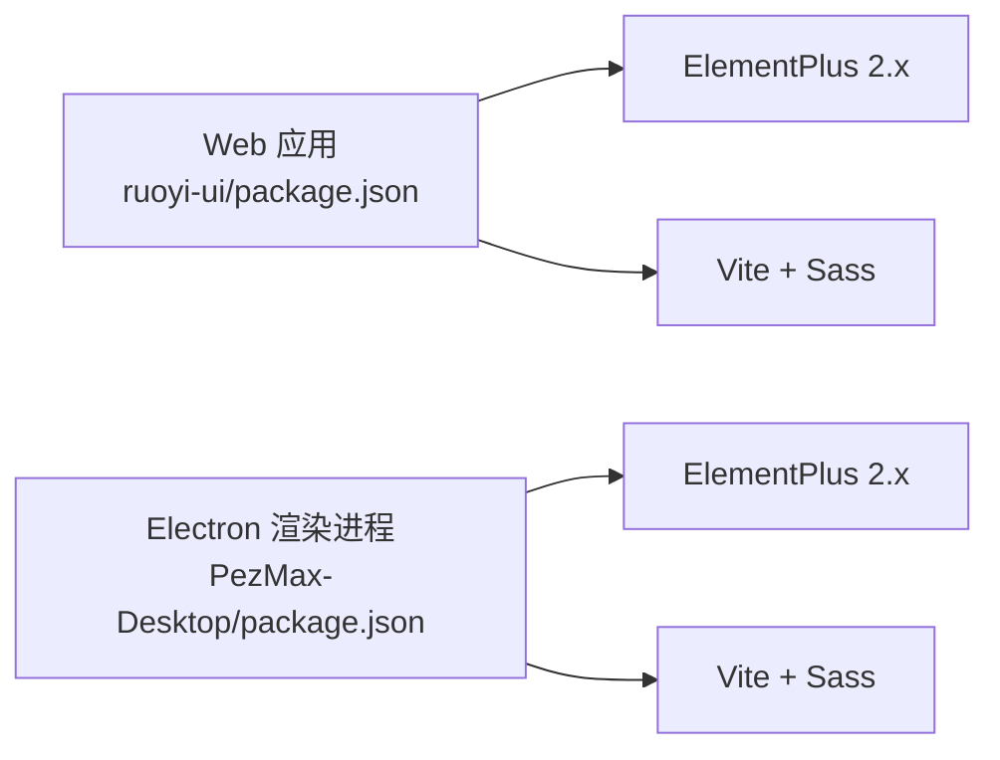

# UI 组件库集成与定制

<cite>
**本文引用的文件**   
- [package.json](file://PezMax-Backend/ruoyi-ui/package.json)
- [vite.config.js](file://PezMax-Backend/ruoyi-ui/vite.config.js)
- [main.js](file://PezMax-Backend/ruoyi-ui/src/main.js)
- [index.scss](file://PezMax-Backend/ruoyi-ui/src/assets/styles/index.scss)
- [theme.js](file://PezMax-Backend/ruoyi-ui/src/utils/theme.js)
- [package.json](file://PezMax-Desktop/package.json)
- [renderer main.js](file://PezMax-Desktop/src/renderer/main.js)
- [renderer index.scss](file://PezMax-Desktop/src/renderer/assets/styles/index.scss)
</cite>

## 目录
1. [简介](#简介)
2. [项目结构](#项目结构)
3. [核心组件](#核心组件)
4. [架构总览](#架构总览)
5. [详细组件分析](#详细组件分析)
6. [依赖分析](#依赖分析)
7. [性能考虑](#性能考虑)
8. [故障排查指南](#故障排查指南)
9. [结论](#结论)
10. [附录](#附录)

## 简介
本指南面向在 Web 与 Electron 渲染进程中使用 Element Plus 的前端团队，提供从安装、全局注册、语言包设置、主题初始化到样式覆盖、暗黑模式、响应式适配、自定义组件封装以及性能优化的完整实践路径。文档基于仓库中实际实现进行梳理，确保可落地、可复现。

## 项目结构
本项目包含两个前端入口：
- Web 应用（后端管理界面）：位于 PezMax-Backend/ruoyi-ui
- Electron 渲染进程：位于 PezMax-Desktop/src/renderer

两者均使用 Vue 3 + Vite 构建，并集成 Element Plus。Web 侧通过 vite.config.js 配置代理与打包策略；Electron 侧在 renderer/main.js 中完成 Element Plus 的引入与初始化。

图表来源
- [package.json:1-55](file://PezMax-Backend/ruoyi-ui/package.json#L1-L55)
- [vite.config.js:1-80](file://PezMax-Backend/ruoyi-ui/vite.config.js#L1-L80)
- [main.js:1-85](file://PezMax-Backend/ruoyi-ui/src/main.js#L1-L85)
- [index.scss:1-180](file://PezMax-Backend/ruoyi-ui/src/assets/styles/index.scss#L1-L180)
- [package.json:1-78](file://PezMax-Desktop/package.json#L1-L78)
- [renderer main.js:1-85](file://PezMax-Desktop/src/renderer/main.js#L1-L85)
- [renderer index.scss:1-268](file://PezMax-Desktop/src/renderer/assets/styles/index.scss#L1-L268)

章节来源
- [package.json:1-55](file://PezMax-Backend/ruoyi-ui/package.json#L1-L55)
- [vite.config.js:1-80](file://PezMax-Backend/ruoyi-ui/vite.config.js#L1-L80)
- [main.js:1-85](file://PezMax-Backend/ruoyi-ui/src/main.js#L1-L85)
- [index.scss:1-180](file://PezMax-Backend/ruoyi-ui/src/assets/styles/index.scss#L1-L180)
- [package.json:1-78](file://PezMax-Desktop/package.json#L1-L78)
- [renderer main.js:1-85](file://PezMax-Desktop/src/renderer/main.js#L1-L85)
- [renderer index.scss:1-268](file://PezMax-Desktop/src/renderer/assets/styles/index.scss#L1-L268)

## 核心组件
本节聚焦 Element Plus 的集成关键点：安装、全局注册、语言包、主题与 CSS 变量、全局样式组织与覆盖策略。

- 安装与版本
  - Web 应用与 Electron 渲染进程均在各自 package.json 中声明 element-plus 与 @element-plus/icons-vue 依赖。
- 全局注册与语言包
  - 在应用入口 main.js 中统一引入 ElementPlus、默认样式与暗黑模式 CSS 变量，并注册中文语言包。
  - 通过 app.use(ElementPlus, { locale, size }) 完成全局大小与语言设置。
- 主题初始化
  - 通过运行时动态设置 CSS 变量 --el-color-primary 及其明暗变体，实现主题色切换。
  - 在 Electron 渲染进程中，通过 :root 与 html.dark 定义 IDE 风格 CSS 变量，并映射到 Element Plus 的 CSS 变量以支持暗黑模式。
- 全局样式组织
  - 统一的 index.scss 聚合基础样式、过渡动画、Element UI 覆盖、侧边栏、按钮等模块。
  - 提供通用工具类与布局容器，便于跨页面复用。

章节来源
- [package.json:18-38](file://PezMax-Backend/ruoyi-ui/package.json#L18-L38)
- [package.json:28-53](file://PezMax-Desktop/package.json#L28-L53)
- [main.js:1-85](file://PezMax-Backend/ruoyi-ui/src/main.js#L1-L85)
- [renderer main.js:1-85](file://PezMax-Desktop/src/renderer/main.js#L1-L85)
- [theme.js:1-50](file://PezMax-Backend/ruoyi-ui/src/utils/theme.js#L1-L50)
- [index.scss:1-180](file://PezMax-Backend/ruoyi-ui/src/assets/styles/index.scss#L1-L180)
- [renderer index.scss:1-268](file://PezMax-Desktop/src/renderer/assets/styles/index.scss#L1-L268)

## 架构总览
下图展示 Element Plus 在 Web 与 Electron 渲染进程中的集成关系与数据流：入口文件负责引入样式与语言包，挂载插件与全局组件，并通过 CSS 变量驱动主题与暗黑模式。

图表来源
- [main.js:1-85](file://PezMax-Backend/ruoyi-ui/src/main.js#L1-L85)
- [theme.js:1-50](file://PezMax-Backend/ruoyi-ui/src/utils/theme.js#L1-L50)
- [index.scss:1-180](file://PezMax-Backend/ruoyi-ui/src/assets/styles/index.scss#L1-L180)
- [renderer main.js:1-85](file://PezMax-Desktop/src/renderer/main.js#L1-L85)
- [renderer index.scss:1-268](file://PezMax-Desktop/src/renderer/assets/styles/index.scss#L1-L268)

## 详细组件分析

### 主题与暗黑模式
- 主题色切换
  - 通过运行时修改根节点 CSS 变量 --el-color-primary 及明暗变体，实现主题色即时生效。
  - 颜色计算工具提供 hex/rgb 转换与明暗度生成，保证色板一致性。
- 暗黑模式
  - 在 Electron 渲染进程的 index.scss 中定义 :root 与 html.dark 两套 CSS 变量，并将 Element Plus 的关键变量映射到 IDE 主题变量，从而一键切换深色背景、边框与文本。
  - 同时为 body 添加背景与文字过渡，提升切换体验。

图表来源
- [theme.js:1-50](file://PezMax-Backend/ruoyi-ui/src/utils/theme.js#L1-L50)
- [renderer index.scss:181-231](file://PezMax-Desktop/src/renderer/assets/styles/index.scss#L181-L231)

章节来源
- [theme.js:1-50](file://PezMax-Backend/ruoyi-ui/src/utils/theme.js#L1-L50)
- [renderer index.scss:181-231](file://PezMax-Desktop/src/renderer/assets/styles/index.scss#L181-L231)

### 全局样式组织与覆盖策略
- 样式聚合
  - 将基础重置、过渡、Element UI 覆盖、侧边栏、按钮等模块集中导入，形成单一入口 index.scss，便于维护。
- 覆盖原则
  - 优先使用 CSS 变量覆盖（如 --el-bg-color、--el-text-color-primary 等），减少选择器权重冲突。
  - 仅在必要时使用 !important 或更具体选择器，避免污染全局。
- 通用工具类
  - 提供常用布局与排版工具类，减少重复代码。

章节来源
- [index.scss:1-180](file://PezMax-Backend/ruoyi-ui/src/assets/styles/index.scss#L1-L180)
- [renderer index.scss:1-180](file://PezMax-Desktop/src/renderer/assets/styles/index.scss#L1-L180)

### 按需引入与打包优化
- 现状
  - 当前在入口文件中全局引入 ElementPlus 与全部样式，未启用按需引入。
- 建议
  - 结合 unplugin-auto-import 与 unplugin-vue-components 实现组件与 API 的按需引入与自动注册，减小首屏体积。
  - 保留必要的全局样式入口，但仅引入所需主题与图标资源。

章节来源
- [package.json:39-47](file://PezMax-Backend/ruoyi-ui/package.json#L39-L47)
- [package.json:54-76](file://PezMax-Desktop/package.json#L54-L76)
- [main.js:1-85](file://PezMax-Backend/ruoyi-ui/src/main.js#L1-L85)
- [renderer main.js:1-85](file://PezMax-Desktop/src/renderer/main.js#L1-L85)

### 自定义组件开发与设计系统
- 现有自定义组件
  - 项目中已封装多个业务组件（如分页、富文本、上传、图片预览、字典标签等），并在入口统一注册为全局组件，降低页面耦合。
- 设计系统建议
  - 将品牌色、字号、间距、圆角等抽象为 CSS 变量，配合 Element Plus 的 CSS 变量体系，形成统一的设计令牌。
  - 对复杂交互组件采用组合式函数与指令拆分逻辑，提高可测试性与复用性。

章节来源
- [main.js:47-85](file://PezMax-Backend/ruoyi-ui/src/main.js#L47-L85)
- [renderer main.js:45-85](file://PezMax-Desktop/src/renderer/main.js#L45-L85)

### 响应式设计适配
- 移动端兼容
  - 建议在布局层使用弹性布局与栅格系统，结合媒体查询调整导航与表格行为。
  - 针对小屏幕隐藏次要操作列，或将筛选条件折叠至抽屉。
- 不同屏幕尺寸
  - 使用相对单位与 CSS 变量控制间距与字号，避免硬编码像素值。
  - 列表与表格在大屏下显示更多字段，在小屏下启用横向滚动或卡片视图。

[本节为概念性指导，不直接分析具体文件]

### 大列表与虚拟滚动优化
- 场景
  - 当表格或下拉选项数据量较大时，建议使用虚拟滚动方案（如 vue-virtual-scroller 或 Element Plus 的 Table 虚拟滚动能力）。
- 要点
  - 固定行高或使用估算行高，减少重排。
  - 分页与懒加载结合，避免一次性渲染过多 DOM。

[本节为概念性指导，不直接分析具体文件]

## 依赖分析
- 关键依赖
  - element-plus 与 @element-plus/icons-vue 在 Web 与 Electron 两端均已声明。
- 构建与插件
  - 使用 Vite 作为构建工具，配合 sass/sass-embedded 处理 SCSS。
  - 已集成 unplugin-auto-import 与 svg 图标插件，便于后续按需引入与图标管理。

图表来源
- [package.json:18-47](file://PezMax-Backend/ruoyi-ui/package.json#L18-L47)
- [package.json:28-76](file://PezMax-Desktop/package.json#L28-L76)

章节来源
- [package.json:18-47](file://PezMax-Backend/ruoyi-ui/package.json#L18-L47)
- [package.json:28-76](file://PezMax-Desktop/package.json#L28-L76)

## 性能考虑
- 按需引入
  - 使用 unplugin-auto-import 与 unplugin-vue-components 实现组件与 API 的按需引入，显著减少首屏体积。
- 资源压缩
  - 利用 vite-plugin-compression 开启 Gzip/Brotli 压缩，降低传输体积。
- 缓存与分包
  - 合理划分 chunk，静态资源加 hash，利于浏览器长期缓存。
- 渲染优化
  - 大数据列表采用虚拟滚动；长表格启用分页与懒加载；避免在模板中进行复杂计算。

[本节为通用优化建议，不直接分析具体文件]

## 故障排查指南
- 主题未生效
  - 检查是否在入口正确引入 ElementPlus 与样式，确认 --el-color-* 变量是否被正确设置。
  - 参考主题工具的实现路径，验证运行时变量更新逻辑。
- 暗黑模式异常
  - 确认 html.dark 类是否正确添加到根节点，且 CSS 变量映射到 Element Plus 变量。
  - 检查 body 与 #app 的背景色与过渡是否生效。
- 样式覆盖无效
  - 优先使用 CSS 变量覆盖，避免过高的选择器权重；必要时使用 scoped 或更具体的命名空间。
- 构建代理问题
  - 检查 vite.config.js 中的 proxy 配置与 baseUrl 是否正确，确保接口请求路径匹配。

章节来源
- [main.js:1-85](file://PezMax-Backend/ruoyi-ui/src/main.js#L1-L85)
- [theme.js:1-50](file://PezMax-Backend/ruoyi-ui/src/utils/theme.js#L1-L50)
- [renderer index.scss:181-231](file://PezMax-Desktop/src/renderer/assets/styles/index.scss#L181-L231)
- [vite.config.js:44-61](file://PezMax-Backend/ruoyi-ui/vite.config.js#L44-L61)

## 结论
通过在入口统一注册 ElementPlus、使用 CSS 变量驱动主题与暗黑模式、集中管理全局样式，并结合按需引入与构建优化，可在 Web 与 Electron 环境中获得一致、可维护且高性能的 UI 体验。建议逐步推进按需引入与组件化封装，完善设计令牌与响应式规范，持续提升团队协作效率与用户体验。

## 附录
- 快速清单
  - 安装依赖：确认 element-plus 与图标包已在 package.json 中声明。
  - 全局注册：在入口引入 ElementPlus、样式与语言包，并设置 size。
  - 主题切换：通过主题工具更新 --el-color-* 变量。
  - 暗黑模式：在根节点切换 html.dark，并确保 CSS 变量映射。
  - 样式覆盖：优先使用 CSS 变量，谨慎使用 !important。
  - 按需引入：启用 unplugin-auto-import 与 unplugin-vue-components。
  - 构建优化：开启压缩、合理分包、静态资源加 hash。

[本节为总结性内容，不直接分析具体文件]