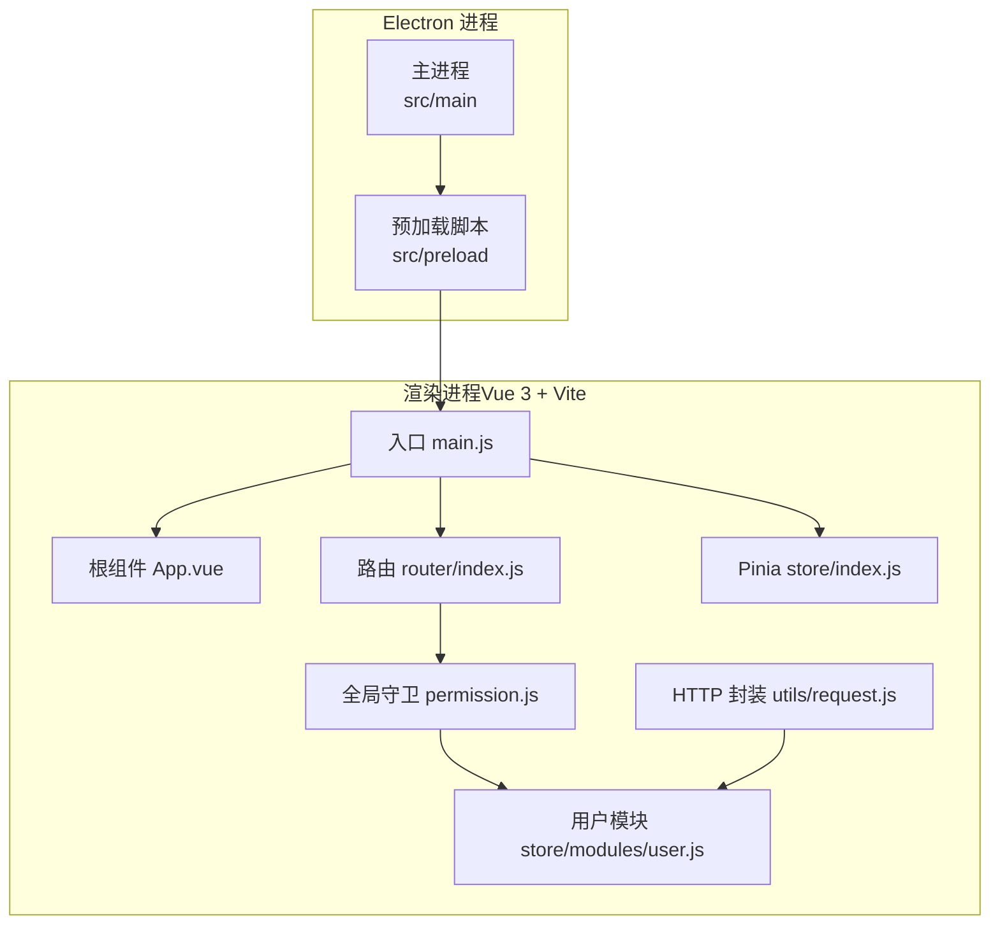
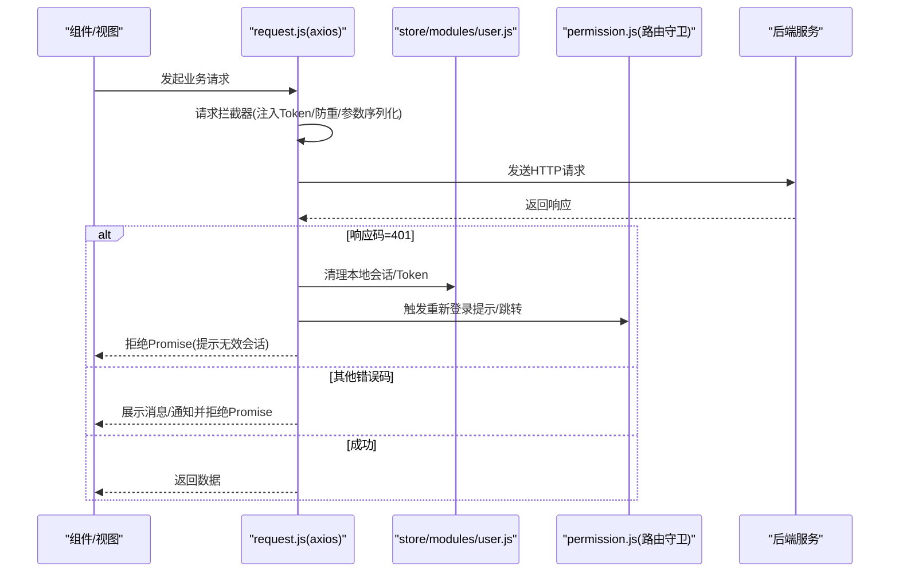
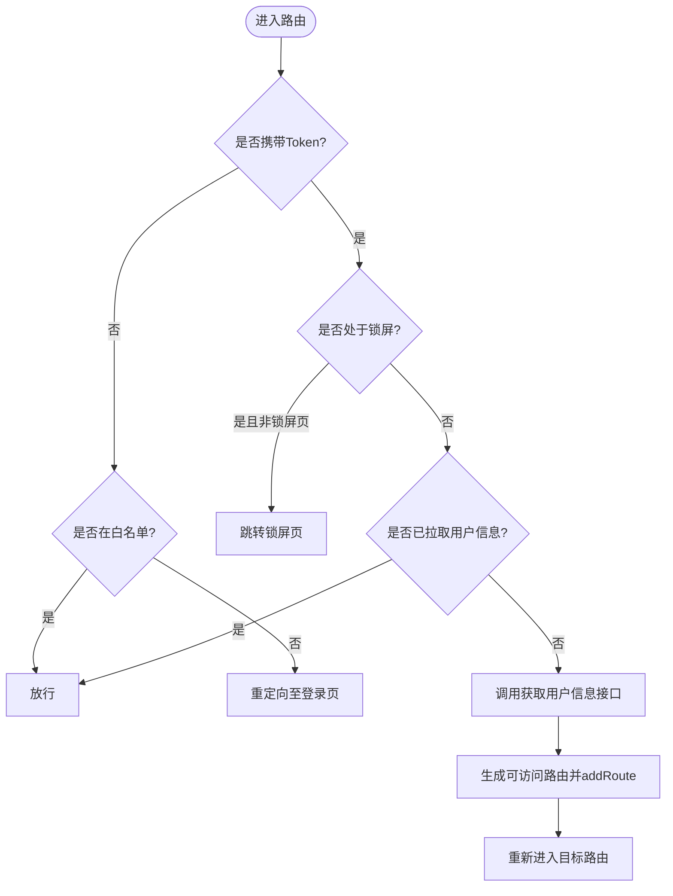
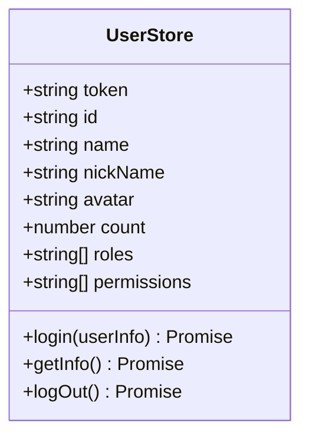
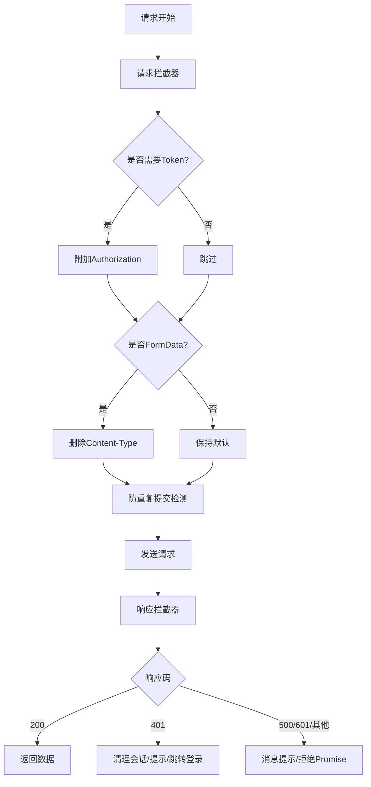
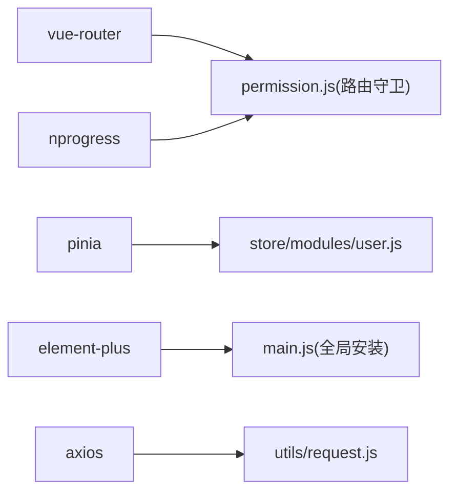

# Vue 3 前端集成

<cite>
**本文引用的文件**   
- [package.json](file://PezMax-Desktop/package.json)
- [electron.vite.config.mjs](file://PezMax-Desktop/electron.vite.config.mjs)
- [src/renderer/main.js](file://PezMax-Desktop/src/renderer/main.js)
- [src/renderer/App.vue](file://PezMax-Desktop/src/renderer/App.vue)
- [src/renderer/router/index.js](file://PezMax-Desktop/src/renderer/router/index.js)
- [src/renderer/permission.js](file://PezMax-Desktop/src/renderer/permission.js)
- [src/renderer/store/index.js](file://PezMax-Desktop/src/renderer/store/index.js)
- [src/renderer/store/modules/user.js](file://PezMax-Desktop/src/renderer/store/modules/user.js)
- [src/renderer/utils/request.js](file://PezMax-Desktop/src/renderer/utils/request.js)
</cite>

## 目录
1. [简介](#简介)
2. [项目结构](#项目结构)
3. [核心组件](#核心组件)
4. [架构总览](#架构总览)
5. [详细组件分析](#详细组件分析)
6. [依赖分析](#依赖分析)
7. [性能考虑](#性能考虑)
8. [故障排查指南](#故障排查指南)
9. [结论](#结论)
10. [附录](#附录)

## 简介
本指南面向在 Electron 中集成 Vue 3 + Vite 的前端工程，结合仓库中的实际实现，系统阐述以下内容：
- 构建配置：开发/生产差异化、插件与优化策略
- 组件规范：单文件组件结构、组合式 API 使用模式、TypeScript 集成建议
- 状态管理：基于 Pinia 的模块设计、持久化与跨组件通信
- 路由策略：动态路由、权限控制与嵌套路由
- UI 组件库：Element Plus 集成、主题定制与样式覆盖
- 性能优化：代码分割、懒加载与资源优化

## 项目结构
本项目采用 electron-vite 多入口（main/preload/renderer）组织方式。渲染进程为 Vue 3 + Vite 应用，通过 electron-vite 统一构建与运行。

图表来源
- [electron.vite.config.mjs:1-121](file://PezMax-Desktop/electron.vite.config.mjs#L1-L121)
- [src/renderer/main.js:1-85](file://PezMax-Desktop/src/renderer/main.js#L1-L85)
- [src/renderer/App.vue:1-68](file://PezMax-Desktop/src/renderer/App.vue#L1-L68)
- [src/renderer/router/index.js:1-111](file://PezMax-Desktop/src/renderer/router/index.js#L1-L111)
- [src/renderer/permission.js:1-106](file://PezMax-Desktop/src/renderer/permission.js#L1-L106)
- [src/renderer/store/index.js:1-4](file://PezMax-Desktop/src/renderer/store/index.js#L1-L4)
- [src/renderer/store/modules/user.js:1-125](file://PezMax-Desktop/src/renderer/store/modules/user.js#L1-L125)
- [src/renderer/utils/request.js:1-217](file://PezMax-Desktop/src/renderer/utils/request.js#L1-L217)

章节来源
- [package.json:1-78](file://PezMax-Desktop/package.json#L1-L78)
- [electron.vite.config.mjs:1-121](file://PezMax-Desktop/electron.vite.config.mjs#L1-L121)

## 核心组件
- 应用入口与插件注册
  - 入口负责安装 Element Plus、全局指令、全局方法、SVG 图标、路由、Pinia、自定义插件等，并挂载根组件。
  - 参考路径：[src/renderer/main.js:1-85](file://PezMax-Desktop/src/renderer/main.js#L1-L85)
- 根布局与主题切换
  - 根组件提供统一标题栏与内容区，并在路由变化时根据认证页面切换 IDE 风格主题。
  - 参考路径：[src/renderer/App.vue:1-68](file://PezMax-Desktop/src/renderer/App.vue#L1-L68)
- 路由与权限
  - 静态路由定义公共页面；全局前置守卫负责白名单、锁屏、登录态校验、动态路由生成与追加。
  - 参考路径：[src/renderer/router/index.js:1-111](file://PezMax-Desktop/src/renderer/router/index.js#L1-L111)、[src/renderer/permission.js:1-106](file://PezMax-Desktop/src/renderer/permission.js#L1-L106)
- 状态管理（Pinia）
  - 初始化 Pinia 实例；用户模块封装登录、获取信息、登出等动作，并与路由和存储交互。
  - 参考路径：[src/renderer/store/index.js:1-4](file://PezMax-Desktop/src/renderer/store/index.js#L1-L4)、[src/renderer/store/modules/user.js:1-125](file://PezMax-Desktop/src/renderer/store/modules/user.js#L1-L125)
- HTTP 请求封装
  - 基于 axios 的请求拦截器注入 Token、防重复提交、参数序列化；响应拦截器处理错误码、会话过期、下载等。
  - 参考路径：[src/renderer/utils/request.js:1-217](file://PezMax-Desktop/src/renderer/utils/request.js#L1-L217)

章节来源
- [src/renderer/main.js:1-85](file://PezMax-Desktop/src/renderer/main.js#L1-L85)
- [src/renderer/App.vue:1-68](file://PezMax-Desktop/src/renderer/App.vue#L1-L68)
- [src/renderer/router/index.js:1-111](file://PezMax-Desktop/src/renderer/router/index.js#L1-L111)
- [src/renderer/permission.js:1-106](file://PezMax-Desktop/src/renderer/permission.js#L1-L106)
- [src/renderer/store/index.js:1-4](file://PezMax-Desktop/src/renderer/store/index.js#L1-L4)
- [src/renderer/store/modules/user.js:1-125](file://PezMax-Desktop/src/renderer/store/modules/user.js#L1-L125)
- [src/renderer/utils/request.js:1-217](file://PezMax-Desktop/src/renderer/utils/request.js#L1-L217)

## 架构总览
下图展示了从浏览器侧发起请求到后端返回的全链路流程，包括鉴权、错误处理与下载逻辑。

图表来源
- [src/renderer/utils/request.js:1-217](file://PezMax-Desktop/src/renderer/utils/request.js#L1-L217)
- [src/renderer/store/modules/user.js:1-125](file://PezMax-Desktop/src/renderer/store/modules/user.js#L1-L125)
- [src/renderer/permission.js:1-106](file://PezMax-Desktop/src/renderer/permission.js#L1-L106)

## 详细组件分析

### 构建与打包（electron-vite + Vite）
- 多入口与别名
  - main/preload/renderer 分别配置别名，便于按层引用。
  - 参考路径：[electron.vite.config.mjs:19-42](file://PezMax-Desktop/electron.vite.config.mjs#L19-L42)
- 环境变量与代理
  - 通过 loadEnv 读取环境变量，支持开发环境代理 /dev-api 与 OpenAPI 文档路径。
  - 参考路径：[electron.vite.config.mjs:11-20](file://PezMax-Desktop/electron.vite.config.mjs#L11-L20)、[electron.vite.config.mjs:71-86](file://PezMax-Desktop/electron.vite.config.mjs#L71-L86)
- 插件生态
  - Vue 3 插件、SVG 图标自动注册、压缩、自动导入与 setup 扩展。
  - 参考路径：[electron.vite.config.mjs:43-70](file://PezMax-Desktop/electron.vite.config.mjs#L43-L70)
- 开发与构建差异
  - 开发端口、sourcemap、输出目录、chunk 命名策略、资源目录等。
  - 参考路径：[electron.vite.config.mjs:87-101](file://PezMax-Desktop/electron.vite.config.mjs#L87-L101)
- CSS 后处理
  - PostCSS 插件移除 @charset，避免兼容问题。
  - 参考路径：[electron.vite.config.mjs:102-117](file://PezMax-Desktop/electron.vite.config.mjs#L102-L117)

章节来源
- [electron.vite.config.mjs:1-121](file://PezMax-Desktop/electron.vite.config.mjs#L1-L121)

### 应用启动与全局装配
- 全局安装顺序
  - 先引入全局样式与 Element Plus 主题，再注册指令、插件、路由、Pinia、全局方法与组件。
  - 参考路径：[src/renderer/main.js:1-85](file://PezMax-Desktop/src/renderer/main.js#L1-L85)
- Element Plus 集成
  - 引入中文语言包与暗色主题变量，并通过 getStorageItem 设置全局尺寸。
  - 参考路径：[src/renderer/main.js:1-5](file://PezMax-Desktop/src/renderer/main.js#L1-L5)、[src/renderer/main.js:78-82](file://PezMax-Desktop/src/renderer/main.js#L78-L82)

章节来源
- [src/renderer/main.js:1-85](file://PezMax-Desktop/src/renderer/main.js#L1-L85)

### 根组件与主题联动
- 统一布局
  - 顶部标题栏 + RouterView 主体区域，滚动条样式定制。
  - 参考路径：[src/renderer/App.vue:1-68](file://PezMax-Desktop/src/renderer/App.vue#L1-L68)
- 认证页主题切换
  - 进入认证相关路由时关闭 IDE 风格主题，离开时恢复。
  - 参考路径：[src/renderer/App.vue:21-44](file://PezMax-Desktop/src/renderer/App.vue#L21-L44)

章节来源
- [src/renderer/App.vue:1-68](file://PezMax-Desktop/src/renderer/App.vue#L1-L68)

### 路由与权限控制
- 静态路由
  - 包含登录、注册、找回密码、首页、个人中心、收藏、下载、404 等。
  - 参考路径：[src/renderer/router/index.js:25-93](file://PezMax-Desktop/src/renderer/router/index.js#L25-L93)
- 动态路由
  - 预留 dynamicRoutes 数组，配合权限模块进行动态添加。
  - 参考路径：[src/renderer/router/index.js:95-96](file://PezMax-Desktop/src/renderer/router/index.js#L95-L96)
- 全局前置守卫
  - 白名单放行、锁屏判断、未登录重定向、首次拉取用户信息与角色后动态添加路由。
  - 参考路径：[src/renderer/permission.js:1-106](file://PezMax-Desktop/src/renderer/permission.js#L1-L106)

图表来源
- [src/renderer/permission.js:1-106](file://PezMax-Desktop/src/renderer/permission.js#L1-L106)
- [src/renderer/router/index.js:1-111](file://PezMax-Desktop/src/renderer/router/index.js#L1-L111)

章节来源
- [src/renderer/router/index.js:1-111](file://PezMax-Desktop/src/renderer/router/index.js#L1-L111)
- [src/renderer/permission.js:1-106](file://PezMax-Desktop/src/renderer/permission.js#L1-L106)

### 状态管理（Pinia）
- 初始化
  - 创建并导出 Pinia 实例供 app.use 安装。
  - 参考路径：[src/renderer/store/index.js:1-4](file://PezMax-Desktop/src/renderer/store/index.js#L1-L4)
- 用户模块
  - 状态字段：token、id、name、nickName、avatar、roles、permissions 等。
  - 动作：login（含封号检查）、getInfo（兼容后端 data 包装、头像归一化、密码提示）、logOut（清理 token 与缓存）。
  - 参考路径：[src/renderer/store/modules/user.js:1-125](file://PezMax-Desktop/src/renderer/store/modules/user.js#L1-L125)

图表来源
- [src/renderer/store/modules/user.js:1-125](file://PezMax-Desktop/src/renderer/store/modules/user.js#L1-L125)

章节来源
- [src/renderer/store/index.js:1-4](file://PezMax-Desktop/src/renderer/store/index.js#L1-L4)
- [src/renderer/store/modules/user.js:1-125](file://PezMax-Desktop/src/renderer/store/modules/user.js#L1-L125)

### HTTP 请求封装与错误处理
- 请求拦截器
  - 自动注入 Authorization；FormData 场景清除 Content-Type；GET 参数拼接；防重复提交（基于 session 缓存）。
  - 参考路径：[src/renderer/utils/request.js:57-111](file://PezMax-Desktop/src/renderer/utils/request.js#L57-L111)
- 响应拦截器
  - 二进制直接返回；统一错误码处理；401 会话过期弹窗与跳转；网络/超时/状态码异常提示。
  - 参考路径：[src/renderer/utils/request.js:113-187](file://PezMax-Desktop/src/renderer/utils/request.js#L113-L187)
- 通用下载
  - Blob 校验与保存，错误分支提示。
  - 参考路径：[src/renderer/utils/request.js:189-214](file://PezMax-Desktop/src/renderer/utils/request.js#L189-L214)

图表来源
- [src/renderer/utils/request.js:1-217](file://PezMax-Desktop/src/renderer/utils/request.js#L1-L217)

章节来源
- [src/renderer/utils/request.js:1-217](file://PezMax-Desktop/src/renderer/utils/request.js#L1-L217)

### UI 组件库集成与主题定制
- 集成方式
  - 引入 Element Plus 及其 CSS 与暗色主题变量，注册中文语言包。
  - 参考路径：[src/renderer/main.js:1-5](file://PezMax-Desktop/src/renderer/main.js#L1-L5)
- 全局尺寸与国际化
  - 通过 getStorageItem 读取用户偏好设置作为全局 size。
  - 参考路径：[src/renderer/main.js:78-82](file://PezMax-Desktop/src/renderer/main.js#L78-L82)
- 样式覆盖
  - 引入全局样式与覆盖样式文件，按需调整组件外观。
  - 参考路径：[src/renderer/main.js:6-7](file://PezMax-Desktop/src/renderer/main.js#L6-L7)

章节来源
- [src/renderer/main.js:1-85](file://PezMax-Desktop/src/renderer/main.js#L1-L85)

### 组件开发规范（SFC + 组合式 API + TypeScript）
- 单文件组件结构
  - 推荐 <template> + <script setup> + <style scoped> 三段式，保持职责单一。
- 组合式 API 使用模式
  - 以 ref/reactive 管理局部状态，useXxx 函数封装复用逻辑，尽量将副作用集中在 onMounted/onUnmounted 等生命周期钩子。
- TypeScript 集成建议
  - 启用 unplugin-auto-import 的类型声明生成，结合 .d.ts 文件提升 DX；在 SFC 中使用 <script lang="ts"> 或 defineProps/defineEmits 类型注解。
  - 参考路径：[electron.vite.config.mjs:55-69](file://PezMax-Desktop/electron.vite.config.mjs#L55-L69)

章节来源
- [electron.vite.config.mjs:55-69](file://PezMax-Desktop/electron.vite.config.mjs#L55-L69)

## 依赖分析
- 运行时依赖
  - Vue 3、Vue Router、Pinia、Element Plus、Axios、ECharts、JS Cookie、File-Saver、Splitpanes、Vuedraggable 等。
  - 参考路径：[package.json:28-53](file://PezMax-Desktop/package.json#L28-L53)
- 开发依赖
  - electron-vite、@vitejs/plugin-vue、unplugin-auto-import、vite-plugin-svg-icons、vite-plugin-compression、sass/less/stylus、eslint/prettier 等。
  - 参考路径：[package.json:54-76](file://PezMax-Desktop/package.json#L54-L76)

图表来源
- [package.json:28-76](file://PezMax-Desktop/package.json#L28-L76)
- [src/renderer/permission.js:1-106](file://PezMax-Desktop/src/renderer/permission.js#L1-L106)
- [src/renderer/store/modules/user.js:1-125](file://PezMax-Desktop/src/renderer/store/modules/user.js#L1-L125)
- [src/renderer/main.js:1-85](file://PezMax-Desktop/src/renderer/main.js#L1-L85)
- [src/renderer/utils/request.js:1-217](file://PezMax-Desktop/src/renderer/utils/request.js#L1-L217)

章节来源
- [package.json:1-78](file://PezMax-Desktop/package.json#L1-L78)

## 性能考虑
- 代码分割与懒加载
  - 路由级按需 import 组件，减少首屏体积。
  - 参考路径：[src/renderer/router/index.js:25-93](file://PezMax-Desktop/src/renderer/router/index.js#L25-L93)
- 构建产物优化
  - chunk/entry 文件名带 hash，开启资源压缩，限制 chunkSizeWarningLimit。
  - 参考路径：[electron.vite.config.mjs:87-101](file://PezMax-Desktop/electron.vite.config.mjs#L87-L101)
- 资源与样式
  - SVG 图标按需注册，减少 DOM 节点与图片体积；PostCSS 移除多余 @charset。
  - 参考路径：[electron.vite.config.mjs:47-54](file://PezMax-Desktop/electron.vite.config.mjs#L47-L54)、[electron.vite.config.mjs:102-117](file://PezMax-Desktop/electron.vite.config.mjs#L102-L117)
- 请求优化
  - GET 参数拼接减少 query 对象开销；防重复提交降低无效请求。
  - 参考路径：[src/renderer/utils/request.js:72-106](file://PezMax-Desktop/src/renderer/utils/request.js#L72-L106)

章节来源
- [electron.vite.config.mjs:87-117](file://PezMax-Desktop/electron.vite.config.mjs#L87-L117)
- [src/renderer/router/index.js:25-93](file://PezMax-Desktop/src/renderer/router/index.js#L25-L93)
- [src/renderer/utils/request.js:72-106](file://PezMax-Desktop/src/renderer/utils/request.js#L72-L106)

## 故障排查指南
- 401 会话过期
  - 现象：请求返回 401，弹出“无效的会话”提示并跳转登录页。
  - 定位：响应拦截器对 401 的处理逻辑与用户状态清理。
  - 参考路径：[src/renderer/utils/request.js:124-157](file://PezMax-Desktop/src/renderer/utils/request.js#L124-L157)
- 网络/超时/状态码异常
  - 现象：统一错误消息提示，包含网络错误、超时、HTTP 状态码异常。
  - 定位：响应拦截器的错误分支。
  - 参考路径：[src/renderer/utils/request.js:174-186](file://PezMax-Desktop/src/renderer/utils/request.js#L174-L186)
- 重复提交拦截
  - 现象：短时间内相同 URL+Data 的请求被拒绝。
  - 定位：请求拦截器的 sessionObj 比对逻辑。
  - 参考路径：[src/renderer/utils/request.js:79-106](file://PezMax-Desktop/src/renderer/utils/request.js#L79-L106)
- 路由权限与锁屏
  - 现象：无 token 被重定向登录；锁屏状态下无法访问非锁屏页。
  - 定位：全局前置守卫逻辑。
  - 参考路径：[src/renderer/permission.js:35-101](file://PezMax-Desktop/src/renderer/permission.js#L35-L101)

章节来源
- [src/renderer/utils/request.js:113-187](file://PezMax-Desktop/src/renderer/utils/request.js#L113-L187)
- [src/renderer/permission.js:35-101](file://PezMax-Desktop/src/renderer/permission.js#L35-L101)

## 结论
本项目在 Electron 中采用 electron-vite 统一构建，渲染端基于 Vue 3 + Vite，结合 Element Plus、Pinia、Vue Router 与 Axios 形成完整的前端基础设施。通过全局路由守卫与请求拦截器实现了统一的鉴权与错误处理，配合构建期插件与产物策略达成良好的开发体验与运行性能。后续可在以下方面持续增强：
- 完善动态路由与菜单生成策略
- 引入 Pinia 持久化方案（如 pinia-plugin-persistedstate）
- 全面迁移 TypeScript 以提升类型安全与开发效率

## 附录
- 常用命令（来自 package.json scripts）
  - 开发：npm run dev / npm run dev:client / npm run dev:admin
  - 构建：npm run build / npm run build:client / npm run build:admin
  - 打包：npm run build:win / npm run build:mac / npm run build:linux
  - 参考路径：[package.json:8-26](file://PezMax-Desktop/package.json#L8-L26)

章节来源
- [package.json:8-26](file://PezMax-Desktop/package.json#L8-L26)