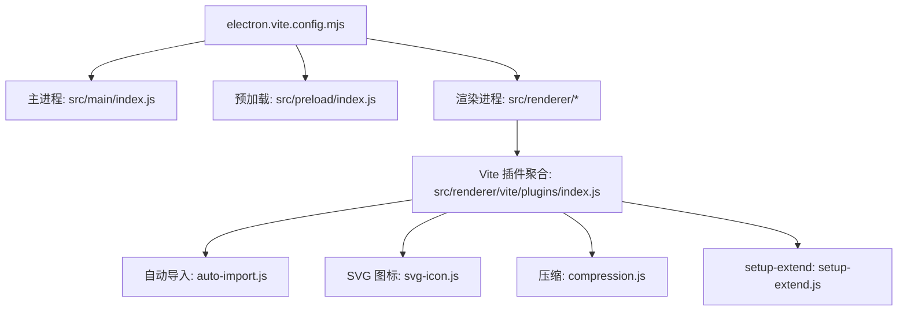
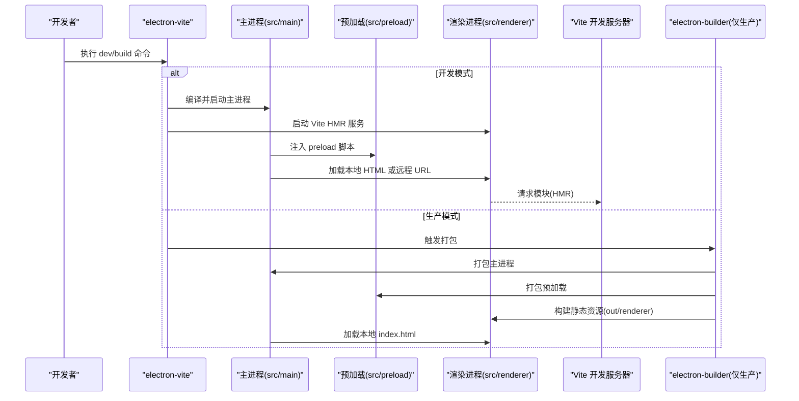
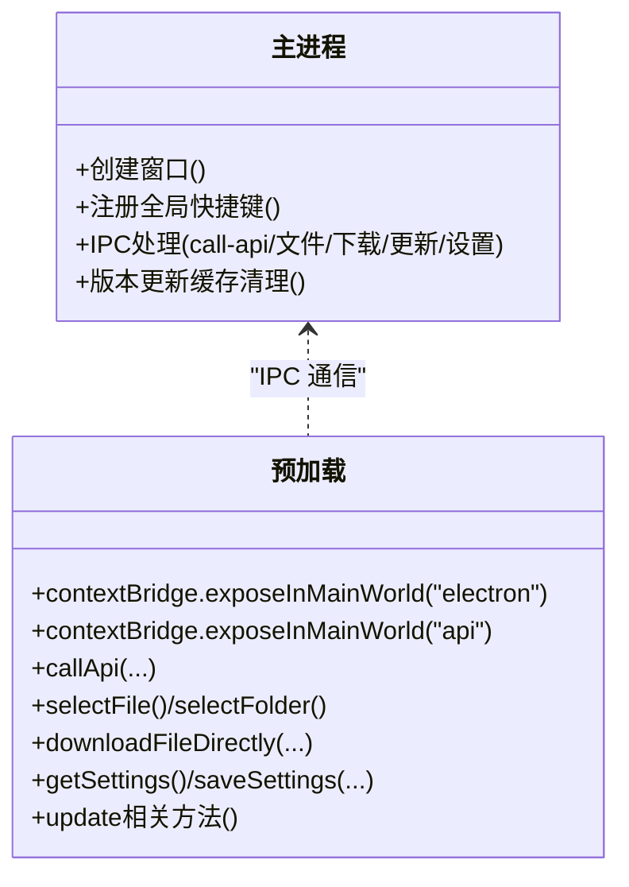
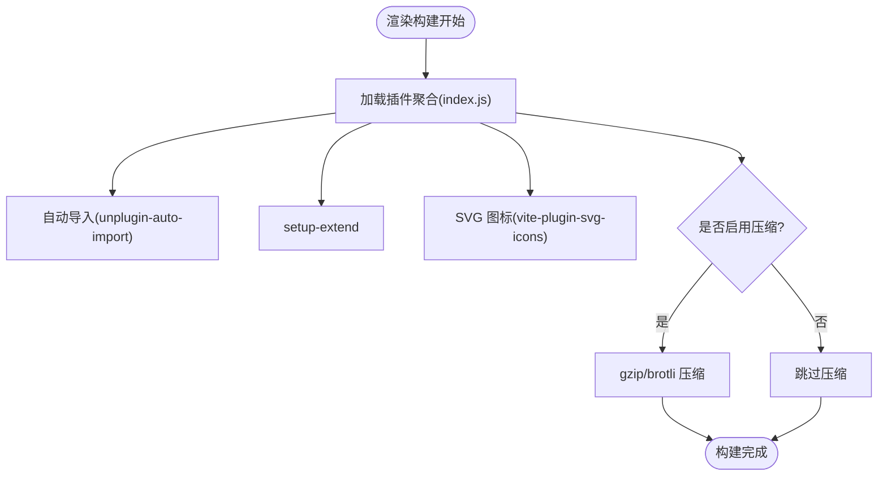
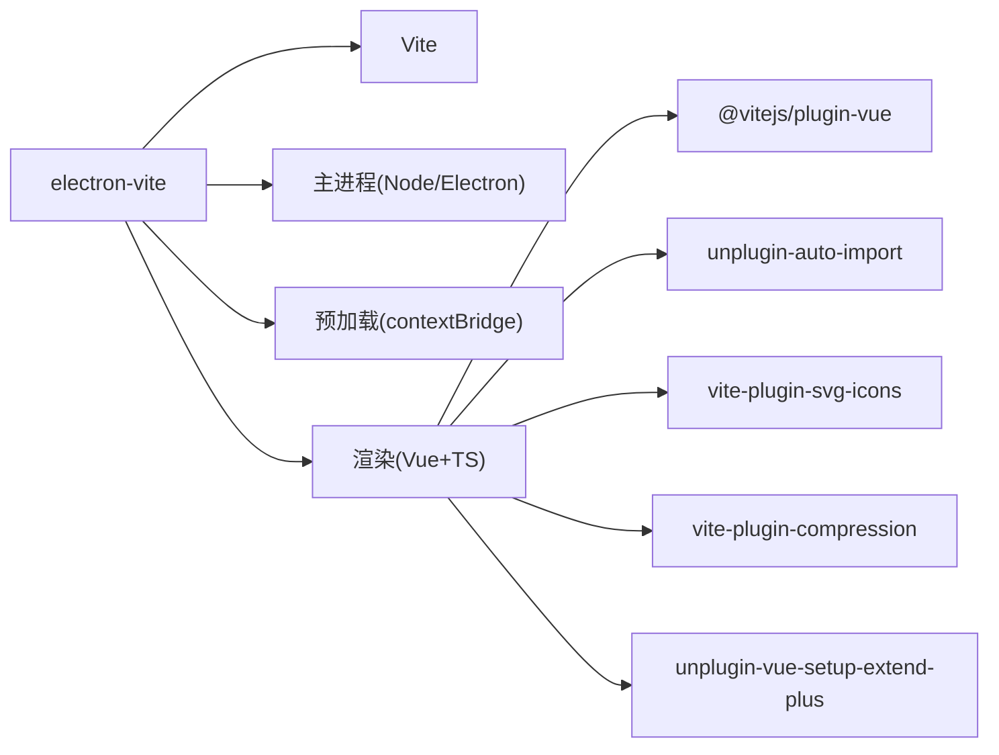

# 构建配置与开发环境

<cite>
**本文引用的文件**
- [electron.vite.config.mjs](file://PezMax-Desktop/electron.vite.config.mjs)
- [package.json](file://PezMax-Desktop/package.json)
- [src/main/index.js](file://PezMax-Desktop/src/main/index.js)
- [src/preload/index.js](file://PezMax-Desktop/src/preload/index.js)
- [src/renderer/vite/plugins/index.js](file://PezMax-Desktop/src/renderer/vite/plugins/index.js)
- [src/renderer/vite/plugins/auto-import.js](file://PezMax-Desktop/src/renderer/vite/plugins/auto-import.js)
- [src/renderer/vite/plugins/svg-icon.js](file://PezMax-Desktop/src/renderer/vite/plugins/svg-icon.js)
- [src/renderer/vite/plugins/compression.js](file://PezMax-Desktop/src/renderer/vite/plugins/compression.js)
- [src/renderer/vite/plugins/setup-extend.js](file://PezMax-Desktop/src/renderer/vite/plugins/setup-extend.js)
- [electron-builder.yml](file://PezMax-Desktop/electron-builder.yml)
</cite>

## 目录
1. [简介](#简介)
2. [项目结构](#项目结构)
3. [核心组件](#核心组件)
4. [架构总览](#架构总览)
5. [详细组件分析](#详细组件分析)
6. [依赖关系分析](#依赖关系分析)
7. [性能考量](#性能考量)
8. [故障排查指南](#故障排查指南)
9. [结论](#结论)

## 简介
本文件面向使用 Vue 3 + Vite + Electron 的桌面应用，聚焦于 electron-vite 的构建配置、主/渲染/预加载脚本编译策略、开发与生产差异化配置（热重载、调试、优化）、Vite 插件体系（自动导入、SVG 图标、代码压缩）、TypeScript 集成要点、环境变量管理与敏感信息处理，以及常见构建问题的定位与解决。文档以仓库实际实现为依据，提供可追溯的文件来源与图示说明。

## 项目结构
本项目采用 electron-vite 多进程构建：
- 主进程入口由 electron-vite 输出到 out/main/index.js，对应源码 src/main/index.js
- 预加载脚本位于 src/preload/index.js，打包后在 out/preload/index.js
- 渲染进程基于 Vite，根目录为 src/renderer，构建产物输出至 out/renderer

图表来源
- [electron.vite.config.mjs:1-121](file://PezMax-Desktop/electron.vite.config.mjs#L1-L121)
- [src/main/index.js:1-800](file://PezMax-Desktop/src/main/index.js#L1-L800)
- [src/preload/index.js:1-65](file://PezMax-Desktop/src/preload/index.js#L1-L65)
- [src/renderer/vite/plugins/index.js:1-16](file://PezMax-Desktop/src/renderer/vite/plugins/index.js#L1-L16)
- [src/renderer/vite/plugins/auto-import.js:1-13](file://PezMax-Desktop/src/renderer/vite/plugins/auto-import.js#L1-L13)
- [src/renderer/vite/plugins/svg-icon.js:1-11](file://PezMax-Desktop/src/renderer/vite/plugins/svg-icon.js#L1-L11)
- [src/renderer/vite/plugins/compression.js:1-29](file://PezMax-Desktop/src/renderer/vite/plugins/compression.js#L1-L29)
- [src/renderer/vite/plugins/setup-extend.js:1-6](file://PezMax-Desktop/src/renderer/vite/plugins/setup-extend.js#L1-L6)

章节来源
- [electron.vite.config.mjs:1-121](file://PezMax-Desktop/electron.vite.config.mjs#L1-L121)
- [package.json:1-78](file://PezMax-Desktop/package.json#L1-L78)

## 核心组件
- electron-vite 配置中心：统一声明 main、preload、renderer 三端构建选项、别名、插件、开发服务器代理与构建产物路径等
- 主进程：窗口管理、IPC 路由、系统能力调用、更新机制、下载与文件操作等
- 预加载层：通过 contextBridge 暴露安全 API 给渲染进程
- 渲染进程：Vue 3 + Vite 构建，启用自动导入、SVG 图标、按需压缩等插件
- 打包与发布：electron-builder 负责平台打包与增量更新配置

章节来源
- [electron.vite.config.mjs:1-121](file://PezMax-Desktop/electron.vite.config.mjs#L1-L121)
- [src/main/index.js:1-800](file://PezMax-Desktop/src/main/index.js#L1-L800)
- [src/preload/index.js:1-65](file://PezMax-Desktop/src/preload/index.js#L1-L65)
- [src/renderer/vite/plugins/index.js:1-16](file://PezMax-Desktop/src/renderer/vite/plugins/index.js#L1-L16)

## 架构总览
下图展示 electron-vite 在多进程下的构建与运行流程，包括开发模式与生产模式的差异点。

图表来源
- [electron.vite.config.mjs:1-121](file://PezMax-Desktop/electron.vite.config.mjs#L1-L121)
- [src/main/index.js:265-290](file://PezMax-Desktop/src/main/index.js#L265-L290)
- [package.json:8-26](file://PezMax-Desktop/package.json#L8-L26)

## 详细组件分析

### electron-vite 配置详解
- 多端配置
  - main：定义主进程别名 @main -> src/main
  - preload：定义预加载别名 @preload -> src/preload
  - renderer：定义多个别名 @、~、@renderer -> src/renderer；扩展解析顺序；设置 root 指向 src/renderer
- 开发服务器
  - 端口 host open 等基础配置
  - 代理规则：将 /dev-api 与 OpenAPI 文档路径转发到后端 baseUrl
- 构建产物
  - 输出目录 out/renderer，资源目录 assets
  - 开发时 inline sourcemap，生产关闭
  - chunk 与静态资源命名含 hash，便于缓存
- 插件体系
  - Vue 支持、自动导入、SVG 图标、压缩、setup-extend
- 环境变量
  - 通过 loadEnv(mode, cwd) 读取 .env.*，如 VITE_APP_ENV、VITE_APP_TARGET_URL、VITE_BUILD_COMPRESS 等

章节来源
- [electron.vite.config.mjs:1-121](file://PezMax-Desktop/electron.vite.config.mjs#L1-L121)

### 主进程与预加载脚本
- 主进程职责
  - 窗口创建与尺寸控制、主题背景色、最小/最大尺寸
  - IPC 路由：通用 call-api 分发器、文件选择/保存、文件夹读取、下载直写、更新检查与安装、设置读写、缓存清理等
  - 开发/生产行为差异：开发模式加载远程 URL 并开启 DevTools 快捷键；生产模式加载本地 HTML
- 预加载脚本职责
  - 通过 contextBridge 暴露安全的 API 集合，封装 ipcRenderer.invoke/send/on 调用
  - 暴露窗口控制、设置、更新、下载、文件操作等接口供渲染进程使用

图表来源
- [src/main/index.js:217-290](file://PezMax-Desktop/src/main/index.js#L217-L290)
- [src/main/index.js:292-608](file://PezMax-Desktop/src/main/index.js#L292-L608)
- [src/preload/index.js:1-65](file://PezMax-Desktop/src/preload/index.js#L1-L65)

章节来源
- [src/main/index.js:1-800](file://PezMax-Desktop/src/main/index.js#L1-L800)
- [src/preload/index.js:1-65](file://PezMax-Desktop/src/preload/index.js#L1-L65)

### 渲染进程与 Vite 插件体系
- 插件聚合入口
  - 统一导出 createVitePlugins，按条件组合各插件
- 自动导入
  - 对 vue、vue-router、pinia 进行无感导入，生成类型声明文件（在主配置中启用 dts）
- SVG 图标
  - 扫描指定目录，生成 symbolId 规范，构建时可选 SVGO 优化
- 代码压缩
  - 根据环境变量 VITE_BUILD_COMPRESS 动态启用 gzip/brotli 压缩
- setup-extend
  - 增强 Vue SFC 的 setup 语法扩展能力

图表来源
- [src/renderer/vite/plugins/index.js:1-16](file://PezMax-Desktop/src/renderer/vite/plugins/index.js#L1-L16)
- [src/renderer/vite/plugins/auto-import.js:1-13](file://PezMax-Desktop/src/renderer/vite/plugins/auto-import.js#L1-L13)
- [src/renderer/vite/plugins/svg-icon.js:1-11](file://PezMax-Desktop/src/renderer/vite/plugins/svg-icon.js#L1-L11)
- [src/renderer/vite/plugins/compression.js:1-29](file://PezMax-Desktop/src/renderer/vite/plugins/compression.js#L1-L29)
- [src/renderer/vite/plugins/setup-extend.js:1-6](file://PezMax-Desktop/src/renderer/vite/plugins/setup-extend.js#L1-L6)

章节来源
- [src/renderer/vite/plugins/index.js:1-16](file://PezMax-Desktop/src/renderer/vite/plugins/index.js#L1-L16)
- [src/renderer/vite/plugins/auto-import.js:1-13](file://PezMax-Desktop/src/renderer/vite/plugins/auto-import.js#L1-L13)
- [src/renderer/vite/plugins/svg-icon.js:1-11](file://PezMax-Desktop/src/renderer/vite/plugins/svg-icon.js#L1-L11)
- [src/renderer/vite/plugins/compression.js:1-29](file://PezMax-Desktop/src/renderer/vite/plugins/compression.js#L1-L29)
- [src/renderer/vite/plugins/setup-extend.js:1-6](file://PezMax-Desktop/src/renderer/vite/plugins/setup-extend.js#L1-L6)

### 开发环境与生产环境的差异化策略
- 开发环境
  - 主进程优先加载远程 URL（ELECTRON_RENDERER_URL），配合 Vite HMR 实现快速刷新
  - 开发服务器开启代理，将前端请求转发到后端 baseUrl，避免跨域问题
  - 自动导入与 SVG 图标在开发时可用，压缩默认禁用
- 生产环境
  - 主进程加载本地 index.html
  - 构建产物输出到 out/renderer，资源带 hash，利于缓存
  - 可通过环境变量启用 gzip/brotli 压缩
  - 使用 electron-builder 打包，支持差分更新与平台特定配置

章节来源
- [electron.vite.config.mjs:1-121](file://PezMax-Desktop/electron.vite.config.mjs#L1-L121)
- [src/main/index.js:265-290](file://PezMax-Desktop/src/main/index.js#L265-L290)
- [electron-builder.yml:1-68](file://PezMax-Desktop/electron-builder.yml#L1-L68)

### TypeScript 集成配置
- 自动导入类型声明
  - 在主配置中启用 unplugin-auto-import 的 dts 输出，生成 auto-imports.d.ts，供 TS 识别
- 路径别名
  - 主进程：@main -> src/main
  - 预加载：@preload -> src/preload
  - 渲染：@、~、@renderer -> src/renderer
- 解析扩展名
  - 渲染端支持 .mjs/.js/.ts/.jsx/.tsx/.json/.vue
- 注意
  - 若需严格 TS 校验，建议为自定义 API 补充类型定义，并在 tsconfig 中引用生成的类型文件

章节来源
- [electron.vite.config.mjs:1-121](file://PezMax-Desktop/electron.vite.config.mjs#L1-L121)
- [src/renderer/vite/plugins/auto-import.js:1-13](file://PezMax-Desktop/src/renderer/vite/plugins/auto-import.js#L1-L13)

### 环境变量管理方案
- 加载方式
  - 使用 loadEnv(mode, cwd) 读取 .env.* 文件，支持不同 mode 的环境变量覆盖
- 常用变量
  - VITE_APP_ENV：应用环境标识
  - VITE_APP_TARGET_URL：后端地址（开发默认 localhost:8080）
  - VITE_BUILD_COMPRESS：构建压缩开关，逗号分隔 gzip,brotli
  - VITE_AUTH_ENTRY_MODE：认证入口模式（client/admin），用于切换窗口尺寸与入口逻辑
- 敏感信息处理
  - 构建期注入的前端变量会进入浏览器上下文，不应包含密钥等敏感数据
  - 需要保密的配置应放在主进程侧，通过 IPC 安全访问
- 包管理器镜像
  - .npmrc 配置了国内镜像加速 Electron 及二进制下载

章节来源
- [electron.vite.config.mjs:1-121](file://PezMax-Desktop/electron.vite.config.mjs#L1-L121)
- [package.json:8-26](file://PezMax-Desktop/package.json#L8-L26)
- [.npmrc:1-3](file://PezMax-Desktop/.npmrc#L1-L3)

### 打包与发布（electron-builder）
- 产物过滤
  - 排除开发配置与源文件，仅打包必要资源
- 平台配置
  - Windows NSIS 安装器、macOS dmg、Linux AppImage/snap/deb
- 增量更新
  - 启用 differentialPackage，配合 electron-updater 实现差分更新
- 发布目标
  - 默认指向 GitHub Releases 最新版本通道 latest

章节来源
- [electron-builder.yml:1-68](file://PezMax-Desktop/electron-builder.yml#L1-L68)

## 依赖关系分析
- 构建工具链
  - electron-vite 作为编排器，内部复用 Vite 能力
  - 主/预加载使用 Node/Electron API，渲染使用浏览器 API
- 插件依赖
  - @vitejs/plugin-vue：Vue 单文件组件支持
  - unplugin-auto-import：自动导入与类型生成
  - vite-plugin-svg-icons：SVG 图标按需注入
  - vite-plugin-compression：构建期压缩
  - unplugin-vue-setup-extend-plus：setup 语法增强
- 运行时依赖
  - electron、electron-builder、electron-updater、axios、element-plus、pinia、vue-router 等

图表来源
- [electron.vite.config.mjs:1-121](file://PezMax-Desktop/electron.vite.config.mjs#L1-L121)
- [src/renderer/vite/plugins/index.js:1-16](file://PezMax-Desktop/src/renderer/vite/plugins/index.js#L1-L16)

章节来源
- [package.json:54-76](file://PezMax-Desktop/package.json#L54-L76)
- [electron.vite.config.mjs:1-121](file://PezMax-Desktop/electron.vite.config.mjs#L1-L121)

## 性能考量
- 构建产物
  - 使用带 hash 的 chunk 与静态资源文件名，提升缓存命中率
  - 开发阶段 inline sourcemap，生产关闭以减少体积
- 资源压缩
  - 通过环境变量启用 gzip/brotli，显著降低传输体积
- 网络代理
  - 开发阶段通过 Vite proxy 减少跨域开销与额外中间层
- 窗口与渲染
  - 合理设置最小/最大尺寸与主题背景色，避免启动闪烁
  - 按需加载与懒路由可减少首屏时间（结合现有路由与组件组织）

[本节为通用指导，不直接分析具体文件]

## 故障排查指南
- 开发模式无法热重载
  - 确认主进程是否在开发模式下加载远程 URL，且 Vite 开发服务器正常监听
  - 检查 ELECTRON_RENDERER_URL 环境变量是否正确
- 代理无效或跨域错误
  - 核对 VITE_APP_TARGET_URL 与代理重写规则，确保目标地址可达
- 自动导入未生效或缺少类型提示
  - 确认已启用 dts 输出并生成 auto-imports.d.ts，TS 项目需引入该文件
- SVG 图标不显示
  - 检查 iconDirs 路径是否正确，构建时是否启用 svgoOptions
- 构建体积过大
  - 启用 VITE_BUILD_COMPRESS，选择合适的压缩算法
- 打包失败或资源缺失
  - 检查 electron-builder 的 files 白名单，确保所需资源被包含
- 更新检查失败
  - 确认 publish 目标与 channel 配置正确，网络可达

章节来源
- [electron.vite.config.mjs:1-121](file://PezMax-Desktop/electron.vite.config.mjs#L1-L121)
- [src/renderer/vite/plugins/svg-icon.js:1-11](file://PezMax-Desktop/src/renderer/vite/plugins/svg-icon.js#L1-L11)
- [src/renderer/vite/plugins/compression.js:1-29](file://PezMax-Desktop/src/renderer/vite/plugins/compression.js#L1-L29)
- [electron-builder.yml:1-68](file://PezMax-Desktop/electron-builder.yml#L1-L68)

## 结论
本项目基于 electron-vite 实现了清晰的多进程构建与开发体验，通过 Vite 插件体系提升了开发效率与构建质量。环境变量与代理机制有效支撑了前后端联调，electron-builder 提供了完善的打包与增量更新能力。建议在后续迭代中持续完善类型定义、监控构建体积与网络请求，并结合用户反馈优化窗口与交互体验。