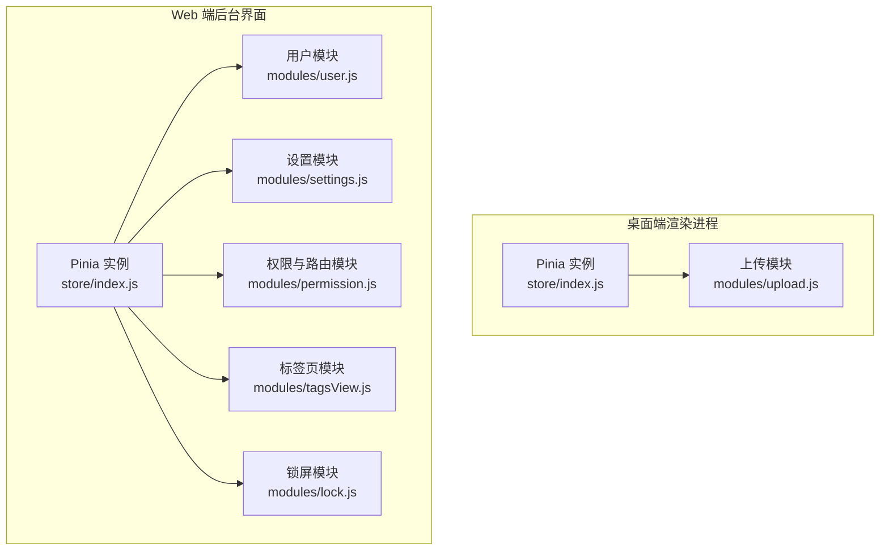
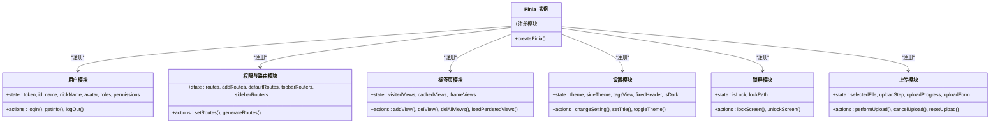
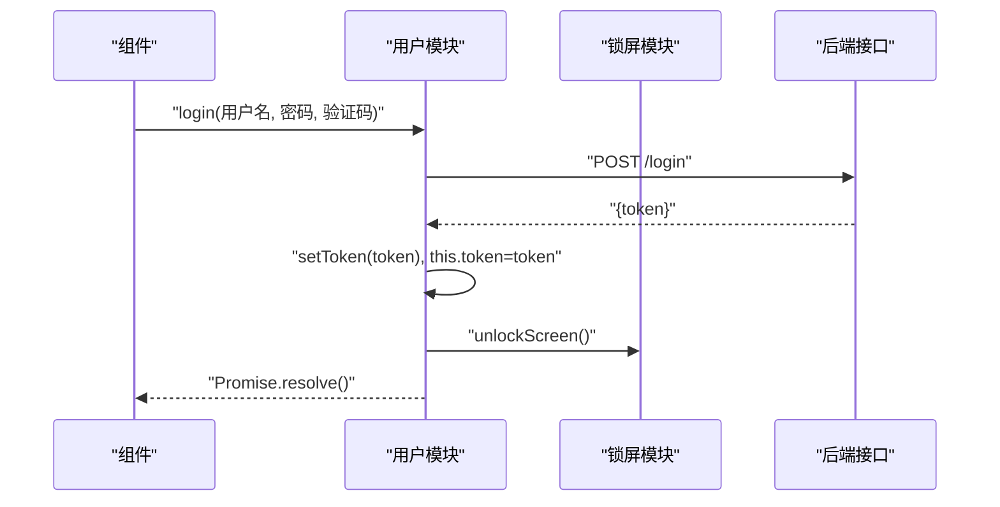
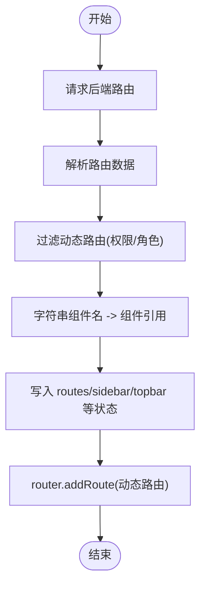
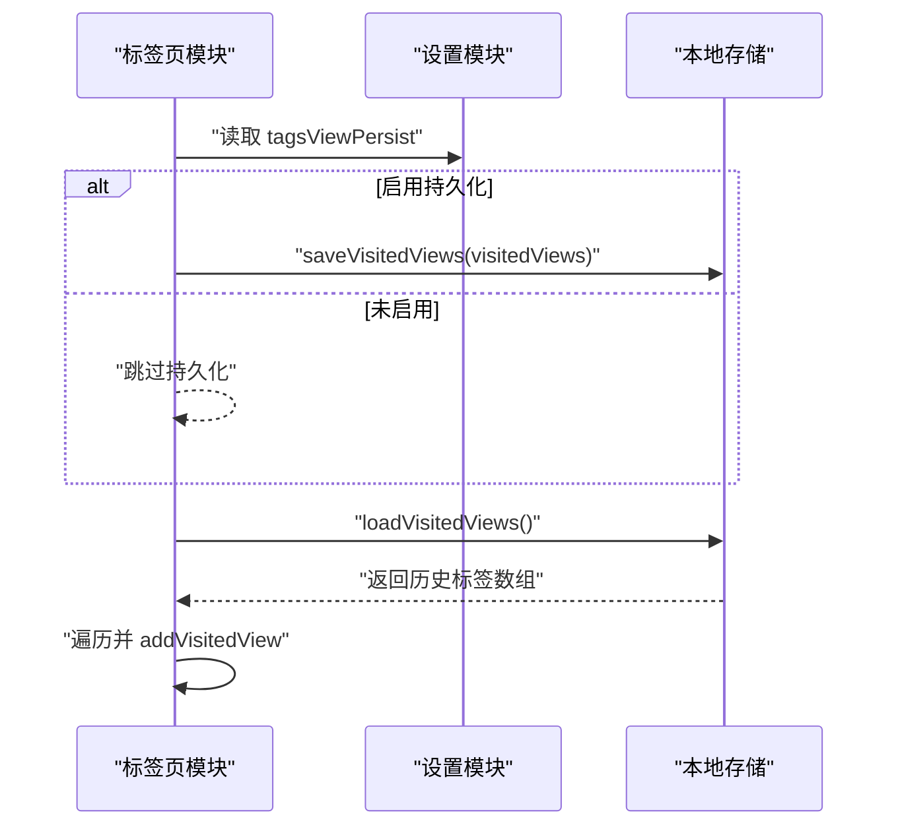
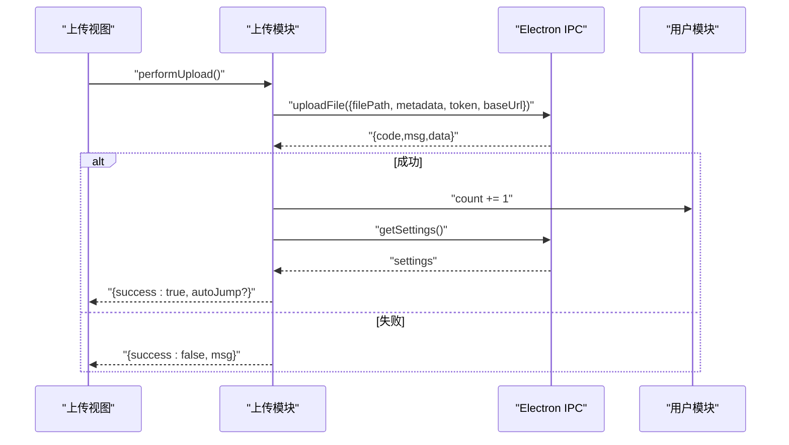
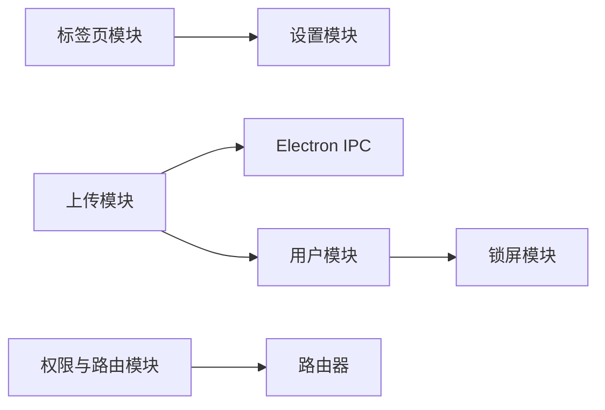

# 状态管理与数据持久化

<cite>
**本文引用的文件**   
- [PezMax-Desktop/src/renderer/store/index.js](file://PezMax-Desktop/src/renderer/store/index.js)
- [PezMax-Desktop/src/renderer/store/modules/upload.js](file://PezMax-Desktop/src/renderer/store/modules/upload.js)
- [PezMax-Backend/ruoyi-ui/src/store/index.js](file://PezMax-Backend/ruoyi-ui/src/store/index.js)
- [PezMax-Backend/ruoyi-ui/src/store/modules/user.js](file://PezMax-Backend/ruoyi-ui/src/store/modules/user.js)
- [PezMax-Backend/ruoyi-ui/src/store/modules/settings.js](file://PezMax-Backend/ruoyi-ui/src/store/modules/settings.js)
- [PezMax-Backend/ruoyi-ui/src/store/modules/permission.js](file://PezMax-Backend/ruoyi-ui/src/store/modules/permission.js)
- [PezMax-Backend/ruoyi-ui/src/store/modules/tagsView.js](file://PezMax-Backend/ruoyi-ui/src/store/modules/tagsView.js)
- [PezMax-Backend/ruoyi-ui/src/store/modules/lock.js](file://PezMax-Backend/ruoyi-ui/src/store/modules/lock.js)
</cite>

## 目录
1. [简介](#简介)
2. [项目结构](#项目结构)
3. [核心组件](#核心组件)
4. [架构总览](#架构总览)
5. [详细组件分析](#详细组件分析)
6. [依赖分析](#依赖分析)
7. [性能考虑](#性能考虑)
8. [故障排查指南](#故障排查指南)
9. [结论](#结论)
10. [附录](#附录)

## 简介
本文件围绕 Pinia 在桌面端与 Web 端的状态管理实践，系统化阐述 store、state、getters、actions 的使用方式；给出模块化状态设计（按功能域划分）的组织建议；文档化基于 localStorage 的持久化方案（含同步与版本迁移思路）；说明跨组件通信模式（共享状态、事件总线替代、响应式数据流）；介绍异步状态处理（API 请求、错误处理、缓存策略）；提供调试工具使用指南与性能优化技巧。

## 项目结构
本项目包含两个前端子工程：
- 桌面端渲染进程（Electron Renderer）：使用 Pinia 初始化并定义上传流程相关状态。
- Web 端后台界面（RuoYi UI）：使用 Pinia 组织用户、权限、标签页、设置、锁屏等模块。

图表来源
- [PezMax-Desktop/src/renderer/store/index.js:1-4](file://PezMax-Desktop/src/renderer/store/index.js#L1-L4)
- [PezMax-Desktop/src/renderer/store/modules/upload.js:1-214](file://PezMax-Desktop/src/renderer/store/modules/upload.js#L1-L214)
- [PezMax-Backend/ruoyi-ui/src/store/index.js:1-4](file://PezMax-Backend/ruoyi-ui/src/store/index.js#L1-L4)
- [PezMax-Backend/ruoyi-ui/src/store/modules/user.js:1-94](file://PezMax-Backend/ruoyi-ui/src/store/modules/user.js#L1-L94)
- [PezMax-Backend/ruoyi-ui/src/store/modules/settings.js:1-53](file://PezMax-Backend/ruoyi-ui/src/store/modules/settings.js#L1-L53)
- [PezMax-Backend/ruoyi-ui/src/store/modules/permission.js:1-132](file://PezMax-Backend/ruoyi-ui/src/store/modules/permission.js#L1-L132)
- [PezMax-Backend/ruoyi-ui/src/store/modules/tagsView.js:1-227](file://PezMax-Backend/ruoyi-ui/src/store/modules/tagsView.js#L1-L227)
- [PezMax-Backend/ruoyi-ui/src/store/modules/lock.js:1-28](file://PezMax-Backend/ruoyi-ui/src/store/modules/lock.js#L1-L28)

章节来源
- [PezMax-Desktop/src/renderer/store/index.js:1-4](file://PezMax-Desktop/src/renderer/store/index.js#L1-L4)
- [PezMax-Backend/ruoyi-ui/src/store/index.js:1-4](file://PezMax-Backend/ruoyi-ui/src/store/index.js#L1-L4)

## 核心组件
- Pinia 实例初始化
  - 桌面端与 Web 端均通过 createPinia 创建全局 store 实例并导出，供应用注入与使用。
- 模块化 Store 组织
  - 按业务域拆分：用户（user）、权限与路由（permission）、标签页（tagsView）、设置（settings）、锁屏（lock）、上传（upload）。
- 典型能力
  - state：声明式数据模型。
  - actions：封装业务逻辑与副作用（如 API 调用、本地存储读写）。
  - getters：计算派生状态（可在各模块中按需补充）。
  - 组合式 API：在组件中以 useXxxStore() 获取实例并访问 state/actions。

章节来源
- [PezMax-Desktop/src/renderer/store/index.js:1-4](file://PezMax-Desktop/src/renderer/store/index.js#L1-L4)
- [PezMax-Backend/ruoyi-ui/src/store/index.js:1-4](file://PezMax-Backend/ruoyi-ui/src/store/index.js#L1-L4)
- [PezMax-Backend/ruoyi-ui/src/store/modules/user.js:1-94](file://PezMax-Backend/ruoyi-ui/src/store/modules/user.js#L1-L94)
- [PezMax-Backend/ruoyi-ui/src/store/modules/settings.js:1-53](file://PezMax-Backend/ruoyi-ui/src/store/modules/settings.js#L1-L53)
- [PezMax-Backend/ruoyi-ui/src/store/modules/permission.js:1-132](file://PezMax-Backend/ruoyi-ui/src/store/modules/permission.js#L1-L132)
- [PezMax-Backend/ruoyi-ui/src/store/modules/tagsView.js:1-227](file://PezMax-Backend/ruoyi-ui/src/store/modules/tagsView.js#L1-L227)
- [PezMax-Backend/ruoyi-ui/src/store/modules/lock.js:1-28](file://PezMax-Backend/ruoyi-ui/src/store/modules/lock.js#L1-L28)
- [PezMax-Desktop/src/renderer/store/modules/upload.js:1-214](file://PezMax-Desktop/src/renderer/store/modules/upload.js#L1-L214)

## 架构总览
下图展示 Pinia 在各模块中的职责边界与交互关系。

图表来源
- [PezMax-Backend/ruoyi-ui/src/store/modules/user.js:1-94](file://PezMax-Backend/ruoyi-ui/src/store/modules/user.js#L1-L94)
- [PezMax-Backend/ruoyi-ui/src/store/modules/permission.js:1-132](file://PezMax-Backend/ruoyi-ui/src/store/modules/permission.js#L1-L132)
- [PezMax-Backend/ruoyi-ui/src/store/modules/tagsView.js:1-227](file://PezMax-Backend/ruoyi-ui/src/store/modules/tagsView.js#L1-L227)
- [PezMax-Backend/ruoyi-ui/src/store/modules/settings.js:1-53](file://PezMax-Backend/ruoyi-ui/src/store/modules/settings.js#L1-L53)
- [PezMax-Backend/ruoyi-ui/src/store/modules/lock.js:1-28](file://PezMax-Backend/ruoyi-ui/src/store/modules/lock.js#L1-L28)
- [PezMax-Desktop/src/renderer/store/modules/upload.js:1-214](file://PezMax-Desktop/src/renderer/store/modules/upload.js#L1-L214)

## 详细组件分析

### 用户模块（user）
- 职责
  - 维护登录态与用户信息，封装登录、拉取用户信息、登出等动作。
- 关键状态
  - token、id、name、nickName、avatar、roles、permissions。
- 关键动作
  - login：提交凭证，保存 token，触发解锁屏幕。
  - getInfo：拉取用户详情，填充头像、角色与权限，必要时引导修改密码。
  - logOut：清空本地 token 与内存状态。
- 与其他模块协作
  - 登录成功后调用锁屏模块解锁。
  - 权限与路由模块依赖 roles/permissions 生成动态路由。

图表来源
- [PezMax-Backend/ruoyi-ui/src/store/modules/user.js:22-38](file://PezMax-Backend/ruoyi-ui/src/store/modules/user.js#L22-L38)
- [PezMax-Backend/ruoyi-ui/src/store/modules/lock.js:18-23](file://PezMax-Backend/ruoyi-ui/src/store/modules/lock.js#L18-L23)

章节来源
- [PezMax-Backend/ruoyi-ui/src/store/modules/user.js:1-94](file://PezMax-Backend/ruoyi-ui/src/store/modules/user.js#L1-L94)
- [PezMax-Backend/ruoyi-ui/src/store/modules/lock.js:1-28](file://PezMax-Backend/ruoyi-ui/src/store/modules/lock.js#L1-L28)

### 权限与路由模块（permission）
- 职责
  - 根据后端返回的路由表构建可访问路由树，并注入到路由器。
- 关键状态
  - routes、addRoutes、defaultRoutes、topbarRouters、sidebarRouters。
- 关键动作
  - generateRoutes：请求菜单/路由，过滤并转换为组件引用，设置侧边栏与顶部导航路由。
- 辅助函数
  - filterAsyncRouter：将字符串 component 映射为实际组件或特殊容器组件。
  - filterDynamicRoutes：按权限/角色过滤动态路由。

图表来源
- [PezMax-Backend/ruoyi-ui/src/store/modules/permission.js:39-58](file://PezMax-Backend/ruoyi-ui/src/store/modules/permission.js#L39-L58)
- [PezMax-Backend/ruoyi-ui/src/store/modules/permission.js:63-88](file://PezMax-Backend/ruoyi-ui/src/store/modules/permission.js#L63-L88)
- [PezMax-Backend/ruoyi-ui/src/store/modules/permission.js:104-118](file://PezMax-Backend/ruoyi-ui/src/store/modules/permission.js#L104-L118)

章节来源
- [PezMax-Backend/ruoyi-ui/src/store/modules/permission.js:1-132](file://PezMax-Backend/ruoyi-ui/src/store/modules/permission.js#L1-L132)

### 标签页模块（tagsView）
- 职责
  - 管理已访问页面、缓存视图与 iframe 视图，支持持久化与批量删除。
- 关键状态
  - visitedViews、cachedViews、iframeViews。
- 关键动作
  - addView/delView/delOthersViews/delAllViews：增删改标签与缓存。
  - loadPersistedViews：从持久化存储恢复标签。
- 持久化
  - 当启用“持久化标签”时，将 visitedViews 序列化到本地存储，并在启动时恢复。

图表来源
- [PezMax-Backend/ruoyi-ui/src/store/modules/tagsView.js:6-18](file://PezMax-Backend/ruoyi-ui/src/store/modules/tagsView.js#L6-L18)
- [PezMax-Backend/ruoyi-ui/src/store/modules/tagsView.js:216-222](file://PezMax-Backend/ruoyi-ui/src/store/modules/tagsView.js#L216-L222)
- [PezMax-Backend/ruoyi-ui/src/store/modules/settings.js:31-48](file://PezMax-Backend/ruoyi-ui/src/store/modules/settings.js#L31-L48)

章节来源
- [PezMax-Backend/ruoyi-ui/src/store/modules/tagsView.js:1-227](file://PezMax-Backend/ruoyi-ui/src/store/modules/tagsView.js#L1-L227)
- [PezMax-Backend/ruoyi-ui/src/store/modules/settings.js:1-53](file://PezMax-Backend/ruoyi-ui/src/store/modules/settings.js#L1-L53)

### 设置模块（settings）
- 职责
  - 管理主题、布局、标题、暗黑模式等全局设置，并提供切换方法。
- 关键状态
  - theme、sideTheme、navType、tagsView、fixedHeader、isDark 等。
- 关键动作
  - changeSetting：按 key/value 更新配置。
  - setTitle：同步网页标题。
  - toggleTheme：切换暗黑模式。

章节来源
- [PezMax-Backend/ruoyi-ui/src/store/modules/settings.js:1-53](file://PezMax-Backend/ruoyi-ui/src/store/modules/settings.js#L1-L53)

### 锁屏模块（lock）
- 职责
  - 记录锁屏状态与锁定前的路径，支持锁定与解锁。
- 关键状态
  - isLock、lockPath。
- 关键动作
  - lockScreen：记录当前路径并标记锁屏。
  - unlockScreen：清除锁屏状态并重置路径。

章节来源
- [PezMax-Backend/ruoyi-ui/src/store/modules/lock.js:1-28](file://PezMax-Backend/ruoyi-ui/src/store/modules/lock.js#L1-L28)

### 上传模块（upload，桌面端）
- 职责
  - 管理文件/文件夹选择、表单填写、上传进度、取消与错误提示。
- 关键状态
  - selectedFile、uploadStep、uploadProgress、uploadForm、isUploading、isCancelled、uploadErrorMsg。
- 关键动作
  - setSelectedFile：选择文件并自动填充文件名。
  - resetUpload：重置所有上传相关状态，并从设置中回填默认值。
  - cancelUpload：触发 Electron IPC 取消上传。
  - performUpload：单文件/批量上传，更新用户计数与结果反馈。
- 与外部系统交互
  - 通过 window.electronAPI 与主进程通信进行文件上传与设置读取。
  - 成功上传后联动用户模块增加计数。

图表来源
- [PezMax-Desktop/src/renderer/store/modules/upload.js:70-196](file://PezMax-Desktop/src/renderer/store/modules/upload.js#L70-L196)
- [PezMax-Desktop/src/renderer/store/modules/upload.js:96-98](file://PezMax-Desktop/src/renderer/store/modules/upload.js#L96-L98)

章节来源
- [PezMax-Desktop/src/renderer/store/modules/upload.js:1-214](file://PezMax-Desktop/src/renderer/store/modules/upload.js#L1-L214)

## 依赖分析
- 模块内聚与耦合
  - 用户模块与锁屏模块存在弱耦合（登录成功后解锁）。
  - 标签页模块依赖设置模块以判断是否持久化。
  - 权限模块依赖路由与鉴权插件，负责动态路由装配。
  - 上传模块依赖 Electron IPC 与用户模块（计数）。
- 可能的循环依赖
  - 当前未见直接循环导入；若后续引入跨模块强依赖，建议使用事件或集中协调器解耦。
- 外部依赖
  - 浏览器本地存储（localStorage）用于持久化。
  - Electron IPC（桌面端）用于文件操作与设置读取。

图表来源
- [PezMax-Backend/ruoyi-ui/src/store/modules/user.js:22-38](file://PezMax-Backend/ruoyi-ui/src/store/modules/user.js#L22-L38)
- [PezMax-Backend/ruoyi-ui/src/store/modules/tagsView.js:6-18](file://PezMax-Backend/ruoyi-ui/src/store/modules/tagsView.js#L6-L18)
- [PezMax-Backend/ruoyi-ui/src/store/modules/permission.js:39-58](file://PezMax-Backend/ruoyi-ui/src/store/modules/permission.js#L39-L58)
- [PezMax-Desktop/src/renderer/store/modules/upload.js:70-196](file://PezMax-Desktop/src/renderer/store/modules/upload.js#L70-L196)

章节来源
- [PezMax-Backend/ruoyi-ui/src/store/modules/user.js:1-94](file://PezMax-Backend/ruoyi-ui/src/store/modules/user.js#L1-L94)
- [PezMax-Backend/ruoyi-ui/src/store/modules/tagsView.js:1-227](file://PezMax-Backend/ruoyi-ui/src/store/modules/tagsView.js#L1-L227)
- [PezMax-Backend/ruoyi-ui/src/store/modules/permission.js:1-132](file://PezMax-Backend/ruoyi-ui/src/store/modules/permission.js#L1-L132)
- [PezMax-Desktop/src/renderer/store/modules/upload.js:1-214](file://PezMax-Desktop/src/renderer/store/modules/upload.js#L1-L214)

## 性能考虑
- 状态分割与懒加载
  - 将大对象拆分为独立模块（如标签页、设置），避免一次性加载全部状态。
  - 对大型列表采用分页与虚拟滚动，减少渲染压力。
- 计算属性（getters）
  - 将复杂派生逻辑放入 getters，利用缓存机制减少重复计算。
- 持久化节流
  - 对频繁变更的状态（如搜索词、滚动位置）进行节流后再落盘。
- 内存管理
  - 及时清理不再使用的订阅与定时器。
  - 在路由离开或组件卸载时释放大对象引用。
- 网络层优化
  - 结合请求去重与缓存策略，避免重复请求。
  - 对热点数据设置合理过期时间。

[本节为通用指导，不直接分析具体文件]

## 故障排查指南
- 常见问题定位
  - 登录失败：检查用户模块的登录动作与后端返回码，确认 token 是否正确写入。
  - 路由空白：检查权限模块的动态路由生成与组件映射逻辑。
  - 标签页丢失：确认设置模块的持久化开关与标签页模块的持久化读写。
  - 上传中断：检查上传模块的取消标志与 Electron IPC 的取消接口。
- 日志与断点
  - 在关键 action 入口与异常分支添加日志输出。
  - 使用浏览器扩展或桌面端 DevTools 查看 Pinia 状态快照。
- 回滚与恢复
  - 对重要状态变更前备份快照，便于快速回滚。
  - 对持久化数据提供版本迁移脚本，兼容旧格式。

章节来源
- [PezMax-Backend/ruoyi-ui/src/store/modules/user.js:22-38](file://PezMax-Backend/ruoyi-ui/src/store/modules/user.js#L22-L38)
- [PezMax-Backend/ruoyi-ui/src/store/modules/permission.js:39-58](file://PezMax-Backend/ruoyi-ui/src/store/modules/permission.js#L39-L58)
- [PezMax-Backend/ruoyi-ui/src/store/modules/tagsView.js:6-18](file://PezMax-Backend/ruoyi-ui/src/store/modules/tagsView.js#L6-L18)
- [PezMax-Desktop/src/renderer/store/modules/upload.js:59-69](file://PezMax-Desktop/src/renderer/store/modules/upload.js#L59-L69)

## 结论
通过 Pinia 的模块化设计与清晰的职责划分，项目在用户认证、权限控制、标签页管理、全局设置以及桌面端上传流程等方面实现了高内聚、低耦合的状态管理。结合 localStorage 的持久化与合理的异步处理策略，既保证了用户体验，也提升了可维护性与可扩展性。后续可在 getters 计算、请求缓存与状态快照方面进一步优化性能与可观测性。

## 附录
- 术语
  - Store：Pinia 中的状态容器，包含 state、getters、actions。
  - Getter：派生状态，具备缓存特性。
  - Action：封装业务逻辑与副作用的方法。
- 最佳实践清单
  - 单一职责：每个模块只关注一个领域。
  - 明确边界：避免跨模块直接修改对方 state，优先通过 action 暴露变更。
  - 可测试性：action 尽量纯函数化，便于单元测试。
  - 可观测性：关键路径埋点与日志，配合调试工具快速定位问题。