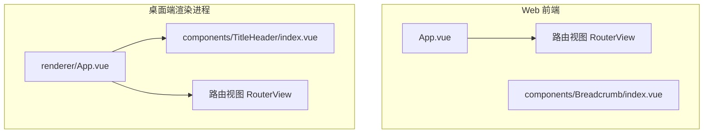
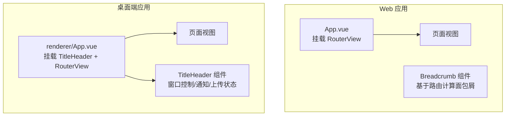
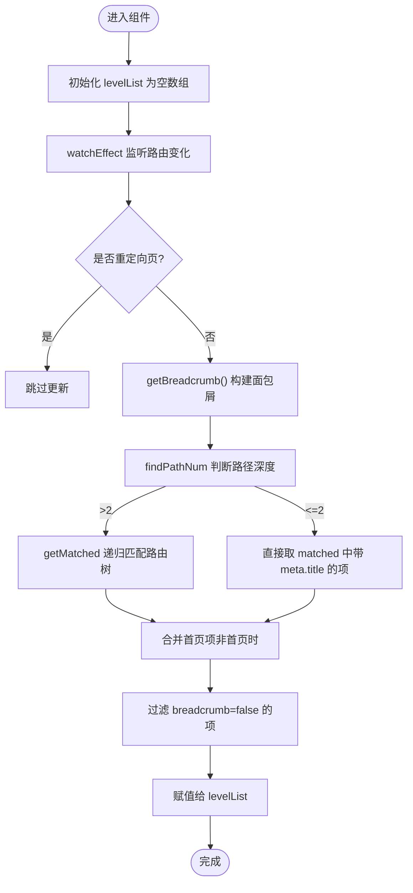
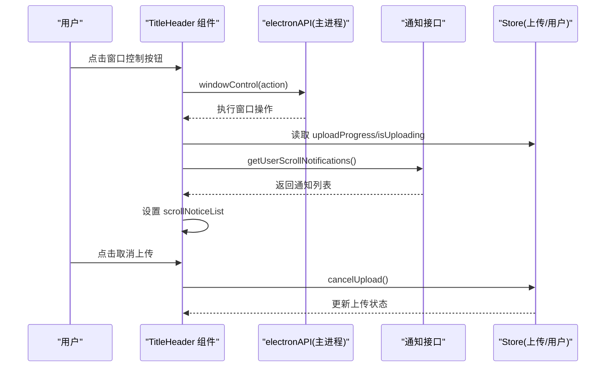
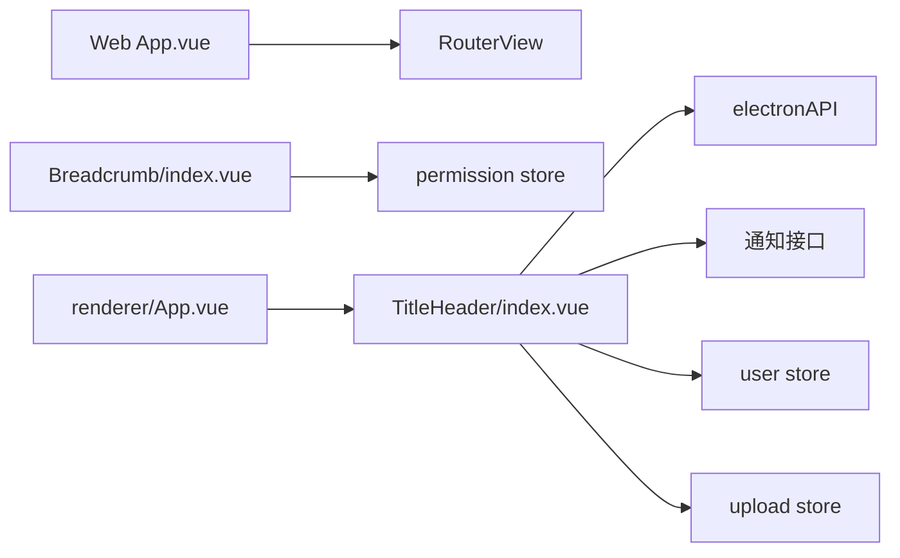

# 组件开发与规范

<cite>
**本文引用的文件**   
- [App.vue](file://PezMax-Backend/ruoyi-ui/src/App.vue)
- [Breadcrumb/index.vue](file://PezMax-Backend/ruoyi-ui/src/components/Breadcrumb/index.vue)
- [TitleHeader/index.vue](file://PezMax-Desktop/src/renderer/components/TitleHeader/index.vue)
- [renderer/App.vue](file://PezMax-Desktop/src/renderer/App.vue)
</cite>

## 目录
1. [简介](#简介)
2. [项目结构](#项目结构)
3. [核心组件](#核心组件)
4. [架构总览](#架构总览)
5. [详细组件分析](#详细组件分析)
6. [依赖关系分析](#依赖关系分析)
7. [性能考量](#性能考量)
8. [故障排查指南](#故障排查指南)
9. [结论](#结论)
10. [附录](#附录)

## 简介
本指南面向使用 Vue 3 的开发者，结合仓库中的实际代码，系统化阐述单文件组件（SFC）的结构规范、组合式 API 最佳实践、自定义组件开发流程、样式组织策略、测试方法与复用封装原则。文档以“由浅入深”的方式呈现，既适合初学者快速上手，也便于有经验的工程师对照落地。

## 项目结构
本项目包含两个前端工程：
- 后端配套 Web 前端（RuoYi-Vue3）：位于 PezMax-Backend/ruoyi-ui，采用 Vue 3 + Element Plus + Vite。
- 桌面端渲染进程（Electron Renderer）：位于 PezMax-Desktop/src/renderer，采用 Vue 3 + Element Plus + Vite，并集成 Electron 能力。

图表来源
- [App.vue:1-16](file://PezMax-Backend/ruoyi-ui/src/App.vue#L1-L16)
- [Breadcrumb/index.vue:1-97](file://PezMax-Backend/ruoyi-ui/src/components/Breadcrumb/index.vue#L1-L97)
- [renderer/App.vue:1-68](file://PezMax-Desktop/src/renderer/App.vue#L1-L68)
- [TitleHeader/index.vue:1-749](file://PezMax-Desktop/src/renderer/components/TitleHeader/index.vue#L1-L749)

章节来源
- [App.vue:1-16](file://PezMax-Backend/ruoyi-ui/src/App.vue#L1-L16)
- [Breadcrumb/index.vue:1-97](file://PezMax-Backend/ruoyi-ui/src/components/Breadcrumb/index.vue#L1-L97)
- [renderer/App.vue:1-68](file://PezMax-Desktop/src/renderer/App.vue#L1-L68)
- [TitleHeader/index.vue:1-749](file://PezMax-Desktop/src/renderer/components/TitleHeader/index.vue#L1-L749)

## 核心组件
- App 根组件：负责挂载路由视图与全局初始化逻辑（如主题）。
- 面包屑导航：根据当前路由动态生成层级列表，支持点击跳转与首页前缀处理。
- 标题栏（桌面端）：跨平台窗口控制、品牌展示、通知与上传状态聚合、用户入口等。

章节来源
- [App.vue:1-16](file://PezMax-Backend/ruoyi-ui/src/App.vue#L1-L16)
- [Breadcrumb/index.vue:1-97](file://PezMax-Backend/ruoyi-ui/src/components/Breadcrumb/index.vue#L1-L97)
- [TitleHeader/index.vue:1-749](file://PezMax-Desktop/src/renderer/components/TitleHeader/index.vue#L1-L749)

## 架构总览
下图展示了 Web 与桌面端在渲染层的关键交互路径：根组件挂载路由视图；桌面端额外承载全局标题栏与系统级能力（窗口控制、通知轮询等）。

图表来源
- [App.vue:1-16](file://PezMax-Backend/ruoyi-ui/src/App.vue#L1-L16)
- [Breadcrumb/index.vue:1-97](file://PezMax-Backend/ruoyi-ui/src/components/Breadcrumb/index.vue#L1-L97)
- [renderer/App.vue:1-68](file://PezMax-Desktop/src/renderer/App.vue#L1-L68)
- [TitleHeader/index.vue:1-749](file://PezMax-Desktop/src/renderer/components/TitleHeader/index.vue#L1-L749)

## 详细组件分析

### 组件一：面包屑导航（Breadcrumb）
职责
- 根据当前路由匹配生成面包屑层级列表。
- 对多级菜单进行递归匹配，自动补全首页项。
- 提供点击跳转能力，屏蔽重定向页更新。

关键实现要点
- 使用响应式变量保存面包屑数据，监听路由变化触发重建。
- 通过工具函数统计路径深度、递归匹配路由树。
- 过滤无标题或显式关闭的面包屑项。

图表来源
- [Breadcrumb/index.vue:1-97](file://PezMax-Backend/ruoyi-ui/src/components/Breadcrumb/index.vue#L1-L97)

章节来源
- [Breadcrumb/index.vue:1-97](file://PezMax-Backend/ruoyi-ui/src/components/Breadcrumb/index.vue#L1-L97)

### 组件二：标题栏（TitleHeader，桌面端）
职责
- 跨平台窗口控制（最小化、最大化/还原、关闭）。
- 品牌展示与毛玻璃视觉风格。
- 滚动通知拉取与定时刷新。
- 全局上传进度指示与取消操作。
- 用户头像与个人中心入口。

关键实现要点
- 使用 computed 派生 isMac、isAuthPage、hasToken、upload 状态等。
- onMounted 注册主进程事件监听，setupScrollNotifications 启动轮询。
- watch 监听路由与 token 变化，按需启停轮询与主题切换。
- 通过 electronAPI 调用窗口控制，兼容浏览器环境降级。

图表来源
- [TitleHeader/index.vue:1-749](file://PezMax-Desktop/src/renderer/components/TitleHeader/index.vue#L1-L749)

章节来源
- [TitleHeader/index.vue:1-749](file://PezMax-Desktop/src/renderer/components/TitleHeader/index.vue#L1-L749)

### 组件三：根组件（Web 与桌面端）
职责
- 挂载 RouterView 作为页面容器。
- 桌面端根组件还负责 IDE 外观适配与登录态下的主题切换。

差异点
- Web 根组件在 mounted 后初始化主题样式。
- 桌面端根组件在 mounted 时应用 IDE 外观，并在路由切换时恢复/切换深色模式。

章节来源
- [App.vue:1-16](file://PezMax-Backend/ruoyi-ui/src/App.vue#L1-L16)
- [renderer/App.vue:1-68](file://PezMax-Desktop/src/renderer/App.vue#L1-L68)

## 依赖关系分析
- 组件内依赖
  - 面包屑组件依赖路由与权限 store，用于计算可展示的路径层级。
  - 标题栏组件依赖 electronAPI、通知接口、用户与上传状态 store。
- 组件间依赖
  - 根组件仅负责挂载 RouterView 与全局初始化，业务细节下沉至子组件。
- 外部依赖
  - UI 库（Element Plus）、图标库、路由与状态管理。

图表来源
- [App.vue:1-16](file://PezMax-Backend/ruoyi-ui/src/App.vue#L1-L16)
- [Breadcrumb/index.vue:1-97](file://PezMax-Backend/ruoyi-ui/src/components/Breadcrumb/index.vue#L1-L97)
- [renderer/App.vue:1-68](file://PezMax-Desktop/src/renderer/App.vue#L1-L68)
- [TitleHeader/index.vue:1-749](file://PezMax-Desktop/src/renderer/components/TitleHeader/index.vue#L1-L749)

章节来源
- [App.vue:1-16](file://PezMax-Backend/ruoyi-ui/src/App.vue#L1-L16)
- [Breadcrumb/index.vue:1-97](file://PezMax-Backend/ruoyi-ui/src/components/Breadcrumb/index.vue#L1-L97)
- [renderer/App.vue:1-68](file://PezMax-Desktop/src/renderer/App.vue#L1-L68)
- [TitleHeader/index.vue:1-749](file://PezMax-Desktop/src/renderer/components/TitleHeader/index.vue#L1-L749)

## 性能考量
- 避免不必要的重渲染
  - 将频繁变化的状态尽量收敛到细粒度 store 或 computed，减少父组件大面积更新。
  - 长列表或复杂树形结构应配合虚拟滚动或分页加载。
- 网络请求优化
  - 对轮询类任务（如通知）设置合理间隔，并在离开相关页面或失去焦点时暂停。
  - 使用防抖/节流处理高频输入与窗口尺寸变化。
- 样式与渲染
  - 合理使用 scoped 与 CSS Modules，避免全局污染。
  - 减少过度 backdrop-filter 与复杂动画，必要时在低性能设备上降级。

[本节为通用建议，不直接分析具体文件]

## 故障排查指南
- 面包屑不更新
  - 检查是否在重定向路径下被跳过更新。
  - 确认路由元信息 meta.title 是否存在且 breadcrumb 未设为 false。
- 通知未显示或重复轮询
  - 确认已登录且有 token，且在非认证页。
  - 检查定时器清理逻辑，确保组件卸载或路由切换时清除。
- 窗口控制无效
  - 确认 electronAPI 存在且方法名正确，浏览器环境下应有降级提示。
- 上传取消失败
  - 检查 store 的 cancelUpload 实现与错误分支，确认弹窗确认逻辑未被中断。

章节来源
- [Breadcrumb/index.vue:1-97](file://PezMax-Backend/ruoyi-ui/src/components/Breadcrumb/index.vue#L1-L97)
- [TitleHeader/index.vue:1-749](file://PezMax-Desktop/src/renderer/components/TitleHeader/index.vue#L1-L749)

## 结论
通过对仓库中典型组件的分析，可以总结出一套可复用的 Vue 3 组件开发范式：以 SFC 为单位组织模板、脚本与样式；在 script setup 中使用组合式 API 明确数据流与副作用；通过 store 与 API 模块解耦业务；用 scoped/SCSS/CSS Variables 统一样式体系；并以清晰的依赖边界与生命周期管理保障可维护性与性能。

[本节为总结性内容，不直接分析具体文件]

## 附录

### SFC 结构规范（template / script setup / style）
- template
  - 语义化标签优先，保持结构与样式分离。
  - 条件渲染与列表渲染注意 key 的唯一性与稳定性。
- script setup
  - 使用 ref/reactive 管理本地状态，computed 派生只读值，watch/watchEffect 处理副作用。
  - 将副作用集中在 onMounted/onUnmounted，避免在渲染阶段执行。
  - 对外暴露 props/emits/slots，保持组件契约清晰。
- style
  - 使用 scoped 限制作用域；复杂样式使用 SCSS 变量与 mixin；主题色通过 CSS Variables 注入。

[本节为通用规范，不直接分析具体文件]

### 组合式 API 最佳实践
- ref vs reactive
  - 基本类型与简单对象用 ref；嵌套较深的对象可用 reactive，但注意替换整体引用时的响应式丢失问题。
- computed
  - 将复杂表达式抽取为 computed，提升可读性与缓存收益。
- watch 与 watchEffect
  - 需要精确源与回调时使用 watch；仅需响应依赖变化执行副作用时使用 watchEffect。
- 生命周期
  - 在 onMounted 中订阅外部资源（事件、定时器、IPC），在 onUnmounted 中释放。

[本节为通用实践，不直接分析具体文件]

### 自定义组件开发流程
- Props 定义
  - 明确必填/可选、默认值与校验规则，提供 TypeScript 类型或 JSDoc 注释。
- 事件发射
  - 使用 emits 声明事件，命名遵循动词短语，携带必要载荷。
- 插槽使用
  - 具名插槽与作用域插槽结合，提供默认插槽与扩展点。
- 生命周期管理
  - 在合适的时机发起请求、绑定/解绑事件，避免内存泄漏。

[本节为通用流程，不直接分析具体文件]

### 样式组织策略
- CSS Modules
  - 适用于大型项目中需要严格隔离样式的场景，避免类名冲突。
- SCSS 变量管理
  - 集中管理颜色、字号、间距等设计令牌，配合主题切换。
- 主题定制
  - 通过 CSS Variables 暴露主题变量，在根节点或组件根上覆盖变量实现换肤。

[本节为通用策略，不直接分析具体文件]

### 组件测试方法
- 单元测试
  - 使用 Vue Test Utils 模拟 props、emits、路由与 store，断言渲染结果与行为。
- 视觉回归测试
  - 使用 Storybook 或 Playwright 截图对比，确保 UI 变更可控。
- 端到端测试
  - 针对关键用户路径编写 E2E 用例，验证跨组件协作。

[本节为通用方法，不直接分析具体文件]

### 组件复用与封装原则
- 高内聚低耦合
  - 组件内部自洽，对外仅暴露必要接口；通过 props/emits/slots 通信。
- 单一职责
  - 每个组件聚焦一个功能域，复杂页面拆分为小组件组合。
- 可配置与可扩展
  - 通过 props 与插槽提供灵活定制能力，避免硬编码。
- 可测试性
  - 纯函数与可预测的状态流转，便于单元与回归测试。

[本节为通用原则，不直接分析具体文件]