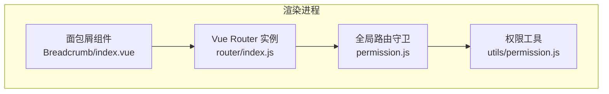
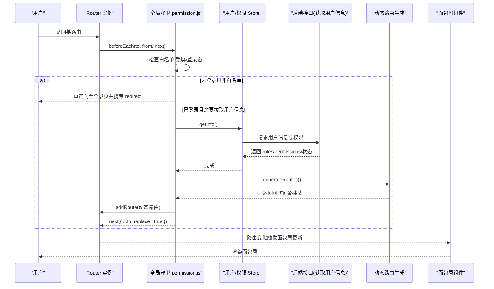
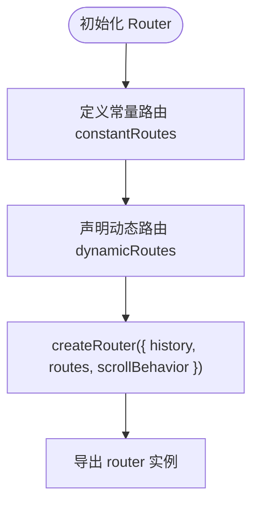
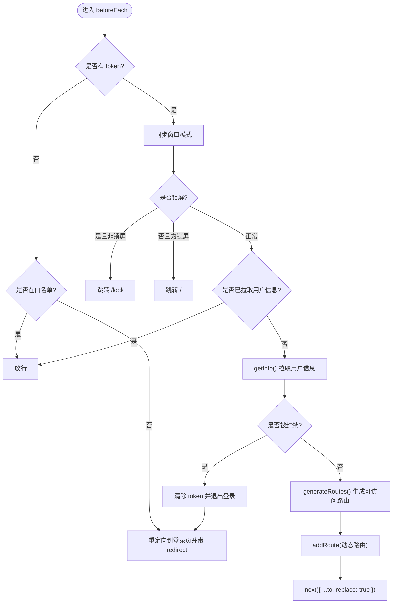
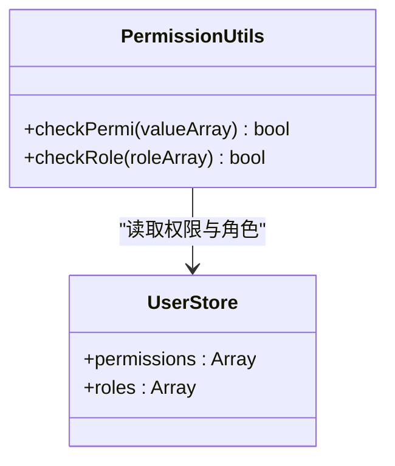
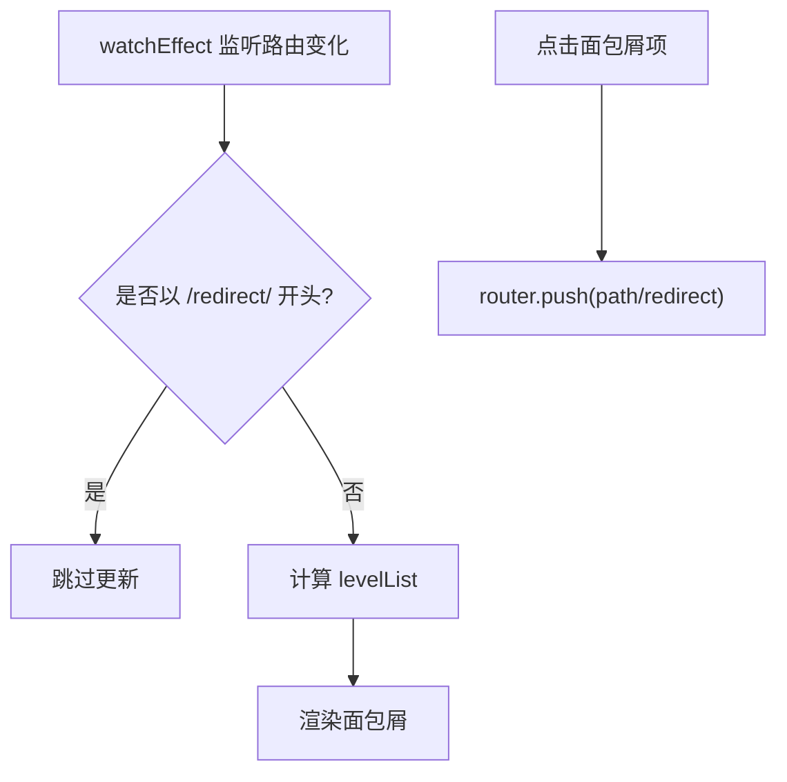
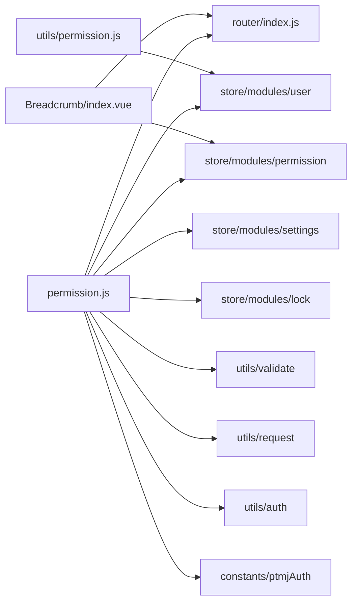

# 路由配置与导航控制

<cite>
**本文引用的文件**
- [src/renderer/router/index.js](file://PezMax-Desktop/src/renderer/router/index.js)
- [src/renderer/permission.js](file://PezMax-Desktop/src/renderer/permission.js)
- [src/renderer/utils/permission.js](file://PezMax-Desktop/src/renderer/utils/permission.js)
- [src/renderer/components/Breadcrumb/index.vue](file://PezMax-Desktop/src/renderer/components/Breadcrumb/index.vue)
</cite>

## 目录
1. [简介](#简介)
2. [项目结构](#项目结构)
3. [核心组件](#核心组件)
4. [架构总览](#架构总览)
5. [详细组件分析](#详细组件分析)
6. [依赖关系分析](#依赖关系分析)
7. [性能考虑](#性能考虑)
8. [故障排查指南](#故障排查指南)
9. [结论](#结论)
10. [附录](#附录)

## 简介
本指南聚焦于在 Electron 渲染进程中使用 Vue Router 的路由配置与导航控制，覆盖以下主题：
- 静态路由定义、动态路由生成与嵌套路由实现
- 权限控制机制：路由守卫、角色验证与菜单权限过滤
- 导航控制策略：编程式导航、路由参数传递与查询字符串处理
- 路由懒加载与代码分割优化
- 面包屑导航：动态标题生成与层级关系维护
- 路由状态管理：活动路由跟踪、历史记录管理与标签页控制
- 性能优化技巧与常见问题解决方案

## 项目结构
本项目采用前后端分离的桌面应用架构。前端基于 Vue + Vite + Vue Router，运行在 Electron 渲染进程中。路由相关的关键位置如下：
- 路由定义与实例化：src/renderer/router/index.js
- 全局路由守卫与权限拦截：src/renderer/permission.js
- 权限校验工具（角色/权限）：src/renderer/utils/permission.js
- 面包屑导航组件：src/renderer/components/Breadcrumb/index.vue

图表来源
- [src/renderer/router/index.js:1-111](file://PezMax-Desktop/src/renderer/router/index.js#L1-L111)
- [src/renderer/permission.js:1-106](file://PezMax-Desktop/src/renderer/permission.js#L1-L106)
- [src/renderer/utils/permission.js:1-51](file://PezMax-Desktop/src/renderer/utils/permission.js#L1-L51)
- [src/renderer/components/Breadcrumb/index.vue:1-97](file://PezMax-Desktop/src/renderer/components/Breadcrumb/index.vue#L1-L97)

章节来源
- [src/renderer/router/index.js:1-111](file://PezMax-Desktop/src/renderer/router/index.js#L1-L111)
- [src/renderer/permission.js:1-106](file://PezMax-Desktop/src/renderer/permission.js#L1-L106)
- [src/renderer/utils/permission.js:1-51](file://PezMax-Desktop/src/renderer/utils/permission.js#L1-L51)
- [src/renderer/components/Breadcrumb/index.vue:1-97](file://PezMax-Desktop/src/renderer/components/Breadcrumb/index.vue#L1-L97)

## 核心组件
- 路由定义与实例化
  - 提供公共静态路由 constantRoutes，包含登录、注册、找回密码、首页、用户中心、收藏、下载、排行榜重定向以及 404 兜底等。
  - 使用 createWebHashHistory 创建 Hash 模式历史，便于在 Electron 中稳定运行。
  - 配置 scrollBehavior，支持返回时恢复滚动位置或默认回到顶部。
- 全局路由守卫
  - 白名单放行、登录态校验、锁屏状态处理、动态路由生成与注入、封号拦截与跳转。
  - 同步主窗口与认证窗口显示模式，避免不必要的窗口居中刷新。
- 权限工具
  - checkPermi：基于字符型权限集合进行按钮/操作级授权判断。
  - checkRole：基于角色数组进行页面/功能级授权判断。
- 面包屑导航
  - 根据当前路由匹配项自动生成面包屑，支持多级菜单递归匹配与首页前缀插入。
  - 对 redirect=noRedirect 的路由不展示可点击链接。

章节来源
- [src/renderer/router/index.js:24-96](file://PezMax-Desktop/src/renderer/router/index.js#L24-L96)
- [src/renderer/router/index.js:98-108](file://PezMax-Desktop/src/renderer/router/index.js#L98-L108)
- [src/renderer/permission.js:19-33](file://PezMax-Desktop/src/renderer/permission.js#L19-L33)
- [src/renderer/permission.js:35-101](file://PezMax-Desktop/src/renderer/permission.js#L35-L101)
- [src/renderer/utils/permission.js:8-26](file://PezMax-Desktop/src/renderer/utils/permission.js#L8-L26)
- [src/renderer/utils/permission.js:33-51](file://PezMax-Desktop/src/renderer/utils/permission.js#L33-L51)
- [src/renderer/components/Breadcrumb/index.vue:20-83](file://PezMax-Desktop/src/renderer/components/Breadcrumb/index.vue#L20-L83)

## 架构总览
下图展示了从路由导航到权限校验、动态路由注入与面包屑生成的整体流程。

图表来源
- [src/renderer/permission.js:35-101](file://PezMax-Desktop/src/renderer/permission.js#L35-L101)
- [src/renderer/router/index.js:98-108](file://PezMax-Desktop/src/renderer/router/index.js#L98-L108)
- [src/renderer/components/Breadcrumb/index.vue:76-83](file://PezMax-Desktop/src/renderer/components/Breadcrumb/index.vue#L76-L83)

## 详细组件分析

### 路由定义与实例化（router/index.js）
- 静态路由
  - 登录、注册、找回密码、401、首页、用户中心、收藏、下载、排行榜重定向、404 兜底等。
  - 通过 meta.title、meta.icon、affix、hidden 等字段控制侧边栏、面包屑与固定标签行为。
- 动态路由
  - dynamicRoutes 预留用于后续按角色/权限动态生成。
- 路由实例
  - 使用 Hash 历史模式，适配 Electron 环境。
  - 配置滚动行为，支持返回原位与默认置顶。

图表来源
- [src/renderer/router/index.js:24-96](file://PezMax-Desktop/src/renderer/router/index.js#L24-L96)
- [src/renderer/router/index.js:98-108](file://PezMax-Desktop/src/renderer/router/index.js#L98-L108)

章节来源
- [src/renderer/router/index.js:24-96](file://PezMax-Desktop/src/renderer/router/index.js#L24-L96)
- [src/renderer/router/index.js:98-108](file://PezMax-Desktop/src/renderer/router/index.js#L98-L108)

### 全局路由守卫与权限控制（permission.js）
- 白名单与免登路径
  - 通过白名单列表与路径匹配函数放行无需登录的路由。
- 窗口模式同步
  - 根据目标路由是否为认证类路由，切换主窗口/认证窗口模式，减少重复 UI 刷新。
- 登录态与锁屏
  - 有 token 时：若进入登录页则跳转到首页；若处于锁屏状态且非锁屏页则强制跳转锁屏；反之亦然。
- 动态路由注入
  - 首次进入时拉取用户信息，根据返回的角色与权限生成可访问路由，并通过 addRoute 注入后重新导航。
- 封号处理
  - 当用户状态为封禁时，清除 token、退出登录并提示，随后跳转登录页。

图表来源
- [src/renderer/permission.js:19-33](file://PezMax-Desktop/src/renderer/permission.js#L19-L33)
- [src/renderer/permission.js:35-101](file://PezMax-Desktop/src/renderer/permission.js#L35-L101)

章节来源
- [src/renderer/permission.js:19-33](file://PezMax-Desktop/src/renderer/permission.js#L19-L33)
- [src/renderer/permission.js:35-101](file://PezMax-Desktop/src/renderer/permission.js#L35-L101)

### 权限校验工具（utils/permission.js）
- checkPermi
  - 输入权限码数组，结合用户权限集合判断是否具备操作权限。
  - 支持通配符“*:*:*”作为超级权限。
- checkRole
  - 输入角色数组，结合用户角色集合判断是否具备角色权限。
  - 支持“admin”作为超级管理员角色。

图表来源
- [src/renderer/utils/permission.js:8-26](file://PezMax-Desktop/src/renderer/utils/permission.js#L8-L26)
- [src/renderer/utils/permission.js:33-51](file://PezMax-Desktop/src/renderer/utils/permission.js#L33-L51)

章节来源
- [src/renderer/utils/permission.js:8-26](file://PezMax-Desktop/src/renderer/utils/permission.js#L8-L26)
- [src/renderer/utils/permission.js:33-51](file://PezMax-Desktop/src/renderer/utils/permission.js#L33-L51)

### 面包屑导航（components/Breadcrumb/index.vue）
- 动态生成
  - 根据当前路由 matched 与默认路由树递归匹配，构建 levelList。
  - 自动在首层插入“首页”，除非当前已是首页。
- 交互与显示
  - 对 redirect=noRedirect 或末级项仅展示文本不可点击。
  - 其余项点击后执行 router.push 跳转。
- 监听与防抖
  - 使用 watchEffect 监听路由变化，排除 /redirect/* 场景下的重复更新。

图表来源
- [src/renderer/components/Breadcrumb/index.vue:20-83](file://PezMax-Desktop/src/renderer/components/Breadcrumb/index.vue#L20-L83)

章节来源
- [src/renderer/components/Breadcrumb/index.vue:20-83](file://PezMax-Desktop/src/renderer/components/Breadcrumb/index.vue#L20-L83)

## 依赖关系分析
- 模块耦合
  - permission.js 依赖 router、store（用户/设置/锁屏/权限）、工具库（validate、request、auth）与常量（PTMJ_AUTH_*）。
  - Breadcrumb 依赖 router、route 与 permission store 中的 defaultRoutes。
  - utils/permission.js 依赖 user store 提供的权限与角色数据。
- 外部依赖
  - vue-router（createRouter、createWebHashHistory、beforeEach、afterEach）
  - Element Plus（消息与对话框）
  - NProgress（进度条）

图表来源
- [src/renderer/permission.js:1-15](file://PezMax-Desktop/src/renderer/permission.js#L1-L15)
- [src/renderer/components/Breadcrumb/index.vue:13-18](file://PezMax-Desktop/src/renderer/components/Breadcrumb/index.vue#L13-L18)
- [src/renderer/utils/permission.js:1-2](file://PezMax-Desktop/src/renderer/utils/permission.js#L1-L2)

章节来源
- [src/renderer/permission.js:1-15](file://PezMax-Desktop/src/renderer/permission.js#L1-L15)
- [src/renderer/components/Breadcrumb/index.vue:13-18](file://PezMax-Desktop/src/renderer/components/Breadcrumb/index.vue#L13-L18)
- [src/renderer/utils/permission.js:1-2](file://PezMax-Desktop/src/renderer/utils/permission.js#L1-L2)

## 性能考虑
- 路由懒加载
  - 所有页面组件均采用 () => import(...) 按需加载，降低首屏体积。
- 滚动行为优化
  - 利用 scrollBehavior 保留或重置滚动位置，提升用户体验。
- 动态路由注入时机
  - 仅在首次拉取用户信息后一次性 addRoute，避免重复注入导致内存增长。
- 白名单与快速放行
  - 白名单路由直接放行，减少不必要的异步调用。
- 窗口模式同步去抖
  - 仅在窗口模式真正变化时通知主进程，避免频繁 UI 重排。

[本节为通用建议，不直接分析具体文件]

## 故障排查指南
- 登录后仍被重定向到登录页
  - 检查白名单是否正确包含目标路径；确认 getToken 返回值是否符合预期。
- 动态路由未生效
  - 确认 getInfo 成功返回 roles/permissions；检查 generateRoutes 返回的路由是否满足 isHttp 过滤条件；确保 addRoute 后再执行 next({ ...to, replace: true })。
- 面包屑缺失或层级错误
  - 检查路由 meta.title 是否存在；确认 defaultRoutes 树结构与实际路由一致；注意 redirect=noRedirect 的路由不会显示为可点击项。
- 封号无法登录
  - 查看用户状态字段，封禁时会清除 token 并跳转登录页；确认后端返回的数据结构是否与前端解析一致。
- 锁屏状态异常
  - 检查锁屏状态与当前路径逻辑分支，确保在非锁屏状态下访问 /lock 会跳转首页，反之亦然。

章节来源
- [src/renderer/permission.js:35-101](file://PezMax-Desktop/src/renderer/permission.js#L35-L101)
- [src/renderer/components/Breadcrumb/index.vue:20-83](file://PezMax-Desktop/src/renderer/components/Breadcrumb/index.vue#L20-L83)

## 结论
本指南围绕 Vue Router 在 Electron 渲染进程中的落地实践，系统梳理了静态与动态路由、权限控制、导航策略、懒加载与面包屑的实现要点，并结合仓库现有代码给出了流程图与依赖关系图。建议在后续迭代中：
- 完善动态路由生成逻辑，使其与后端菜单/权限体系对齐
- 扩展路由元信息规范，统一 title/icon/breadcrumb/activeMenu 等字段
- 引入更细粒度的权限指令与按钮级控制
- 持续优化首屏与路由切换性能，关注内存与网络开销

[本节为总结性内容，不直接分析具体文件]

## 附录
- 关键术语
  - 静态路由：在应用启动时即注册的路由
  - 动态路由：根据用户权限在运行时生成并注册的路由
  - 路由守卫：在路由切换前后执行的钩子函数
  - 面包屑：基于路由层级关系展示的导航路径
- 最佳实践清单
  - 所有页面组件使用懒加载
  - 统一路由元信息约定
  - 白名单最小化原则
  - 动态路由只注入一次
  - 面包屑与路由元信息保持一致

[本节为补充说明，不直接分析具体文件]