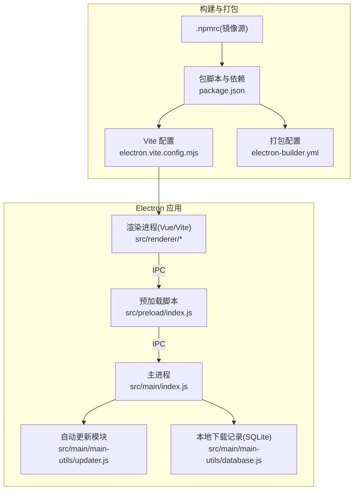
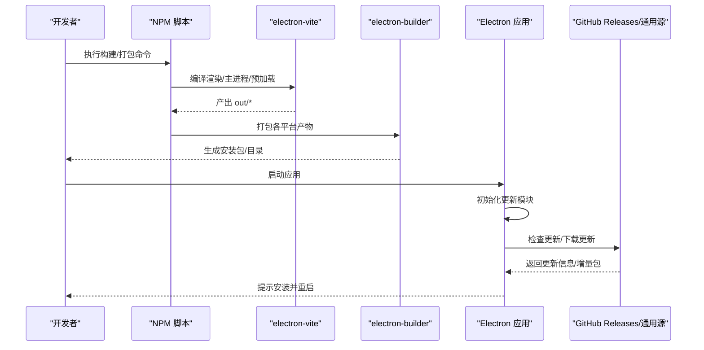
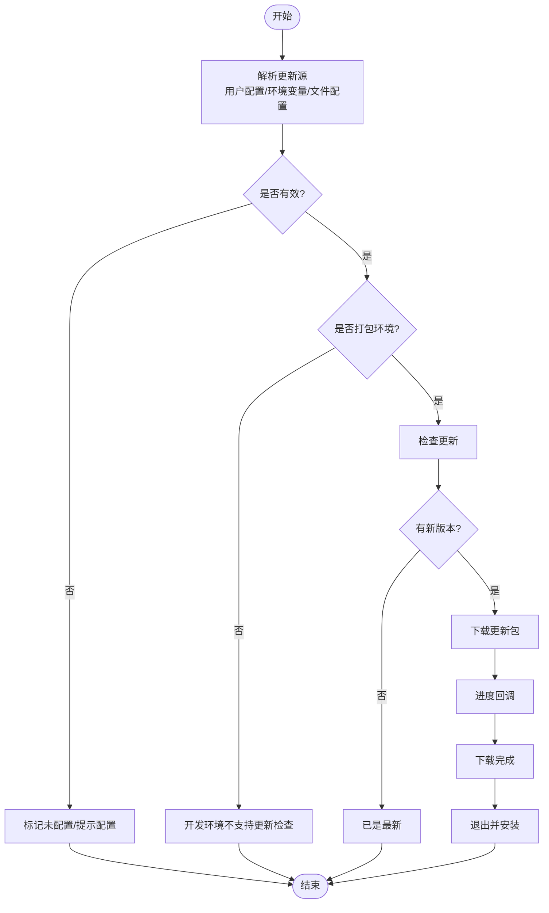
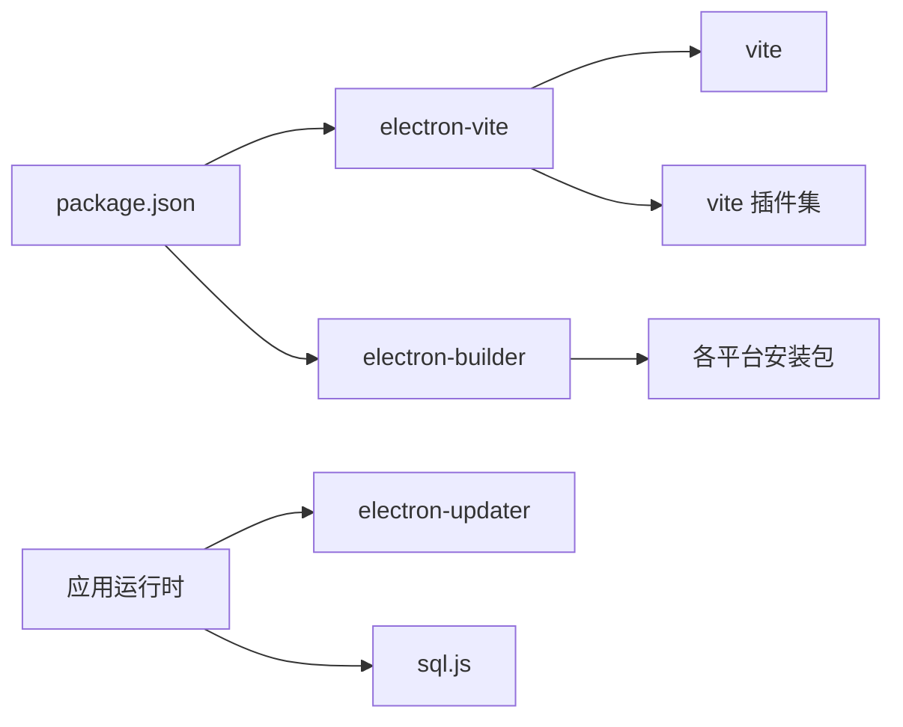

# 构建与部署

<cite>
**本文引用的文件**
- [package.json](file://PezMax-Desktop/package.json)
- [electron-builder.yml](file://PezMax-Desktop/electron-builder.yml)
- [electron.vite.config.mjs](file://PezMax-Desktop/electron.vite.config.mjs)
- [index.js](file://PezMax-Desktop/src/main/index.js)
- [updater.js](file://PezMax-Desktop/src/main/main-utils/updater.js)
- [index.js（预加载）](file://PezMax-Desktop/src/preload/index.js)
- [dev-app-update.yml](file://PezMax-Desktop/dev-app-update.yml)
- [.npmrc](file://PezMax-Desktop/.npmrc)
- [README.md](file://PezMax-Desktop/README.md)
</cite>

## 目录
1. [简介](#简介)
2. [项目结构](#项目结构)
3. [核心组件](#核心组件)
4. [架构总览](#架构总览)
5. [详细组件分析](#详细组件分析)
6. [依赖分析](#依赖分析)
7. [性能考虑](#性能考虑)
8. [故障排除指南](#故障排除指南)
9. [结论](#结论)
10. [附录](#附录)

## 简介
本指南面向使用 Electron + Vite 的桌面应用，覆盖从开发环境搭建、热重载与调试，到生产构建、跨平台打包、自动更新、分发策略、持续集成建议以及生产部署与运维的最佳实践。文档以仓库中的实际配置与实现为依据，提供可操作的步骤与排错要点。

## 项目结构
本项目采用多进程架构：主进程负责窗口管理、系统能力桥接、自动更新与本地存储；预加载脚本通过 contextBridge 暴露安全 API；渲染进程为 Vue 3 + Vite 前端。构建工具链由 electron-vite 驱动，打包器为 electron-builder。

图表来源
- [index.js:1-120](file://PezMax-Desktop/src/main/index.js#L1-L120)
- [index.js（预加载）:1-65](file://PezMax-Desktop/src/preload/index.js#L1-L65)
- [updater.js:1-120](file://PezMax-Desktop/src/main/main-utils/updater.js#L1-L120)
- [electron.vite.config.mjs:1-121](file://PezMax-Desktop/electron.vite.config.mjs#L1-L121)
- [electron-builder.yml:1-68](file://PezMax-Desktop/electron-builder.yml#L1-L68)
- [package.json:1-78](file://PezMax-Desktop/package.json#L1-L78)
- [.npmrc:1-3](file://PezMax-Desktop/.npmrc#L1-L3)

章节来源
- [README.md:80-94](file://PezMax-Desktop/README.md#L80-L94)
- [package.json:1-78](file://PezMax-Desktop/package.json#L1-L78)

## 核心组件
- 构建与脚本
  - 开发运行：支持按认证入口模式切换（client/admin），并设置环境变量。
  - 构建命令：统一调用 electron-vite 构建，再交由 electron-builder 生成安装包。
  - 清理与预览：提供 clean、preview 等辅助脚本。
- 打包配置
  - 产物命名、asar 解包规则、NSIS 安装器选项、macOS 权限描述、Linux 目标格式、发布源与镜像源。
- 运行时与 IPC
  - 主进程创建窗口、注册全局快捷键、处理文件选择/保存、下载直写、缓存清理、更新检查与安装。
  - 预加载层通过 contextBridge 暴露安全 API，供渲染进程调用。
- 自动更新
  - 支持 generic 与 github 两种 feed 源，支持用户动态配置与内置预设源，事件驱动的状态广播。

章节来源
- [package.json:8-27](file://PezMax-Desktop/package.json#L8-L27)
- [electron-builder.yml:1-68](file://PezMax-Desktop/electron-builder.yml#L1-L68)
- [index.js:1-120](file://PezMax-Desktop/src/main/index.js#L1-L120)
- [index.js（预加载）:1-65](file://PezMax-Desktop/src/preload/index.js#L1-L65)
- [updater.js:1-120](file://PezMax-Desktop/src/main/main-utils/updater.js#L1-L120)

## 架构总览
下图展示开发/构建/打包/更新的端到端流程。

图表来源
- [package.json:8-27](file://PezMax-Desktop/package.json#L8-L27)
- [electron.vite.config.mjs:87-100](file://PezMax-Desktop/electron.vite.config.mjs#L87-L100)
- [electron-builder.yml:13-68](file://PezMax-Desktop/electron-builder.yml#L13-L68)
- [updater.js:169-253](file://PezMax-Desktop/src/main/main-utils/updater.js#L169-L253)

## 详细组件分析

### 开发环境与热重载
- 依赖安装
  - 使用 npm install 安装依赖，.npmrc 已配置国内镜像加速 Electron 及 electron-builder 二进制下载。
- 启动开发
  - 通过脚本启动 electron-vite dev，支持设置认证入口模式环境变量。
  - 渲染进程启用 HMR，开发时通过 ELECTRON_RENDERER_URL 加载远程地址。
- 代理与后端联调
  - 开发服务器配置了 /dev-api 与 OpenAPI 文档路径的反代，便于对接后端服务。
- 调试工具
  - 开发环境默认监听 F12 打开 DevTools；生产环境也保留 F12 开关以便排查网络问题。

章节来源
- [.npmrc:1-3](file://PezMax-Desktop/.npmrc#L1-L3)
- [package.json:8-18](file://PezMax-Desktop/package.json#L8-L18)
- [electron.vite.config.mjs:71-86](file://PezMax-Desktop/electron.vite.config.mjs#L71-L86)
- [index.js:265-289](file://PezMax-Desktop/src/main/index.js#L265-L289)

### 构建流程与资源优化
- 构建入口
  - 统一通过 electron-vite build 进行三端构建，输出至 out/renderer 等目录。
- 资源与代码优化
  - 开启压缩插件（仅构建时生效）。
  - 产物文件名带 hash，利于缓存命中。
  - 关闭生产 sourcemap，开发环境使用 inline 便于调试。
  - 自定义 chunk 与静态资源输出路径，提升缓存与 CDN 友好性。
- 环境变量注入
  - 通过 loadEnv 读取 .env.*，如 VITE_APP_ENV、VITE_APP_TARGET_URL 等，用于控制 base 与后端地址。

章节来源
- [package.json:15-18](file://PezMax-Desktop/package.json#L15-L18)
- [electron.vite.config.mjs:11-16](file://PezMax-Desktop/electron.vite.config.mjs#L11-L16)
- [electron.vite.config.mjs:43-70](file://PezMax-Desktop/electron.vite.config.mjs#L43-L70)
- [electron.vite.config.mjs:87-100](file://PezMax-Desktop/electron.vite.config.mjs#L87-L100)

### 跨平台打包与签名
- Windows
  - NSIS 安装器：非一键安装、允许选择安装目录、生成差分包（blockmap）以支持增量更新。
  - 可执行名与快捷方式名称可配置。
- macOS
  - 可配置 entitlements 继承与扩展 Info 权限描述（摄像头、麦克风、文件夹访问等）。
  - 提供 notarize 开关（当前未启用）。
- Linux
  - 目标包含 AppImage、snap、deb。
- 发布源
  - 各平台 publish 指向 GitHub Releases 最新版本下载目录，channel 设为 latest。
- 镜像源
  - electronDownload 指定国内镜像加速 Electron 下载。

章节来源
- [electron-builder.yml:13-68](file://PezMax-Desktop/electron-builder.yml#L13-L68)
- [.npmrc:1-3](file://PezMax-Desktop/.npmrc#L1-L3)

### 自动更新与版本管理
- 更新源解析优先级
  - 用户手动配置 > 环境变量 > 配置文件（app-update.yml、dev-app-update.yml、electron-builder.yml）> 未配置。
- 支持的 provider
  - generic：提供 url 即可。
  - github：提供 owner/repo。
- 状态与事件
  - 检查中、可用、不可用、下载进度、下载完成、错误等状态通过 IPC 广播给渲染进程。
- 快捷方式恢复
  - 更新前保存桌面快捷方式存在状态，更新后重建，避免升级后丢失快捷方式。
- 开发环境限制
  - 仅在打包环境下检查/下载更新，开发环境会返回“不支持”提示。

图表来源
- [updater.js:119-204](file://PezMax-Desktop/src/main/main-utils/updater.js#L119-L204)
- [updater.js:206-253](file://PezMax-Desktop/src/main/main-utils/updater.js#L206-L253)
- [updater.js:329-393](file://PezMax-Desktop/src/main/main-utils/updater.js#L329-L393)
- [updater.js:395-532](file://PezMax-Desktop/src/main/main-utils/updater.js#L395-L532)
- [dev-app-update.yml:1-7](file://PezMax-Desktop/dev-app-update.yml#L1-L7)

章节来源
- [updater.js:1-120](file://PezMax-Desktop/src/main/main-utils/updater.js#L1-L120)
- [updater.js:169-253](file://PezMax-Desktop/src/main/main-utils/updater.js#L169-L253)
- [updater.js:270-310](file://PezMax-Desktop/src/main/main-utils/updater.js#L270-L310)
- [updater.js:329-393](file://PezMax-Desktop/src/main/main-utils/updater.js#L329-L393)
- [updater.js:395-532](file://PezMax-Desktop/src/main/main-utils/updater.js#L395-L532)
- [dev-app-update.yml:1-7](file://PezMax-Desktop/dev-app-update.yml#L1-L7)

### 应用分发策略
- 安装包生成
  - Windows：NSIS 安装包，支持增量更新（blockmap）。
  - macOS：dmg（可配合签名与公证）。
  - Linux：AppImage/snap/deb。
- 数字签名
  - 可在 electron-builder.yml 中启用 macOS 公证与签名相关配置；Windows 可通过代码签名证书对安装包签名（需结合 CI 密钥管理）。
- 版本管理
  - 通过 package.json 的 version 字段控制版本号；发布到 GitHub Releases 时，确保 artifactName 与 channel 一致，以便客户端正确识别。

章节来源
- [electron-builder.yml:21-68](file://PezMax-Desktop/electron-builder.yml#L21-L68)
- [package.json:1-10](file://PezMax-Desktop/package.json#L1-L10)

### 持续集成（CI）建议
- 自动化测试
  - 在 CI 中执行 lint 与单元测试（如有），保证代码质量。
- 构建流水线
  - 并行构建多平台产物，缓存 node_modules 与 electron 二进制，缩短构建时间。
- 质量检查
  - 提交前或 PR 阶段运行 eslint/prettier，统一代码风格。
- 发布
  - 触发条件（tag 或 release）时，上传产物至 GitHub Releases，并更新 latest 通道。

说明：仓库未提供具体 CI 配置文件，以上为通用建议，可按需添加 GitHub Actions 或其他 CI 方案。

[本节不直接分析具体源码文件]

### 生产环境部署建议
- 环境变量
  - 通过 .env.production 或构建期注入变量控制后端地址、基础路径等。
- 日志管理
  - 主进程关键路径打印日志，便于定位问题；注意在生产环境控制日志级别与落盘策略。
- 性能监控
  - 首屏白屏规避：根据主题提前设置窗口背景色。
  - 资源缓存：利用带 hash 的静态资源与浏览器缓存策略。
  - 按需加载：通过路由懒加载与分包减少首屏体积。

章节来源
- [index.js:221-242](file://PezMax-Desktop/src/main/index.js#L221-L242)
- [electron.vite.config.mjs:87-100](file://PezMax-Desktop/electron.vite.config.mjs#L87-L100)

## 依赖分析
- 构建与打包
  - electron-vite：驱动主/预加载/渲染三端构建。
  - electron-builder：跨平台打包与发布。
  - vite-plugin-compression：构建时压缩。
  - unplugin-auto-import：自动导入 Vue/Pinia 等 API。
- 运行时
  - electron-updater：自动更新。
  - sql.js：SQLite 本地数据库（下载记录）。
  - axios/form-data：网络请求与表单上传。
  - element-plus/vue-router/pinia：UI 与前端基础设施。

图表来源
- [package.json:28-76](file://PezMax-Desktop/package.json#L28-L76)
- [electron.vite.config.mjs:1-121](file://PezMax-Desktop/electron.vite.config.mjs#L1-L121)
- [electron-builder.yml:1-68](file://PezMax-Desktop/electron-builder.yml#L1-L68)

章节来源
- [package.json:28-76](file://PezMax-Desktop/package.json#L28-L76)

## 性能考虑
- 构建优化
  - 开启 gzip/brotli 压缩（构建时），减小包体。
  - 合理分包与异步加载，降低首屏体积。
  - 关闭生产 sourcemap，减少产物大小。
- 运行时优化
  - 预加载最小化暴露接口，保持上下文隔离。
  - 大文件下载采用流式直写，避免内存峰值。
  - 按需初始化 SQLite，批量写入后一次性刷盘。

[本节提供通用指导，不直接分析具体源码文件]

## 故障排除指南
- 无法下载 Electron 二进制
  - 检查 .npmrc 镜像源配置是否正确。
- 开发环境无法检查更新
  - 更新检查仅在打包环境生效，请使用打包版本测试。
- 更新源未生效
  - 确认环境变量或配置文件中的 provider/url/owner/repo 是否为占位符值；优先检查用户手动配置是否覆盖。
- 安装后桌面快捷方式丢失（Windows）
  - 更新流程会在更新后尝试重建快捷方式，若失败请检查 PowerShell 执行策略与权限。
- 下载失败或无响应
  - 检查 net.request 的网络可达性与鉴权头；查看主进程控制台错误日志。
- 端口冲突或代理异常
  - 调整开发服务器端口或代理 target，确保后端服务可达。

章节来源
- [.npmrc:1-3](file://PezMax-Desktop/.npmrc#L1-L3)
- [updater.js:329-393](file://PezMax-Desktop/src/main/main-utils/updater.js#L329-L393)
- [updater.js:395-532](file://PezMax-Desktop/src/main/main-utils/updater.js#L395-L532)
- [index.js:527-608](file://PezMax-Desktop/src/main/index.js#L527-L608)
- [electron.vite.config.mjs:71-86](file://PezMax-Desktop/electron.vite.config.mjs#L71-L86)

## 结论
本项目基于 electron-vite 与 electron-builder 构建了完整的开发、构建与打包体系，并通过 electron-updater 实现了灵活的自动更新机制。通过合理的资源优化、跨平台配置与分发策略，可实现稳定高效的桌面应用交付。建议在 CI 中完善自动化测试与构建流水线，并在生产环境做好环境变量、日志与监控配置，以提升整体可维护性与用户体验。

[本节为总结性内容，不直接分析具体源码文件]

## 附录
- 常用命令参考
  - 安装依赖：npm install
  - 开发运行：npm run dev（支持 client/admin 模式）
  - 构建：npm run build
  - 打包：npm run build:win / build:mac / build:linux
  - 清理：npm run clean
- 环境变量示例
  - VITE_AUTH_ENTRY_MODE：认证入口模式（client/admin）
  - VITE_APP_ENV：应用环境
  - VITE_APP_TARGET_URL：后端服务地址
  - PTMJ_UPDATE_PROVIDER/PTMJ_UPDATE_URL/PTMJ_UPDATE_GH_OWNER/PTMJ_UPDATE_GH_REPO：更新源配置

章节来源
- [package.json:8-27](file://PezMax-Desktop/package.json#L8-L27)
- [electron.vite.config.mjs:11-16](file://PezMax-Desktop/electron.vite.config.mjs#L11-L16)
- [updater.js:125-148](file://PezMax-Desktop/src/main/main-utils/updater.js#L125-L148)