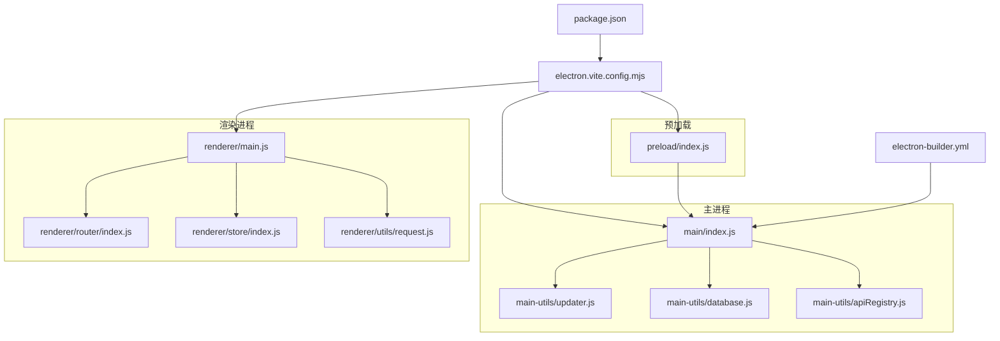
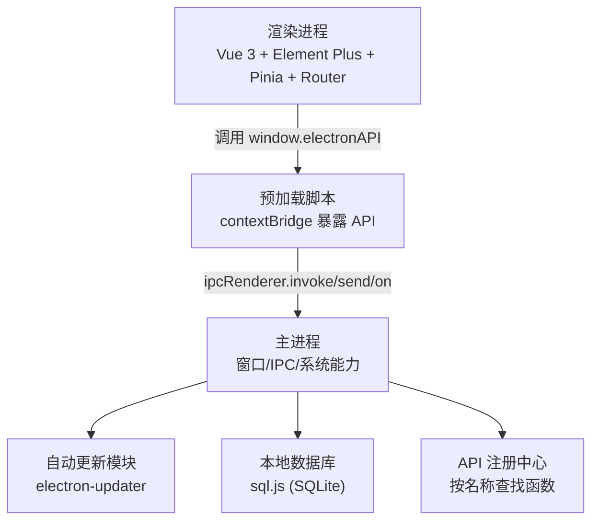
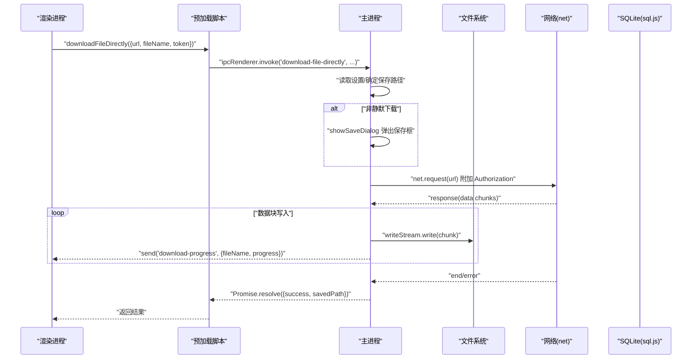
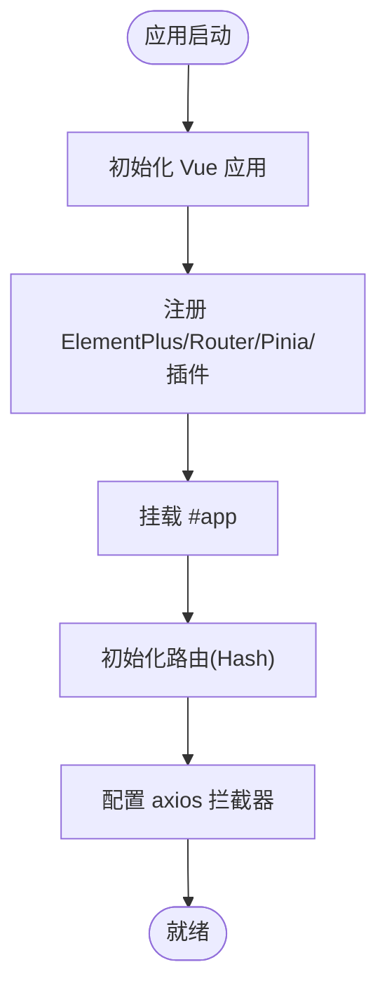
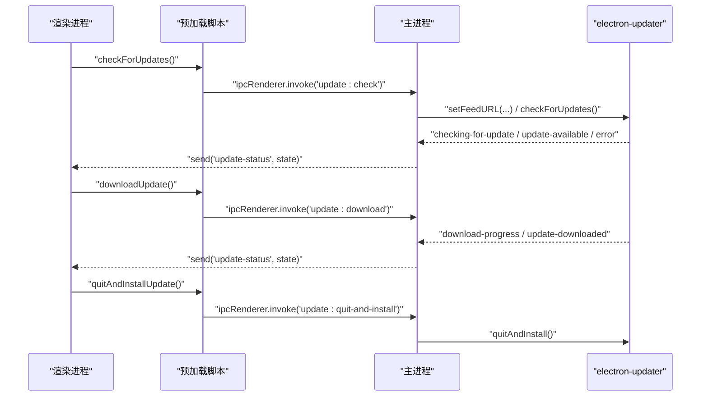
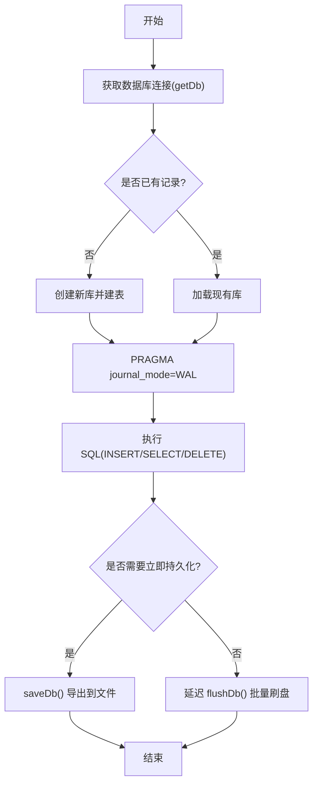
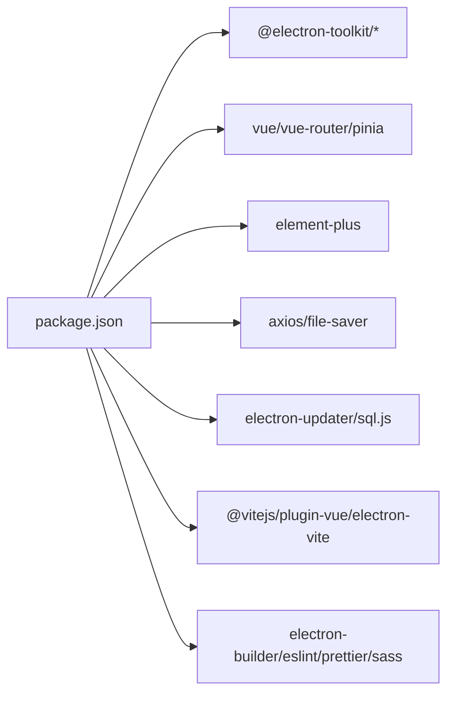

# 桌面应用开发

<cite>
**本文引用的文件**   
- [package.json](file://PezMax-Desktop/package.json)
- [electron.vite.config.mjs](file://PezMax-Desktop/electron.vite.config.mjs)
- [src/main/index.js](file://PezMax-Desktop/src/main/index.js)
- [src/preload/index.js](file://PezMax-Desktop/src/preload/index.js)
- [src/renderer/main.js](file://PezMax-Desktop/src/renderer/main.js)
- [src/renderer/router/index.js](file://PezMax-Desktop/src/renderer/router/index.js)
- [src/renderer/store/index.js](file://PezMax-Desktop/src/renderer/store/index.js)
- [src/renderer/utils/request.js](file://PezMax-Desktop/src/renderer/utils/request.js)
- [src/main/main-utils/apiRegistry.js](file://PezMax-Desktop/src/main/main-utils/apiRegistry.js)
- [src/main/main-utils/database.js](file://PezMax-Desktop/src/main/main-utils/database.js)
- [src/main/main-utils/updater.js](file://PezMax-Desktop/src/main/main-utils/updater.js)
- [electron-builder.yml](file://PezMax-Desktop/electron-builder.yml)
</cite>

## 目录
1. [简介](#简介)
2. [项目结构](#项目结构)
3. [核心组件](#核心组件)
4. [架构总览](#架构总览)
5. [详细组件分析](#详细组件分析)
6. [依赖分析](#依赖分析)
7. [性能考虑](#性能考虑)
8. [故障排查指南](#故障排查指南)
9. [结论](#结论)
10. [附录](#附录)

## 简介
本指南面向使用 Electron + Vue 3 + Vite 构建的桌面应用，围绕主进程与渲染进程的架构设计、IPC 通信机制、预加载脚本的安全边界、前端集成方案（组件、路由、状态管理）、桌面特有功能（全局快捷键、系统托盘、文件操作、自动更新、通知）以及开发/构建/跨平台最佳实践进行系统化说明。文档同时提供调试技巧、性能优化建议与常见问题解决方案，帮助读者快速上手并稳定交付高质量桌面产品。

## 项目结构
本项目采用 electron-vite 工程化方案，将主进程、预加载脚本与渲染进程分别独立构建：
- 主进程：负责窗口管理、系统能力访问、本地存储、下载、自动更新等
- 预加载脚本：通过 contextBridge 暴露最小 API 给渲染进程，保障安全隔离
- 渲染进程：基于 Vue 3 + Element Plus + Pinia + Vue Router，承载业务界面
- 构建配置：electron-vite 统一 main/preload/renderer 三端构建与开发体验
- 打包发布：electron-builder 输出多平台安装包，支持差分更新与发布到 GitHub Releases

图表来源
- [package.json:1-78](file://PezMax-Desktop/package.json#L1-L78)
- [electron.vite.config.mjs:1-121](file://PezMax-Desktop/electron.vite.config.mjs#L1-L121)
- [src/main/index.js:1-800](file://PezMax-Desktop/src/main/index.js#L1-L800)
- [src/preload/index.js:1-65](file://PezMax-Desktop/src/preload/index.js#L1-L65)
- [src/renderer/main.js:1-85](file://PezMax-Desktop/src/renderer/main.js#L1-L85)
- [src/renderer/router/index.js:1-111](file://PezMax-Desktop/src/renderer/router/index.js#L1-L111)
- [src/renderer/store/index.js:1-4](file://PezMax-Desktop/src/renderer/store/index.js#L1-L4)
- [src/renderer/utils/request.js:1-217](file://PezMax-Desktop/src/renderer/utils/request.js#L1-L217)
- [src/main/main-utils/apiRegistry.js:1-21](file://PezMax-Desktop/src/main/main-utils/apiRegistry.js#L1-L21)
- [src/main/main-utils/database.js:1-177](file://PezMax-Desktop/src/main/main-utils/database.js#L1-L177)
- [src/main/main-utils/updater.js:1-532](file://PezMax-Desktop/src/main/main-utils/updater.js#L1-L532)
- [electron-builder.yml:1-68](file://PezMax-Desktop/electron-builder.yml#L1-L68)

章节来源
- [package.json:1-78](file://PezMax-Desktop/package.json#L1-L78)
- [electron.vite.config.mjs:1-121](file://PezMax-Desktop/electron.vite.config.mjs#L1-L121)

## 核心组件
- 主进程入口与窗口管理：创建 BrowserWindow、设置 webPreferences、处理窗口事件、HMR 与 DevTools、窗口尺寸模式切换
- IPC 通道：统一的 call-api 分发器、文件选择/保存、下载直写、系统路径打开、下载记录（SQLite）、更新控制、缓存清理、背景图选择等
- 预加载桥接：contextBridge 暴露最小 API，封装 ipcRenderer.invoke/send/on，限制渲染进程直接访问 Node/Electron
- 自动更新：electron-updater 集成，支持 generic/github 两种 feed，环境变量/配置文件/用户设置多级覆盖，更新前保存快捷方式状态，安装后重建
- 本地数据库：sql.js 实现轻量 SQLite，持久化下载记录，WAL 模式提升并发写入性能
- 前端基础设施：Vue 3 + Element Plus + Pinia + Vue Router，统一 axios 请求拦截、错误提示、会话过期处理、通用下载方法
- 构建与打包：electron-vite 统一构建，electron-builder 多平台产物与发布策略

章节来源
- [src/main/index.js:1-800](file://PezMax-Desktop/src/main/index.js#L1-L800)
- [src/preload/index.js:1-65](file://PezMax-Desktop/src/preload/index.js#L1-L65)
- [src/main/main-utils/updater.js:1-532](file://PezMax-Desktop/src/main/main-utils/updater.js#L1-L532)
- [src/main/main-utils/database.js:1-177](file://PezMax-Desktop/src/main/main-utils/database.js#L1-L177)
- [src/renderer/main.js:1-85](file://PezMax-Desktop/src/renderer/main.js#L1-L85)
- [src/renderer/router/index.js:1-111](file://PezMax-Desktop/src/renderer/router/index.js#L1-L111)
- [src/renderer/store/index.js:1-4](file://PezMax-Desktop/src/renderer/store/index.js#L1-L4)
- [src/renderer/utils/request.js:1-217](file://PezMax-Desktop/src/renderer/utils/request.js#L1-L217)
- [electron-builder.yml:1-68](file://PezMax-Desktop/electron-builder.yml#L1-L68)

## 架构总览
下图展示主进程、预加载与渲染进程之间的交互关系，以及关键子系统（更新、数据库、API 注册）的职责边界。

图表来源
- [src/main/index.js:1-800](file://PezMax-Desktop/src/main/index.js#L1-L800)
- [src/preload/index.js:1-65](file://PezMax-Desktop/src/preload/index.js#L1-L65)
- [src/main/main-utils/updater.js:1-532](file://PezMax-Desktop/src/main/main-utils/updater.js#L1-L532)
- [src/main/main-utils/database.js:1-177](file://PezMax-Desktop/src/main/main-utils/database.js#L1-L177)
- [src/main/main-utils/apiRegistry.js:1-21](file://PezMax-Desktop/src/main/main-utils/apiRegistry.js#L1-L21)

## 详细组件分析

### 主进程与 IPC 机制
- 窗口创建与安全策略：启用 contextIsolation、禁用 nodeIntegration，通过 preload 暴露必要能力；根据环境动态设置 webSecurity 与 allowRunningInsecureContent，以兼容 file:// 协议下的跨域请求
- 窗口模式切换：认证页固定不可缩放尺寸，主页面恢复可缩放与最小尺寸；通过 IPC 在路由切换时通知主进程调整窗口行为
- 全局快捷键：从持久化设置读取快捷键映射，启动时注册，退出时注销；支持“全局唤醒”等常用组合键
- 统一 API 分发：ipcMain.handle('call-api', ...) 通过 apiRegistry.findApi 按名称查找并执行对应函数，便于扩展主进程能力
- 文件与下载：
  - 保存文件：支持静默下载与对话框选择，自动重命名避免覆盖
  - 选择文件/文件夹：返回结构化信息（含预览 Base64），批量上传场景支持递归遍历
  - 底层下载：net.request 流式直写磁盘，支持进度回调与错误清理
- 本地下载记录：sqlite WAL 模式，增删查与批量 flush，检查本地文件存在性，删除时同步清理磁盘
- 自动更新：初始化、检查、下载、安装全流程；支持预设源与环境变量/文件配置覆盖；更新前保存桌面快捷方式状态，安装后重建
- 缓存清理：提供清除 WebContents 缓存与 Storage Data 的接口，版本升级时可强制清理

图表来源
- [src/main/index.js:527-608](file://PezMax-Desktop/src/main/index.js#L527-L608)
- [src/preload/index.js:31-32](file://PezMax-Desktop/src/preload/index.js#L31-L32)

章节来源
- [src/main/index.js:1-800](file://PezMax-Desktop/src/main/index.js#L1-L800)
- [src/preload/index.js:1-65](file://PezMax-Desktop/src/preload/index.js#L1-L65)
- [src/main/main-utils/database.js:1-177](file://PezMax-Desktop/src/main/main-utils/database.js#L1-L177)
- [src/main/main-utils/updater.js:1-532](file://PezMax-Desktop/src/main/main-utils/updater.js#L1-L532)
- [src/main/main-utils/apiRegistry.js:1-21](file://PezMax-Desktop/src/main/main-utils/apiRegistry.js#L1-L21)

### 预加载脚本与安全边界
- 仅暴露最小 API：通过 contextBridge.exposeInMainWorld 暴露 electronAPI，包含 callApi、文件/文件夹选择、窗口控制、设置读写、更新控制、下载记录等
- 禁止直接访问 Node/Electron：渲染进程无法直接 require/import 敏感模块，所有系统能力必须经 IPC 由主进程代理
- 事件监听封装：对 update-status、download-progress 等事件提供 onXxx 包装，返回取消监听函数，避免内存泄漏

章节来源
- [src/preload/index.js:1-65](file://PezMax-Desktop/src/preload/index.js#L1-L65)

### 前端集成方案（Vue 3 + Vite）
- 应用初始化：挂载 Element Plus（含中文语言包与暗黑主题变量）、全局方法与组件、Pinia、Router、自定义指令与插件
- 路由配置：Hash 历史模式，登录/注册/找回密码等认证路由隐藏显示，首页与功能页路由定义清晰
- 状态管理：Pinia store 实例化并注入应用，后续可按模块拆分（如 user、settings、download 等）
- 网络请求：axios 实例统一 baseURL、超时、防重复提交、Token 注入、错误码处理、会话过期弹窗与跳转、通用 blob 下载

图表来源
- [src/renderer/main.js:1-85](file://PezMax-Desktop/src/renderer/main.js#L1-L85)
- [src/renderer/router/index.js:1-111](file://PezMax-Desktop/src/renderer/router/index.js#L1-L111)
- [src/renderer/store/index.js:1-4](file://PezMax-Desktop/src/renderer/store/index.js#L1-L4)
- [src/renderer/utils/request.js:1-217](file://PezMax-Desktop/src/renderer/utils/request.js#L1-L217)

章节来源
- [src/renderer/main.js:1-85](file://PezMax-Desktop/src/renderer/main.js#L1-L85)
- [src/renderer/router/index.js:1-111](file://PezMax-Desktop/src/renderer/router/index.js#L1-L111)
- [src/renderer/store/index.js:1-4](file://PezMax-Desktop/src/renderer/store/index.js#L1-L4)
- [src/renderer/utils/request.js:1-217](file://PezMax-Desktop/src/renderer/utils/request.js#L1-L217)

### 自动更新流程
- 更新源解析优先级：用户设置 > 环境变量 > 配置文件（app-update.yml/electron-builder.yml/dev-app-update.yml）> 未配置
- 事件驱动：检查中/可用/不可用/下载进度/已下载/错误等状态通过 IPC 推送至渲染进程
- 快捷方式保护：Windows 下更新前保存桌面快捷方式是否存在，安装后重建指向最新可执行文件

图表来源
- [src/main/main-utils/updater.js:1-532](file://PezMax-Desktop/src/main/main-utils/updater.js#L1-L532)
- [src/preload/index.js:35-46](file://PezMax-Desktop/src/preload/index.js#L35-L46)
- [src/main/index.js:371-382](file://PezMax-Desktop/src/main/index.js#L371-L382)

章节来源
- [src/main/main-utils/updater.js:1-532](file://PezMax-Desktop/src/main/main-utils/updater.js#L1-L532)
- [src/main/index.js:371-382](file://PezMax-Desktop/src/main/index.js#L371-L382)
- [src/preload/index.js:35-46](file://PezMax-Desktop/src/preload/index.js#L35-L46)

### 本地下载记录（SQLite）
- 数据库初始化：WAL 模式，按需建表，向后兼容新增字段
- 插入/查询/删除：按用户维度去重保留最新记录，支持按时间倒序
- 批量刷盘：flushDb 一次性导出整个数据库到磁盘，减少频繁 IO
- 文件存在性检查：根据 localPath 或 downloadDir+fileName 判断本地文件是否真实存在

图表来源
- [src/main/main-utils/database.js:1-177](file://PezMax-Desktop/src/main/main-utils/database.js#L1-L177)

章节来源
- [src/main/main-utils/database.js:1-177](file://PezMax-Desktop/src/main/main-utils/database.js#L1-L177)

### 构建与打包（electron-vite + electron-builder）
- 开发体验：electron-vite dev 支持 HMR，端口与代理配置集中管理
- 生产构建：outDir 输出 renderer 资源，main/preload 独立编译
- 多平台打包：win/mac/linux 目标与发布策略，NSIS 安装向导、差分更新、桌面快捷方式创建
- 镜像加速：electronDownload 指定国内镜像，提升下载速度

章节来源
- [electron.vite.config.mjs:1-121](file://PezMax-Desktop/electron.vite.config.mjs#L1-L121)
- [electron-builder.yml:1-68](file://PezMax-Desktop/electron-builder.yml#L1-L68)
- [package.json:1-78](file://PezMax-Desktop/package.json#L1-L78)

## 依赖分析
- 运行时依赖：Element Plus、Vue Router、Pinia、Axios、electron-updater、sql.js、file-saver 等
- 开发依赖：electron-vite、vite、@vitejs/plugin-vue、eslint、prettier、sass、unplugin-auto-import 等
- 构建工具链：electron-builder 负责打包与发布，electron-vite 负责三端构建与开发服务器

图表来源
- [package.json:1-78](file://PezMax-Desktop/package.json#L1-L78)

章节来源
- [package.json:1-78](file://PezMax-Desktop/package.json#L1-L78)

## 性能考虑
- 渲染层
  - 合理使用 keep-alive 与懒加载路由，减少首屏体积
  - 大列表虚拟化、分页与增量渲染，避免一次性渲染过多 DOM
  - 图片与静态资源压缩，开启 vite-plugin-compression 生成 gzip/brotli
- 主进程
  - 文件下载采用 net.request 流式直写，避免内存峰值
  - SQLite 使用 WAL 模式，批量写入后 flushDb 一次落盘
  - 全局快捷键与窗口事件尽量轻量，避免阻塞主线程
- 网络
  - axios 防重复提交与超时控制，合理重试与退避
  - 二进制下载统一 responseType=blob，避免二次转换

[本节为通用指导，不直接分析具体文件]

## 故障排查指南
- 开发环境无法访问后端接口
  - 检查 electron-vite 的 proxy 配置与 baseUrl 环境变量
  - 确认 webSecurity 与 allowRunningInsecureContent 的设置是否符合预期
- 自动更新无效
  - 确认运行环境为打包版本（开发环境不支持检查/下载更新）
  - 检查更新源配置优先级（用户设置 > 环境变量 > 配置文件）
  - 查看 update-status 事件状态与消息定位问题
- 下载失败或无进度
  - 检查网络权限与证书，确认 URL 可达
  - 关注 download-progress 事件与错误清理逻辑
- 会话过期或 401
  - 观察 request.js 响应拦截器的 401 分支，确认弹窗与跳转逻辑
- 本地下载记录异常
  - 检查 sqlite 文件路径与权限，确认 flushDb 是否被调用
  - 使用 list/download:add/delete/check-files 等接口逐步验证

章节来源
- [src/renderer/utils/request.js:1-217](file://PezMax-Desktop/src/renderer/utils/request.js#L1-L217)
- [src/main/main-utils/updater.js:1-532](file://PezMax-Desktop/src/main/main-utils/updater.js#L1-L532)
- [src/main/index.js:333-352](file://PezMax-Desktop/src/main/index.js#L333-L352)
- [src/main/main-utils/database.js:1-177](file://PezMax-Desktop/src/main/main-utils/database.js#L1-L177)

## 结论
本项目以 Electron 为主进程载体，结合 Vue 3 + Vite 的前端生态，形成清晰的三层架构：主进程负责系统与资源、预加载脚本提供安全桥接、渲染进程专注业务界面。通过统一的 IPC 分发、完善的自动更新与本地数据库方案，实现了稳定的桌面体验。配合 electron-vite 与 electron-builder 的工程化能力，开发者可获得高效的开发与跨平台打包体验。建议在后续迭代中持续完善安全策略、性能监控与自动化测试，进一步提升产品质量与可维护性。

[本节为总结，不直接分析具体文件]

## 附录
- 开发命令
  - 开发：npm run dev / npm run dev:client / npm run dev:admin
  - 构建：npm run build / npm run build:client / npm run build:admin
  - 打包：npm run build:win / npm run build:mac / npm run build:linux
- 环境变量
  - VITE_APP_TARGET_URL：后端地址（开发默认 localhost:8080）
  - PTMJ_UPDATE_PROVIDER/PTMJ_UPDATE_URL/PTMJ_UPDATE_GH_OWNER/PTMJ_UPDATE_GH_REPO：更新源配置
- 安全建议
  - 保持 contextIsolation=true、nodeIntegration=false
  - 仅在预加载中暴露最小 API，避免在渲染进程中直接访问 Node/Electron
  - 谨慎设置 webSecurity 与 allowRunningInsecureContent，必要时使用 HTTPS 与 CSP

章节来源
- [package.json:1-78](file://PezMax-Desktop/package.json#L1-L78)
- [electron.vite.config.mjs:1-121](file://PezMax-Desktop/electron.vite.config.mjs#L1-L121)
- [src/preload/index.js:1-65](file://PezMax-Desktop/src/preload/index.js#L1-L65)
- [src/main/index.js:233-241](file://PezMax-Desktop/src/main/index.js#L233-L241)