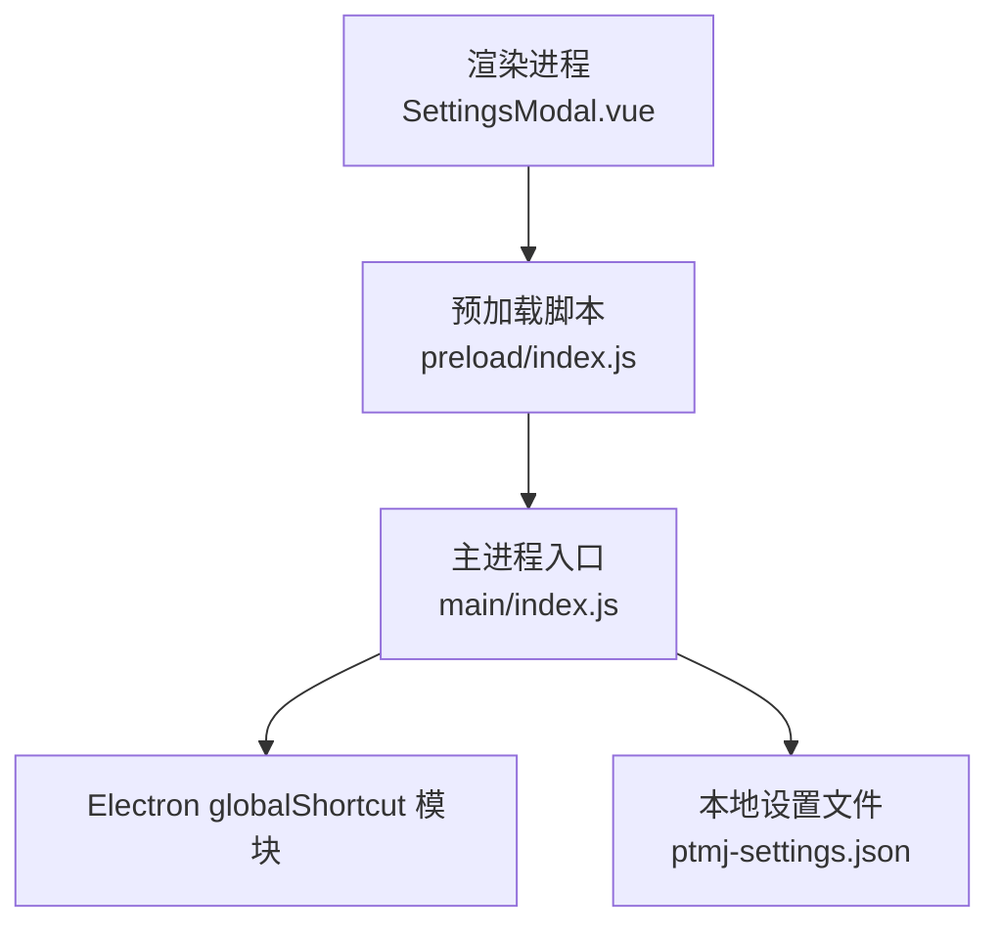
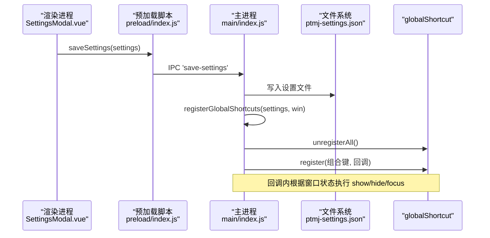
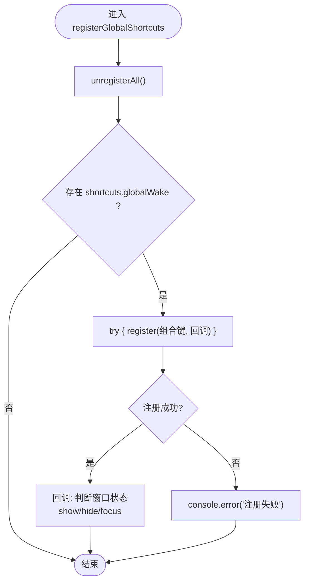
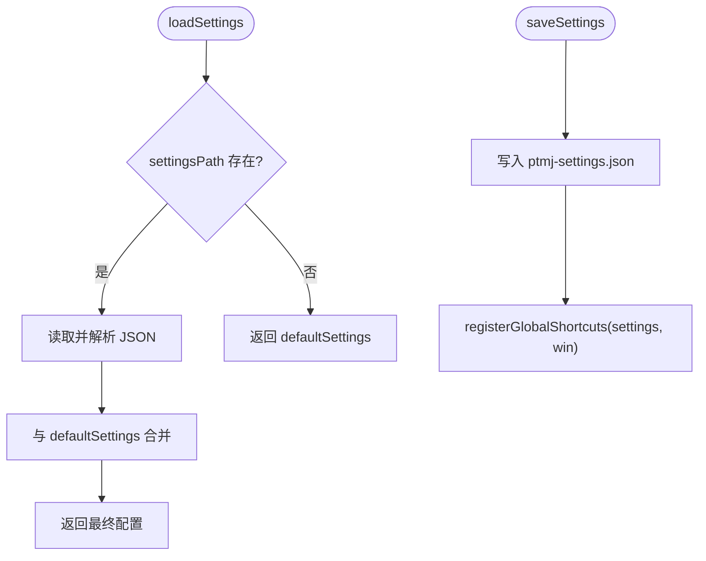
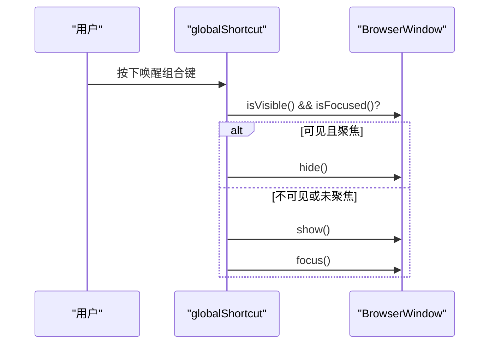
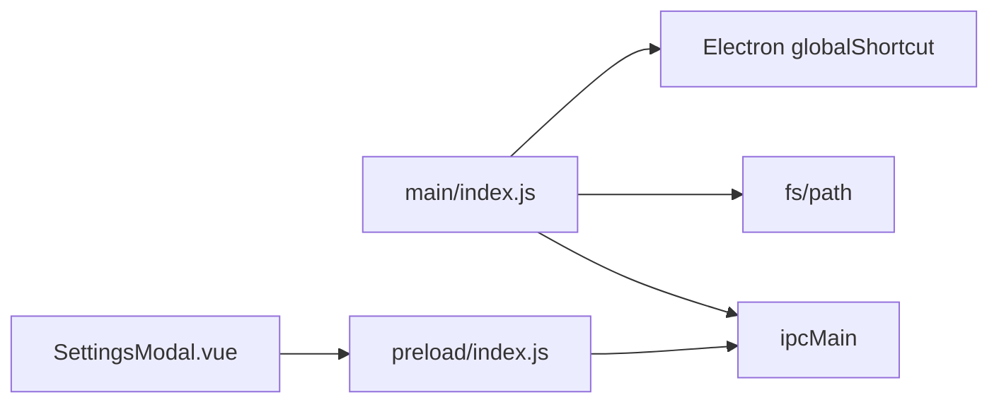

# 全局快捷键系统

<cite>
**本文引用的文件**   
- [PezMax-Desktop/src/main/index.js](file://PezMax-Desktop/src/main/index.js)
- [PezMax-Desktop/src/preload/index.js](file://PezMax-Desktop/src/preload/index.js)
- [PezMax-Desktop/src/renderer/views/home/components/SettingsModal.vue](file://PezMax-Desktop/src/renderer/views/home/components/SettingsModal.vue)
</cite>

## 目录
1. [简介](#简介)
2. [项目结构](#项目结构)
3. [核心组件](#核心组件)
4. [架构总览](#架构总览)
5. [详细组件分析](#详细组件分析)
6. [依赖分析](#依赖分析)
7. [性能考虑](#性能考虑)
8. [故障排查指南](#故障排查指南)
9. [结论](#结论)
10. [附录](#附录)

## 简介
本文件面向 PezMax-Desktop 的全局快捷键系统，系统性说明快捷键注册机制、配置管理（默认值与用户自定义）、事件处理逻辑（窗口显示/隐藏切换、功能触发、错误处理）、跨平台兼容性（Windows/Linux/macOS），并提供开发最佳实践与冲突处理策略。文档同时给出“如何添加新快捷键”和“如何处理冲突”的具体示例路径，便于快速落地。

## 项目结构
全局快捷键相关代码集中在 Electron 主进程入口与预加载脚本中，前端通过 IPC 暴露的 API 读取/保存设置，从而驱动主进程重新注册快捷键。

图表来源
- [PezMax-Desktop/src/main/index.js:1-10](file://PezMax-Desktop/src/main/index.js#L1-L10)
- [PezMax-Desktop/src/preload/index.js:1-65](file://PezMax-Desktop/src/preload/index.js#L1-L65)
- [PezMax-Desktop/src/renderer/views/home/components/SettingsModal.vue:834-858](file://PezMax-Desktop/src/renderer/views/home/components/SettingsModal.vue#L834-L858)

章节来源
- [PezMax-Desktop/src/main/index.js:1-10](file://PezMax-Desktop/src/main/index.js#L1-L10)
- [PezMax-Desktop/src/preload/index.js:1-65](file://PezMax-Desktop/src/preload/index.js#L1-L65)
- [PezMax-Desktop/src/renderer/views/home/components/SettingsModal.vue:834-858](file://PezMax-Desktop/src/renderer/views/home/components/SettingsModal.vue#L834-L858)

## 核心组件
- 快捷键注册器：负责注销旧快捷键并依据最新配置注册新的全局快捷键；在应用退出时统一清理。
- 设置持久化：提供默认快捷键模板、从磁盘加载/合并用户覆盖项、写入磁盘并在保存后即时生效。
- IPC 桥接：预加载脚本暴露 get-settings/save-settings 等接口，供渲染进程读写设置。
- 事件处理器：对全局唤醒快捷键实现窗口显示/隐藏切换；为开发/生产环境分别注册 F12 打开/关闭 DevTools。

章节来源
- [PezMax-Desktop/src/main/index.js:11-46](file://PezMax-Desktop/src/main/index.js#L11-L46)
- [PezMax-Desktop/src/main/index.js:48-90](file://PezMax-Desktop/src/main/index.js#L48-L90)
- [PezMax-Desktop/src/main/index.js:274-289](file://PezMax-Desktop/src/main/index.js#L274-L289)
- [PezMax-Desktop/src/main/index.js:308-313](file://PezMax-Desktop/src/main/index.js#L308-L313)
- [PezMax-Desktop/src/preload/index.js:25-27](file://PezMax-Desktop/src/preload/index.js#L25-L27)
- [PezMax-Desktop/src/renderer/views/home/components/SettingsModal.vue:834-858](file://PezMax-Desktop/src/renderer/views/home/components/SettingsModal.vue#L834-L858)

## 架构总览
下图展示了从渲染进程修改设置到主进程重新注册快捷键的完整链路。

图表来源
- [PezMax-Desktop/src/preload/index.js:25-27](file://PezMax-Desktop/src/preload/index.js#L25-L27)
- [PezMax-Desktop/src/main/index.js:364-370](file://PezMax-Desktop/src/main/index.js#L364-L370)
- [PezMax-Desktop/src/main/index.js:70-90](file://PezMax-Desktop/src/main/index.js#L70-L90)
- [PezMax-Desktop/src/main/index.js:48-68](file://PezMax-Desktop/src/main/index.js#L48-L68)

## 详细组件分析

### 快捷键注册器（registerGlobalShortcuts）
- 职责
  - 先注销所有已注册快捷键，避免重复或冲突。
  - 按当前 settings.shortcuts 中的条目逐一注册。
  - 对注册失败进行捕获并记录日志，防止影响主流程。
- 关键行为
  - 全局唤醒：若窗口可见且聚焦则隐藏，否则显示并聚焦。
  - 其他快捷键（如上传、设置、关闭标签）可在同一函数中以相同模式扩展。
- 生命周期
  - 应用启动时基于 currentSettings 初始化注册。
  - 保存设置后即时更新。
  - 应用退出时统一注销全部快捷键。

图表来源
- [PezMax-Desktop/src/main/index.js:48-68](file://PezMax-Desktop/src/main/index.js#L48-L68)

章节来源
- [PezMax-Desktop/src/main/index.js:48-68](file://PezMax-Desktop/src/main/index.js#L48-L68)
- [PezMax-Desktop/src/main/index.js:308-313](file://PezMax-Desktop/src/main/index.js#L308-L313)

### 设置持久化（默认值、用户覆盖、写入与热更新）
- 默认设置
  - 内置默认快捷键集合，包含全局唤醒、上传、设置、关闭标签等。
- 加载与合并
  - 优先读取用户配置文件，若不存在则回退到默认值。
  - 使用浅合并策略，用户未覆盖的字段沿用默认值。
- 写入与生效
  - 保存设置后，立即调用注册器以热更新快捷键。
  - 同时可联动其他能力（如开机自启）。
- IPC 暴露
  - 预加载脚本暴露 get-settings/save-settings，供渲染进程调用。

图表来源
- [PezMax-Desktop/src/main/index.js:11-46](file://PezMax-Desktop/src/main/index.js#L11-L46)
- [PezMax-Desktop/src/main/index.js:70-90](file://PezMax-Desktop/src/main/index.js#L70-L90)
- [PezMax-Desktop/src/preload/index.js:25-27](file://PezMax-Desktop/src/preload/index.js#L25-L27)

章节来源
- [PezMax-Desktop/src/main/index.js:11-46](file://PezMax-Desktop/src/main/index.js#L11-L46)
- [PezMax-Desktop/src/main/index.js:70-90](file://PezMax-Desktop/src/main/index.js#L70-L90)
- [PezMax-Desktop/src/preload/index.js:25-27](file://PezMax-Desktop/src/preload/index.js#L25-L27)

### 快捷键事件处理逻辑
- 全局唤醒
  - 当按下配置的唤醒组合键时，检测窗口是否可见且聚焦：
    - 是：隐藏窗口
    - 否：显示并聚焦窗口
- 开发/生产调试快捷键
  - 开发环境：F12 打开 DevTools
  - 生产环境：F12 切换 DevTools 开关
- 资源清理
  - will-quit 事件中注销所有快捷键，避免残留。

图表来源
- [PezMax-Desktop/src/main/index.js:52-67](file://PezMax-Desktop/src/main/index.js#L52-L67)
- [PezMax-Desktop/src/main/index.js:274-289](file://PezMax-Desktop/src/main/index.js#L274-L289)
- [PezMax-Desktop/src/main/index.js:308-313](file://PezMax-Desktop/src/main/index.js#L308-L313)

章节来源
- [PezMax-Desktop/src/main/index.js:52-67](file://PezMax-Desktop/src/main/index.js#L52-L67)
- [PezMax-Desktop/src/main/index.js:274-289](file://PezMax-Desktop/src/main/index.js#L274-L289)
- [PezMax-Desktop/src/main/index.js:308-313](file://PezMax-Desktop/src/main/index.js#L308-L313)

### 跨平台兼容性（Windows/Linux/macOS）
- 组合键语法
  - 使用 CommandOrControl 前缀，自动适配 Windows/Linux 的 Ctrl 与 macOS 的 Cmd。
- 平台差异
  - macOS 下 Cmd 修饰键常见，建议保留 CommandOrControl 写法以获得一致体验。
  - Linux 发行版对某些全局快捷键可能存在系统级占用，需提示用户检查系统设置。
- 冲突优先级
  - 应用启动与保存设置时会先 unregisterAll()，确保本应用内部无重复注册。
  - 与第三方软件冲突由操作系统决定，建议在 UI 中提示用户尝试更换组合键。

章节来源
- [PezMax-Desktop/src/main/index.js:28-33](file://PezMax-Desktop/src/main/index.js#L28-L33)
- [PezMax-Desktop/src/main/index.js:48-68](file://PezMax-Desktop/src/main/index.js#L48-L68)

### 前端设置界面集成
- 渲染进程通过 electronAPI.saveSettings 将最新设置提交给主进程。
- watch 监听设置变化，自动触发保存，保证快捷键即时生效。

章节来源
- [PezMax-Desktop/src/preload/index.js:25-27](file://PezMax-Desktop/src/preload/index.js#L25-L27)
- [PezMax-Desktop/src/renderer/views/home/components/SettingsModal.vue:834-858](file://PezMax-Desktop/src/renderer/views/home/components/SettingsModal.vue#L834-L858)

## 依赖分析
- 模块耦合
  - main/index.js 直接依赖 Electron 的 app、BrowserWindow、ipcMain、globalShortcut 等。
  - preload/index.js 仅作为桥接层，不持有业务逻辑。
  - SettingsModal.vue 通过 electronAPI 与主进程通信，保持解耦。
- 外部依赖
  - fs 用于读写 ptmj-settings.json。
  - path 用于拼接用户数据目录。
- 潜在循环依赖
  - 当前结构清晰，未见循环引用。

图表来源
- [PezMax-Desktop/src/main/index.js:1-10](file://PezMax-Desktop/src/main/index.js#L1-L10)
- [PezMax-Desktop/src/preload/index.js:1-65](file://PezMax-Desktop/src/preload/index.js#L1-L65)

章节来源
- [PezMax-Desktop/src/main/index.js:1-10](file://PezMax-Desktop/src/main/index.js#L1-L10)
- [PezMax-Desktop/src/preload/index.js:1-65](file://PezMax-Desktop/src/preload/index.js#L1-L65)

## 性能考虑
- 注册成本极低，但频繁切换组合键时应避免高频保存（前端已做防抖）。
- 注销与注册应在同一作用域内完成，避免中间态导致系统快捷键抢占。
- 大体积设置对象应仅增量更新必要字段，减少 IO 压力。

## 故障排查指南
- 快捷键无效
  - 检查是否被系统或其他软件占用；尝试更换组合键。
  - 查看控制台是否有“注册失败”的错误日志。
- 快捷键冲突
  - 确认保存设置后会触发 unregisterAll() 再注册，避免重复。
  - 若仍冲突，优先让出系统级保留键（如媒体键、浏览器快捷键）。
- 重启后失效
  - 确认 ptmj-settings.json 是否存在且可读；检查权限问题。
  - 确认应用启动时调用了 registerGlobalShortcuts(currentSettings, mainWindow)。
- 退出后残留
  - 确认 will-quit 中执行了 unregisterAll()。

章节来源
- [PezMax-Desktop/src/main/index.js:48-68](file://PezMax-Desktop/src/main/index.js#L48-L68)
- [PezMax-Desktop/src/main/index.js:308-313](file://PezMax-Desktop/src/main/index.js#L308-L313)
- [PezMax-Desktop/src/main/index.js:888-889](file://PezMax-Desktop/src/main/index.js#L888-L889)

## 结论
本项目全局快捷键系统采用“配置即注册”的模式：默认模板 + 用户覆盖 + 持久化存储 + 热更新注册。通过统一的注销/注册流程与完善的异常捕获，保证了跨平台的一致性与稳定性。后续可按相同模式扩展更多全局快捷键，并通过前端设置界面统一管理。

## 附录

### 添加新全局快捷键的步骤
- 步骤
  - 在默认设置中添加新快捷键字符串（例如 upload、settings、closeTab 等）。
  - 在 registerGlobalShortcuts 中新增对应分支，注册该组合键并实现回调逻辑。
  - 在前端设置界面增加对应的输入控件，绑定到 electronAPI.saveSettings。
- 参考路径
  - 默认设置定义位置：[PezMax-Desktop/src/main/index.js:11-34](file://PezMax-Desktop/src/main/index.js#L11-L34)
  - 注册器实现位置：[PezMax-Desktop/src/main/index.js:48-68](file://PezMax-Desktop/src/main/index.js#L48-L68)
  - 保存设置触发热更新位置：[PezMax-Desktop/src/main/index.js:70-90](file://PezMax-Desktop/src/main/index.js#L70-L90)
  - 前端保存设置调用位置：[PezMax-Desktop/src/renderer/views/home/components/SettingsModal.vue:834-858](file://PezMax-Desktop/src/renderer/views/home/components/SettingsModal.vue#L834-L858)

### 处理快捷键冲突的最佳实践
- 注册前统一注销：确保 unregisterAll() 在每次注册前执行。
- 捕获异常：对 register 调用包裹 try/catch，记录失败原因。
- 提供冲突提示：在 UI 中提示用户“该快捷键可能已被占用，请更换”。
- 平台差异化：macOS 下避免与系统级快捷键冲突（如 Cmd+Q、Cmd+W 等）。
- 参考路径
  - 统一注销与注册：[PezMax-Desktop/src/main/index.js:48-68](file://PezMax-Desktop/src/main/index.js#L48-L68)
  - 异常捕获与日志：[PezMax-Desktop/src/main/index.js:64-66](file://PezMax-Desktop/src/main/index.js#L64-L66)

### 调试方法
- 开发环境：使用 F12 打开 DevTools，观察控制台输出。
- 生产环境：同样支持 F12 切换 DevTools，便于定位网络与注册问题。
- 参考路径
  - 开发/生产 F12 快捷键：[PezMax-Desktop/src/main/index.js:274-289](file://PezMax-Desktop/src/main/index.js#L274-L289)