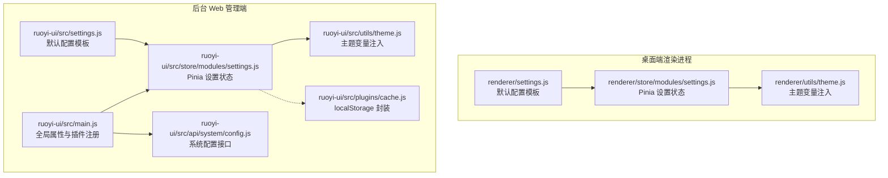
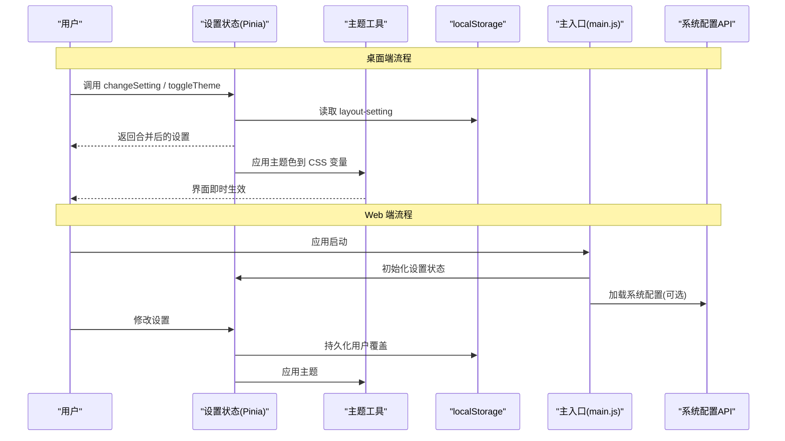
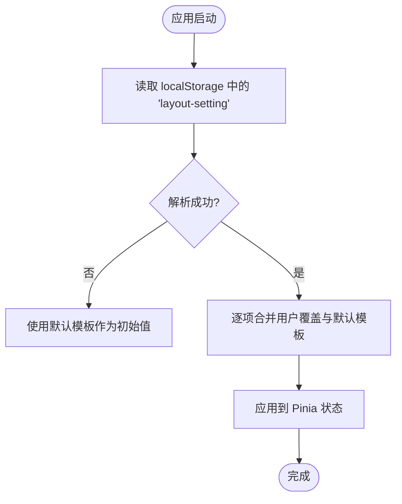
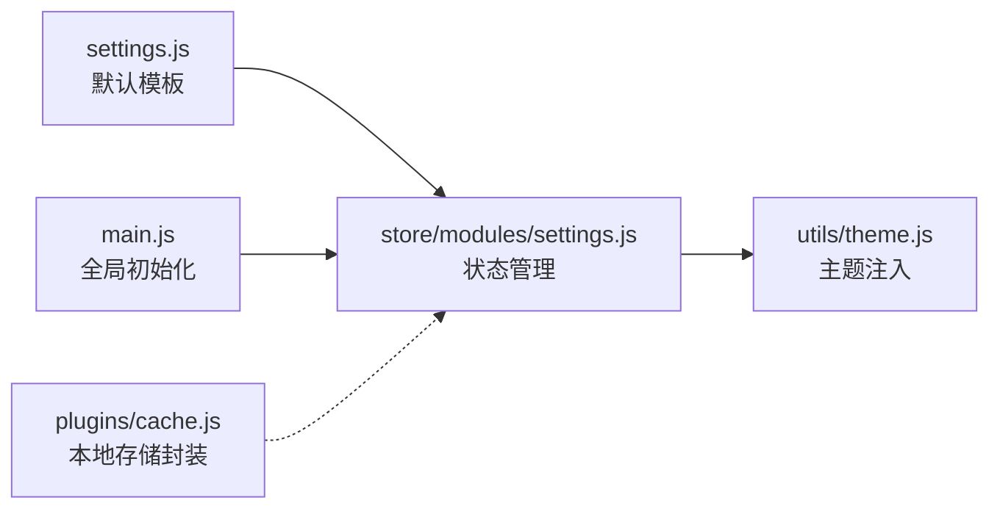

# 应用设置管理

<cite>
**本文引用的文件**
- [PezMax-Desktop/src/renderer/settings.js](file://PezMax-Desktop/src/renderer/settings.js)
- [PezMax-Desktop/src/renderer/store/modules/settings.js](file://PezMax-Desktop/src/renderer/store/modules/settings.js)
- [PezMax-Backend/ruoyi-ui/src/settings.js](file://PezMax-Backend/ruoyi-ui/src/settings.js)
- [PezMax-Backend/ruoyi-ui/src/store/modules/settings.js](file://PezMax-Backend/ruoyi-ui/src/store/modules/settings.js)
- [PezMax-Desktop/src/renderer/utils/theme.js](file://PezMax-Desktop/src/renderer/utils/theme.js)
- [PezMax-Backend/ruoyi-ui/src/utils/theme.js](file://PezMax-Backend/ruoyi-ui/src/utils/theme.js)
- [PezMax-Backend/ruoyi-ui/src/plugins/cache.js](file://PezMax-Backend/ruoyi-ui/src/plugins/cache.js)
- [PezMax-Backend/ruoyi-ui/src/main.js](file://PezMax-Backend/ruoyi-ui/src/main.js)
- [PezMax-Backend/ruoyi-ui/src/api/system/config.js](file://PezMax-Backend/ruoyi-ui/src/api/system/config.js)
</cite>

## 目录
1. [简介](#简介)
2. [项目结构](#项目结构)
3. [核心组件](#核心组件)
4. [架构总览](#架构总览)
5. [详细组件分析](#详细组件分析)
6. [依赖分析](#依赖分析)
7. [性能考虑](#性能考虑)
8. [故障排查指南](#故障排查指南)
9. [结论](#结论)
10. [附录](#附录)

## 简介
本文件面向“应用设置管理”的完整文档，覆盖以下方面：
- 设置数据结构设计：主题配置、界面布局、行为偏好与快捷键（当前仓库未实现快捷键模块）
- 设置持久化机制：localStorage 存储、默认值合并策略、版本兼容处理
- 设置变更监听：实时生效、热重载与状态同步
- 默认值管理：配置模板、环境差异与用户覆盖
- 设置验证与清理：格式校验、无效配置处理与重置建议
- 设置 API 接口文档：后端系统配置接口与前端使用示例、扩展指南

说明：
- 本项目包含两套前端：桌面端渲染进程（PezMax-Desktop）与后台 Web 管理端（RuoYi UI）。两者均实现了“设置”能力，但侧重点不同。
- 当前仓库未发现“快捷键配置”的实现；如需扩展，可在现有设置模型基础上增加字段并完善持久化与监听逻辑。

## 项目结构
与“设置管理”直接相关的代码主要分布在以下位置：
- 默认配置模板：settings.js
- 运行时状态与动作：store/modules/settings.js
- 主题样式注入：utils/theme.js
- 缓存工具（Web 端）：plugins/cache.js
- 全局初始化与插件挂载：main.js
- 系统配置 API（Web 端）：api/system/config.js



图表来源
- [PezMax-Desktop/src/renderer/settings.js:1-63](file://PezMax-Desktop/src/renderer/settings.js#L1-L63)
- [PezMax-Desktop/src/renderer/store/modules/settings.js:1-53](file://PezMax-Desktop/src/renderer/store/modules/settings.js#L1-L53)
- [PezMax-Desktop/src/renderer/utils/theme.js:1-55](file://PezMax-Desktop/src/renderer/utils/theme.js#L1-L55)
- [PezMax-Backend/ruoyi-ui/src/settings.js:1-63](file://PezMax-Backend/ruoyi-ui/src/settings.js#L1-L63)
- [PezMax-Backend/ruoyi-ui/src/store/modules/settings.js:1-53](file://PezMax-Backend/ruoyi-ui/src/store/modules/settings.js#L1-L53)
- [PezMax-Backend/ruoyi-ui/src/utils/theme.js:1-50](file://PezMax-Backend/ruoyi-ui/src/utils/theme.js#L1-L50)
- [PezMax-Backend/ruoyi-ui/src/plugins/cache.js:1-69](file://PezMax-Backend/ruoyi-ui/src/plugins/cache.js#L1-L69)
- [PezMax-Backend/ruoyi-ui/src/main.js:1-80](file://PezMax-Backend/ruoyi-ui/src/main.js#L1-L80)
- [PezMax-Backend/ruoyi-ui/src/api/system/config.js:1-56](file://PezMax-Backend/ruoyi-ui/src/api/system/config.js#L1-L56)

章节来源
- [PezMax-Desktop/src/renderer/settings.js:1-63](file://PezMax-Desktop/src/renderer/settings.js#L1-L63)
- [PezMax-Desktop/src/renderer/store/modules/settings.js:1-53](file://PezMax-Desktop/src/renderer/store/modules/settings.js#L1-L53)
- [PezMax-Backend/ruoyi-ui/src/settings.js:1-63](file://PezMax-Backend/ruoyi-ui/src/settings.js#L1-L63)
- [PezMax-Backend/ruoyi-ui/src/store/modules/settings.js:1-53](file://PezMax-Backend/ruoyi-ui/src/store/modules/settings.js#L1-L53)
- [PezMax-Backend/ruoyi-ui/src/utils/theme.js:1-50](file://PezMax-Backend/ruoyi-ui/src/utils/theme.js#L1-L50)
- [PezMax-Backend/ruoyi-ui/src/plugins/cache.js:1-69](file://PezMax-Backend/ruoyi-ui/src/plugins/cache.js#L1-L69)
- [PezMax-Backend/ruoyi-ui/src/main.js:1-80](file://PezMax-Backend/ruoyi-ui/src/main.js#L1-L80)
- [PezMax-Backend/ruoyi-ui/src/api/system/config.js:1-56](file://PezMax-Backend/ruoyi-ui/src/api/system/config.js#L1-L56)

## 核心组件
- 默认配置模板（settings.js）
  - 定义应用启动时的默认值，包括标题、侧边栏主题、导航模式、标签页显示、固定头部、Logo 显示、动态标题、底部版权等。
  - 桌面端与 Web 端各自维护一份默认模板，便于差异化定制。
- 设置状态管理（store/modules/settings.js）
  - 基于 Pinia 的状态模块，负责从 localStorage 读取用户覆盖值，并与默认模板合并形成最终运行态。
  - 提供 changeSetting、setTitle、toggleTheme 等动作以修改状态并触发副作用（如动态标题、暗黑模式切换）。
- 主题样式注入（utils/theme.js）
  - 将主题色写入 CSS 自定义属性，驱动 Element Plus 主题变量，实现即时换肤。
  - 桌面端额外注入 IDE 相关变量，供通知弹窗等统一使用。
- 缓存工具（plugins/cache.js，仅 Web 端）
  - 封装 localStorage 的读写操作，为其他模块提供统一的本地存储能力。
- 系统配置 API（api/system/config.js，仅 Web 端）
  - 暴露获取、新增、更新、删除、刷新缓存等系统配置接口，用于服务端可配置项的管理。

章节来源
- [PezMax-Desktop/src/renderer/settings.js:1-63](file://PezMax-Desktop/src/renderer/settings.js#L1-L63)
- [PezMax-Desktop/src/renderer/store/modules/settings.js:1-53](file://PezMax-Desktop/src/renderer/store/modules/settings.js#L1-L53)
- [PezMax-Backend/ruoyi-ui/src/settings.js:1-63](file://PezMax-Backend/ruoyi-ui/src/settings.js#L1-L63)
- [PezMax-Backend/ruoyi-ui/src/store/modules/settings.js:1-53](file://PezMax-Backend/ruoyi-ui/src/store/modules/settings.js#L1-L53)
- [PezMax-Desktop/src/renderer/utils/theme.js:1-55](file://PezMax-Desktop/src/renderer/utils/theme.js#L1-L55)
- [PezMax-Backend/ruoyi-ui/src/utils/theme.js:1-50](file://PezMax-Backend/ruoyi-ui/src/utils/theme.js#L1-L50)
- [PezMax-Backend/ruoyi-ui/src/plugins/cache.js:1-69](file://PezMax-Backend/ruoyi-ui/src/plugins/cache.js#L1-L69)
- [PezMax-Backend/ruoyi-ui/src/api/system/config.js:1-56](file://PezMax-Backend/ruoyi-ui/src/api/system/config.js#L1-L56)

## 架构总览
下图展示了“设置”在两个前端的整体数据流与交互关系：



图表来源
- [PezMax-Desktop/src/renderer/store/modules/settings.js:1-53](file://PezMax-Desktop/src/renderer/store/modules/settings.js#L1-L53)
- [PezMax-Desktop/src/renderer/utils/theme.js:1-55](file://PezMax-Desktop/src/renderer/utils/theme.js#L1-L55)
- [PezMax-Backend/ruoyi-ui/src/main.js:1-80](file://PezMax-Backend/ruoyi-ui/src/main.js#L1-L80)
- [PezMax-Backend/ruoyi-ui/src/api/system/config.js:1-56](file://PezMax-Backend/ruoyi-ui/src/api/system/config.js#L1-L56)

## 详细组件分析

### 设置数据结构设计
- 主题配置
  - 主题色：theme（十六进制字符串），通过 CSS 变量注入到 Element Plus 主题体系。
  - 侧边栏主题：sideTheme（深色/浅色），控制侧边栏外观。
  - 暗黑模式：isDark（布尔），配合 useDark/useToggle 切换。
- 界面设置
  - navType：导航模式（左侧/混合/顶部）。
  - tagsView/tagsIcon/tagsViewPersist：标签页显示、图标、是否持久化。
  - fixedHeader/sidebarLogo：固定头部、侧边栏 Logo 显示。
  - dynamicTitle/footerVisible/footerContent：动态标题、底部版权可见性与内容。
- 行为偏好
  - showSettings：是否展示设置面板开关。
  - title：网页标题（可由 setTitle 动态更新）。
- 快捷键配置
  - 当前仓库未实现快捷键相关字段与逻辑。若需扩展，建议在 settings.js 中新增键位映射对象，并在 store 中提供绑定/解绑动作，同时考虑持久化与冲突检测。

章节来源
- [PezMax-Desktop/src/renderer/settings.js:1-63](file://PezMax-Desktop/src/renderer/settings.js#L1-L63)
- [PezMax-Backend/ruoyi-ui/src/settings.js:1-63](file://PezMax-Backend/ruoyi-ui/src/settings.js#L1-L63)
- [PezMax-Desktop/src/renderer/store/modules/settings.js:1-53](file://PezMax-Desktop/src/renderer/store/modules/settings.js#L1-L53)
- [PezMax-Backend/ruoyi-ui/src/store/modules/settings.js:1-53](file://PezMax-Backend/ruoyi-ui/src/store/modules/settings.js#L1-L53)

### 设置持久化机制
- 存储位置
  - 桌面端：使用 localStorage 中的 key “layout-setting”，保存 JSON 字符串。
  - Web 端：通过 plugins/cache.js 提供的 localStorage 封装进行读写。
- 合并策略
  - 启动时从 localStorage 读取用户覆盖值，与默认模板逐项合并。
  - 对于 undefined 或空值，回退到默认模板对应字段。
- 版本兼容处理
  - 当新增设置项时，旧版用户的 localStorage 不会包含新字段，此时会回退到默认值，保证向后兼容。
  - 建议在后续迭代中引入 version 字段与迁移脚本，对历史数据进行清洗与升级。



图表来源
- [PezMax-Desktop/src/renderer/store/modules/settings.js:1-53](file://PezMax-Desktop/src/renderer/store/modules/settings.js#L1-L53)
- [PezMax-Backend/ruoyi-ui/src/plugins/cache.js:1-69](file://PezMax-Backend/ruoyi-ui/src/plugins/cache.js#L1-L69)

章节来源
- [PezMax-Desktop/src/renderer/store/modules/settings.js:1-53](file://PezMax-Desktop/src/renderer/store/modules/settings.js#L1-L53)
- [PezMax-Backend/ruoyi-ui/src/plugins/cache.js:1-69](file://PezMax-Backend/ruoyi-ui/src/plugins/cache.js#L1-L69)

### 设置变更监听与实时生效
- 实时生效
  - 主题色变更：通过 utils/theme.js 将主题色写入 CSS 变量，界面立即响应。
  - 暗黑模式：toggleTheme 切换 isDark 并调用 useDark/useToggle，全局暗色主题即时生效。
  - 动态标题：setTitle 更新 title 后调用 useDynamicTitle，浏览器标题实时更新。
- 热重载
  - 当前未实现“热重载”机制（即外部配置文件变化自动刷新）。可通过监听文件系统或使用 IPC（桌面端）实现。
- 状态同步
  - 同一窗口内多个组件通过 Pinia 共享状态，修改一处即可全局同步。
  - 跨窗口/多标签页场景可使用 storage 事件或广播机制进行同步（当前未实现）。

```mermaid
sequenceDiagram
participant UI as "UI 组件"
participant Store as "设置状态"
participant Theme as "主题工具"
participant Title as "动态标题工具"
UI->>Store : changeSetting({key,value})
Store->>Store : 更新 state[key]
alt 主题相关
Store->>Theme : handleThemeStyle(theme)
Theme-->>UI : CSS 变量更新，界面即时生效
end
alt 标题相关
Store->>Title : useDynamicTitle()
Title-->>UI : 浏览器标题更新
end
```

图表来源
- [PezMax-Desktop/src/renderer/store/modules/settings.js:1-53](file://PezMax-Desktop/src/renderer/store/modules/settings.js#L1-L53)
- [PezMax-Desktop/src/renderer/utils/theme.js:1-55](file://PezMax-Desktop/src/renderer/utils/theme.js#L1-L55)
- [PezMax-Backend/ruoyi-ui/src/utils/theme.js:1-50](file://PezMax-Backend/ruoyi-ui/src/utils/theme.js#L1-L50)

章节来源
- [PezMax-Desktop/src/renderer/store/modules/settings.js:1-53](file://PezMax-Desktop/src/renderer/store/modules/settings.js#L1-L53)
- [PezMax-Desktop/src/renderer/utils/theme.js:1-55](file://PezMax-Desktop/src/renderer/utils/theme.js#L1-L55)
- [PezMax-Backend/ruoyi-ui/src/utils/theme.js:1-50](file://PezMax-Backend/ruoyi-ui/src/utils/theme.js#L1-L50)

### 默认值管理与环境差异
- 配置模板
  - 桌面端与 Web 端分别维护 settings.js，便于在不同平台/环境中提供差异化默认值。
- 环境差异
  - 通过环境变量注入标题等值（例如 VITE_APP_TITLE），在构建期决定默认值。
- 用户覆盖
  - 用户通过界面修改设置后，覆盖值持久化到 localStorage，下次启动优先使用覆盖值。

章节来源
- [PezMax-Desktop/src/renderer/settings.js:1-63](file://PezMax-Desktop/src/renderer/settings.js#L1-L63)
- [PezMax-Backend/ruoyi-ui/src/settings.js:1-63](file://PezMax-Backend/ruoyi-ui/src/settings.js#L1-L63)

### 设置验证与清理
- 格式校验
  - 当前未实现严格的设置值校验。建议在 changeSetting 中增加类型与范围校验，避免非法值污染状态。
- 无效配置处理
  - 当 localStorage 中数据损坏或格式不正确时，应捕获异常并回退到默认模板。
- 设置重置
  - 建议提供“恢复默认”功能：清空用户覆盖或按版本迁移规则重建默认值。

章节来源
- [PezMax-Desktop/src/renderer/store/modules/settings.js:1-53](file://PezMax-Desktop/src/renderer/store/modules/settings.js#L1-L53)
- [PezMax-Backend/ruoyi-ui/src/plugins/cache.js:1-69](file://PezMax-Backend/ruoyi-ui/src/plugins/cache.js#L1-L69)

### 设置 API 接口文档（Web 端）
以下为 Web 端系统配置相关接口的概览与用法要点（具体路径与参数以源码为准）：
- 列表查询
  - 方法：GET
  - 路径：/system/config/list
  - 用途：分页获取系统配置列表
- 根据 ID 查询
  - 方法：GET
  - 路径：/system/config/{configId}
  - 用途：获取指定配置详情
- 根据 Key 查询
  - 方法：GET
  - 路径：/system/config/configKey/{configKey}
  - 用途：按配置键获取值
- 新增配置
  - 方法：POST
  - 路径：/system/config
  - 用途：创建新的系统配置项
- 更新配置
  - 方法：PUT
  - 路径：/system/config
  - 用途：修改已有配置项
- 删除配置
  - 方法：DELETE
  - 路径：/system/config/{configId}
  - 用途：删除指定配置项
- 刷新缓存
  - 方法：POST
  - 路径：/system/config/refreshCache
  - 用途：刷新服务端配置缓存

使用示例（概念性描述）：
- 在页面初始化时调用列表接口，将结果缓存至 Pinia 或本地存储，供全局使用。
- 用户修改配置后，调用新增/更新接口，成功后刷新缓存并提示用户。
- 需要立即生效的配置项，调用刷新缓存接口后再拉取最新值。

章节来源
- [PezMax-Backend/ruoyi-ui/src/api/system/config.js:1-56](file://PezMax-Backend/ruoyi-ui/src/api/system/config.js#L1-L56)

## 依赖分析
- 组件耦合
  - store/modules/settings.js 依赖 settings.js 的默认模板与 theme.js 的主题工具。
  - main.js 在应用启动阶段注册 Pinia 与全局属性，间接影响设置的使用方式。
- 外部依赖
  - VueUse 的 useDark/useToggle 用于暗黑模式切换。
  - localStorage 用于持久化。
- 潜在循环依赖
  - 当前未见循环导入；保持 store 与工具函数解耦，有利于测试与维护。



图表来源
- [PezMax-Desktop/src/renderer/settings.js:1-63](file://PezMax-Desktop/src/renderer/settings.js#L1-L63)
- [PezMax-Desktop/src/renderer/store/modules/settings.js:1-53](file://PezMax-Desktop/src/renderer/store/modules/settings.js#L1-L53)
- [PezMax-Desktop/src/renderer/utils/theme.js:1-55](file://PezMax-Desktop/src/renderer/utils/theme.js#L1-L55)
- [PezMax-Backend/ruoyi-ui/src/main.js:1-80](file://PezMax-Backend/ruoyi-ui/src/main.js#L1-L80)
- [PezMax-Backend/ruoyi-ui/src/plugins/cache.js:1-69](file://PezMax-Backend/ruoyi-ui/src/plugins/cache.js#L1-L69)

章节来源
- [PezMax-Desktop/src/renderer/settings.js:1-63](file://PezMax-Desktop/src/renderer/settings.js#L1-L63)
- [PezMax-Desktop/src/renderer/store/modules/settings.js:1-53](file://PezMax-Desktop/src/renderer/store/modules/settings.js#L1-L53)
- [PezMax-Backend/ruoyi-ui/src/main.js:1-80](file://PezMax-Backend/ruoyi-ui/src/main.js#L1-L80)
- [PezMax-Backend/ruoyi-ui/src/plugins/cache.js:1-69](file://PezMax-Backend/ruoyi-ui/src/plugins/cache.js#L1-L69)

## 性能考虑
- 减少不必要的重渲染：仅在主题、标题等关键设置变更时触发副作用。
- 批量更新：合并多次设置变更后再持久化，降低 I/O 压力。
- 懒加载：非首屏的设置项可延迟加载，缩短启动时间。
- 缓存策略：对系统配置类数据采用合理缓存与失效策略，避免频繁请求。

## 故障排查指南
- 主题不生效
  - 检查主题色是否为合法十六进制值。
  - 确认 handleThemeStyle 是否被调用且 CSS 变量已写入。
- 暗黑模式无效
  - 检查 isDark 状态是否正确切换，useDark/useToggle 是否可用。
- 设置未持久化
  - 确认 localStorage 是否可用，key 名称一致，JSON 序列化正常。
- 默认值未生效
  - 检查 localStorage 中是否存在覆盖值，或解析失败导致回退逻辑未执行。
- 系统配置接口报错
  - 核对接口路径与方法，检查权限与网络状态，必要时刷新缓存。

章节来源
- [PezMax-Desktop/src/renderer/utils/theme.js:1-55](file://PezMax-Desktop/src/renderer/utils/theme.js#L1-L55)
- [PezMax-Backend/ruoyi-ui/src/utils/theme.js:1-50](file://PezMax-Backend/ruoyi-ui/src/utils/theme.js#L1-L50)
- [PezMax-Backend/ruoyi-ui/src/plugins/cache.js:1-69](file://PezMax-Backend/ruoyi-ui/src/plugins/cache.js#L1-L69)
- [PezMax-Backend/ruoyi-ui/src/api/system/config.js:1-56](file://PezMax-Backend/ruoyi-ui/src/api/system/config.js#L1-L56)

## 结论
- 当前“设置管理”在桌面端与 Web 端均已具备基础能力：默认模板、状态管理、主题注入与本地持久化。
- 缺失项包括：严格校验、版本迁移、快捷键配置、跨窗口同步与热重载。建议按优先级逐步完善。
- 通过清晰的默认模板与合并策略，系统在可扩展性与兼容性之间取得平衡，便于后续演进。

## 附录
- 扩展指南（建议）
  - 新增设置项：在 settings.js 中添加默认值，在 store 中声明状态并提供 action，必要时在 theme 或其他工具中处理副作用。
  - 校验与清理：在 action 中增加类型与范围校验，提供“恢复默认”与“清理无效项”的工具方法。
  - 快捷键支持：新增键位映射对象与绑定/解绑动作，注意冲突检测与持久化。
  - 版本迁移：引入 version 字段与迁移脚本，确保历史数据平滑升级。
  - 跨窗口同步：使用 storage 事件或 IPC 广播，实现多窗口/多标签页状态同步。