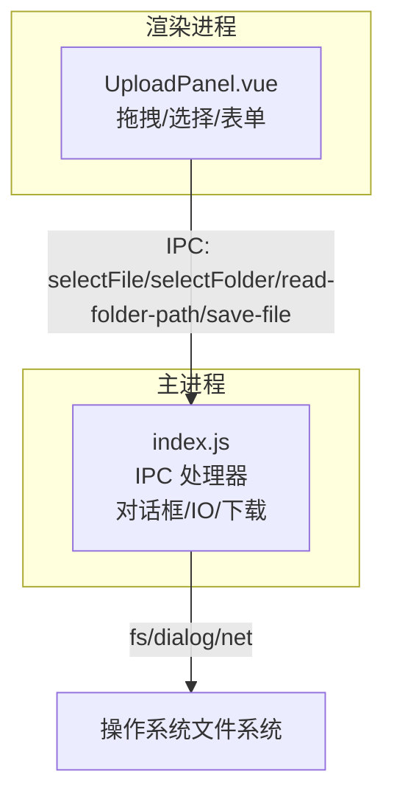
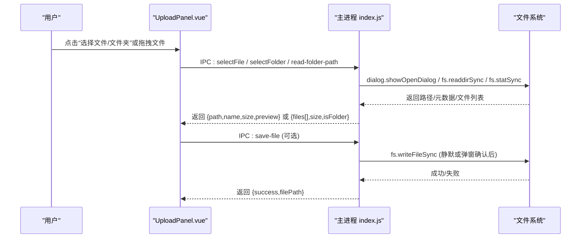
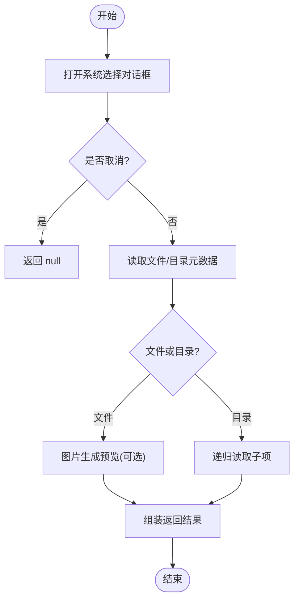
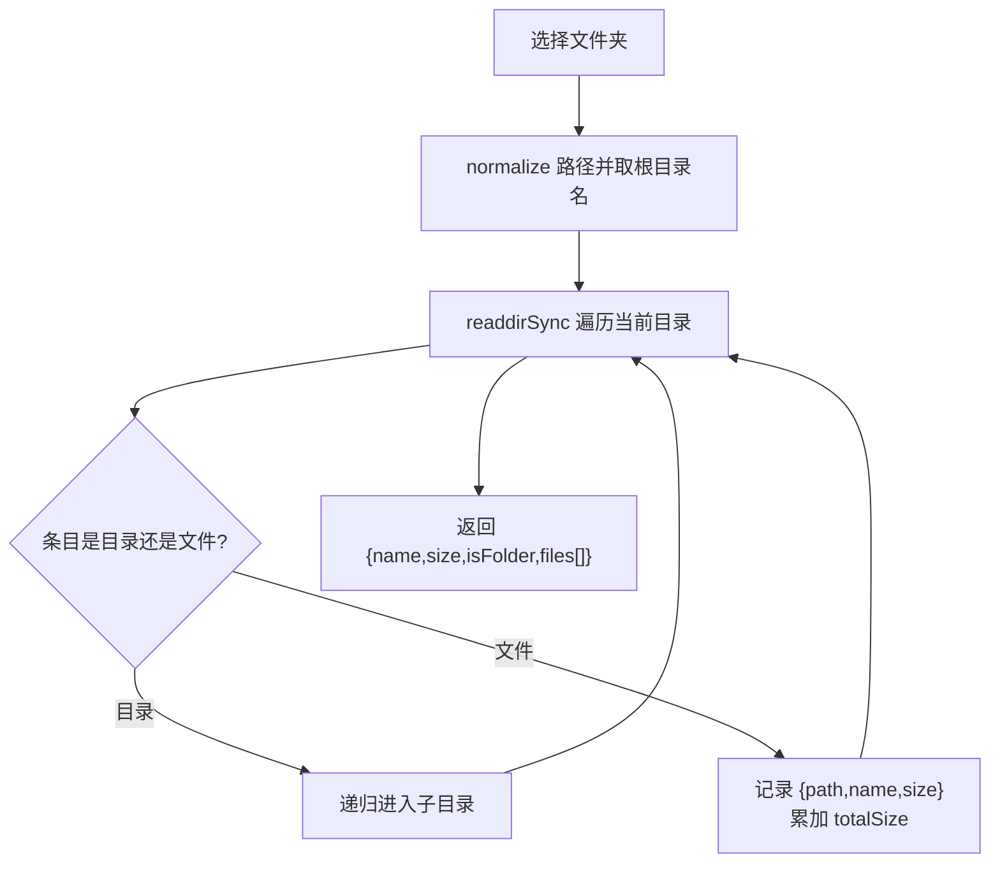
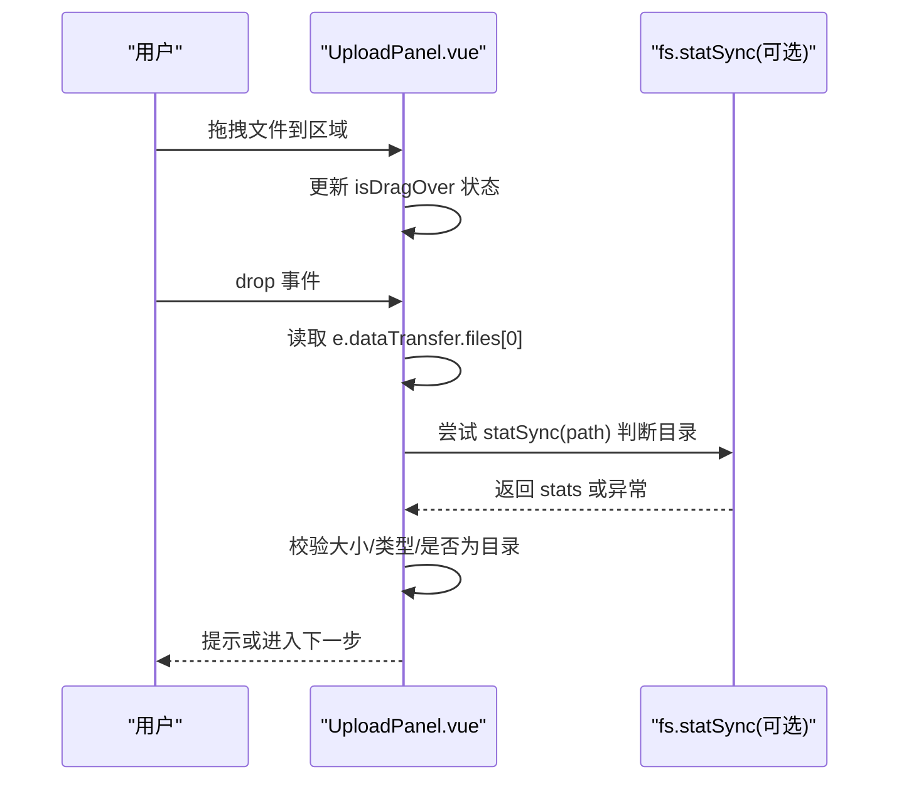
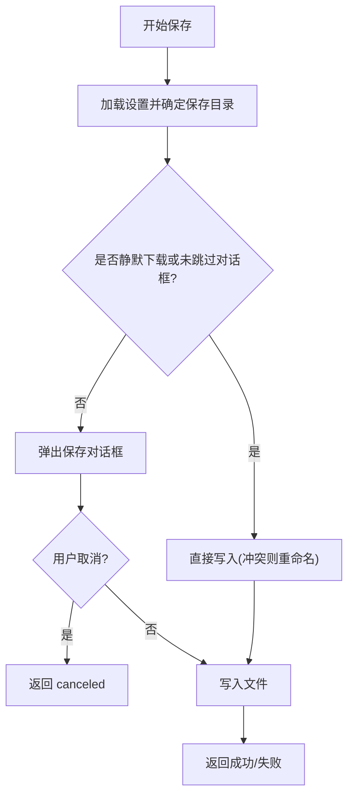
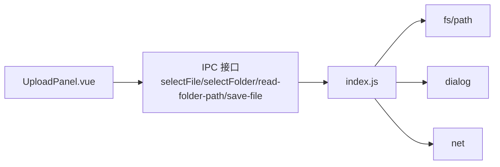

# 文件系统操作

<cite>
**本文引用的文件**   
- [PezMax-Desktop/src/main/index.js](file://PezMax-Desktop/src/main/index.js)
- [PezMax-Desktop/src/renderer/views/home/components/UploadPanel.vue](file://PezMax-Desktop/src/renderer/views/home/components/UploadPanel.vue)
</cite>

## 目录
1. [简介](#简介)
2. [项目结构](#项目结构)
3. [核心组件](#核心组件)
4. [架构总览](#架构总览)
5. [详细组件分析](#详细组件分析)
6. [依赖关系分析](#依赖关系分析)
7. [性能考量](#性能考量)
8. [故障排查指南](#故障排查指南)
9. [结论](#结论)
10. [附录：代码示例路径](#附录：代码示例路径)

## 简介
本文件围绕桌面端（Electron）的文件系统操作进行系统化文档化，覆盖以下能力与规范：
- 文件选择对话框：单文件、多文件、文件夹选择
- 批量上传：递归读取文件夹、文件大小计算、预览生成、webkitRelativePath 规范支持
- 拖拽文件支持：事件处理、路径解析、类型验证
- 文件保存机制：静默下载模式、重命名策略、保存路径管理
- 安全考虑：路径遍历防护、权限检查、异常处理
- 完整示例：通过“章节来源”定位到具体实现位置，便于快速查阅与复用

## 项目结构
本项目采用 Electron 主进程 + 渲染进程的双进程架构。与文件系统相关的关键逻辑集中在：
- 主进程：负责调用系统对话框、读写本地磁盘、流式下载、设置持久化等
- 渲染进程：提供用户交互界面，发起 IPC 请求并展示结果

图表来源
- [PezMax-Desktop/src/main/index.js:667-787](file://PezMax-Desktop/src/main/index.js#L667-L787)
- [PezMax-Desktop/src/renderer/views/home/components/UploadPanel.vue:405-532](file://PezMax-Desktop/src/renderer/views/home/components/UploadPanel.vue#L405-L532)

章节来源
- [PezMax-Desktop/src/main/index.js:1-120](file://PezMax-Desktop/src/main/index.js#L1-L120)
- [PezMax-Desktop/src/renderer/views/home/components/UploadPanel.vue:1-120](file://PezMax-Desktop/src/renderer/views/home/components/UploadPanel.vue#L1-L120)

## 核心组件
- 文件选择对话框（单文件/多文件/文件夹）
  - 单文件：打开系统文件选择器，返回物理路径、文件名、大小及图片预览
  - 多文件：可通过 properties 配置多选（见后文扩展建议）
  - 文件夹：打开系统目录选择器，递归扫描并返回结构化文件列表
- 批量上传
  - 递归读取文件夹内容，统一使用正斜杠构建 webkitRelativePath
  - 统计每个文件 size 与文件夹 totalSize
  - 对图片生成 Base64 预览（仅单文件场景）
- 拖拽文件支持
  - 在渲染层拦截 dragenter/dragover/drop 事件
  - 解析 dataTransfer.files 与 path，校验是否为文件夹或超大文件
- 文件保存机制
  - 支持静默下载模式：自动写入默认下载目录，冲突时自动重命名
  - 非静默模式：弹出保存对话框，由用户确认路径
  - 保存路径优先顺序：传入 folderPath > 设置中的 downloadPath > 系统 downloads 目录

章节来源
- [PezMax-Desktop/src/main/index.js:384-427](file://PezMax-Desktop/src/main/index.js#L384-L427)
- [PezMax-Desktop/src/main/index.js:667-787](file://PezMax-Desktop/src/main/index.js#L667-L787)
- [PezMax-Desktop/src/renderer/views/home/components/UploadPanel.vue:405-532](file://PezMax-Desktop/src/renderer/views/home/components/UploadPanel.vue#L405-L532)

## 架构总览
下图展示了从 UI 触发到主进程执行文件系统操作的端到端流程。

图表来源
- [PezMax-Desktop/src/main/index.js:384-427](file://PezMax-Desktop/src/main/index.js#L384-L427)
- [PezMax-Desktop/src/main/index.js:667-787](file://PezMax-Desktop/src/main/index.js#L667-L787)
- [PezMax-Desktop/src/renderer/views/home/components/UploadPanel.vue:482-532](file://PezMax-Desktop/src/renderer/views/home/components/UploadPanel.vue#L482-L532)

## 详细组件分析

### 文件选择对话框（单文件/多文件/文件夹）
- 单文件选择
  - 行为：弹出系统文件选择器，限制为 openFile；返回物理路径、文件名、大小；若为图片则生成 Base64 预览
  - 关键点：以当前聚焦窗口作为父窗口，避免被遮挡；捕获异常并返回 null
- 多文件选择（扩展建议）
  - 可在 properties 中增加 multiSelections 以启用多选；返回多个 filePaths，并在前端循环处理
- 文件夹选择
  - 行为：弹出目录选择器，调用递归读取函数，返回包含 files[] 的目录信息
  - 关键点：统一使用正斜杠构造相对路径，符合 webkitRelativePath 规范

图表来源
- [PezMax-Desktop/src/main/index.js:667-713](file://PezMax-Desktop/src/main/index.js#L667-L713)
- [PezMax-Desktop/src/main/index.js:715-787](file://PezMax-Desktop/src/main/index.js#L715-L787)

章节来源
- [PezMax-Desktop/src/main/index.js:667-713](file://PezMax-Desktop/src/main/index.js#L667-L713)
- [PezMax-Desktop/src/main/index.js:715-787](file://PezMax-Desktop/src/main/index.js#L715-L787)

### 批量上传（递归读取、大小计算、预览、webkitRelativePath）
- 递归读取
  - 使用同步方式遍历目录树，累计 totalSize，收集每个文件的 path/name/size
  - 相对路径一律使用正斜杠拼接，并以根目录名作为前缀，形成类似 webkitRelativePath 的结构
- 预览生成
  - 单文件模式下，若为图片格式，读取 Buffer 并转为 Base64 预览
- 前端校验
  - 单文件上限：50MB
  - 文件夹总量上限：300MB
  - 空目录或无法读取时给出提示

图表来源
- [PezMax-Desktop/src/main/index.js:715-787](file://PezMax-Desktop/src/main/index.js#L715-L787)

章节来源
- [PezMax-Desktop/src/main/index.js:715-787](file://PezMax-Desktop/src/main/index.js#L715-L787)
- [PezMax-Desktop/src/renderer/views/home/components/UploadPanel.vue:505-532](file://PezMax-Desktop/src/renderer/views/home/components/UploadPanel.vue#L505-L532)

### 拖拽文件支持（事件处理、路径解析、类型验证）
- 事件处理
  - 在容器上监听 dragenter/dragover/dragleave/drop，维护 isDragOver 状态与计数器，防止闪烁
- 路径解析
  - 从 dataTransfer.files[0] 获取 path（Electron 注入），用于判断是否为目录
- 类型验证
  - 若 path 指向目录或 type 为空且 size 为 0，提示不支持拖拽文件夹
  - 单文件超过 50MB 时拒绝并提示

图表来源
- [PezMax-Desktop/src/renderer/views/home/components/UploadPanel.vue:405-480](file://PezMax-Desktop/src/renderer/views/home/components/UploadPanel.vue#L405-L480)

章节来源
- [PezMax-Desktop/src/renderer/views/home/components/UploadPanel.vue:405-480](file://PezMax-Desktop/src/renderer/views/home/components/UploadPanel.vue#L405-L480)

### 文件保存机制（静默下载、重命名策略、保存路径管理）
- 保存路径优先级
  - 传入 folderPath > 设置中的 downloadPath > 系统 downloads 目录
- 静默下载模式
  - 当 settings.silentDownload 为真或未显式跳过对话框时，直接写入目标路径
  - 若目标文件已存在，自动追加序号重命名（如 test.pdf -> test (1).pdf）
- 非静默模式
  - 弹出保存对话框，用户确认后写入
- 返回值
  - 成功返回 { success: true, filePath }
  - 失败返回 { success: false, message }

图表来源
- [PezMax-Desktop/src/main/index.js:384-427](file://PezMax-Desktop/src/main/index.js#L384-L427)

章节来源
- [PezMax-Desktop/src/main/index.js:384-427](file://PezMax-Desktop/src/main/index.js#L384-L427)

### 安全考虑（路径遍历防护、权限检查、异常处理）
- 路径规范化
  - 使用 path.normalize 统一分隔符，降低跨平台差异带来的风险
- 目录访问控制
  - 递归读取时使用同步 API，配合 try/catch 捕获 IO 异常
- 权限与错误
  - 所有关键 IO 操作均包裹 try/catch，失败时返回明确错误信息
- 拖拽安全
  - 通过 path 与 stats.isDirectory 双重校验，阻止拖拽文件夹直接进入单文件流程
- 建议增强
  - 对输入路径进行白名单校验（例如限定在某个根目录下）
  - 对文件扩展名与 MIME 类型进行二次校验
  - 对大文件与大量文件进行并发与内存控制

章节来源
- [PezMax-Desktop/src/main/index.js:715-787](file://PezMax-Desktop/src/main/index.js#L715-L787)
- [PezMax-Desktop/src/renderer/views/home/components/UploadPanel.vue:427-480](file://PezMax-Desktop/src/renderer/views/home/components/UploadPanel.vue#L427-L480)

## 依赖关系分析
- 主进程依赖
  - Electron：dialog、net、BrowserWindow、ipcMain
  - Node.js：fs、path、Buffer
- 渲染进程依赖
  - Vue 3 + Element Plus：表单、消息提示、图标
  - 自定义 store：上传状态管理（selectedFile、uploadProgress 等）

图表来源
- [PezMax-Desktop/src/main/index.js:1-10](file://PezMax-Desktop/src/main/index.js#L1-L10)
- [PezMax-Desktop/src/renderer/views/home/components/UploadPanel.vue:217-226](file://PezMax-Desktop/src/renderer/views/home/components/UploadPanel.vue#L217-L226)

章节来源
- [PezMax-Desktop/src/main/index.js:1-10](file://PezMax-Desktop/src/main/index.js#L1-L10)
- [PezMax-Desktop/src/renderer/views/home/components/UploadPanel.vue:217-226](file://PezMax-Desktop/src/renderer/views/home/components/UploadPanel.vue#L217-L226)

## 性能考量
- 递归读取使用同步 API，适合中小规模目录；对于大型目录可考虑异步分块与进度反馈
- 图片预览仅在单文件且为图片类型时生成，避免不必要的 Base64 转换开销
- 批量上传时在前端进行大小限制，减少无效传输
- 保存文件时按顺序写入，必要时可引入流式写入与断点续传（结合后端）

## 故障排查指南
- 常见问题
  - 选择文件返回 null：可能因用户取消或权限不足导致，检查对话框回调与异常日志
  - 拖拽文件夹被拒绝：属于预期行为，引导用户使用“选择文件夹”按钮
  - 保存失败：检查目标目录是否存在、是否有写入权限、磁盘空间是否充足
- 定位方法
  - 查看主进程控制台输出（保存/读取失败的错误堆栈）
  - 在渲染层打印 selectedFile 与 uploadProgress，确认状态流转

章节来源
- [PezMax-Desktop/src/main/index.js:384-427](file://PezMax-Desktop/src/main/index.js#L384-L427)
- [PezMax-Desktop/src/main/index.js:667-713](file://PezMax-Desktop/src/main/index.js#L667-L713)
- [PezMax-Desktop/src/renderer/views/home/components/UploadPanel.vue:482-532](file://PezMax-Desktop/src/renderer/views/home/components/UploadPanel.vue#L482-L532)

## 结论
本方案通过 Electron 主进程集中处理文件系统操作，结合渲染进程的友好交互，实现了完整的文件选择、批量上传、拖拽支持与静默保存能力。通过严格的输入校验、路径规范化与异常处理，提升了安全性与稳定性。后续可按需扩展多文件选择、并发上传与更细粒度的权限控制。

## 附录：代码示例路径
- 单文件选择与预览生成
  - [PezMax-Desktop/src/main/index.js:667-713](file://PezMax-Desktop/src/main/index.js#L667-L713)
- 文件夹选择与递归读取（含 webkitRelativePath）
  - [PezMax-Desktop/src/main/index.js:715-787](file://PezMax-Desktop/src/main/index.js#L715-L787)
- 拖拽事件处理与类型校验
  - [PezMax-Desktop/src/renderer/views/home/components/UploadPanel.vue:405-480](file://PezMax-Desktop/src/renderer/views/home/components/UploadPanel.vue#L405-L480)
- 保存文件（静默/弹窗、重命名策略）
  - [PezMax-Desktop/src/main/index.js:384-427](file://PezMax-Desktop/src/main/index.js#L384-L427)
- 选择下载目录
  - [PezMax-Desktop/src/main/index.js:515-525](file://PezMax-Desktop/src/main/index.js#L515-L525)