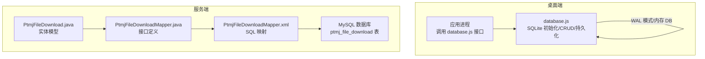
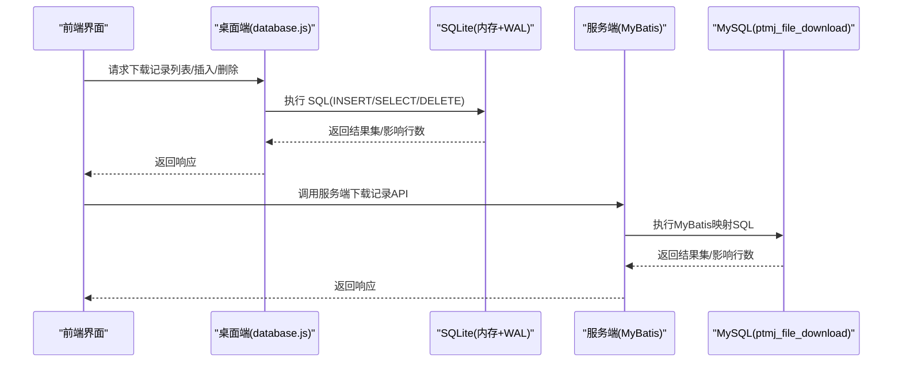
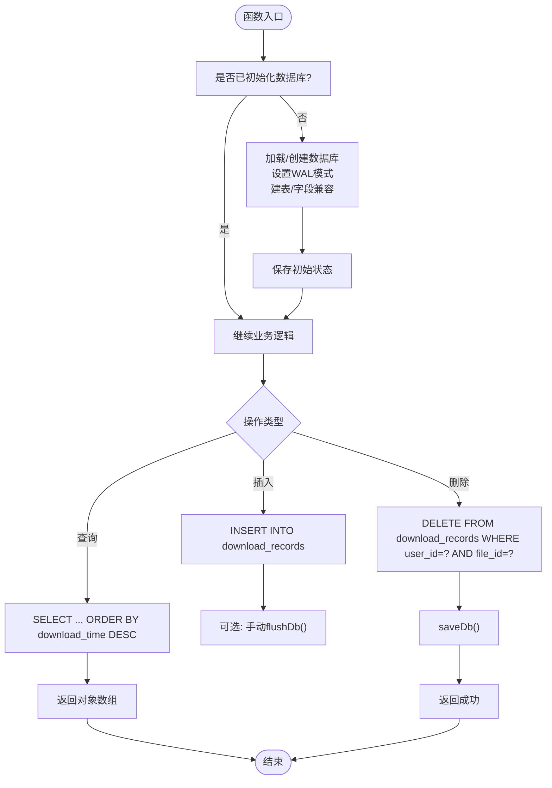
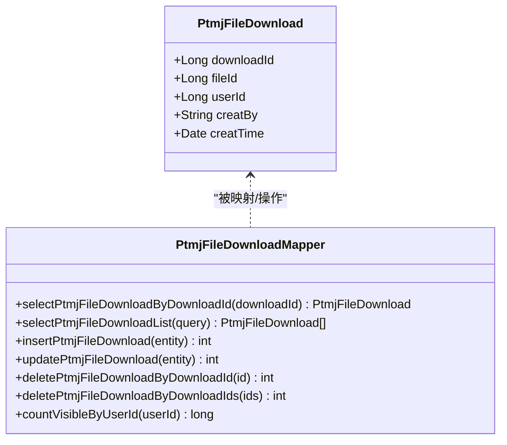
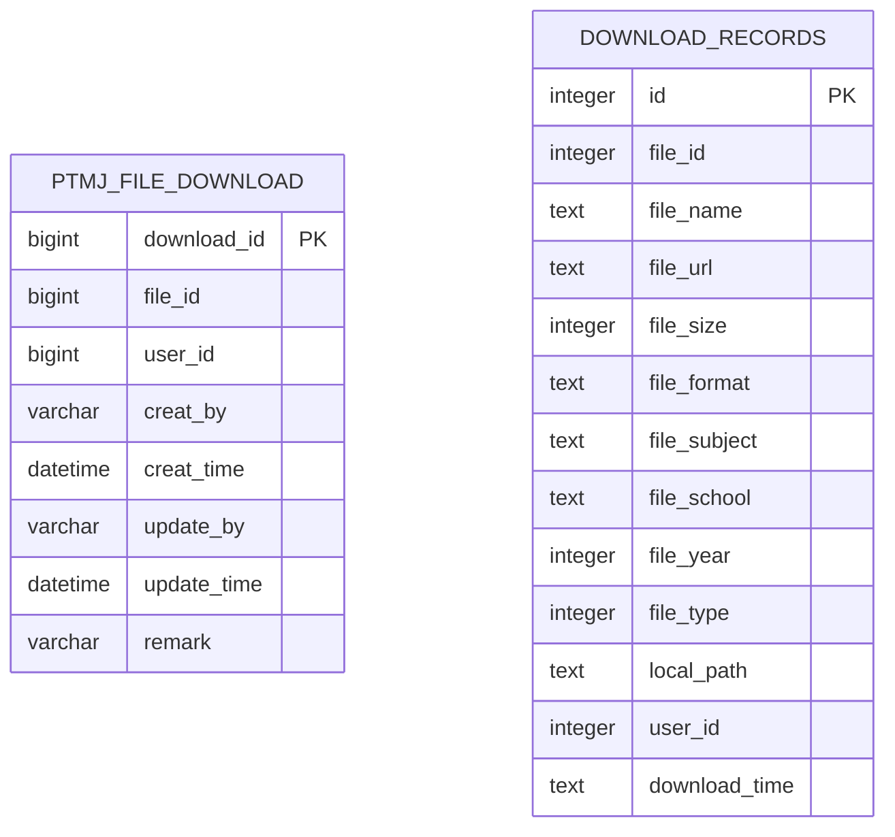
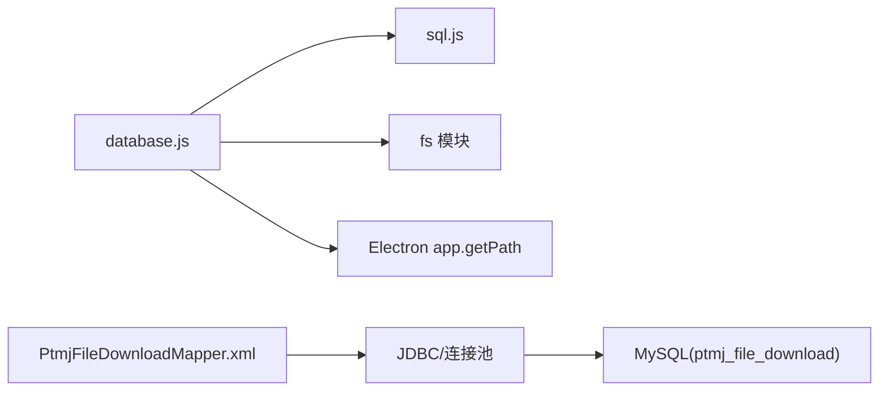

# 本地数据库管理

<cite>
**本文引用的文件**   
- [database.js](file://PezMax-Desktop/src/main/main-utils/database.js)
- [PtmjFileDownload.java](file://PezMax-Backend/ptmj-datum/src/main/java/com/ptmj/datum/domain/PtmjFileDownload.java)
- [PtmjFileDownloadMapper.java](file://PezMax-Backend/ptmj-datum/src/main/java/com/ptmj/datum/mapper/PtmjFileDownloadMapper.java)
- [PtmjFileDownloadMapper.xml](file://PezMax-Backend/ptmj-datum/src/main/resources/mapper/datum/PtmjFileDownloadMapper.xml)
- [pezmax.sql](file://PezMax-Backend/sql/pezmax.sql)
</cite>

## 目录
1. [引言](#引言)
2. [项目结构](#项目结构)
3. [核心组件](#核心组件)
4. [架构总览](#架构总览)
5. [详细组件分析](#详细组件分析)
6. [依赖分析](#依赖分析)
7. [性能考虑](#性能考虑)
8. [故障排查指南](#故障排查指南)
9. [结论](#结论)
10. [附录](#附录)

## 引言
本文件面向“本地数据库管理”主题，聚焦于桌面端 SQLite 集成方案与后端 MySQL 下载记录管理的整体设计。内容涵盖：
- SQLite 数据库初始化、表结构设计、连接与持久化管理
- 下载记录管理系统（插入、查询、删除、批量操作）
- 数据持久化策略（事务处理、数据同步、性能优化）
- 备份与恢复机制（导出、导入、版本迁移）
- 监控与调试工具（日志、性能分析、错误诊断）
- 数据模型定义与 API 接口文档（含使用示例与最佳实践）

## 项目结构
本项目包含两个与数据库相关的子系统：
- 桌面端（Electron）：基于 sql.js 的 SQLite 本地数据库，用于存储“下载记录”，提供增删查等能力，并在内存中维护数据库状态，按需持久化到磁盘。
- 服务端（Spring Boot + MyBatis + MySQL）：通过实体类、Mapper 接口与 XML 映射文件，对 ptmj_file_download 表进行 CRUD 与统计查询。

图表来源
- [database.js:1-177](file://PezMax-Desktop/src/main/main-utils/database.js#L1-L177)
- [PtmjFileDownload.java:1-102](file://PezMax-Backend/ptmj-datum/src/main/java/com/ptmj/datum/domain/PtmjFileDownload.java#L1-L102)
- [PtmjFileDownloadMapper.java:1-72](file://PezMax-Backend/ptmj-datum/src/main/java/com/ptmj/datum/mapper/PtmjFileDownloadMapper.java#L1-L72)
- [PtmjFileDownloadMapper.xml:1-88](file://PezMax-Backend/ptmj-datum/src/main/resources/mapper/datum/PtmjFileDownloadMapper.xml#L1-L88)
- [pezmax.sql:175-188](file://PezMax-Backend/sql/pezmax.sql#L175-L188)

章节来源
- [database.js:1-177](file://PezMax-Desktop/src/main/main-utils/database.js#L1-L177)
- [PtmjFileDownload.java:1-102](file://PezMax-Backend/ptmj-datum/src/main/java/com/ptmj/datum/domain/PtmjFileDownload.java#L1-L102)
- [PtmjFileDownloadMapper.java:1-72](file://PezMax-Backend/ptmj-datum/src/main/java/com/ptmj/datum/mapper/PtmjFileDownloadMapper.java#L1-L72)
- [PtmjFileDownloadMapper.xml:1-88](file://PezMax-Backend/ptmj-datum/src/main/resources/mapper/datum/PtmjFileDownloadMapper.xml#L1-L88)
- [pezmax.sql:175-188](file://PezMax-Backend/sql/pezmax.sql#L175-L188)

## 核心组件
- 桌面端 SQLite 模块（database.js）
  - 负责数据库初始化、表创建、字段兼容升级、WAL 模式设置、内存数据库加载/保存、下载记录的增删查、本地文件存在性检查、关闭连接等。
- 服务端下载记录模型与访问层
  - PtmjFileDownload.java：定义下载记录实体字段与序列化/格式化注解。
  - PtmjFileDownloadMapper.java：声明按主键查询、列表查询、新增、修改、删除、批量删除、可见记录计数等接口。
  - PtmjFileDownloadMapper.xml：实现上述接口的 SQL 映射，包括动态条件、批量删除与可见性统计。
- 数据库脚本（pezmax.sql）
  - 定义 ptmj_file_download 表结构与索引，作为服务端数据模型的依据。

章节来源
- [database.js:1-177](file://PezMax-Desktop/src/main/main-utils/database.js#L1-L177)
- [PtmjFileDownload.java:1-102](file://PezMax-Backend/ptmj-datum/src/main/java/com/ptmj/datum/domain/PtmjFileDownload.java#L1-L102)
- [PtmjFileDownloadMapper.java:1-72](file://PezMax-Backend/ptmj-datum/src/main/java/com/ptmj/datum/mapper/PtmjFileDownloadMapper.java#L1-L72)
- [PtmjFileDownloadMapper.xml:1-88](file://PezMax-Backend/ptmj-datum/src/main/resources/mapper/datum/PtmjFileDownloadMapper.xml#L1-L88)
- [pezmax.sql:175-188](file://PezMax-Backend/sql/pezmax.sql#L175-L188)

## 架构总览
下图展示了从前端调用到本地 SQLite 或后端 MySQL 的数据流路径，以及关键持久化点。

图表来源
- [database.js:87-147](file://PezMax-Desktop/src/main/main-utils/database.js#L87-L147)
- [PtmjFileDownloadMapper.xml:22-86](file://PezMax-Backend/ptmj-datum/src/main/resources/mapper/datum/PtmjFileDownloadMapper.xml#L22-L86)
- [pezmax.sql:175-188](file://PezMax-Backend/sql/pezmax.sql#L175-L188)

## 详细组件分析

### 桌面端 SQLite 模块（database.js）
- 初始化与连接管理
  - 首次获取数据库时，根据用户数据目录生成数据库文件路径；若文件存在则从文件加载，否则创建空库。
  - 启用 WAL 模式以提升并发读写性能。
  - 自动创建 download_records 表，并尝试为旧库添加新字段以实现向后兼容。
  - 提供显式 flushDb 方法在批量写入后一次性刷盘。
- 数据模型（download_records）
  - 字段包括：id、file_id、file_name、file_url、file_size、file_format、file_subject、file_school、file_year、file_type、local_path、user_id、download_time。
- 下载记录管理
  - 插入：insertDownloadRecord(record)，将记录写入内存数据库。
  - 查询：listDownloadRecords(userId)，支持按 user_id 过滤并按 file_id 去重保留最新一条，按时间倒序。
  - 删除：deleteDownloadRecord(userId, fileId)，按 user_id 和 file_id 删除匹配记录。
  - 单条查询：getRecordByFileId(userId, fileId)。
  - 本地文件存在性检查：checkLocalFileExists(filePath)。
- 持久化策略
  - 默认采用内存数据库，通过 saveDb() 将内存中的数据库导出为二进制并写回文件。
  - 在 closeDatabase() 时确保最终落盘。
  - 建议在批量写入后调用 flushDb() 减少频繁 I/O。

图表来源
- [database.js:9-56](file://PezMax-Desktop/src/main/main-utils/database.js#L9-L56)
- [database.js:87-147](file://PezMax-Desktop/src/main/main-utils/database.js#L87-L147)
- [database.js:58-73](file://PezMax-Desktop/src/main/main-utils/database.js#L58-L73)

章节来源
- [database.js:1-177](file://PezMax-Desktop/src/main/main-utils/database.js#L1-L177)

### 服务端下载记录模型与访问层
- 实体模型（PtmjFileDownload.java）
  - 字段：downloadId、fileId、userId、creatBy、creatTime，继承通用基类以包含审计字段。
- Mapper 接口（PtmjFileDownloadMapper.java）
  - 提供按主键查询、列表查询、新增、修改、删除、批量删除、可见记录计数（remark 不为 '0' 视为展示）。
- SQL 映射（PtmjFileDownloadMapper.xml）
  - 动态条件查询、批量删除、可见性统计 SQL 实现。
- 表结构（pezmax.sql）
  - ptmj_file_download 表包含 download_id、file_id、user_id、creat_by、creat_time、update_by、update_time、remark 等字段，主键为复合主键 (download_id, file_id, user_id)。

图表来源
- [PtmjFileDownload.java:1-102](file://PezMax-Backend/ptmj-datum/src/main/java/com/ptmj/datum/domain/PtmjFileDownload.java#L1-L102)
- [PtmjFileDownloadMapper.java:1-72](file://PezMax-Backend/ptmj-datum/src/main/java/com/ptmj/datum/mapper/PtmjFileDownloadMapper.java#L1-L72)
- [PtmjFileDownloadMapper.xml:1-88](file://PezMax-Backend/ptmj-datum/src/main/resources/mapper/datum/PtmjFileDownloadMapper.xml#L1-L88)
- [pezmax.sql:175-188](file://PezMax-Backend/sql/pezmax.sql#L175-L188)

章节来源
- [PtmjFileDownload.java:1-102](file://PezMax-Backend/ptmj-datum/src/main/java/com/ptmj/datum/domain/PtmjFileDownload.java#L1-L102)
- [PtmjFileDownloadMapper.java:1-72](file://PezMax-Backend/ptmj-datum/src/main/java/com/ptmj/datum/mapper/PtmjFileDownloadMapper.java#L1-L72)
- [PtmjFileDownloadMapper.xml:1-88](file://PezMax-Backend/ptmj-datum/src/main/resources/mapper/datum/PtmjFileDownloadMapper.xml#L1-L88)
- [pezmax.sql:175-188](file://PezMax-Backend/sql/pezmax.sql#L175-L188)

### 数据模型定义（ER 关系）
- 服务端表 ptmj_file_download 与实体 PtmjFileDownload 对应，字段一致。
- 桌面端表 download_records 独立于服务端表，用于本地缓存与快速检索。

图表来源
- [pezmax.sql:175-188](file://PezMax-Backend/sql/pezmax.sql#L175-L188)
- [database.js:27-43](file://PezMax-Desktop/src/main/main-utils/database.js#L27-L43)

## 依赖分析
- 桌面端
  - 依赖 Electron 的 app.getPath('userData') 定位数据库文件路径。
  - 依赖 sql.js 提供 SQLite 引擎与内存数据库能力。
  - 依赖 Node.js fs 模块进行文件读写。
- 服务端
  - 依赖 Spring Boot + MyBatis 框架。
  - 依赖 MySQL 数据库驱动与连接池（由框架配置管理）。
  - 依赖枚举与常量（如业务状态、分页等）来自公共模块。

图表来源
- [database.js:1-10](file://PezMax-Desktop/src/main/main-utils/database.js#L1-L10)
- [PtmjFileDownloadMapper.xml:1-88](file://PezMax-Backend/ptmj-datum/src/main/resources/mapper/datum/PtmjFileDownloadMapper.xml#L1-L88)

章节来源
- [database.js:1-10](file://PezMax-Desktop/src/main/main-utils/database.js#L1-L10)
- [PtmjFileDownloadMapper.xml:1-88](file://PezMax-Backend/ptmj-datum/src/main/resources/mapper/datum/PtmjFileDownloadMapper.xml#L1-L88)

## 性能考虑
- 桌面端 SQLite
  - 使用 WAL 模式提升并发读性能与降低锁竞争。
  - 批量写入后调用 flushDb() 减少多次 I/O 开销。
  - 查询时使用子查询按 file_id 分组取最大 id，避免全表扫描重复项。
- 服务端 MySQL
  - 合理索引：针对常用查询字段建立索引（例如 user_id、file_id、remark 等），可参考现有表结构并结合实际查询场景优化。
  - 动态 SQL 条件：利用 MyBatis 的动态标签减少无效条件拼接。
  - 分页与限制：大数据量查询应结合分页与 LIMIT 控制返回规模。

[本节为通用指导，不直接分析具体文件]

## 故障排查指南
- 桌面端
  - 数据库路径与权限：确认 userData 目录可写；若无法写入，检查文件系统权限。
  - WAL 模式异常：若出现 WAL 相关错误，检查数据库文件是否被其他进程占用。
  - 字段兼容问题：旧库缺少 file_school 字段时，模块会尝试 ALTER TABLE 添加；若失败需手动修复或重建库。
  - 持久化失败：saveDb() 抛出异常时，检查磁盘空间与路径有效性。
- 服务端
  - 连接池与事务：确认连接池配置正确，长事务可能导致锁等待。
  - SQL 语法与映射：核对 Mapper XML 字段映射与表结构一致性。
  - 可见性统计：countVisibleByUserId 使用 remark 判断展示状态，注意数据录入规范。

章节来源
- [database.js:45-53](file://PezMax-Desktop/src/main/main-utils/database.js#L45-L53)
- [database.js:58-73](file://PezMax-Desktop/src/main/main-utils/database.js#L58-L73)
- [PtmjFileDownloadMapper.xml:82-86](file://PezMax-Backend/ptmj-datum/src/main/resources/mapper/datum/PtmjFileDownloadMapper.xml#L82-L86)

## 结论
- 桌面端采用 sql.js 的 SQLite 内存数据库配合 WAL 模式，实现了轻量级本地下载记录管理，并通过显式持久化保证数据安全。
- 服务端通过 MyBatis 对 ptmj_file_download 表进行标准化 CRUD 与统计，具备良好的扩展性与可维护性。
- 建议在生产环境中完善索引策略、事务边界与错误处理，并对本地数据库增加定期备份与版本迁移流程。

[本节为总结性内容，不直接分析具体文件]

## 附录

### 桌面端 API 概览（database.js）
- 初始化与持久化
  - getDb(): 懒加载数据库实例，完成初始化与建表。
  - saveDb()/flushDb(): 将内存数据库导出并写入文件。
  - closeDatabase(): 关闭数据库并释放资源。
- 下载记录操作
  - insertDownloadRecord(record): 插入一条下载记录。
  - listDownloadRecords(userId): 查询下载记录（按 file_id 去重，保留最新一条，按时间倒序）。
  - deleteDownloadRecord(userId, fileId): 删除指定用户的某文件下载记录。
  - getRecordByFileId(userId, fileId): 按 file_id 查询记录。
  - checkLocalFileExists(filePath): 检查本地文件是否存在。

章节来源
- [database.js:9-56](file://PezMax-Desktop/src/main/main-utils/database.js#L9-L56)
- [database.js:87-166](file://PezMax-Desktop/src/main/main-utils/database.js#L87-L166)

### 服务端 API 概览（PtmjFileDownloadMapper）
- 查询
  - selectPtmjFileDownloadByDownloadId(downloadId)
  - selectPtmjFileDownloadList(query)
- 写入
  - insertPtmjFileDownload(entity)
  - updatePtmjFileDownload(entity)
- 删除
  - deletePtmjFileDownloadByDownloadId(id)
  - deletePtmjFileDownloadByDownloadIds(ids)
- 统计
  - countVisibleByUserId(userId)

章节来源
- [PtmjFileDownloadMapper.java:14-71](file://PezMax-Backend/ptmj-datum/src/main/java/com/ptmj/datum/mapper/PtmjFileDownloadMapper.java#L14-L71)
- [PtmjFileDownloadMapper.xml:22-86](file://PezMax-Backend/ptmj-datum/src/main/resources/mapper/datum/PtmjFileDownloadMapper.xml#L22-L86)

### 数据模型字段说明（服务端）
- 表名：ptmj_file_download
- 主要字段：download_id、file_id、user_id、creat_by、creat_time、update_by、update_time、remark
- 主键：(download_id, file_id, user_id)

章节来源
- [pezmax.sql:175-188](file://PezMax-Backend/sql/pezmax.sql#L175-L188)

### 数据模型字段说明（桌面端）
- 表名：download_records
- 主要字段：id、file_id、file_name、file_url、file_size、file_format、file_subject、file_school、file_year、file_type、local_path、user_id、download_time
- 主键：id（自增）

章节来源
- [database.js:27-43](file://PezMax-Desktop/src/main/main-utils/database.js#L27-L43)

### 使用示例与最佳实践
- 桌面端
  - 插入下载记录后，建议在批量写入完成后调用 flushDb() 以减少 I/O。
  - 查询时优先传入 userId 以缩小结果集范围。
  - 删除记录后如需立即生效，可再次调用 saveDb() 或 flushDb()。
- 服务端
  - 使用动态条件查询时，确保传入参数非空以避免无效 SQL。
  - 批量删除时，注意参数长度限制与事务边界。
  - 统计可见记录时，遵循 remark 约定（'0' 表示隐藏）。

[本节为通用指导，不直接分析具体文件]