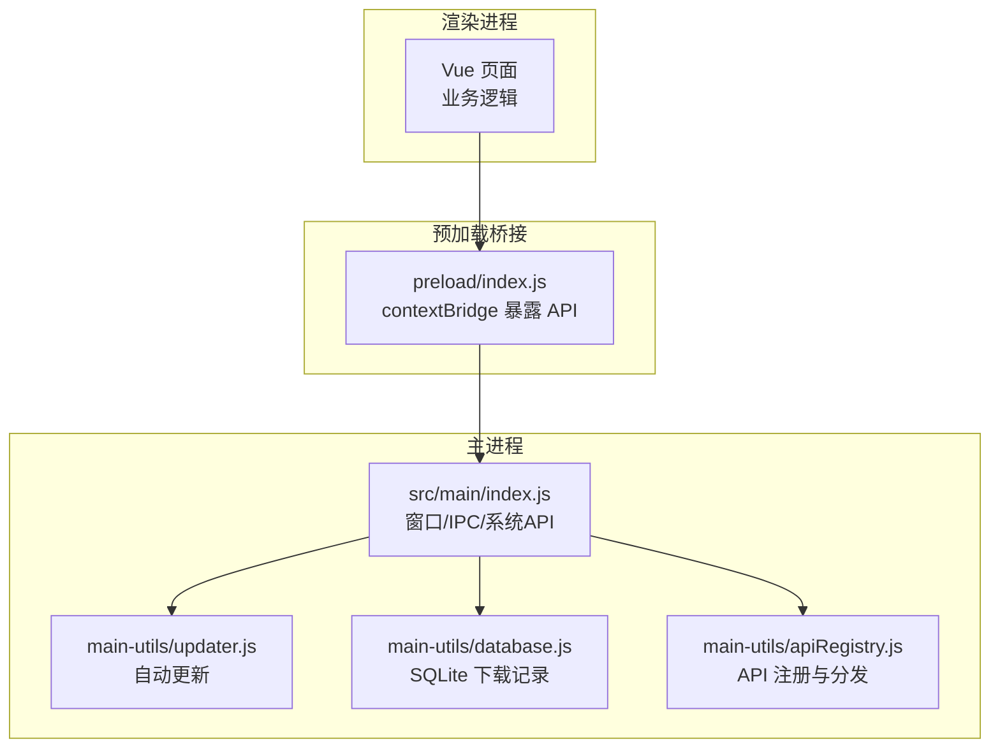
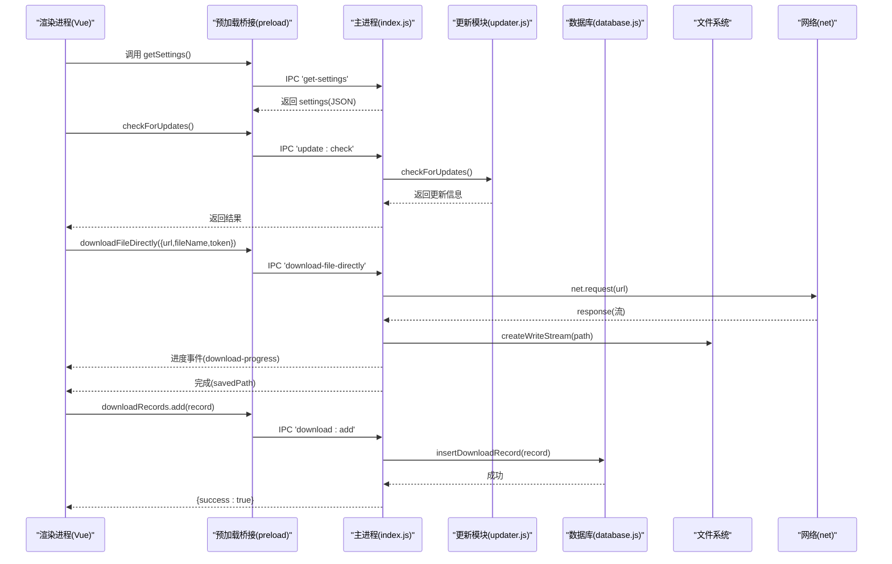
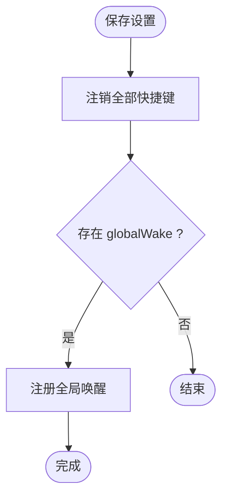
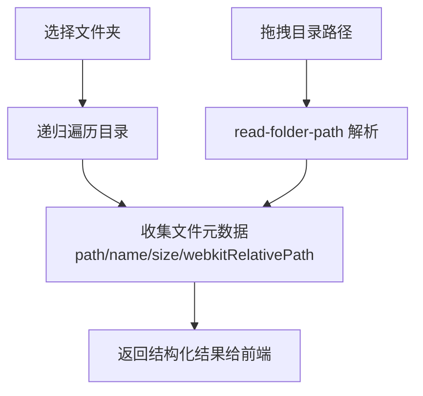
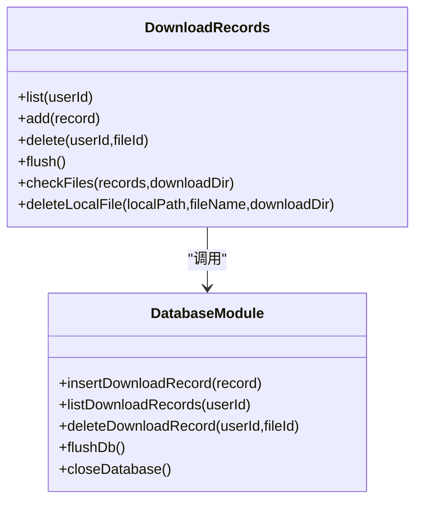
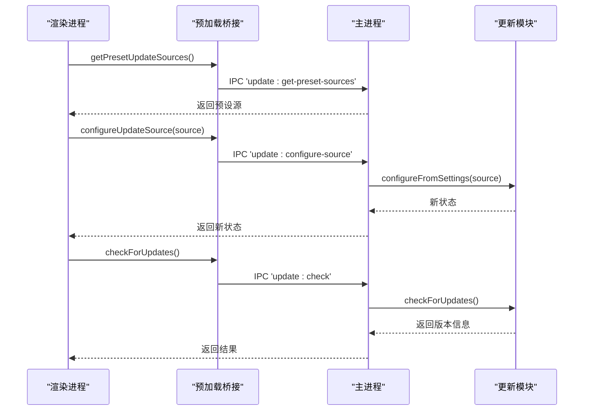
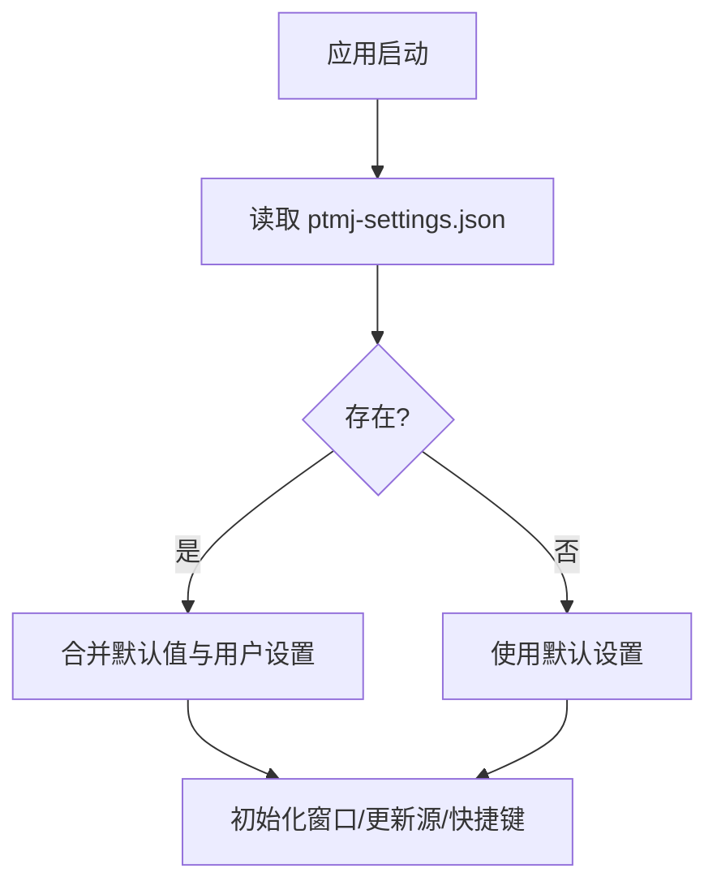
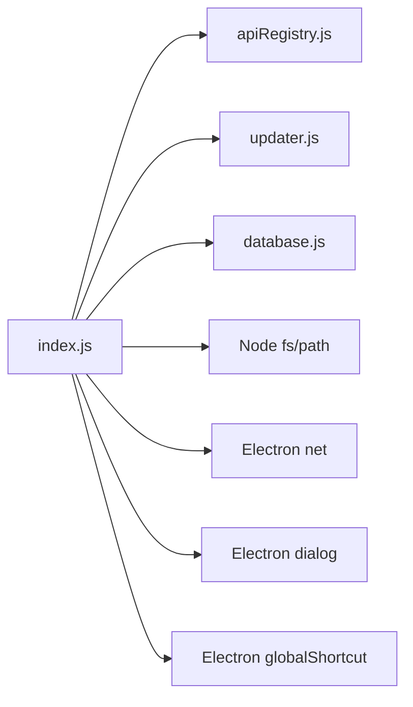

# 桌面系统集成

<cite>
**本文引用的文件**
- [PezMax-Desktop/README.md](file://PezMax-Desktop/README.md)
- [PezMax-Backend/README.md](file://PezMax-Backend/README.md)
- [src/main/index.js](file://PezMax-Desktop/src/main/index.js)
- [preload/index.js](file://PezMax-Desktop/src/preload/index.js)
- [main-utils/apiRegistry.js](file://PezMax-Desktop/src/main/main-utils/apiRegistry.js)
- [main-utils/database.js](file://PezMax-Desktop/src/main/main-utils/database.js)
- [main-utils/updater.js](file://PezMax-Desktop/src/main/main-utils/updater.js)
</cite>

## 目录
1. [简介](#简介)
2. [项目结构](#项目结构)
3. [核心组件](#核心组件)
4. [架构总览](#架构总览)
5. [详细组件分析](#详细组件分析)
6. [依赖关系分析](#依赖关系分析)
7. [性能考量](#性能考量)
8. [故障排查指南](#故障排查指南)
9. [结论](#结论)
10. [附录](#附录)

## 简介
本文件面向 PezMax 桌面应用（Electron + Vue）的系统集成功能，聚焦以下方面：
- 全局快捷键：注册、冲突处理与跨平台兼容
- 文件系统操作：文件选择对话框、批量上传、文件夹读取与拖拽支持
- 本地数据存储：SQLite 集成、下载记录管理与缓存策略
- 自动更新：版本检查、增量更新与回滚机制
- 通知系统：系统通知、托盘图标与后台任务处理
- 应用设置管理：配置持久化、默认值与用户偏好
- 最佳实践与常见问题

## 项目结构
桌面端采用 Electron 主进程 + 预加载桥接 + Vue 渲染进程的三层架构。主进程负责系统能力（窗口、IPC、文件系统、网络、更新、数据库），预加载层通过 contextBridge 暴露安全 API，渲染进程仅调用这些 API。

图表来源
- [src/main/index.js:1-120](file://PezMax-Desktop/src/main/index.js#L1-L120)
- [preload/index.js:1-65](file://PezMax-Desktop/src/preload/index.js#L1-L65)
- [main-utils/updater.js](file://PezMax-Desktop/src/main/main-utils/updater.js)
- [main-utils/database.js](file://PezMax-Desktop/src/main/main-utils/database.js)
- [main-utils/apiRegistry.js](file://PezMax-Desktop/src/main/main-utils/apiRegistry.js)

章节来源
- [PezMax-Desktop/README.md:80-94](file://PezMax-Desktop/README.md#L80-L94)

## 核心组件
- 全局快捷键：在主进程中基于 settings.shortcuts 动态注册，保存时即时生效；退出时统一注销。
- 文件系统：提供文件选择、文件夹递归读取、拖拽路径读取、静默/交互式保存、系统打开等能力。
- 本地存储：使用 SQLite 维护下载记录，支持增删查、批量刷盘与本地文件一致性校验。
- 自动更新：封装了获取信息、检查、下载、安装、更新源配置与快捷键状态保存恢复。
- 设置管理：JSON 持久化到 userData 目录，包含主题、背景、下载路径、快捷键、自启动等。
- IPC 网关：统一的 call-api 路由，结合 apiRegistry 实现模块化扩展。

章节来源
- [src/main/index.js:12-90](file://PezMax-Desktop/src/main/index.js#L12-L90)
- [src/main/index.js:354-382](file://PezMax-Desktop/src/main/index.js#L354-L382)
- [src/main/index.js:384-427](file://PezMax-Desktop/src/main/index.js#L384-L427)
- [src/main/index.js:434-513](file://PezMax-Desktop/src/main/index.js#L434-L513)
- [src/main/index.js:527-608](file://PezMax-Desktop/src/main/index.js#L527-L608)
- [src/main/index.js:667-787](file://PezMax-Desktop/src/main/index.js#L667-L787)
- [preload/index.js:14-56](file://PezMax-Desktop/src/preload/index.js#L14-L56)

## 架构总览
下图展示从渲染进程到主进程的系统级交互流程，涵盖设置、更新、文件与下载记录等关键路径。

图表来源
- [src/main/index.js:354-382](file://PezMax-Desktop/src/main/index.js#L354-L382)
- [src/main/index.js:527-608](file://PezMax-Desktop/src/main/index.js#L527-L608)
- [src/main/index.js:434-478](file://PezMax-Desktop/src/main/index.js#L434-L478)
- [preload/index.js:35-56](file://PezMax-Desktop/src/preload/index.js#L35-L56)

## 详细组件分析

### 全局快捷键
- 注册与刷新
  - 在保存设置后触发 registerGlobalShortcuts(settings, win)，先 unregisterAll 再按 settings.shortcuts 逐项注册。
  - 当前实现了“全局唤醒”快捷键，用于显示/隐藏并聚焦主窗口。
- 冲突处理
  - 通过 unregisterAll 避免重复注册；若系统拒绝注册（如被其他程序占用），捕获异常并记录日志，不影响应用运行。
- 跨平台兼容
  - 使用 CommandOrControl 修饰键以兼容 Windows/Linux 的 Ctrl 与 macOS 的 Cmd。
  - 建议为不同平台提供差异化默认值（可在 settings 中扩展）。
- 生命周期
  - will-quit 时统一注销所有快捷键，确保资源释放。

图表来源
- [src/main/index.js:48-68](file://PezMax-Desktop/src/main/index.js#L48-L68)
- [src/main/index.js:308-313](file://PezMax-Desktop/src/main/index.js#L308-L313)

章节来源
- [src/main/index.js:12-34](file://PezMax-Desktop/src/main/index.js#L12-L34)
- [src/main/index.js:48-68](file://PezMax-Desktop/src/main/index.js#L48-L68)
- [src/main/index.js:308-313](file://PezMax-Desktop/src/main/index.js#L308-L313)

### 文件系统操作
- 文件选择对话框
  - select-file：弹出单文件选择器，返回路径、文件名、大小与图片预览（Base64）。
- 批量上传与文件夹读取
  - select-folder：选择目录后递归扫描，生成扁平文件列表，每个条目包含物理路径、名称、大小与 webkitRelativePath（便于前端识别层级）。
  - read-folder-path：接收拖拽传入的目录路径，执行相同递归读取逻辑。
- 保存与静默下载
  - save-file：根据 settings.silentDownload 决定是否弹出保存对话框；若静默且文件已存在则自动重命名。
  - download-file-directly：使用 net.request 发起请求，将响应流直写到磁盘，支持进度回调与错误清理。
- 打开文件
  - open-path：调用系统默认程序打开指定文件。

图表来源
- [src/main/index.js:667-787](file://PezMax-Desktop/src/main/index.js#L667-L787)

章节来源
- [src/main/index.js:667-713](file://PezMax-Desktop/src/main/index.js#L667-L713)
- [src/main/index.js:715-787](file://PezMax-Desktop/src/main/index.js#L715-L787)
- [src/main/index.js:384-427](file://PezMax-Desktop/src/main/index.js#L384-L427)
- [src/main/index.js:527-608](file://PezMax-Desktop/src/main/index.js#L527-L608)
- [src/main/index.js:429-432](file://PezMax-Desktop/src/main/index.js#L429-L432)

### 本地数据存储（SQLite）与下载记录
- 能力清单
  - list/download/add/delete：查询、插入、删除下载记录。
  - flush：批量完成后一次性刷盘，降低频繁写入开销。
  - check-files：批量判断本地文件是否存在（支持 localPath 或 downloadDir+fileName 组合）。
  - delete-local-file：删除本地文件（与记录清理联动）。
- 设计要点
  - 非实时落盘：add 不立即 flush，由调用方在合适时机触发 flush，提升性能。
  - 健壮性：删除失败会记录日志但不中断整体流程。
- 与前端协作
  - preload 暴露 downloadRecords.* 方法，供渲染进程直接调用。

图表来源
- [src/main/index.js:434-513](file://PezMax-Desktop/src/main/index.js#L434-L513)
- [preload/index.js:48-56](file://PezMax-Desktop/src/preload/index.js#L48-L56)
- [main-utils/database.js](file://PezMax-Desktop/src/main/main-utils/database.js)

章节来源
- [src/main/index.js:434-513](file://PezMax-Desktop/src/main/index.js#L434-L513)
- [preload/index.js:48-56](file://PezMax-Desktop/src/preload/index.js#L48-L56)

### 自动更新系统
- 功能点
  - 获取更新信息、检查更新、下载更新、退出并安装。
  - 更新前保存快捷键状态，更新后恢复。
  - 支持预设更新源与用户自定义更新源配置。
- 与设置联动
  - 启动时根据 settings.updateSource 配置更新源。
  - 保存设置时同步更新源配置。
- 版本与缓存
  - 检测到版本变化时，清理 WebContents 缓存与部分 Storage Data（保留 localStorage 中的用户设置）。

图表来源
- [src/main/index.js:354-382](file://PezMax-Desktop/src/main/index.js#L354-L382)
- [preload/index.js:35-46](file://PezMax-Desktop/src/preload/index.js#L35-L46)
- [main-utils/updater.js](file://PezMax-Desktop/src/main/main-utils/updater.js)

章节来源
- [src/main/index.js:354-382](file://PezMax-Desktop/src/main/index.js#L354-L382)
- [src/main/index.js:95-119](file://PezMax-Desktop/src/main/index.js#L95-L119)
- [preload/index.js:35-46](file://PezMax-Desktop/src/preload/index.js#L35-L46)

### 通知系统与托盘图标
- 现状说明
  - 代码库中未发现托盘图标或系统通知的直接实现。
  - 可通过主进程引入 electron 的 Tray 与 Notification 模块进行扩展，并在需要时通过 IPC 向渲染进程推送状态。
- 建议方案
  - 在 app.whenReady 后创建托盘菜单，绑定常用动作（打开、设置、退出）。
  - 使用 systemNotification 发送下载完成、更新可用等提示。
  - 后台任务可使用 Node 定时器或外部任务调度，结合 SQLite 记录任务状态。

[本节为概念性内容，未直接分析具体源码文件]

### 应用设置管理
- 持久化位置
  - 位于 app.getPath('userData') 下的 ptmj-settings.json。
- 默认值与合并策略
  - 启动时加载 JSON，若不存在则返回 defaultSettings；存在则浅合并，保证新增字段有默认值。
- 关键项
  - autoStart：开机自启开关（调用 setLoginItemSettings）。
  - downloadPath：默认下载目录。
  - theme/accentColor/backgroundImage/backgroundOpacity/backgroundBlur：主题与背景。
  - shortcuts：全局快捷键映射。
  - updateSource：更新源配置对象。
  - silentDownload：是否静默下载。
- 变更生效
  - 保存设置后即时更新自启状态与全局快捷键。

图表来源
- [src/main/index.js:12-46](file://PezMax-Desktop/src/main/index.js#L12-L46)
- [src/main/index.js:70-90](file://PezMax-Desktop/src/main/index.js#L70-L90)

章节来源
- [src/main/index.js:12-46](file://PezMax-Desktop/src/main/index.js#L12-L46)
- [src/main/index.js:70-90](file://PezMax-Desktop/src/main/index.js#L70-L90)

## 依赖关系分析
- 模块耦合
  - index.js 作为主入口，集中处理 IPC、窗口、设置、更新、数据库与文件系统。
  - updater.js、database.js、apiRegistry.js 通过 require/import 被主进程按需使用，职责清晰。
- 外部依赖
  - Electron：app、BrowserWindow、ipcMain、globalShortcut、dialog、net、shell 等。
  - Node.js：fs、path、Buffer 等。
  - @electron-toolkit/utils：优化与工具函数。
- 潜在风险
  - 主进程承担较多职责，建议继续拆分至 main-utils 下独立模块，保持单一职责。
  - 全局快捷键注册需考虑多窗口场景，当前逻辑针对主窗口，后续可扩展为按窗口维度注册。

图表来源
- [src/main/index.js:1-10](file://PezMax-Desktop/src/main/index.js#L1-L10)
- [src/main/index.js:7-9](file://PezMax-Desktop/src/main/index.js#L7-L9)

章节来源
- [src/main/index.js:1-10](file://PezMax-Desktop/src/main/index.js#L1-L10)

## 性能考量
- 下载直写
  - 使用 net.request 流式写入磁盘，避免内存峰值，适合大文件。
- 批量刷盘
  - 下载记录采用 add 延迟 flush，减少 I/O 次数。
- 缓存清理
  - 版本升级时清理浏览器缓存与部分 Storage Data，但保留 localStorage，兼顾稳定性与用户体验。
- 窗口最小尺寸
  - 在 ready-to-show 后再次设置最小尺寸，防止打包环境失效。

章节来源
- [src/main/index.js:527-608](file://PezMax-Desktop/src/main/index.js#L527-L608)
- [src/main/index.js:469-478](file://PezMax-Desktop/src/main/index.js#L469-L478)
- [src/main/index.js:95-119](file://PezMax-Desktop/src/main/index.js#L95-L119)
- [src/main/index.js:244-249](file://PezMax-Desktop/src/main/index.js#L244-L249)

## 故障排查指南
- 全局快捷键无效
  - 检查是否被系统或其他应用占用；查看控制台错误日志；确认 settings.shortcuts.globalWake 配置正确。
- 下载失败
  - 检查服务器返回码与网络连通性；确认 token 是否正确；查看错误清理逻辑是否删除了残余文件。
- 本地文件缺失
  - 使用 download:check-files 批量校验；必要时调用 download:delete-local-file 清理后再重试。
- 设置未生效
  - 确认 save-settings 已触发；检查 settings.json 是否可写；验证 updateSource 配置格式。
- 更新不可用
  - 核对 updateSource 配置；检查网络可达性与签名校验；查看 update-status 事件回调。

章节来源
- [src/main/index.js:48-68](file://PezMax-Desktop/src/main/index.js#L48-L68)
- [src/main/index.js:527-608](file://PezMax-Desktop/src/main/index.js#L527-L608)
- [src/main/index.js:480-513](file://PezMax-Desktop/src/main/index.js#L480-L513)
- [src/main/index.js:354-382](file://PezMax-Desktop/src/main/index.js#L354-L382)

## 结论
本项目在桌面系统集成方面已形成较为完整的体系：通过主进程集中管理系统能力，预加载层提供安全桥接，渲染进程专注业务。全局快捷键、文件系统、本地存储、自动更新与设置管理等核心能力均已落地，具备良好扩展性。建议在后续迭代中进一步完善通知与托盘能力，并对主进程职责进行更细粒度的拆分，以提升可维护性与测试覆盖度。

## 附录
- 后端服务概览
  - 后端基于 Spring Boot，提供书签、文件、用户、通知等接口，配合 MinIO 对象存储与 MySQL/Redis 基础设施。
  - 端口与部署参考后端 README。

章节来源
- [PezMax-Backend/README.md:1-105](file://PezMax-Backend/README.md#L1-L105)