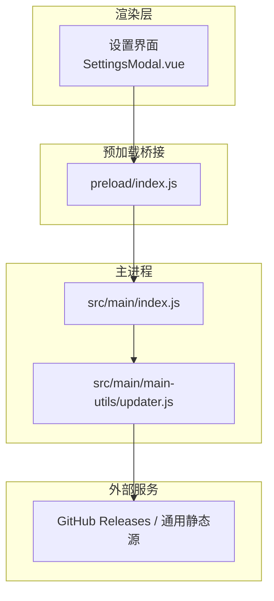
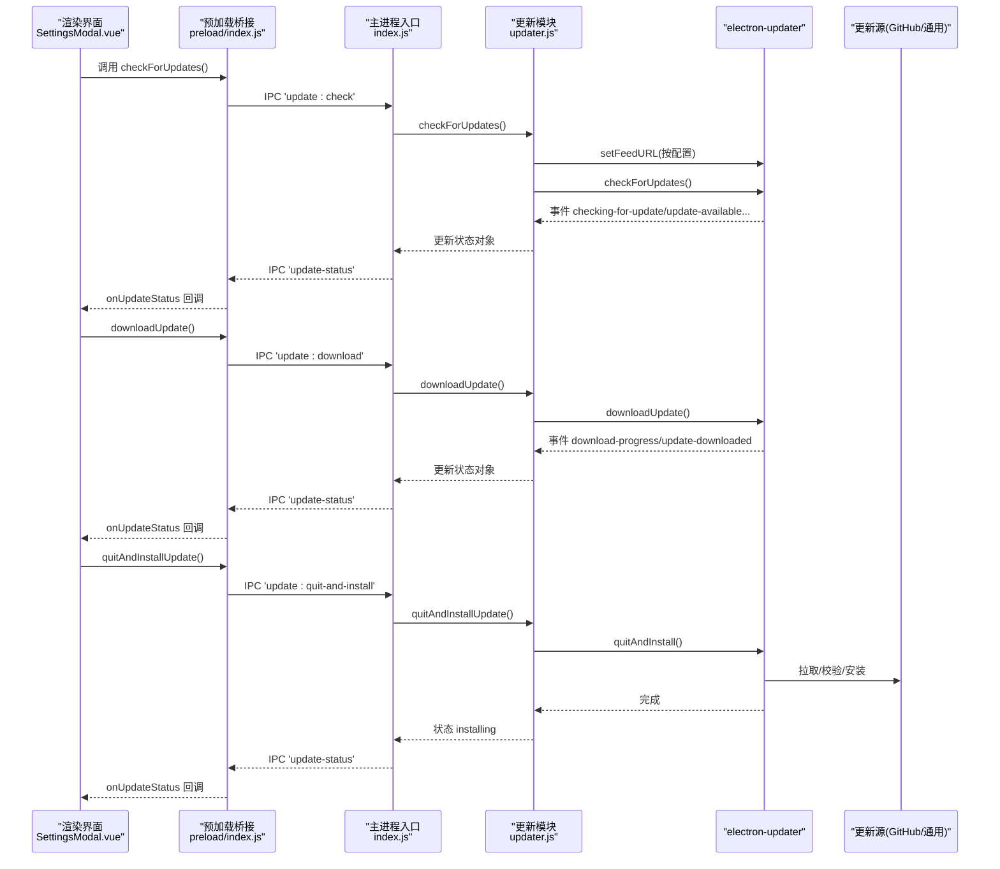
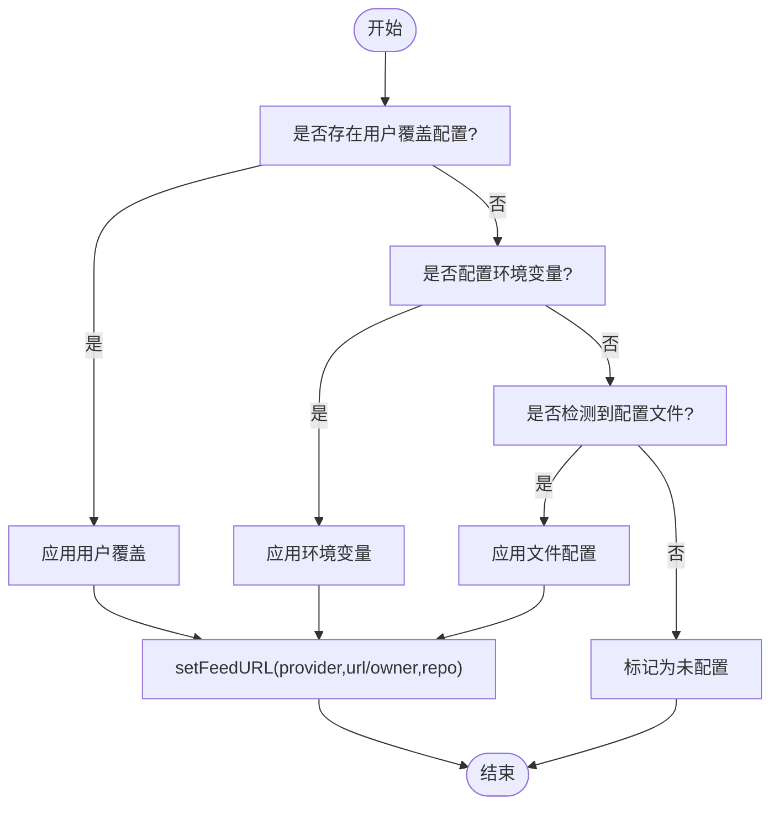
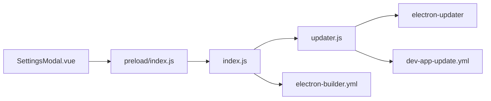

# 自动更新系统

<cite>
**本文引用的文件列表**
- [updater.js](file://PezMax-Desktop/src/main/main-utils/updater.js)
- [index.js](file://PezMax-Desktop/src/main/index.js)
- [preload/index.js](file://PezMax-Desktop/src/preload/index.js)
- [SettingsModal.vue](file://PezMax-Desktop/src/renderer/views/home/components/SettingsModal.vue)
- [dev-app-update.yml](file://PezMax-Desktop/dev-app-update.yml)
- [electron-builder.yml](file://PezMax-Desktop/electron-builder.yml)
</cite>

## 目录
1. [简介](#简介)
2. [项目结构](#项目结构)
3. [核心组件](#核心组件)
4. [架构总览](#架构总览)
5. [详细组件分析](#详细组件分析)
6. [依赖关系分析](#依赖关系分析)
7. [性能与增量更新](#性能与增量更新)
8. [安全策略](#安全策略)
9. [故障排查指南](#故障排查指南)
10. [结论](#结论)
11. [附录：完整流程示例（路径引用）](#附录完整流程示例路径引用)

## 简介
本文件面向 PezMax-Desktop 的自动更新子系统，系统性说明版本检查、更新源配置管理、下载与安装流程、状态管理与错误处理、以及安全与增量更新相关实现。文档同时提供可视化架构图与流程图，帮助读者快速理解从“选择更新源”到“静默安装并重启”的端到端流程。

## 项目结构
自动更新能力由主进程模块、预加载桥接、渲染界面设置页共同组成，并通过 electron-updater 完成实际的更新包获取与安装。关键文件职责如下：
- 主进程更新模块：负责解析更新源、注册事件、驱动下载与安装、维护状态并向渲染进程广播。
- 主进程入口：暴露 IPC 接口，将渲染层调用转发至更新模块；在应用启动时根据持久化设置同步更新源。
- 预加载桥接：向渲染进程暴露安全的 API，包括更新检查、下载、安装、状态监听等。
- 渲染设置页：提供预设更新源选择、自定义更新源配置、保存与生效逻辑。
- 构建与发布配置：定义打包产物、差分更新开关、发布目标地址等。

图表来源
- [index.js:371-382](file://PezMax-Desktop/src/main/index.js#L371-L382)
- [preload/index.js:35-46](file://PezMax-Desktop/src/preload/index.js#L35-L46)
- [updater.js:167-253](file://PezMax-Desktop/src/main/main-utils/updater.js#L167-L253)

章节来源
- [index.js:354-382](file://PezMax-Desktop/src/main/index.js#L354-L382)
- [preload/index.js:35-46](file://PezMax-Desktop/src/preload/index.js#L35-L46)
- [updater.js:119-204](file://PezMax-Desktop/src/main/main-utils/updater.js#L119-L204)

## 核心组件
- 更新源解析与优先级
  - 用户覆盖配置（最高优先）
  - 环境变量（PTMJ_UPDATE_PROVIDER/URL/GH_OWNER/GH_REPO）
  - 配置文件（app-update.yml、dev-app-update.yml、electron-builder.yml）
  - 未配置回退
- 内置预设更新源
  - GitHub 代理最新版本
  - GitHub 代理指定版本
  - GitHub 直连（owner/repo）
- 状态机与事件
  - idle/checking/available/not-available/downloading/downloaded/installing/error/unconfigured
  - 通过 IPC 向渲染进程推送 update-status
- 生命周期与窗口集成
  - 初始化时绑定窗口实例，统一派发状态
  - 更新完成后重建桌面快捷方式（Windows）

章节来源
- [updater.js:9-31](file://PezMax-Desktop/src/main/main-utils/updater.js#L9-L31)
- [updater.js:119-165](file://PezMax-Desktop/src/main/main-utils/updater.js#L119-L165)
- [updater.js:167-253](file://PezMax-Desktop/src/main/main-utils/updater.js#L167-L253)
- [updater.js:395-532](file://PezMax-Desktop/src/main/main-utils/updater.js#L395-L532)

## 架构总览
下图展示了从渲染层触发到主进程执行更新的完整链路，以及 electron-updater 与外部源的交互。

图表来源
- [index.js:371-382](file://PezMax-Desktop/src/main/index.js#L371-L382)
- [preload/index.js:35-46](file://PezMax-Desktop/src/preload/index.js#L35-L46)
- [updater.js:206-253](file://PezMax-Desktop/src/main/main-utils/updater.js#L206-L253)
- [updater.js:329-393](file://PezMax-Desktop/src/main/main-utils/updater.js#L329-L393)

## 详细组件分析

### 更新源配置管理
- 优先级顺序
  - 用户覆盖配置（通过设置界面选择或调用 configureFromSettings）
  - 环境变量（PTMJ_UPDATE_PROVIDER/URL/GH_OWNER/GH_REPO）
  - 配置文件（app-update.yml、dev-app-update.yml、electron-builder.yml）
  - 未配置
- 支持类型
  - generic：直接指向包含更新清单与包的静态 URL
  - github：owner/repo 组合，使用 GitHub Releases
- 预设更新源
  - gh-proxy-latest：GitHub 代理的最新版本目录
  - gh-proxy-v1：GitHub 代理的 v1.0.0 版本目录
  - github-direct：GitHub 直连 owner/repo
- 配置持久化
  - 渲染层 SettingsModal 中保存 settingsData.updateSource
  - 主进程 save-settings 时同步调用 configureFromSettings 以立即生效
  - 启动时 get-settings 若存在 updateSource 则自动恢复

图表来源
- [updater.js:119-165](file://PezMax-Desktop/src/main/main-utils/updater.js#L119-L165)
- [updater.js:172-204](file://PezMax-Desktop/src/main/main-utils/updater.js#L172-L204)
- [index.js:354-370](file://PezMax-Desktop/src/main/index.js#L354-L370)

章节来源
- [updater.js:9-31](file://PezMax-Desktop/src/main/main-utils/updater.js#L9-L31)
- [updater.js:119-165](file://PezMax-Desktop/src/main/main-utils/updater.js#L119-L165)
- [updater.js:270-310](file://PezMax-Desktop/src/main/main-utils/updater.js#L270-L310)
- [index.js:354-370](file://PezMax-Desktop/src/main/index.js#L354-L370)
- [SettingsModal.vue:630-688](file://PezMax-Desktop/src/renderer/views/home/components/SettingsModal.vue#L630-L688)

### 版本检查机制
- 远程版本获取
  - 通过 electron-updater 的 provider 与 feedTarget 定位更新清单与包
  - 支持 generic 与 github 两种 provider
- 版本比较算法
  - 由 electron-updater 内部实现，主进程仅接收 available/not-available 事件
- 更新通知
  - 主进程将状态对象通过 IPC 推送给渲染进程，渲染层可据此提示用户

章节来源
- [updater.js:189-204](file://PezMax-Desktop/src/main/main-utils/updater.js#L189-L204)
- [updater.js:210-231](file://PezMax-Desktop/src/main/main-utils/updater.js#L210-L231)
- [preload/index.js:35-46](file://PezMax-Desktop/src/preload/index.js#L35-L46)

### 增量更新实现
- 更新包下载
  - 主进程调用 autoUpdater.downloadUpdate()，并在 download-progress 事件中上报进度
- 完整性验证
  - 由 electron-updater 在下载阶段进行校验（具体算法由库实现）
- 静默安装
  - 设置 autoInstallOnAppQuit = true，调用 quitAndInstall() 后应用退出并完成安装
- 差分/增量更新
  - electron-builder 开启 differentialPackage: true，生成 .blockmap 用于增量更新

章节来源
- [updater.js:233-246](file://PezMax-Desktop/src/main/main-utils/updater.js#L233-L246)
- [updater.js:350-369](file://PezMax-Desktop/src/main/main-utils/updater.js#L350-L369)
- [updater.js:371-393](file://PezMax-Desktop/src/main/main-utils/updater.js#L371-L393)
- [electron-builder.yml:26-27](file://PezMax-Desktop/electron-builder.yml#L26-L27)

### 更新状态管理
- 状态字段
  - currentVersion、configured、provider、feedTarget、status、latestVersion、progress、message
- 进度跟踪
  - download-progress 事件映射为百分比进度
- 错误处理
  - error 事件统一捕获并写入 message，渲染层展示
- 回滚机制
  - 当前未实现显式回滚；如安装失败，建议保留旧版本安装包并引导用户重新安装

章节来源
- [updater.js:33-42](file://PezMax-Desktop/src/main/main-utils/updater.js#L33-L42)
- [updater.js:248-253](file://PezMax-Desktop/src/main/main-utils/updater.js#L248-L253)

### 更新安全策略
- HTTPS 强制
  - 默认使用 https 协议访问更新源
- 签名验证
  - 由 electron-updater 在平台层面进行签名校验（例如 Windows 代码签名），主进程不直接参与
- 安全传输
  - 通过 HTTPS 与受信任的更新源通信，避免中间人攻击

章节来源
- [updater.js:16-30](file://PezMax-Desktop/src/main/main-utils/updater.js#L16-L30)
- [updater.js:189-204](file://PezMax-Desktop/src/main/main-utils/updater.js#L189-L204)

### 桌面快捷方式管理（Windows）
- 更新前保存状态
  - 检测桌面快捷方式是否存在并记录到 userData 下的 JSON 文件
- 删除旧快捷方式
  - 清理用户桌面与公共桌面的旧 .lnk
- 创建新快捷方式
  - 使用 PowerShell 创建指向当前可执行文件的快捷方式
- 启动后重建
  - 读取之前保存的状态，若更新前存在快捷方式则重建，并清理状态文件

章节来源
- [updater.js:395-532](file://PezMax-Desktop/src/main/main-utils/updater.js#L395-L532)

## 依赖关系分析
- 模块耦合
  - index.js 作为 IPC 路由，低耦合地调用 updater.js 提供的函数
  - preload/index.js 仅暴露必要 API，保持渲染层与主进程的边界清晰
- 外部依赖
  - electron-updater：负责更新清单解析、下载、校验与安装
  - electron-builder：负责构建产物与差分更新元数据生成
- 潜在循环依赖
  - 无直接循环依赖；IPC 单向调用，事件单向广播

图表来源
- [index.js:371-382](file://PezMax-Desktop/src/main/index.js#L371-L382)
- [preload/index.js:35-46](file://PezMax-Desktop/src/preload/index.js#L35-L46)
- [updater.js:119-204](file://PezMax-Desktop/src/main/main-utils/updater.js#L119-L204)
- [electron-builder.yml:1-68](file://PezMax-Desktop/electron-builder.yml#L1-L68)
- [dev-app-update.yml:1-7](file://PezMax-Desktop/dev-app-update.yml#L1-L7)

章节来源
- [index.js:371-382](file://PezMax-Desktop/src/main/index.js#L371-L382)
- [preload/index.js:35-46](file://PezMax-Desktop/src/preload/index.js#L35-L46)
- [updater.js:119-204](file://PezMax-Desktop/src/main/main-utils/updater.js#L119-L204)

## 性能与增量更新
- 增量更新
  - 通过 electron-builder 的 differentialPackage: true 启用差分包，减少下载体积
- 下载优化
  - 使用 electron-updater 的流式下载与缓存目录（updaterCacheDirName）
- 状态刷新频率
  - 仅在关键事件（检查、下载进度、完成、错误）推送状态，避免频繁 IPC 开销

章节来源
- [electron-builder.yml:26-27](file://PezMax-Desktop/electron-builder.yml#L26-L27)
- [dev-app-update.yml:6](file://PezMax-Desktop/dev-app-update.yml#L6)
- [updater.js:233-246](file://PezMax-Desktop/src/main/main-utils/updater.js#L233-L246)

## 安全策略
- 传输安全
  - 默认使用 HTTPS 访问更新源
- 签名校验
  - 由 electron-updater 在平台侧执行签名验证
- 配置可信性
  - 支持从环境变量与配置文件注入更新源，但需确保来源可信

章节来源
- [updater.js:16-30](file://PezMax-Desktop/src/main/main-utils/updater.js#L16-L30)
- [updater.js:189-204](file://PezMax-Desktop/src/main/main-utils/updater.js#L189-L204)

## 故障排查指南
- 开发环境无法检查更新
  - 现象：提示“开发环境不支持检查更新”
  - 原因：app.isPackaged === false 时禁用检查
  - 解决：使用打包版本测试
- 未检测到有效更新源
  - 现象：状态为 unconfigured
  - 排查：确认环境变量或配置文件是否包含有效的 provider/url/owner/repo
- 下载失败或网络错误
  - 现象：error 事件携带消息
  - 排查：检查网络连通性与更新源可达性
- 安装失败
  - 现象：quitAndInstall 抛出异常
  - 排查：查看日志中的错误信息，必要时保留旧安装包手动安装

章节来源
- [updater.js:339-347](file://PezMax-Desktop/src/main/main-utils/updater.js#L339-L347)
- [updater.js:359-368](file://PezMax-Desktop/src/main/main-utils/updater.js#L359-L368)
- [updater.js:248-253](file://PezMax-Desktop/src/main/main-utils/updater.js#L248-L253)
- [updater.js:371-393](file://PezMax-Desktop/src/main/main-utils/updater.js#L371-L393)

## 结论
该自动更新系统基于 electron-updater 实现了稳定的版本检查、下载与安装流程，结合 electron-builder 的差分更新能力提升了效率。通过多层级的更新源解析与用户覆盖机制，系统具备良好的灵活性与可运维性。建议在后续迭代中补充显式的回滚策略与更细粒度的错误码，以提升用户体验与可观测性。

## 附录：完整流程示例（路径引用）
以下给出端到端的实现路径参考，便于快速落地：
- 配置更新源
  - 渲染层选择预设或自定义配置并保存到 settings
    - [SettingsModal.vue:630-688](file://PezMax-Desktop/src/renderer/views/home/components/SettingsModal.vue#L630-L688)
  - 主进程保存设置并同步更新源
    - [index.js:364-370](file://PezMax-Desktop/src/main/index.js#L364-L370)
  - 更新模块应用配置并设置 feed
    - [updater.js:270-310](file://PezMax-Desktop/src/main/main-utils/updater.js#L270-L310)
    - [updater.js:172-204](file://PezMax-Desktop/src/main/main-utils/updater.js#L172-L204)
- 检查更新
  - 渲染层调用检查接口
    - [preload/index.js:35-36](file://PezMax-Desktop/src/preload/index.js#L35-L36)
  - 主进程路由到更新模块
    - [index.js:371-372](file://PezMax-Desktop/src/main/index.js#L371-L372)
  - 更新模块执行检查并推送状态
    - [updater.js:329-347](file://PezMax-Desktop/src/main/main-utils/updater.js#L329-L347)
    - [updater.js:210-231](file://PezMax-Desktop/src/main/main-utils/updater.js#L210-L231)
- 下载安装
  - 渲染层触发下载
    - [preload/index.js:36-37](file://PezMax-Desktop/src/preload/index.js#L36-L37)
  - 主进程执行下载并上报进度
    - [index.js:372-373](file://PezMax-Desktop/src/main/index.js#L372-L373)
    - [updater.js:350-369](file://PezMax-Desktop/src/main/main-utils/updater.js#L350-L369)
    - [updater.js:233-246](file://PezMax-Desktop/src/main/main-utils/updater.js#L233-L246)
- 重启安装
  - 渲染层请求安装
    - [preload/index.js:37-38](file://PezMax-Desktop/src/preload/index.js#L37-L38)
  - 主进程执行安装并进入 installing 状态
    - [index.js:373-374](file://PezMax-Desktop/src/main/index.js#L373-L374)
    - [updater.js:371-393](file://PezMax-Desktop/src/main/main-utils/updater.js#L371-L393)