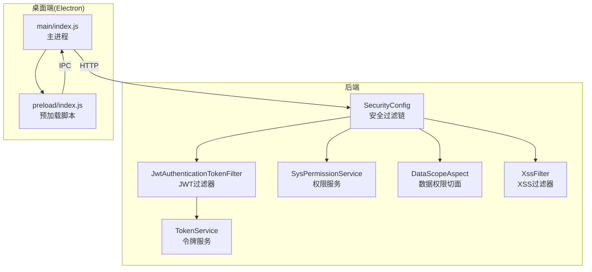
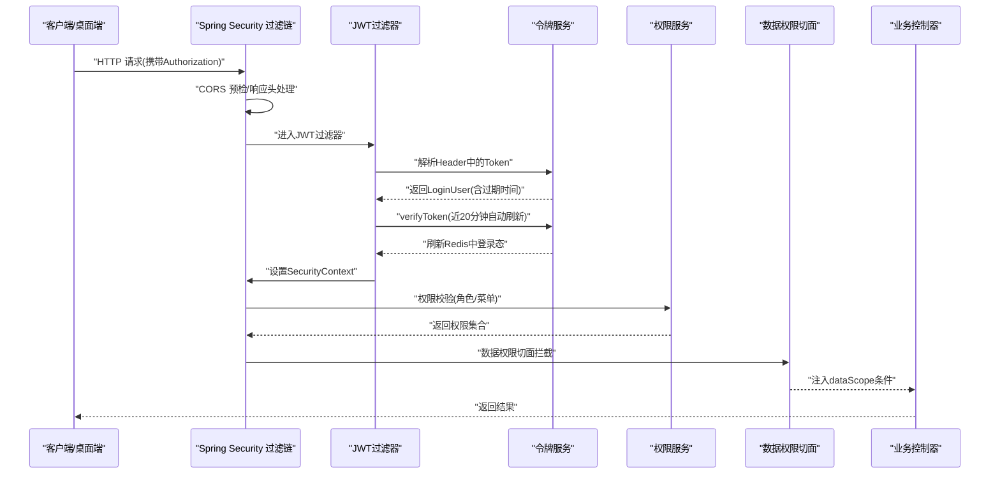
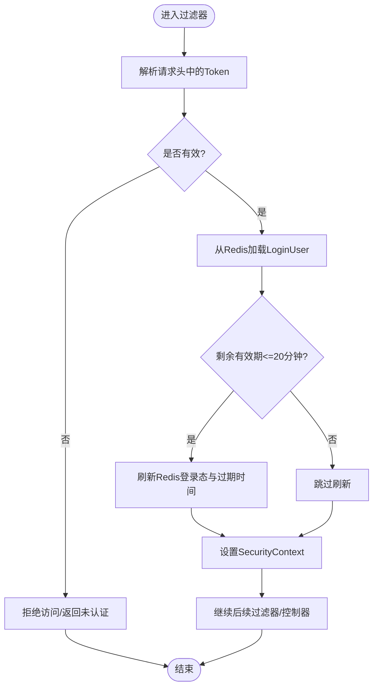
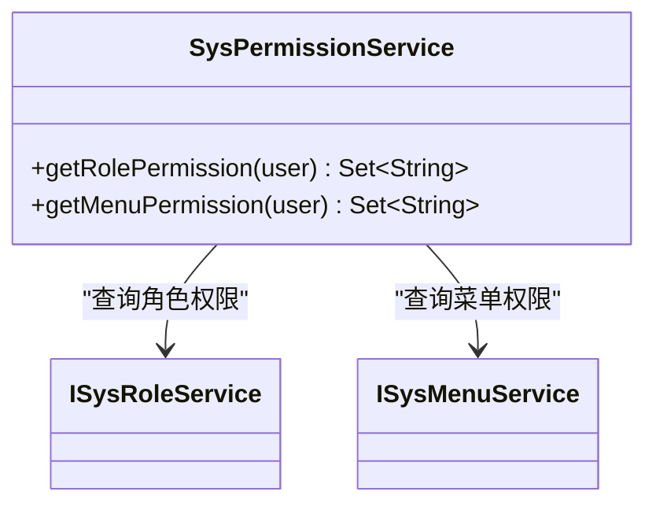
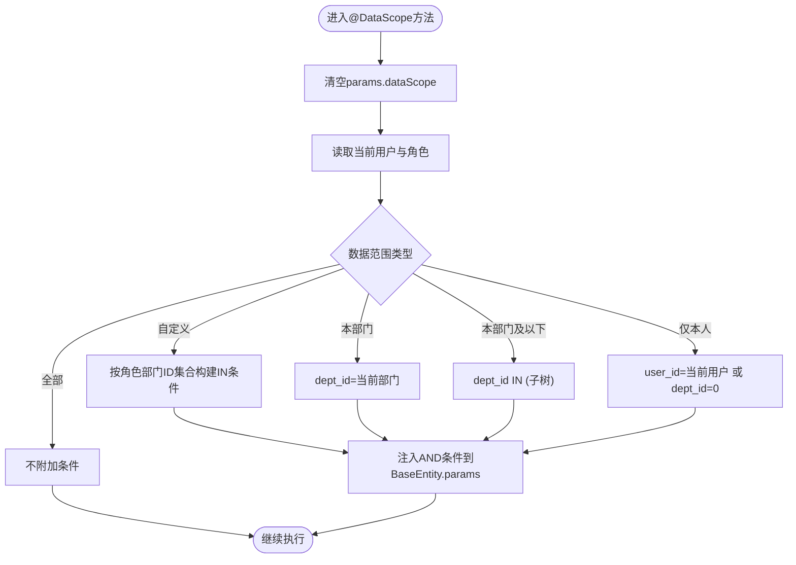
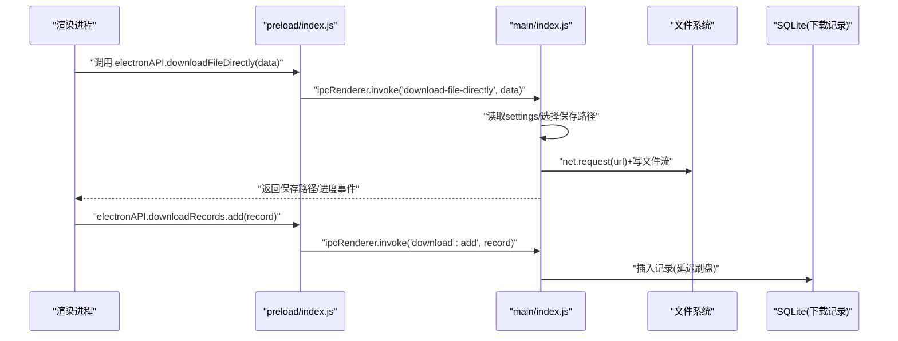
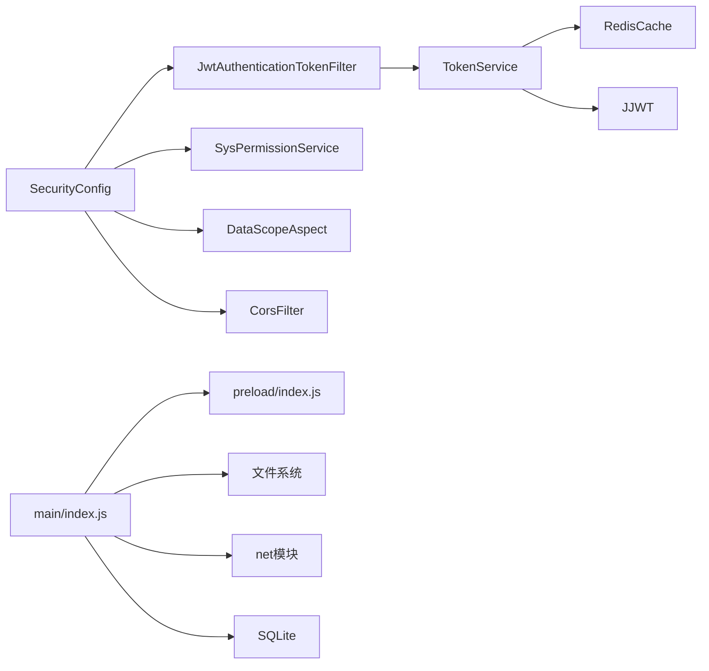

# 安全架构

<cite>
**本文引用的文件**   
- [SecurityConfig.java](file://PezMax-Backend/ruoyi-framework/src/main/java/com/ruoyi/framework/config/SecurityConfig.java)
- [JwtAuthenticationTokenFilter.java](file://PezMax-Backend/ruoyi-framework/src/main/java/com/ruoyi/framework/security/filter/JwtAuthenticationTokenFilter.java)
- [TokenService.java](file://PezMax-Backend/ruoyi-framework/src/main/java/com/ruoyi/framework/web/service/TokenService.java)
- [SysPermissionService.java](file://PezMax-Backend/ruoyi-framework/src/main/java/com/ruoyi/framework/web/service/SysPermissionService.java)
- [DataScopeAspect.java](file://PezMax-Backend/ruoyi-framework/src/main/java/com/ruoyi/framework/aspectj/DataScopeAspect.java)
- [XssFilter.java](file://PezMax-Backend/ruoyi-common/src/main/java/com/ruoyi/common/filter/XssFilter.java)
- [index.js](file://PezMax-Desktop/src/main/index.js)
- [preload/index.js](file://PezMax-Desktop/src/preload/index.js)
</cite>

## 目录
1. [简介](#简介)
2. [项目结构](#项目结构)
3. [核心组件](#核心组件)
4. [架构总览](#架构总览)
5. [详细组件分析](#详细组件分析)
6. [依赖关系分析](#依赖关系分析)
7. [性能与安全权衡](#性能与安全权衡)
8. [故障排查指南](#故障排查指南)
9. [结论](#结论)
10. [附录](#附录)

## 简介
本文件面向 PezMax-One 系统的安全架构，聚焦以下方面：
- 基于 JWT 的无状态认证：令牌生成、校验、刷新与过期策略
- 基于角色的访问控制（RBAC）：角色管理、权限验证、数据权限控制
- 网络安全防护：跨域配置、XSS 防护、SQL 注入防护、CSRF 防护
- 桌面应用安全设计：IPC 通信安全、本地数据存储、文件访问控制
- 安全配置最佳实践、漏洞防护、审计日志与运维安全
- 安全测试方法与常见问题解决方案

## 项目结构
后端采用 Spring Security + JWT 实现无状态鉴权；前端与桌面端通过 HTTP 调用后端接口。桌面端使用 Electron，主进程通过 IPC 暴露受限能力给渲染进程。

图表来源
- [SecurityConfig.java:86-120](file://PezMax-Backend/ruoyi-framework/src/main/java/com/ruoyi/framework/config/SecurityConfig.java#L86-L120)
- [JwtAuthenticationTokenFilter.java:31-43](file://PezMax-Backend/ruoyi-framework/src/main/java/com/ruoyi/framework/security/filter/JwtAuthenticationTokenFilter.java#L31-L43)
- [TokenService.java:114-184](file://PezMax-Backend/ruoyi-framework/src/main/java/com/ruoyi/framework/web/service/TokenService.java#L114-L184)
- [SysPermissionService.java:37-88](file://PezMax-Backend/ruoyi-framework/src/main/java/com/ruoyi/framework/web/service/SysPermissionService.java#L37-L88)
- [DataScopeAspect.java:59-80](file://PezMax-Backend/ruoyi-framework/src/main/java/com/ruoyi/framework/aspectj/DataScopeAspect.java#L59-L80)
- [XssFilter.java:44-56](file://PezMax-Backend/ruoyi-common/src/main/java/com/ruoyi/common/filter/XssFilter.java#L44-L56)
- [index.js:233-242](file://PezMax-Desktop/src/main/index.js#L233-L242)
- [preload/index.js:10-17](file://PezMax-Desktop/src/preload/index.js#L10-L17)

章节来源
- [SecurityConfig.java:86-120](file://PezMax-Backend/ruoyi-framework/src/main/java/com/ruoyi/framework/config/SecurityConfig.java#L86-L120)
- [index.js:233-242](file://PezMax-Desktop/src/main/index.js#L233-L242)

## 核心组件
- 安全过滤链与匿名白名单：统一入口，禁用 CSRF，声明式方法级安全，注册 JWT 与 CORS 过滤器，配置匿名访问路径。
- JWT 过滤器：从请求头解析 Token，提取用户上下文并写入安全上下文。
- 令牌服务：负责创建、解析、刷新、删除 Token，以及将登录态缓存到 Redis。
- 权限服务：根据用户角色计算角色权限与菜单权限集合。
- 数据权限切面：按角色数据范围动态拼接 SQL 条件，限制查询范围。
- XSS 过滤器：对非 GET/DELETE 请求进行参数清洗，支持排除列表。
- 桌面端 IPC：通过 preload 暴露最小 API 集，主进程集中处理敏感操作（文件系统、下载、更新等）。

章节来源
- [SecurityConfig.java:86-120](file://PezMax-Backend/ruoyi-framework/src/main/java/com/ruoyi/framework/config/SecurityConfig.java#L86-L120)
- [JwtAuthenticationTokenFilter.java:31-43](file://PezMax-Backend/ruoyi-framework/src/main/java/com/ruoyi/framework/security/filter/JwtAuthenticationTokenFilter.java#L31-L43)
- [TokenService.java:114-184](file://PezMax-Backend/ruoyi-framework/src/main/java/com/ruoyi/framework/web/service/TokenService.java#L114-L184)
- [SysPermissionService.java:37-88](file://PezMax-Backend/ruoyi-framework/src/main/java/com/ruoyi/framework/web/service/SysPermissionService.java#L37-L88)
- [DataScopeAspect.java:59-80](file://PezMax-Backend/ruoyi-framework/src/main/java/com/ruoyi/framework/aspectj/DataScopeAspect.java#L59-L80)
- [XssFilter.java:44-56](file://PezMax-Backend/ruoyi-common/src/main/java/com/ruoyi/common/filter/XssFilter.java#L44-L56)
- [preload/index.js:10-17](file://PezMax-Desktop/src/preload/index.js#L10-L17)

## 架构总览
下图展示一次受保护接口的完整调用链路，包括跨域、JWT 校验、权限与数据权限控制。

图表来源
- [SecurityConfig.java:86-120](file://PezMax-Backend/ruoyi-framework/src/main/java/com/ruoyi/framework/config/SecurityConfig.java#L86-L120)
- [JwtAuthenticationTokenFilter.java:31-43](file://PezMax-Backend/ruoyi-framework/src/main/java/com/ruoyi/framework/security/filter/JwtAuthenticationTokenFilter.java#L31-L43)
- [TokenService.java:133-155](file://PezMax-Backend/ruoyi-framework/src/main/java/com/ruoyi/framework/web/service/TokenService.java#L133-L155)
- [SysPermissionService.java:37-88](file://PezMax-Backend/ruoyi-framework/src/main/java/com/ruoyi/framework/web/service/SysPermissionService.java#L37-L88)
- [DataScopeAspect.java:59-80](file://PezMax-Backend/ruoyi-framework/src/main/java/com/ruoyi/framework/aspectj/DataScopeAspect.java#L59-L80)

## 详细组件分析

### 基于 JWT 的无状态认证
- 令牌生成：在登录成功后由令牌服务生成唯一 token，并将用户信息（含过期时间）写入 Redis；同时签发包含必要声明的 JWT。
- 令牌校验：每次请求经 JWT 过滤器解析 Header 中的 Bearer Token，从 Redis 获取 LoginUser 并写入安全上下文。
- 令牌刷新：当剩余有效期小于阈值时，自动刷新 Redis 中的登录态与过期时间，保持会话活跃。
- 过期处理：若解析失败或 Redis 中不存在登录态，则拒绝访问；登出时删除 Redis 对应键值。

图表来源
- [JwtAuthenticationTokenFilter.java:31-43](file://PezMax-Backend/ruoyi-framework/src/main/java/com/ruoyi/framework/security/filter/JwtAuthenticationTokenFilter.java#L31-L43)
- [TokenService.java:133-155](file://PezMax-Backend/ruoyi-framework/src/main/java/com/ruoyi/framework/web/service/TokenService.java#L133-L155)
- [TokenService.java:114-125](file://PezMax-Backend/ruoyi-framework/src/main/java/com/ruoyi/framework/web/service/TokenService.java#L114-L125)
- [TokenService.java:192-198](file://PezMax-Backend/ruoyi-framework/src/main/java/com/ruoyi/framework/web/service/TokenService.java#L192-L198)

章节来源
- [JwtAuthenticationTokenFilter.java:31-43](file://PezMax-Backend/ruoyi-framework/src/main/java/com/ruoyi/framework/security/filter/JwtAuthenticationTokenFilter.java#L31-L43)
- [TokenService.java:114-184](file://PezMax-Backend/ruoyi-framework/src/main/java/com/ruoyi/framework/web/service/TokenService.java#L114-L184)

### 基于角色的访问控制（RBAC）
- 角色权限：根据用户角色集合计算角色权限集合；管理员拥有全部权限。
- 菜单权限：根据角色关联的菜单权限计算可访问资源标识集合，用于前端路由与按钮级控制。
- 注解授权：启用方法级安全注解，可在控制器方法上声明所需角色/权限。

图表来源
- [SysPermissionService.java:37-88](file://PezMax-Backend/ruoyi-framework/src/main/java/com/ruoyi/framework/web/service/SysPermissionService.java#L37-L88)

章节来源
- [SysPermissionService.java:37-88](file://PezMax-Backend/ruoyi-framework/src/main/java/com/ruoyi/framework/web/service/SysPermissionService.java#L37-L88)
- [SecurityConfig.java:27-27](file://PezMax-Backend/ruoyi-framework/src/main/java/com/ruoyi/framework/config/SecurityConfig.java#L27-L27)

### 数据权限控制
- 数据范围类型：全部、自定义、本部门、本部门及以下、仅本人。
- 切面实现：在方法执行前读取当前用户角色与数据范围，动态拼装 SQL 条件并注入到查询参数中。
- 防注入：在进入切面前清空 dataScope 参数，避免被篡改。

图表来源
- [DataScopeAspect.java:59-80](file://PezMax-Backend/ruoyi-framework/src/main/java/com/ruoyi/framework/aspectj/DataScopeAspect.java#L59-L80)
- [DataScopeAspect.java:91-170](file://PezMax-Backend/ruoyi-framework/src/main/java/com/ruoyi/framework/aspectj/DataScopeAspect.java#L91-L170)
- [DataScopeAspect.java:175-183](file://PezMax-Backend/ruoyi-framework/src/main/java/com/ruoyi/framework/aspectj/DataScopeAspect.java#L175-L183)

章节来源
- [DataScopeAspect.java:59-80](file://PezMax-Backend/ruoyi-framework/src/main/java/com/ruoyi/framework/aspectj/DataScopeAspect.java#L59-L80)
- [DataScopeAspect.java:91-170](file://PezMax-Backend/ruoyi-framework/src/main/java/com/ruoyi/framework/aspectj/DataScopeAspect.java#L91-L170)
- [DataScopeAspect.java:175-183](file://PezMax-Backend/ruoyi-framework/src/main/java/com/ruoyi/framework/aspectj/DataScopeAspect.java#L175-L183)

### 网络安全防护
- 跨域（CORS）：在安全过滤链中注册 CORS 过滤器，确保前后端分离场景下的合法跨域访问。
- XSS 防护：提供 XssFilter，默认对非 GET/DELETE 请求进行输入清洗，支持配置排除 URL 列表。
- SQL 注入防护：数据权限切面在拼接 SQL 前清空 dataScope 参数，避免外部传入污染；建议所有 SQL 均使用参数化查询。
- CSRF 防护：由于采用无状态 JWT，禁用 CSRF 保护；如需兼容表单提交场景，应引入额外校验机制。

章节来源
- [SecurityConfig.java:86-120](file://PezMax-Backend/ruoyi-framework/src/main/java/com/ruoyi/framework/config/SecurityConfig.java#L86-L120)
- [XssFilter.java:44-56](file://PezMax-Backend/ruoyi-common/src/main/java/com/ruoyi/common/filter/XssFilter.java#L44-L56)
- [DataScopeAspect.java:175-183](file://PezMax-Backend/ruoyi-framework/src/main/java/com/ruoyi/framework/aspectj/DataScopeAspect.java#L175-L183)

### 桌面应用安全设计（Electron）
- 上下文隔离与 Node 集成：开启 contextIsolation，关闭 nodeIntegration，通过 preload 以最小 API 集暴露能力。
- IPC 通信：渲染进程通过 ipcRenderer.invoke/send 调用主进程能力；主进程集中处理文件、下载、更新等敏感操作。
- 窗口安全：对外部链接打开使用 shell.openExternal，并阻止新窗口打开；认证页固定窗口尺寸，防止拖拽缩放。
- 本地存储：设置文件持久化于 userData 目录；下载记录使用 SQLite 持久化；提供清理缓存接口。
- 文件访问控制：通过 dialog 选择器限定可选路径与类型；保存文件时遵循静默/交互模式与冲突重命名策略。

图表来源
- [preload/index.js:14-41](file://PezMax-Desktop/src/preload/index.js#L14-L41)
- [index.js:293-305](file://PezMax-Desktop/src/main/index.js#L293-L305)
- [index.js:528-608](file://PezMax-Desktop/src/main/index.js#L528-L608)
- [index.js:435-478](file://PezMax-Desktop/src/main/index.js#L435-L478)

章节来源
- [index.js:233-242](file://PezMax-Desktop/src/main/index.js#L233-L242)
- [index.js:251-254](file://PezMax-Desktop/src/main/index.js#L251-L254)
- [index.js:293-305](file://PezMax-Desktop/src/main/index.js#L293-L305)
- [index.js:528-608](file://PezMax-Desktop/src/main/index.js#L528-L608)
- [index.js:435-478](file://PezMax-Desktop/src/main/index.js#L435-L478)
- [preload/index.js:10-17](file://PezMax-Desktop/src/preload/index.js#L10-L17)

## 依赖关系分析
- 安全过滤链依赖 JWT 过滤器、CORS 过滤器、退出处理器与匿名白名单配置。
- JWT 过滤器依赖令牌服务，令牌服务依赖 Redis 缓存与 JJWT。
- 权限服务依赖角色与菜单服务，为方法级安全提供权限集合。
- 数据权限切面依赖安全上下文与实体基类，向查询参数注入数据范围条件。
- 桌面端主进程依赖文件系统、对话框、网络模块与 SQLite，通过 IPC 暴露能力。

图表来源
- [SecurityConfig.java:86-120](file://PezMax-Backend/ruoyi-framework/src/main/java/com/ruoyi/framework/config/SecurityConfig.java#L86-L120)
- [JwtAuthenticationTokenFilter.java:31-43](file://PezMax-Backend/ruoyi-framework/src/main/java/com/ruoyi/framework/security/filter/JwtAuthenticationTokenFilter.java#L31-L43)
- [TokenService.java:114-184](file://PezMax-Backend/ruoyi-framework/src/main/java/com/ruoyi/framework/web/service/TokenService.java#L114-L184)
- [index.js:293-305](file://PezMax-Desktop/src/main/index.js#L293-L305)

章节来源
- [SecurityConfig.java:86-120](file://PezMax-Backend/ruoyi-framework/src/main/java/com/ruoyi/framework/config/SecurityConfig.java#L86-L120)
- [index.js:293-305](file://PezMax-Desktop/src/main/index.js#L293-L305)

## 性能与安全权衡
- 无状态 JWT：减少服务端会话开销，但需配合 Redis 做登录态管理与快速失效；注意令牌大小与签名算法成本。
- 自动刷新：在接近过期时刷新登录态，降低频繁重新登录体验损耗，但会增加 Redis 写入频率。
- 数据权限：动态拼接 SQL 条件可能影响查询计划，建议结合索引与分页优化。
- 桌面端直连下载：使用 net 模块流式写入磁盘，内存占用低，适合大文件；需关注错误重试与断点续传需求。

[本节为通用指导，无需源码引用]

## 故障排查指南
- 401 未认证：检查 Authorization 头格式是否正确、Token 是否过期、Redis 中是否存在对应登录态。
- 403 无权限：确认用户角色与菜单权限是否匹配，方法级注解是否声明正确。
- 数据为空：核查 @DataScope 注解与角色数据范围配置，确认 params.dataScope 是否被注入。
- 下载失败：检查网络状态、服务器返回码、目标路径权限与磁盘空间；查看主进程日志。
- 缓存问题：使用清理缓存接口清除浏览器缓存与 IndexedDB 后重试。

章节来源
- [JwtAuthenticationTokenFilter.java:31-43](file://PezMax-Backend/ruoyi-framework/src/main/java/com/ruoyi/framework/security/filter/JwtAuthenticationTokenFilter.java#L31-L43)
- [TokenService.java:133-155](file://PezMax-Backend/ruoyi-framework/src/main/java/com/ruoyi/framework/web/service/TokenService.java#L133-L155)
- [DataScopeAspect.java:91-170](file://PezMax-Backend/ruoyi-framework/src/main/java/com/ruoyi/framework/aspectj/DataScopeAspect.java#L91-L170)
- [index.js:528-608](file://PezMax-Desktop/src/main/index.js#L528-L608)

## 结论
PezMax-One 在后端采用 Spring Security + JWT 的无状态认证体系，结合 RBAC 与数据权限切面实现细粒度访问控制；在网络层提供 CORS 与 XSS 防护，并通过禁用 CSRF 适配无状态模型。桌面端通过严格的上下文隔离与最小化 IPC 暴露，保障本地能力的安全使用。建议在后续迭代中完善安全审计日志、速率限制与更严格的跨源策略，以提升整体安全性与可观测性。

[本节为总结，无需源码引用]

## 附录
- 安全配置最佳实践
  - 将密钥与过期时间置于环境变量或配置中心，避免硬编码。
  - 定期轮换签名密钥，评估 HS512 与 RSA 系列算法的适用性。
  - 严格限制匿名访问路径，生产环境关闭调试与文档页面。
  - 对所有输入进行校验与清洗，输出侧进行转义。
  - 为关键接口增加速率限制与异常告警。
- 安全测试方法
  - 使用自动化扫描工具检测常见漏洞（XSS、SQLi、越权）。
  - 针对 JWT 进行伪造、篡改、过期、重放测试。
  - 对桌面端 IPC 进行越权调用与参数注入测试。
- 常见问题解决方案
  - 跨域报错：核对允许的 Origin、Method、Header 与凭据策略。
  - 权限不足：检查角色-菜单映射与注解声明。
  - 数据权限无效：确认 @DataScope 参数别名与角色数据范围配置。
  - 下载中断：增加错误重试与断点续传逻辑，完善进度反馈。

[本节为通用指导，无需源码引用]