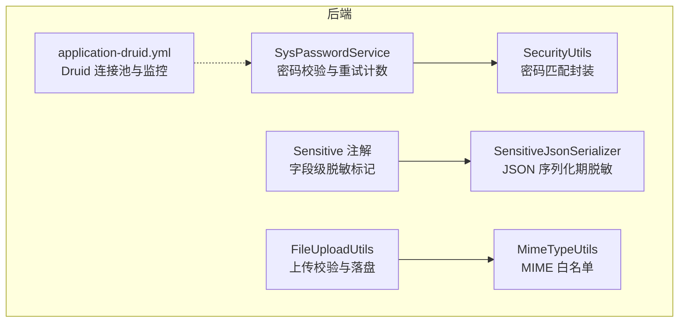
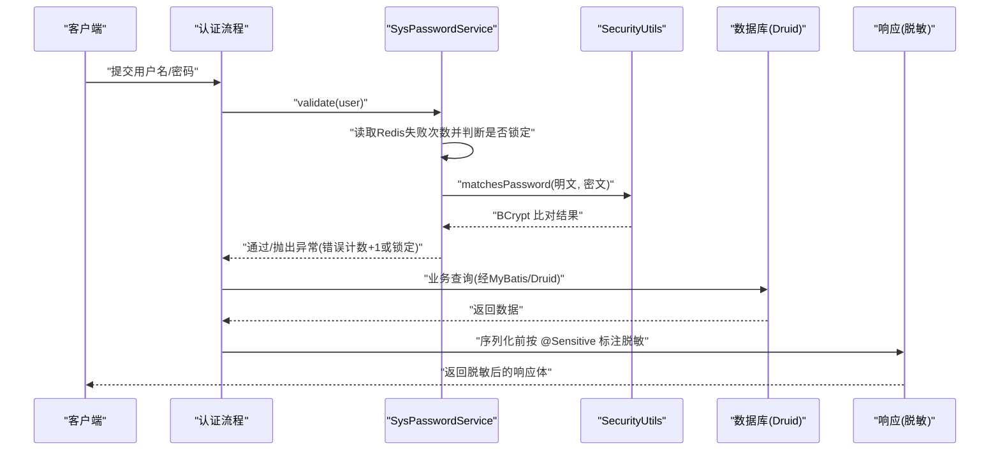
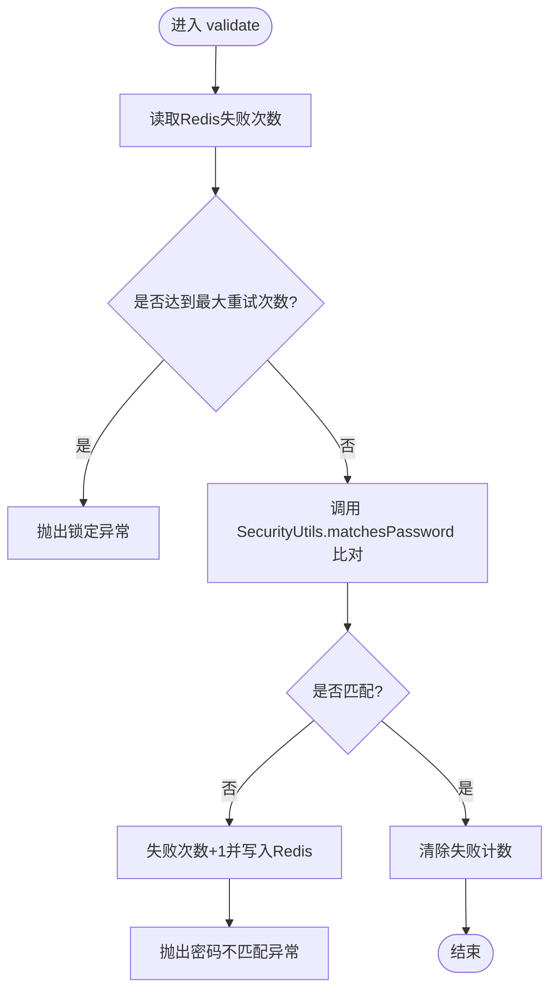
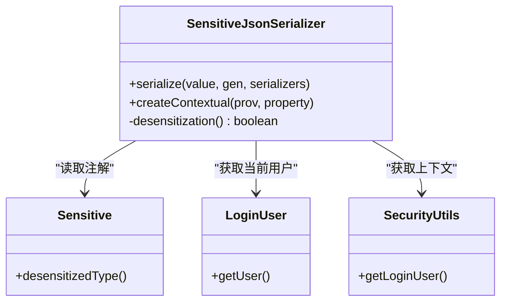
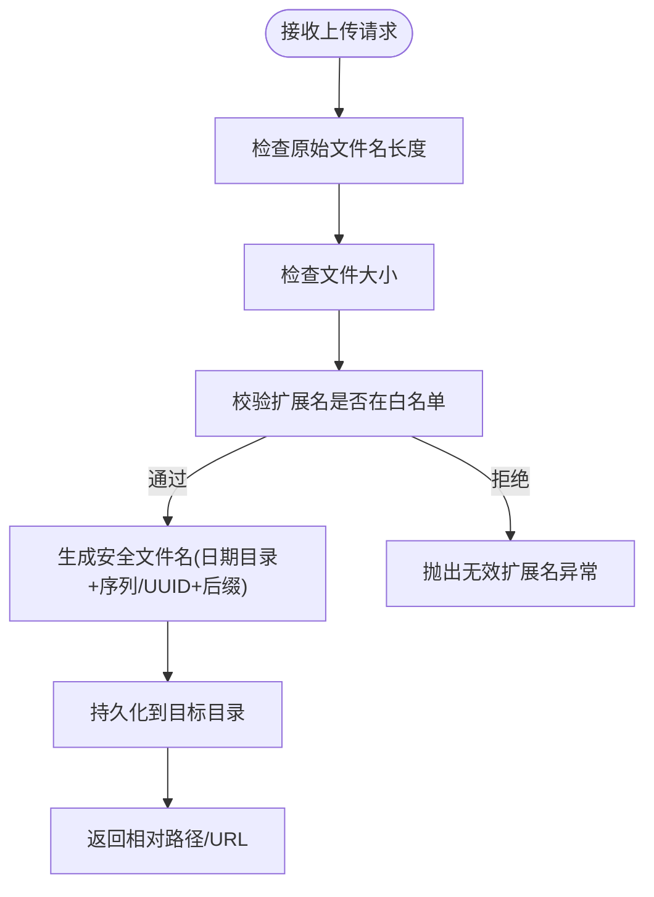
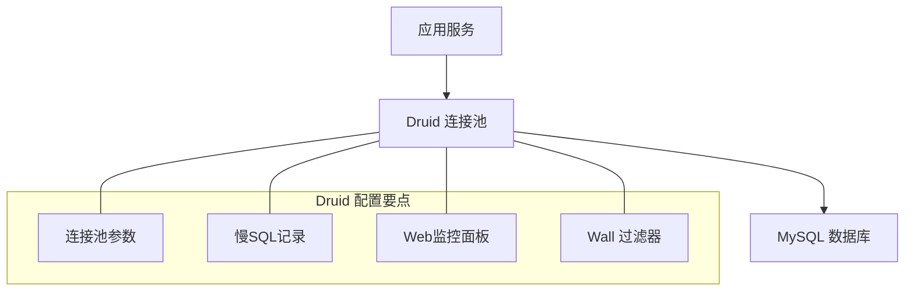
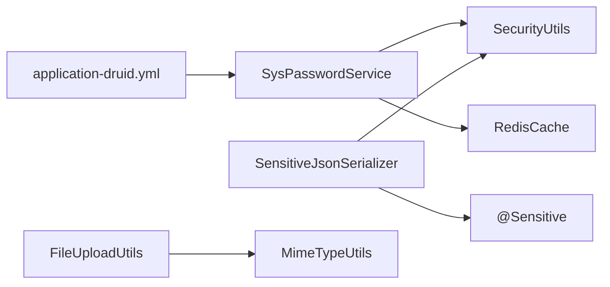

# 数据安全保护

<cite>
**本文引用的文件**   
- [SysPasswordService.java](file://PezMax-Backend/ruoyi-framework/src/main/java/com/ruoyi/framework/web/service/SysPasswordService.java)
- [SecurityUtils.java](file://PezMax-Backend/ruoyi-common/src/main/java/com/ruoyi/common/utils/SecurityUtils.java)
- [Sensitive.java](file://PezMax-Backend/ruoyi-common/src/main/java/com/ruoyi/common/annotation/Sensitive.java)
- [SensitiveJsonSerializer.java](file://PezMax-Backend/ruoyi-common/src/main/java/com/ruoyi/common/config/serializer/SensitiveJsonSerializer.java)
- [FileUploadUtils.java](file://PezMax-Backend/ruoyi-common/src/main/java/com/ruoyi/common/utils/file/FileUploadUtils.java)
- [MimeTypeUtils.java](file://PezMax-Backend/ruoyi-common/src/main/java/com/ruoyi/common/utils/file/MimeTypeUtils.java)
- [application-druid.yml](file://PezMax-Backend/ruoyi-admin/src/main/resources/application-druid.yml)
</cite>

## 目录
1. [引言](#引言)
2. [项目结构](#项目结构)
3. [核心组件](#核心组件)
4. [架构总览](#架构总览)
5. [详细组件分析](#详细组件分析)
6. [依赖关系分析](#依赖关系分析)
7. [性能考虑](#性能考虑)
8. [故障排查指南](#故障排查指南)
9. [结论](#结论)
10. [附录](#附录)

## 引言
本文件面向 PezMax-One 系统的数据安全保护，聚焦以下方面：
- 用户密码加密存储与校验机制（含 BCrypt、盐值策略、重试与锁定）
- 敏感数据脱敏处理（注解驱动、JSON 序列化期脱敏、管理员豁免）
- 数据库安全配置（连接池参数、监控与防护开关）
- 文件上传下载安全检查（类型白名单、大小限制、路径与命名规范）
- 数据备份恢复策略、审计日志记录与隐私保护措施的实现建议

说明：
- 本文所有实现细节均基于仓库源码进行分析；未在当前代码库中发现的“数据备份恢复”“恶意文件检测”等能力，将在相应章节给出落地建议。

## 项目结构
与安全相关的关键模块与文件分布如下：
- 密码服务与工具：框架层密码校验服务、通用安全工具类
- 脱敏体系：注解定义 + JSON 序列化器
- 文件上传：统一上传工具与 MIME 类型白名单
- 数据库连接池：Druid 配置（主从、连接池、监控、SQL 防火墙）

图表来源
- [SysPasswordService.java:1-87](file://PezMax-Backend/ruoyi-framework/src/main/java/com/ruoyi/framework/web/service/SysPasswordService.java#L1-L87)
- [SecurityUtils.java](file://PezMax-Backend/ruoyi-common/src/main/java/com/ruoyi/common/utils/SecurityUtils.java)
- [Sensitive.java:1-25](file://PezMax-Backend/ruoyi-common/src/main/java/com/ruoyi/common/annotation/Sensitive.java#L1-L25)
- [SensitiveJsonSerializer.java:1-68](file://PezMax-Backend/ruoyi-common/src/main/java/com/ruoyi/common/config/serializer/SensitiveJsonSerializer.java#L1-L68)
- [FileUploadUtils.java:1-261](file://PezMax-Backend/ruoyi-common/src/main/java/com/ruoyi/common/utils/file/FileUploadUtils.java#L1-L261)
- [MimeTypeUtils.java](file://PezMax-Backend/ruoyi-common/src/main/java/com/ruoyi/common/utils/file/MimeTypeUtils.java)
- [application-druid.yml:1-62](file://PezMax-Backend/ruoyi-admin/src/main/resources/application-druid.yml#L1-L62)

章节来源
- [SysPasswordService.java:1-87](file://PezMax-Backend/ruoyi-framework/src/main/java/com/ruoyi/framework/web/service/SysPasswordService.java#L1-L87)
- [Sensitive.java:1-25](file://PezMax-Backend/ruoyi-common/src/main/java/com/ruoyi/common/annotation/Sensitive.java#L1-L25)
- [SensitiveJsonSerializer.java:1-68](file://PezMax-Backend/ruoyi-common/src/main/java/com/ruoyi/common/config/serializer/SensitiveJsonSerializer.java#L1-L68)
- [FileUploadUtils.java:1-261](file://PezMax-Backend/ruoyi-common/src/main/java/com/ruoyi/common/utils/file/FileUploadUtils.java#L1-L261)
- [application-druid.yml:1-62](file://PezMax-Backend/ruoyi-admin/src/main/resources/application-druid.yml#L1-L62)

## 核心组件
- 密码服务 SysPasswordService：负责登录失败次数统计、账户锁定、密码比对调用。
- 安全工具 SecurityUtils：提供 matchesPassword 方法，内部使用 BCrypt 进行密码验证。
- 脱敏注解 Sensitive：用于在实体字段上声明脱敏策略。
- 脱敏序列化器 SensitiveJsonSerializer：在 JSON 输出时按策略对敏感字段进行脱敏，支持管理员豁免。
- 文件上传 FileUploadUtils：统一入口，包含文件名长度、大小、扩展名白名单校验，以及路径规范化与落盘。
- Druid 配置 application-druid.yml：连接池参数、慢 SQL 记录、Web 监控面板与 SQL 防火墙开关。

章节来源
- [SysPasswordService.java:1-87](file://PezMax-Backend/ruoyi-framework/src/main/java/com/ruoyi/framework/web/service/SysPasswordService.java#L1-L87)
- [SecurityUtils.java](file://PezMax-Backend/ruoyi-common/src/main/java/com/ruoyi/common/utils/SecurityUtils.java)
- [Sensitive.java:1-25](file://PezMax-Backend/ruoyi-common/src/main/java/com/ruoyi/common/annotation/Sensitive.java#L1-L25)
- [SensitiveJsonSerializer.java:1-68](file://PezMax-Backend/ruoyi-common/src/main/java/com/ruoyi/common/config/serializer/SensitiveJsonSerializer.java#L1-L68)
- [FileUploadUtils.java:1-261](file://PezMax-Backend/ruoyi-common/src/main/java/com/ruoyi/common/utils/file/FileUploadUtils.java#L1-L261)
- [application-druid.yml:1-62](file://PezMax-Backend/ruoyi-admin/src/main/resources/application-druid.yml#L1-L62)

## 架构总览
下图展示了登录校验、敏感数据脱敏、文件上传与数据库访问的安全链路。

图表来源
- [SysPasswordService.java:44-85](file://PezMax-Backend/ruoyi-framework/src/main/java/com/ruoyi/framework/web/service/SysPasswordService.java#L44-L85)
- [SecurityUtils.java](file://PezMax-Backend/ruoyi-common/src/main/java/com/ruoyi/common/utils/SecurityUtils.java)
- [Sensitive.java:17-24](file://PezMax-Backend/ruoyi-common/src/main/java/com/ruoyi/common/annotation/Sensitive.java#L17-L24)
- [SensitiveJsonSerializer.java:25-66](file://PezMax-Backend/ruoyi-common/src/main/java/com/ruoyi/common/config/serializer/SensitiveJsonSerializer.java#L25-L66)
- [application-druid.yml:1-62](file://PezMax-Backend/ruoyi-admin/src/main/resources/application-druid.yml#L1-L62)

## 详细组件分析

### 密码加密与强度控制
- 算法与盐值
  - 密码比对通过 SecurityUtils.matchesPassword 完成，底层采用 BCrypt。BCrypt 在生成哈希时内置随机盐值，无需应用侧额外管理盐值。
- 重试与锁定
  - SysPasswordService.validate 中维护登录失败次数（基于 Redis），超过阈值后抛出锁定异常，并在成功登录后清除计数。
- 密码强度
  - 当前仓库未发现统一的密码强度校验逻辑（如最小长度、复杂度规则）。建议在注册/修改密码处引入前端与后端双重校验，并结合常量集中管理策略。

图表来源
- [SysPasswordService.java:44-85](file://PezMax-Backend/ruoyi-framework/src/main/java/com/ruoyi/framework/web/service/SysPasswordService.java#L44-L85)
- [SecurityUtils.java](file://PezMax-Backend/ruoyi-common/src/main/java/com/ruoyi/common/utils/SecurityUtils.java)

章节来源
- [SysPasswordService.java:27-31](file://PezMax-Backend/ruoyi-framework/src/main/java/com/ruoyi/framework/web/service/SysPasswordService.java#L27-L31)
- [SysPasswordService.java:44-85](file://PezMax-Backend/ruoyi-framework/src/main/java/com/ruoyi/framework/web/service/SysPasswordService.java#L44-L85)
- [SecurityUtils.java](file://PezMax-Backend/ruoyi-common/src/main/java/com/ruoyi/common/utils/SecurityUtils.java)

### 敏感数据脱敏（@Sensitive 与 JSON 序列化）
- 注解定义
  - 在实体字段上使用 @Sensitive 指定脱敏类型，Jackson 会在序列化时自动触发脱敏。
- 序列化器行为
  - SensitiveJsonSerializer 根据当前登录用户角色决定是否脱敏：管理员不脱敏，普通用户按 DesensitizedType 的策略函数执行脱敏。
- 适用场景
  - 适用于手机号、身份证、邮箱、银行卡号等个人信息的接口返回脱敏。

图表来源
- [Sensitive.java:17-24](file://PezMax-Backend/ruoyi-common/src/main/java/com/ruoyi/common/annotation/Sensitive.java#L17-L24)
- [SensitiveJsonSerializer.java:25-66](file://PezMax-Backend/ruoyi-common/src/main/java/com/ruoyi/common/config/serializer/SensitiveJsonSerializer.java#L25-L66)

章节来源
- [Sensitive.java:1-25](file://PezMax-Backend/ruoyi-common/src/main/java/com/ruoyi/common/annotation/Sensitive.java#L1-25)
- [SensitiveJsonSerializer.java:1-68](file://PezMax-Backend/ruoyi-common/src/main/java/com/ruoyi/common/config/serializer/SensitiveJsonSerializer.java#L1-68)

### 文件上传下载安全检查
- 类型白名单
  - 通过 MimeTypeUtils.DEFAULT_ALLOWED_EXTENSION 限定允许的后缀，拒绝非白名单类型。
- 大小限制
  - 默认最大 50MB，超出抛出文件大小超限异常。
- 文件名与路径
  - 限制原始文件名长度；生成安全文件名（日期目录 + 序列/UUID + 后缀），避免路径穿越风险。
- 下载安全
  - 当前仓库未发现专门的下载校验逻辑。建议结合资源访问控制与白名单策略，防止越权下载。

图表来源
- [FileUploadUtils.java:122-139](file://PezMax-Backend/ruoyi-common/src/main/java/com/ruoyi/common/utils/file/FileUploadUtils.java#L122-L139)
- [FileUploadUtils.java:186-224](file://PezMax-Backend/ruoyi-common/src/main/java/com/ruoyi/common/utils/file/FileUploadUtils.java#L186-L224)
- [MimeTypeUtils.java](file://PezMax-Backend/ruoyi-common/src/main/java/com/ruoyi/common/utils/file/MimeTypeUtils.java)

章节来源
- [FileUploadUtils.java:29-34](file://PezMax-Backend/ruoyi-common/src/main/java/com/ruoyi/common/utils/file/FileUploadUtils.java#L29-L34)
- [FileUploadUtils.java:122-139](file://PezMax-Backend/ruoyi-common/src/main/java/com/ruoyi/common/utils/file/FileUploadUtils.java#L122-L139)
- [FileUploadUtils.java:186-224](file://PezMax-Backend/ruoyi-common/src/main/java/com/ruoyi/common/utils/file/FileUploadUtils.java#L186-L224)
- [MimeTypeUtils.java](file://PezMax-Backend/ruoyi-common/src/main/java/com/ruoyi/common/utils/file/MimeTypeUtils.java)

### 数据库安全配置（连接池与 SQL 防护）
- 连接池参数
  - 初始/最小/最大连接数、等待超时、连接/网络超时、空闲回收策略等均已配置。
- 监控与诊断
  - 启用 WebStatFilter 与 StatViewServlet，可开启慢 SQL 记录与合并统计。
- SQL 注入防护
  - 已启用 Wall 过滤器，但 multi-statement-allow 为 true，意味着允许多语句执行，存在潜在风险。建议在生产环境关闭多语句执行，并结合 MyBatis 参数化查询与严格白名单。
- 参数化查询
  - 本项目使用 MyBatis，应确保所有 SQL 使用 #{} 参数占位符，禁止字符串拼接。

图表来源
- [application-druid.yml:1-62](file://PezMax-Backend/ruoyi-admin/src/main/resources/application-druid.yml#L1-L62)

章节来源
- [application-druid.yml:20-42](file://PezMax-Backend/ruoyi-admin/src/main/resources/application-druid.yml#L20-L42)
- [application-druid.yml:43-62](file://PezMax-Backend/ruoyi-admin/src/main/resources/application-druid.yml#L43-L62)

### 数据备份恢复策略（建议）
- 现状
  - 仓库中未发现自动化备份脚本或任务。
- 建议方案
  - 定期全量 + 增量备份（例如 mysqldump + binlog 归档），保留多份历史副本。
  - 将备份文件异地存储（对象存储/冷存储），并进行完整性校验与恢复演练。
  - 建立恢复 SLA 与回滚预案，明确 RPO/RTO 指标。

[本节为通用建议，不涉及具体源码]

### 数据审计日志记录（建议）
- 现状
  - 仓库中存在操作日志相关模块（如 system 模块中的日志实体与 Mapper），但未在本节分析的源码片段中直接展示其实现。
- 建议方案
  - 对关键数据变更（增删改）、权限变更、登录登出、敏感数据访问进行审计。
  - 审计日志独立存储，防篡改，具备检索与导出能力。

[本节为通用建议，不涉及具体源码]

### 数据隐私保护措施（建议）
- 传输安全
  - 全站 HTTPS，强制 HSTS，禁用弱加密套件。
- 存储安全
  - 敏感字段（如身份证号、银行卡号）加密存储；密钥由 KMS 管理。
- 最小可见原则
  - 接口默认脱敏，仅授权角色可查看明文；脱敏策略集中管理。
- 合规与生命周期
  - 数据留存期限、删除策略、用户撤回同意后的数据处理流程。

[本节为通用建议，不涉及具体源码]

## 依赖关系分析
- 组件耦合
  - SysPasswordService 依赖 RedisCache 与 SecurityUtils；SensitiveJsonSerializer 依赖 SecurityUtils 与注解元信息；FileUploadUtils 依赖 MimeTypeUtils 与配置常量。
- 外部依赖
  - Druid 作为连接池与监控组件；Jackson 作为 JSON 序列化引擎；Spring Security 上下文用于获取当前用户。

图表来源
- [SysPasswordService.java:1-87](file://PezMax-Backend/ruoyi-framework/src/main/java/com/ruoyi/framework/web/service/SysPasswordService.java#L1-L87)
- [SensitiveJsonSerializer.java:1-68](file://PezMax-Backend/ruoyi-common/src/main/java/com/ruoyi/common/config/serializer/SensitiveJsonSerializer.java#L1-L68)
- [FileUploadUtils.java:1-261](file://PezMax-Backend/ruoyi-common/src/main/java/com/ruoyi/common/utils/file/FileUploadUtils.java#L1-L261)
- [application-druid.yml:1-62](file://PezMax-Backend/ruoyi-admin/src/main/resources/application-druid.yml#L1-L62)

章节来源
- [SysPasswordService.java:1-87](file://PezMax-Backend/ruoyi-framework/src/main/java/com/ruoyi/framework/web/service/SysPasswordService.java#L1-L87)
- [SensitiveJsonSerializer.java:1-68](file://PezMax-Backend/ruoyi-common/src/main/java/com/ruoyi/common/config/serializer/SensitiveJsonSerializer.java#L1-L68)
- [FileUploadUtils.java:1-261](file://PezMax-Backend/ruoyi-common/src/main/java/com/ruoyi/common/utils/file/FileUploadUtils.java#L1-L261)
- [application-druid.yml:1-62](file://PezMax-Backend/ruoyi-admin/src/main/resources/application-druid.yml#L1-L62)

## 性能考虑
- 密码校验
  - BCrypt 计算开销较大，建议配合缓存与限流，避免暴力破解与资源耗尽。
- 脱敏序列化
  - 仅在需要时启用脱敏，避免对大对象频繁转换造成 GC 压力。
- 文件上传
  - 合理设置大小上限与并发限制，避免磁盘 I/O 瓶颈。
- 数据库连接池
  - 根据 QPS 与延迟目标调优 maxActive、maxWait 与超时参数，开启慢 SQL 记录以定位热点。

[本节为通用指导，不涉及具体源码]

## 故障排查指南
- 登录被锁定
  - 现象：多次密码错误后被锁定。
  - 排查：确认 user.password.maxRetryCount 与 lockTime 配置；检查 Redis 中失败计数键是否存在与过期时间。
- 脱敏未生效
  - 现象：接口返回明文敏感信息。
  - 排查：确认字段是否标注 @Sensitive；确认当前用户是否为管理员；检查 Jackson 序列化链是否加载自定义序列化器。
- 上传失败
  - 现象：抛出文件大小超限或无效扩展名异常。
  - 排查：核对 DEFAULT_MAX_SIZE 与白名单配置；检查原始文件名长度与服务器磁盘空间。
- 数据库连接问题
  - 现象：连接池耗尽或慢查询增多。
  - 排查：查看 Druid 监控面板；调整连接池参数；检查 SQL 是否参数化与索引命中情况。

章节来源
- [SysPasswordService.java:27-31](file://PezMax-Backend/ruoyi-framework/src/main/java/com/ruoyi/framework/web/service/SysPasswordService.java#L27-L31)
- [SensitiveJsonSerializer.java:54-66](file://PezMax-Backend/ruoyi-common/src/main/java/com/ruoyi/common/config/serializer/SensitiveJsonSerializer.java#L54-L66)
- [FileUploadUtils.java:186-224](file://PezMax-Backend/ruoyi-common/src/main/java/com/ruoyi/common/utils/file/FileUploadUtils.java#L186-L224)
- [application-druid.yml:43-62](file://PezMax-Backend/ruoyi-admin/src/main/resources/application-druid.yml#L43-L62)

## 结论
- 密码安全：采用 BCrypt 与失败重试/锁定机制，满足基本安全要求；建议补充密码强度校验。
- 敏感数据：通过 @Sensitive 与自定义序列化器实现按需脱敏，管理员豁免策略清晰。
- 文件安全：具备类型白名单与大小限制，建议增强恶意文件检测与下载鉴权。
- 数据库安全：连接池与监控完善，需关注多语句执行开关与 SQL 注入防护策略。
- 备份与审计：仓库未见现成实现，建议尽快补齐以满足合规与运维需求。

[本节为总结性内容，不涉及具体源码]

## 附录
- 术语
  - BCrypt：一种基于 Blowfish 的密码哈希算法，内置随机盐值，适合密码存储。
  - 脱敏：对敏感信息进行掩码或部分隐藏，降低泄露风险。
  - 连接池：复用数据库连接，提升吞吐与稳定性。

[本节为概念性说明，不涉及具体源码]