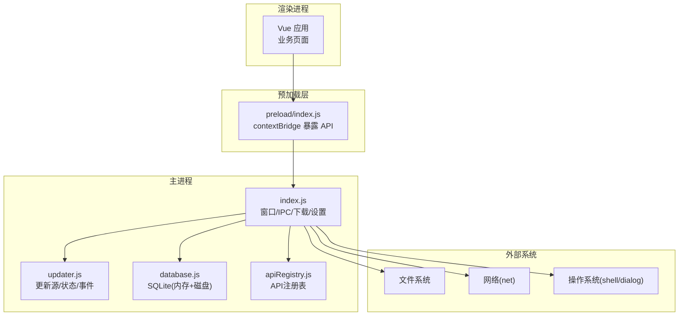
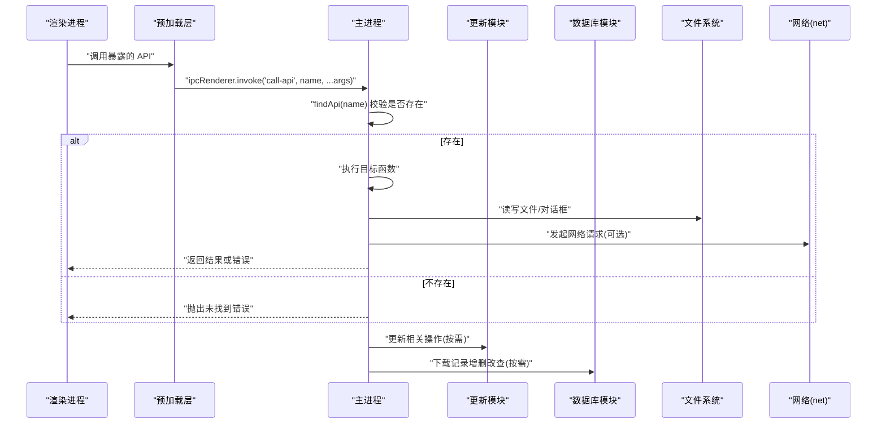
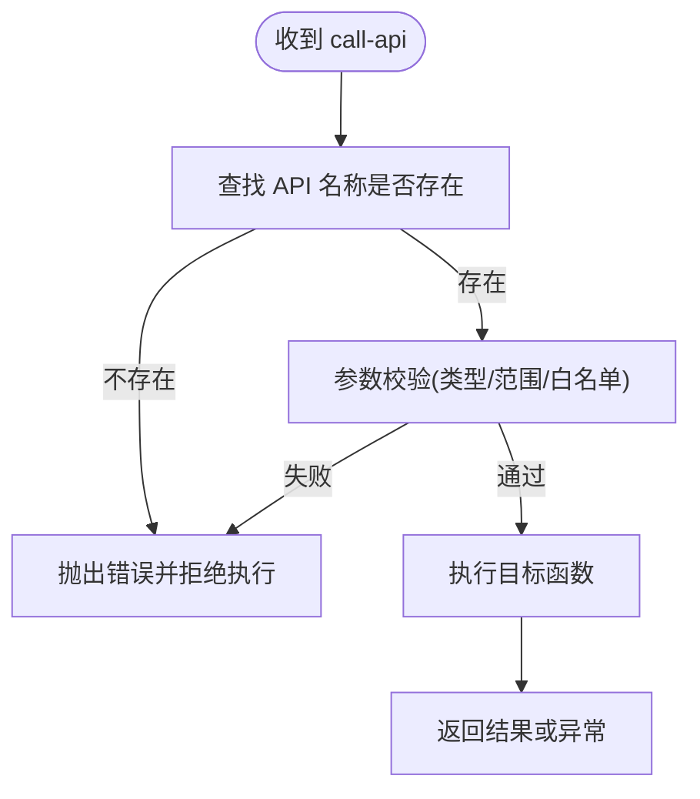
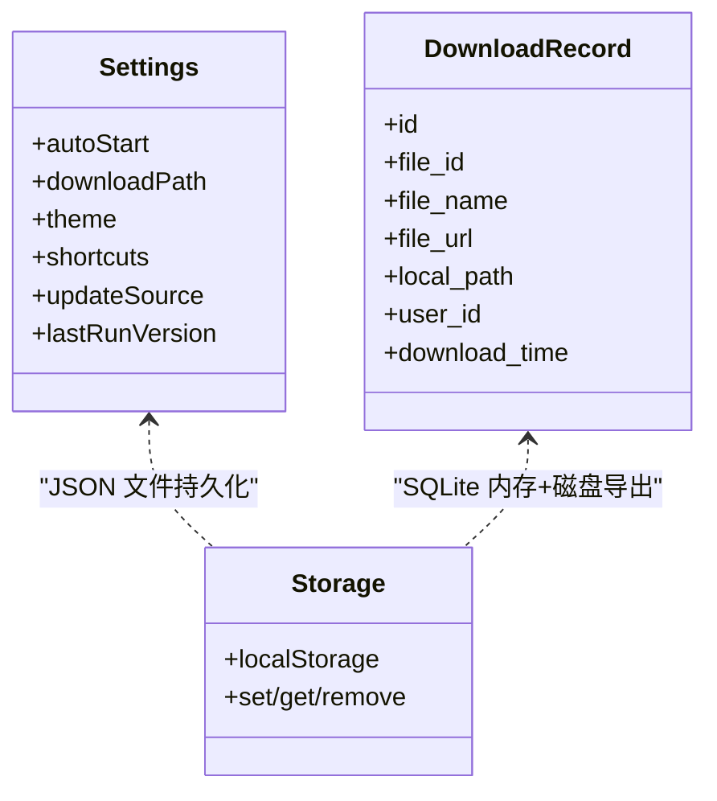
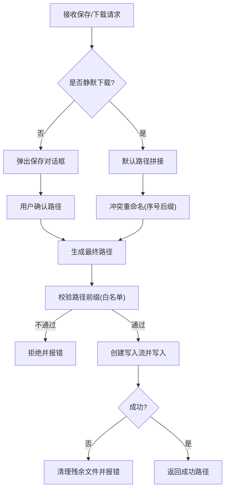
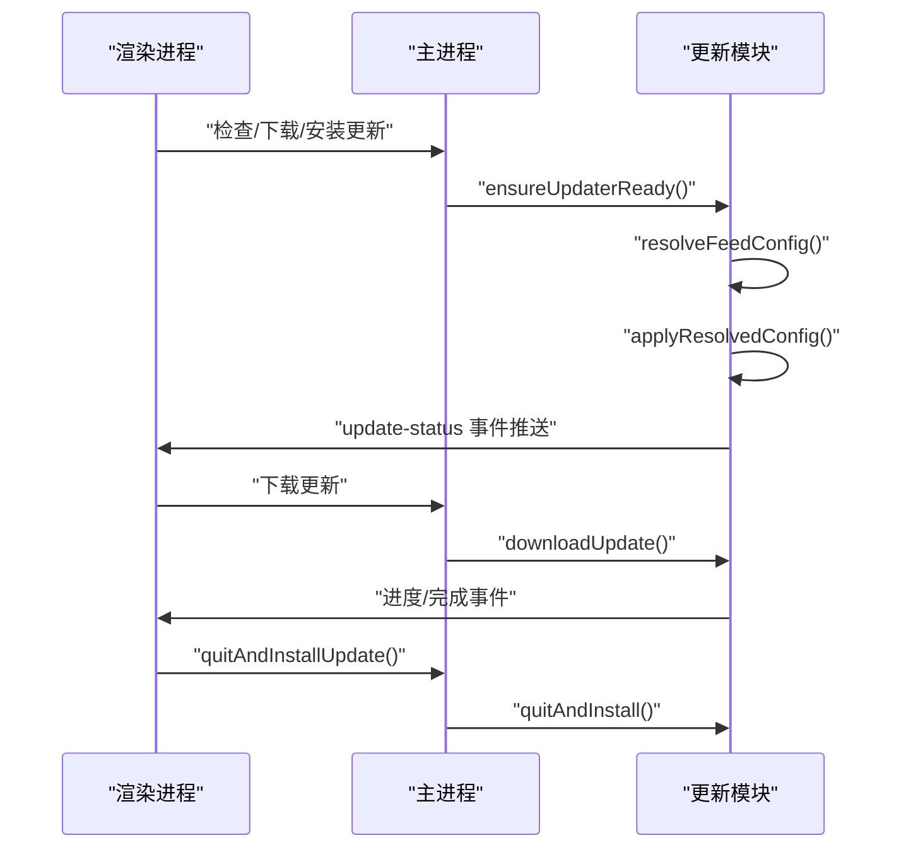
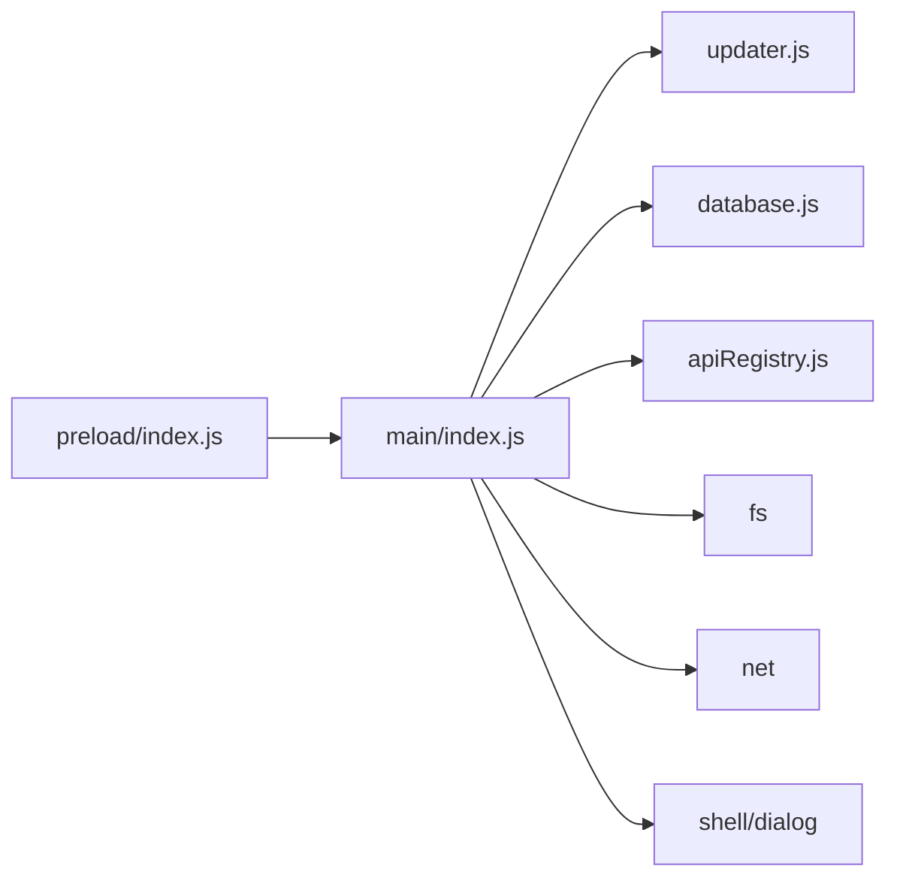

# 桌面应用安全

<cite>
**本文引用的文件**
- [src/main/index.js](file://PezMax-Desktop/src/main/index.js)
- [src/preload/index.js](file://PezMax-Desktop/src/preload/index.js)
- [src/main/main-utils/apiRegistry.js](file://PezMax-Desktop/src/main/main-utils/apiRegistry.js)
- [src/main/main-utils/database.js](file://PezMax-Desktop/src/main/main-utils/database.js)
- [src/main/main-utils/updater.js](file://PezMax-Desktop/src/main/main-utils/updater.js)
- [electron-builder.yml](file://PezMax-Desktop/electron-builder.yml)
- [package.json](file://PezMax-Desktop/package.json)
- [src/renderer/utils/auth.js](file://PezMax-Desktop/src/renderer/utils/auth.js)
- [src/renderer/utils/clientStorage.js](file://PezMax-Desktop/src/renderer/utils/clientStorage.js)
</cite>

## 目录
1. [简介](#简介)
2. [项目结构](#项目结构)
3. [核心组件](#核心组件)
4. [架构总览](#架构总览)
5. [详细组件分析](#详细组件分析)
6. [依赖关系分析](#依赖关系分析)
7. [性能与安全权衡](#性能与安全权衡)
8. [故障排查指南](#故障排查指南)
9. [结论](#结论)
10. [附录：安全测试与修复清单](#附录安全测试与修复清单)

## 简介
本安全设计文档面向 PezMax-One 桌面应用（Electron），围绕主进程与渲染进程通信、本地数据存储、文件系统访问、更新机制、打包与发布配置以及开发部署阶段的安全措施进行系统化分析与建议。文档同时提供可视化架构图与流程图，帮助非专业读者理解关键风险点与加固策略。

## 项目结构
本项目采用 Electron + Vue 的常见分层：
- 主进程：负责窗口管理、IPC 路由、系统能力调用、更新逻辑、下载与持久化等。
- Preload：通过 contextBridge 暴露最小必要 API 给渲染进程。
- 渲染进程：业务界面与交互，仅通过预加载脚本提供的受限接口访问主进程能力。
- 构建与发布：使用 electron-builder 进行打包与分发，electron-updater 实现自动更新。

图示来源
- [src/main/index.js:217-290](file://PezMax-Desktop/src/main/index.js#L217-L290)
- [src/preload/index.js:10-57](file://PezMax-Desktop/src/preload/index.js#L10-L57)
- [src/main/main-utils/updater.js:119-204](file://PezMax-Desktop/src/main/main-utils/updater.js#L119-L204)
- [src/main/main-utils/database.js:9-56](file://PezMax-Desktop/src/main/main-utils/database.js#L9-L56)
- [src/main/main-utils/apiRegistry.js:8-18](file://PezMax-Desktop/src/main/main-utils/apiRegistry.js#L8-L18)

章节来源
- [src/main/index.js:217-290](file://PezMax-Desktop/src/main/index.js#L217-L290)
- [src/preload/index.js:10-57](file://PezMax-Desktop/src/preload/index.js#L10-L57)
- [package.json:1-78](file://PezMax-Desktop/package.json#L1-L78)

## 核心组件
- IPC 路由与白名单
  - 主进程集中处理所有 IPC 请求，并通过统一入口按名称查找并执行对应函数，避免在渲染端直接调用危险 API。
  - 预加载层仅暴露受控方法，作为“白名单”式通道。
- 本地存储
  - 用户设置以 JSON 文件形式落盘；下载记录使用 SQLite（内存数据库+磁盘导出）。
  - 认证令牌暂存于 localStorage（存在安全风险，见后文修复建议）。
- 更新机制
  - 支持 generic/GitHub 两种更新源，优先级：用户覆盖 > 环境变量 > 配置文件。
  - 自动更新开关关闭，需手动触发下载与安装。
- 文件系统与下载
  - 通过 dialog 选择路径，net 模块直写流式下载，避免大文件内存占用。
  - 批量检查与删除本地文件，配合下载记录清理。

章节来源
- [src/main/index.js:293-305](file://PezMax-Desktop/src/main/index.js#L293-L305)
- [src/preload/index.js:14-56](file://PezMax-Desktop/src/preload/index.js#L14-L56)
- [src/main/main-utils/database.js:88-147](file://PezMax-Desktop/src/main/main-utils/database.js#L88-L147)
- [src/main/main-utils/updater.js:119-204](file://PezMax-Desktop/src/main/main-utils/updater.js#L119-L204)
- [src/main/index.js:528-608](file://PezMax-Desktop/src/main/index.js#L528-L608)

## 架构总览
下图展示从渲染进程到主进程的受控调用链路与外部资源访问边界。

图示来源
- [src/main/index.js:293-305](file://PezMax-Desktop/src/main/index.js#L293-L305)
- [src/preload/index.js:14-56](file://PezMax-Desktop/src/preload/index.js#L14-L56)
- [src/main/main-utils/updater.js:329-393](file://PezMax-Desktop/src/main/main-utils/updater.js#L329-L393)
- [src/main/main-utils/database.js:88-147](file://PezMax-Desktop/src/main/main-utils/database.js#L88-L147)

## 详细组件分析

### IPC 安全与权限控制
- 上下文隔离与 Node 集成
  - 已开启 contextIsolation，禁用 nodeIntegration，降低渲染端直接访问 Node 的风险。
  - 但 webSecurity 被禁用，允许 file:// 跨域访问远程资源，存在潜在 XSS/数据泄露风险。
- 预加载白名单
  - 仅暴露必要的 ipcRenderer.invoke/send 封装，避免全局暴露危险对象。
- 统一路由与发现
  - 通过 findApi 按名称查找可执行函数，若不存在则拒绝执行，形成“显式白名单”。
- 建议加固
  - 启用 webSecurity，改用 HTTPS 与 CSP 保护前端资源。
  - 对每个 IPC 参数进行严格校验（类型、长度、格式），防止注入与越权。
  - 为敏感操作增加二次确认或权限校验（如管理员模式切换）。

图示来源
- [src/main/index.js:293-305](file://PezMax-Desktop/src/main/index.js#L293-L305)
- [src/main/main-utils/apiRegistry.js:13-18](file://PezMax-Desktop/src/main/main-utils/apiRegistry.js#L13-L18)

章节来源
- [src/main/index.js:233-241](file://PezMax-Desktop/src/main/index.js#L233-L241)
- [src/preload/index.js:10-57](file://PezMax-Desktop/src/preload/index.js#L10-L57)
- [src/main/main-utils/apiRegistry.js:8-18](file://PezMax-Desktop/src/main/main-utils/apiRegistry.js#L8-L18)

### 本地数据存储安全
- 用户设置
  - 以 JSON 文件保存至 userData 目录，包含主题、快捷键、下载路径、更新源等。
  - 当前未加密，存在明文泄露风险。
- 下载记录
  - 使用 SQLite（sql.js）内存库，定期导出到磁盘文件，具备 WAL 模式提升并发写入稳定性。
  - 提供增删查与批量刷盘接口，便于事务性写入。
- 认证令牌
  - 当前将 Token 保存在 localStorage，易被前端脚本读取。
- 建议加固
  - 对敏感设置（如 token、密钥）进行加密存储（例如使用系统级 Keychain/DPAPI 或主进程内加解密后再落盘）。
  - 限制 localStorage 中敏感数据的生命周期，结合会话过期与退出清理。
  - 对 SQLite 文件设置合适的文件权限（平台相关），避免其他用户可读。

图示来源
- [src/main/index.js:12-46](file://PezMax-Desktop/src/main/index.js#L12-L46)
- [src/main/main-utils/database.js:26-56](file://PezMax-Desktop/src/main/main-utils/database.js#L26-L56)
- [src/renderer/utils/auth.js:11-26](file://PezMax-Desktop/src/renderer/utils/auth.js#L11-L26)
- [src/renderer/utils/clientStorage.js:9-27](file://PezMax-Desktop/src/renderer/utils/clientStorage.js#L9-L27)

章节来源
- [src/main/index.js:12-46](file://PezMax-Desktop/src/main/index.js#L12-L46)
- [src/main/main-utils/database.js:88-147](file://PezMax-Desktop/src/main/main-utils/database.js#L88-L147)
- [src/renderer/utils/auth.js:11-26](file://PezMax-Desktop/src/renderer/utils/auth.js#L11-L26)
- [src/renderer/utils/clientStorage.js:9-27](file://PezMax-Desktop/src/renderer/utils/clientStorage.js#L9-L27)

### 文件系统访问与沙箱
- 当前配置
  - sandbox 关闭，nodeIntegration 关闭，contextIsolation 开启。
  - 文件操作集中在主进程，通过 dialog 选择路径，减少任意路径写入风险。
- 下载流程
  - net 模块直写流式下载，避免大文件内存占用；错误时清理残余文件。
- 建议加固
  - 引入路径白名单与规范化校验，禁止路径穿越（如 ../ 等）。
  - 对写入目录做强制前缀校验，确保只能写入用户指定目录。
  - 对上传/拖拽文件夹内容做递归扫描限制（深度、数量、大小上限）。

图示来源
- [src/main/index.js:385-427](file://PezMax-Desktop/src/main/index.js#L385-L427)
- [src/main/index.js:528-608](file://PezMax-Desktop/src/main/index.js#L528-L608)

章节来源
- [src/main/index.js:233-241](file://PezMax-Desktop/src/main/index.js#L233-L241)
- [src/main/index.js:385-427](file://PezMax-Desktop/src/main/index.js#L385-L427)
- [src/main/index.js:528-608](file://PezMax-Desktop/src/main/index.js#L528-L608)

### 桌面应用更新安全
- 更新源解析优先级
  - 用户覆盖 > 环境变量 > 配置文件（app-update.yml / electron-builder.yml）。
  - 内置预设源用于快速切换。
- 行为控制
  - 自动下载关闭，需手动触发；仅在打包环境允许检查/下载。
  - 更新完成后自动重启安装。
- 快捷方式恢复
  - 更新前保存桌面快捷方式状态，更新后重建。
- 建议加固
  - 启用数字签名验证（平台相关），校验更新包完整性（哈希/签名）。
  - 增加回滚机制（保留上一版本安装包或快照），失败时自动回退。
  - 限制更新源 URL 白名单，防止恶意源注入。

图示来源
- [src/main/main-utils/updater.js:119-204](file://PezMax-Desktop/src/main/main-utils/updater.js#L119-L204)
- [src/main/main-utils/updater.js:329-393](file://PezMax-Desktop/src/main/main-utils/updater.js#L329-L393)
- [src/main/main-utils/updater.js:505-531](file://PezMax-Desktop/src/main/main-utils/updater.js#L505-L531)

章节来源
- [src/main/main-utils/updater.js:119-204](file://PezMax-Desktop/src/main/main-utils/updater.js#L119-L204)
- [src/main/main-utils/updater.js:329-393](file://PezMax-Desktop/src/main/main-utils/updater.js#L329-L393)
- [src/main/main-utils/updater.js:505-531](file://PezMax-Desktop/src/main/main-utils/updater.js#L505-L531)

### 打包与发布安全配置
- electron-builder
  - 多平台发布目标（Windows/macOS/Linux），通用发布地址指向 GitHub Releases。
  - Windows NSIS 安装器支持差分更新，macOS 支持 entitlements 与扩展信息。
- package.json
  - 脚本提供开发/构建/打包命令，区分客户端与管理端入口。
- 建议加固
  - 启用代码签名（Windows 证书、macOS 开发者证书与公证）。
  - 在 CI 中生成并校验产物哈希，发布时附带签名与校验文件。
  - 最小化打包产物，排除源码与敏感配置。

章节来源
- [electron-builder.yml:1-68](file://PezMax-Desktop/electron-builder.yml#L1-L68)
- [package.json:1-78](file://PezMax-Desktop/package.json#L1-L78)

## 依赖关系分析
- 主进程依赖
  - updater.js：更新源解析、事件监听、状态同步。
  - database.js：SQLite 初始化、建表、CRUD、持久化。
  - apiRegistry.js：API 注册与查找。
- 预加载层依赖
  - 仅依赖 electron 的 contextBridge/ipcRenderer，暴露最小 API。
- 外部依赖
  - electron-updater：自动更新。
  - sql.js：SQLite 内存数据库。
  - axios/form-data：前端网络与表单（注意不要在主进程直接使用）。

图示来源
- [src/main/index.js:1-10](file://PezMax-Desktop/src/main/index.js#L1-L10)
- [src/preload/index.js:1-3](file://PezMax-Desktop/src/preload/index.js#L1-L3)
- [package.json:28-53](file://PezMax-Desktop/package.json#L28-L53)

章节来源
- [src/main/index.js:1-10](file://PezMax-Desktop/src/main/index.js#L1-L10)
- [src/preload/index.js:1-3](file://PezMax-Desktop/src/preload/index.js#L1-L3)
- [package.json:28-53](file://PezMax-Desktop/package.json#L28-L53)

## 性能与安全权衡
- 关闭 sandbox 与 webSecurity 提升兼容性，但增大攻击面。建议在后续版本逐步启用，并以 CSP、HTTPS、子资源完整性(SRI)替代。
- SQLite 内存模式+WAL 提高并发写入性能，但需注意频繁 flush 带来的 IO 开销，建议批处理合并。
- 流式下载避免内存峰值，适合大文件场景；应增加断点续传与校验（哈希）保障完整性。

[本节为通用指导，无需具体文件引用]

## 故障排查指南
- 更新失败
  - 检查更新源是否有效（URL/owner/repo），确认处于打包环境。
  - 查看 update-status 事件消息，定位 checking/downloading/error 阶段问题。
- 下载失败
  - 检查网络可达性与鉴权头是否正确传递。
  - 确认目标目录可写，路径无非法字符。
- 缓存清理无效
  - 确认窗口实例存在且 session 可用；必要时重启应用再试。

章节来源
- [src/main/main-utils/updater.js:206-253](file://PezMax-Desktop/src/main/main-utils/updater.js#L206-L253)
- [src/main/index.js:333-352](file://PezMax-Desktop/src/main/index.js#L333-L352)
- [src/main/index.js:528-608](file://PezMax-Desktop/src/main/index.js#L528-L608)

## 结论
当前应用在 IPC 白名单、预加载隔离、流式下载与更新源解析方面具备良好基础。主要风险集中于：webSecurity 关闭、敏感数据明文存储、路径校验不足、更新包完整性与回滚缺失。建议优先实施以下加固：启用 webSecurity 与 CSP、对 IPC 参数严格校验、对敏感数据进行加密存储与最小化持久化、完善路径白名单与校验、为更新包添加签名与完整性校验并实现回滚机制。

[本节为总结性内容，无需具体文件引用]

## 附录：安全测试与修复清单
- IPC 安全测试
  - 尝试调用未注册的 API 名称，预期应被拒绝。
  - 传入异常参数（超长、非法类型、注入字符），预期应被拦截。
- 本地存储安全测试
  - 检查 userData 目录下设置文件是否为明文；评估是否需要对敏感字段加密。
  - 检查 localStorage 中的 Token 生命周期与可见性，建议迁移至更安全存储。
- 文件系统访问测试
  - 构造路径穿越输入（如 ../etc/passwd），预期应被拒绝。
  - 在非白名单目录写入文件，预期应被拒绝。
- 更新安全测试
  - 配置不可信更新源，预期应被拒绝或提示风险。
  - 模拟更新包损坏，预期应失败且不覆盖现有版本。
- 修复建议汇总
  - 启用 webSecurity，使用 HTTPS 与 CSP。
  - 对所有 IPC 参数进行白名单与格式校验。
  - 对敏感数据（Token、密钥）进行加密存储，缩短有效期。
  - 实现路径白名单与前缀校验，限制递归深度与文件大小。
  - 为更新包启用签名与完整性校验，实现失败回滚。
  - 在 CI/CD 中集成安全扫描与依赖漏洞检测。

[本节为通用指导，无需具体文件引用]