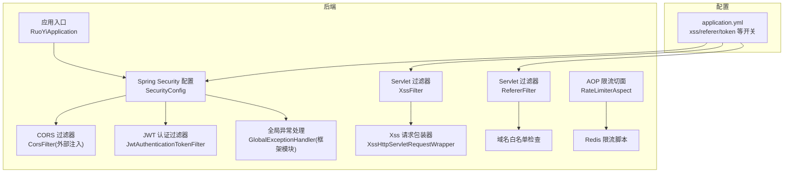
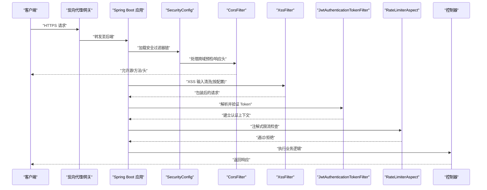
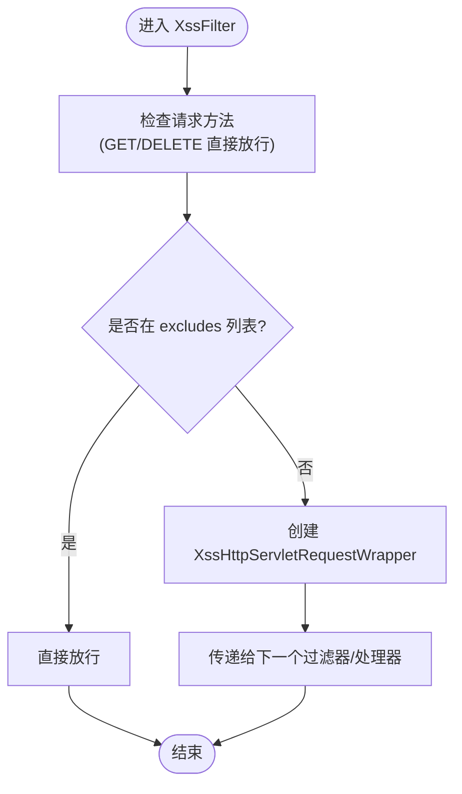
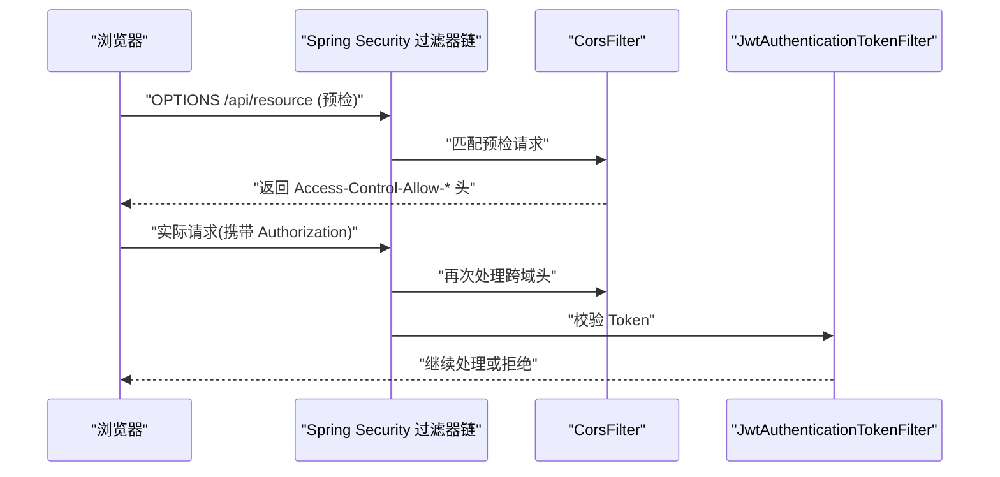
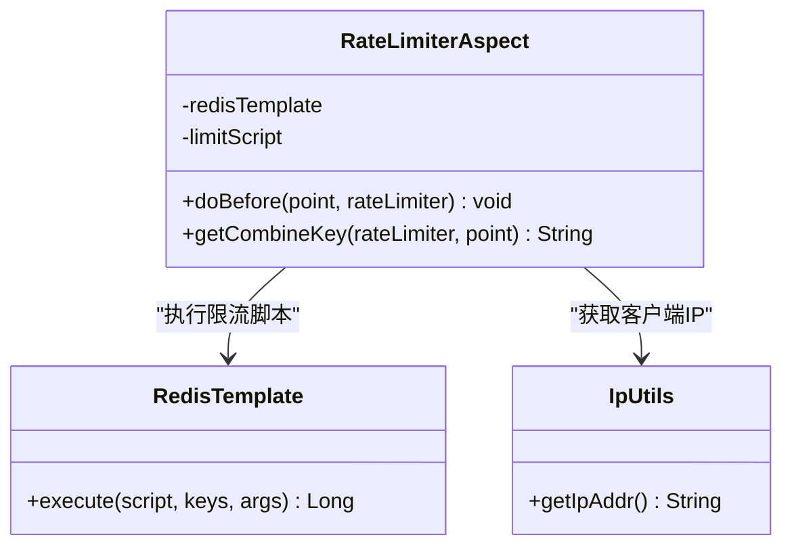
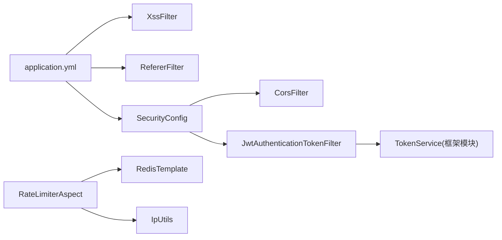

# 网络安全防护

<cite>
**本文引用的文件**
- [XssFilter.java](file://PezMax-Backend/ruoyi-common/src/main/java/com/ruoyi/common/filter/XssFilter.java)
- [XssHttpServletRequestWrapper.java](file://PezMax-Backend/ruoyi-common/src/main/java/com/ruoyi/common/filter/XssHttpServletRequestWrapper.java)
- [HTMLFilter.java](file://PezMax-Backend/ruoyi-common/src/main/java/com/ruoyi/common/utils/html/HTMLFilter.java)
- [EscapeUtil.java](file://PezMax-Backend/ruoyi-common/src/main/java/com/ruoyi/common/utils/html/EscapeUtil.java)
- [RefererFilter.java](file://PezMax-Backend/ruoyi-common/src/main/java/com/ruoyi/common/filter/RefererFilter.java)
- [SecurityConfig.java](file://PezMax-Backend/ruoyi-framework/src/main/java/com/ruoyi/framework/config/SecurityConfig.java)
- [JwtAuthenticationTokenFilter.java](file://PezMax-Backend/ruoyi-framework/src/main/java/com/ruoyi/framework/security/filter/JwtAuthenticationTokenFilter.java)
- [RateLimiterAspect.java](file://PezMax-Backend/ruoyi-framework/src/main/java/com/ruoyi/framework/aspectj/RateLimiterAspect.java)
- [application.yml](file://PezMax-Backend/ruoyi-admin/src/main/resources/application.yml)
</cite>

## 目录
1. [简介](#简介)
2. [项目结构](#项目结构)
3. [核心组件](#核心组件)
4. [架构总览](#架构总览)
5. [详细组件分析](#详细组件分析)
6. [依赖关系分析](#依赖关系分析)
7. [性能考虑](#性能考虑)
8. [故障排查指南](#故障排查指南)
9. [结论](#结论)
10. [附录](#附录)

## 简介
本文件面向 PezMax-One 系统的网络安全防护，围绕跨站脚本攻击(XSS)防护、跨域资源共享(CORS)安全配置、跨站请求伪造(CSRF)防护、API 接口安全防护（限流、IP 白名单、签名校验）、HTTPS/SSL/TLS 配置与证书管理、安全扫描与漏洞检测、以及安全监控与威胁检测最佳实践进行系统化说明。文档结合后端代码实现与配置文件，给出可落地的策略与流程建议，帮助开发者与运维人员构建纵深防御体系。

## 项目结构
本项目为前后端分离架构，后端基于 Spring Boot + Spring Security，前端包含 Web 与桌面客户端。与安全相关的核心能力集中在后端：
- 过滤器层：XSS 过滤、Referer 防盗链等
- 安全框架：Spring Security 配置、JWT 认证过滤器
- 切面限流：基于 Redis 的注解式限流
- 配置中心：application.yml 中集中开关与参数

图表来源
- [SecurityConfig.java:85-120](file://PezMax-Backend/ruoyi-framework/src/main/java/com/ruoyi/framework/config/SecurityConfig.java#L85-L120)
- [XssFilter.java:44-68](file://PezMax-Backend/ruoyi-common/src/main/java/com/ruoyi/common/filter/XssFilter.java#L44-L68)
- [XssHttpServletRequestWrapper.java](file://PezMax-Backend/ruoyi-common/src/main/java/com/ruoyi/common/filter/XssHttpServletRequestWrapper.java)
- [RefererFilter.java:35-70](file://PezMax-Backend/ruoyi-common/src/main/java/com/ruoyi/common/filter/RefererFilter.java#L35-L70)
- [RateLimiterAspect.java:49-88](file://PezMax-Backend/ruoyi-framework/src/main/java/com/ruoyi/framework/aspectj/RateLimiterAspect.java#L49-L88)
- [application.yml:133-148](file://PezMax-Backend/ruoyi-admin/src/main/resources/application.yml#L133-L148)

章节来源
- [SecurityConfig.java:85-120](file://PezMax-Backend/ruoyi-framework/src/main/java/com/ruoyi/framework/config/SecurityConfig.java#L85-L120)
- [application.yml:133-148](file://PezMax-Backend/ruoyi-admin/src/main/resources/application.yml#L133-L148)

## 核心组件
- XSS 防护
  - XssFilter：在 Servlet 过滤器阶段拦截请求，按方法或排除规则决定是否启用 XSS 清洗；对需要处理的请求使用 XssHttpServletRequestWrapper 包装后继续传递。
  - XssHttpServletRequestWrapper：重写获取参数、头部等方法，统一进行输入编码/转义。
  - HTMLFilter/EscapeUtil：提供 HTML 内容过滤与字符转义工具，用于输出侧的安全渲染与输入侧的净化。
- CORS 安全配置
  - SecurityConfig 中引入 CorsFilter，并在过滤器链中优先于 JWT 过滤器执行，确保预检请求与跨域响应头正确设置。
- CSRF 防护
  - 当前采用无状态 Token 模式，禁用 CSRF；如需增强，可在业务层增加 Referer 校验与自定义 Token 校验。
- API 接口安全防护
  - 限流：RateLimiterAspect 通过 @RateLimiter 注解配合 Redis 原子脚本实现按 IP 或接口的速率限制。
  - IP 白名单：可通过 Spring Security 的 hasIpAddress 表达式或网关层实现。
  - 请求签名：建议在网关或统一鉴权层实现时间戳+随机串+HMAC 签名校验。
- HTTPS/SSL/TLS
  - 建议在反向代理（Nginx/云负载均衡）终止 TLS，并强制 HTTP->HTTPS 跳转；应用内仅监听内网端口。

章节来源
- [XssFilter.java:44-68](file://PezMax-Backend/ruoyi-common/src/main/java/com/ruoyi/common/filter/XssFilter.java#L44-L68)
- [XssHttpServletRequestWrapper.java](file://PezMax-Backend/ruoyi-common/src/main/java/com/ruoyi/common/filter/XssHttpServletRequestWrapper.java)
- [HTMLFilter.java](file://PezMax-Backend/ruoyi-common/src/main/java/com/ruoyi/common/utils/html/HTMLFilter.java)
- [EscapeUtil.java](file://PezMax-Backend/ruoyi-common/src/main/java/com/ruoyi/common/utils/html/EscapeUtil.java)
- [SecurityConfig.java:85-120](file://PezMax-Backend/ruoyi-framework/src/main/java/com/ruoyi/framework/config/SecurityConfig.java#L85-L120)
- [RateLimiterAspect.java:49-88](file://PezMax-Backend/ruoyi-framework/src/main/java/com/ruoyi/framework/aspectj/RateLimiterAspect.java#L49-L88)

## 架构总览
下图展示了从浏览器到控制器的关键安全链路：CORS 预检与跨域响应、XSS 输入清洗、JWT 认证、业务限流与访问控制。

图表来源
- [SecurityConfig.java:85-120](file://PezMax-Backend/ruoyi-framework/src/main/java/com/ruoyi/framework/config/SecurityConfig.java#L85-L120)
- [XssFilter.java:44-68](file://PezMax-Backend/ruoyi-common/src/main/java/com/ruoyi/common/filter/XssFilter.java#L44-L68)
- [JwtAuthenticationTokenFilter.java:31-43](file://PezMax-Backend/ruoyi-framework/src/main/java/com/ruoyi/framework/security/filter/JwtAuthenticationTokenFilter.java#L31-L43)
- [RateLimiterAspect.java:49-88](file://PezMax-Backend/ruoyi-framework/src/main/java/com/ruoyi/framework/aspectj/RateLimiterAspect.java#L49-L88)

## 详细组件分析

### XSS 防护组件
- 过滤器职责
  - XssFilter 根据初始化参数 excludes 与方法类型判断是否跳过清洗；对需清洗的请求用 XssHttpServletRequestWrapper 包装，使后续 Controller 读取到的参数与属性均为“净化”后的值。
- 输入/输出处理
  - 输入侧：通过包装器重写 getParameter/getHeader 等方法，调用 EscapeUtil/HTMLFilter 进行转义或标签过滤。
  - 输出侧：在视图或序列化前对富文本进行白名单过滤，避免恶意脚本注入。
- 配置项
  - application.yml 中 xss.enabled、xss.excludes、xss.urlPatterns 控制开关、排除路径与匹配范围。

图表来源
- [XssFilter.java:44-68](file://PezMax-Backend/ruoyi-common/src/main/java/com/ruoyi/common/filter/XssFilter.java#L44-L68)
- [application.yml:140-148](file://PezMax-Backend/ruoyi-admin/src/main/resources/application.yml#L140-L148)

章节来源
- [XssFilter.java:29-68](file://PezMax-Backend/ruoyi-common/src/main/java/com/ruoyi/common/filter/XssFilter.java#L29-L68)
- [XssHttpServletRequestWrapper.java](file://PezMax-Backend/ruoyi-common/src/main/java/com/ruoyi/common/filter/XssHttpServletRequestWrapper.java)
- [HTMLFilter.java](file://PezMax-Backend/ruoyi-common/src/main/java/com/ruoyi/common/utils/html/HTMLFilter.java)
- [EscapeUtil.java](file://PezMax-Backend/ruoyi-common/src/main/java/com/ruoyi/common/utils/html/EscapeUtil.java)
- [application.yml:140-148](file://PezMax-Backend/ruoyi-admin/src/main/resources/application.yml#L140-L148)

### CORS 安全配置
- 过滤器链顺序
  - SecurityConfig 将 CorsFilter 插入到 JWT 过滤器之前，确保 OPTIONS 预检请求能正常返回跨域响应头，同时不影响后续认证流程。
- 白名单与头校验
  - 建议仅在 CorsFilter 中配置允许的 Origin 白名单、方法与请求头，避免使用通配符 *。
- 预检请求
  - 对于复杂请求，浏览器会先发送 OPTIONS 预检，服务端应快速返回允许的策略，减少往返开销。

图表来源
- [SecurityConfig.java:85-120](file://PezMax-Backend/ruoyi-framework/src/main/java/com/ruoyi/framework/config/SecurityConfig.java#L85-L120)

章节来源
- [SecurityConfig.java:85-120](file://PezMax-Backend/ruoyi-framework/src/main/java/com/ruoyi/framework/config/SecurityConfig.java#L85-L120)

### CSRF 防护机制
- 现状
  - 系统采用无状态 Token 认证，已禁用 CSRF；该模式天然规避了传统 Cookie 场景下的 CSRF 风险。
- 补充建议
  - 若存在表单提交或敏感操作，可在业务层增加 Referer 校验与自定义 Token 校验，双重保障。
  - 同源策略：严格限定允许的 Origin，禁止任意来源跨域。

章节来源
- [SecurityConfig.java:85-120](file://PezMax-Backend/ruoyi-framework/src/main/java/com/ruoyi/framework/config/SecurityConfig.java#L85-L120)
- [RefererFilter.java:35-70](file://PezMax-Backend/ruoyi-common/src/main/java/com/ruoyi/common/filter/RefererFilter.java#L35-L70)

### API 接口安全防护
- 请求频率限制
  - RateLimiterAspect 基于 @RateLimiter 注解，支持按接口名或 IP 维度限流，底层使用 Redis 原子脚本保证一致性。
- IP 白名单
  - 可在 SecurityConfig 中使用 hasIpAddress 表达式或在网关层实现更细粒度的 IP 白名单策略。
- 请求签名验证
  - 建议在网关或统一鉴权层实现：时间戳 + Nonce + HMAC-SHA256 签名，服务端校验时间窗口与签名有效性，防止重放与篡改。

图表来源
- [RateLimiterAspect.java:49-88](file://PezMax-Backend/ruoyi-framework/src/main/java/com/ruoyi/framework/aspectj/RateLimiterAspect.java#L49-L88)

章节来源
- [RateLimiterAspect.java:49-88](file://PezMax-Backend/ruoyi-framework/src/main/java/com/ruoyi/framework/aspectj/RateLimiterAspect.java#L49-L88)

### HTTPS 配置与证书管理
- 推荐部署方式
  - 在反向代理（如 Nginx/云 LB）终止 TLS，配置强加密套件与 HSTS；应用仅监听内网端口，避免公网直连。
- 证书管理
  - 使用自动化证书续期（如 Let’s Encrypt），定期轮换密钥材料，最小化权限与存储范围。
- 传输安全
  - 强制 HTTPS，关闭不安全的协议版本与弱密码套件，启用 OCSP Stapling 提升握手性能。

[本节为通用指导，不涉及具体源码文件]

### 安全扫描与漏洞检测
- 静态扫描(SAST)
  - 在 CI 集成 SAST 工具，对 Java 与前端代码进行规则扫描，阻断高危问题合并。
- 动态扫描(DAST)
  - 针对测试/预发环境运行 DAST，覆盖登录、上传、导出等高风险功能。
- 依赖审计
  - 定期扫描第三方依赖漏洞，及时升级或替换存在已知漏洞的版本。
- 渗透测试
  - 定期进行人工渗透测试，验证 WAF/限流/鉴权等控制的有效性。

[本节为通用指导，不涉及具体源码文件]

### 安全监控与威胁检测
- 日志与审计
  - 记录认证失败、限流触发、越权访问等关键事件，集中收集到日志平台，设置告警阈值。
- 行为分析
  - 基于用户行为基线识别异常访问模式（如短时间高频、异常地理位置）。
- 入侵检测
  - 结合 WAF 规则与 IDS/IPS，拦截常见攻击载荷与扫描行为。
- 应急响应
  - 制定预案，包括封禁 IP、临时降级、回滚与取证流程。

[本节为通用指导，不涉及具体源码文件]

## 依赖关系分析
- 过滤器与配置
  - SecurityConfig 负责组装过滤器链，注入 CorsFilter 与 JwtAuthenticationTokenFilter，并定义匿名访问与静态资源策略。
  - XssFilter 与 RefererFilter 作为 Servlet 过滤器，受 application.yml 中的 xss/referer 配置驱动。
- 限流与缓存
  - RateLimiterAspect 依赖 RedisTemplate 与 Redis 脚本，结合 IpUtils 生成唯一键，实现分布式限流。
- 认证上下文
  - JwtAuthenticationTokenFilter 从请求中提取 Token，调用 TokenService 完成校验并写入 SecurityContext。

图表来源
- [application.yml:133-148](file://PezMax-Backend/ruoyi-admin/src/main/resources/application.yml#L133-L148)
- [SecurityConfig.java:85-120](file://PezMax-Backend/ruoyi-framework/src/main/java/com/ruoyi/framework/config/SecurityConfig.java#L85-L120)
- [RateLimiterAspect.java:49-88](file://PezMax-Backend/ruoyi-framework/src/main/java/com/ruoyi/framework/aspectj/RateLimiterAspect.java#L49-L88)

章节来源
- [SecurityConfig.java:85-120](file://PezMax-Backend/ruoyi-framework/src/main/java/com/ruoyi/framework/config/SecurityConfig.java#L85-L120)
- [application.yml:133-148](file://PezMax-Backend/ruoyi-admin/src/main/resources/application.yml#L133-L148)
- [RateLimiterAspect.java:49-88](file://PezMax-Backend/ruoyi-framework/src/main/java/com/ruoyi/framework/aspectj/RateLimiterAspect.java#L49-L88)

## 性能考虑
- 过滤器链优化
  - 将轻量级过滤器（如 CORS、XSS）置于认证之前，减少不必要的 Token 解析开销。
- 限流粒度
  - 合理设置 time/count 参数，避免误伤正常流量；热点接口单独配置更高配额。
- 缓存与脚本
  - 限流脚本在 Redis 原子执行，注意 Key 命名空间隔离与过期策略，避免内存膨胀。
- 输出编码
  - 对富文本输出采用白名单过滤而非全量转义，平衡安全性与可读性。

[本节为通用指导，不涉及具体源码文件]

## 故障排查指南
- 常见问题
  - 跨域失败：确认 CorsFilter 已加入过滤器链且允许源/方法/头正确；检查预检请求是否被拦截。
  - XSS 误杀：核对 xss.excludes 与 urlPatterns，必要时调整包装器转义策略。
  - 限流误判：检查限流 key 组合是否区分了 IP 与接口，确认 Redis 连通性与脚本执行结果。
  - 认证失败：查看 JwtAuthenticationTokenFilter 是否正确解析 Token 并写入 SecurityContext。
- 定位手段
  - 开启 debug 日志，关注过滤器链执行顺序与异常堆栈。
  - 使用抓包工具验证请求头与响应头是否符合预期。
  - 对限流场景打印 combineKey 与计数，辅助定位热点。

章节来源
- [SecurityConfig.java:85-120](file://PezMax-Backend/ruoyi-framework/src/main/java/com/ruoyi/framework/config/SecurityConfig.java#L85-L120)
- [JwtAuthenticationTokenFilter.java:31-43](file://PezMax-Backend/ruoyi-framework/src/main/java/com/ruoyi/framework/security/filter/JwtAuthenticationTokenFilter.java#L31-L43)
- [RateLimiterAspect.java:49-88](file://PezMax-Backend/ruoyi-framework/src/main/java/com/ruoyi/framework/aspectj/RateLimiterAspect.java#L49-L88)
- [XssFilter.java:44-68](file://PezMax-Backend/ruoyi-common/src/main/java/com/ruoyi/common/filter/XssFilter.java#L44-L68)

## 结论
PezMax-One 在后端实现了以 Spring Security 为核心的安全基础能力，并通过 Servlet 过滤器与 AOP 切面扩展了 XSS 防护、Referer 校验与接口限流。建议在生产环境中完善以下方面：
- 严格 CORS 白名单与预检处理
- 在网关层实施统一的签名校验与 IP 白名单
- 全面启用 HTTPS 与强加密套件
- 建立常态化的安全扫描与渗透测试机制
- 完善安全日志与告警，形成闭环的威胁检测与响应

[本节为总结性内容，不涉及具体源码文件]

## 附录
- 配置要点清单
  - xss.enabled/xss.excludes/xss.urlPatterns：控制 XSS 过滤开关与范围
  - referer.enabled/referer.allowed-domains：防盗链开关与域名白名单
  - token.header/token.secret/token.expireTime：JWT 相关配置
  - server.port/server.servlet.context-path：服务端口与上下文路径
- 参考实现位置
  - XSS 过滤器与包装器：XssFilter、XssHttpServletRequestWrapper
  - HTML 过滤与转义：HTMLFilter、EscapeUtil
  - 安全配置与过滤器链：SecurityConfig
  - JWT 认证过滤器：JwtAuthenticationTokenFilter
  - 限流切面：RateLimiterAspect
  - 全局配置：application.yml

章节来源
- [application.yml:95-103](file://PezMax-Backend/ruoyi-admin/src/main/resources/application.yml#L95-L103)
- [application.yml:133-148](file://PezMax-Backend/ruoyi-admin/src/main/resources/application.yml#L133-L148)
- [XssFilter.java:29-68](file://PezMax-Backend/ruoyi-common/src/main/java/com/ruoyi/common/filter/XssFilter.java#L29-L68)
- [XssHttpServletRequestWrapper.java](file://PezMax-Backend/ruoyi-common/src/main/java/com/ruoyi/common/filter/XssHttpServletRequestWrapper.java)
- [HTMLFilter.java](file://PezMax-Backend/ruoyi-common/src/main/java/com/ruoyi/common/utils/html/HTMLFilter.java)
- [EscapeUtil.java](file://PezMax-Backend/ruoyi-common/src/main/java/com/ruoyi/common/utils/html/EscapeUtil.java)
- [SecurityConfig.java:85-120](file://PezMax-Backend/ruoyi-framework/src/main/java/com/ruoyi/framework/config/SecurityConfig.java#L85-L120)
- [JwtAuthenticationTokenFilter.java:31-43](file://PezMax-Backend/ruoyi-framework/src/main/java/com/ruoyi/framework/security/filter/JwtAuthenticationTokenFilter.java#L31-L43)
- [RateLimiterAspect.java:49-88](file://PezMax-Backend/ruoyi-framework/src/main/java/com/ruoyi/framework/aspectj/RateLimiterAspect.java#L49-L88)