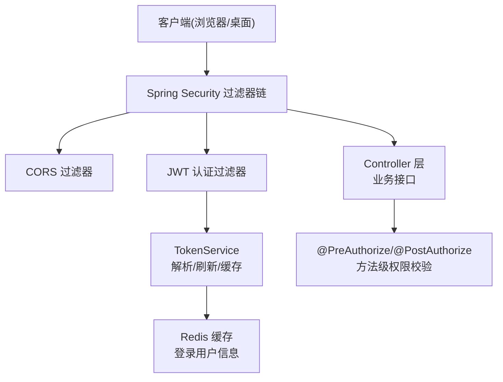
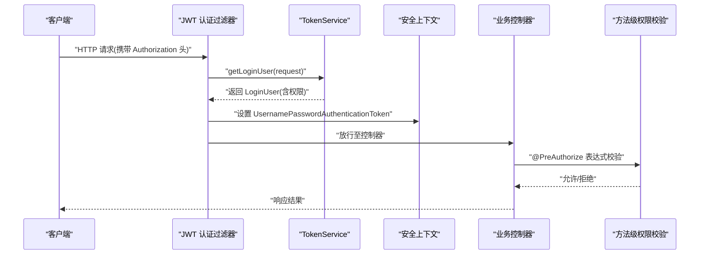
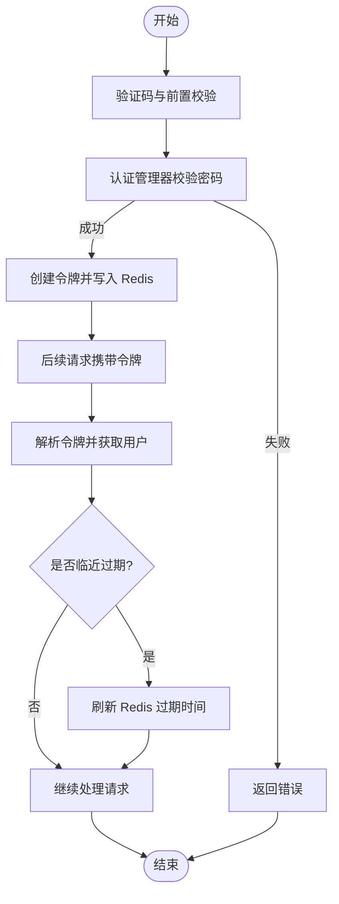
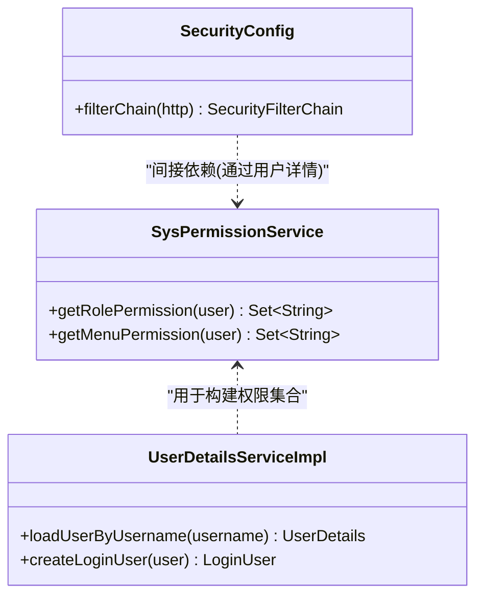
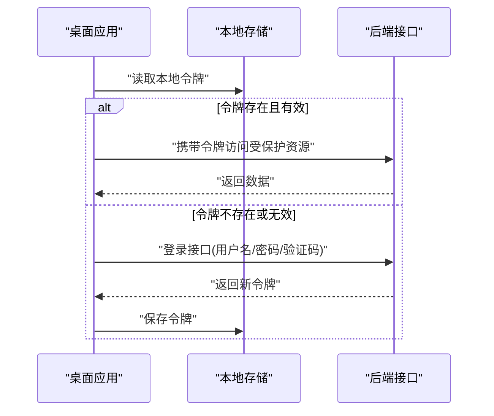
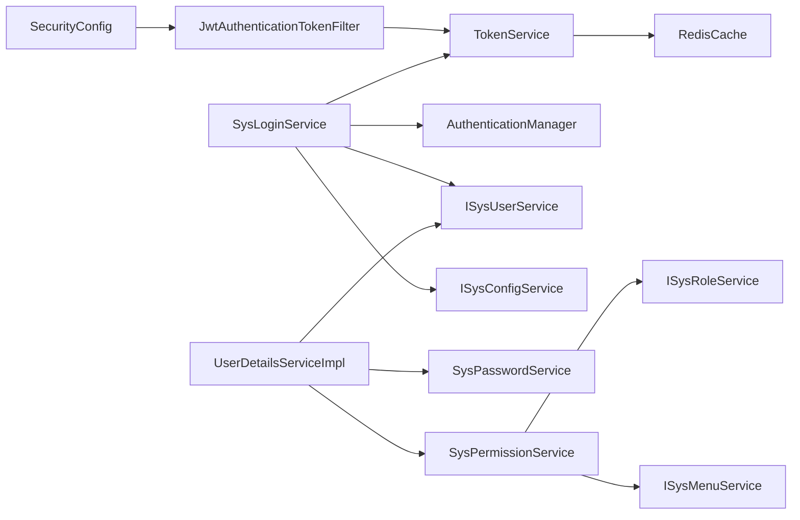

# 认证与授权机制

<cite>
**本文引用的文件**
- [SecurityConfig.java](file://PezMax-Backend/ruoyi-framework/src/main/java/com/ruoyi/framework/config/SecurityConfig.java)
- [JwtAuthenticationTokenFilter.java](file://PezMax-Backend/ruoyi-framework/src/main/java/com/ruoyi/framework/security/filter/JwtAuthenticationTokenFilter.java)
- [TokenService.java](file://PezMax-Backend/ruoyi-framework/src/main/java/com/ruoyi/framework/web/service/TokenService.java)
- [SysLoginService.java](file://PezMax-Backend/ruoyi-framework/src/main/java/com/ruoyi/framework/web/service/SysLoginService.java)
- [UserDetailsServiceImpl.java](file://PezMax-Backend/ruoyi-framework/src/main/java/com/ruoyi/framework/web/service/UserDetailsServiceImpl.java)
- [SysPermissionService.java](file://PezMax-Backend/ruoyi-framework/src/main/java/com/ruoyi/framework/web/service/SysPermissionService.java)
- [pezmaxAuth.js](file://PezMax-Desktop/src/renderer/constants/pezmaxAuth.js)
</cite>

## 目录
1. [简介](#简介)
2. [项目结构](#项目结构)
3. [核心组件](#核心组件)
4. [架构总览](#架构总览)
5. [详细组件分析](#详细组件分析)
6. [依赖关系分析](#依赖关系分析)
7. [性能考虑](#性能考虑)
8. [故障排查指南](#故障排查指南)
9. [结论](#结论)
10. [附录](#附录)

## 简介
本文件系统性阐述 PezMax-One 系统的认证与授权机制，重点覆盖：
- 基于 JWT 的无状态认证：登录校验、令牌生成与刷新、过期处理、存储与传输安全。
- 基于角色的访问控制（RBAC）：角色与权限模型、方法级注解验证、URL 级别访问控制。
- 桌面应用中的认证流程：本地令牌存储、自动登录与会话管理。
- 权限配置示例、自定义权限验证器实现思路与常见问题解决方案。
- 安全最佳实践与性能优化建议。

## 项目结构
后端采用 Spring Security + JWT 的无状态认证方案，结合 Redis 缓存用户会话信息；前端（Web 与桌面端）通过请求头携带令牌进行鉴权。关键模块如下：
- 安全配置与安全过滤器链：定义匿名访问白名单、JWT 过滤器、异常处理与退出处理。
- 认证服务：验证码校验、前置校验、密码校验、登录成功后的令牌签发。
- 用户详情加载：从数据库加载用户并组装权限集合。
- 权限服务：根据用户角色计算角色权限与菜单权限。
- 令牌服务：令牌创建、解析、刷新、Redis 中用户会话维护。
- 桌面端常量：客户端品牌、模式、角色与权限标识、路由常量等。

图表来源
- [SecurityConfig.java:86-120](file://PezMax-Backend/ruoyi-framework/src/main/java/com/ruoyi/framework/config/SecurityConfig.java#L86-L120)
- [JwtAuthenticationTokenFilter.java:30-43](file://PezMax-Backend/ruoyi-framework/src/main/java/com/ruoyi/framework/security/filter/JwtAuthenticationTokenFilter.java#L30-L43)
- [TokenService.java:62-83](file://PezMax-Backend/ruoyi-framework/src/main/java/com/ruoyi/framework/web/service/TokenService.java#L62-L83)

章节来源
- [SecurityConfig.java:86-120](file://PezMax-Backend/ruoyi-framework/src/main/java/com/ruoyi/framework/config/SecurityConfig.java#L86-L120)
- [JwtAuthenticationTokenFilter.java:30-43](file://PezMax-Backend/ruoyi-framework/src/main/java/com/ruoyi/framework/security/filter/JwtAuthenticationTokenFilter.java#L30-L43)
- [TokenService.java:62-83](file://PezMax-Backend/ruoyi-framework/src/main/java/com/ruoyi/framework/web/service/TokenService.java#L62-L83)

## 核心组件
- 安全配置与安全过滤器链
  - 启用方法级安全注解，禁用 CSRF，设置无状态会话策略，注册 JWT 过滤器与 CORS 过滤器，配置匿名访问白名单与全局认证要求。
- JWT 认证过滤器
  - 从请求头提取令牌，解析并获取登录用户，若未过期则更新安全上下文，供后续权限校验使用。
- 令牌服务
  - 负责令牌创建、解析、刷新与过期判断；将登录用户信息持久化到 Redis，键名包含 UUID，支持按令牌删除。
- 登录服务
  - 验证码校验、登录前置校验（用户名/密码长度、黑名单）、调用 AuthenticationManager 完成密码校验，成功后签发令牌。
- 用户详情服务
  - 根据用户名加载用户，检查删除/停用状态，组装 LoginUser 并附带权限集合。
- 权限服务
  - 根据用户角色计算角色权限与菜单权限，管理员拥有超级权限与全部权限。
- 桌面端认证常量
  - 集中定义客户端品牌、认证模式、角色与权限标识、路由常量，便于前后端统一约定。

章节来源
- [SecurityConfig.java:27-120](file://PezMax-Backend/ruoyi-framework/src/main/java/com/ruoyi/framework/config/SecurityConfig.java#L27-L120)
- [JwtAuthenticationTokenFilter.java:24-43](file://PezMax-Backend/ruoyi-framework/src/main/java/com/ruoyi/framework/security/filter/JwtAuthenticationTokenFilter.java#L24-L43)
- [TokenService.java:114-155](file://PezMax-Backend/ruoyi-framework/src/main/java/com/ruoyi/framework/web/service/TokenService.java#L114-L155)
- [SysLoginService.java:63-100](file://PezMax-Backend/ruoyi-framework/src/main/java/com/ruoyi/framework/web/service/SysLoginService.java#L63-L100)
- [UserDetailsServiceImpl.java:38-65](file://PezMax-Backend/ruoyi-framework/src/main/java/com/ruoyi/framework/web/service/UserDetailsServiceImpl.java#L38-L65)
- [SysPermissionService.java:37-88](file://PezMax-Backend/ruoyi-framework/src/main/java/com/ruoyi/framework/web/service/SysPermissionService.java#L37-L88)
- [pezmaxAuth.js:1-29](file://PezMax-Desktop/src/renderer/constants/pezmaxAuth.js#L1-L29)

## 架构总览
下图展示一次受保护接口的完整调用链路：客户端携带令牌发起请求，经过 CORS 与 JWT 过滤器，解析并校验令牌，建立安全上下文后进入业务控制器与方法级权限校验。

图表来源
- [JwtAuthenticationTokenFilter.java:30-43](file://PezMax-Backend/ruoyi-framework/src/main/java/com/ruoyi/framework/security/filter/JwtAuthenticationTokenFilter.java#L30-L43)
- [TokenService.java:62-83](file://PezMax-Backend/ruoyi-framework/src/main/java/com/ruoyi/framework/web/service/TokenService.java#L62-L83)
- [SecurityConfig.java:86-120](file://PezMax-Backend/ruoyi-framework/src/main/java/com/ruoyi/framework/config/SecurityConfig.java#L86-L120)

## 详细组件分析

### 基于 JWT 的无状态认证
- 登录流程
  - 验证码校验与前置校验通过后，调用认证管理器完成密码校验；成功后由令牌服务签发令牌，并将用户信息写入 Redis。
- 令牌生成策略
  - 令牌载荷包含用户唯一标识与用户名；签名算法为 HS512；令牌有效期可配置。
- 令牌存储与传输
  - 服务端以 Redis 缓存登录用户信息，键名为固定前缀加 UUID；客户端在请求头携带令牌，过滤器解析并校验。
- 令牌刷新与过期处理
  - 每次请求时若剩余有效期不足阈值，自动刷新 Redis 中的过期时间；过期或非法令牌将被拒绝。
- 登出与清理
  - 提供登出接口，删除 Redis 中的用户会话记录。

图表来源
- [SysLoginService.java:63-100](file://PezMax-Backend/ruoyi-framework/src/main/java/com/ruoyi/framework/web/service/SysLoginService.java#L63-L100)
- [TokenService.java:114-155](file://PezMax-Backend/ruoyi-framework/src/main/java/com/ruoyi/framework/web/service/TokenService.java#L114-L155)
- [TokenService.java:133-141](file://PezMax-Backend/ruoyi-framework/src/main/java/com/ruoyi/framework/web/service/TokenService.java#L133-L141)

章节来源
- [SysLoginService.java:63-100](file://PezMax-Backend/ruoyi-framework/src/main/java/com/ruoyi/framework/web/service/SysLoginService.java#L63-L100)
- [TokenService.java:114-155](file://PezMax-Backend/ruoyi-framework/src/main/java/com/ruoyi/framework/web/service/TokenService.java#L114-L155)
- [TokenService.java:133-141](file://PezMax-Backend/ruoyi-framework/src/main/java/com/ruoyi/framework/web/service/TokenService.java#L133-L141)
- [SecurityConfig.java:86-120](file://PezMax-Backend/ruoyi-framework/src/main/java/com/ruoyi/framework/config/SecurityConfig.java#L86-L120)

### 基于角色的访问控制（RBAC）
- 角色与权限模型
  - 管理员拥有超级角色与全部权限；普通用户通过角色关联菜单权限，动态计算权限集合。
- 方法级权限验证
  - 启用 @PreAuthorize 与 @PostAuthorize，可在控制器方法上声明权限表达式进行细粒度控制。
- URL 级别访问控制
  - 通过安全配置中的白名单与 anyRequest().authenticated() 实现全局鉴权与匿名访问控制。

图表来源
- [SysPermissionService.java:37-88](file://PezMax-Backend/ruoyi-framework/src/main/java/com/ruoyi/framework/web/service/SysPermissionService.java#L37-L88)
- [UserDetailsServiceImpl.java:38-65](file://PezMax-Backend/ruoyi-framework/src/main/java/com/ruoyi/framework/web/service/UserDetailsServiceImpl.java#L38-L65)
- [SecurityConfig.java:86-120](file://PezMax-Backend/ruoyi-framework/src/main/java/com/ruoyi/framework/config/SecurityConfig.java#L86-L120)

章节来源
- [SysPermissionService.java:37-88](file://PezMax-Backend/ruoyi-framework/src/main/java/com/ruoyi/framework/web/service/SysPermissionService.java#L37-L88)
- [UserDetailsServiceImpl.java:38-65](file://PezMax-Backend/ruoyi-framework/src/main/java/com/ruoyi/framework/web/service/UserDetailsServiceImpl.java#L38-L65)
- [SecurityConfig.java:86-120](file://PezMax-Backend/ruoyi-framework/src/main/java/com/ruoyi/framework/config/SecurityConfig.java#L86-L120)

### 桌面应用中的认证流程
- 本地令牌存储
  - 桌面端渲染进程在登录后保存令牌，并在后续请求中注入到请求头。
- 自动登录与会话管理
  - 启动时读取本地令牌，若有效则自动登录；过期时引导重新登录。
- 客户端角色与权限
  - 通过常量集中定义客户端角色与权限标识，便于在路由与指令中进行权限控制。

图表来源
- [pezmaxAuth.js:1-29](file://PezMax-Desktop/src/renderer/constants/pezmaxAuth.js#L1-L29)
- [TokenService.java:62-83](file://PezMax-Backend/ruoyi-framework/src/main/java/com/ruoyi/framework/web/service/TokenService.java#L62-L83)

章节来源
- [pezmaxAuth.js:1-29](file://PezMax-Desktop/src/renderer/constants/pezmaxAuth.js#L1-L29)
- [TokenService.java:62-83](file://PezMax-Backend/ruoyi-framework/src/main/java/com/ruoyi/framework/web/service/TokenService.java#L62-L83)

## 依赖关系分析
- 组件耦合与内聚
  - 安全配置集中管理过滤器链与匿名访问策略，职责清晰；JWT 过滤器仅负责解析与上下文设置；令牌服务专注令牌生命周期与缓存；登录服务编排验证码、前置校验与认证；用户详情服务负责用户加载与权限装配；权限服务负责角色与菜单权限计算。
- 直接依赖
  - JwtAuthenticationTokenFilter 依赖 TokenService；TokenService 依赖 RedisCache；SysLoginService 依赖 AuthenticationManager、TokenService、ISysUserService、ISysConfigService；UserDetailsServiceImpl 依赖 ISysUserService、SysPasswordService、SysPermissionService。
- 外部依赖
  - Spring Security、JWT 库、Redis 缓存。

图表来源
- [SecurityConfig.java:86-120](file://PezMax-Backend/ruoyi-framework/src/main/java/com/ruoyi/framework/config/SecurityConfig.java#L86-L120)
- [JwtAuthenticationTokenFilter.java:30-43](file://PezMax-Backend/ruoyi-framework/src/main/java/com/ruoyi/framework/security/filter/JwtAuthenticationTokenFilter.java#L30-L43)
- [TokenService.java:62-83](file://PezMax-Backend/ruoyi-framework/src/main/java/com/ruoyi/framework/web/service/TokenService.java#L62-L83)
- [SysLoginService.java:63-100](file://PezMax-Backend/ruoyi-framework/src/main/java/com/ruoyi/framework/web/service/SysLoginService.java#L63-L100)
- [UserDetailsServiceImpl.java:38-65](file://PezMax-Backend/ruoyi-framework/src/main/java/com/ruoyi/framework/web/service/UserDetailsServiceImpl.java#L38-L65)
- [SysPermissionService.java:37-88](file://PezMax-Backend/ruoyi-framework/src/main/java/com/ruoyi/framework/web/service/SysPermissionService.java#L37-L88)

章节来源
- [SecurityConfig.java:86-120](file://PezMax-Backend/ruoyi-framework/src/main/java/com/ruoyi/framework/config/SecurityConfig.java#L86-L120)
- [JwtAuthenticationTokenFilter.java:30-43](file://PezMax-Backend/ruoyi-framework/src/main/java/com/ruoyi/framework/security/filter/JwtAuthenticationTokenFilter.java#L30-L43)
- [TokenService.java:62-83](file://PezMax-Backend/ruoyi-framework/src/main/java/com/ruoyi/framework/web/service/TokenService.java#L62-L83)
- [SysLoginService.java:63-100](file://PezMax-Backend/ruoyi-framework/src/main/java/com/ruoyi/framework/web/service/SysLoginService.java#L63-L100)
- [UserDetailsServiceImpl.java:38-65](file://PezMax-Backend/ruoyi-framework/src/main/java/com/ruoyi/framework/web/service/UserDetailsServiceImpl.java#L38-L65)
- [SysPermissionService.java:37-88](file://PezMax-Backend/ruoyi-framework/src/main/java/com/ruoyi/framework/web/service/SysPermissionService.java#L37-L88)

## 性能考虑
- 令牌刷新策略
  - 在接近过期阈值时刷新 Redis 中的过期时间，减少频繁重签发的开销，提升用户体验。
- 缓存命中路径
  - 请求解析令牌后直接从 Redis 获取用户信息，避免重复查询数据库。
- 静态资源与匿名接口
  - 合理配置匿名访问白名单，降低不必要的鉴权成本。
- 并发与扩展性
  - 无状态设计利于水平扩展；Redis 作为共享缓存需关注连接池与序列化开销。

[本节为通用指导，不直接分析具体文件]

## 故障排查指南
- 常见错误与定位
  - 验证码过期或错误：检查验证码生成与校验逻辑、Redis 中验证码键值是否存在。
  - 用户不存在/已删除/已停用：确认用户状态字段与删除标记。
  - 密码不匹配：核对密码加密方式与输入。
  - IP 黑名单拦截：检查黑名单配置与当前请求 IP。
  - 令牌无效或过期：检查请求头是否正确携带令牌、令牌签名与有效期配置。
- 日志与监控
  - 登录成功/失败异步记录，便于审计与问题追踪。
- 处理建议
  - 确保 Redis 可用且键空间正确；调整令牌有效期与刷新阈值；完善错误消息国际化提示。

章节来源
- [SysLoginService.java:110-165](file://PezMax-Backend/ruoyi-framework/src/main/java/com/ruoyi/framework/web/service/SysLoginService.java#L110-L165)
- [UserDetailsServiceImpl.java:38-65](file://PezMax-Backend/ruoyi-framework/src/main/java/com/ruoyi/framework/web/service/UserDetailsServiceImpl.java#L38-L65)

## 结论
PezMax-One 采用 Spring Security + JWT 的无状态认证与 RBAC 权限模型，结合 Redis 缓存实现高效的用户会话管理与细粒度权限控制。系统通过安全过滤器链与方法级注解实现统一的鉴权入口，桌面端通过常量与本地存储协同完成自动登录与会话管理。建议在部署中强化密钥管理、HTTPS 传输、限流与审计，以提升整体安全性与稳定性。

[本节为总结性内容，不直接分析具体文件]

## 附录

### 权限配置示例
- URL 级别
  - 在安全配置中声明匿名访问白名单与全局认证要求。
- 方法级别
  - 在控制器方法上使用 @PreAuthorize 与 @PostAuthorize 表达式，基于角色与权限标识进行校验。
- 桌面端
  - 使用客户端角色与权限常量进行路由与指令级别的权限控制。

章节来源
- [SecurityConfig.java:86-120](file://PezMax-Backend/ruoyi-framework/src/main/java/com/ruoyi/framework/config/SecurityConfig.java#L86-L120)
- [pezmaxAuth.js:1-29](file://PezMax-Desktop/src/renderer/constants/pezmaxAuth.js#L1-L29)

### 自定义权限验证器实现方法
- 自定义表达式处理器
  - 扩展 Spring Security 表达式，注册自定义函数或属性，以便在 @PreAuthorize 中使用业务语义化的表达式。
- 权限决策器
  - 实现 AccessDecisionManager 或自定义投票器，集成外部权限源（如配置中心或规则引擎）。
- 方法后置处理
  - 使用 @PostAuthorize 对返回值进行二次校验，确保数据级权限控制。

[本节为通用指导，不直接分析具体文件]

### 安全最佳实践
- 密钥管理
  - 使用环境变量或密钥管理服务存放令牌签名密钥，避免硬编码。
- 传输安全
  - 全站启用 HTTPS，防止中间人攻击与令牌泄露。
- 令牌安全
  - 限制令牌载荷最小化，避免敏感信息入载荷；定期轮换密钥与令牌有效期。
- 防暴力破解
  - 启用验证码、登录失败计数与锁定策略、IP 黑名单与速率限制。
- 审计与合规
  - 记录登录与操作日志，满足审计与合规要求。

[本节为通用指导，不直接分析具体文件]