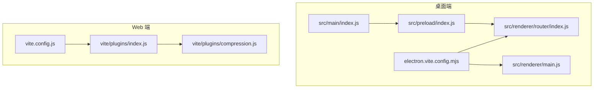
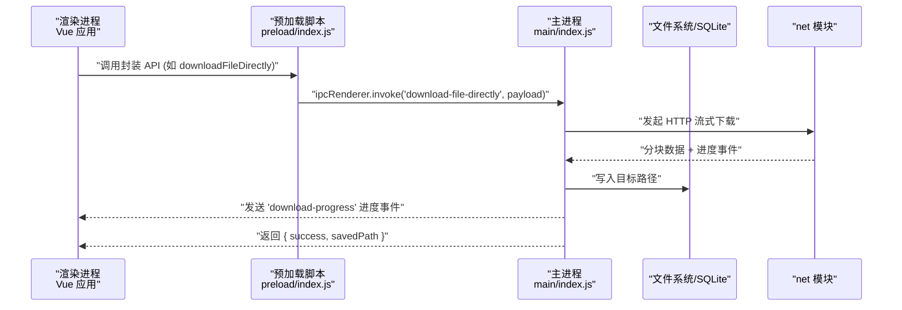
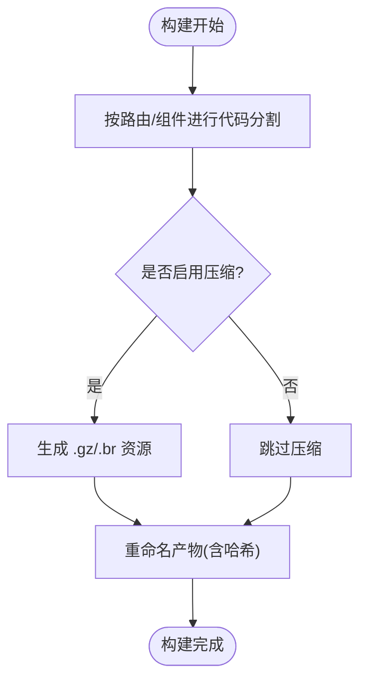
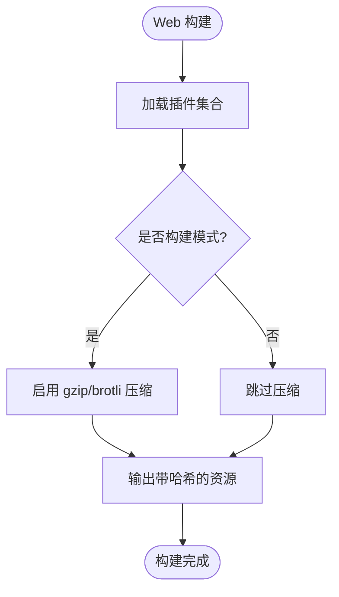
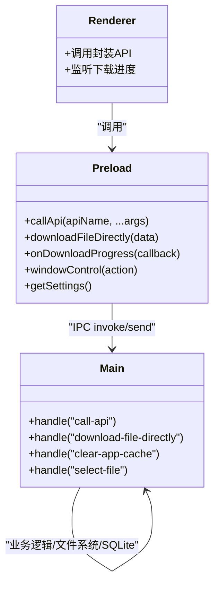
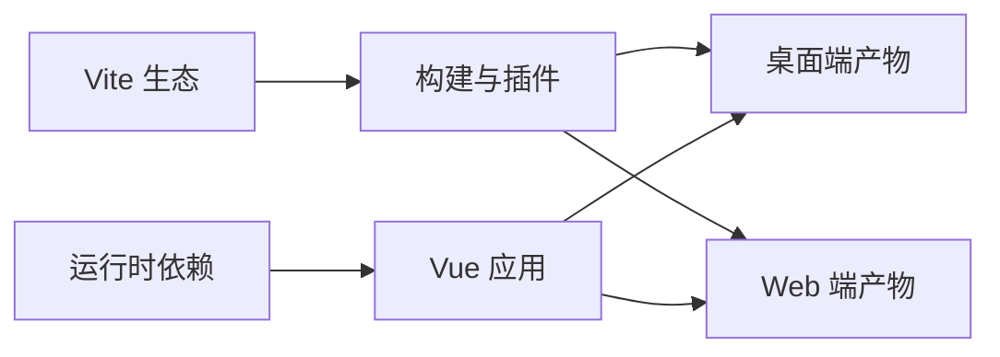

# 前端性能优化

<cite>
**本文引用的文件**
- [electron.vite.config.mjs](file://PezMax-Desktop/electron.vite.config.mjs)
- [package.json](file://PezMax-Desktop/package.json)
- [src/main/index.js](file://PezMax-Desktop/src/main/index.js)
- [src/preload/index.js](file://PezMax-Desktop/src/preload/index.js)
- [src/renderer/router/index.js](file://PezMax-Desktop/src/renderer/router/index.js)
- [src/renderer/main.js](file://PezMax-Desktop/src/renderer/main.js)
- [vite.config.js](file://PezMax-Backend/ruoyi-ui/vite.config.js)
- [vite/plugins/index.js](file://PezMax-Backend/ruoyi-ui/vite/plugins/index.js)
- [vite/plugins/compression.js](file://PezMax-Backend/ruoyi-ui/vite/plugins/compression.js)
</cite>

## 目录
1. [引言](#引言)
2. [项目结构](#项目结构)
3. [核心组件](#核心组件)
4. [架构总览](#架构总览)
5. [详细组件分析](#详细组件分析)
6. [依赖分析](#依赖分析)
7. [性能考量](#性能考量)
8. [故障排查指南](#故障排查指南)
9. [结论](#结论)
10. [附录](#附录)

## 引言
本文件面向 PezMax-One 系统的前端性能优化，覆盖以下方面：
- Vite 构建配置优化：代码分割、懒加载、资源压缩与产物命名策略
- Electron 桌面端优化：主进程与渲染进程通信、内存管理、GPU 加速建议
- Web 前端优化：静态资源 CDN、浏览器缓存、网络请求优化
- Vue 3 应用优化：组件懒加载、虚拟滚动、响应式数据优化
- 前端监控指标与质量保障：性能采集、分析工具、用户体验度量
- 跨平台兼容性与移动端适配建议

## 项目结构
本项目包含两个前端入口：
- 桌面端（Electron + Vite）：位于 PezMax-Desktop
- Web 端（Vue 3 + Vite）：位于 PezMax-Backend/ruoyi-ui

图表来源
- [electron.vite.config.mjs:1-121](file://PezMax-Desktop/electron.vite.config.mjs#L1-L121)
- [src/main/index.js:1-800](file://PezMax-Desktop/src/main/index.js#L1-L800)
- [src/preload/index.js:1-65](file://PezMax-Desktop/src/preload/index.js#L1-L65)
- [src/renderer/router/index.js:1-111](file://PezMax-Desktop/src/renderer/router/index.js#L1-L111)
- [src/renderer/main.js:1-85](file://PezMax-Desktop/src/renderer/main.js#L1-L85)
- [vite.config.js:1-80](file://PezMax-Backend/ruoyi-ui/vite.config.js#L1-L80)
- [vite/plugins/index.js:1-16](file://PezMax-Backend/ruoyi-ui/vite/plugins/index.js#L1-L16)
- [vite/plugins/compression.js:1-29](file://PezMax-Backend/ruoyi-ui/vite/plugins/compression.js#L1-L29)

章节来源
- [electron.vite.config.mjs:1-121](file://PezMax-Desktop/electron.vite.config.mjs#L1-L121)
- [vite.config.js:1-80](file://PezMax-Backend/ruoyi-ui/vite.config.js#L1-L80)

## 核心组件
- 构建与插件
  - 桌面端：基于 electron-vite 的 Vite 配置，启用 SVG 图标、自动导入、Gzip/Brotli 压缩等
  - Web 端：Vite 基础配置与插件聚合，按需开启 gzip/brotli 压缩
- 路由与懒加载
  - 桌面端使用 createWebHashHistory 并采用动态 import 实现页面级懒加载
- IPC 通信
  - 通过 preload 暴露安全 API，主进程集中处理系统能力（文件、下载、窗口控制、更新等）
- 打包产物与缓存
  - 统一输出目录与资源命名策略，便于 CDN 与浏览器缓存命中

章节来源
- [electron.vite.config.mjs:33-100](file://PezMax-Desktop/electron.vite.config.mjs#L33-L100)
- [vite.config.js:28-42](file://PezMax-Backend/ruoyi-ui/vite.config.js#L28-L42)
- [src/renderer/router/index.js:25-93](file://PezMax-Desktop/src/renderer/router/index.js#L25-L93)
- [src/preload/index.js:1-65](file://PezMax-Desktop/src/preload/index.js#L1-L65)
- [src/main/index.js:292-305](file://PezMax-Desktop/src/main/index.js#L292-L305)

## 架构总览
下图展示桌面端从主进程到渲染进程的调用链路与关键优化点。

图表来源
- [src/preload/index.js:31-32](file://PezMax-Desktop/src/preload/index.js#L31-L32)
- [src/main/index.js:528-608](file://PezMax-Desktop/src/main/index.js#L528-L608)

## 详细组件分析

### Vite 构建配置优化（桌面端）
- 代码分割与产物命名
  - 通过 rollupOptions.output 自定义 chunk/entry/asset 文件名，利于缓存与 CDN 版本化
  - 设置 chunkSizeWarningLimit 避免大包未拆分
- 懒加载与路由级分包
  - 路由组件使用动态 import，首次只加载必要代码
- 资源压缩
  - 启用 vite-plugin-compression，在构建时生成 .gz/.br 静态资源
- 开发体验
  - 开发代理转发后端接口，减少跨域问题
  - 关闭 sourcemap 生产构建，减小体积；开发环境 inline 便于调试

图表来源
- [electron.vite.config.mjs:87-100](file://PezMax-Desktop/electron.vite.config.mjs#L87-L100)
- [electron.vite.config.mjs:51-54](file://PezMax-Desktop/electron.vite.config.mjs#L51-L54)
- [src/renderer/router/index.js:25-93](file://PezMax-Desktop/src/renderer/router/index.js#L25-L93)

章节来源
- [electron.vite.config.mjs:33-100](file://PezMax-Desktop/electron.vite.config.mjs#L33-L100)
- [src/renderer/router/index.js:25-93](file://PezMax-Desktop/src/renderer/router/index.js#L25-L93)

### Vite 构建配置优化（Web 端）
- 插件聚合与条件启用
  - 通过 createVitePlugins 聚合 vue、auto-import、svg-icon、compression 等插件
  - 仅在构建模式启用压缩插件
- 产物命名与分包
  - 与桌面端一致的 output 命名策略，便于统一缓存策略
- 开发代理
  - 将 /dev-api 与 OpenAPI 文档路径代理至后端

图表来源
- [vite/plugins/index.js:8-15](file://PezMax-Backend/ruoyi-ui/vite/plugins/index.js#L8-L15)
- [vite/plugins/compression.js:3-28](file://PezMax-Backend/ruoyi-ui/vite/plugins/compression.js#L3-L28)
- [vite.config.js:28-42](file://PezMax-Backend/ruoyi-ui/vite.config.js#L28-L42)

章节来源
- [vite.config.js:1-80](file://PezMax-Backend/ruoyi-ui/vite.config.js#L1-L80)
- [vite/plugins/index.js:1-16](file://PezMax-Backend/ruoyi-ui/vite/plugins/index.js#L1-L16)
- [vite/plugins/compression.js:1-29](file://PezMax-Backend/ruoyi-ui/vite/plugins/compression.js#L1-L29)

### Electron 主进程与渲染进程通信优化
- 安全与最小暴露面
  - 通过 contextBridge 仅暴露必要 API，避免直接访问 Node/Electron 内部对象
- 统一 IPC 入口
  - 使用统一的 call-api 通道分发业务方法，便于权限与日志审计
- 大文件下载
  - 使用 net 模块流式下载，边下边写磁盘，降低内存峰值
  - 通过事件推送下载进度，提升交互体验
- 窗口与系统能力
  - 提供窗口控制、文件选择、文件夹读取、背景图选择等能力

图表来源
- [src/preload/index.js:14-56](file://PezMax-Desktop/src/preload/index.js#L14-L56)
- [src/main/index.js:292-305](file://PezMax-Desktop/src/main/index.js#L292-L305)
- [src/main/index.js:528-608](file://PezMax-Desktop/src/main/index.js#L528-L608)

章节来源
- [src/preload/index.js:1-65](file://PezMax-Desktop/src/preload/index.js#L1-L65)
- [src/main/index.js:292-305](file://PezMax-Desktop/src/main/index.js#L292-L305)
- [src/main/index.js:528-608](file://PezMax-Desktop/src/main/index.js#L528-L608)

### Vue 3 应用性能优化
- 组件懒加载
  - 路由级动态 import 已启用，确保首屏最小化
- 全局组件与指令
  - 在 main.js 中注册常用组件与全局方法，减少重复引入开销
- 响应式数据优化
  - 结合 Pinia 与按需引入，避免不必要的响应式开销
- 列表与大数据渲染
  - 对长列表建议使用虚拟滚动方案（例如 vuedraggable 配合分页或虚拟列表库），避免一次性渲染大量节点

章节来源
- [src/renderer/router/index.js:25-93](file://PezMax-Desktop/src/renderer/router/index.js#L25-L93)
- [src/renderer/main.js:45-84](file://PezMax-Desktop/src/renderer/main.js#L45-L84)
- [package.json:47-52](file://PezMax-Desktop/package.json#L47-L52)

### 资源压缩与缓存策略
- 构建期压缩
  - 桌面端：vite-plugin-compression 在构建时生成 .gz/.br
  - Web 端：根据环境变量决定是否启用 gzip/brotli
- 产物命名与 CDN
  - 统一使用 [hash] 命名，利于长期缓存与增量更新
- 浏览器缓存
  - 建议为静态资源设置强缓存（Cache-Control: max-age=...），HTML 不缓存或短缓存
- 服务端支持
  - 若使用 Nginx/Apache，需开启对应压缩模块并正确响应 Accept-Encoding

章节来源
- [electron.vite.config.mjs:51-54](file://PezMax-Desktop/electron.vite.config.mjs#L51-L54)
- [vite/plugins/compression.js:3-28](file://PezMax-Backend/ruoyi-ui/vite/plugins/compression.js#L3-L28)
- [electron.vite.config.mjs:93-99](file://PezMax-Desktop/electron.vite.config.mjs#L93-L99)
- [vite.config.js:35-41](file://PezMax-Backend/ruoyi-ui/vite.config.js#L35-L41)

### 网络请求优化
- 开发代理
  - 通过 Vite server.proxy 将 /dev-api 与 OpenAPI 路径转发至后端，避免跨域
- 生产环境
  - 建议通过反向代理或网关统一转发，减少客户端跨域配置复杂度
- 请求合并与去抖
  - 对高频小请求进行合并与去抖，减少网络抖动与服务器压力

章节来源
- [electron.vite.config.mjs:71-86](file://PezMax-Desktop/electron.vite.config.mjs#L71-L86)
- [vite.config.js:44-61](file://PezMax-Backend/ruoyi-ui/vite.config.js#L44-L61)

### GPU 加速与渲染优化（Electron）
- 启用硬件加速
  - 建议在 BrowserWindow 的 webPreferences 中启用 GPU 加速（如 enableBlinkFeatures 相关选项），以提升复杂 UI 渲染性能
- 减少重排重绘
  - 合理使用 CSS transform/opacity 动画，避免频繁修改布局属性
- 图片与媒体
  - 优先使用现代格式（WebP/AVIF），按需加载与懒加载大图

[本节为通用优化建议，不直接分析具体文件]

### 内存管理与清理
- 版本更新后强制清理缓存
  - 启动时检测版本变化，清理 WebContents 缓存与部分存储数据，避免旧资源污染
- 用户主动清理
  - 提供“清除应用缓存”能力，释放 IndexedDB/Cookies/ServiceWorker 等资源
- 下载任务
  - 流式下载+即时落盘，避免在内存中累积大文件

章节来源
- [src/main/index.js:95-119](file://PezMax-Desktop/src/main/index.js#L95-L119)
- [src/main/index.js:333-352](file://PezMax-Desktop/src/main/index.js#L333-L352)
- [src/main/index.js:528-608](file://PezMax-Desktop/src/main/index.js#L528-L608)

### 前端监控指标与质量保障
- 指标采集
  - 首屏时间、可交互时间、最大内容绘制、累计布局偏移等
- 错误监控
  - 捕获 JS 异常、Promise 未处理拒绝、网络失败等
- 性能分析
  - 使用 Chrome DevTools Performance/Lighthouse 进行基准测试与瓶颈定位
- 持续集成
  - 在 CI 中加入构建产物体积阈值与 Lighthouse 评分门禁

[本节为通用实践建议，不直接分析具体文件]

### 跨平台兼容性与移动端适配
- 跨平台
  - 注意不同平台的快捷键、路径分隔符、字体与编码差异
  - 针对 Windows/macOS/Linux 分别验证窗口行为与更新流程
- 移动端适配
  - 桌面端以固定尺寸为主，必要时提供响应式布局与触摸友好控件
  - 对于 Web 端，遵循移动端视口与触控规范，优化输入与滚动体验

[本节为通用实践建议，不直接分析具体文件]

## 依赖分析
- 构建与打包
  - electron-vite、vite、@vitejs/plugin-vue、unplugin-auto-import、vite-plugin-svg-icons、vite-plugin-compression
- 运行时
  - Vue 3、Element Plus、Pinia、Vue Router、ECharts、electron-updater、axios 等

图表来源
- [package.json:54-76](file://PezMax-Desktop/package.json#L54-L76)
- [electron.vite.config.mjs:1-10](file://PezMax-Desktop/electron.vite.config.mjs#L1-L10)
- [vite.config.js:1-16](file://PezMax-Backend/ruoyi-ui/vite.config.js#L1-L16)

章节来源
- [package.json:28-76](file://PezMax-Desktop/package.json#L28-L76)
- [electron.vite.config.mjs:1-10](file://PezMax-Desktop/electron.vite.config.mjs#L1-L10)
- [vite.config.js:1-16](file://PezMax-Backend/ruoyi-ui/vite.config.js#L1-L16)

## 性能考量
- 构建阶段
  - 合理拆分路由与第三方库，避免单包过大
  - 启用 gzip/brotli，配合 CDN 与浏览器缓存
- 运行阶段
  - 减少主线程阻塞，使用 Web Worker 处理重型计算
  - 图片与媒体资源按需加载，使用懒加载与占位图
- 网络阶段
  - 合并请求、缓存复用、断点续传（大文件场景）
- 渲染阶段
  - 减少 DOM 操作频率，使用虚拟列表与防抖节流

[本节为通用指导，不直接分析具体文件]

## 故障排查指南
- 常见问题
  - 构建产物体积过大：检查是否有未拆分的第三方库或未启用的 tree-shaking
  - 缓存导致功能异常：使用“清除应用缓存”或版本更新后的自动清理
  - 下载失败：检查网络状态、鉴权头与目标路径权限
- 诊断手段
  - 打开 DevTools 查看 Network/Performance/Console
  - 使用 Lighthouse 评估性能与可访问性
  - 对比不同设备/网络的基线数据，定位回归

章节来源
- [src/main/index.js:333-352](file://PezMax-Desktop/src/main/index.js#L333-L352)
- [src/main/index.js:528-608](file://PezMax-Desktop/src/main/index.js#L528-L608)

## 结论
通过对 Vite 构建、Electron 通信、Vue 3 应用层以及网络与缓存的综合优化，PezMax-One 可在多端环境下获得更优的首屏性能、交互流畅度与稳定性。建议在生产环境持续监控关键指标，结合自动化测试与门禁，形成闭环的性能治理体系。

## 附录
- 术语
  - 代码分割：将应用拆分为多个小块，按需加载
  - 懒加载：在需要时才加载资源或组件
  - 产物命名：为构建产物添加哈希，便于缓存与版本管理
- 参考命令
  - 桌面端构建：参见 package.json 中的 build 脚本
  - Web 端构建：参见 ruoyi-ui 的构建脚本

章节来源
- [package.json:15-26](file://PezMax-Desktop/package.json#L15-L26)