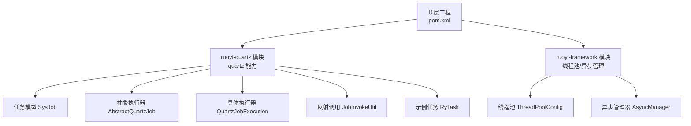
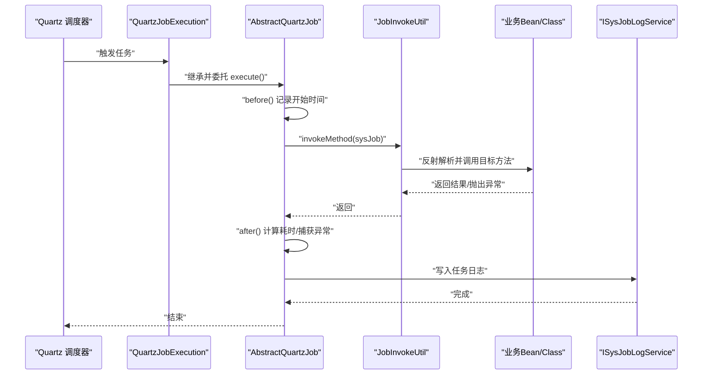
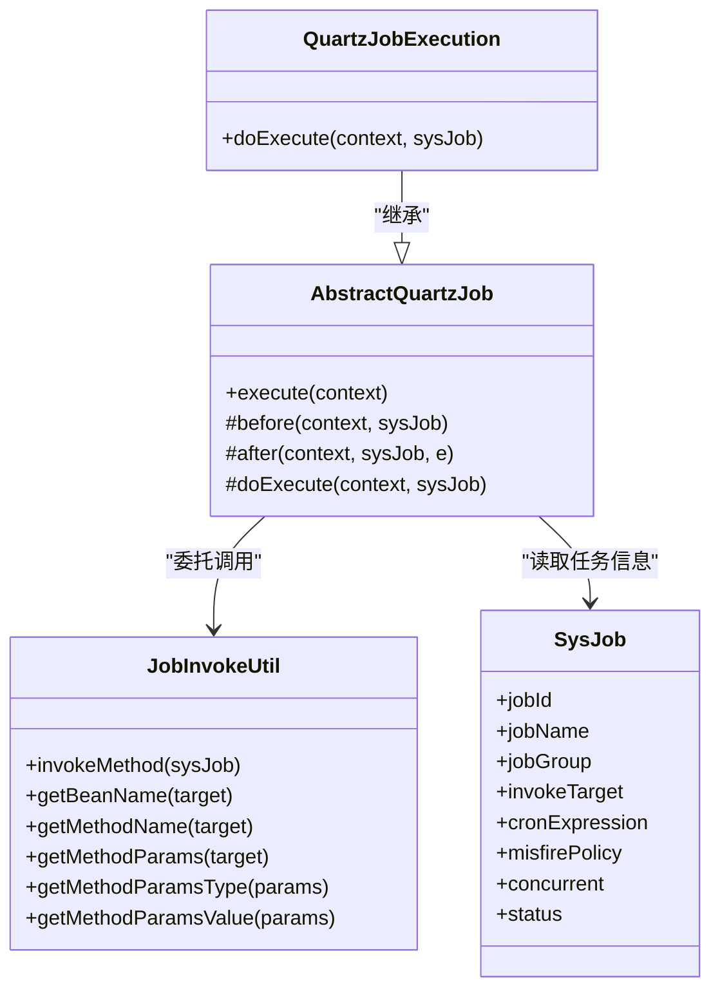
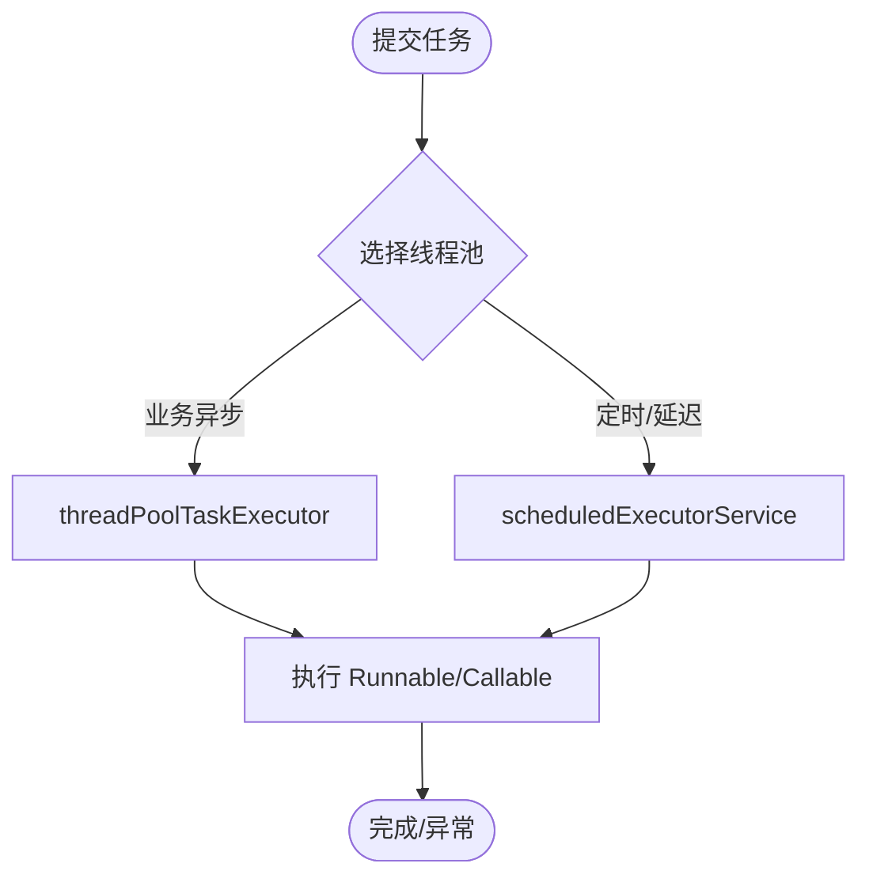
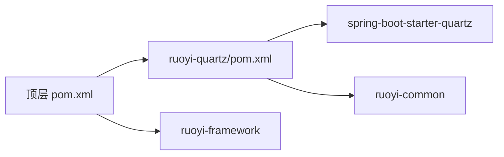

# 异步处理与任务调度

<cite>
**本文引用的文件**   
- [pom.xml](file://PezMax-Backend/pom.xml)
- [ruoyi-quartz/pom.xml](file://PezMax-Backend/ruoyi-quartz/pom.xml)
- [ThreadPoolConfig.java](file://PezMax-Backend/ruoyi-framework/src/main/java/com/ruoyi/framework/config/ThreadPoolConfig.java)
- [AsyncManager.java](file://PezMax-Backend/ruoyi-framework/src/main/java/com/ruoyi/framework/manager/AsyncManager.java)
- [ScheduleConfig.java](file://PezMax-Backend/ruoyi-quartz/src/main/java/com/ruoyi/quartz/config/ScheduleConfig.java)
- [AbstractQuartzJob.java](file://PezMax-Backend/ruoyi-quartz/src/main/java/com/ruoyi/quartz/util/AbstractQuartzJob.java)
- [QuartzJobExecution.java](file://PezMax-Backend/ruoyi-quartz/src/main/java/com/ruoyi/quartz/util/QuartzJobExecution.java)
- [JobInvokeUtil.java](file://PezMax-Backend/ruoyi-quartz/src/main/java/com/ruoyi/quartz/util/JobInvokeUtil.java)
- [RyTask.java](file://PezMax-Backend/ruoyi-quartz/src/main/java/com/ruoyi/quartz/task/RyTask.java)
- [SysJob.java](file://PezMax-Backend/ruoyi-quartz/src/main/java/com/ruoyi/quartz/domain/SysJob.java)
- [ISysJobService.java](file://PezMax-Backend/ruoyi-quartz/src/main/java/com/ruoyi/quartz/service/ISysJobService.java)
</cite>

## 目录
1. [简介](#简介)
2. [项目结构](#项目结构)
3. [核心组件](#核心组件)
4. [架构总览](#架构总览)
5. [详细组件分析](#详细组件分析)
6. [依赖分析](#依赖分析)
7. [性能考虑](#性能考虑)
8. [故障排查指南](#故障排查指南)
9. [结论](#结论)
10. [附录](#附录)

## 简介
本文件面向 PezMax-One 系统的“异步处理与任务调度”能力，聚焦以下方面：
- Quartz 定时任务框架的集成与使用（任务调度配置、任务类型定义、执行策略）
- 异步任务管理机制（线程池配置、任务队列管理、异常处理）
- 批量数据处理方案（大文件处理、数据迁移、报表生成等场景的异步化改造思路）
- 消息队列的使用场景与实现方式（事件驱动、服务间通信、解耦设计）
- 运维保障机制（任务监控、日志记录、失败重试）
- 异步编程最佳实践与性能调优建议

说明：当前仓库已包含 Quartz 模块与通用异步线程池基础设施；消息队列相关代码未在提供的上下文中出现，本节提供概念性指导。

## 项目结构
后端采用多模块 Maven 工程，关键模块关系如下：
- ruoyi-quartz：封装 Quartz 调度能力（任务模型、执行器、工具类、示例任务）
- ruoyi-framework：提供通用基础能力（线程池、异步管理器、安全、缓存等）
- 顶层 pom.xml：统一依赖管理与模块编排，引入 quartz 模块

图表来源
- [pom.xml:177-185](file://PezMax-Backend/pom.xml#L177-L185)
- [ruoyi-quartz/pom.xml:18-32](file://PezMax-Backend/ruoyi-quartz/pom.xml#L18-L32)
- [ThreadPoolConfig.java:17-63](file://PezMax-Backend/ruoyi-framework/src/main/java/com/ruoyi/framework/config/ThreadPoolConfig.java#L17-L63)
- [AsyncManager.java:14-55](file://PezMax-Backend/ruoyi-framework/src/main/java/com/ruoyi/framework/manager/AsyncManager.java#L14-L55)
- [AbstractQuartzJob.java:23-106](file://PezMax-Backend/ruoyi-quartz/src/main/java/com/ruoyi/quartz/util/AbstractQuartzJob.java#L23-L106)
- [QuartzJobExecution.java:12-19](file://PezMax-Backend/ruoyi-quartz/src/main/java/com/ruoyi/quartz/util/QuartzJobExecution.java#L12-L19)
- [JobInvokeUtil.java:16-182](file://PezMax-Backend/ruoyi-quartz/src/main/java/com/ruoyi/quartz/util/JobInvokeUtil.java#L16-L182)
- [RyTask.java:11-28](file://PezMax-Backend/ruoyi-quartz/src/main/java/com/ruoyi/quartz/task/RyTask.java#L11-L28)

章节来源
- [pom.xml:177-185](file://PezMax-Backend/pom.xml#L177-L185)
- [ruoyi-quartz/pom.xml:18-32](file://PezMax-Backend/ruoyi-quartz/pom.xml#L18-L32)

## 核心组件
- 线程池与定时调度
  - 通用线程池：用于业务异步执行，支持拒绝策略为调用者运行
  - 定时调度线程池：用于周期性或延迟任务，具备异常打印钩子
- 异步任务管理器
  - 基于 ScheduledExecutorService 的轻量异步入口，支持延迟执行与优雅停机
- Quartz 任务体系
  - 任务模型：SysJob（名称、分组、Cron、并发控制、状态等）
  - 抽象执行器：AbstractQuartzJob（生命周期钩子、耗时统计、异常记录、持久化日志）
  - 具体执行器：QuartzJobExecution（委托反射工具进行方法调用）
  - 反射调用：JobInvokeUtil（解析 invokeTarget、动态获取 Bean/Class、参数解析与反射调用）
  - 示例任务：RyTask（演示无参/有参/多参方法）

章节来源
- [ThreadPoolConfig.java:32-62](file://PezMax-Backend/ruoyi-framework/src/main/java/com/ruoyi/framework/config/ThreadPoolConfig.java#L32-L62)
- [AsyncManager.java:24-54](file://PezMax-Backend/ruoyi-framework/src/main/java/com/ruoyi/framework/manager/AsyncManager.java#L24-L54)
- [SysJob.java:21-171](file://PezMax-Backend/ruoyi-quartz/src/main/java/com/ruoyi/quartz/domain/SysJob.java#L21-L171)
- [AbstractQuartzJob.java:32-96](file://PezMax-Backend/ruoyi-quartz/src/main/java/com/ruoyi/quartz/util/AbstractQuartzJob.java#L32-L96)
- [QuartzJobExecution.java:14-18](file://PezMax-Backend/ruoyi-quartz/src/main/java/com/ruoyi/quartz/util/QuartzJobExecution.java#L14-L18)
- [JobInvokeUtil.java:23-181](file://PezMax-Backend/ruoyi-quartz/src/main/java/com/ruoyi/quartz/util/JobInvokeUtil.java#L23-L181)
- [RyTask.java:11-28](file://PezMax-Backend/ruoyi-quartz/src/main/java/com/ruoyi/quartz/task/RyTask.java#L11-L28)

## 架构总览
下图展示从 Quartz 触发到业务方法执行的端到端流程，以及日志落库的关键路径。

图表来源
- [AbstractQuartzJob.java:32-96](file://PezMax-Backend/ruoyi-quartz/src/main/java/com/ruoyi/quartz/util/AbstractQuartzJob.java#L32-L96)
- [QuartzJobExecution.java:14-18](file://PezMax-Backend/ruoyi-quartz/src/main/java/com/ruoyi/quartz/util/QuartzJobExecution.java#L14-L18)
- [JobInvokeUtil.java:23-63](file://PezMax-Backend/ruoyi-quartz/src/main/java/com/ruoyi/quartz/util/JobInvokeUtil.java#L23-L63)

## 详细组件分析

### Quartz 任务执行链
- 抽象基类负责统一的执行前后处理、异常捕获与日志落库
- 具体执行器仅做委托，保持职责单一
- 反射工具负责将“调用目标字符串”解析为 Bean/Class + 方法 + 参数，并执行

图表来源
- [AbstractQuartzJob.java:23-106](file://PezMax-Backend/ruoyi-quartz/src/main/java/com/ruoyi/quartz/util/AbstractQuartzJob.java#L23-L106)
- [QuartzJobExecution.java:12-19](file://PezMax-Backend/ruoyi-quartz/src/main/java/com/ruoyi/quartz/util/QuartzJobExecution.java#L12-L19)
- [JobInvokeUtil.java:16-182](file://PezMax-Backend/ruoyi-quartz/src/main/java/com/ruoyi/quartz/util/JobInvokeUtil.java#L16-L182)
- [SysJob.java:21-171](file://PezMax-Backend/ruoyi-quartz/src/main/java/com/ruoyi/quartz/domain/SysJob.java#L21-L171)

章节来源
- [AbstractQuartzJob.java:32-96](file://PezMax-Backend/ruoyi-quartz/src/main/java/com/ruoyi/quartz/util/AbstractQuartzJob.java#L32-L96)
- [QuartzJobExecution.java:14-18](file://PezMax-Backend/ruoyi-quartz/src/main/java/com/ruoyi/quartz/util/QuartzJobExecution.java#L14-L18)
- [JobInvokeUtil.java:23-181](file://PezMax-Backend/ruoyi-quartz/src/main/java/com/ruoyi/quartz/util/JobInvokeUtil.java#L23-L181)
- [SysJob.java:21-171](file://PezMax-Backend/ruoyi-quartz/src/main/java/com/ruoyi/quartz/domain/SysJob.java#L21-L171)

### 任务调度配置（Quartz）
- 默认行为：未启用自定义 SchedulerFactoryBean 配置时，Spring Boot Starter Quartz 使用内存存储，适合单机部署
- 集群/持久化：如需持久化与集群，可启用 ScheduleConfig（当前被注释），通过 DataSource 配置 Quartz 属性（线程池大小、JobStore、表前缀、是否集群等）

章节来源
- [ScheduleConfig.java:1-58](file://PezMax-Backend/ruoyi-quartz/src/main/java/com/ruoyi/quartz/config/ScheduleConfig.java#L1-L58)

### 任务类型与执行策略
- 任务类型
  - 普通 Bean 方法：通过 Spring 容器获取 Bean 并反射调用
  - 静态类方法：通过全限定类名实例化后调用
- 执行策略
  - Cron 表达式：由 SysJob.cronExpression 指定
  - 错过执行策略 misfirePolicy：支持默认、立即触发一次、不触发等
  - 并发控制 concurrent：允许/禁止并发执行
  - 状态 status：正常/暂停

章节来源
- [SysJob.java:41-141](file://PezMax-Backend/ruoyi-quartz/src/main/java/com/ruoyi/quartz/domain/SysJob.java#L41-L141)
- [ISysJobService.java:32-93](file://PezMax-Backend/ruoyi-quartz/src/main/java/com/ruoyi/quartz/service/ISysJobService.java#L32-L93)

### 反射调用与参数解析
- 调用目标字符串格式：beanName.methodName(参数列表) 或 全限定类名.methodName(参数列表)
- 参数解析规则：
  - 字符串：以单引号或双引号包裹
  - 布尔：true/false
  - 长整型：以 L 结尾
  - 浮点型：以 D 结尾
  - 其他：按整型解析
- 反射调用：根据参数类型匹配方法签名并执行

章节来源
- [JobInvokeUtil.java:71-181](file://PezMax-Backend/ruoyi-quartz/src/main/java/com/ruoyi/quartz/util/JobInvokeUtil.java#L71-L181)

### 示例任务
- 提供无参、单参、多参方法的示例，便于快速验证调度链路

章节来源
- [RyTask.java:11-28](file://PezMax-Backend/ruoyi-quartz/src/main/java/com/ruoyi/quartz/task/RyTask.java#L11-L28)

### 异步任务管理（非 Quartz）
- 通用线程池：适用于业务异步执行，拒绝策略为调用者运行，避免任务丢失
- 定时调度线程池：用于周期/延迟任务，异常在 afterExecute 中统一打印
- 异步管理器：对 TimerTask 进行延迟调度，并提供优雅停机

图表来源
- [ThreadPoolConfig.java:32-62](file://PezMax-Backend/ruoyi-framework/src/main/java/com/ruoyi/framework/config/ThreadPoolConfig.java#L32-L62)
- [AsyncManager.java:43-54](file://PezMax-Backend/ruoyi-framework/src/main/java/com/ruoyi/framework/manager/AsyncManager.java#L43-L54)

章节来源
- [ThreadPoolConfig.java:32-62](file://PezMax-Backend/ruoyi-framework/src/main/java/com/ruoyi/framework/config/ThreadPoolConfig.java#L32-L62)
- [AsyncManager.java:24-54](file://PezMax-Backend/ruoyi-framework/src/main/java/com/ruoyi/framework/manager/AsyncManager.java#L24-L54)

## 依赖分析
- 顶层工程引入 quartz 模块与 framework 模块
- quartz 模块依赖 spring-boot-starter-quartz 与通用工具模块

图表来源
- [pom.xml:177-185](file://PezMax-Backend/pom.xml#L177-L185)
- [ruoyi-quartz/pom.xml:18-32](file://PezMax-Backend/ruoyi-quartz/pom.xml#L18-L32)

章节来源
- [pom.xml:177-185](file://PezMax-Backend/pom.xml#L177-L185)
- [ruoyi-quartz/pom.xml:18-32](file://PezMax-Backend/ruoyi-quartz/pom.xml#L18-L32)

## 性能考虑
- 线程池容量
  - 核心线程数、最大线程数、队列容量需结合 CPU 核数与 IO/CPU 密集型任务比例调整
  - 拒绝策略 CallerRunsPolicy 会回退到调用线程执行，可能阻塞上游请求，需谨慎评估
- 调度器线程池
  - 若启用持久化/集群，应合理设置 Quartz 线程池大小，避免任务堆积
- 任务粒度
  - 尽量将耗时操作拆分到独立任务，避免单次任务过长导致调度抖动
- 资源隔离
  - 不同业务域的任务建议使用独立线程池或队列，防止相互影响
- 批处理优化
  - 大文件/大数据量采用分片、流式读写、分页拉取，降低内存峰值
- 监控与告警
  - 关注任务执行时长分布、失败率、队列深度、线程池活跃数等指标

[本节为通用性能建议，无需源码引用]

## 故障排查指南
- 任务未执行
  - 检查 Cron 表达式是否正确
  - 确认任务状态是否为“正常”，且未被暂停
  - 若启用了持久化，核对数据库表前缀与连接配置
- 任务执行异常
  - 查看任务日志中的异常信息与耗时统计
  - 校验 invokeTarget 的 Bean/类与方法是否存在，参数类型是否匹配
- 任务堆积/超时
  - 评估线程池容量与任务耗时，必要时扩容或拆分任务
  - 检查外部依赖（DB/IO）是否成为瓶颈
- 优雅停机
  - 确保应用关闭时调用异步管理器 shutdown，等待任务收尾

章节来源
- [AbstractQuartzJob.java:46-96](file://PezMax-Backend/ruoyi-quartz/src/main/java/com/ruoyi/quartz/util/AbstractQuartzJob.java#L46-L96)
- [JobInvokeUtil.java:23-63](file://PezMax-Backend/ruoyi-quartz/src/main/java/com/ruoyi/quartz/util/JobInvokeUtil.java#L23-L63)
- [AsyncManager.java:51-54](file://PezMax-Backend/ruoyi-framework/src/main/java/com/ruoyi/framework/manager/AsyncManager.java#L51-L54)

## 结论
- 系统已具备完善的 Quartz 任务调度与通用异步执行基础设施
- 通过抽象执行器与反射工具，实现了“配置即任务”的灵活扩展模式
- 建议在后续演进中补充：
  - 任务失败重试与死信队列
  - 分布式锁与幂等设计
  - 消息队列用于事件驱动与微服务解耦
  - 更细粒度的线程池隔离与监控告警

[本节为总结性内容，无需源码引用]

## 附录

### 批量数据处理方案（异步化改造思路）
- 大文件处理
  - 分块读取与并行处理，限制并发度与内存占用
  - 使用独立线程池与限流策略，避免打满系统资源
- 数据迁移
  - 分批拉取、去重、幂等写入，失败重试与断点续传
- 报表生成
  - 异步生成、完成后通知前端下载，避免长时间占用请求线程

[本节为概念性指导，无需源码引用]

### 消息队列使用场景与实现方式（概念性）
- 适用场景
  - 高吞吐事件处理、削峰填谷、跨服务解耦、最终一致性
- 常见模式
  - 发布/订阅、点对点、工作队列、延迟队列
- 选型建议
  - 根据可靠性、顺序性、延迟需求与运维成本选择合适中间件
- 与现有系统结合
  - 任务触发可由 MQ 事件驱动；任务执行仍复用现有线程池与 Quartz 能力

[本节为概念性指导，无需源码引用]

### 任务监控、日志与失败重试（建议）
- 监控
  - 暴露任务维度指标（成功/失败、耗时、下次触发时间）
- 日志
  - 统一结构化日志，关联任务 ID、批次号、用户上下文
- 失败重试
  - 指数退避、最大重试次数、死信队列、人工介入通道

[本节为概念性指导，无需源码引用]