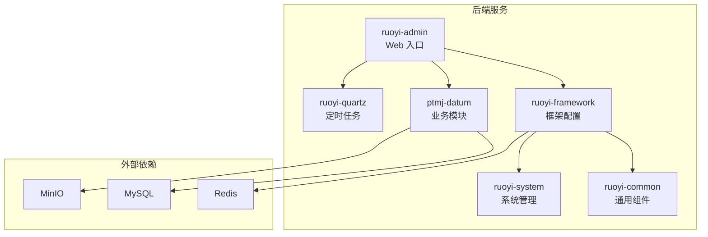
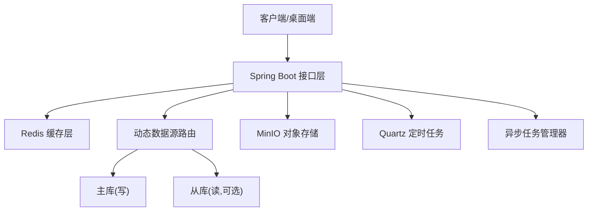
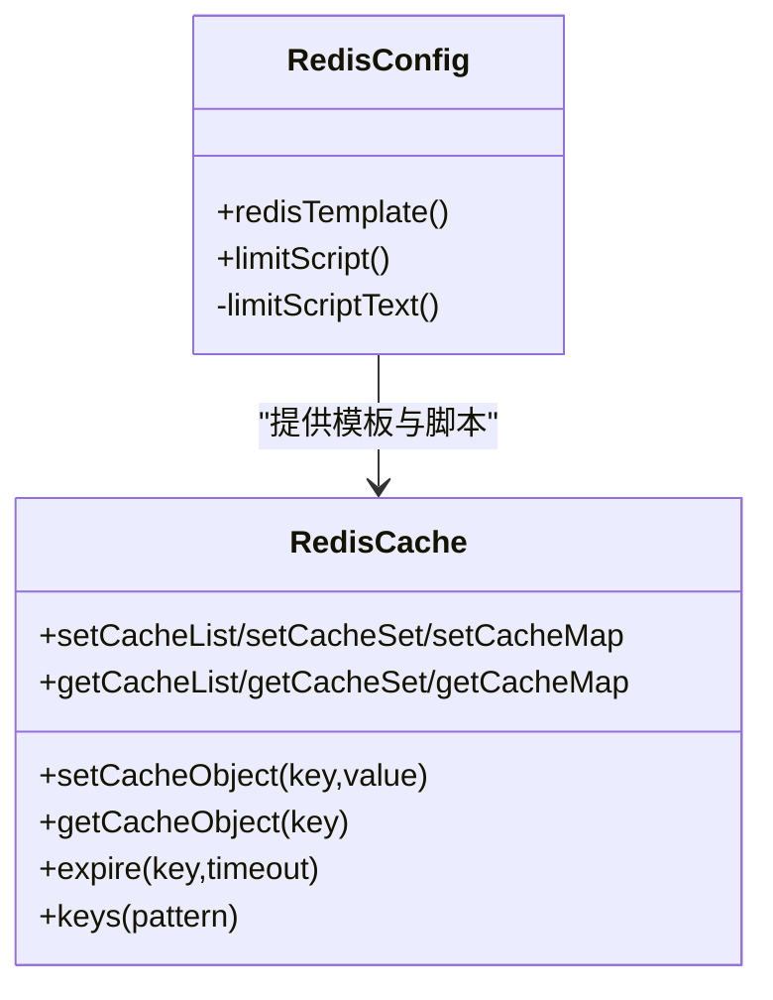
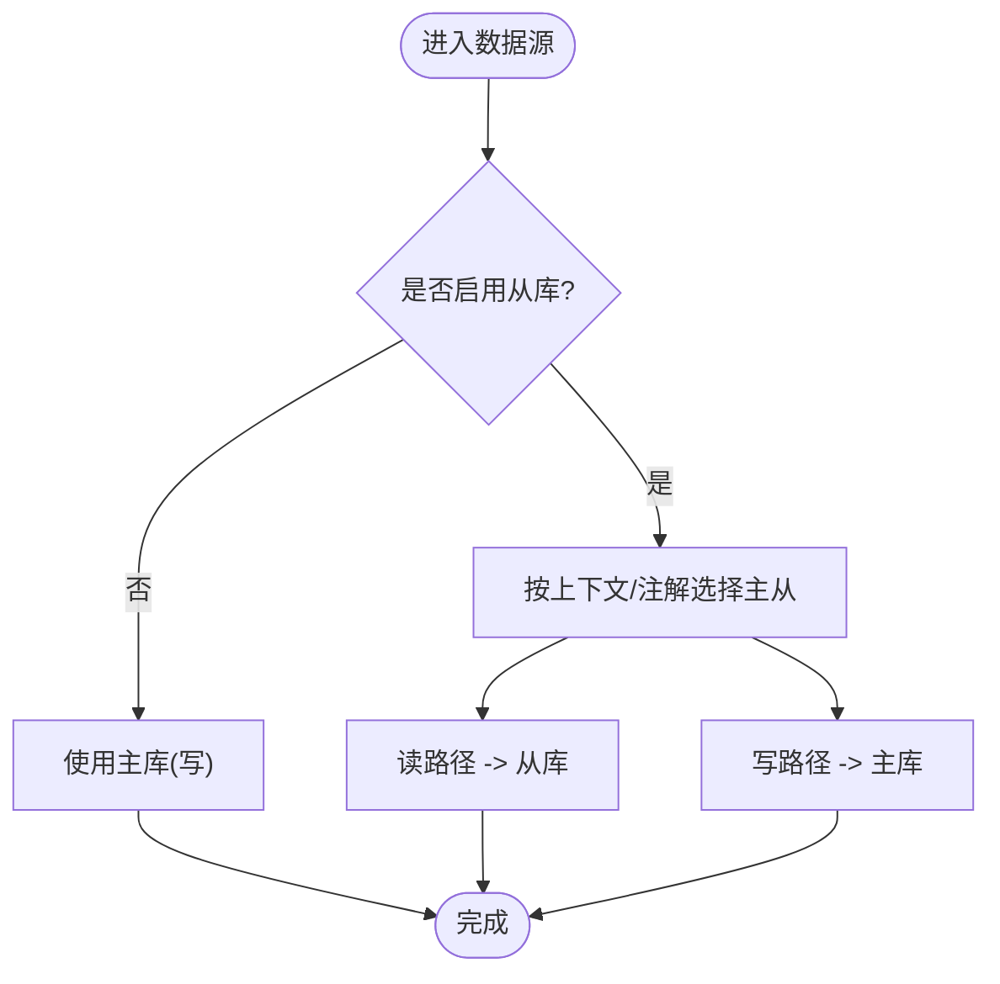
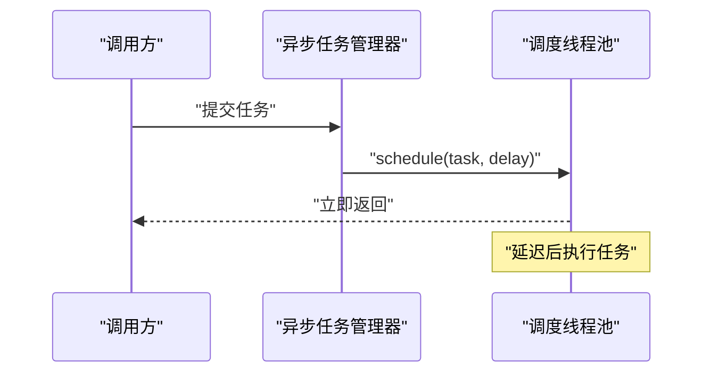
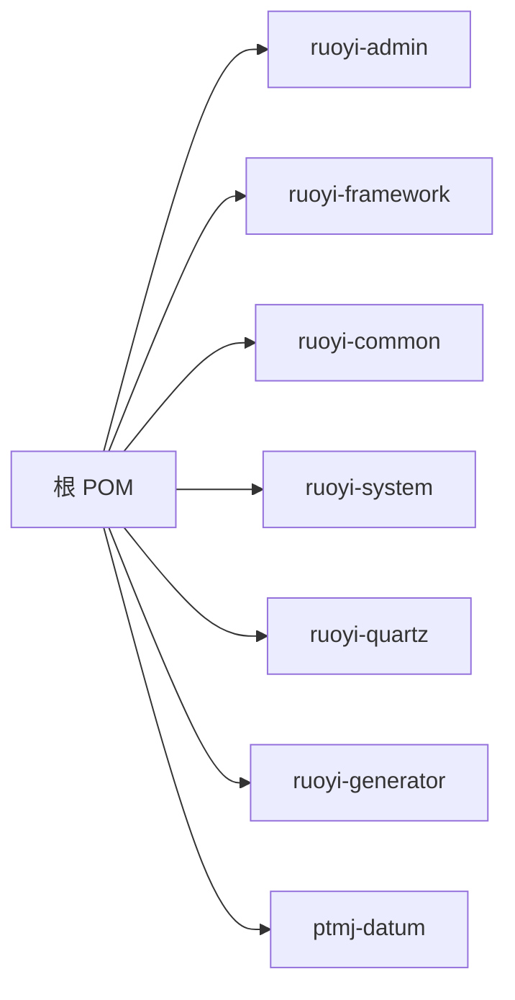

# 性能架构

<cite>
**本文引用的文件**
- [README.md](file://PezMax-Backend/README.md)
- [pom.xml](file://PezMax-Backend/pom.xml)
- [RedisConfig.java](file://PezMax-Backend/ruoyi-framework/src/main/java/com/ruoyi/framework/config/RedisConfig.java)
- [RedisCache.java](file://PezMax-Backend/ruoyi-common/src/main/java/com/ruoyi/common/core/redis/RedisCache.java)
- [application-druid.yml](file://PezMax-Backend/ruoyi-admin/src/main/resources/application-druid.yml)
- [DruidConfig.java](file://PezMax-Backend/ruoyi-framework/src/main/java/com/ruoyi/framework/config/DruidConfig.java)
- [RyTask.java](file://PezMax-Backend/ruoyi-quartz/src/main/java/com/ruoyi/quartz/task/RyTask.java)
- [AsyncManager.java](file://PezMax-Backend/ruoyi-framework/src/main/java/com/ruoyi/framework/manager/AsyncManager.java)
</cite>

## 目录
1. [简介](#简介)
2. [项目结构](#项目结构)
3. [核心组件](#核心组件)
4. [架构总览](#架构总览)
5. [详细组件分析](#详细组件分析)
6. [依赖分析](#依赖分析)
7. [性能考虑](#性能考虑)
8. [故障排查指南](#故障排查指南)
9. [结论](#结论)
10. [附录](#附录)

## 简介
本性能架构文档面向 PezMax-One 系统，聚焦后端在缓存、数据库、异步与定时任务、以及前端构建优化等方面的设计与实践。内容涵盖：
- Redis 缓存策略（穿透防护、雪崩处理、热点数据）
- 数据库性能优化（连接池、慢查询、索引、读写分离）
- 异步处理与定时任务（后台任务、批量处理）
- 前端性能优化（代码分割、懒加载、资源压缩、CDN）
- 监控指标、瓶颈定位、容量规划
- 性能测试工具与基准分析方法

## 项目结构
后端采用多模块 Maven 工程，核心模块包括：
- ptmj-datum：业务领域（书签、文件、用户等）
- ruoyi-admin：Web 入口与控制器
- ruoyi-common：通用工具与缓存封装
- ruoyi-framework：框架配置（Redis、Druid、动态数据源、安全等）
- ruoyi-quartz：定时任务
- ruoyi-system：系统基础管理
- ruoyi-generator：代码生成

图表来源
- [README.md:76-89](file://PezMax-Backend/README.md#L76-L89)

章节来源
- [README.md:13-44](file://PezMax-Backend/README.md#L13-L44)
- [README.md:76-89](file://PezMax-Backend/README.md#L76-L89)

## 核心组件
- Redis 配置与限流脚本：提供序列化、缓存启用与分布式限流脚本
- Redis 缓存工具类：统一封装常用数据结构操作
- Druid 数据源与监控：主从数据源、连接池参数、慢 SQL 统计
- 动态数据源：基于注解或上下文切换读写库
- 异步任务管理器：基于调度线程池的轻量异步执行
- Quartz 定时任务：可配置的定时任务示例

章节来源
- [RedisConfig.java:1-71](file://PezMax-Backend/ruoyi-framework/src/main/java/com/ruoyi/framework/config/RedisConfig.java#L1-L71)
- [RedisCache.java:1-269](file://PezMax-Backend/ruoyi-common/src/main/java/com/ruoyi/common/core/redis/RedisCache.java#L1-L269)
- [application-druid.yml:1-62](file://PezMax-Backend/ruoyi-admin/src/main/resources/application-druid.yml#L1-L62)
- [DruidConfig.java:1-127](file://PezMax-Backend/ruoyi-framework/src/main/java/com/ruoyi/framework/config/DruidConfig.java#L1-L127)
- [AsyncManager.java:1-56](file://PezMax-Backend/ruoyi-framework/src/main/java/com/ruoyi/framework/manager/AsyncManager.java#L1-L56)
- [RyTask.java:1-29](file://PezMax-Backend/ruoyi-quartz/src/main/java/com/ruoyi/quartz/task/RyTask.java#L1-L29)

## 架构总览
整体架构围绕“应用层 + 缓存 + 数据库 + 对象存储”展开，结合动态数据源与定时任务支撑高并发与可扩展性。

图表来源
- [DruidConfig.java:52-60](file://PezMax-Backend/ruoyi-framework/src/main/java/com/ruoyi/framework/config/DruidConfig.java#L52-L60)
- [application-druid.yml:1-62](file://PezMax-Backend/ruoyi-admin/src/main/resources/application-druid.yml#L1-L62)
- [RedisConfig.java:1-71](file://PezMax-Backend/ruoyi-framework/src/main/java/com/ruoyi/framework/config/RedisConfig.java#L1-L71)
- [RyTask.java:1-29](file://PezMax-Backend/ruoyi-quartz/src/main/java/com/ruoyi/quartz/task/RyTask.java#L1-L29)
- [AsyncManager.java:1-56](file://PezMax-Backend/ruoyi-framework/src/main/java/com/ruoyi/framework/manager/AsyncManager.java#L1-L56)

## 详细组件分析

### Redis 缓存策略与优化
- 缓存启用与序列化
  - 通过配置类开启缓存并定义 RedisTemplate 的键值序列化策略，统一使用字符串键与 JSON 值，便于可读性与跨语言兼容。
- 分布式限流脚本
  - 提供 Lua 脚本实现原子计数与过期控制，用于接口级限流，避免热点请求打爆后端。
- 缓存工具封装
  - 提供 String/List/Set/Map 等常用结构的存取、过期、批量删除与 keys 扫描能力，降低业务侧重复造轮子。

建议的性能策略（结合现有能力扩展）：
- 缓存穿透防护
  - 对不存在的数据写入空值短 TTL，或在布隆过滤器中记录黑名单；读取时先查过滤器再查缓存/DB。
- 缓存雪崩处理
  - 为热点 key 设置随机抖动 TTL；对关键数据采用互斥锁重建；对批量失效场景采用分段过期或预热。
- 热点数据缓存
  - 针对高频访问的排行榜、树形结构等，使用本地二级缓存（如 Caffeine）+ Redis 组合，减少网络往返。
- 一致性保障
  - 采用“先更新 DB，再删缓存”的策略；必要时引入延迟双删或订阅 Binlog 异步清理。

图表来源
- [RedisConfig.java:22-70](file://PezMax-Backend/ruoyi-framework/src/main/java/com/ruoyi/framework/config/RedisConfig.java#L22-L70)
- [RedisCache.java:23-269](file://PezMax-Backend/ruoyi-common/src/main/java/com/ruoyi/common/core/redis/RedisCache.java#L23-L269)

章节来源
- [RedisConfig.java:1-71](file://PezMax-Backend/ruoyi-framework/src/main/java/com/ruoyi/framework/config/RedisConfig.java#L1-L71)
- [RedisCache.java:1-269](file://PezMax-Backend/ruoyi-common/src/main/java/com/ruoyi/common/core/redis/RedisCache.java#L1-L269)

### 数据库性能优化（连接池、慢查询、索引、读写分离）
- 连接池配置（Druid）
  - 主库已启用，从库默认关闭；初始/最小/最大连接数、等待超时、空闲回收、健康检查等参数齐全，便于根据负载调优。
- 慢查询与监控
  - 开启 stat 过滤与慢 SQL 日志阈值，配合 Web 控制台查看 SQL 执行统计。
- 读写分离
  - 通过动态数据源将 master 作为默认写库，slave 可按需启用并注册到路由表，实现读写分流。
- 索引设计建议
  - 针对高频查询条件建立复合索引；避免在索引列上使用函数或隐式类型转换；分页查询尽量使用覆盖索引。

图表来源
- [DruidConfig.java:52-60](file://PezMax-Backend/ruoyi-framework/src/main/java/com/ruoyi/framework/config/DruidConfig.java#L52-L60)
- [application-druid.yml:1-62](file://PezMax-Backend/ruoyi-admin/src/main/resources/application-druid.yml#L1-L62)

章节来源
- [application-druid.yml:1-62](file://PezMax-Backend/ruoyi-admin/src/main/resources/application-druid.yml#L1-L62)
- [DruidConfig.java:1-127](file://PezMax-Backend/ruoyi-framework/src/main/java/com/ruoyi/framework/config/DruidConfig.java#L1-L127)

### 异步处理与定时任务
- 异步任务管理器
  - 基于 ScheduledExecutorService 的轻量异步执行器，适合非阻塞的后续处理（如日志落盘、通知发送）。
- Quartz 定时任务
  - 提供示例任务类，支持无参/有参/多参方法调用，便于编排周期性批处理与数据同步。

图表来源
- [AsyncManager.java:1-56](file://PezMax-Backend/ruoyi-framework/src/main/java/com/ruoyi/framework/manager/AsyncManager.java#L1-L56)

章节来源
- [AsyncManager.java:1-56](file://PezMax-Backend/ruoyi-framework/src/main/java/com/ruoyi/framework/manager/AsyncManager.java#L1-L56)
- [RyTask.java:1-29](file://PezMax-Backend/ruoyi-quartz/src/main/java/com/ruoyi/quartz/task/RyTask.java#L1-L29)

### 前端性能优化策略
- 构建与打包
  - 使用 Vite 构建，集成自动导入、SVG 图标、压缩插件等，有助于减小包体与提升构建速度。
- 代码分割与懒加载
  - 路由级按需加载、组件级动态 import，降低首屏体积。
- 资源压缩与 CDN
  - 启用静态资源压缩，部署至 CDN 加速静态资源分发。
- 浏览器缓存
  - 合理设置静态资源版本化与缓存头，提高二次访问命中率。

说明：本节为通用优化建议，不直接分析具体源码文件。

## 依赖分析
后端依赖关系由 Maven 聚合工程组织，核心依赖包括 Spring Boot、MyBatis、Druid、Fastjson2、JWT、SpringDoc、PageHelper 等。

图表来源
- [pom.xml:177-185](file://PezMax-Backend/pom.xml#L177-L185)

章节来源
- [pom.xml:1-234](file://PezMax-Backend/pom.xml#L1-234)

## 性能考虑
- 缓存层
  - 热点 Key 加本地缓存；TTL 随机抖动防雪崩；空值短 TTL 防穿透；批量失效分片过期。
- 数据库层
  - 调整连接池大小与超时；开启慢 SQL 统计并按阈值治理；完善索引与覆盖索引；读写分离分流读压力。
- 异步与批处理
  - 将耗时 IO 与 CPU 密集任务下沉到异步线程池或定时任务；批处理采用分批提交与事务边界控制。
- 前端体验
  - 首屏瘦身、按需加载、静态资源压缩与 CDN 加速；图片与字体按需裁剪。
- 容量规划
  - 以 QPS、RT、CPU/内存/磁盘 IO 为基线，结合压测结果评估扩容节点与中间件规格。

[本节为通用指导，不直接分析具体文件]

## 故障排查指南
- 缓存问题
  - 确认 RedisTemplate 序列化与 key 命名规范；检查限流脚本命中情况；核对 TTL 与热点 key 分布。
- 数据库问题
  - 通过 Druid 控制台查看慢 SQL 与连接池状态；关注 maxActive、maxWait、validationQuery 与健康检查；读写分离下确认数据源切换是否正确。
- 异步与定时任务
  - 检查调度线程池是否耗尽；Quartz 任务日志与异常堆栈；任务幂等与重试策略。
- 前端问题
  - 检查构建产物体积与资源加载顺序；CDN 缓存命中与回源率；浏览器缓存与版本化策略。

章节来源
- [application-druid.yml:43-62](file://PezMax-Backend/ruoyi-admin/src/main/resources/application-druid.yml#L43-L62)
- [RedisConfig.java:43-70](file://PezMax-Backend/ruoyi-framework/src/main/java/com/ruoyi/framework/config/RedisConfig.java#L43-L70)
- [AsyncManager.java:1-56](file://PezMax-Backend/ruoyi-framework/src/main/java/com/ruoyi/framework/manager/AsyncManager.java#L1-L56)
- [RyTask.java:1-29](file://PezMax-Backend/ruoyi-quartz/src/main/java/com/ruoyi/quartz/task/RyTask.java#L1-L29)

## 结论
PezMax-One 在后端提供了完善的缓存、数据库与异步/定时任务基础设施。通过合理的缓存策略、连接池与慢 SQL 治理、读写分离与索引优化，以及前端构建与资源优化，可在高并发场景下获得稳定且高效的系统表现。建议在上线前进行系统化压测与容量评估，持续监控与迭代优化。

[本节为总结，不直接分析具体文件]

## 附录
- 性能测试工具与方法
  - 后端压测：JMeter / Gatling / wrk，模拟峰值 QPS 与长尾 RT，观察 P95/P99 延迟与错误率。
  - 数据库压测：Sysbench / tpcc-mysql，评估连接池与慢 SQL 影响。
  - 缓存压测：redis-benchmark，验证吞吐与延迟。
  - 前端压测：Lighthouse / WebPageTest，评估首屏与资源加载。
- 基准测试结果分析方法
  - 关注吞吐、延迟分布、错误率、资源利用率（CPU/内存/IO/网络）；对比不同配置下的回归趋势；结合链路追踪定位热点与瓶颈。

[本节为通用指导，不直接分析具体文件]