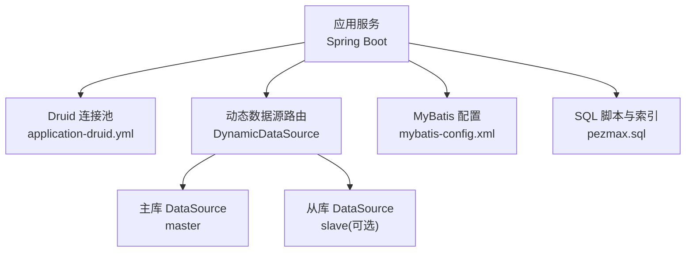
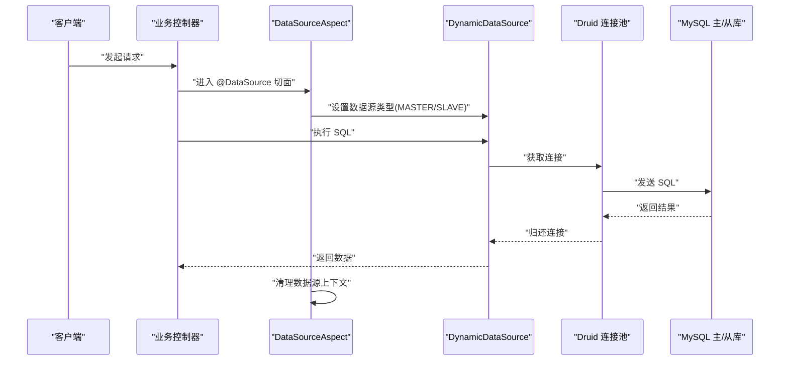
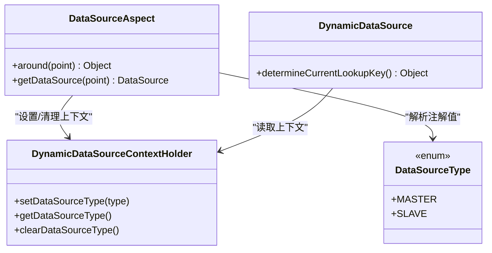
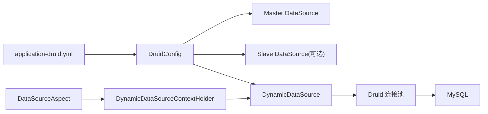

# 数据库性能优化

<cite>
**本文引用的文件**   
- [application-druid.yml](file://PezMax-Backend/ruoyi-admin/src/main/resources/application-druid.yml)
- [DruidConfig.java](file://PezMax-Backend/ruoyi-framework/src/main/java/com/ruoyi/framework/config/DruidConfig.java)
- [DynamicDataSource.java](file://PezMax-Backend/ruoyi-framework/src/main/java/com/ruoyi/framework/datasource/DynamicDataSource.java)
- [DataSourceAspect.java](file://PezMax-Backend/ruoyi-framework/src/main/java/com/ruoyi/framework/aspectj/DataSourceAspect.java)
- [DynamicDataSourceContextHolder.java](file://PezMax-Backend/ruoyi-framework/src/main/java/com/ruoyi/framework/datasource/DynamicDataSourceContextHolder.java)
- [DataSourceType.java](file://PezMax-Backend/ruoyi-common/src/main/java/com/ruoyi/common/enums/DataSourceType.java)
- [mybatis-config.xml](file://PezMax-Backend/ruoyi-admin/src/main/resources/mybatis/mybatis-config.xml)
- [pezmax.sql](file://PezMax-Backend/sql/pezmax.sql)
</cite>

## 目录
1. [引言](#引言)
2. [项目结构](#项目结构)
3. [核心组件](#核心组件)
4. [架构总览](#架构总览)
5. [详细组件分析](#详细组件分析)
6. [依赖关系分析](#依赖关系分析)
7. [性能考虑](#性能考虑)
8. [故障排查指南](#故障排查指南)
9. [结论](#结论)
10. [附录](#附录)

## 引言
本文件面向 PezMax-One 系统的生产与运维团队，聚焦数据库性能优化。内容覆盖：
- Druid 连接池配置调优（连接数、超时、监控）
- 慢查询优化技术（SQL 优化、执行计划、索引设计）
- 读写分离与分库分表策略（动态数据源切换、负载均衡、一致性）
- 监控与诊断（Druid 监控面板、慢查询日志、瓶颈定位）
- 容量规划、备份恢复、高可用架构等生产最佳实践

## 项目结构
本项目后端基于 Spring Boot + MyBatis + Druid 的常见架构，数据库层通过多数据源支持主从扩展，MyBatis 负责 SQL 映射与缓存开关，DDL 脚本提供基础表结构与索引定义。

图表来源
- [application-druid.yml:1-62](file://PezMax-Backend/ruoyi-admin/src/main/resources/application-druid.yml#L1-L62)
- [DruidConfig.java:32-79](file://PezMax-Backend/ruoyi-framework/src/main/java/com/ruoyi/framework/config/DruidConfig.java#L32-L79)
- [DynamicDataSource.java:12-26](file://PezMax-Backend/ruoyi-framework/src/main/java/com/ruoyi/framework/datasource/DynamicDataSource.java#L12-L26)
- [mybatis-config.xml:6-18](file://PezMax-Backend/ruoyi-admin/src/main/resources/mybatis/mybatis-config.xml#L6-L18)
- [pezmax.sql:80-172](file://PezMax-Backend/sql/pezmax.sql#L80-L172)

章节来源
- [application-druid.yml:1-62](file://PezMax-Backend/ruoyi-admin/src/main/resources/application-druid.yml#L1-L62)
- [DruidConfig.java:32-79](file://PezMax-Backend/ruoyi-framework/src/main/java/com/ruoyi/framework/config/DruidConfig.java#L32-L79)
- [DynamicDataSource.java:12-26](file://PezMax-Backend/ruoyi-framework/src/main/java/com/ruoyi/framework/datasource/DynamicDataSource.java#L12-L26)
- [mybatis-config.xml:6-18](file://PezMax-Backend/ruoyi-admin/src/main/resources/mybatis/mybatis-config.xml#L6-L18)
- [pezmax.sql:80-172](file://PezMax-Backend/sql/pezmax.sql#L80-L172)

## 核心组件
- Druid 连接池与监控：通过 application-druid.yml 集中配置连接池参数与监控开关；DruidConfig 负责构建主/从数据源并注册监控页面过滤器。
- 动态数据源：DynamicDataSource 继承 AbstractRoutingDataSource，依据上下文选择 master 或 slave；DataSourceAspect 通过注解在方法/类级别切换数据源；DynamicDataSourceContextHolder 维护线程级数据源类型。
- MyBatis 配置：启用全局缓存、JDBC 自动生成主键、默认执行器类型与日志实现。
- 数据模型与索引：pezmax.sql 定义了业务表及常用索引，为查询优化提供基础。

章节来源
- [application-druid.yml:1-62](file://PezMax-Backend/ruoyi-admin/src/main/resources/application-druid.yml#L1-L62)
- [DruidConfig.java:32-79](file://PezMax-Backend/ruoyi-framework/src/main/java/com/ruoyi/framework/config/DruidConfig.java#L32-L79)
- [DynamicDataSource.java:12-26](file://PezMax-Backend/ruoyi-framework/src/main/java/com/ruoyi/framework/datasource/DynamicDataSource.java#L12-L26)
- [DataSourceAspect.java:23-72](file://PezMax-Backend/ruoyi-framework/src/main/java/com/ruoyi/framework/aspectj/DataSourceAspect.java#L23-L72)
- [DynamicDataSourceContextHolder.java:1-200](file://PezMax-Backend/ruoyi-framework/src/main/java/com/ruoyi/framework/datasource/DynamicDataSourceContextHolder.java#L1-L200)
- [DataSourceType.java:1-200](file://PezMax-Backend/ruoyi-common/src/main/java/com/ruoyi/common/enums/DataSourceType.java#L1-L200)
- [mybatis-config.xml:6-18](file://PezMax-Backend/ruoyi-admin/src/main/resources/mybatis/mybatis-config.xml#L6-L18)
- [pezmax.sql:80-172](file://PezMax-Backend/sql/pezmax.sql#L80-L172)

## 架构总览
下图展示了请求进入后，如何经由 AOP 切面设置数据源上下文，再由动态数据源路由到具体物理数据源，最终通过 Druid 连接池访问 MySQL。

图表来源
- [DataSourceAspect.java:37-56](file://PezMax-Backend/ruoyi-framework/src/main/java/com/ruoyi/framework/aspectj/DataSourceAspect.java#L37-L56)
- [DynamicDataSource.java:21-25](file://PezMax-Backend/ruoyi-framework/src/main/java/com/ruoyi/framework/datasource/DynamicDataSource.java#L21-L25)
- [application-druid.yml:1-62](file://PezMax-Backend/ruoyi-admin/src/main/resources/application-druid.yml#L1-L62)

## 详细组件分析

### Druid 连接池与监控配置
- 连接池关键参数
  - initialSize/minIdle/maxActive：控制初始、最小空闲与最大活跃连接数，需结合并发量与数据库承载能力调整。
  - maxWait/connectTimeout/socketTimeout：分别控制获取连接等待超时、建立连接超时与网络读写超时，避免雪崩。
  - timeBetweenEvictionRunsMillis/minEvictableIdleTimeMillis/maxEvictableIdleTimeMillis：空闲连接回收策略，降低资源占用。
  - validationQuery/testWhileIdle/testOnBorrow/testOnReturn：连接有效性校验策略，建议开启 testWhileIdle，谨慎使用 testOnBorrow。
- 监控与统计
  - statViewServlet/webStatFilter/stat.filter：开启控制台与 Web 监控，记录 SQL 统计与慢 SQL。
  - slow-sql-millis/log-slow-sql：慢 SQL 阈值与开关，便于定位热点语句。
  - wall.filter：SQL 防火墙，可限制危险操作。
- 多数据源构建
  - DruidConfig 根据配置项创建 master/slave 两个 DruidDataSource，并通过 DynamicDataSource 组合为统一入口。

章节来源
- [application-druid.yml:1-62](file://PezMax-Backend/ruoyi-admin/src/main/resources/application-druid.yml#L1-L62)
- [DruidConfig.java:32-79](file://PezMax-Backend/ruoyi-framework/src/main/java/com/ruoyi/framework/config/DruidConfig.java#L32-L79)

#### 连接池参数调优要点
- 连接数估算：maxActive ≈ CPU 核数 × 2 ~ 4（读多写少场景可适当提高），并结合数据库 max_connections 与内存限制。
- 超时设置：connectTimeout 建议 10~30s，socketTimeout 根据业务 RT 设定，maxWait 不宜过大，避免堆积。
- 健康检查：validationQuery 使用轻量查询；testWhileIdle=true 配合合理的 timeBetweenEvictionRunsMillis 提升稳定性。
- 监控白名单：statViewServlet.allow 建议限定 IP，login-username/login-password 严格管理。

章节来源
- [application-druid.yml:20-62](file://PezMax-Backend/ruoyi-admin/src/main/resources/application-druid.yml#L20-L62)

### 动态数据源与读写分离
- 数据源枚举与上下文
  - DataSourceType 定义 MASTER/SLAVE 等数据源标识。
  - DynamicDataSourceContextHolder 保存当前线程的数据源类型，确保多线程隔离。
- 注解驱动切换
  - DataSourceAspect 拦截标注了 @DataSource 的方法或类，设置上下文并在 finally 中清理，避免泄漏。
- 路由逻辑
  - DynamicDataSource.determineCurrentLookupKey 读取上下文决定实际使用的 DataSource。
- 负载均衡与一致性
  - 当前实现为“按注解指定”的静态路由，未内置轮询/权重等负载均衡策略。
  - 读一致性可通过强制走主库（MASTER）保障，或在业务层引入版本戳/事务边界控制。

图表来源
- [DataSourceType.java:1-200](file://PezMax-Backend/ruoyi-common/src/main/java/com/ruoyi/common/enums/DataSourceType.java#L1-L200)
- [DynamicDataSourceContextHolder.java:1-200](file://PezMax-Backend/ruoyi-framework/src/main/java/com/ruoyi/framework/datasource/DynamicDataSourceContextHolder.java#L1-L200)
- [DataSourceAspect.java:37-72](file://PezMax-Backend/ruoyi-framework/src/main/java/com/ruoyi/framework/aspectj/DataSourceAspect.java#L37-L72)
- [DynamicDataSource.java:21-25](file://PezMax-Backend/ruoyi-framework/src/main/java/com/ruoyi/framework/datasource/DynamicDataSource.java#L21-L25)

章节来源
- [DataSourceAspect.java:23-72](file://PezMax-Backend/ruoyi-framework/src/main/java/com/ruoyi/framework/aspectj/DataSourceAspect.java#L23-L72)
- [DynamicDataSource.java:12-26](file://PezMax-Backend/ruoyi-framework/src/main/java/com/ruoyi/framework/datasource/DynamicDataSource.java#L12-L26)
- [DynamicDataSourceContextHolder.java:1-200](file://PezMax-Backend/ruoyi-framework/src/main/java/com/ruoyi/framework/datasource/DynamicDataSourceContextHolder.java#L1-L200)
- [DataSourceType.java:1-200](file://PezMax-Backend/ruoyi-common/src/main/java/com/ruoyi/common/enums/DataSourceType.java#L1-L200)

### MyBatis 与 SQL 执行路径
- 全局设置
  - cacheEnabled：开启二级缓存（需谨慎评估跨会话一致性）。
  - useGeneratedKeys：允许 JDBC 自动回填主键。
  - defaultExecutorType：默认 SIMPLE，批量更新可使用 BATCH。
  - logImpl：输出 SQL 日志便于调试。
- 与 Druid 协作
  - MyBatis 生成的 SQL 经 Druid Filter 统计与慢 SQL 记录，便于监控。

章节来源
- [mybatis-config.xml:6-18](file://PezMax-Backend/ruoyi-admin/src/main/resources/mybatis/mybatis-config.xml#L6-L18)
- [application-druid.yml:53-62](file://PezMax-Backend/ruoyi-admin/src/main/resources/application-druid.yml#L53-L62)

### 索引设计与慢查询优化
- 现有索引概览（示例）
  - ptmj_bookmark：user_id、subject、resource_type、collection、status、del_flag、create_time 等单列索引，适合用户维度筛选与状态过滤。
  - ptmj_file：user_id、file_year、file_type、file_status、del_flag 等索引，支撑上传人、年份、类型与状态查询。
  - ptmj_notification：notify_type+status 组合索引、publish_start/publish_end 范围索引、upload_user_id 单列索引，用于通知分发与滚动展示。
- 优化建议
  - 优先使用复合索引匹配查询前缀条件，减少回表。
  - 对高频过滤字段（如 status、del_flag）建立索引，但注意选择性。
  - 时间范围查询尽量利用左前缀索引，避免函数包裹导致索引失效。
  - 大表分页采用延迟关联或覆盖索引优化。

章节来源
- [pezmax.sql:80-172](file://PezMax-Backend/sql/pezmax.sql#L80-L172)
- [pezmax.sql:202-234](file://PezMax-Backend/sql/pezmax.sql#L202-L234)

## 依赖关系分析
- 配置到实例
  - application-druid.yml → DruidConfig → master/slave DataSource → DynamicDataSource
- 运行时切换
  - DataSourceAspect → DynamicDataSourceContextHolder → DynamicDataSource → Druid 连接池 → MySQL
- 监控链路
  - Druid Stat Filter → /druid/* 控制台 → SQL 统计与慢 SQL 日志

图表来源
- [application-druid.yml:1-62](file://PezMax-Backend/ruoyi-admin/src/main/resources/application-druid.yml#L1-L62)
- [DruidConfig.java:32-79](file://PezMax-Backend/ruoyi-framework/src/main/java/com/ruoyi/framework/config/DruidConfig.java#L32-L79)
- [DynamicDataSource.java:12-26](file://PezMax-Backend/ruoyi-framework/src/main/java/com/ruoyi/framework/datasource/DynamicDataSource.java#L12-L26)
- [DataSourceAspect.java:37-56](file://PezMax-Backend/ruoyi-framework/src/main/java/com/ruoyi/framework/aspectj/DataSourceAspect.java#L37-L56)
- [DynamicDataSourceContextHolder.java:1-200](file://PezMax-Backend/ruoyi-framework/src/main/java/com/ruoyi/framework/datasource/DynamicDataSourceContextHolder.java#L1-L200)

章节来源
- [DruidConfig.java:32-79](file://PezMax-Backend/ruoyi-framework/src/main/java/com/ruoyi/framework/config/DruidConfig.java#L32-L79)
- [DynamicDataSource.java:12-26](file://PezMax-Backend/ruoyi-framework/src/main/java/com/ruoyi/framework/datasource/DynamicDataSource.java#L12-L26)
- [DataSourceAspect.java:37-56](file://PezMax-Backend/ruoyi-framework/src/main/java/com/ruoyi/framework/aspectj/DataSourceAspect.java#L37-L56)

## 性能考虑
- 连接池与超时
  - 合理设置 maxActive、maxWait、connectTimeout、socketTimeout，避免连接耗尽与长尾延迟。
  - 开启 testWhileIdle 与合适的空闲回收周期，降低死连接风险。
- 慢查询治理
  - 通过 Druid 慢 SQL 阈值捕获热点语句，结合 EXPLAIN 分析执行计划，优化索引与 SQL 写法。
  - 避免 SELECT *、隐式类型转换、函数包裹索引列、全表扫描。
- 读写分离与一致性
  - 强一致写入必须走主库；读多写少场景将只读查询路由至从库。
  - 若需要跨库事务，建议使用本地事务或分布式事务方案，权衡性能与一致性。
- 缓存与批处理
  - 合理使用 MyBatis 二级缓存（注意一致性边界）；批量插入/更新使用 BATCH 执行器。
- 容量规划
  - 根据 QPS、平均响应时间与连接池上限估算数据库承载能力，预留 30%~50% 余量。
  - 关注磁盘 IOPS、CPU、内存与网络带宽，避免单一指标成为瓶颈。

[本节为通用指导，不直接分析具体文件]

## 故障排查指南
- 连接池问题
  - 现象：频繁获取连接超时或连接耗尽。
  - 排查：查看 Druid 监控的连接使用率、等待队列；检查 maxActive 与业务并发是否匹配；确认是否存在长事务或未释放连接。
- 慢查询定位
  - 现象：接口响应变慢。
  - 排查：打开 Druid 慢 SQL 记录，定位 top N 慢语句；使用 EXPLAIN 分析执行计划；补充或调整索引；改写 SQL 避免全表扫描。
- 数据源切换异常
  - 现象：读请求误入主库或写请求误入从库。
  - 排查：检查 @DataSource 注解是否正确；确认 AOP 生效；验证 DynamicDataSourceContextHolder 是否在 finally 中清理。
- 监控不可用
  - 现象：/druid/* 无法访问或无统计数据。
  - 排查：确认 statViewServlet.enabled 与 webStatFilter.enabled；检查 allow 白名单与登录凭据；确认 Filter 注册成功。

章节来源
- [application-druid.yml:43-62](file://PezMax-Backend/ruoyi-admin/src/main/resources/application-druid.yml#L43-L62)
- [DataSourceAspect.java:37-56](file://PezMax-Backend/ruoyi-framework/src/main/java/com/ruoyi/framework/aspectj/DataSourceAspect.java#L37-L56)

## 结论
PezMax-One 已具备完善的 Druid 连接池与监控、动态数据源与读写分离基础能力。生产环境应重点做好连接池与超时的精细化调优、慢查询治理与索引优化，并在读写分离基础上完善一致性策略与监控告警体系，逐步向分库分表与高可用架构演进。

[本节为总结性内容，不直接分析具体文件]

## 附录

### 读写分离与分库分表策略建议
- 读写分离
  - 通过 @DataSource 注解在 Service 层明确路由目标；对于需要强一致的写操作强制走主库。
  - 可在网关或服务侧增加负载均衡策略（轮询/权重），但需注意从库复制延迟带来的可见性问题。
- 分库分表
  - 水平拆分可按 user_id 或 file_id 哈希取模；垂直拆分按业务域拆库。
  - 跨分片查询尽量避免；必要时引入搜索引擎或聚合层。
- 一致性保证
  - 采用版本号/时间戳解决冲突；重要写路径使用主库；异步补偿与幂等设计。

[本节为概念性说明，不直接分析具体文件]

### 监控与诊断清单
- Druid 监控面板
  - 访问 /druid/*，核对连接池、SQL 统计、慢 SQL 列表。
- 慢查询日志
  - 调整 slow-sql-millis 阈值，定期导出分析；结合 EXPLAIN 优化。
- 性能瓶颈定位
  - 观察连接池等待、SQL 执行时长、锁等待与 IO 指标；结合系统监控定位根因。

章节来源
- [application-druid.yml:43-62](file://PezMax-Backend/ruoyi-admin/src/main/resources/application-druid.yml#L43-L62)

### 容量规划与备份恢复
- 容量规划
  - 以峰值 QPS 与 P99 时延为目标，反推连接池大小与数据库规格；预留扩容空间。
- 备份恢复
  - 定期全量备份 + 增量 binlog 备份；演练恢复流程，验证 RPO/RTO。
- 高可用架构
  - 主从复制 + 自动故障转移；读写分离 + 多副本；跨机房容灾与异地备份。

[本节为通用指导，不直接分析具体文件]