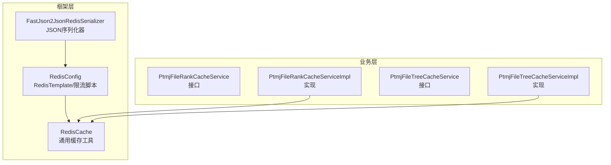
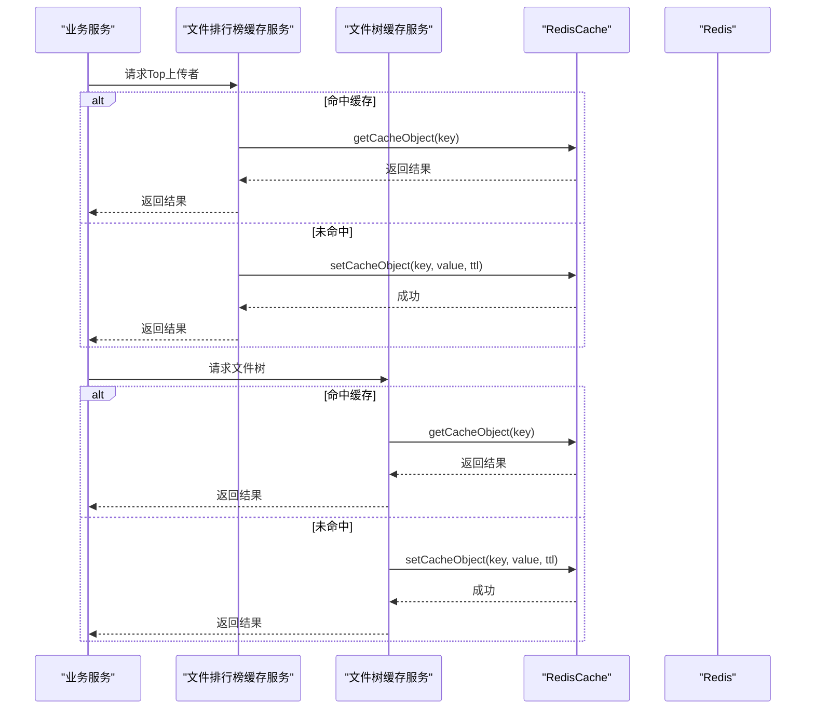
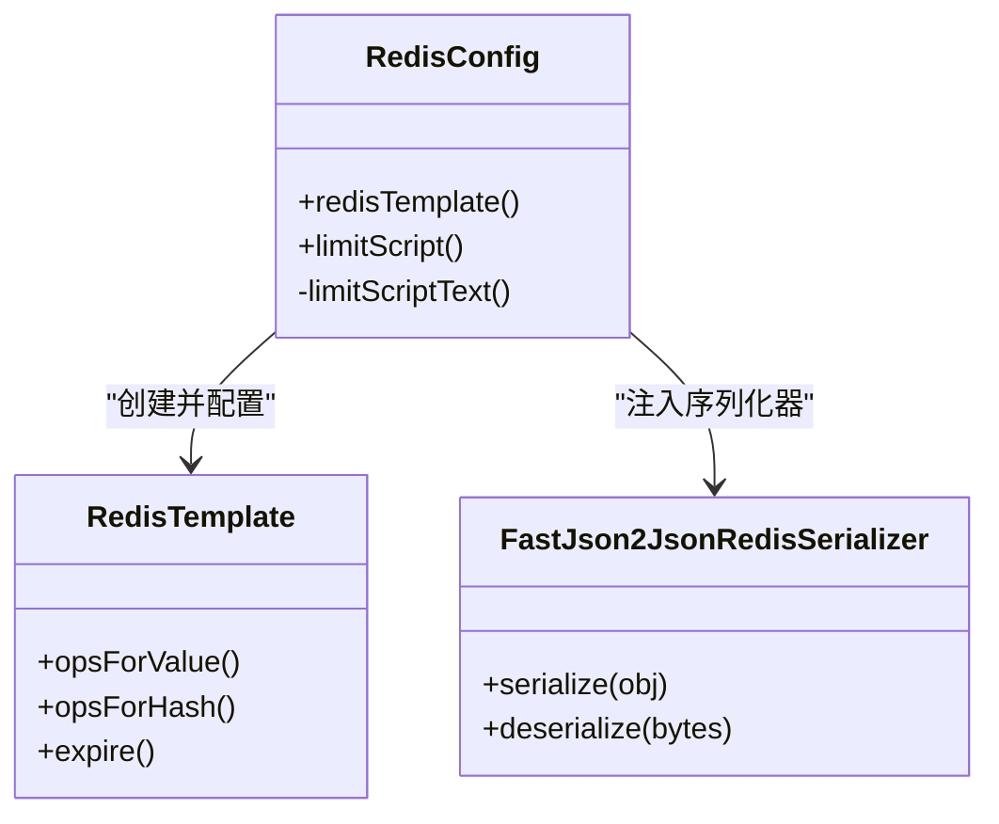
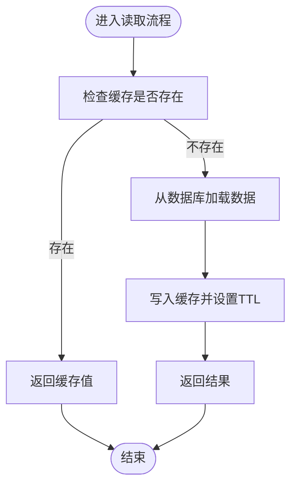
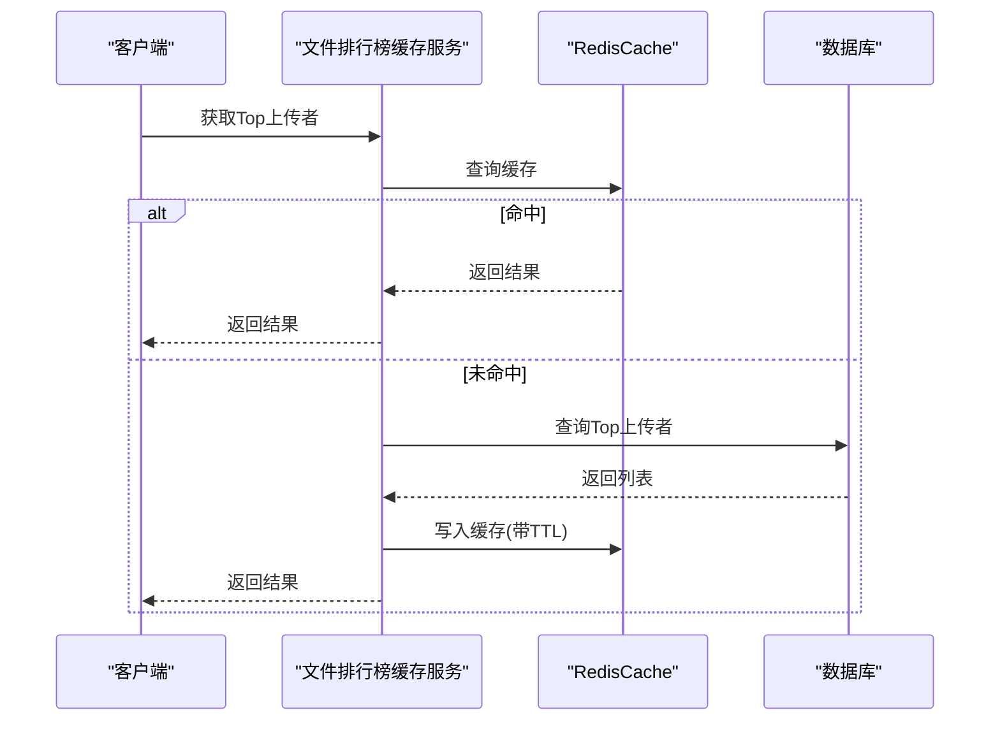
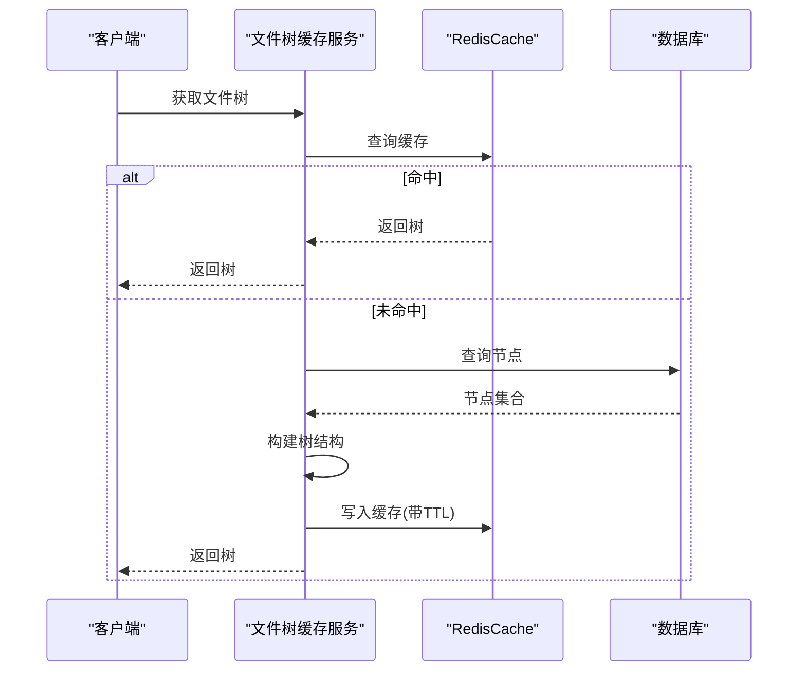
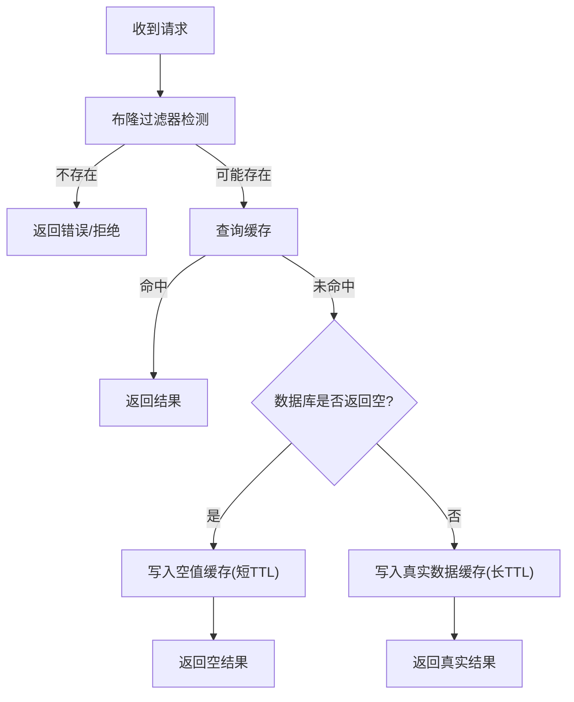
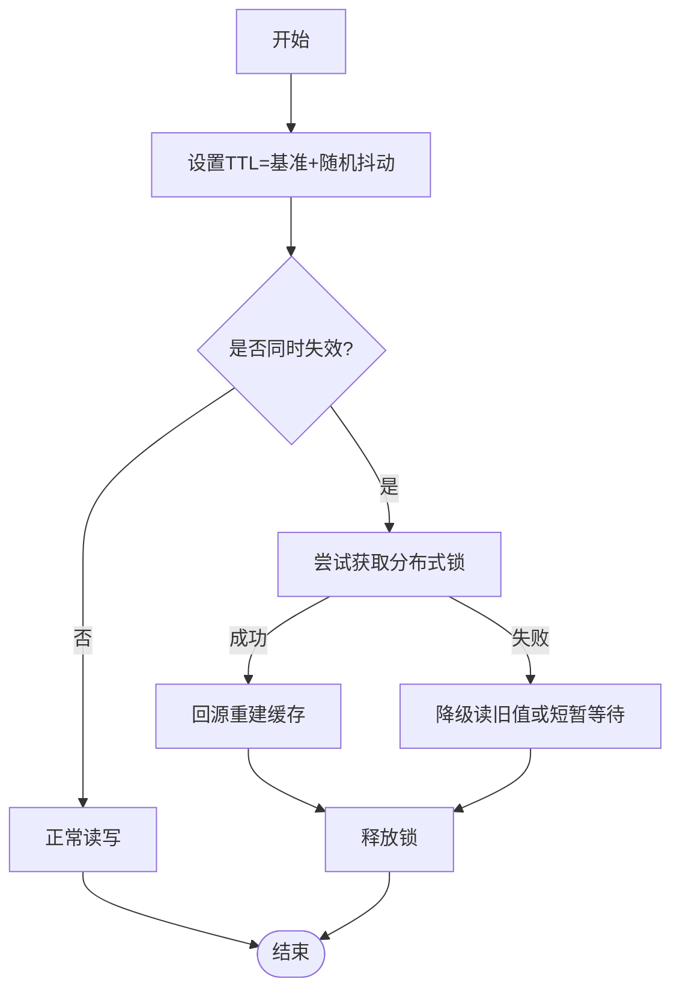
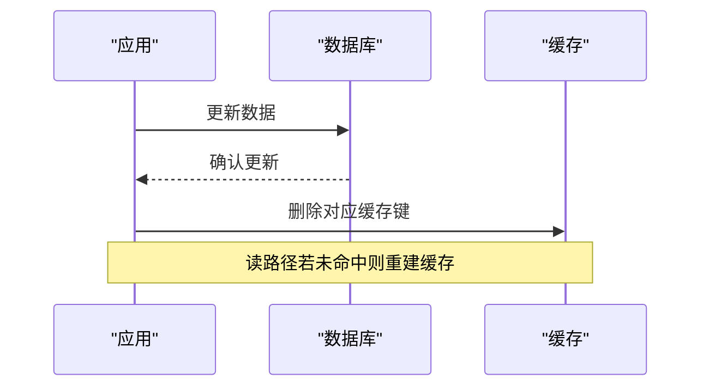
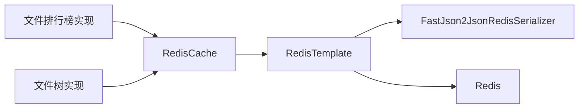

# 缓存优化策略

<cite>
**本文引用的文件**   
- [RedisConfig.java](file://PezMax-Backend/ruoyi-framework/src/main/java/com/ruoyi/framework/config/RedisConfig.java)
- [FastJson2JsonRedisSerializer.java](file://PezMax-Backend/ruoyi-framework/src/main/java/com/ruoyi/framework/config/FastJson2JsonRedisSerializer.java)
- [RedisCache.java](file://PezMax-Backend/ruoyi-common/src/main/java/com/ruoyi/common/core/redis/RedisCache.java)
- [PtmjFileRankCacheService.java](file://PezMax-Backend/ptmj-datum/src/main/java/com/ptmj/datum/service/PtmjFileRankCacheService.java)
- [PtmjFileTreeCacheService.java](file://PezMax-Backend/ptmj-datum/src/main/java/com/ptmj/datum/service/PtmjFileTreeCacheService.java)
- [PtmjFileRankCacheServiceImpl.java](file://PezMax-Backend/ptmj-datum/src/main/java/com/ptmj/datum/service/impl/PtmjFileRankCacheServiceImpl.java)
- [PtmjFileTreeCacheServiceImpl.java](file://PezMax-Backend/ptmj-datum/src/main/java/com/ptmj/datum/service/impl/PtmjFileTreeCacheServiceImpl.java)
</cite>

## 目录
1. [简介](#简介)
2. [项目结构](#项目结构)
3. [核心组件](#核心组件)
4. [架构总览](#架构总览)
5. [详细组件分析](#详细组件分析)
6. [依赖关系分析](#依赖关系分析)
7. [性能考虑](#性能考虑)
8. [故障排查指南](#故障排查指南)
9. [结论](#结论)
10. [附录](#附录)

## 简介
本文件面向 PezMax-One 系统的缓存优化，聚焦 Redis 缓存架构与工程化落地。内容覆盖：
- RedisTemplate 配置、序列化策略与连接池优化建议
- 缓存穿透防护（布隆过滤器、空值缓存、热点预加载）
- 缓存雪崩治理（随机过期、分布式锁、多级缓存）
- 热点数据缓存优化（文件排行榜、文件树、用户信息）
- 缓存一致性、更新策略与监控指标
- 性能调优与故障排查方法

## 项目结构
后端模块中与缓存相关的关键位置：
- 框架层：Redis 基础配置与工具封装
- 业务层：文件排行榜与文件树的缓存服务接口与实现

图示来源
- [RedisConfig.java:1-71](file://PezMax-Backend/ruoyi-framework/src/main/java/com/ruoyi/framework/config/RedisConfig.java#L1-L71)
- [FastJson2JsonRedisSerializer.java](file://PezMax-Backend/ruoyi-framework/src/main/java/com/ruoyi/framework/config/FastJson2JsonRedisSerializer.java)
- [RedisCache.java:1-269](file://PezMax-Backend/ruoyi-common/src/main/java/com/ruoyi/common/core/redis/RedisCache.java#L1-L269)
- [PtmjFileRankCacheService.java:1-13](file://PezMax-Backend/ptmj-datum/src/main/java/com/ptmj/datum/service/PtmjFileRankCacheService.java#L1-L13)
- [PtmjFileTreeCacheService.java:1-12](file://PezMax-Backend/ptmj-datum/src/main/java/com/ptmj/datum/service/PtmjFileTreeCacheService.java#L1-L12)
- [PtmjFileRankCacheServiceImpl.java](file://PezMax-Backend/ptmj-datum/src/main/java/com/ptmj/datum/service/impl/PtmjFileRankCacheServiceImpl.java)
- [PtmjFileTreeCacheServiceImpl.java](file://PezMax-Backend/ptmj-datum/src/main/java/com/ptmj/datum/service/impl/PtmjFileTreeCacheServiceImpl.java)

章节来源
- [RedisConfig.java:1-71](file://PezMax-Backend/ruoyi-framework/src/main/java/com/ruoyi/framework/config/RedisConfig.java#L1-L71)
- [RedisCache.java:1-269](file://PezMax-Backend/ruoyi-common/src/main/java/com/ruoyi/common/core/redis/RedisCache.java#L1-L269)
- [PtmjFileRankCacheService.java:1-13](file://PezMax-Backend/ptmj-datum/src/main/java/com/ptmj/datum/service/PtmjFileRankCacheService.java#L1-L13)
- [PtmjFileTreeCacheService.java:1-12](file://PezMax-Backend/ptmj-datum/src/main/java/com/ptmj/datum/service/PtmjFileTreeCacheService.java#L1-L12)

## 核心组件
- Redis 配置与序列化
  - RedisTemplate 的 Key/HashKey 使用字符串序列化，Value/HashValue 使用 FastJson2 JSON 序列化器，保证可读性与兼容性。
  - 提供限流 Lua 脚本 Bean，便于在网关或业务侧进行原子计数与过期控制。
- 通用缓存工具
  - 封装常用操作：String/List/Set/Map、过期时间管理、批量删除、键扫描等，屏蔽底层差异。
- 热点数据缓存服务
  - 文件排行榜：提供获取 Top 上传者与清空缓存能力。
  - 文件树：提供获取文件树与清空缓存能力。

章节来源
- [RedisConfig.java:22-41](file://PezMax-Backend/ruoyi-framework/src/main/java/com/ruoyi/framework/config/RedisConfig.java#L22-L41)
- [RedisConfig.java:43-69](file://PezMax-Backend/ruoyi-framework/src/main/java/com/ruoyi/framework/config/RedisConfig.java#L43-L69)
- [RedisCache.java:23-269](file://PezMax-Backend/ruoyi-common/src/main/java/com/ruoyi/common/core/redis/RedisCache.java#L23-L269)
- [PtmjFileRankCacheService.java:7-12](file://PezMax-Backend/ptmj-datum/src/main/java/com/ptmj/datum/service/PtmjFileRankCacheService.java#L7-L12)
- [PtmjFileTreeCacheService.java:3-10](file://PezMax-Backend/ptmj-datum/src/main/java/com/ptmj/datum/service/PtmjFileTreeCacheService.java#L3-L10)

## 架构总览
整体缓存调用链路：业务服务通过 RedisCache 访问 Redis；热点数据由专门的服务类统一封装；框架层提供序列化与限流脚本支撑。

图示来源
- [RedisCache.java:105-109](file://PezMax-Backend/ruoyi-common/src/main/java/com/ruoyi/common/core/redis/RedisCache.java#L105-L109)
- [RedisCache.java:34-50](file://PezMax-Backend/ruoyi-common/src/main/java/com/ruoyi/common/core/redis/RedisCache.java#L34-L50)
- [PtmjFileRankCacheService.java:7-12](file://PezMax-Backend/ptmj-datum/src/main/java/com/ptmj/datum/service/PtmjFileRankCacheService.java#L7-L12)
- [PtmjFileTreeCacheService.java:3-10](file://PezMax-Backend/ptmj-datum/src/main/java/com/ptmj/datum/service/PtmjFileTreeCacheService.java#L3-L10)

## 详细组件分析

### Redis 配置与序列化
- 关键要点
  - Key/HashKey 采用字符串序列化，便于调试与跨语言兼容。
  - Value/HashValue 采用 FastJson2 JSON 序列化，提升可读性并支持复杂对象。
  - 暴露限流 Lua 脚本 Bean，用于原子计数与过期设置。
- 优化建议
  - 为不同业务域划分命名空间前缀，避免键冲突。
  - 根据数据大小选择合适序列化器（大对象可考虑压缩）。
  - 结合连接池参数（如最大连接数、空闲超时、重试策略）进行容量规划。

图示来源
- [RedisConfig.java:22-41](file://PezMax-Backend/ruoyi-framework/src/main/java/com/ruoyi/framework/config/RedisConfig.java#L22-L41)
- [RedisConfig.java:43-69](file://PezMax-Backend/ruoyi-framework/src/main/java/com/ruoyi/framework/config/RedisConfig.java#L43-L69)
- [FastJson2JsonRedisSerializer.java](file://PezMax-Backend/ruoyi-framework/src/main/java/com/ruoyi/framework/config/FastJson2JsonRedisSerializer.java)

章节来源
- [RedisConfig.java:1-71](file://PezMax-Backend/ruoyi-framework/src/main/java/com/ruoyi/framework/config/RedisConfig.java#L1-L71)
- [FastJson2JsonRedisSerializer.java](file://PezMax-Backend/ruoyi-framework/src/main/java/com/ruoyi/framework/config/FastJson2JsonRedisSerializer.java)

### 通用缓存工具 RedisCache
- 能力概览
  - String/List/Set/Map 基本读写、过期时间管理、批量删除、键模式匹配。
- 使用建议
  - 对热点数据设置合理 TTL，避免长期占用内存。
  - 批量操作优先使用多键 API，减少网络往返。
  - 对大集合谨慎使用 keys 模式匹配，生产环境建议使用 scan。

图示来源
- [RedisCache.java:94-97](file://PezMax-Backend/ruoyi-common/src/main/java/com/ruoyi/common/core/redis/RedisCache.java#L94-L97)
- [RedisCache.java:105-109](file://PezMax-Backend/ruoyi-common/src/main/java/com/ruoyi/common/core/redis/RedisCache.java#L105-L109)
- [RedisCache.java:34-50](file://PezMax-Backend/ruoyi-common/src/main/java/com/ruoyi/common/core/redis/RedisCache.java#L34-L50)

章节来源
- [RedisCache.java:1-269](file://PezMax-Backend/ruoyi-common/src/main/java/com/ruoyi/common/core/redis/RedisCache.java#L1-L269)

### 热点数据缓存：文件排行榜
- 目标
  - 高频读取“上传排行榜”，降低数据库压力。
- 设计要点
  - 读路径：先查缓存，未命中则回源并回填。
  - 写路径：数据变更后主动清理排行榜缓存，确保下次读取重建。
  - 过期策略：设置合理 TTL，并结合定时任务周期性刷新。
- 接口契约
  - 获取 Top 上传者列表
  - 清空排行榜缓存

图示来源
- [PtmjFileRankCacheService.java:7-12](file://PezMax-Backend/ptmj-datum/src/main/java/com/ptmj/datum/service/PtmjFileRankCacheService.java#L7-L12)
- [PtmjFileRankCacheServiceImpl.java](file://PezMax-Backend/ptmj-datum/src/main/java/com/ptmj/datum/service/impl/PtmjFileRankCacheServiceImpl.java)
- [RedisCache.java:105-109](file://PezMax-Backend/ruoyi-common/src/main/java/com/ruoyi/common/core/redis/RedisCache.java#L105-L109)
- [RedisCache.java:34-50](file://PezMax-Backend/ruoyi-common/src/main/java/com/ruoyi/common/core/redis/RedisCache.java#L34-L50)

章节来源
- [PtmjFileRankCacheService.java:1-13](file://PezMax-Backend/ptmj-datum/src/main/java/com/ptmj/datum/service/PtmjFileRankCacheService.java#L1-L13)
- [PtmjFileRankCacheServiceImpl.java](file://PezMax-Backend/ptmj-datum/src/main/java/com/ptmj/datum/service/impl/PtmjFileRankCacheServiceImpl.java)

### 热点数据缓存：文件树
- 目标
  - 将整棵树结构缓存为字符串或结构化对象，加速目录浏览。
- 设计要点
  - 读路径：缓存优先，未命中则构建树并回填。
  - 写路径：文件增删改后，主动失效树缓存。
  - 数据结构：可按需选择 JSON 字符串或 Hash 分层存储。
- 接口契约
  - 获取文件树
  - 清空树缓存

图示来源
- [PtmjFileTreeCacheService.java:3-10](file://PezMax-Backend/ptmj-datum/src/main/java/com/ptmj/datum/service/PtmjFileTreeCacheService.java#L3-L10)
- [PtmjFileTreeCacheServiceImpl.java](file://PezMax-Backend/ptmj-datum/src/main/java/com/ptmj/datum/service/impl/PtmjFileTreeCacheServiceImpl.java)
- [RedisCache.java:105-109](file://PezMax-Backend/ruoyi-common/src/main/java/com/ruoyi/common/core/redis/RedisCache.java#L105-L109)
- [RedisCache.java:34-50](file://PezMax-Backend/ruoyi-common/src/main/java/com/ruoyi/common/core/redis/RedisCache.java#L34-L50)

章节来源
- [PtmjFileTreeCacheService.java:1-12](file://PezMax-Backend/ptmj-datum/src/main/java/com/ptmj/datum/service/PtmjFileTreeCacheService.java#L1-L12)
- [PtmjFileTreeCacheServiceImpl.java](file://PezMax-Backend/ptmj-datum/src/main/java/com/ptmj/datum/service/impl/PtmjFileTreeCacheServiceImpl.java)

### 缓存穿透防护
- 布隆过滤器
  - 在缓存之前快速判断 key 是否存在，拦截非法请求，避免大量无效查询打到数据库。
- 空值缓存
  - 对确实不存在的 key 写入短 TTL 的空值标记，防止同一 key 持续击穿。
- 热点预加载
  - 针对已知热点（如首页、热门文件），预热到缓存，降低冷启动冲击。

[本节为概念说明，无需图示来源]

### 缓存雪崩处理
- 随机过期时间
  - 为同类热点数据增加随机抖动，避免集中过期导致瞬时压力。
- 分布式锁
  - 在缓存失效重建时加锁，避免并发回源造成雪崩放大。
- 多级缓存
  - 本地缓存 + Redis 二级缓存，进一步削峰填谷。

[本节为概念说明，无需图示来源]

### 缓存一致性保证与更新策略
- 一致性模型
  - 推荐“先更新数据库，再删除缓存”的策略，避免脏读。
  - 对于强一致场景，可采用延迟双删或基于消息队列的最终一致性方案。
- 更新策略
  - 主动失效：数据变更时立即删除对应缓存键。
  - 被动失效：配合合理 TTL 与后台定时刷新。
- 热点数据特殊处理
  - 排行榜与文件树建议在写路径触发失效，并在读路径懒加载重建。

[本节为概念说明，无需图示来源]

### 缓存监控指标
- 命中率、QPS、平均/分位延迟
- 内存使用率、键数量分布、淘汰事件
- 连接池状态（活跃连接、空闲连接、等待队列）
- 慢查询与异常统计（序列化失败、网络超时）

[本节为概念说明，无需图示来源]

## 依赖关系分析
- 组件耦合
  - 业务服务依赖 RedisCache 进行缓存读写。
  - RedisCache 依赖 RedisTemplate，后者由 RedisConfig 装配。
  - 序列化器由 RedisConfig 注入至 RedisTemplate。
- 外部依赖
  - Redis 服务端（单机/集群）、Lua 脚本执行引擎。

图示来源
- [RedisConfig.java:22-41](file://PezMax-Backend/ruoyi-framework/src/main/java/com/ruoyi/framework/config/RedisConfig.java#L22-L41)
- [RedisCache.java:23-269](file://PezMax-Backend/ruoyi-common/src/main/java/com/ruoyi/common/core/redis/RedisCache.java#L23-L269)
- [PtmjFileRankCacheServiceImpl.java](file://PezMax-Backend/ptmj-datum/src/main/java/com/ptmj/datum/service/impl/PtmjFileRankCacheServiceImpl.java)
- [PtmjFileTreeCacheServiceImpl.java](file://PezMax-Backend/ptmj-datum/src/main/java/com/ptmj/datum/service/impl/PtmjFileTreeCacheServiceImpl.java)

章节来源
- [RedisConfig.java:1-71](file://PezMax-Backend/ruoyi-framework/src/main/java/com/ruoyi/framework/config/RedisConfig.java#L1-L71)
- [RedisCache.java:1-269](file://PezMax-Backend/ruoyi-common/src/main/java/com/ruoyi/common/core/redis/RedisCache.java#L1-L269)

## 性能考虑
- 序列化
  - 大对象序列化开销显著，建议拆分字段、按需加载或使用更高效的序列化器。
- 键设计
  - 合理命名空间与层级，避免单键过大；热点键单独隔离。
- 过期策略
  - 热点数据采用“短 TTL + 异步刷新”或“长 TTL + 主动失效”组合。
- 连接池
  - 根据 QPS 与 RT 调整最大连接数、空闲超时与重试次数，避免连接耗尽。
- 批量与管道
  - 批量读写优先使用 pipeline/mget/mset 等批量 API，降低网络往返。
- 限流与保护
  - 利用已提供的限流脚本在入口层做速率限制，保护后端与缓存。

[本节为通用指导，无需图示来源]

## 故障排查指南
- 常见问题定位
  - 命中率低：检查键命名、TTL 设置与预热策略。
  - 高延迟：关注序列化体积、网络抖动与连接池饱和。
  - 雪崩/穿透：观察过期集中程度与非法请求比例。
- 诊断步骤
  - 查看缓存命中与未命中的日志与指标。
  - 核对键空间分布与热点键占比。
  - 验证序列化器版本与兼容性。
  - 评估限流脚本生效情况与阈值合理性。
- 恢复手段
  - 临时扩容连接池与实例。
  - 开启降级策略（本地缓存/只读副本）。
  - 清理异常大键与热点倾斜键。

[本节为通用指导，无需图示来源]

## 结论
通过统一的 Redis 配置与工具封装，结合热点数据的专项缓存服务，PezMax-One 可在保障一致性的前提下显著提升吞吐与稳定性。建议在生产中完善布隆过滤器、空值缓存、随机过期与分布式锁等防护机制，并建立完善的监控与告警体系，持续优化性能与可靠性。

## 附录
- 术语
  - 缓存穿透：恶意或异常请求绕过缓存直接打到数据库。
  - 缓存雪崩：大量缓存同时失效导致瞬时流量洪峰。
  - 热点数据：被频繁访问的数据或键。
- 参考实践
  - 限流脚本已在框架层提供，可直接复用。
  - 通用缓存工具覆盖了常见数据结构与操作，建议作为统一入口。