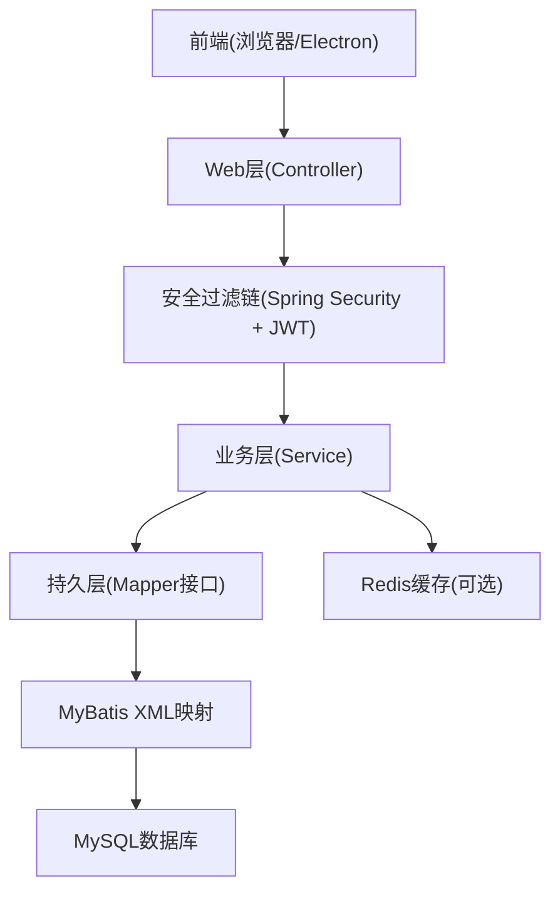
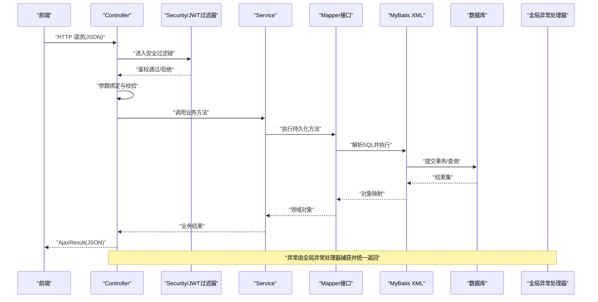
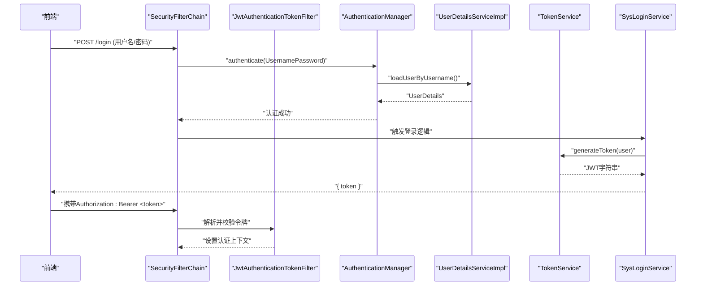
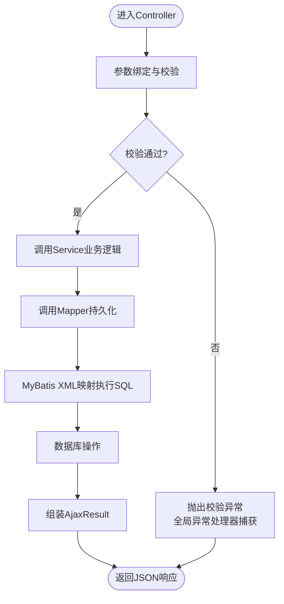
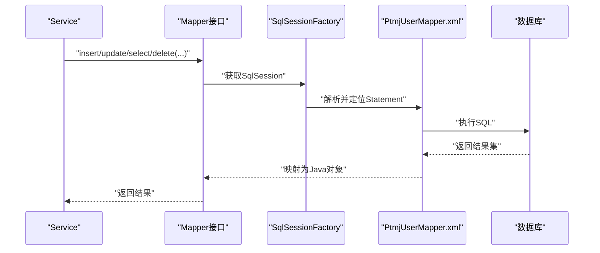
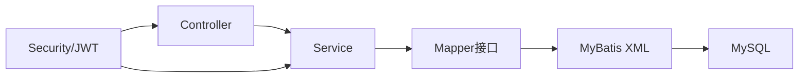

# 基础CRUD数据流

<cite>
**本文引用的文件**   
- [SecurityConfig.java](file://PezMax-Backend/ruoyi-framework/src/main/java/com/ruoyi/framework/config/SecurityConfig.java)
- [JwtAuthenticationTokenFilter.java](file://PezMax-Backend/ruoyi-framework/src/main/java/com/ruoyi/framework/security/filter/JwtAuthenticationTokenFilter.java)
- [GlobalExceptionHandler.java](file://PezMax-Backend/ruoyi-framework/src/main/java/com/ruoyi/framework/web/exception/GlobalExceptionHandler.java)
- [MyBatisConfig.java](file://PezMax-Backend/ruoyi-framework/src/main/java/com/ruoyi/framework/config/MyBatisConfig.java)
- [application.yml](file://PezMax-Backend/ruoyi-admin/src/main/resources/application.yml)
- [mybatis-config.xml](file://PezMax-Backend/ruoyi-admin/src/main/resources/mybatis/mybatis-config.xml)
- [AjaxResult.java](file://PezMax-Backend/ruoyi-common/src/main/java/com/ruoyi/common/core/domain/AjaxResult.java)
- [HttpStatus.java](file://PezMax-Backend/ruoyi-common/src/main/java/com/ruoyi/common/constant/HttpStatus.java)
- [ServiceException.java](file://PezMax-Backend/ruoyi-common/src/main/java/com/ruoyi/common/exception/ServiceException.java)
- [BaseController.java](file://PezMax-Backend/ruoyi-common/src/main/java/com/ruoyi/common/core/controller/BaseController.java)
- [SysLoginService.java](file://PezMax-Backend/ruoyi-framework/src/main/java/com/ruoyi/framework/web/service/SysLoginService.java)
- [TokenService.java](file://PezMax-Backend/ruoyi-framework/src/main/java/com/ruoyi/framework/web/service/TokenService.java)
- [UserDetailsServiceImpl.java](file://PezMax-Backend/ruoyi-framework/src/main/java/com/ruoyi/framework/web/service/UserDetailsServiceImpl.java)
- [PtmjUserMapper.java](file://PezMax-Backend/ptmj-datum/src/main/java/com/ptmj/datum/mapper/PtmjUserMapper.java)
- [PtmjUserMapper.xml](file://PezMax-Backend/ptmj-datum/src/main/resources/mapper/datum/PtmjUserMapper.xml)
</cite>

## 目录
1. [简介](#简介)
2. [项目结构](#项目结构)
3. [核心组件](#核心组件)
4. [架构总览](#架构总览)
5. [详细组件分析](#详细组件分析)
6. [依赖分析](#依赖分析)
7. [性能考虑](#性能考虑)
8. [故障排查指南](#故障排查指南)
9. [结论](#结论)
10. [附录](#附录)

## 简介
本文件面向 PezMax-One 后端，聚焦“基础CRUD”的数据流设计：从前端请求进入、参数校验、业务处理、JSON序列化/反序列化、到 MyBatis 映射与数据库持久化的完整链路；同时覆盖用户认证数据的处理流程、JWT 令牌生成与验证机制、事务管理策略以及异常与错误码返回规范。文档以可追溯的方式标注源码位置，便于读者对照实现细节。

## 项目结构
后端采用多模块分层架构：
- 入口与Web层：ruoyi-admin（Spring Boot 启动类、控制器）
- 框架与安全：ruoyi-framework（Security、JWT、全局异常、配置）
- 通用能力：ruoyi-common（统一响应、常量、异常、工具）
- 业务领域：ptmj-datum（领域模型、Mapper、Service、XML映射）
- 系统管理：ruoyi-system（系统级实体与操作）
- 代码生成与定时任务：ruoyi-generator、ruoyi-quartz

[本节为概念性结构说明，不直接分析具体文件，故无章节来源]

## 核心组件
- 安全与认证
  - Spring Security 过滤器链与匿名访问白名单
  - JWT 令牌过滤器
  - 登录服务与令牌服务
- 数据访问
  - MyBatis 配置与扫描
  - Mapper 接口与 XML 映射
- 统一响应与异常
  - AjaxResult 统一返回体
  - GlobalExceptionHandler 全局异常处理
  - HttpStatus 状态码常量
  - ServiceException 业务异常

章节来源
- [SecurityConfig.java:85-120](file://PezMax-Backend/ruoyi-framework/src/main/java/com/ruoyi/framework/config/SecurityConfig.java#L85-L120)
- [JwtAuthenticationTokenFilter.java](file://PezMax-Backend/ruoyi-framework/src/main/java/com/ruoyi/framework/security/filter/JwtAuthenticationTokenFilter.java)
- [SysLoginService.java](file://PezMax-Backend/ruoyi-framework/src/main/java/com/ruoyi/framework/web/service/SysLoginService.java)
- [TokenService.java](file://PezMax-Backend/ruoyi-framework/src/main/java/com/ruoyi/framework/web/service/TokenService.java)
- [UserDetailsServiceImpl.java](file://PezMax-Backend/ruoyi-framework/src/main/java/com/ruoyi/framework/web/service/UserDetailsServiceImpl.java)
- [MyBatisConfig.java:116-131](file://PezMax-Backend/ruoyi-framework/src/main/java/com/ruoyi/framework/config/MyBatisConfig.java#L116-L131)
- [PtmjUserMapper.java](file://PezMax-Backend/ptmj-datum/src/main/java/com/ptmj/datum/mapper/PtmjUserMapper.java)
- [PtmjUserMapper.xml](file://PezMax-Backend/ptmj-datum/src/main/resources/mapper/datum/PtmjUserMapper.xml)
- [GlobalExceptionHandler.java:27-145](file://PezMax-Backend/ruoyi-framework/src/main/java/com/ruoyi/framework/web/exception/GlobalExceptionHandler.java#L27-L145)
- [AjaxResult.java](file://PezMax-Backend/ruoyi-common/src/main/java/com/ruoyi/common/core/domain/AjaxResult.java)
- [HttpStatus.java](file://PezMax-Backend/ruoyi-common/src/main/java/com/ruoyi/common/constant/HttpStatus.java)
- [ServiceException.java](file://PezMax-Backend/ruoyi-common/src/main/java/com/ruoyi/common/exception/ServiceException.java)

## 架构总览
下图展示一次典型CRUD请求在系统中的流转路径，包括安全校验、参数绑定、业务处理、持久化与统一响应。

图表来源
- [SecurityConfig.java:85-120](file://PezMax-Backend/ruoyi-framework/src/main/java/com/ruoyi/framework/config/SecurityConfig.java#L85-L120)
- [MyBatisConfig.java:116-131](file://PezMax-Backend/ruoyi-framework/src/main/java/com/ruoyi/framework/config/MyBatisConfig.java#L116-L131)
- [GlobalExceptionHandler.java:27-145](file://PezMax-Backend/ruoyi-framework/src/main/java/com/ruoyi/framework/web/exception/GlobalExceptionHandler.java#L27-L145)

章节来源
- [SecurityConfig.java:85-120](file://PezMax-Backend/ruoyi-framework/src/main/java/com/ruoyi/framework/config/SecurityConfig.java#L85-L120)
- [MyBatisConfig.java:116-131](file://PezMax-Backend/ruoyi-framework/src/main/java/com/ruoyi/framework/config/MyBatisConfig.java#L116-L131)
- [GlobalExceptionHandler.java:27-145](file://PezMax-Backend/ruoyi-framework/src/main/java/com/ruoyi/framework/web/exception/GlobalExceptionHandler.java#L27-L145)

## 详细组件分析

### 安全与JWT认证数据流
- 过滤器链装配
  - 禁用CSRF、无状态会话
  - 注册认证失败处理器、退出处理器
  - 添加JWT过滤器与CORS过滤器
  - 配置匿名访问白名单（登录、注册、验证码、静态资源等）
- JWT 令牌验证
  - 从请求头提取令牌
  - 校验签名与有效期
  - 将认证信息写入上下文供后续使用
- 登录与令牌签发
  - 登录服务校验用户名/密码
  - 令牌服务生成JWT并缓存必要信息（如黑名单、刷新策略）
  - 用户详情加载器提供权限与角色信息

图表来源
- [SecurityConfig.java:85-120](file://PezMax-Backend/ruoyi-framework/src/main/java/com/ruoyi/framework/config/SecurityConfig.java#L85-L120)
- [JwtAuthenticationTokenFilter.java](file://PezMax-Backend/ruoyi-framework/src/main/java/com/ruoyi/framework/security/filter/JwtAuthenticationTokenFilter.java)
- [SysLoginService.java](file://PezMax-Backend/ruoyi-framework/src/main/java/com/ruoyi/framework/web/service/SysLoginService.java)
- [TokenService.java](file://PezMax-Backend/ruoyi-framework/src/main/java/com/ruoyi/framework/web/service/TokenService.java)
- [UserDetailsServiceImpl.java](file://PezMax-Backend/ruoyi-framework/src/main/java/com/ruoyi/framework/web/service/UserDetailsServiceImpl.java)

章节来源
- [SecurityConfig.java:85-120](file://PezMax-Backend/ruoyi-framework/src/main/java/com/ruoyi/framework/config/SecurityConfig.java#L85-L120)
- [JwtAuthenticationTokenFilter.java](file://PezMax-Backend/ruoyi-framework/src/main/java/com/ruoyi/framework/security/filter/JwtAuthenticationTokenFilter.java)
- [SysLoginService.java](file://PezMax-Backend/ruoyi-framework/src/main/java/com/ruoyi/framework/web/service/SysLoginService.java)
- [TokenService.java](file://PezMax-Backend/ruoyi-framework/src/main/java/com/ruoyi/framework/web/service/TokenService.java)
- [UserDetailsServiceImpl.java](file://PezMax-Backend/ruoyi-framework/src/main/java/com/ruoyi/framework/web/service/UserDetailsServiceImpl.java)

### CRUD请求处理与JSON序列化/反序列化
- 请求接收与参数绑定
  - Controller 接收 JSON 请求体，自动反序列化为DTO/VO
  - 支持 @Valid/@Validated 进行字段校验
- 业务处理
  - Service 层执行业务规则、权限检查、缓存读写
- 持久化
  - Mapper 接口调用对应 SQL
  - MyBatis 根据 XML 映射完成对象与记录的双向转换
- 响应封装
  - 统一返回 AjaxResult，包含状态码与消息
  - 全局异常处理器捕获各类异常并转换为统一格式

图表来源
- [GlobalExceptionHandler.java:27-145](file://PezMax-Backend/ruoyi-framework/src/main/java/com/ruoyi/framework/web/exception/GlobalExceptionHandler.java#L27-L145)
- [MyBatisConfig.java:116-131](file://PezMax-Backend/ruoyi-framework/src/main/java/com/ruoyi/framework/config/MyBatisConfig.java#L116-L131)
- [AjaxResult.java](file://PezMax-Backend/ruoyi-common/src/main/java/com/ruoyi/common/core/domain/AjaxResult.java)

章节来源
- [GlobalExceptionHandler.java:27-145](file://PezMax-Backend/ruoyi-framework/src/main/java/com/ruoyi/framework/web/exception/GlobalExceptionHandler.java#L27-L145)
- [MyBatisConfig.java:116-131](file://PezMax-Backend/ruoyi-framework/src/main/java/com/ruoyi/framework/config/MyBatisConfig.java#L116-L131)
- [AjaxResult.java](file://PezMax-Backend/ruoyi-common/src/main/java/com/ruoyi/common/core/domain/AjaxResult.java)

### MyBatis映射文件的执行流程
- 配置扫描
  - SqlSessionFactory 注入 DataSource、类型别名包、Mapper XML 位置、配置文件路径
- 映射解析
  - 通过 PathMatchingResourcePatternResolver 解析 mapperLocations
  - 将 XML 中的 SQL 与 Mapper 接口方法建立绑定关系
- 执行过程
  - 调用 Mapper 方法 -> 定位 XML Statement -> 构建参数 -> 执行SQL -> 结果映射为实体/集合

图表来源
- [MyBatisConfig.java:116-131](file://PezMax-Backend/ruoyi-framework/src/main/java/com/ruoyi/framework/config/MyBatisConfig.java#L116-L131)
- [PtmjUserMapper.xml](file://PezMax-Backend/ptmj-datum/src/main/resources/mapper/datum/PtmjUserMapper.xml)

章节来源
- [MyBatisConfig.java:116-131](file://PezMax-Backend/ruoyi-framework/src/main/java/com/ruoyi/framework/config/MyBatisConfig.java#L116-L131)
- [PtmjUserMapper.xml](file://PezMax-Backend/ptmj-datum/src/main/resources/mapper/datum/PtmjUserMapper.xml)

### 事务管理机制
- 默认行为
  - 基于 Spring 声明式事务，读方法默认只读，写方法开启事务
- 注解使用建议
  - 在 Service 层方法上使用 @Transactional 控制事务边界
  - 明确 propagation、isolation、rollbackFor 等属性
- 注意事项
  - 避免在循环中频繁提交导致性能问题
  - 跨库/分库场景需结合动态数据源与分布式事务方案

章节来源
- [MyBatisConfig.java:116-131](file://PezMax-Backend/ruoyi-framework/src/main/java/com/ruoyi/framework/config/MyBatisConfig.java#L116-L131)

### 用户认证数据处理流程
- 登录
  - 前端提交用户名/密码
  - 服务端校验并生成JWT
  - 返回令牌给前端存储
- 鉴权
  - 后续请求携带 Authorization 头
  - JWT 过滤器校验令牌有效性并填充认证上下文
- 登出
  - 清除本地令牌与服务端缓存（如有）

章节来源
- [SecurityConfig.java:85-120](file://PezMax-Backend/ruoyi-framework/src/main/java/com/ruoyi/framework/config/SecurityConfig.java#L85-L120)
- [JwtAuthenticationTokenFilter.java](file://PezMax-Backend/ruoyi-framework/src/main/java/com/ruoyi/framework/security/filter/JwtAuthenticationTokenFilter.java)
- [SysLoginService.java](file://PezMax-Backend/ruoyi-framework/src/main/java/com/ruoyi/framework/web/service/SysLoginService.java)
- [TokenService.java](file://PezMax-Backend/ruoyi-framework/src/main/java/com/ruoyi/framework/web/service/TokenService.java)

### 统一响应与错误码返回机制
- 统一响应体
  - AjaxResult 封装 code、msg、data
- 状态码
  - HttpStatus 定义常用HTTP状态码
- 异常分类
  - 参数校验异常、业务异常、系统异常、权限异常等
- 全局处理
  - GlobalExceptionHandler 捕获异常并返回统一格式

章节来源
- [AjaxResult.java](file://PezMax-Backend/ruoyi-common/src/main/java/com/ruoyi/common/core/domain/AjaxResult.java)
- [HttpStatus.java](file://PezMax-Backend/ruoyi-common/src/main/java/com/ruoyi/common/constant/HttpStatus.java)
- [ServiceException.java](file://PezMax-Backend/ruoyi-common/src/main/java/com/ruoyi/common/exception/ServiceException.java)
- [GlobalExceptionHandler.java:27-145](file://PezMax-Backend/ruoyi-framework/src/main/java/com/ruoyi/framework/web/exception/GlobalExceptionHandler.java#L27-L145)

## 依赖分析
- 组件耦合
  - Controller 依赖 Service，Service 依赖 Mapper，Mapper 依赖 XML 与数据库
  - Security 过滤器链贯穿所有请求，JWT 过滤器依赖 TokenService 与 UserDetails
- 外部依赖
  - MySQL、Redis（可选）、MinIO（文件存储）
- 潜在风险
  - 过度依赖全局异常可能导致错误语义模糊
  - 未显式声明事务的方法可能产生隐式事务边界

图表来源
- [SecurityConfig.java:85-120](file://PezMax-Backend/ruoyi-framework/src/main/java/com/ruoyi/framework/config/SecurityConfig.java#L85-L120)
- [MyBatisConfig.java:116-131](file://PezMax-Backend/ruoyi-framework/src/main/java/com/ruoyi/framework/config/MyBatisConfig.java#L116-L131)

章节来源
- [SecurityConfig.java:85-120](file://PezMax-Backend/ruoyi-framework/src/main/java/com/ruoyi/framework/config/SecurityConfig.java#L85-L120)
- [MyBatisConfig.java:116-131](file://PezMax-Backend/ruoyi-framework/src/main/java/com/ruoyi/framework/config/MyBatisConfig.java#L116-L131)

## 性能考虑
- 连接池与SQL优化
  - 合理配置 Druid 连接池大小与超时
  - 避免 N+1 查询，使用批量操作与分页
- 缓存策略
  - 热点数据使用 Redis 缓存，注意一致性
- 异步与限流
  - 耗时任务异步化，接口增加限流保护
- 序列化开销
  - 合理使用字段投影与视图，减少不必要字段传输

[本节为通用指导，不直接分析具体文件，故无章节来源]

## 故障排查指南
- 常见异常与处理
  - 权限不足：AccessDeniedException -> 403
  - 参数校验失败：BindException/MethodArgumentNotValidException -> 返回校验消息
  - 业务异常：ServiceException -> 自定义code与消息
  - 未知异常：RuntimeException/Exception -> 统一错误响应
- 排查步骤
  - 查看全局异常日志输出
  - 核对请求路径与方法是否匹配
  - 检查JWT令牌是否过期或无效
  - 确认数据库连接与SQL执行日志

章节来源
- [GlobalExceptionHandler.java:27-145](file://PezMax-Backend/ruoyi-framework/src/main/java/com/ruoyi/framework/web/exception/GlobalExceptionHandler.java#L27-L145)

## 结论
PezMax-One 后端采用清晰的分层与标准化流程：安全过滤链保障访问控制，JWT 提供无状态认证，MyBatis 负责数据持久化，全局异常处理器统一错误响应。遵循本文的数据流设计与最佳实践，可在保证一致性与可维护性的前提下高效扩展CRUD能力。

[本节为总结性内容，不直接分析具体文件，故无章节来源]

## 附录
- 关键配置参考
  - application.yml：应用主配置
  - mybatis-config.xml：MyBatis 全局配置
- 示例路径（用于对照实现）
  - 用户实体与Mapper：[PtmjUserMapper.java](file://PezMax-Backend/ptmj-datum/src/main/java/com/ptmj/datum/mapper/PtmjUserMapper.java)、[PtmjUserMapper.xml](file://PezMax-Backend/ptmj-datum/src/main/resources/mapper/datum/PtmjUserMapper.xml)
  - 统一响应与异常：[AjaxResult.java](file://PezMax-Backend/ruoyi-common/src/main/java/com/ruoyi/common/core/domain/AjaxResult.java)、[ServiceException.java](file://PezMax-Backend/ruoyi-common/src/main/java/com/ruoyi/common/exception/ServiceException.java)
  - 安全与JWT：[SecurityConfig.java](file://PezMax-Backend/ruoyi-framework/src/main/java/com/ruoyi/framework/config/SecurityConfig.java)、[JwtAuthenticationTokenFilter.java](file://PezMax-Backend/ruoyi-framework/src/main/java/com/ruoyi/framework/security/filter/JwtAuthenticationTokenFilter.java)

章节来源
- [application.yml](file://PezMax-Backend/ruoyi-admin/src/main/resources/application.yml)
- [mybatis-config.xml](file://PezMax-Backend/ruoyi-admin/src/main/resources/mybatis/mybatis-config.xml)
- [PtmjUserMapper.java](file://PezMax-Backend/ptmj-datum/src/main/java/com/ptmj/datum/mapper/PtmjUserMapper.java)
- [PtmjUserMapper.xml](file://PezMax-Backend/ptmj-datum/src/main/resources/mapper/datum/PtmjUserMapper.xml)
- [AjaxResult.java](file://PezMax-Backend/ruoyi-common/src/main/java/com/ruoyi/common/core/domain/AjaxResult.java)
- [ServiceException.java](file://PezMax-Backend/ruoyi-common/src/main/java/com/ruoyi/common/exception/ServiceException.java)
- [SecurityConfig.java:85-120](file://PezMax-Backend/ruoyi-framework/src/main/java/com/ruoyi/framework/config/SecurityConfig.java#L85-L120)
- [JwtAuthenticationTokenFilter.java](file://PezMax-Backend/ruoyi-framework/src/main/java/com/ruoyi/framework/security/filter/JwtAuthenticationTokenFilter.java)