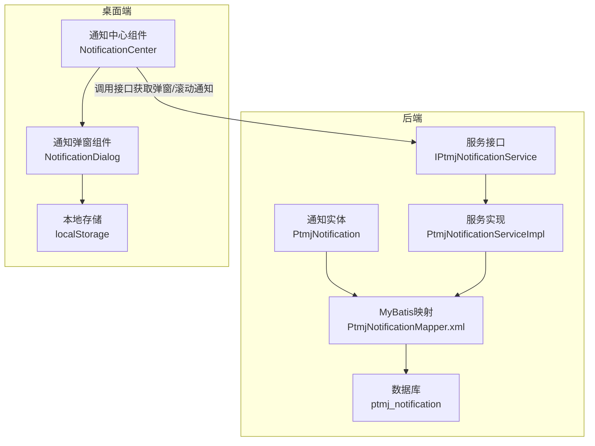
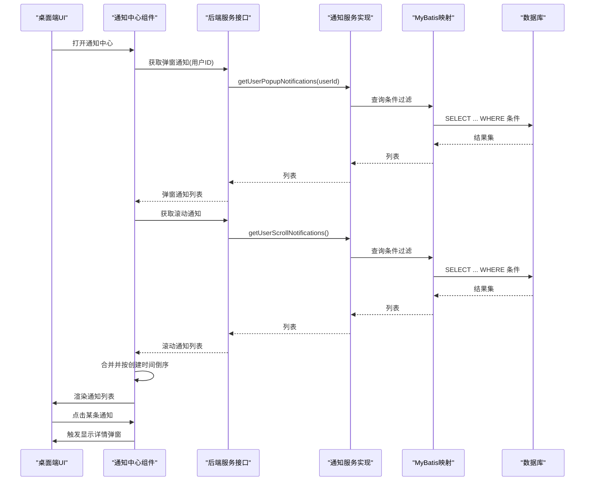
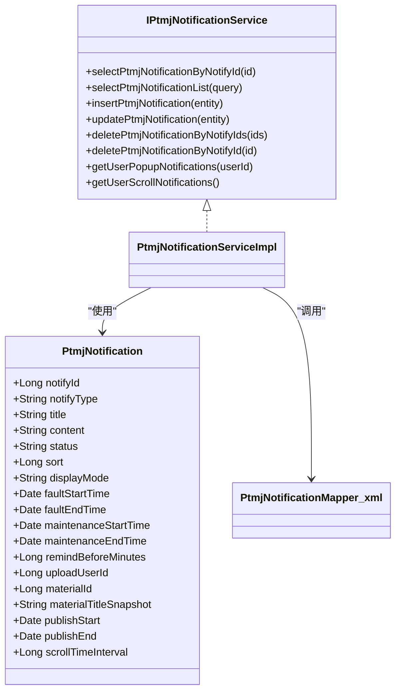
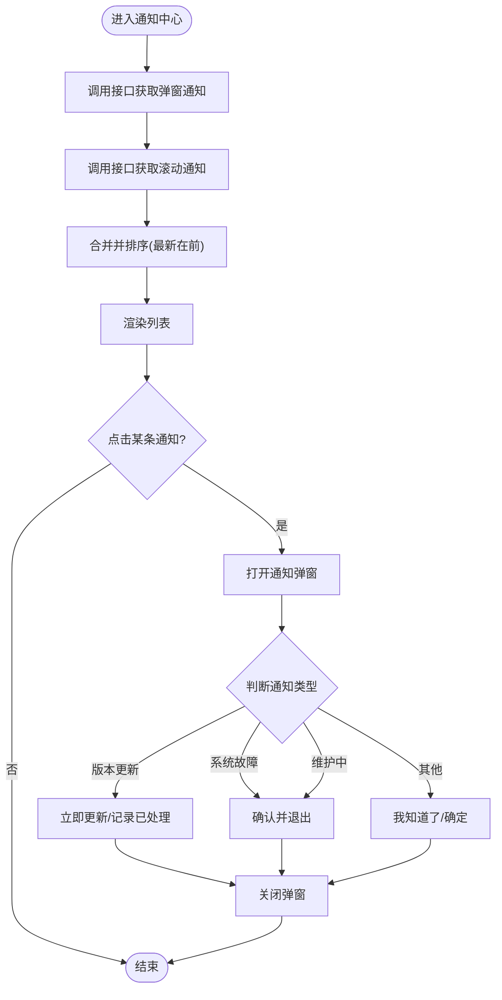
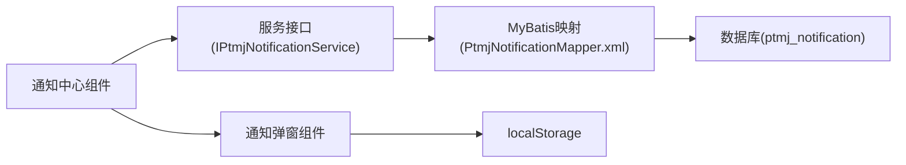

# 实时通知数据流

<cite>
**本文引用的文件**   
- [PtmjNotification.java](file://PezMax-Backend/ptmj-datum/src/main/java/com/ptmj/datum/domain/PtmjNotification.java)
- [PtmjNotificationMapper.xml](file://PezMax-Backend/ptmj-datum/src/main/resources/mapper/datum/PtmjNotificationMapper.xml)
- [IPtmjNotificationService.java](file://PezMax-Backend/ptmj-datum/src/main/java/com/ptmj/datum/service/IPtmjNotificationService.java)
- [PtmjNotificationServiceImpl.java](file://PezMax-Backend/ptmj-datum/src/main/java/com/ptmj/datum/service/impl/PtmjNotificationServiceImpl.java)
- [index.vue（通知中心）](file://PezMax-Desktop/src/renderer/components/NotificationCenter/index.vue)
- [index.vue（通知弹窗）](file://PezMax-Desktop/src/renderer/components/NotificationDialog/index.vue)
</cite>

## 目录
1. [引言](#引言)
2. [项目结构](#项目结构)
3. [核心组件](#核心组件)
4. [架构总览](#架构总览)
5. [详细组件分析](#详细组件分析)
6. [依赖分析](#依赖分析)
7. [性能考虑](#性能考虑)
8. [故障排查指南](#故障排查指南)
9. [结论](#结论)
10. [附录](#附录)

## 引言
本文件面向 PezMax-One 系统的“实时通知推送”能力，围绕通知消息的生成、存储、分发与处理进行系统化设计说明。重点覆盖：
- 通知类型与展示形态（系统公告、版本更新、维护通知等）
- 服务端数据模型与查询接口
- 桌面端通知中心与弹窗交互
- 离线缓存、去重、优先级与已读状态同步方案
- WebSocket 连接建立与订阅机制的设计建议（当前仓库未实现，提供可落地的扩展方案）

## 项目结构
本项目包含后端与桌面端两部分：
- 后端（Java/Spring Boot + MyBatis）：定义通知实体、持久化映射与服务接口，提供用户侧弹窗与滚动通知的查询能力。
- 桌面端（Electron + Vue）：提供通知中心面板与通知弹窗组件，负责拉取并渲染通知，以及根据通知类型执行相应操作。

图表来源
- [PtmjNotification.java:1-300](file://PezMax-Backend/ptmj-datum/src/main/java/com/ptmj/datum/domain/PtmjNotification.java#L1-L300)
- [PtmjNotificationMapper.xml:1-154](file://PezMax-Backend/ptmj-datum/src/main/resources/mapper/datum/PtmjNotificationMapper.xml#L1-L154)
- [IPtmjNotificationService.java:1-75](file://PezMax-Backend/ptmj-datum/src/main/java/com/ptmj/datum/service/IPtmjNotificationService.java#L1-L75)
- [PtmjNotificationServiceImpl.java](file://PezMax-Backend/ptmj-datum/src/main/java/com/ptmj/datum/service/impl/PtmjNotificationServiceImpl.java)
- [index.vue（通知中心）:1-293](file://PezMax-Desktop/src/renderer/components/NotificationCenter/index.vue#L1-L293)
- [index.vue（通知弹窗）:1-231](file://PezMax-Desktop/src/renderer/components/NotificationDialog/index.vue#L1-L231)

章节来源
- [PtmjNotification.java:1-300](file://PezMax-Backend/ptmj-datum/src/main/java/com/ptmj/datum/domain/PtmjNotification.java#L1-L300)
- [PtmjNotificationMapper.xml:1-154](file://PezMax-Backend/ptmj-datum/src/main/resources/mapper/datum/PtmjNotificationMapper.xml#L1-L154)
- [IPtmjNotificationService.java:1-75](file://PezMax-Backend/ptmj-datum/src/main/java/com/ptmj/datum/service/IPtmjNotificationService.java#L1-L75)
- [index.vue（通知中心）:1-293](file://PezMax-Desktop/src/renderer/components/NotificationCenter/index.vue#L1-L293)
- [index.vue（通知弹窗）:1-231](file://PezMax-Desktop/src/renderer/components/NotificationDialog/index.vue#L1-L231)

## 核心组件
- 通知实体 PtmjNotification
  - 字段涵盖通知类型、标题、正文、状态、排序/优先级、展示形态、故障/维护时间窗、提前提醒分钟数、下架相关字段、滚动发布窗口与间隔等。
  - 通过 BaseEntity 继承通用审计字段（创建人、创建时间、更新人、更新时间、备注）。
- 服务接口 IPtmjNotificationService
  - 提供基础 CRUD 与两个用户侧聚合查询：
    - 获取用户端需要以弹窗形式展示的通知列表
    - 获取用户端需要以滚动形式展示的通知列表
- 桌面端组件
  - 通知中心：聚合弹窗与滚动两类通知，按创建时间倒序展示，点击后触发详情弹窗。
  - 通知弹窗：根据通知类型控制是否可关闭、按钮行为（立即更新/确认退出/我知道了），并对部分类型记录本地已处理标记。

章节来源
- [PtmjNotification.java:1-300](file://PezMax-Backend/ptmj-datum/src/main/java/com/ptmj/datum/domain/PtmjNotification.java#L1-L300)
- [IPtmjNotificationService.java:1-75](file://PezMax-Backend/ptmj-datum/src/main/java/com/ptmj/datum/service/IPtmjNotificationService.java#L1-L75)
- [index.vue（通知中心）:1-293](file://PezMax-Desktop/src/renderer/components/NotificationCenter/index.vue#L1-L293)
- [index.vue（通知弹窗）:1-231](file://PezMax-Desktop/src/renderer/components/NotificationDialog/index.vue#L1-L231)

## 架构总览
下图展示了从桌面端发起请求到后端返回数据的端到端流程，以及桌面端对不同类型通知的处理分支。

图表来源
- [index.vue（通知中心）:1-293](file://PezMax-Desktop/src/renderer/components/NotificationCenter/index.vue#L1-L293)
- [IPtmjNotificationService.java:1-75](file://PezMax-Backend/ptmj-datum/src/main/java/com/ptmj/datum/service/IPtmjNotificationService.java#L1-L75)
- [PtmjNotificationServiceImpl.java](file://PezMax-Backend/ptmj-datum/src/main/java/com/ptmj/datum/service/impl/PtmjNotificationServiceImpl.java)
- [PtmjNotificationMapper.xml:1-154](file://PezMax-Backend/ptmj-datum/src/main/resources/mapper/datum/PtmjNotificationMapper.xml#L1-L154)

## 详细组件分析

### 数据模型与持久化
- 实体字段与业务含义
  - 通知类型：版本更新、系统故障、系统维护、资料下架、日常滚动
  - 展示形态：弹窗或滚动字幕
  - 优先级：sort 越大越优先弹出
  - 时间窗：故障/维护的开始与结束时间；维护提前提醒分钟数
  - 滚动发布：开始/结束时间与滚动间隔
  - 下架信息：上传者ID、被下架资料ID与快照标题
- 查询与筛选
  - 管理端支持按故障/维护时间段与所选区间有交集的条件查询
  - 用户端提供两类聚合查询：弹窗通知与滚动通知

图表来源
- [PtmjNotification.java:1-300](file://PezMax-Backend/ptmj-datum/src/main/java/com/ptmj/datum/domain/PtmjNotification.java#L1-L300)
- [IPtmjNotificationService.java:1-75](file://PezMax-Backend/ptmj-datum/src/main/java/com/ptmj/datum/service/IPtmjNotificationService.java#L1-L75)
- [PtmjNotificationServiceImpl.java](file://PezMax-Backend/ptmj-datum/src/main/java/com/ptmj/datum/service/impl/PtmjNotificationServiceImpl.java)
- [PtmjNotificationMapper.xml:1-154](file://PezMax-Backend/ptmj-datum/src/main/resources/mapper/datum/PtmjNotificationMapper.xml#L1-L154)

章节来源
- [PtmjNotification.java:1-300](file://PezMax-Backend/ptmj-datum/src/main/java/com/ptmj/datum/domain/PtmjNotification.java#L1-L300)
- [PtmjNotificationMapper.xml:1-154](file://PezMax-Backend/ptmj-datum/src/main/resources/mapper/datum/PtmjNotificationMapper.xml#L1-L154)
- [IPtmjNotificationService.java:1-75](file://PezMax-Backend/ptmj-datum/src/main/java/com/ptmj/datum/service/IPtmjNotificationService.java#L1-L75)

### 桌面端通知中心与弹窗
- 通知中心
  - 分别调用“弹窗通知”和“滚动通知”接口，合并后按创建时间倒序展示
  - 点击条目触发自定义事件，由上层容器打开详情弹窗
- 通知弹窗
  - 根据通知类型动态决定按钮文案与是否允许关闭
  - 对“版本更新（强制）”、“系统故障”、“正式维护期间”等场景禁止关闭
  - 对“版本更新”和“资料下架”在本地记录已处理ID，避免重复打扰

图表来源
- [index.vue（通知中心）:1-293](file://PezMax-Desktop/src/renderer/components/NotificationCenter/index.vue#L1-L293)
- [index.vue（通知弹窗）:1-231](file://PezMax-Desktop/src/renderer/components/NotificationDialog/index.vue#L1-L231)

章节来源
- [index.vue（通知中心）:1-293](file://PezMax-Desktop/src/renderer/components/NotificationCenter/index.vue#L1-L293)
- [index.vue（通知弹窗）:1-231](file://PezMax-Desktop/src/renderer/components/NotificationDialog/index.vue#L1-L231)

### 通知类型与处理逻辑
- 版本更新（notifyType=1）
  - 展示形态：弹窗
  - 行为：若为强制更新则不可关闭；用户点击“立即更新”后打开下载链接，并在本地记录已处理ID
- 系统故障（notifyType=2）
  - 展示形态：弹窗
  - 行为：不可关闭；用户需“确认并退出”应用
- 系统维护（notifyType=3）
  - 展示形态：弹窗
  - 行为：若在维护时间窗内则不可关闭；否则可按普通通知处理
- 资料下架（notifyType=4）
  - 展示形态：弹窗
  - 行为：用户点击“我知道了”，并在本地记录已处理ID
- 日常滚动（notifyType=5）
  - 展示形态：滚动字幕
  - 行为：依据 publishStart/publishEnd 与 scrollTimeInterval 控制展示周期与间隔

章节来源
- [PtmjNotification.java:1-300](file://PezMax-Backend/ptmj-datum/src/main/java/com/ptmj/datum/domain/PtmjNotification.java#L1-300)
- [index.vue（通知弹窗）:1-231](file://PezMax-Desktop/src/renderer/components/NotificationDialog/index.vue#L1-L231)

### 离线消息缓存与去重
- 本地缓存策略
  - 使用 localStorage 保存已处理的特定类型通知ID集合（如版本更新、资料下架）
  - 每次打开弹窗时读取该集合，避免重复提示
- 去重机制
  - 客户端侧基于 notifyId 去重
  - 服务端可在聚合查询中结合“最近N天”、“用户已读状态”等维度进一步过滤（见高级特性建议）

章节来源
- [index.vue（通知弹窗）:1-231](file://PezMax-Desktop/src/renderer/components/NotificationDialog/index.vue#L1-L231)

### 优先级管理与展示顺序
- 服务端
  - 实体含 sort 字段，值越大优先级越高
  - 建议在聚合查询中对结果按 sort 降序排列，再结合 createTime 做稳定排序
- 客户端
  - 当前实现按 createTime 倒序展示
  - 可扩展为先按 sort 降序，再按 createTime 倒序，确保高优先级通知靠前

章节来源
- [PtmjNotification.java:1-300](file://PezMax-Backend/ptmj-datum/src/main/java/com/ptmj/datum/domain/PtmjNotification.java#L1-300)
- [index.vue（通知中心）:1-293](file://PezMax-Desktop/src/renderer/components/NotificationCenter/index.vue#L1-L293)

### 已读状态同步
- 现状
  - 当前未实现服务端“已读”状态表与接口
- 建议方案
  - 新增“通知-用户已读”关系表（user_id, notify_id, read_time）
  - 在聚合查询中排除用户已读且非强制类型的通知
  - 客户端在用户点击“我知道了/确认并退出”后，异步上报已读状态

[本节为概念性建议，不直接分析具体文件]

### WebSocket 实时推送（扩展设计）
- 目标
  - 在用户在线时，将新通知即时推送到桌面端，减少轮询开销
- 关键流程
  - 连接建立：桌面端登录后建立 WebSocket 连接，携带用户标识
  - 订阅机制：服务端按用户ID或角色/标签进行消息路由
  - 消息格式：统一封装 type、payload、priority、id 等字段
  - 断线重连：指数退避重试，保持会话上下文
  - 离线兜底：断开期间消息入队，恢复后补发未送达消息
- 与现有能力集成
  - 推送到达后，桌面端可直接插入通知列表并触发弹窗（遵循优先级与去重规则）
  - 与本地已读状态联动，避免重复提示

[本节为概念性设计，不直接分析具体文件]

## 依赖分析
- 组件耦合
  - 通知中心依赖服务接口提供的两类聚合查询
  - 通知弹窗依赖通知实体的字段语义（类型、时间窗、展示形态）
- 外部依赖
  - 数据库：ptmj_notification 表
  - 本地存储：localStorage（用于去重与已处理标记）

图表来源
- [IPtmjNotificationService.java:1-75](file://PezMax-Backend/ptmj-datum/src/main/java/com/ptmj/datum/service/IPtmjNotificationService.java#L1-L75)
- [PtmjNotificationMapper.xml:1-154](file://PezMax-Backend/ptmj-datum/src/main/resources/mapper/datum/PtmjNotificationMapper.xml#L1-L154)
- [index.vue（通知中心）:1-293](file://PezMax-Desktop/src/renderer/components/NotificationCenter/index.vue#L1-L293)
- [index.vue（通知弹窗）:1-231](file://PezMax-Desktop/src/renderer/components/NotificationDialog/index.vue#L1-L231)

章节来源
- [IPtmjNotificationService.java:1-75](file://PezMax-Backend/ptmj-datum/src/main/java/com/ptmj/datum/service/IPtmjNotificationService.java#L1-L75)
- [PtmjNotificationMapper.xml:1-154](file://PezMax-Backend/ptmj-datum/src/main/resources/mapper/datum/PtmjNotificationMapper.xml#L1-L154)
- [index.vue（通知中心）:1-293](file://PezMax-Desktop/src/renderer/components/NotificationCenter/index.vue#L1-L293)
- [index.vue（通知弹窗）:1-231](file://PezMax-Desktop/src/renderer/components/NotificationDialog/index.vue#L1-L231)

## 性能考虑
- 查询优化
  - 在服务端聚合查询中增加索引（如 notify_type、status、publish_start/end、fault/maintenance 时间字段）
  - 分页与限制返回条数，避免一次性加载过多历史通知
- 前端渲染
  - 列表虚拟化或懒加载，提升长列表渲染性能
  - 合并请求与防抖，避免频繁刷新导致抖动
- 缓存策略
  - 对滚动通知采用短TTL缓存（如Redis），降低数据库压力
  - 客户端对近期通知做内存缓存，切换页面时复用

[本节提供通用指导，不直接分析具体文件]

## 故障排查指南
- 常见问题
  - 通知未显示：检查用户ID是否正确、接口是否返回空列表、本地去重集合是否误判
  - 强制更新无法关闭：确认 notifyType=1 且 forceUpdate=1 的场景是否符合预期
  - 维护通知无法关闭：确认当前时间是否在维护时间窗内
- 定位步骤
  - 查看后端日志与SQL执行计划，确认聚合查询条件与索引命中情况
  - 检查桌面端控制台输出与网络请求响应体
  - 核对本地存储中的已处理ID集合，必要时清理测试数据

章节来源
- [index.vue（通知弹窗）:1-231](file://PezMax-Desktop/src/renderer/components/NotificationDialog/index.vue#L1-L231)
- [index.vue（通知中心）:1-293](file://PezMax-Desktop/src/renderer/components/NotificationCenter/index.vue#L1-L293)

## 结论
当前系统已具备完整的通知数据模型与用户侧聚合查询能力，桌面端实现了通知中心与弹窗交互，并针对部分类型提供了本地去重与行为控制。为实现真正的“实时推送”，建议引入 WebSocket 通道与离线队列，配合服务端已读状态与优先级排序，形成端到端的可靠通知体系。

[本节为总结性内容，不直接分析具体文件]

## 附录
- 术语
  - 弹窗通知：以模态对话框形式强提醒用户的通知
  - 滚动通知：以滚动字幕形式持续展示的通知
  - 优先级：sort 字段越大越优先展示
  - 去重：基于 notifyId 的重复提示抑制
  - 已读状态：用户对通知的交互反馈，用于后续过滤与统计

[本节为概念性补充，不直接分析具体文件]