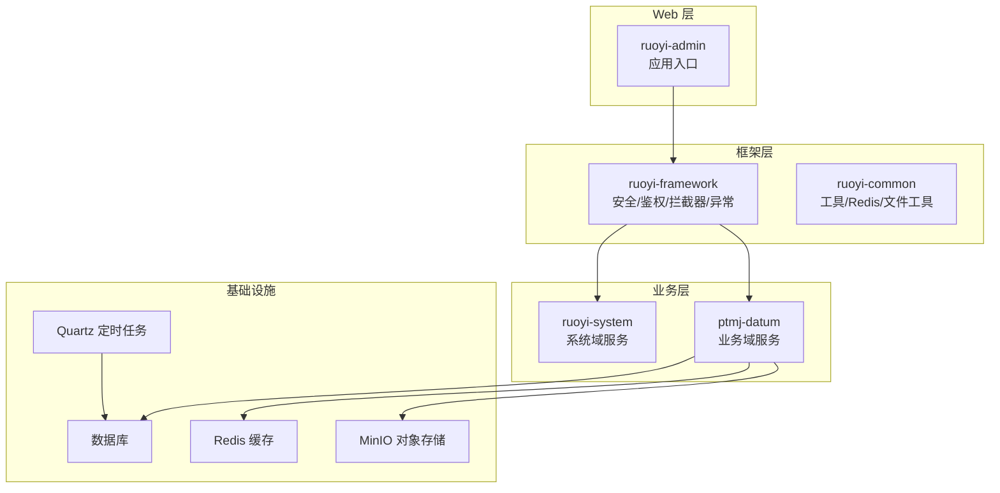
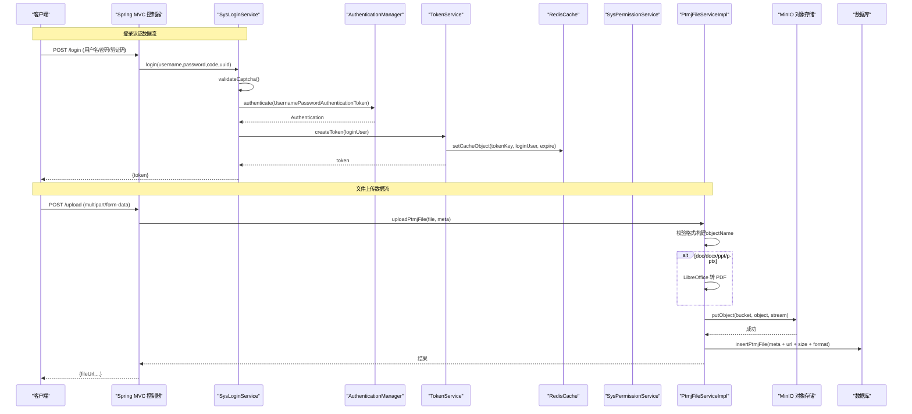
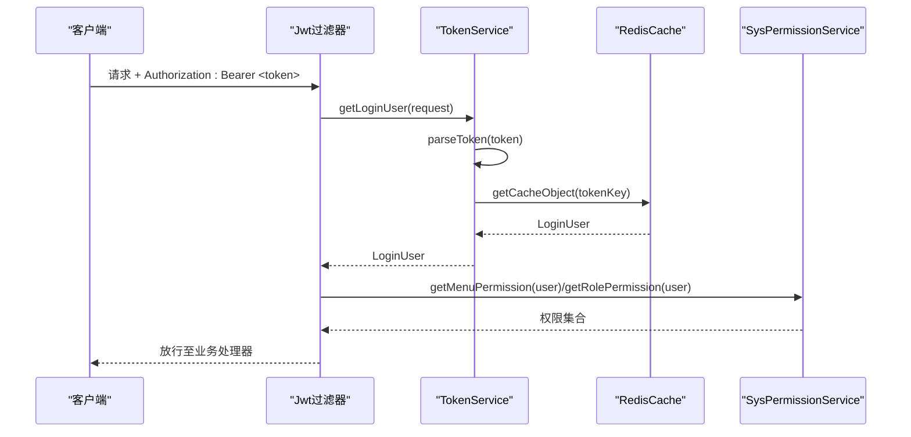
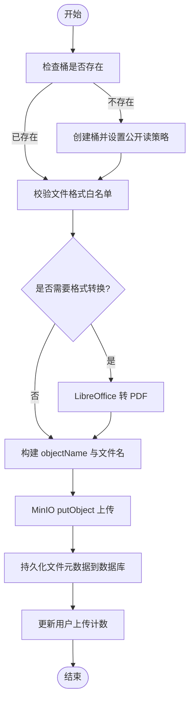
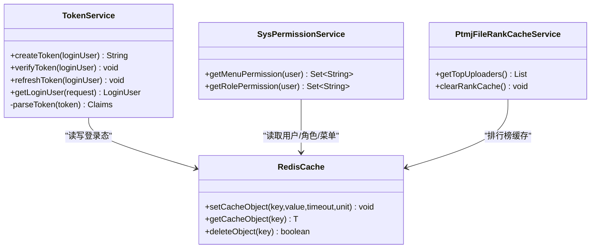
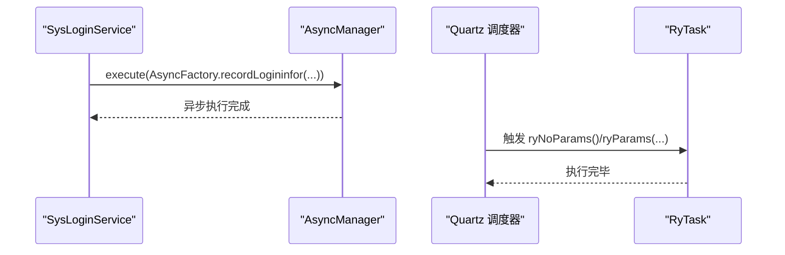
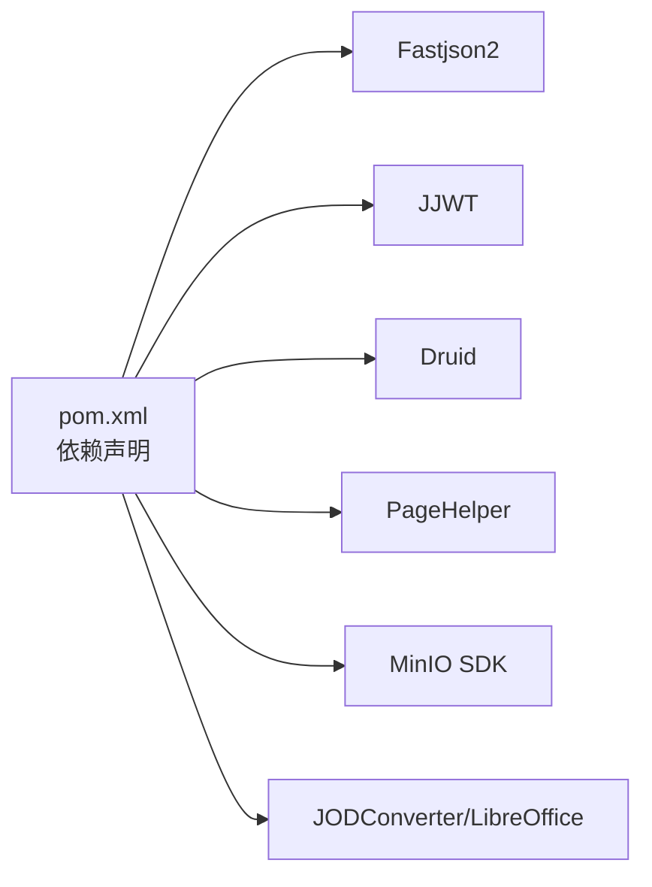

# 数据流设计

<cite>
**本文引用的文件**   
- [pom.xml](file://PezMax-Backend/pom.xml)
- [TokenService.java](file://PezMax-Backend/ruoyi-framework/src/main/java/com/ruoyi/framework/web/service/TokenService.java)
- [SysLoginService.java](file://PezMax-Backend/ruoyi-framework/src/main/java/com/ruoyi/framework/web/service/SysLoginService.java)
- [SysPermissionService.java](file://PezMax-Backend/ruoyi-framework/src/main/java/com/ruoyi/framework/web/service/SysPermissionService.java)
- [RedisCache.java](file://PezMax-Backend/ruoyi-common/src/main/java/com/ruoyi/common/core/redis/RedisCache.java)
- [MinioStorageService.java](file://PezMax-Backend/ruoyi-common/src/main/java/com/ruoyi/common/utils/file/MinioStorageService.java)
- [IPtmjFileService.java](file://PezMax-Backend/ptmj-datum/src/main/java/com/ptmj/datum/service/IPtmjFileService.java)
- [PtmjFileServiceImpl.java](file://PezMax-Backend/ptmj-datum/src/main/java/com/ptmj/datum/service/impl/PtmjFileServiceImpl.java)
- [PtmjUser.java](file://PezMax-Backend/ptmj-datum/src/main/java/com/ptmj/datum/domain/PtmjUser.java)
- [RyTask.java](file://PezMax-Backend/ruoyi-quartz/src/main/java/com/ruoyi/quartz/task/RyTask.java)
</cite>

## 目录
1. [引言](#引言)
2. [项目结构](#项目结构)
3. [核心组件](#核心组件)
4. [架构总览](#架构总览)
5. [详细组件分析](#详细组件分析)
6. [依赖分析](#依赖分析)
7. [性能考虑](#性能考虑)
8. [故障排查指南](#故障排查指南)
9. [结论](#结论)
10. [附录](#附录)

## 引言
本文件面向 PezMax-One 系统的数据流设计，覆盖从客户端到数据库的完整数据流转过程，重点包括：
- HTTP 请求处理与 JSON 序列化/反序列化
- 事务管理与缓存策略（Redis）
- 文件上传下载、对象存储（MinIO）集成与格式转换
- 用户认证与安全（JWT、权限校验、会话管理）
- 异步任务与定时任务的数据流
- 日志记录的数据流
- 实时通知推送的数据流（概念性说明）

文档通过架构图与时序图展示关键业务流程的数据传递路径，帮助读者快速理解系统整体数据走向。

## 项目结构
后端采用多模块 Maven 工程，核心模块职责如下：
- ruoyi-admin：应用启动与 Web 入口
- ruoyi-framework：安全、鉴权、拦截器、线程池、全局异常等框架能力
- ruoyi-system：系统域服务（用户、角色、菜单、配置等）
- ruoyi-common：通用工具、常量、异常、Redis 封装、文件工具等
- ptmj-datum：业务领域（试卷文件、收藏、报告、通知等）
- ruoyi-quartz：定时任务调度
- ruoyi-generator：代码生成

图表来源
- [pom.xml:177-185](file://PezMax-Backend/pom.xml#L177-L185)

章节来源
- [pom.xml:177-185](file://PezMax-Backend/pom.xml#L177-L185)

## 核心组件
- 认证与会话
  - TokenService：负责 JWT 令牌签发、解析、刷新与过期续期；将登录态写入 Redis。
  - SysLoginService：登录流程编排，含验证码校验、前置校验、认证管理器调用、登录信息记录与令牌生成。
  - SysPermissionService：基于角色与菜单的权限集合计算，用于接口级或页面级权限控制。
- 文件与对象存储
  - PtmjFileServiceImpl：文件上传主流程，包含桶存在性检查、访问策略设置、格式白名单校验、LibreOffice 转 PDF、MinIO 上传、URL 组装、元数据落库与排行榜缓存清理。
  - MinioStorageService：通用 MinIO 上传封装（根目录上传），返回文件名、URL、大小、格式与 objectName。
- 缓存
  - RedisCache：对 Spring Data Redis 的统一封装，提供 Value/List/Set/Map 操作与过期时间管理。
- 定时任务
  - RyTask：Quartz 示例任务，演示参数化方法执行。

章节来源
- [TokenService.java:1-233](file://PezMax-Backend/ruoyi-framework/src/main/java/com/ruoyi/framework/web/service/TokenService.java#L1-L233)
- [SysLoginService.java:1-177](file://PezMax-Backend/ruoyi-framework/src/main/java/com/ruoyi/framework/web/service/SysLoginService.java#L1-L177)
- [SysPermissionService.java:1-90](file://PezMax-Backend/ruoyi-framework/src/main/java/com/ruoyi/framework/web/service/SysPermissionService.java#L1-L90)
- [PtmjFileServiceImpl.java:1-604](file://PezMax-Backend/ptmj-datum/src/main/java/com/ptmj/datum/service/impl/PtmjFileServiceImpl.java#L1-L604)
- [MinioStorageService.java:1-88](file://PezMax-Backend/ruoyi-common/src/main/java/com/ruoyi/common/utils/file/MinioStorageService.java#L1-L88)
- [RedisCache.java:1-269](file://PezMax-Backend/ruoyi-common/src/main/java/com/ruoyi/common/core/redis/RedisCache.java#L1-L269)
- [RyTask.java:1-29](file://PezMax-Backend/ruoyi-quartz/src/main/java/com/ruoyi/quartz/task/RyTask.java#L1-L29)

## 架构总览
下图展示了“登录认证”和“文件上传”两条典型数据流在系统中的流转路径。

图表来源
- [SysLoginService.java:63-100](file://PezMax-Backend/ruoyi-framework/src/main/java/com/ruoyi/framework/web/service/SysLoginService.java#L63-L100)
- [TokenService.java:114-155](file://PezMax-Backend/ruoyi-framework/src/main/java/com/ruoyi/framework/web/service/TokenService.java#L114-L155)
- [RedisCache.java:47-50](file://PezMax-Backend/ruoyi-common/src/main/java/com/ruoyi/common/core/redis/RedisCache.java#L47-L50)
- [PtmjFileServiceImpl.java:388-556](file://PezMax-Backend/ptmj-datum/src/main/java/com/ptmj/datum/service/impl/PtmjFileServiceImpl.java#L388-L556)

## 详细组件分析

### 认证与授权数据流
- 登录流程
  - 输入校验：验证码开关、验证码有效性、用户名/密码长度、IP 黑名单。
  - 认证：通过 Spring Security 的 AuthenticationManager 进行认证。
  - 会话：成功后构造 LoginUser，写入 Redis（带过期时间），并签发 JWT。
  - 响应：返回 token，客户端后续请求携带该 token。
- 鉴权流程
  - 每次请求由过滤器提取 header 中的 token，解析出用户标识，再从 Redis 获取 LoginUser。
  - 根据用户角色与菜单权限计算权限集合，供注解式鉴权使用。

图表来源
- [TokenService.java:62-83](file://PezMax-Backend/ruoyi-framework/src/main/java/com/ruoyi/framework/web/service/TokenService.java#L62-L83)
- [TokenService.java:192-198](file://PezMax-Backend/ruoyi-framework/src/main/java/com/ruoyi/framework/web/service/TokenService.java#L192-L198)
- [SysPermissionService.java:37-88](file://PezMax-Backend/ruoyi-framework/src/main/java/com/ruoyi/framework/web/service/SysPermissionService.java#L37-L88)

章节来源
- [SysLoginService.java:63-100](file://PezMax-Backend/ruoyi-framework/src/main/java/com/ruoyi/framework/web/service/SysLoginService.java#L63-L100)
- [TokenService.java:114-155](file://PezMax-Backend/ruoyi-framework/src/main/java/com/ruoyi/framework/web/service/TokenService.java#L114-L155)
- [SysPermissionService.java:37-88](file://PezMax-Backend/ruoyi-framework/src/main/java/com/ruoyi/framework/web/service/SysPermissionService.java#L37-L88)

### 文件上传与下载数据流
- 上传流程要点
  - 桶策略：首次上传时检测桶是否存在，不存在则创建并设置公开读策略（允许匿名访问）。
  - 格式白名单：仅允许配置中指定的扩展名。
  - 格式转换：doc/docx/ppt/pptx 经 LibreOffice 转换为 PDF，再上传。
  - 对象命名：subject/type/year/[自定义目录]/safeFileName，兼容历史字段。
  - 元数据持久化：保存 URL、大小、格式、状态等，并更新用户上传计数。
  - 事务边界：整个上传与入库在同一事务内，失败回滚。
- 下载流程
  - 直接通过 MinIO 生成的 URL 访问对象，无需经过后端转发。

图表来源
- [PtmjFileServiceImpl.java:388-556](file://PezMax-Backend/ptmj-datum/src/main/java/com/ptmj/datum/service/impl/PtmjFileServiceImpl.java#L388-L556)

章节来源
- [PtmjFileServiceImpl.java:388-556](file://PezMax-Backend/ptmj-datum/src/main/java/com/ptmj/datum/service/impl/PtmjFileServiceImpl.java#L388-L556)
- [MinioStorageService.java:35-77](file://PezMax-Backend/ruoyi-common/src/main/java/com/ruoyi/common/utils/file/MinioStorageService.java#L35-L77)

### 大文件分片与断点续传（建议方案）
当前实现为单流上传，未内置分片与断点续传。若需支持大文件，可参考以下数据流设计：
- 客户端侧
  - 将大文件切分为固定大小的分片，计算每个分片的哈希值。
  - 先调用“初始化分片上传”接口，服务端返回 uploadId。
  - 逐个上传分片，附带 uploadId、分片序号与分片哈希。
  - 全部上传完成后，调用“合并分片”接口完成最终对象合成。
- 服务端侧
  - 使用 MinIO 的分片上传 API（如 multipartUpload）接收分片。
  - 维护分片索引（Redis），支持断点续传与并发重试。
  - 合并后更新文件元数据（URL、大小、分片数、状态等）。
- 数据一致性
  - 以事务包裹元数据更新；对象存储失败则回滚元数据。
  - 引入幂等键（uploadId）避免重复合并。

[本节为概念性设计，不直接对应具体源码]

### 用户模型与敏感字段处理
- PtmjUser 实体中密码字段设置为仅写，避免在 JSON 响应中泄露。
- 其他字段（头像、状态、计数等）按业务需要参与序列化。

章节来源
- [PtmjUser.java:1-139](file://PezMax-Backend/ptmj-datum/src/main/java/com/ptmj/datum/domain/PtmjUser.java#L1-L139)

### 缓存策略与数据流
- 登录态缓存
  - TokenService 在签发与刷新令牌时将 LoginUser 写入 Redis，键前缀统一，过期时间与令牌一致。
  - 验证令牌时，先从 JWT 解析出 token，再查 Redis 获取完整用户上下文。
- 排行榜缓存
  - 当文件审核通过导致排名变化时，触发排行榜缓存清理，保证查询一致性。

图表来源
- [TokenService.java:114-155](file://PezMax-Backend/ruoyi-framework/src/main/java/com/ruoyi/framework/web/service/TokenService.java#L114-L155)
- [RedisCache.java:47-50](file://PezMax-Backend/ruoyi-common/src/main/java/com/ruoyi/common/core/redis/RedisCache.java#L47-L50)
- [PtmjFileRankCacheService.java:7-12](file://PezMax-Backend/ptmj-datum/src/main/java/com/ptmj/datum/service/PtmjFileRankCacheService.java#L7-L12)

章节来源
- [TokenService.java:62-83](file://PezMax-Backend/ruoyi-framework/src/main/java/com/ruoyi/framework/web/service/TokenService.java#L62-L83)
- [RedisCache.java:1-269](file://PezMax-Backend/ruoyi-common/src/main/java/com/ruoyi/common/core/redis/RedisCache.java#L1-L269)
- [PtmjFileRankCacheService.java:7-12](file://PezMax-Backend/ptmj-datum/src/main/java/com/ptmj/datum/service/PtmjFileRankCacheService.java#L7-L12)

### 事务管理与数据一致性
- 文件上传与元数据写入在同一事务中，确保对象存储与数据库的一致性。
- 审核通过触发排行榜缓存清理，避免脏读。

章节来源
- [PtmjFileServiceImpl.java:388-556](file://PezMax-Backend/ptmj-datum/src/main/java/com/ptmj/datum/service/impl/PtmjFileServiceImpl.java#L388-L556)

### 异步任务与定时任务数据流
- 异步任务
  - 登录失败/成功等事件通过异步工厂记录登录日志，降低主流程阻塞。
- 定时任务
  - 通过 Quartz 注册任务类，支持无参/有参方法执行，便于周期性数据整理或报表生成。

图表来源
- [SysLoginService.java:82-95](file://PezMax-Backend/ruoyi-framework/src/main/java/com/ruoyi/framework/web/service/SysLoginService.java#L82-L95)
- [RyTask.java:14-27](file://PezMax-Backend/ruoyi-quartz/src/main/java/com/ruoyi/quartz/task/RyTask.java#L14-L27)

章节来源
- [SysLoginService.java:82-95](file://PezMax-Backend/ruoyi-framework/src/main/java/com/ruoyi/framework/web/service/SysLoginService.java#L82-L95)
- [RyTask.java:1-29](file://PezMax-Backend/ruoyi-quartz/src/main/java/com/ruoyi/quartz/task/RyTask.java#L1-L29)

### 日志记录数据流
- 登录相关日志通过异步方式记录，包含成功/失败原因、IP、时间等。
- 文件上传过程中对关键步骤（格式转换、上传结果）进行日志输出，便于问题定位。

章节来源
- [SysLoginService.java:82-95](file://PezMax-Backend/ruoyi-framework/src/main/java/com/ruoyi/framework/web/service/SysLoginService.java#L82-L95)
- [PtmjFileServiceImpl.java:422-448](file://PezMax-Backend/ptmj-datum/src/main/java/com/ptmj/datum/service/impl/PtmjFileServiceImpl.java#L422-L448)

### 实时通知推送数据流（概念性）
- 可选方案
  - WebSocket：服务端维护连接映射，按用户维度推送消息。
  - SSE：单向推送，适合轻量通知。
  - 消息队列：生产者发布通知事件，消费者持久化并推送给在线用户。
- 数据流要点
  - 事件源（如文件审核通过）→ 事件总线 → 通知服务 → 推送通道（WebSocket/SSE/MQ）。
  - 离线消息持久化，用户上线后拉取未读列表。

[本节为概念性设计，不直接对应具体源码]

## 依赖分析
- 外部依赖
  - Fastjson2：JSON 序列化/反序列化。
  - JJWT：JWT 令牌签发与解析。
  - Druid：数据库连接池。
  - PageHelper：分页插件。
  - MinIO SDK：对象存储交互。
  - JODConverter/LibreOffice：文档格式转换。
- 模块依赖
  - 上层模块依赖框架与通用能力，业务模块依赖系统域与通用工具。

图表来源
- [pom.xml:118-130](file://PezMax-Backend/pom.xml#L118-L130)
- [pom.xml:50-75](file://PezMax-Backend/pom.xml#L50-L75)

章节来源
- [pom.xml:118-130](file://PezMax-Backend/pom.xml#L118-L130)
- [pom.xml:50-75](file://PezMax-Backend/pom.xml#L50-L75)

## 性能考虑
- 登录态缓存
  - 使用 Redis 缓存 LoginUser，减少数据库压力；合理设置过期时间，避免频繁重建。
- 文件上传
  - 大文件建议启用分片上传与断点续传，降低超时风险与内存占用。
  - 批量转换场景下，评估 LibreOffice 进程资源与并发度，必要时引入队列削峰。
- 对象存储
  - 直链访问（MinIO URL）减少后端带宽消耗。
- 缓存一致性
  - 排行榜等热点数据变更时及时清理缓存，避免脏读。

[本节为通用指导，不直接分析具体文件]

## 故障排查指南
- 登录失败
  - 检查验证码是否开启且有效、用户名/密码长度是否符合要求、IP 是否在黑名单。
  - 查看异步记录的登录日志，定位失败原因。
- 令牌无效
  - 确认请求头是否正确携带 Authorization，且前缀匹配。
  - 检查 Redis 中登录态是否过期或被删除。
- 文件上传失败
  - 检查桶是否存在及策略是否生效。
  - 确认文件格式是否在白名单内。
  - 若涉及格式转换，检查 LibreOffice 服务是否运行正常。
  - 核对 MinIO 网络连通性与凭证配置。

章节来源
- [SysLoginService.java:110-165](file://PezMax-Backend/ruoyi-framework/src/main/java/com/ruoyi/framework/web/service/SysLoginService.java#L110-L165)
- [TokenService.java:62-83](file://PezMax-Backend/ruoyi-framework/src/main/java/com/ruoyi/framework/web/service/TokenService.java#L62-L83)
- [PtmjFileServiceImpl.java:388-556](file://PezMax-Backend/ptmj-datum/src/main/java/com/ptmj/datum/service/impl/PtmjFileServiceImpl.java#L388-L556)

## 结论
PezMax-One 在后端采用分层清晰的模块化架构，结合 Redis 缓存、MinIO 对象存储与 Quartz 定时任务，形成了稳定可靠的数据流体系。认证与授权链路清晰，文件上传流程具备格式转换与元数据一致性保障。针对大文件与高并发场景，建议引入分片上传与断点续传机制，并结合消息队列与 WebSocket/SSE 完善通知推送能力。

## 附录
- 术语
  - JWT：JSON Web Token，用于无状态身份认证。
  - MinIO：高性能对象存储服务。
  - Redis：内存数据结构存储，用作缓存与会话存储。
  - Quartz：Java 定时任务调度框架。

[本节为概念性内容，不直接分析具体文件]