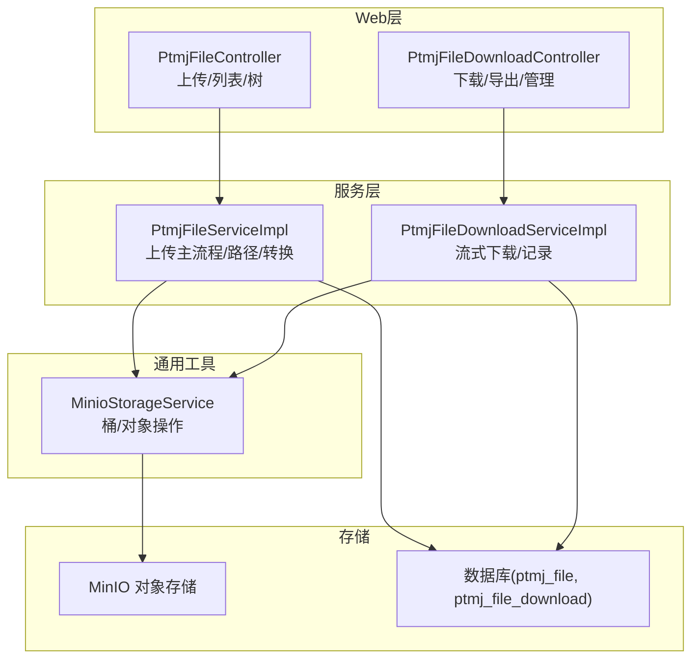
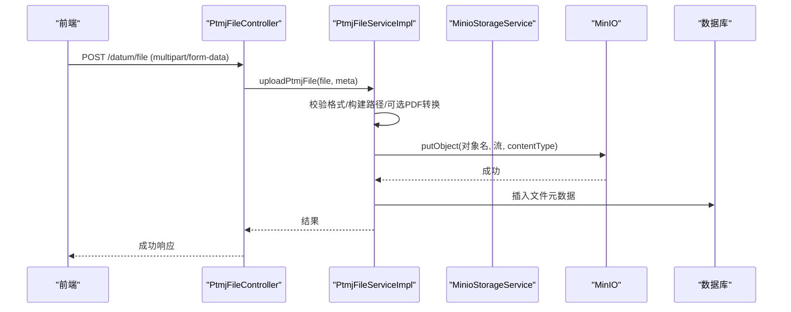
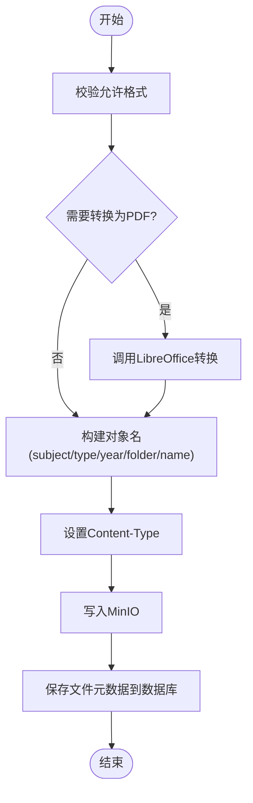
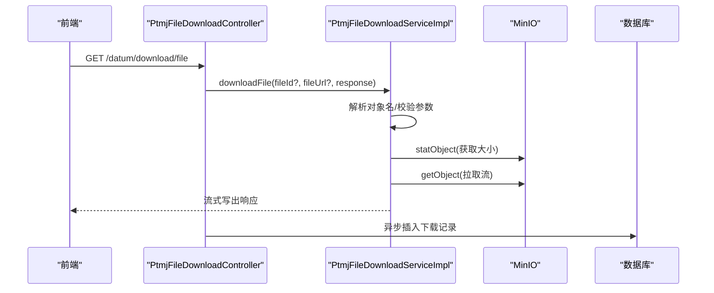
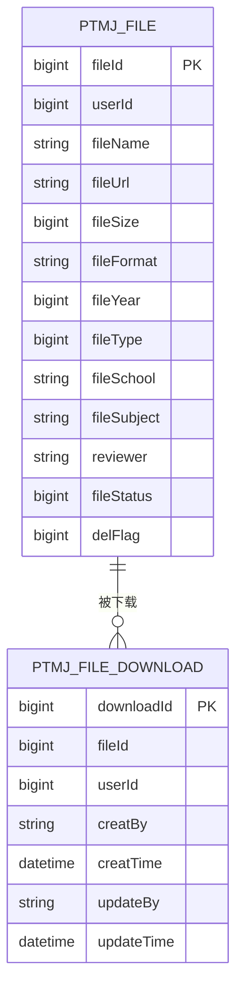
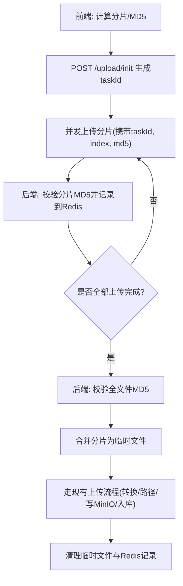
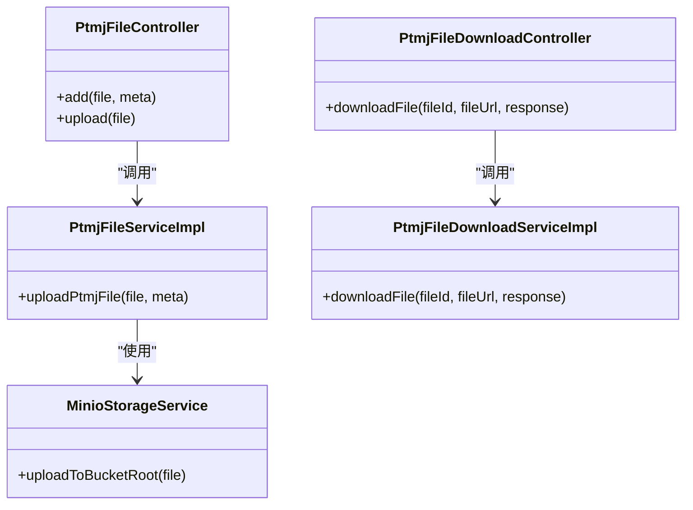

# 文件上传下载数据流

<cite>
**本文引用的文件**   
- [MinioStorageService.java](file://PezMax-Backend/ruoyi-common/src/main/java/com/ruoyi/common/utils/file/MinioStorageService.java)
- [PtmjFileController.java](file://PezMax-Backend/ruoyi-admin/src/main/java/com/ruoyi/web/controller/datum/PtmjFileController.java)
- [PtmjFileServiceImpl.java](file://PezMax-Backend/ptmj-datum/src/main/java/com/ptmj/datum/service/impl/PtmjFileServiceImpl.java)
- [PtmjFile.java](file://PezMax-Backend/ptmj-datum/src/main/java/com/ptmj/datum/domain/PtmjFile.java)
- [PtmjFileDownloadController.java](file://PezMax-Backend/ruoyi-admin/src/main/java/com/ruoyi/web/controller/datum/PtmjFileDownloadController.java)
- [PtmjFileDownloadServiceImpl.java](file://PezMax-Backend/ptmj-datum/src/main/java/com/ptmj/datum/service/impl/PtmjFileDownloadServiceImpl.java)
- [PtmjFileDownload.java](file://PezMax-Backend/ptmj-datum/src/main/java/com/ptmj/datum/domain/PtmjFileDownload.java)
- [application.yml](file://PezMax-Backend/ruoyi-admin/src/main/resources/application.yml)
</cite>

## 目录
1. [简介](#简介)
2. [项目结构](#项目结构)
3. [核心组件](#核心组件)
4. [架构总览](#架构总览)
5. [详细组件分析](#详细组件分析)
6. [依赖关系分析](#依赖关系分析)
7. [性能考虑](#性能考虑)
8. [故障排查指南](#故障排查指南)
9. [结论](#结论)
10. [附录](#附录)

## 简介
本设计文档围绕 PezMax-One 系统的“文件上传与下载”数据流展开，重点覆盖以下方面：
- 大文件分片上传的处理流程（策略、断点续传、MD5校验）
- MinIO对象存储的集成方式与访问权限控制
- 文件元数据的存储结构与字段含义
- 前端用户体验设计（选择、进度、错误重试）
- 文件下载的数据流（流式传输、并发限制、下载统计）
- 关键时序图与流程图
- 性能优化建议与故障排查指南

说明：当前后端代码已实现“整文件上传”和“流式下载”，未包含“分片上传、断点续传、MD5校验”的实现。本节将给出可落地的扩展方案，并与现有代码无缝衔接。

## 项目结构
与文件上传下载相关的主要模块与职责如下：
- 通用工具层：提供 MinIO 基础封装与配置读取
- 业务服务层：文件上传主流程（含格式校验、路径构建、LibreOffice转换）、下载主流程（流式输出、下载记录）
- 控制器层：对外暴露上传、下载、列表、树等接口
- 领域模型：文件与下载记录的实体定义

图表来源
- [PtmjFileController.java:78-92](file://PezMax-Backend/ruoyi-admin/src/main/java/com/ruoyi/web/controller/datum/PtmjFileController.java#L78-L92)
- [PtmjFileServiceImpl.java:388-556](file://PezMax-Backend/ptmj-datum/src/main/java/com/ptmj/datum/service/impl/PtmjFileServiceImpl.java#L388-L556)
- [MinioStorageService.java:35-77](file://PezMax-Backend/ruoyi-common/src/main/java/com/ruoyi/common/utils/file/MinioStorageService.java#L35-L77)
- [PtmjFileDownloadController.java:132-183](file://PezMax-Backend/ruoyi-admin/src/main/java/com/ruoyi/web/controller/datum/PtmjFileDownloadController.java#L132-L183)
- [PtmjFileDownloadServiceImpl.java:87-135](file://PezMax-Backend/ptmj-datum/src/main/java/com/ptmj/datum/service/impl/PtmjFileDownloadServiceImpl.java#L87-L135)

章节来源
- [PtmjFileController.java:78-92](file://PezMax-Backend/ruoyi-admin/src/main/java/com/ruoyi/web/controller/datum/PtmjFileController.java#L78-L92)
- [PtmjFileServiceImpl.java:388-556](file://PezMax-Backend/ptmj-datum/src/main/java/com/ptmj/datum/service/impl/PtmjFileServiceImpl.java#L388-L556)
- [MinioStorageService.java:35-77](file://PezMax-Backend/ruoyi-common/src/main/java/com/ruoyi/common/utils/file/MinioStorageService.java#L35-L77)
- [PtmjFileDownloadController.java:132-183](file://PezMax-Backend/ruoyi-admin/src/main/java/com/ruoyi/web/controller/datum/PtmjFileDownloadController.java#L132-L183)
- [PtmjFileDownloadServiceImpl.java:87-135](file://PezMax-Backend/ptmj-datum/src/main/java/com/ptmj/datum/service/impl/PtmjFileDownloadServiceImpl.java#L87-L135)

## 核心组件
- MinIO 客户端与桶策略
  - 初始化时检查并创建桶；首次创建时加载公开读策略，使文件可通过URL直接访问与预览
  - 上传返回对象名、文件名、大小、格式、URL等元信息
- 文件上传主流程
  - 校验允许格式；对 doc/docx/ppt/pptx 调用 LibreOffice 转换为 PDF
  - 按“学科/类型/年份/[自定义目录]/文件名”构建对象名
  - 设置正确的 Content-Type，写入 MinIO，持久化文件元数据到数据库
- 文件下载主流程
  - 支持 fileId 或 fileUrl 二选一
  - 解析对象名，设置响应头（长度、内容处置），从 MinIO 流式写出
  - 异步记录下载流水，避免阻塞下载链路

章节来源
- [MinioStorageService.java:35-77](file://PezMax-Backend/ruoyi-common/src/main/java/com/ruoyi/common/utils/file/MinioStorageService.java#L35-L77)
- [PtmjFileServiceImpl.java:388-556](file://PezMax-Backend/ptmj-datum/src/main/java/com/ptmj/datum/service/impl/PtmjFileServiceImpl.java#L388-L556)
- [PtmjFileDownloadServiceImpl.java:87-135](file://PezMax-Backend/ptmj-datum/src/main/java/com/ptmj/datum/service/impl/PtmjFileDownloadServiceImpl.java#L87-L135)
- [PtmjFileDownloadController.java:132-183](file://PezMax-Backend/ruoyi-admin/src/main/java/com/ruoyi/web/controller/datum/PtmjFileDownloadController.java#L132-L183)

## 架构总览
整体采用“控制器→服务→MinIO/DB”的分层架构。上传与下载均通过 Spring MVC 暴露 REST 接口，服务层负责业务编排与外部系统交互，MinIO 作为对象存储，数据库用于持久化文件与下载记录。

图表来源
- [PtmjFileController.java:188-192](file://PezMax-Backend/ruoyi-admin/src/main/java/com/ruoyi/web/controller/datum/PtmjFileController.java#L188-L192)
- [PtmjFileServiceImpl.java:388-556](file://PezMax-Backend/ptmj-datum/src/main/java/com/ptmj/datum/service/impl/PtmjFileServiceImpl.java#L388-L556)
- [MinioStorageService.java:35-77](file://PezMax-Backend/ruoyi-common/src/main/java/com/ruoyi/common/utils/file/MinioStorageService.java#L35-L77)

## 详细组件分析

### 上传流程（整文件）
- 入口：POST /datum/file
- 处理要点
  - 校验允许格式（由配置项决定）
  - 若为 Office 类格式，先转 PDF，再上传
  - 构建对象名：subject/type/year/[folder]/fileName
  - 设置 Content-Type（PDF、文本等）
  - 写入 MinIO，更新数据库元数据（名称、URL、大小、格式、状态等）
- 注意事项
  - 桶不存在则自动创建并设置公开读策略
  - 文件名清理与路径安全化处理
  - 转换后的临时文件及时删除

图表来源
- [PtmjFileServiceImpl.java:388-556](file://PezMax-Backend/ptmj-datum/src/main/java/com/ptmj/datum/service/impl/PtmjFileServiceImpl.java#L388-L556)

章节来源
- [PtmjFileController.java:188-192](file://PezMax-Backend/ruoyi-admin/src/main/java/com/ruoyi/web/controller/datum/PtmjFileController.java#L188-L192)
- [PtmjFileServiceImpl.java:388-556](file://PezMax-Backend/ptmj-datum/src/main/java/com/ptmj/datum/service/impl/PtmjFileServiceImpl.java#L388-L556)

### 下载流程（流式）
- 入口：GET /datum/download/file?fileId=... 或 fileUrl=...
- 处理要点
  - 解析对象名（兼容多种 URL 形式）
  - 设置响应头（Content-Length、Content-Disposition）
  - 从 MinIO 拉取输入流，循环写入响应输出流
  - 异步记录下载流水（不阻塞下载）
- 并发与限流
  - 当前实现未内置并发限制，可在网关/反向代理层或应用层增加令牌桶/信号量进行限流

图表来源
- [PtmjFileDownloadController.java:132-183](file://PezMax-Backend/ruoyi-admin/src/main/java/com/ruoyi/web/controller/datum/PtmjFileDownloadController.java#L132-L183)
- [PtmjFileDownloadServiceImpl.java:87-135](file://PezMax-Backend/ptmj-datum/src/main/java/com/ptmj/datum/service/impl/PtmjFileDownloadServiceImpl.java#L87-L135)

章节来源
- [PtmjFileDownloadController.java:132-183](file://PezMax-Backend/ruoyi-admin/src/main/java/com/ruoyi/web/controller/datum/PtmjFileDownloadController.java#L132-L183)
- [PtmjFileDownloadServiceImpl.java:87-135](file://PezMax-Backend/ptmj-datum/src/main/java/com/ptmj/datum/service/impl/PtmjFileDownloadServiceImpl.java#L87-L135)

### MinIO 集成与访问权限控制
- 桶策略
  - 首次创建桶时加载公开读策略，允许匿名通过 URL 访问与预览
- 对象命名
  - 统一使用 subject/type/year/[folder]/name 的结构，便于组织与检索
- 访问模式
  - 下载接口通过服务端流式转发，同时支持浏览器直链访问（受桶策略影响）

章节来源
- [PtmjFileServiceImpl.java:392-412](file://PezMax-Backend/ptmj-datum/src/main/java/com/ptmj/datum/service/impl/PtmjFileServiceImpl.java#L392-L412)
- [PtmjFileServiceImpl.java:488-498](file://PezMax-Backend/ptmj-datum/src/main/java/com/ptmj/datum/service/impl/PtmjFileServiceImpl.java#L488-L498)

### 文件元数据存储结构
- 文件表（ptmj_file）关键字段
  - fileId、userId、fileName、fileUrl、fileSize、fileFormat、fileYear、fileType、fileSchool、fileSubject、reviewer、fileStatus、delFlag
- 下载记录表（ptmj_file_download）关键字段
  - downloadId、fileId、userId、creatBy、creatTime、updateBy、updateTime

图表来源
- [PtmjFile.java:20-67](file://PezMax-Backend/ptmj-datum/src/main/java/com/ptmj/datum/domain/PtmjFile.java#L20-L67)
- [PtmjFileDownload.java:20-36](file://PezMax-Backend/ptmj-datum/src/main/java/com/ptmj/datum/domain/PtmjFileDownload.java#L20-L36)

章节来源
- [PtmjFile.java:20-67](file://PezMax-Backend/ptmj-datum/src/main/java/com/ptmj/datum/domain/PtmjFile.java#L20-L67)
- [PtmjFileDownload.java:20-36](file://PezMax-Backend/ptmj-datum/src/main/java/com/ptmj/datum/domain/PtmjFileDownload.java#L20-L36)

### 大文件分片上传（扩展方案）
当前未实现分片上传，以下为推荐设计与对接点：
- 分片策略
  - 固定分片大小（如 5MB~20MB），计算总块数；前端并行上传，后端顺序合并
- 断点续传
  - 以“任务ID + 分片序号”为键，在 Redis 中记录已上传分片集合；重复请求跳过已存在分片
- MD5 校验
  - 前端计算每个分片的 MD5，上传时附带；后端校验后缓存至 Redis，全部上传完成后再次校验全文件 MD5
- 合并与落盘
  - 所有分片完成且校验通过后，按序合并为临时文件，再写入 MinIO，最后删除临时文件
- 与现有流程衔接
  - 合并后的文件进入现有“格式校验/转换/路径构建/写入MinIO/持久化元数据”流程

[此图为概念性设计，无需源码映射]

### 前端用户体验设计（选择、进度、重试）
- 文件选择
  - 支持多选、拖拽、类型与大小限制提示
- 进度显示
  - 整文件上传：基于 XMLHttpRequest.upload.onprogress 或 fetch 流式上报
  - 分片上传：按分片粒度聚合进度，展示总体百分比
- 错误重试
  - 网络异常自动重试（指数退避），失败分片单独重传
  - 断网恢复后根据 Redis 中的分片集合继续上传
- 体验增强
  - 取消上传、暂停/继续、失败原因可视化、失败分片一键重传

[本节为通用 UX 建议，不直接分析具体文件]

## 依赖关系分析
- 控制器依赖服务层，服务层依赖 MinIO 客户端与数据库
- 下载控制器在服务层之外额外注入文件服务，以便在直链模式下绕过同步插入逻辑，改用异步记录
- 配置项集中管理（MinIO、允许格式、默认值等）

图表来源
- [PtmjFileController.java:78-92](file://PezMax-Backend/ruoyi-admin/src/main/java/com/ruoyi/web/controller/datum/PtmjFileController.java#L78-L92)
- [PtmjFileServiceImpl.java:388-556](file://PezMax-Backend/ptmj-datum/src/main/java/com/ptmj/datum/service/impl/PtmjFileServiceImpl.java#L388-L556)
- [MinioStorageService.java:35-77](file://PezMax-Backend/ruoyi-common/src/main/java/com/ruoyi/common/utils/file/MinioStorageService.java#L35-L77)
- [PtmjFileDownloadController.java:132-183](file://PezMax-Backend/ruoyi-admin/src/main/java/com/ruoyi/web/controller/datum/PtmjFileDownloadController.java#L132-L183)
- [PtmjFileDownloadServiceImpl.java:87-135](file://PezMax-Backend/ptmj-datum/src/main/java/com/ptmj/datum/service/impl/PtmjFileDownloadServiceImpl.java#L87-L135)

章节来源
- [PtmjFileController.java:78-92](file://PezMax-Backend/ruoyi-admin/src/main/java/com/ruoyi/web/controller/datum/PtmjFileController.java#L78-L92)
- [PtmjFileServiceImpl.java:388-556](file://PezMax-Backend/ptmj-datum/src/main/java/com/ptmj/datum/service/impl/PtmjFileServiceImpl.java#L388-L556)
- [MinioStorageService.java:35-77](file://PezMax-Backend/ruoyi-common/src/main/java/com/ruoyi/common/utils/file/MinioStorageService.java#L35-L77)
- [PtmjFileDownloadController.java:132-183](file://PezMax-Backend/ruoyi-admin/src/main/java/com/ruoyi/web/controller/datum/PtmjFileDownloadController.java#L132-L183)
- [PtmjFileDownloadServiceImpl.java:87-135](file://PezMax-Backend/ptmj-datum/src/main/java/com/ptmj/datum/service/impl/PtmjFileDownloadServiceImpl.java#L87-L135)

## 性能考虑
- 上传
  - 启用分片上传与并发上传，降低长连接超时风险
  - 合理设置分片大小，平衡内存占用与网络开销
  - 转换前评估 CPU 负载，必要时引入队列与隔离线程池
- 下载
  - 保持流式传输，避免一次性加载到大内存
  - 在网关层开启 gzip（仅对文本类有效），二进制文件不建议压缩
  - 针对热点文件可引入 CDN 缓存
- 存储与索引
  - 对象命名规范化，利于后续归档与生命周期管理
  - 下载记录表可按时间分区，定期归档历史数据

[本节为通用指导，不直接分析具体文件]

## 故障排查指南
- 上传失败
  - 检查允许格式配置是否正确
  - 确认桶是否存在及策略是否生效
  - 观察 LibreOffice 启动日志，确认转换环境可用
- 下载异常
  - 核对 fileUrl 或 fileId 是否有效
  - 检查 MinIO 对象是否存在、路径解析是否正确
  - 关注响应头 Content-Length 与 Content-Disposition 是否设置正确
- 下载记录缺失
  - 确认异步记录是否执行成功，查看后台日志
  - 在未登录场景下，可能跳过记录属预期行为

章节来源
- [PtmjFileServiceImpl.java:392-412](file://PezMax-Backend/ptmj-datum/src/main/java/com/ptmj/datum/service/impl/PtmjFileServiceImpl.java#L392-L412)
- [PtmjFileServiceImpl.java:414-450](file://PezMax-Backend/ptmj-datum/src/main/java/com/ptmj/datum/service/impl/PtmjFileServiceImpl.java#L414-L450)
- [PtmjFileDownloadServiceImpl.java:186-258](file://PezMax-Backend/ptmj-datum/src/main/java/com/ptmj/datum/service/impl/PtmjFileDownloadServiceImpl.java#L186-L258)
- [PtmjFileDownloadController.java:151-183](file://PezMax-Backend/ruoyi-admin/src/main/java/com/ruoyi/web/controller/datum/PtmjFileDownloadController.java#L151-L183)

## 结论
- 当前系统已具备稳定的整文件上传与流式下载能力，MinIO 集成完善，文件元数据与下载记录清晰
- 建议优先落地“分片上传+断点续传+MD5校验”以提升大文件稳定性与用户体验
- 下载侧可结合网关/应用层限流与缓存策略，进一步优化吞吐与延迟
- 建议在部署环境中完善监控与告警（上传耗时、转换失败率、下载成功率、MinIO 指标）

[本节为总结，不直接分析具体文件]

## 附录
- 配置项参考
  - application.yml 中包含 multipart 相关配置，可用于调整上传大小与临时目录等

章节来源
- [application.yml:57-60](file://PezMax-Backend/ruoyi-admin/src/main/resources/application.yml#L57-L60)