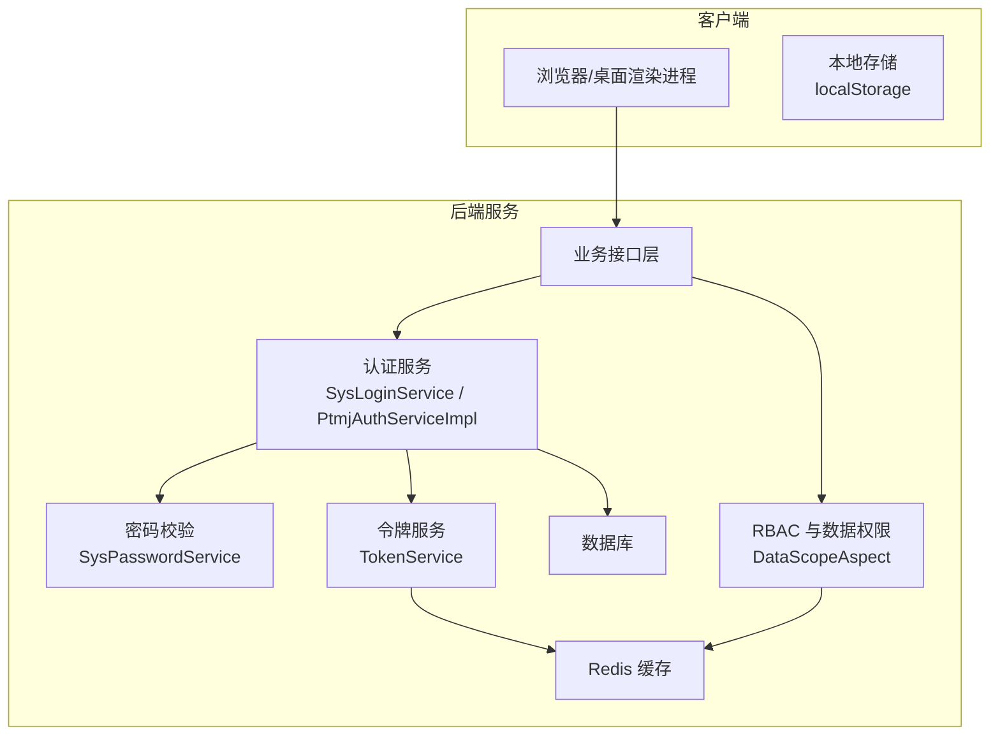
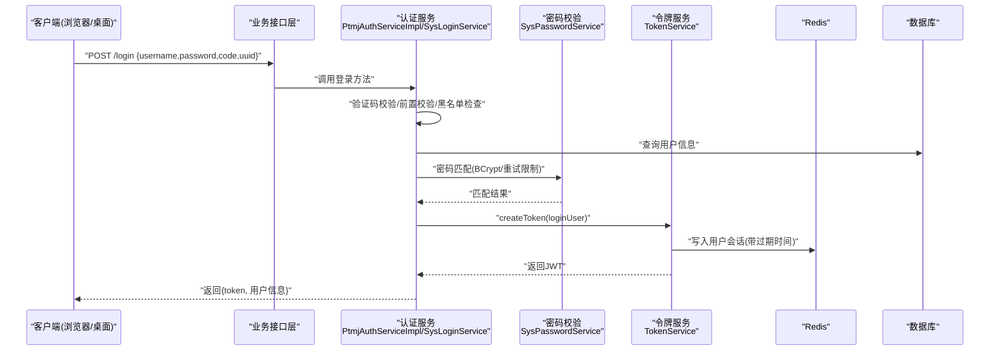
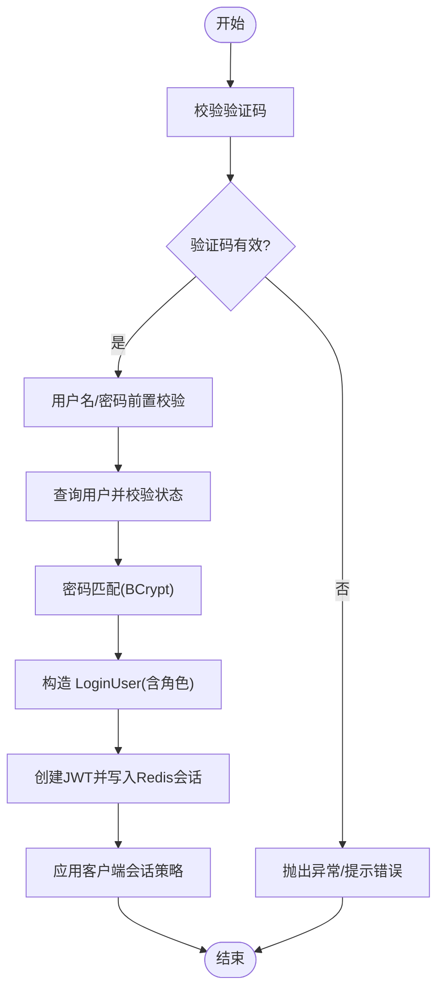
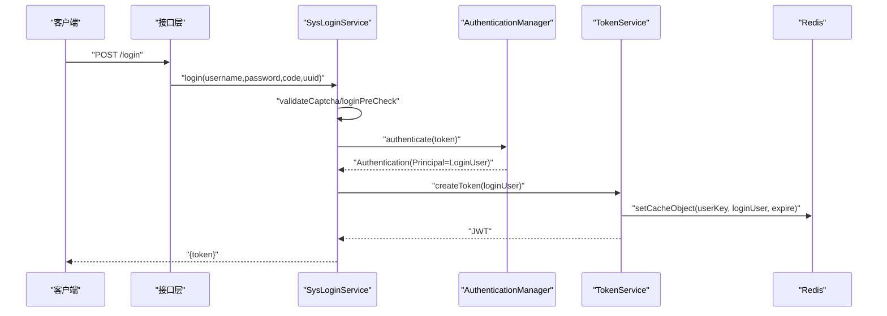
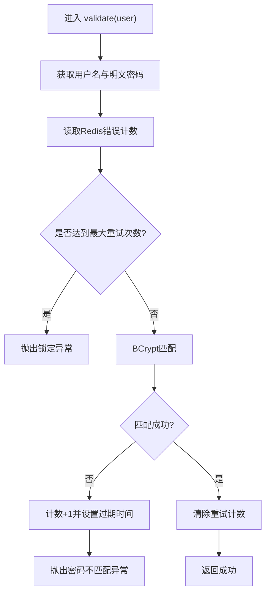
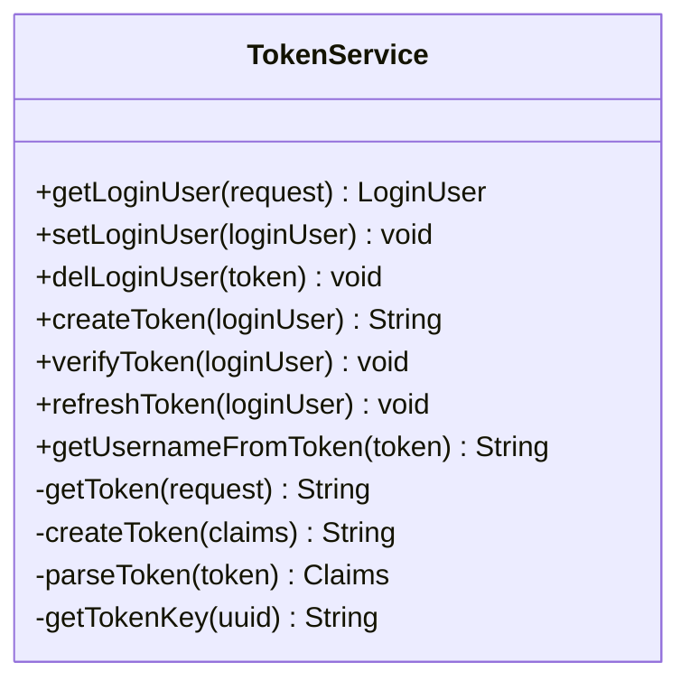
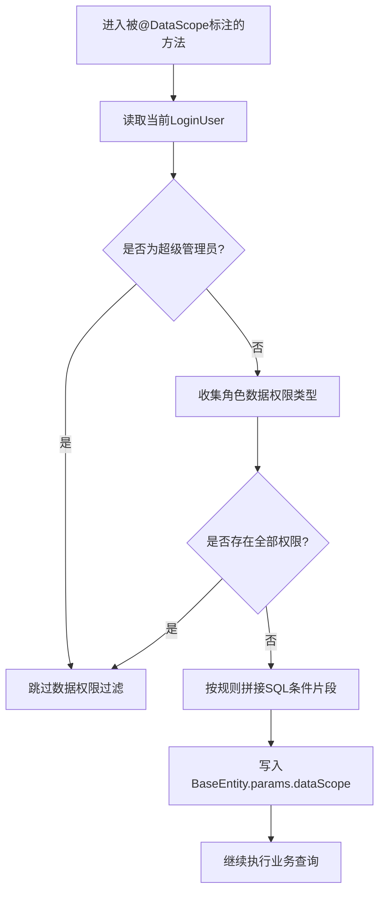
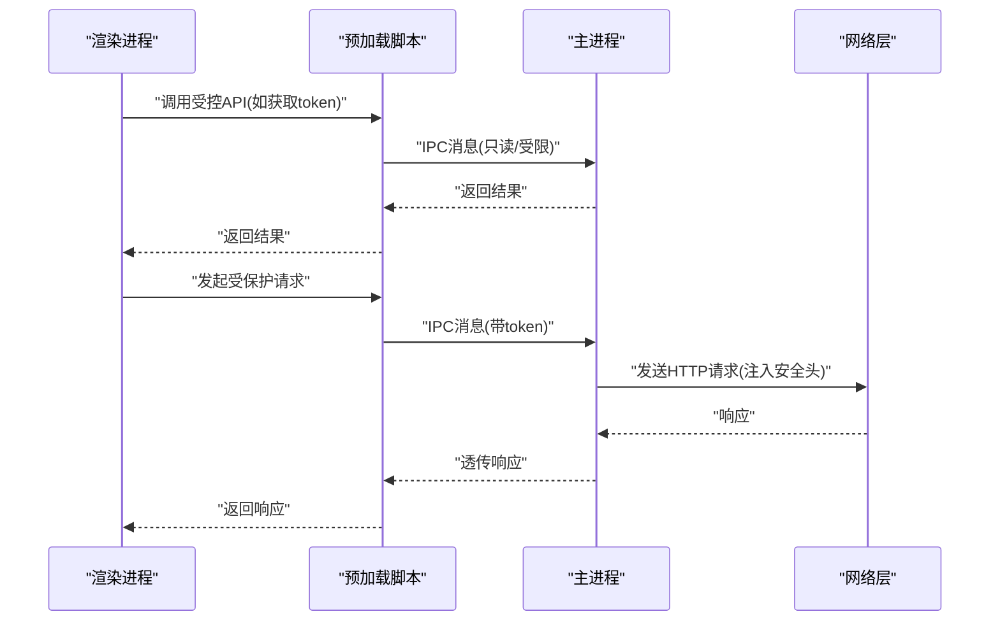
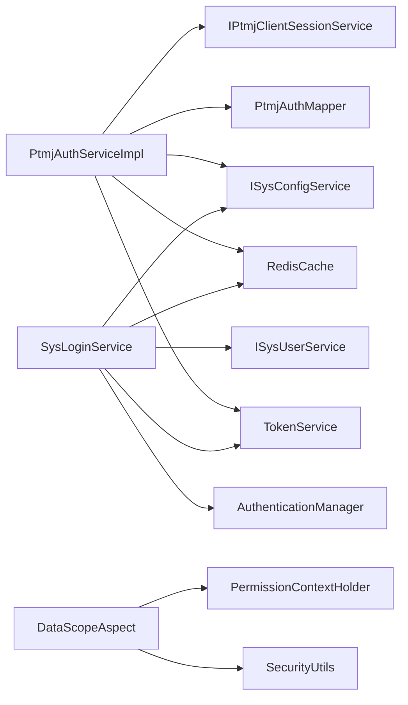

# 认证授权数据流

<cite>
**本文引用的文件**   
- [PtmjLoginBody.java](file://PezMax-Backend/ptmj-datum/src/main/java/com/ptmj/datum/domain/PtmjLoginBody.java)
- [IPtmjAuthService.java](file://PezMax-Backend/ptmj-datum/src/main/java/com/ptmj/datum/service/IPtmjAuthService.java)
- [PtmjAuthServiceImpl.java](file://PezMax-Backend/ptmj-datum/src/main/java/com/ptmj/datum/service/impl/PtmjAuthServiceImpl.java)
- [TokenService.java](file://PezMax-Backend/ruoyi-framework/src/main/java/com/ruoyi/framework/web/service/TokenService.java)
- [SysLoginService.java](file://PezMax-Backend/ruoyi-framework/src/main/java/com/ruoyi/framework/web/service/SysLoginService.java)
- [SysPasswordService.java](file://PezMax-Backend/ruoyi-framework/src/main/java/com/ruoyi/framework/web/service/SysPasswordService.java)
- [DataScope.java](file://PezMax-Backend/ruoyi-common/src/main/java/com/ruoyi/common/annotation/DataScope.java)
- [DataScopeAspect.java](file://PezMax-Backend/ruoyi-framework/src/main/java/com/ruoyi/framework/aspectj/DataScopeAspect.java)
- [auth.js](file://PezMax-Desktop/src/renderer/utils/auth.js)
</cite>

## 目录
1. [引言](#引言)
2. [项目结构](#项目结构)
3. [核心组件](#核心组件)
4. [架构总览](#架构总览)
5. [详细组件分析](#详细组件分析)
6. [依赖关系分析](#依赖关系分析)
7. [性能考量](#性能考量)
8. [故障排查指南](#故障排查指南)
9. [结论](#结论)
10. [附录](#附录)

## 引言
本文件面向 PezMax-One 系统的认证与授权数据流，聚焦以下目标：
- 描述用户登录认证的完整流程（密码验证、JWT 令牌生成、权限信息封装）
- 说明令牌刷新机制、会话管理、黑名单处理等安全特性
- 解释基于角色的访问控制（RBAC）实现，包括权限注解处理、数据权限过滤
- 提供桌面应用本地认证状态管理与跨进程安全通信建议
- 给出认证流程图与安全最佳实践及常见安全问题防护建议

## 项目结构
本项目采用前后端分离架构：
- 后端（Spring Boot + RuoYi 框架）：负责认证、鉴权、令牌签发与校验、数据权限拦截
- 前端（Web 与 Electron 桌面端）：负责登录交互、本地令牌存储、请求头注入与权限展示

图表来源
- [SysLoginService.java:63-100](file://PezMax-Backend/ruoyi-framework/src/main/java/com/ruoyi/framework/web/service/SysLoginService.java#L63-L100)
- [PtmjAuthServiceImpl.java:60-87](file://PezMax-Backend/ptmj-datum/src/main/java/com/ptmj/datum/service/impl/PtmjAuthServiceImpl.java#L60-L87)
- [TokenService.java:114-155](file://PezMax-Backend/ruoyi-framework/src/main/java/com/ruoyi/framework/web/service/TokenService.java#L114-L155)
- [DataScopeAspect.java:59-80](file://PezMax-Backend/ruoyi-framework/src/main/java/com/ruoyi/framework/aspectj/DataScopeAspect.java#L59-L80)

章节来源
- [PtmjLoginBody.java:1-12](file://PezMax-Backend/ptmj-datum/src/main/java/com/ptmj/datum/domain/PtmjLoginBody.java#L1-L12)
- [IPtmjAuthService.java:1-20](file://PezMax-Backend/ptmj-datum/src/main/java/com/ptmj/datum/service/IPtmjAuthService.java#L1-L20)
- [PtmjAuthServiceImpl.java:1-222](file://PezMax-Backend/ptmj-datum/src/main/java/com/ptmj/datum/service/impl/PtmjAuthServiceImpl.java#L1-L222)
- [TokenService.java:1-233](file://PezMax-Backend/ruoyi-framework/src/main/java/com/ruoyi/framework/web/service/TokenService.java#L1-L233)
- [SysLoginService.java:1-177](file://PezMax-Backend/ruoyi-framework/src/main/java/com/ruoyi/framework/web/service/SysLoginService.java#L1-L177)
- [SysPasswordService.java:1-87](file://PezMax-Backend/ruoyi-framework/src/main/java/com/ruoyi/framework/web/service/SysPasswordService.java#L1-L87)
- [DataScope.java:1-34](file://PezMax-Backend/ruoyi-common/src/main/java/com/ruoyi/common/annotation/DataScope.java#L1-L34)
- [DataScopeAspect.java:1-185](file://PezMax-Backend/ruoyi-framework/src/main/java/com/ruoyi/framework/aspectj/DataScopeAspect.java#L1-L185)
- [auth.js:1-27](file://PezMax-Desktop/src/renderer/utils/auth.js#L1-L27)

## 核心组件
- 认证入口与参数对象
  - PtmjLoginBody：扩展标准登录体，承载用户名、密码、验证码等
  - IPtmjAuthService / PtmjAuthServiceImpl：Ptmj 专属登录流程，含验证码、账号状态、密码匹配、构建 LoginUser、签发 JWT、附加客户端会话策略
- 通用认证与密码校验
  - SysLoginService：统一登录入口，包含验证码校验、前置校验、黑名单检查、记录登录日志、调用 TokenService 签发令牌
  - SysPasswordService：密码重试次数限制、锁定时间、BCrypt 匹配
- 令牌与会话
  - TokenService：JWT 签发、解析、从请求提取 token、将用户上下文写入 Redis、自动续期（接近过期时刷新）
- 权限与数据范围
  - DataScope 注解与 DataScopeAspect 切面：根据角色数据权限类型拼接 SQL 条件，实现行级数据隔离
- 桌面端本地状态
  - auth.js：在渲染进程中读写 localStorage 的 Admin-Token，用于后续请求携带

章节来源
- [PtmjLoginBody.java:1-12](file://PezMax-Backend/ptmj-datum/src/main/java/com/ptmj/datum/domain/PtmjLoginBody.java#L1-L12)
- [IPtmjAuthService.java:1-20](file://PezMax-Backend/ptmj-datum/src/main/java/com/ptmj/datum/service/IPtmjAuthService.java#L1-L20)
- [PtmjAuthServiceImpl.java:60-87](file://PezMax-Backend/ptmj-datum/src/main/java/com/ptmj/datum/service/impl/PtmjAuthServiceImpl.java#L60-L87)
- [SysLoginService.java:63-100](file://PezMax-Backend/ruoyi-framework/src/main/java/com/ruoyi/framework/web/service/SysLoginService.java#L63-L100)
- [SysPasswordService.java:44-72](file://PezMax-Backend/ruoyi-framework/src/main/java/com/ruoyi/framework/web/service/SysPasswordService.java#L44-L72)
- [TokenService.java:114-155](file://PezMax-Backend/ruoyi-framework/src/main/java/com/ruoyi/framework/web/service/TokenService.java#L114-L155)
- [DataScope.java:1-34](file://PezMax-Backend/ruoyi-common/src/main/java/com/ruoyi/common/annotation/DataScope.java#L1-L34)
- [DataScopeAspect.java:59-80](file://PezMax-Backend/ruoyi-framework/src/main/java/com/ruoyi/framework/aspectj/DataScopeAspect.java#L59-L80)
- [auth.js:1-27](file://PezMax-Desktop/src/renderer/utils/auth.js#L1-L27)

## 架构总览
下图展示了从客户端发起登录到服务端完成认证、签发令牌并返回给客户端的端到端流程。

图表来源
- [PtmjAuthServiceImpl.java:60-87](file://PezMax-Backend/ptmj-datum/src/main/java/com/ptmj/datum/service/impl/PtmjAuthServiceImpl.java#L60-L87)
- [SysLoginService.java:63-100](file://PezMax-Backend/ruoyi-framework/src/main/java/com/ruoyi/framework/web/service/SysLoginService.java#L63-L100)
- [SysPasswordService.java:44-72](file://PezMax-Backend/ruoyi-framework/src/main/java/com/ruoyi/framework/web/service/SysPasswordService.java#L44-L72)
- [TokenService.java:114-155](file://PezMax-Backend/ruoyi-framework/src/main/java/com/ruoyi/framework/web/service/TokenService.java#L114-L155)

## 详细组件分析

### 登录认证流程（Ptmj 专用）
- 输入参数：PtmjLoginBody（用户名、密码、验证码、唯一标识）
- 关键步骤：
  - 验证码校验：若启用验证码则从 Redis 读取并比对，成功后删除一次性验证码
  - 用户名/密码长度与空值校验
  - 查询用户并校验状态（正常/停用）
  - 密码匹配：统一使用 BCrypt 校验
  - 构造 LoginUser（包含角色集合），调用 TokenService.createToken 签发 JWT
  - 附加客户端会话策略（如固定时长会话）
- 输出：JWT 令牌

图表来源
- [PtmjAuthServiceImpl.java:60-87](file://PezMax-Backend/ptmj-datum/src/main/java/com/ptmj/datum/service/impl/PtmjAuthServiceImpl.java#L60-L87)
- [PtmjAuthServiceImpl.java:93-116](file://PezMax-Backend/ptmj-datum/src/main/java/com/ptmj/datum/service/impl/PtmjAuthServiceImpl.java#L93-L116)
- [PtmjAuthServiceImpl.java:154-181](file://PezMax-Backend/ptmj-datum/src/main/java/com/ptmj/datum/service/impl/PtmjAuthServiceImpl.java#L154-L181)
- [TokenService.java:114-155](file://PezMax-Backend/ruoyi-framework/src/main/java/com/ruoyi/framework/web/service/TokenService.java#L114-L155)

章节来源
- [PtmjLoginBody.java:1-12](file://PezMax-Backend/ptmj-datum/src/main/java/com/ptmj/datum/domain/PtmjLoginBody.java#L1-L12)
- [IPtmjAuthService.java:1-20](file://PezMax-Backend/ptmj-datum/src/main/java/com/ptmj/datum/service/IPtmjAuthService.java#L1-L20)
- [PtmjAuthServiceImpl.java:60-87](file://PezMax-Backend/ptmj-datum/src/main/java/com/ptmj/datum/service/impl/PtmjAuthServiceImpl.java#L60-L87)
- [PtmjAuthServiceImpl.java:93-116](file://PezMax-Backend/ptmj-datum/src/main/java/com/ptmj/datum/service/impl/PtmjAuthServiceImpl.java#L93-L116)
- [PtmjAuthServiceImpl.java:154-181](file://PezMax-Backend/ptmj-datum/src/main/java/com/ptmj/datum/service/impl/PtmjAuthServiceImpl.java#L154-L181)
- [TokenService.java:114-155](file://PezMax-Backend/ruoyi-framework/src/main/java/com/ruoyi/framework/web/service/TokenService.java#L114-L155)

### 通用登录流程（RuoYi 标准）
- 统一入口：SysLoginService.login
- 关键步骤：
  - 验证码校验（可配置开关）
  - 前置校验（空值、长度、IP 黑名单）
  - 通过 AuthenticationManager 进行认证（内部会调用 UserDetailsServiceImpl 加载用户）
  - 记录登录成功/失败日志
  - 调用 TokenService.createToken 签发 JWT
- 注意：该流程与 Ptmj 专用流程并存，可按业务选择接入点

图表来源
- [SysLoginService.java:63-100](file://PezMax-Backend/ruoyi-framework/src/main/java/com/ruoyi/framework/web/service/SysLoginService.java#L63-L100)
- [TokenService.java:114-155](file://PezMax-Backend/ruoyi-framework/src/main/java/com/ruoyi/framework/web/service/TokenService.java#L114-L155)

章节来源
- [SysLoginService.java:63-100](file://PezMax-Backend/ruoyi-framework/src/main/java/com/ruoyi/framework/web/service/SysLoginService.java#L63-L100)
- [SysLoginService.java:110-165](file://PezMax-Backend/ruoyi-framework/src/main/java/com/ruoyi/framework/web/service/SysLoginService.java#L110-L165)

### 密码校验与重试限制
- 功能要点：
  - 基于 Redis 的用户名维度错误计数键
  - 超过最大重试次数后抛出锁定异常（含锁定时间）
  - 正确登录后清除重试计数
  - 使用 SecurityUtils.matchesPassword 进行 BCrypt 校验
- 适用场景：通用登录流程中由认证管理器触发；Ptmj 专用流程中直接调用匹配逻辑

图表来源
- [SysPasswordService.java:44-72](file://PezMax-Backend/ruoyi-framework/src/main/java/com/ruoyi/framework/web/service/SysPasswordService.java#L44-L72)

章节来源
- [SysPasswordService.java:44-72](file://PezMax-Backend/ruoyi-framework/src/main/java/com/ruoyi/framework/web/service/SysPasswordService.java#L44-L72)

### 令牌签发、解析与刷新
- 签发：
  - 生成 UUID 作为 token 标识，写入 LoginUser 并持久化至 Redis（带过期时间）
  - 以 Claims 形式写入用户名与 token 标识，使用 HS512 签名生成 JWT
- 解析：
  - 从请求头按配置的 header 前缀提取 token
  - 解析 Claims，根据 token 标识从 Redis 获取完整 LoginUser
- 刷新：
  - verifyToken：当剩余有效期小于阈值（默认20分钟）时，刷新 Redis 中的会话过期时间
  - refreshToken：更新登录时间与过期时间，并回写 Redis
- 删除：
  - delLoginUser：根据 token 标识删除 Redis 中的会话

图表来源
- [TokenService.java:62-83](file://PezMax-Backend/ruoyi-framework/src/main/java/com/ruoyi/framework/web/service/TokenService.java#L62-L83)
- [TokenService.java:114-155](file://PezMax-Backend/ruoyi-framework/src/main/java/com/ruoyi/framework/web/service/TokenService.java#L114-L155)
- [TokenService.java:178-198](file://PezMax-Backend/ruoyi-framework/src/main/java/com/ruoyi/framework/web/service/TokenService.java#L178-L198)
- [TokenService.java:218-231](file://PezMax-Backend/ruoyi-framework/src/main/java/com/ruoyi/framework/web/service/TokenService.java#L218-L231)

章节来源
- [TokenService.java:62-83](file://PezMax-Backend/ruoyi-framework/src/main/java/com/ruoyi/framework/web/service/TokenService.java#L62-L83)
- [TokenService.java:114-155](file://PezMax-Backend/ruoyi-framework/src/main/java/com/ruoyi/framework/web/service/TokenService.java#L114-L155)
- [TokenService.java:178-198](file://PezMax-Backend/ruoyi-framework/src/main/java/com/ruoyi/framework/web/service/TokenService.java#L178-L198)
- [TokenService.java:218-231](file://PezMax-Backend/ruoyi-framework/src/main/java/com/ruoyi/framework/web/service/TokenService.java#L218-L231)

### 基于角色的访问控制（RBAC）与数据权限
- 角色与权限：
  - LoginUser 中包含角色集合与权限字符集合
  - Ptmj 专用流程会为普通用户赋予固定角色键，避免权限对象为空
- 数据权限过滤：
  - 在方法上使用 @DataScope 注解，指定部门/用户别名与权限字符
  - DataScopeAspect 在方法执行前根据当前用户的角色数据权限类型拼接 SQL 条件，限制查询范围（全部、自定义、本部门、本部门及以下、仅本人）
- 权限字符匹配：
  - 支持通过注解或上下文传递权限字符，按角色权限集合进行匹配

图表来源
- [DataScope.java:1-34](file://PezMax-Backend/ruoyi-common/src/main/java/com/ruoyi/common/annotation/DataScope.java#L1-L34)
- [DataScopeAspect.java:59-80](file://PezMax-Backend/ruoyi-framework/src/main/java/com/ruoyi/framework/aspectj/DataScopeAspect.java#L59-L80)
- [DataScopeAspect.java:91-170](file://PezMax-Backend/ruoyi-framework/src/main/java/com/ruoyi/framework/aspectj/DataScopeAspect.java#L91-L170)
- [PtmjAuthServiceImpl.java:154-181](file://PezMax-Backend/ptmj-datum/src/main/java/com/ptmj/datum/service/impl/PtmjAuthServiceImpl.java#L154-L181)

章节来源
- [DataScope.java:1-34](file://PezMax-Backend/ruoyi-common/src/main/java/com/ruoyi/common/annotation/DataScope.java#L1-L34)
- [DataScopeAspect.java:59-80](file://PezMax-Backend/ruoyi-framework/src/main/java/com/ruoyi/framework/aspectj/DataScopeAspect.java#L59-L80)
- [DataScopeAspect.java:91-170](file://PezMax-Backend/ruoyi-framework/src/main/java/com/ruoyi/framework/aspectj/DataScopeAspect.java#L91-L170)
- [PtmjAuthServiceImpl.java:154-181](file://PezMax-Backend/ptmj-datum/src/main/java/com/ptmj/datum/service/impl/PtmjAuthServiceImpl.java#L154-L181)

### 桌面应用本地认证状态与跨进程安全通信
- 本地状态管理：
  - 渲染进程通过 auth.js 读写 localStorage 的 Admin-Token
  - 建议在主进程侧集中管理敏感信息，渲染进程仅持有最小必要凭证
- 跨进程通信建议：
  - 使用 preload 暴露受控 API，避免直接暴露 Node/Electron 能力
  - 对敏感操作增加二次校验与白名单域名/协议限制
  - 禁止在渲染进程内直接发起网络请求，统一由主进程代理并注入安全头

[此图为概念性流程，无需图表来源]

章节来源
- [auth.js:1-27](file://PezMax-Desktop/src/renderer/utils/auth.js#L1-L27)

## 依赖关系分析
- 组件耦合
  - PtmjAuthServiceImpl 依赖 TokenService、Redis、ISysConfigService、PtmjAuthMapper、IPtmjClientSessionService
  - SysLoginService 依赖 TokenService、AuthenticationManager、Redis、ISysUserService、ISysConfigService
  - DataScopeAspect 依赖 SecurityUtils、PermissionContextHolder、BaseEntity
- 外部依赖
  - Redis：会话缓存、验证码、密码重试计数
  - 数据库：用户、角色、菜单、权限等基础数据
- 潜在循环依赖
  - 当前未见明显循环引用；注意 Service 层与 Mapper 层的单向依赖

图表来源
- [PtmjAuthServiceImpl.java:1-222](file://PezMax-Backend/ptmj-datum/src/main/java/com/ptmj/datum/service/impl/PtmjAuthServiceImpl.java#L1-L222)
- [SysLoginService.java:1-177](file://PezMax-Backend/ruoyi-framework/src/main/java/com/ruoyi/framework/web/service/SysLoginService.java#L1-L177)
- [DataScopeAspect.java:1-185](file://PezMax-Backend/ruoyi-framework/src/main/java/com/ruoyi/framework/aspectj/DataScopeAspect.java#L1-L185)

章节来源
- [PtmjAuthServiceImpl.java:1-222](file://PezMax-Backend/ptmj-datum/src/main/java/com/ptmj/datum/service/impl/PtmjAuthServiceImpl.java#L1-L222)
- [SysLoginService.java:1-177](file://PezMax-Backend/ruoyi-framework/src/main/java/com/ruoyi/framework/web/service/SysLoginService.java#L1-L177)
- [DataScopeAspect.java:1-185](file://PezMax-Backend/ruoyi-framework/src/main/java/com/ruoyi/framework/aspectj/DataScopeAspect.java#L1-L185)

## 性能考量
- 令牌刷新策略：在接近过期时刷新 Redis 会话，减少频繁重新登录，降低认证压力
- 验证码一次性使用：校验后立即删除，避免重放攻击
- 密码重试限制：基于 Redis 的计数器，避免数据库压力
- 数据权限过滤：在切面阶段拼接 SQL 条件，避免在业务层多次查询与合并

## 故障排查指南
- 登录失败
  - 验证码错误或失效：检查 Redis 中验证码键是否存在且未过期
  - 用户名/密码错误：确认密码为 BCrypt 密文，且长度符合规范
  - 账号被停用：检查用户状态字段
- 令牌相关问题
  - 401/403：检查请求头是否携带正确的 Authorization 前缀
  - 会话过期：观察 Redis 中会话键是否仍存在
- 数据权限问题
  - 查询结果为空：检查 @DataScope 注解的参数与角色数据权限类型是否匹配

章节来源
- [PtmjAuthServiceImpl.java:93-116](file://PezMax-Backend/ptmj-datum/src/main/java/com/ptmj/datum/service/impl/PtmjAuthServiceImpl.java#L93-L116)
- [SysLoginService.java:110-165](file://PezMax-Backend/ruoyi-framework/src/main/java/com/ruoyi/framework/web/service/SysLoginService.java#L110-L165)
- [TokenService.java:62-83](file://PezMax-Backend/ruoyi-framework/src/main/java/com/ruoyi/framework/web/service/TokenService.java#L62-L83)
- [DataScopeAspect.java:91-170](file://PezMax-Backend/ruoyi-framework/src/main/java/com/ruoyi/framework/aspectj/DataScopeAspect.java#L91-L170)

## 结论
PezMax-One 的认证授权体系以 JWT + Redis 为核心，结合 RuoYi 的安全组件实现了统一的登录、令牌签发与校验、密码重试限制与黑名单防护。Ptmj 专用登录流程复用该体系，并通过固定角色与数据权限切面实现细粒度数据隔离。桌面端采用本地存储保存令牌，建议在主进程集中管理敏感信息与网络请求，提升整体安全性。

## 附录
- 安全最佳实践建议
  - 强制 HTTPS，禁用明文传输
  - 合理设置 JWT 过期时间与刷新阈值，避免过长会话
  - 对登录接口实施速率限制与验证码保护
  - 定期轮换密钥，确保签名算法与密钥强度
  - 最小权限原则：为用户分配最小必要角色与权限
  - 审计与告警：记录登录成功/失败、越权尝试等关键事件
  - 防重放与防篡改：严格校验请求来源、Referer、Origin 等头部
  - 桌面端安全：主进程代理网络请求，预加载脚本最小暴露 API，禁用不必要的 Node 能力