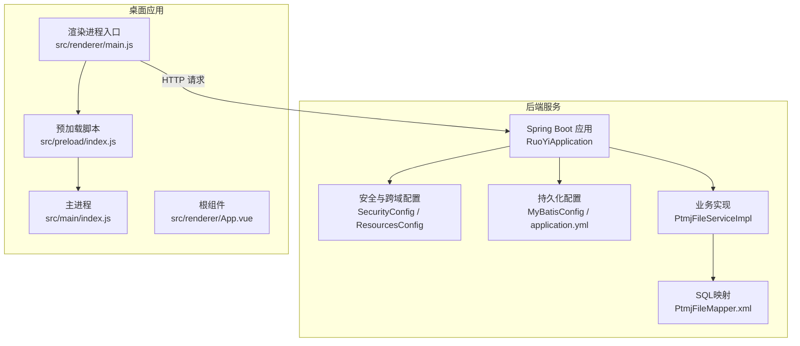
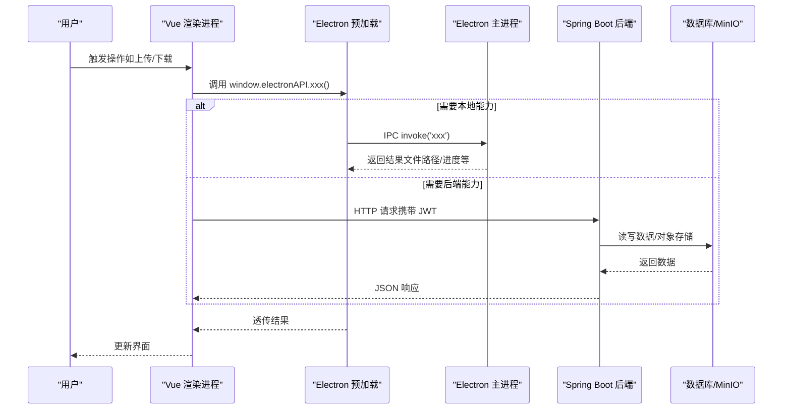
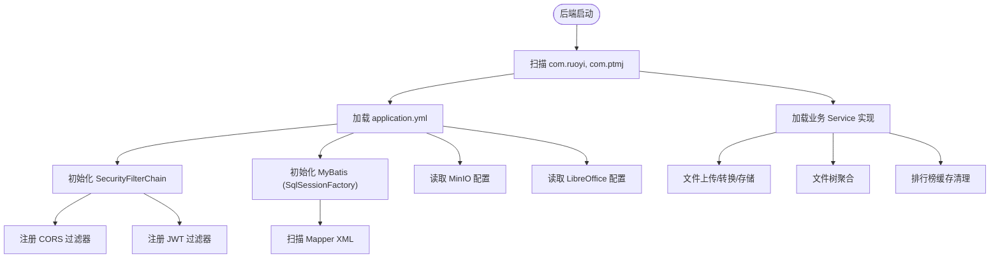
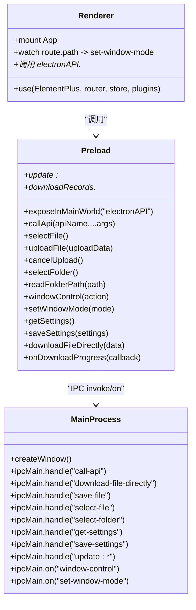
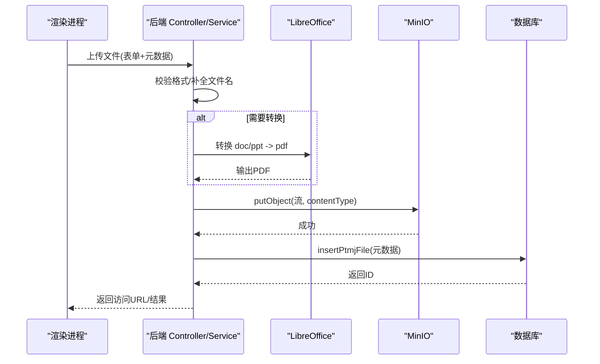
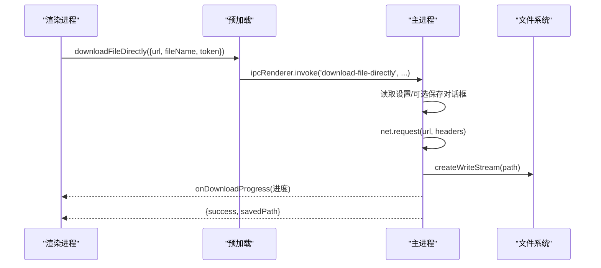
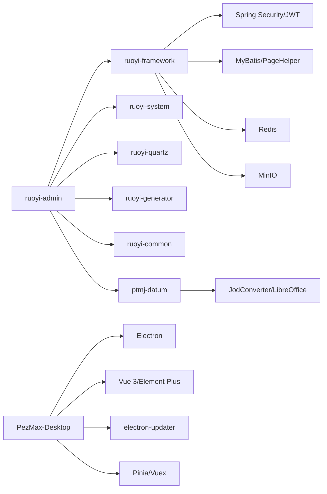

# 整体架构概览

<cite>
**本文引用的文件列表**
- [PezMax-Backend/pom.xml](file://PezMax-Backend/pom.xml)
- [RuoYiApplication.java](file://PezMax-Backend/ruoyi-admin/src/main/java/com/ruoyi/RuoYiApplication.java)
- [application.yml](file://PezMax-Backend/ruoyi-admin/src\main\resources\application.yml)
- [SecurityConfig.java](file://PezMax-Backend/ruoyi-framework/src/main/java/com/ruoyi/framework/config/SecurityConfig.java)
- [ResourcesConfig.java](file://PezMax-Backend/ruoyi-framework/src/main/java/com/ruoyi/framework/config/ResourcesConfig.java)
- [MyBatisConfig.java](file://PezMax-Backend/ruoyi-framework/src/main/java/com/ruoyi/framework/config/MyBatisConfig.java)
- [PtmjFileServiceImpl.java](file://PezMax-Backend/ptmj-datum/src/main/java/com/ptmj/datum/service/impl/PtmjFileServiceImpl.java)
- [PtmjFileMapper.xml](file://PezMax-Backend/ptmj-datum/src/main/resources/mapper/datum/PtmjFileMapper.xml)
- [package.json](file://PezMax-Desktop/package.json)
- [index.js（主进程）](file://PezMax-Desktop/src/main/index.js)
- [preload/index.js](file://PezMax-Desktop/src/preload/index.js)
- [renderer/main.js](file://PezMax-Desktop/src/renderer/main.js)
- [App.vue](file://PezMax-Desktop/src/renderer/App.vue)
</cite>

## 目录
1. [简介](#简介)
2. [项目结构](#项目结构)
3. [核心组件](#核心组件)
4. [架构总览](#架构总览)
5. [详细组件分析](#详细组件分析)
6. [依赖关系分析](#依赖关系分析)
7. [性能与可扩展性](#性能与可扩展性)
8. [故障排查指南](#故障排查指南)
9. [结论](#结论)

## 简介
本文件为 PezMax-One 系统的整体架构概览，围绕三层架构进行说明：后端 Spring Boot 微服务层、桌面应用 Electron 层、Web 前端 Vue 3 渲染层。文档重点阐述各层职责划分、前后端分离交互模式、Electron 主进程与渲染进程的通信机制，并解释技术栈选型原因（Spring Boot + MyBatis、Electron + Vue 3）。同时给出系统启动流程、模块加载顺序、依赖注入配置等关键信息，并提供架构图与数据流向图，帮助开发者快速理解系统整体结构。

## 项目结构
仓库采用多模块 Maven 工程与独立桌面应用的结构：
- 后端（PezMax-Backend）
  - 基于若依（RuoYi）脚手架，模块化组织：admin 启动入口、framework 通用框架、system 系统模块、quartz 定时任务、generator 代码生成、common 公共工具、ptmj-datum 业务领域（资料库）。
  - 使用 Spring Boot 作为 Web 容器，集成 Spring Security、MyBatis、Redis、MinIO、PageHelper、SpringDoc 等。
- 桌面应用（PezMax-Desktop）
  - 基于 Electron + Vue 3，主进程负责窗口管理、本地能力（文件系统、下载、SQLite）、更新机制；渲染进程承载 Vue 页面与交互；通过 preload 暴露安全 API 给渲染进程。
- 前后端分离
  - 渲染进程通过 HTTP 调用后端 REST 接口；Electron 主进程提供本地能力并通过 IPC 与渲染进程通信。

图表来源
- [RuoYiApplication.java:1-33](file://PezMax-Backend/ruoyi-admin/src/main/java/com/ruoyi/RuoYiApplication.java#L1-L33)
- [SecurityConfig.java:1-131](file://PezMax-Backend/ruoyi-framework/src/main/java/com/ruoyi/framework/config/SecurityConfig.java#L1-L131)
- [ResourcesConfig.java:1-72](file://PezMax-Backend/ruoyi-framework/src/main/java/com/ruoyi/framework/config/ResourcesConfig.java#L1-L72)
- [MyBatisConfig.java:1-132](file://PezMax-Backend/ruoyi-framework/src/main/java/com/ruoyi/framework/config/MyBatisConfig.java#L1-L132)
- [application.yml:1-162](file://PezMax-Backend/ruoyi-admin/src/main/resources/application.yml#L1-L162)
- [PtmjFileServiceImpl.java:1-604](file://PezMax-Backend/ptmj-datum/src/main/java/com/ptmj/datum/service/impl/PtmjFileServiceImpl.java#L1-L604)
- [PtmjFileMapper.xml:1-200](file://PezMax-Backend/ptmj-datum/src/main/resources/mapper/datum/PtmjFileMapper.xml#L1-L200)
- [index.js（主进程）:1-800](file://PezMax-Desktop/src/main/index.js#L1-L800)
- [preload/index.js:1-65](file://PezMax-Desktop/src/preload/index.js#L1-L65)
- [renderer/main.js:1-85](file://PezMax-Desktop/src/renderer/main.js#L1-L85)
- [App.vue:1-68](file://PezMax-Desktop/src/renderer/App.vue#L1-L68)

章节来源
- [pom.xml:177-185](file://PezMax-Backend/pom.xml#L177-L185)
- [package.json:1-78](file://PezMax-Desktop/package.json#L1-L78)

## 核心组件
- 后端启动与扫描
  - 启动类排除默认数据源自动装配，统一由框架配置；组件扫描覆盖 com.ruoyi 与 com.ptmj 包，确保业务模块被加载。
- 安全与跨域
  - 启用方法级安全注解；无状态会话策略；JWT 过滤器前置；CORS 全局放行；匿名访问白名单包含登录、注册、验证码及静态资源。
- 资源与拦截器
  - 静态资源映射、重复提交拦截器、跨域过滤器 Bean 定义。
- 持久化与 SQL
  - MyBatis 动态别名包解析、mapper XML 路径扫描、全局配置加载；业务 Mapper XML 定义文件查询、插入、更新、删除与搜索逻辑。
- 业务实现
  - 文件上传、格式校验、LibreOffice 转换、MinIO 存储、文件树构建、排行榜缓存清理等。
- 桌面应用
  - 主进程负责窗口生命周期、IPC 路由、本地文件操作、下载流直写、设置持久化、更新检查与安装；预加载脚本通过 contextBridge 暴露安全 API；渲染进程初始化 ElementPlus、插件、路由与全局方法。

章节来源
- [RuoYiApplication.java:13-20](file://PezMax-Backend/ruoyi-admin/src/main/java/com/ruoyi/RuoYiApplication.java#L13-L20)
- [SecurityConfig.java:85-120](file://PezMax-Backend/ruoyi-framework/src/main/java/com/ruoyi/framework/config/SecurityConfig.java#L85-L120)
- [ResourcesConfig.java:29-72](file://PezMax-Backend/ruoyi-framework/src/main/java/com/ruoyi/framework/config/ResourcesConfig.java#L29-L72)
- [MyBatisConfig.java:116-131](file://PezMax-Backend/ruoyi-framework/src/main/java/com/ruoyi/framework/config/MyBatisConfig.java#L116-L131)
- [PtmjFileServiceImpl.java:111-130](file://PezMax-Backend/ptmj-datum/src/main/java/com/ptmj/datum/service/impl/PtmjFileServiceImpl.java#L111-L130)
- [PtmjFileServiceImpl.java:389-556](file://PezMax-Backend/ptmj-datum/src/main/java/com/ptmj/datum/service/impl/PtmjFileServiceImpl.java#L389-L556)
- [PtmjFileMapper.xml:32-49](file://PezMax-Backend/ptmj-datum/src/main/resources/mapper/datum/PtmjFileMapper.xml#L32-L49)
- [index.js（主进程）:217-290](file://PezMax-Desktop/src/main/index.js#L217-L290)
- [preload/index.js:10-57](file://PezMax-Desktop/src/preload/index.js#L10-L57)
- [renderer/main.js:45-84](file://PezMax-Desktop/src/renderer/main.js#L45-L84)

## 架构总览
系统采用前后端分离的三层架构：
- 后端 Spring Boot 微服务层：提供 REST API，处理认证鉴权、业务逻辑、对象存储与数据库访问。
- 桌面应用 Electron 层：封装操作系统能力（文件、下载、更新），通过 IPC 与渲染进程通信，并以 HTTP 与后端交互。
- Web 前端 Vue 3 层：渲染 UI、维护状态、发起网络请求、响应用户交互。

图表来源
- [preload/index.js:10-57](file://PezMax-Desktop/src/preload/index.js#L10-L57)
- [index.js（主进程）:293-305](file://PezMax-Desktop/src/main/index.js#L293-L305)
- [SecurityConfig.java:85-120](file://PezMax-Backend/ruoyi-framework/src/main/java/com/ruoyi/framework/config/SecurityConfig.java#L85-L120)
- [PtmjFileServiceImpl.java:389-556](file://PezMax-Backend/ptmj-datum/src/main/java/com/ptmj/datum/service/impl/PtmjFileServiceImpl.java#L389-L556)

## 详细组件分析

### 后端启动与依赖注入
- 启动流程
  - 启动类排除 DataSourceAutoConfiguration，避免默认数据源装配；通过 @ComponentScan 扫描 com.ruoyi 与 com.ptmj 包，加载控制器、服务、配置等。
- 配置中心
  - application.yml 定义服务器端口、日志级别、Redis、Token、MyBatis、PageHelper、SpringDoc、MinIO、自定义业务参数等。
- 安全与跨域
  - SecurityFilterChain 禁用 CSRF、无状态会话、匿名白名单、JWT 过滤器前置、CORS 过滤器前置。
- 资源与拦截器
  - 静态资源映射到本地上传目录；重复提交拦截器全局生效；CorsFilter Bean 允许所有来源与方法。
- 持久化
  - MyBatisConfig 动态解析 typeAliasesPackage、mapperLocations、configLocation，创建 SqlSessionFactory。
- 业务实现
  - 文件上传流程：校验格式、必要时调用 LibreOffice 转换为 PDF、写入 MinIO、记录元数据到数据库、返回访问 URL。
  - 文件树构建：按科目/学校/类型/年份/自定义目录聚合为树形结构。
  - 排行榜缓存：审核通过后清理缓存。

图表来源
- [RuoYiApplication.java:13-20](file://PezMax-Backend/ruoyi-admin/src/main/java/com/ruoyi/RuoYiApplication.java#L13-L20)
- [application.yml:17-162](file://PezMax-Backend/ruoyi-admin/src/main/resources/application.yml#L17-L162)
- [SecurityConfig.java:85-120](file://PezMax-Backend/ruoyi-framework/src/main/java/com/ruoyi/framework/config/SecurityConfig.java#L85-L120)
- [ResourcesConfig.java:29-72](file://PezMax-Backend/ruoyi-framework/src/main/java/com/ruoyi/framework/config/ResourcesConfig.java#L29-L72)
- [MyBatisConfig.java:116-131](file://PezMax-Backend/ruoyi-framework/src/main/java/com/ruoyi/framework/config/MyBatisConfig.java#L116-L131)
- [PtmjFileServiceImpl.java:111-130](file://PezMax-Backend/ptmj-datum/src/main/java/com/ptmj/datum/service/impl/PtmjFileServiceImpl.java#L111-L130)
- [PtmjFileServiceImpl.java:389-556](file://PezMax-Backend/ptmj-datum/src/main/java/com/ptmj/datum/service/impl/PtmjFileServiceImpl.java#L389-L556)

章节来源
- [RuoYiApplication.java:13-20](file://PezMax-Backend/ruoyi-admin/src/main/java/com/ruoyi/RuoYiApplication.java#L13-L20)
- [application.yml:17-162](file://PezMax-Backend/ruoyi-admin/src/main/resources/application.yml#L17-L162)
- [SecurityConfig.java:85-120](file://PezMax-Backend/ruoyi-framework/src/main/java/com/ruoyi/framework/config/SecurityConfig.java#L85-L120)
- [ResourcesConfig.java:29-72](file://PezMax-Backend/ruoyi-framework/src/main/java/com/ruoyi/framework/config/ResourcesConfig.java#L29-L72)
- [MyBatisConfig.java:116-131](file://PezMax-Backend/ruoyi-framework/src/main/java/com/ruoyi/framework/config/MyBatisConfig.java#L116-L131)
- [PtmjFileServiceImpl.java:389-556](file://PezMax-Backend/ptmj-datum/src/main/java/com/ptmj/datum/service/impl/PtmjFileServiceImpl.java#L389-L556)

### 桌面应用主进程与渲染进程通信
- 主进程职责
  - 窗口生命周期管理、HMR 开发支持、窗口尺寸与模式切换、全局快捷键、系统对话框、文件选择与保存、文件夹递归读取、下载流直写、本地 SQLite 下载记录、应用更新检查与安装、设置持久化。
- 预加载脚本
  - 通过 contextBridge 暴露 electronAPI 到渲染进程，封装 IPC 调用，包括 callApi、select-file、upload-file、cancel-upload、select-folder、read-folder-path、window-control、set-window-mode、get-settings、save-settings、download-file-directly、update 相关接口、本地下载记录等。
- 渲染进程
  - 初始化 ElementPlus、插件、路由、全局方法与组件；监听窗口最大化事件；根据路由切换主题与窗口模式。

图表来源
- [index.js（主进程）:217-290](file://PezMax-Desktop/src/main/index.js#L217-L290)
- [index.js（主进程）:293-305](file://PezMax-Desktop/src/main/index.js#L293-L305)
- [index.js（主进程）:354-382](file://PezMax-Desktop/src/main/index.js#L354-L382)
- [index.js（主进程）:384-427](file://PezMax-Desktop/src/main/index.js#L384-L427)
- [index.js（主进程）:527-608](file://PezMax-Desktop/src/main/index.js#L527-L608)
- [index.js（主进程）:611-637](file://PezMax-Desktop/src/main/index.js#L611-L637)
- [preload/index.js:10-57](file://PezMax-Desktop/src/preload/index.js#L10-L57)
- [renderer/main.js:45-84](file://PezMax-Desktop/src/renderer/main.js#L45-L84)
- [App.vue:21-44](file://PezMax-Desktop/src/renderer/App.vue#L21-L44)

章节来源
- [index.js（主进程）:217-290](file://PezMax-Desktop/src/main/index.js#L217-L290)
- [index.js（主进程）:293-305](file://PezMax-Desktop/src/main/index.js#L293-L305)
- [index.js（主进程）:354-382](file://PezMax-Desktop/src/main/index.js#L354-L382)
- [index.js（主进程）:384-427](file://PezMax-Desktop/src/main/index.js#L384-L427)
- [index.js（主进程）:527-608](file://PezMax-Desktop/src/main/index.js#L527-L608)
- [index.js（主进程）:611-637](file://PezMax-Desktop/src/main/index.js#L611-L637)
- [preload/index.js:10-57](file://PezMax-Desktop/src/preload/index.js#L10-L57)
- [renderer/main.js:45-84](file://PezMax-Desktop/src/renderer/main.js#L45-L84)
- [App.vue:21-44](file://PezMax-Desktop/src/renderer/App.vue#L21-L44)

### 文件上传与存储流程（后端）
- 输入校验与格式限制
  - 从配置读取允许格式列表，拒绝不支持的文件扩展名。
- 文档转换
  - doc/docx/ppt/pptx 通过 JodConverter + LibreOffice 转换为 PDF；临时文件在完成后清理。
- 对象存储
  - 首次上传时检测桶是否存在，不存在则创建并设置公开读策略；将文件流写入 MinIO，计算并设置正确的 Content-Type。
- 元数据持久化
  - 填充文件名、大小、格式、URL、状态等字段后插入数据库；更新用户上传计数。
- 文件树与排序
  - 根据科目、学校、类型、年份与自定义目录构建文件树；审核通过时清理排行榜缓存。

图表来源
- [PtmjFileServiceImpl.java:389-556](file://PezMax-Backend/ptmj-datum/src/main/java/com/ptmj/datum/service/impl/PtmjFileServiceImpl.java#L389-L556)
- [PtmjFileServiceImpl.java:111-130](file://PezMax-Backend/ptmj-datum/src/main/java/com/ptmj/datum/service/impl/PtmjFileServiceImpl.java#L111-L130)
- [PtmjFileMapper.xml:96-136](file://PezMax-Backend/ptmj-datum/src/main/resources/mapper/datum/PtmjFileMapper.xml#L96-L136)

章节来源
- [PtmjFileServiceImpl.java:389-556](file://PezMax-Backend/ptmj-datum/src/main/java/com/ptmj/datum/service/impl/PtmjFileServiceImpl.java#L389-L556)
- [PtmjFileMapper.xml:96-136](file://PezMax-Backend/ptmj-datum/src/main/resources/mapper/datum/PtmjFileMapper.xml#L96-L136)

### 下载流程（Electron 主进程直写）
- 渲染进程通过 electronAPI.downloadFileDirectly 触发底层下载。
- 主进程读取最新设置，决定是否弹出保存对话框；使用 net.request 发起请求，支持 Authorization 头；以流式方式写入磁盘，实时推送下载进度。
- 错误时清理残余文件并返回失败信息。

图表来源
- [preload/index.js:31-32](file://PezMax-Desktop/src/preload/index.js#L31-L32)
- [index.js（主进程）:527-608](file://PezMax-Desktop/src/main/index.js#L527-L608)

章节来源
- [preload/index.js:31-32](file://PezMax-Desktop/src/preload/index.js#L31-L32)
- [index.js（主进程）:527-608](file://PezMax-Desktop/src/main/index.js#L527-L608)

### 技术栈选型说明
- 后端 Spring Boot + MyBatis
  - Spring Boot 提供开箱即用的 Web 容器与生态整合；MyBatis 提供灵活的 SQL 映射与动态 SQL，便于复杂查询与性能优化；结合 PageHelper 分页、Druid 连接池、Redis 缓存、MinIO 对象存储，形成稳定高效的数据层方案。
- 桌面应用 Electron + Vue 3
  - Electron 提供原生能力（文件系统、下载、更新、全局快捷键），适合桌面场景；Vue 3 组合式 API 与生态完善，配合 Element Plus 可快速构建高质量 UI；通过 preload 与 contextBridge 保障安全隔离。

章节来源
- [pom.xml:15-35](file://PezMax-Backend/pom.xml#L15-L35)
- [package.json:28-76](file://PezMax-Desktop/package.json#L28-L76)

## 依赖关系分析
- 后端模块依赖
  - ruoyi-admin 依赖 framework、system、quartz、generator、common、ptmj-datum；顶层 pom.xml 统一管理版本与依赖。
- 运行时依赖
  - Spring Security、JWT、CORS、MyBatis、PageHelper、Redis、MinIO、JodConverter/LibreOffice、SpringDoc。
- 桌面应用依赖
  - Electron、Vue 3、Element Plus、Pinia、Axios、electron-updater、sql.js、vite/electron-vite 构建链。

图表来源
- [pom.xml:177-185](file://PezMax-Backend/pom.xml#L177-L185)
- [pom.xml:38-174](file://PezMax-Backend/pom.xml#L38-L174)
- [package.json:28-76](file://PezMax-Desktop/package.json#L28-L76)

章节来源
- [pom.xml:177-185](file://PezMax-Backend/pom.xml#L177-L185)
- [pom.xml:38-174](file://PezMax-Backend/pom.xml#L38-L174)
- [package.json:28-76](file://PezMax-Desktop/package.json#L28-L76)

## 性能与可扩展性
- 后端
  - 使用 Druid 连接池与 Redis 缓存提升吞吐；MinIO 对象存储解耦大文件；JodConverter 异步转换需关注 CPU 与内存占用，建议部署多实例或队列化转换任务。
- 桌面应用
  - 下载采用流式直写，避免内存峰值；批量下载记录使用 SQLite 并批量 flush；窗口模式切换减少重绘开销。
- 可扩展点
  - 后端可按业务拆分更多子模块；桌面应用可将更新与下载逻辑进一步抽象为插件化服务。

[本节为通用指导，不直接分析具体文件]

## 故障排查指南
- 后端
  - 启动失败：检查 application.yml 中数据库、Redis、MinIO 配置；确认端口未被占用。
  - 权限问题：确认 SecurityConfig 白名单是否包含所需接口；检查 JWT 密钥与过期时间。
  - 文件上传失败：确认 MinIO 桶策略与地址；检查 LibreOffice 路径与运行状态。
- 桌面应用
  - 窗口异常：检查主进程窗口尺寸与模式切换逻辑；确认 preload 暴露的 API 名称一致。
  - 下载失败：检查网络与 Authorization 头；查看主进程错误日志与本地文件残留。
  - 更新失败：核对 updateSource 配置与网络可达性；查看更新状态回调。

章节来源
- [application.yml:17-162](file://PezMax-Backend/ruoyi-admin/src/main/resources/application.yml#L17-L162)
- [SecurityConfig.java:85-120](file://PezMax-Backend/ruoyi-framework/src/main/java/com/ruoyi/framework/config/SecurityConfig.java#L85-L120)
- [PtmjFileServiceImpl.java:111-130](file://PezMax-Backend/ptmj-datum/src/main/java/com/ptmj/datum/service/impl/PtmjFileServiceImpl.java#L111-L130)
- [index.js（主进程）:527-608](file://PezMax-Desktop/src/main/index.js#L527-L608)
- [index.js（主进程）:354-382](file://PezMax-Desktop/src/main/index.js#L354-L382)

## 结论
PezMax-One 采用清晰的三层架构与前后端分离设计：后端以 Spring Boot + MyBatis 为核心，提供高内聚的业务能力与稳定的数据访问；桌面应用以 Electron 为主进程，封装本地能力并通过 IPC 与 Vue 3 渲染进程协作；整体通过 JWT 与 CORS 实现安全的跨域访问。该架构具备良好的可扩展性与可维护性，适合持续迭代与功能扩展。