# 业务数据模块 (ptmj-datum)

<cite>
**本文引用的文件**
- [pom.xml](file://PezMax-Backend/ptmj-datum/pom.xml)
- [PtmjFile.java](file://PezMax-Backend/ptmj-datum/src/main/java/com/ptmj/datum/domain/PtmjFile.java)
- [PtmjUser.java](file://PezMax-Backend/ptmj-datum/src/main/java/com/ptmj/datum/domain/PtmjUser.java)
- [PtmjBookmark.java](file://PezMax-Backend/ptmj-datum/src/main/java/com/ptmj/datum/domain/PtmjBookmark.java)
- [PtmjFileFavorite.java](file://PezMax-Backend/ptmj-datum/src/main/java/com/ptmj/datum/domain/PtmjFileFavorite.java)
- [PtmjReport.java](file://PezMax-Backend/ptmj-datum/src/main/java/com/ptmj/datum/domain/PtmjReport.java)
- [PtmjNotification.java](file://PezMax-Backend/ptmj-datum/src/main/java/com/ptmj/datum/domain/PtmjNotification.java)
- [PtmjSecurity.java](file://PezMax-Backend/ptmj-datum/src/main/java/com/ptmj/datum/domain/PtmjSecurity.java)
</cite>

## 目录
1. [简介](#简介)
2. [项目结构](#项目结构)
3. [核心组件](#核心组件)
4. [架构总览](#架构总览)
5. [详细组件分析](#详细组件分析)
6. [依赖分析](#依赖分析)
7. [性能考虑](#性能考虑)
8. [故障排查指南](#故障排查指南)
9. [结论](#结论)
10. [附录](#附录)

## 简介
本模块为教育资源平台的核心业务数据层，围绕“文件（资料）—用户—书签—收藏—举报—通知—安全”等关键领域进行建模与实现。模块基于若依框架（ruoyi-framework、ruoyi-system、ruoyi-common）构建，提供统一的实体模型、持久化映射与服务接口，支撑文件上传审核、权限控制、分类标签、收藏与举报闭环、系统通知与安全密保等能力。

## 项目结构
ptmj-datum 作为 Maven 子模块，依赖若依的通用能力与系统能力，并通过 MyBatis 与数据库交互。其领域模型集中在 domain 包下，服务接口与实现位于 service 包，Mapper 接口与 XML 映射位于 mapper 包。

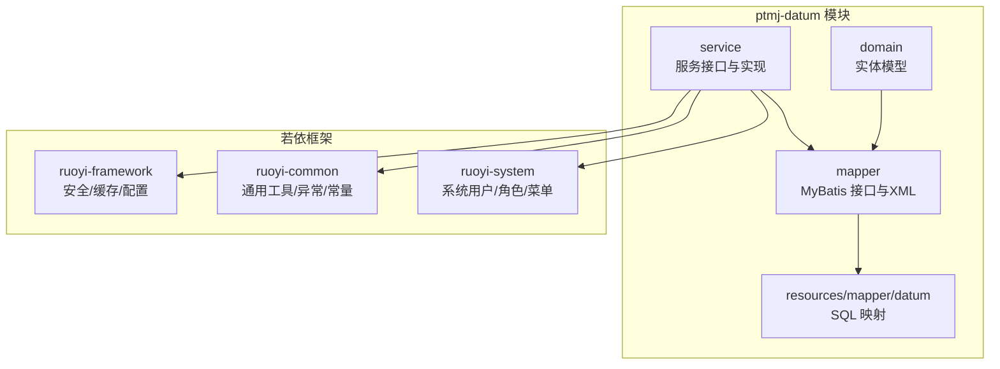

图表来源
- [pom.xml:1-51](file://PezMax-Backend/ptmj-datum/pom.xml#L1-L51)

章节来源
- [pom.xml:1-51](file://PezMax-Backend/ptmj-datum/pom.xml#L1-L51)

## 核心组件
本节聚焦领域模型与关键业务能力：

- 文件管理（PtmjFile）
  - 字段覆盖文件元信息（名称、URL、大小、格式）、年份、类型（期末/期中/资料/补考/其他学校）、学校、科目、审核人、状态（未审核/通过/未通过/被举报）、删除标记等。
  - 用于支撑文件上传、存储、检索、审核与下架流程。

- 用户认证（PtmjUser / PtmjAuth）
  - PtmjUser 承载用户账号、头像、上传计数、账号状态等；密码字段仅写入不输出，避免敏感信息泄露。
  - 与若依系统用户体系集成，结合安全框架完成登录鉴权与权限控制。

- 书签管理（PtmjBookmark）
  - 记录外部链接书签，包含标题、描述、封面、学科、资源类型、所属专栏、状态、删除标记及模糊搜索关键字。
  - 支持按学科/资源类型/专栏筛选与关键词检索。

- 收藏系统（PtmjFileFavorite / PtmjBookmarkFavorite）
  - 以多对多关系维护用户对文件或书签的收藏，便于个人空间展示与统计。

- 举报系统（PtmjReport / PtmjBookmarkReport）
  - 记录用户对文件或书签的举报原因与审核结果，联动文件状态变更与通知推送。

- 通知系统（PtmjNotification）
  - 支持版本更新、系统故障、系统维护、资料下架、日常滚动等多种通知类型，具备优先级、展示形态、时间窗口与滚动间隔等配置。

- 安全管理（PtmjSecurity）
  - 用户密保问题与答案，辅助账户恢复与二次验证。

章节来源
- [PtmjFile.java:1-224](file://PezMax-Backend/ptmj-datum/src/main/java/com/ptmj/datum/domain/PtmjFile.java#L1-L224)
- [PtmjUser.java:1-139](file://PezMax-Backend/ptmj-datum/src/main/java/com/ptmj/datum/domain/PtmjUser.java#L1-L139)
- [PtmjBookmark.java:1-218](file://PezMax-Backend/ptmj-datum/src/main/java/com/ptmj/datum/domain/PtmjBookmark.java#L1-L218)
- [PtmjFileFavorite.java:1-52](file://PezMax-Backend/ptmj-datum/src/main/java/com/ptmj/datum/domain/PtmjFileFavorite.java#L1-L52)
- [PtmjReport.java:1-103](file://PezMax-Backend/ptmj-datum/src/main/java/com/ptmj/datum/domain/PtmjReport.java#L1-L103)
- [PtmjNotification.java:1-300](file://PezMax-Backend/ptmj-datum/src/main/java/com/ptmj/datum/domain/PtmjNotification.java#L1-L300)
- [PtmjSecurity.java:1-89](file://PezMax-Backend/ptmj-datum/src/main/java/com/ptmj/datum/domain/PtmjSecurity.java#L1-L89)

## 架构总览
ptmj-datum 采用分层架构：Controller（由上层应用暴露）→ Service（业务编排）→ Mapper（数据访问）→ Database/MinIO（持久化与对象存储）。安全与缓存由若依框架统一提供。

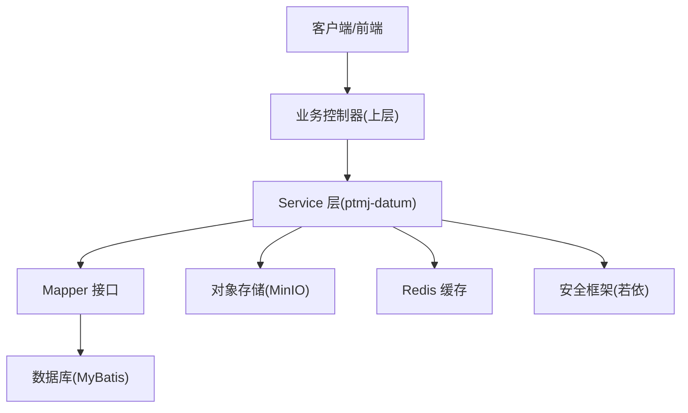

图表来源
- [pom.xml:1-51](file://PezMax-Backend/ptmj-datum/pom.xml#L1-L51)

## 详细组件分析

### 文件管理（PtmjFile）
- 职责：定义试卷/资料文件的元数据与生命周期状态，支撑上传、审核、下架与检索。
- 关键字段：fileId、userId、fileName、fileUrl、fileSize、fileFormat、fileYear、fileType、fileSchool、fileSubject、reviewer、fileStatus、delFlag。
- 典型流程：用户上传 → 落盘至 MinIO → 生成文件记录 → 进入待审 → 管理员审核通过/驳回 → 可下载/不可下载。

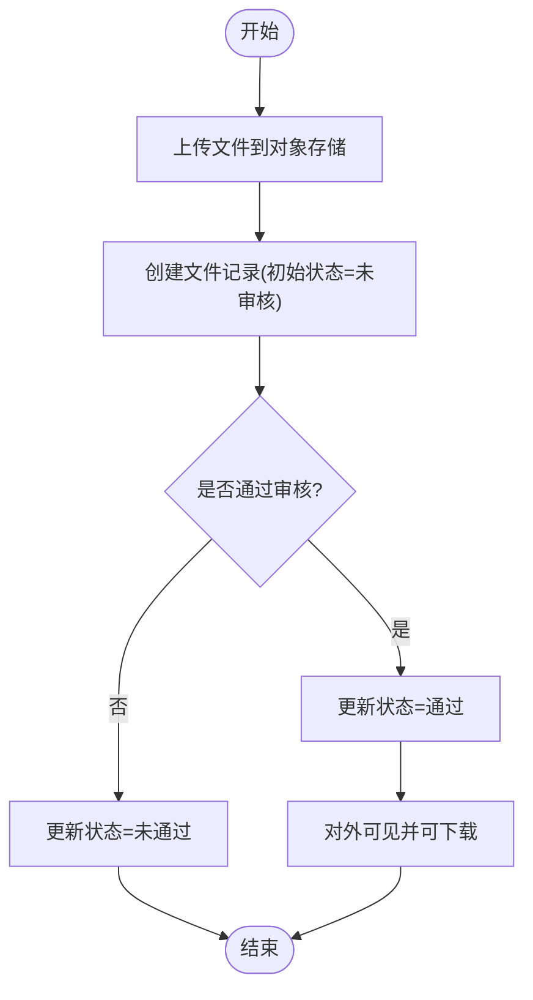

章节来源
- [PtmjFile.java:1-224](file://PezMax-Backend/ptmj-datum/src/main/java/com/ptmj/datum/domain/PtmjFile.java#L1-L224)

### 用户认证与权限（PtmjUser / PtmjAuth）
- 职责：承载平台用户信息与状态，配合若依安全框架完成登录、鉴权与权限控制。
- 关键点：密码字段仅写入不输出；status 控制封禁/正常；count 累计上传数量。
- 与若依集成：复用 Token 机制、用户上下文、权限注解与拦截器。

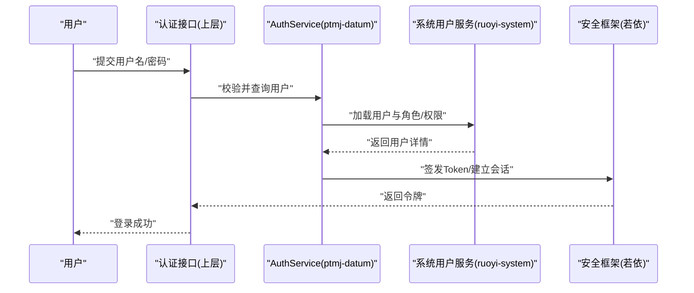

章节来源
- [PtmjUser.java:1-139](file://PezMax-Backend/ptmj-datum/src/main/java/com/ptmj/datum/domain/PtmjUser.java#L1-L139)

### 书签管理（PtmjBookmark）
- 职责：管理用户的外部学习资源书签，支持学科、资源类型、专栏维度组织与关键词检索。
- 扩展点：resourceType 使用别名兼容不同来源字段；keyword 用于统一模糊搜索。

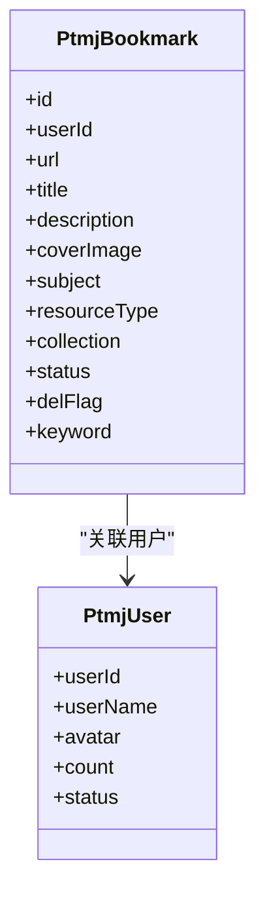

图表来源
- [PtmjBookmark.java:1-218](file://PezMax-Backend/ptmj-datum/src/main/java/com/ptmj/datum/domain/PtmjBookmark.java#L1-L218)
- [PtmjUser.java:1-139](file://PezMax-Backend/ptmj-datum/src/main/java/com/ptmj/datum/domain/PtmjUser.java#L1-L139)

章节来源
- [PtmjBookmark.java:1-218](file://PezMax-Backend/ptmj-datum/src/main/java/com/ptmj/datum/domain/PtmjBookmark.java#L1-L218)

### 收藏系统（PtmjFileFavorite / PtmjBookmarkFavorite）
- 职责：维护用户对文件或书签的收藏关系，支持去重与批量操作。
- 设计要点：联合唯一键（userId+targetId）防止重复收藏；提供计数与列表查询。

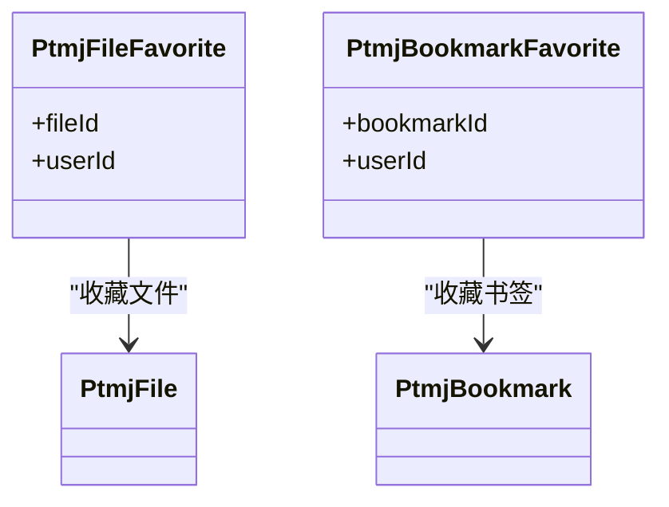

图表来源
- [PtmjFileFavorite.java:1-52](file://PezMax-Backend/ptmj-datum/src/main/java/com/ptmj/datum/domain/PtmjFileFavorite.java#L1-L52)

章节来源
- [PtmjFileFavorite.java:1-52](file://PezMax-Backend/ptmj-datum/src/main/java/com/ptmj/datum/domain/PtmjFileFavorite.java#L1-L52)

### 举报系统（PtmjReport / PtmjBookmarkReport）
- 职责：受理用户对内容的不当行为或违规举报，形成审核闭环。
- 流程要点：提交举报 → 后台审核（属实/不属实）→ 触发相应处置（如文件状态变更为“被举报”）→ 通知相关方。

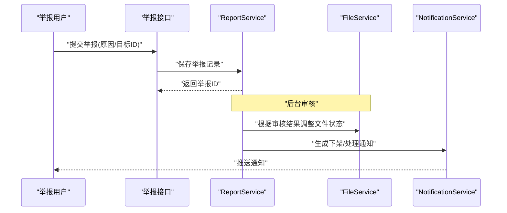

章节来源
- [PtmjReport.java:1-103](file://PezMax-Backend/ptmj-datum/src/main/java/com/ptmj/datum/domain/PtmjReport.java#L1-L103)

### 通知系统（PtmjNotification）
- 职责：统一管理多种通知类型，支持弹窗与滚动字幕两种展示形态，具备优先级与时间窗口控制。
- 类型说明：版本更新、系统故障、系统维护、资料下架、日常滚动。
- 适用场景：故障公告、维护提醒、资料下架告知、运营活动滚动提示。

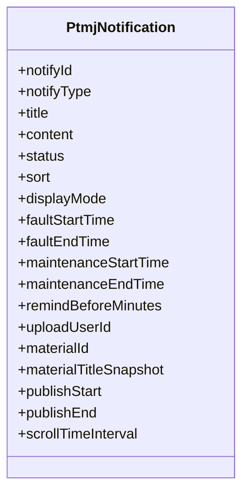

图表来源
- [PtmjNotification.java:1-300](file://PezMax-Backend/ptmj-datum/src/main/java/com/ptmj/datum/domain/PtmjNotification.java#L1-L300)

章节来源
- [PtmjNotification.java:1-300](file://PezMax-Backend/ptmj-datum/src/main/java/com/ptmj/datum/domain/PtmjNotification.java#L1-L300)

### 安全管理（PtmjSecurity）
- 职责：存储用户密保问题与答案，用于账户恢复或二次验证。
- 安全建议：答案需加密存储，接口响应中脱敏或隐藏。

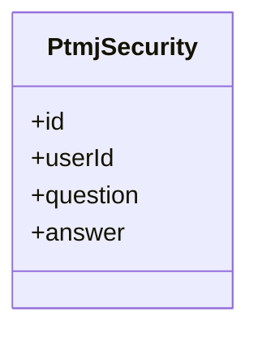

图表来源
- [PtmjSecurity.java:1-89](file://PezMax-Backend/ptmj-datum/src/main/java/com/ptmj/datum/domain/PtmjSecurity.java#L1-L89)

章节来源
- [PtmjSecurity.java:1-89](file://PezMax-Backend/ptmj-datum/src/main/java/com/ptmj/datum/domain/PtmjSecurity.java#L1-L89)

## 依赖分析
ptmj-datum 依赖若依三大模块与 Redis，形成稳定的基础能力支撑。

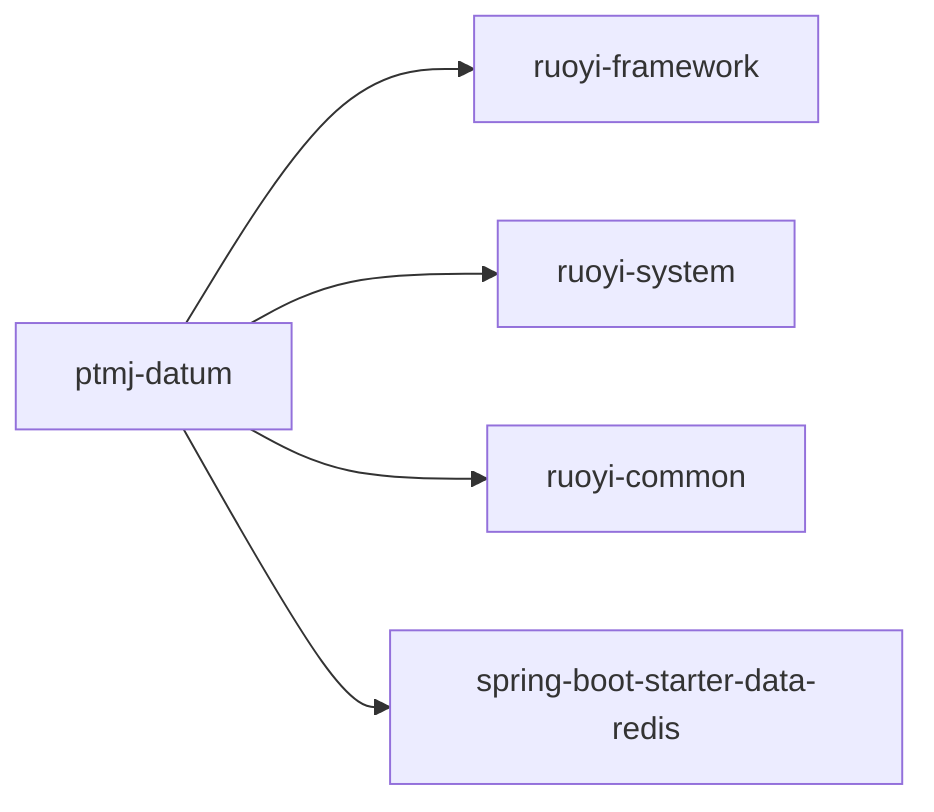

图表来源
- [pom.xml:1-51](file://PezMax-Backend/ptmj-datum/pom.xml#L1-L51)

章节来源
- [pom.xml:1-51](file://PezMax-Backend/ptmj-datum/pom.xml#L1-L51)

## 性能考虑
- 缓存策略：热点文件列表、排行榜、树形目录可使用 Redis 缓存，降低数据库压力。
- 分页与索引：文件与书签列表查询应启用分页，并对常用过滤字段（fileType、fileYear、subject、status 等）建立索引。
- 大文件传输：优先使用对象存储直传与预签名 URL，减少后端带宽占用。
- 异步处理：举报审核结果通知、文件审核通过后刷新缓存等操作建议异步执行。

## 故障排查指南
- 登录失败
  - 检查用户状态是否为封禁；确认密码是否正确且未被重置；查看安全框架日志。
- 文件无法下载
  - 核对文件状态是否为“通过”；检查对象存储路径与权限；确认 MinIO 连接配置。
- 举报无反馈
  - 确认举报记录是否存在；检查审核结果字段；核查通知是否生成与推送。
- 通知不显示
  - 检查通知状态与时间窗口；确认 displayMode 与 sort 优先级；验证前端轮询/订阅逻辑。

## 结论
ptmj-datum 以清晰的领域模型与分层架构，将教育资源管理的核心能力解耦为文件、用户、书签、收藏、举报、通知与安全等模块，并与若依框架深度集成，具备良好的可扩展性与可维护性。后续可在缓存优化、审计追踪、内容审核自动化等方面持续增强。

## 附录

### 业务流程图：文件上传与审核
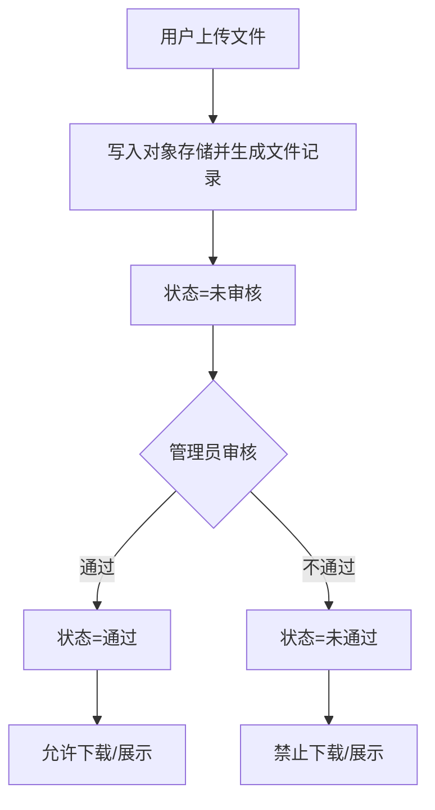

### API 调用示例（概念性）
- 登录
  - 请求：POST /auth/login
  - 参数：username, password
  - 响应：token, userInfo
- 上传文件
  - 请求：POST /datum/file/upload
  - 参数：multipart/form-data(file), fileType, fileYear, fileSchool, fileSubject
  - 响应：fileId, fileUrl, status
- 获取文件列表
  - 请求：GET /datum/file/list?pageNo=1&pageSize=20&fileType=1&fileYear=2024
  - 响应：list, total
- 收藏文件
  - 请求：POST /datum/file/favorite
  - 参数：fileId
  - 响应：success
- 举报文件
  - 请求：POST /datum/report
  - 参数：fileId, reason
  - 响应：reportId
- 获取通知
  - 请求：GET /datum/notification/list?status=0&displayMode=0
  - 响应：list

[本节为概念性说明，不直接分析具体源码文件]