# 框架配置模块 (ruoyi-framework)

<cite>
**本文引用的文件**   
- [pom.xml](file://PezMax-Backend/ruoyi-framework/pom.xml)
</cite>

## 目录
1. [简介](#简介)
2. [项目结构](#项目结构)
3. [核心组件](#核心组件)
4. [架构总览](#架构总览)
5. [详细组件分析](#详细组件分析)
6. [依赖分析](#依赖分析)
7. [性能考虑](#性能考虑)
8. [故障排查指南](#故障排查指南)
9. [结论](#结论)
10. [附录](#附录)

## 简介
本章节聚焦于 ruoyi-framework 框架配置模块，作为系统核心框架层，它向上层业务模块提供统一的基础能力支撑，包括安全认证（SecurityConfig、JWT）、数据源与连接池（Druid、动态数据源）、缓存（Redis集成）、拦截器、AOP切面（日志、权限、限流）等。同时说明 Spring Boot 自动配置的加载顺序与优先级，以及事务管理、异常处理、跨域配置等关键特性如何被框架层统一封装并对外暴露。

## 项目结构
从仓库可见，当前工作区包含多个子模块，其中 ruoyi-framework 为框架核心模块。该模块通过 Maven 聚合依赖，引入 Web、AOP、Druid、验证码、系统信息获取以及系统模块等基础能力，从而为上层应用提供“开箱即用”的通用基础设施。

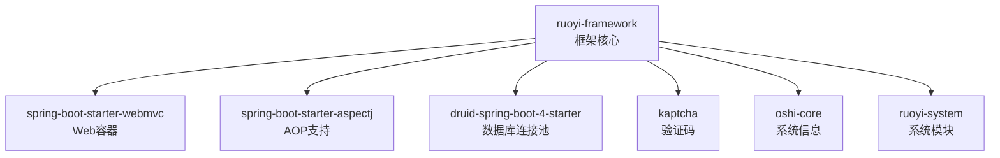

图表来源
- [pom.xml:18-62](file://PezMax-Backend/ruoyi-framework/pom.xml#L18-L62)

章节来源
- [pom.xml:1-64](file://PezMax-Backend/ruoyi-framework/pom.xml#L1-L64)

## 核心组件
本节概述框架层提供的核心能力与职责边界：
- 安全与认证：基于 Spring Security 的安全配置与 JWT 令牌校验流程，提供统一的鉴权入口与异常处理。
- 数据访问：基于 Druid 的连接池管理与动态数据源切换，配合 MyBatis 完成持久化操作。
- 缓存：基于 Redis 的序列化与缓存策略，提升热点数据访问性能。
- 拦截器与过滤器：请求级拦截（如重复提交、防重放、XSS 过滤等），在控制器之前进行预处理。
- AOP 切面：日志记录、数据权限、接口限流等横切关注点集中实现。
- 全局异常处理：统一异常捕获与响应格式，简化业务代码的错误分支。
- 跨域与资源映射：统一 CORS 配置与静态资源映射，便于前后端分离部署。
- 线程池与异步任务：提供可配置的线程池与异步工厂，支撑高并发场景。

上述能力由框架层的配置类与组件装配而成，并通过 Spring Boot 自动配置机制在应用启动时按需加载。

## 架构总览
下图展示了框架层在整体系统中的位置与交互关系：应用启动后，Spring Boot 自动装配框架提供的配置类；HTTP 请求进入 Servlet 容器后，依次经过过滤器、拦截器、AOP 切面与安全过滤器链，最终到达业务 Controller；数据访问层通过动态数据源与 Druid 连接池访问数据库；缓存层通过 Redis 加速读取；全局异常处理器统一收敛错误。

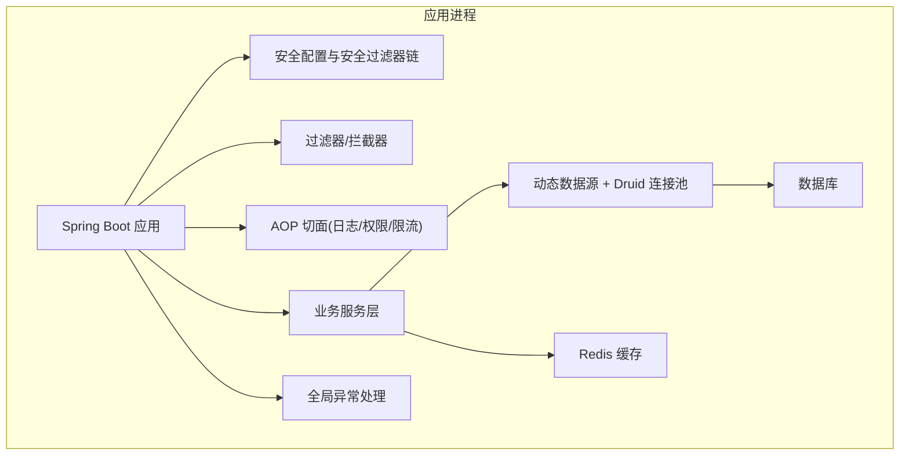

图表来源
- [pom.xml:18-62](file://PezMax-Backend/ruoyi-framework/pom.xml#L18-L62)

## 详细组件分析

### 安全配置与 JWT 认证
- 目标：提供无状态的身份认证与授权能力，结合 Spring Security 与 JWT 令牌，实现登录、鉴权、刷新与退出流程。
- 关键点：
  - 安全配置类负责定义 URL 白名单、角色/权限规则、会话策略与异常处理。
  - JWT 过滤器在请求头中解析令牌，注入认证上下文，供后续权限判断使用。
  - 未认证或无权限请求由统一入口处理器返回标准化错误响应。
- 扩展建议：
  - 增加多端登录控制与设备绑定策略。
  - 对敏感接口增加二次校验（短信/邮箱）。
  - 将黑名单令牌纳入 Redis 快速查询。

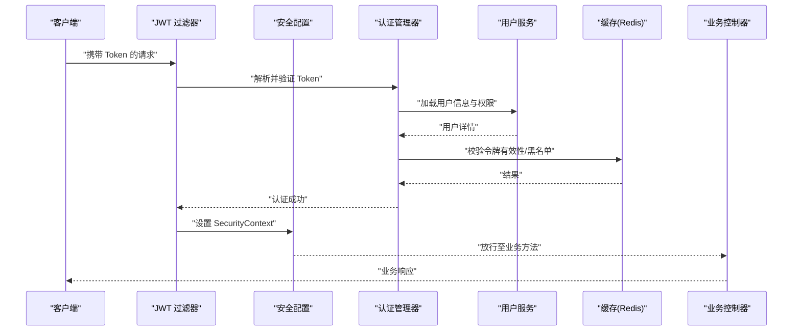

图表来源
- [pom.xml:18-62](file://PezMax-Backend/ruoyi-framework/pom.xml#L18-L62)

章节来源
- [pom.xml:18-62](file://PezMax-Backend/ruoyi-framework/pom.xml#L18-L62)

### 数据源配置（Druid 连接池与动态数据源）
- 目标：统一管理数据库连接池与多数据源路由，满足读写分离或多租户场景。
- 关键点：
  - Druid 提供连接池监控、SQL 统计与慢查询告警。
  - 动态数据源根据注解或上下文选择具体数据源，实现运行时切换。
  - 与 MyBatis 集成，确保事务与数据源一致性。
- 扩展建议：
  - 增加连接池健康检查与自动恢复。
  - 针对大事务优化隔离级别与超时策略。
  - 接入 SQL 审计与脱敏。

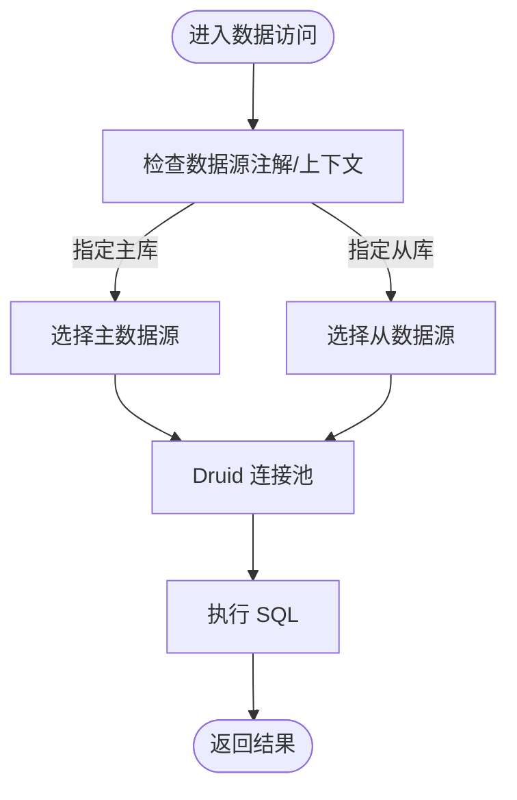

图表来源
- [pom.xml:18-62](file://PezMax-Backend/ruoyi-framework/pom.xml#L18-L62)

章节来源
- [pom.xml:18-62](file://PezMax-Backend/ruoyi-framework/pom.xml#L18-L62)

### 缓存配置（Redis 集成）
- 目标：提供高性能缓存能力，降低数据库压力，提升热点数据访问速度。
- 关键点：
  - 自定义序列化器保证对象序列化兼容性与可读性。
  - 统一缓存键命名规范与过期策略。
  - 与业务 Service 解耦，通过工具类或注解式缓存简化使用。
- 扩展建议：
  - 增加缓存穿透/雪崩防护（布隆过滤器、随机过期）。
  - 支持多级缓存（本地+分布式）。
  - 接入缓存监控与命中率统计。

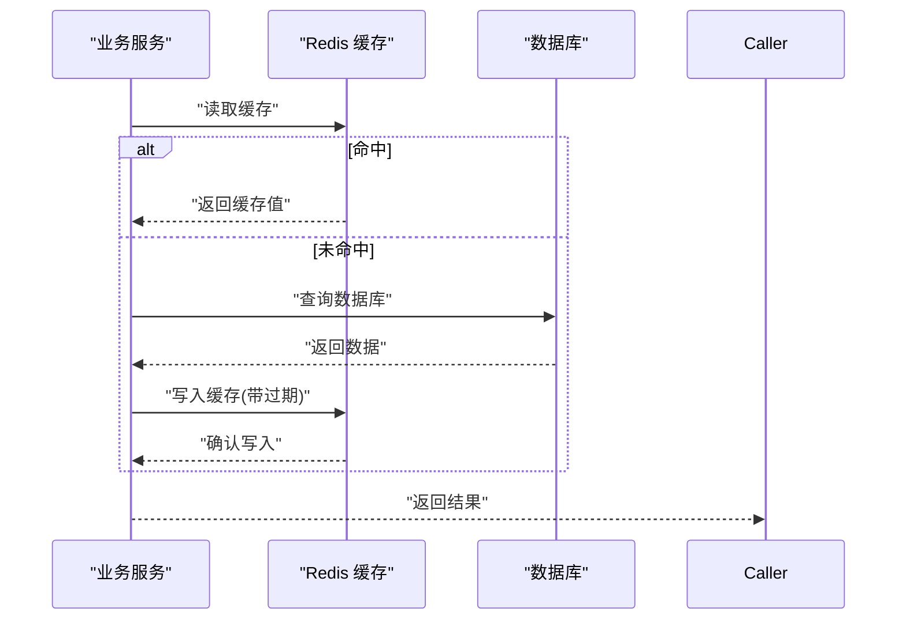

图表来源
- [pom.xml:18-62](file://PezMax-Backend/ruoyi-framework/pom.xml#L18-L62)

章节来源
- [pom.xml:18-62](file://PezMax-Backend/ruoyi-framework/pom.xml#L18-L62)

### 拦截器与过滤器
- 目标：在请求进入业务逻辑前进行预处理，如重复提交、参数清洗、XSS 防护、Referer 校验等。
- 关键点：
  - 过滤器作用于 Servlet 容器层面，适合做通用安全与编码处理。
  - 拦截器作用于 Spring MVC 层，适合做业务相关的预处理。
  - 可通过配置类注册与排序，确保执行顺序可控。
- 扩展建议：
  - 增加请求链路追踪（TraceId）。
  - 统一限流与熔断前置拦截。
  - 对上传请求做大小与类型校验。

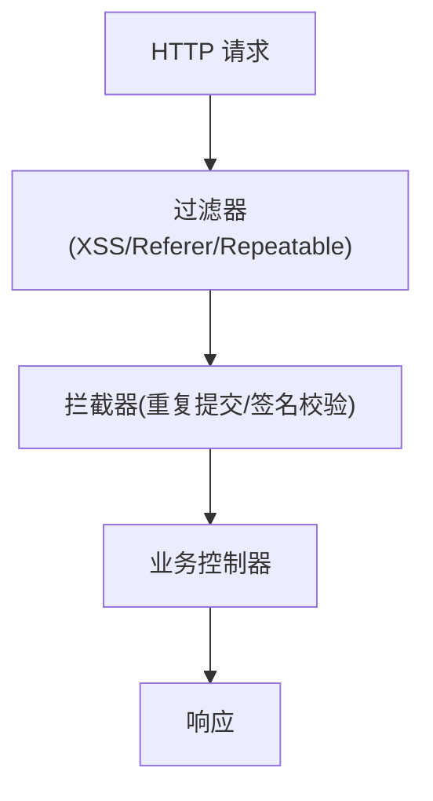

图表来源
- [pom.xml:18-62](file://PezMax-Backend/ruoyi-framework/pom.xml#L18-L62)

章节来源
- [pom.xml:18-62](file://PezMax-Backend/ruoyi-framework/pom.xml#L18-L62)

### AOP 切面编程（日志、权限、限流）
- 目标：将横切关注点从业务代码中剥离，统一实现日志记录、数据权限与接口限流。
- 关键点：
  - 日志切面记录请求参数、耗时、异常堆栈，便于问题定位。
  - 权限切面基于注解或表达式进行细粒度授权控制。
  - 限流切面基于令牌桶/滑动窗口算法限制接口调用频率。
- 扩展建议：
  - 接入结构化日志与指标采集（Prometheus/Grafana）。
  - 支持按租户/模块维度限流。
  - 增加幂等性切面与重试策略。

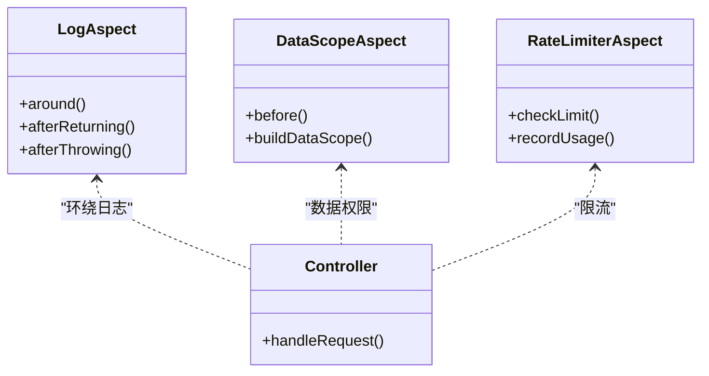

图表来源
- [pom.xml:18-62](file://PezMax-Backend/ruoyi-framework/pom.xml#L18-L62)

章节来源
- [pom.xml:18-62](file://PezMax-Backend/ruoyi-framework/pom.xml#L18-L62)

### 全局异常处理
- 目标：统一捕获并格式化异常，避免业务代码分散处理错误分支。
- 关键点：
  - 捕获业务异常、参数校验异常、系统异常等，返回标准响应体。
  - 区分开发环境与生产环境的错误信息输出。
  - 与前端约定错误码与消息，便于统一提示。
- 扩展建议：
  - 接入告警与错误上报平台。
  - 增加敏感信息脱敏。
  - 支持国际化错误消息。

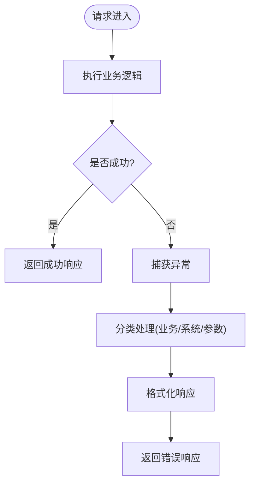

图表来源
- [pom.xml:18-62](file://PezMax-Backend/ruoyi-framework/pom.xml#L18-L62)

章节来源
- [pom.xml:18-62](file://PezMax-Backend/ruoyi-framework/pom.xml#L18-L62)

### 跨域配置与资源映射
- 目标：解决前后端分离部署时的跨域问题，并提供静态资源访问能力。
- 关键点：
  - 配置允许的域名、方法与头部，支持预检请求。
  - 注册静态资源路径映射，便于前端资源托管。
- 扩展建议：
  - 增加动态白名单与灰度发布策略。
  - 对静态资源启用压缩与缓存。

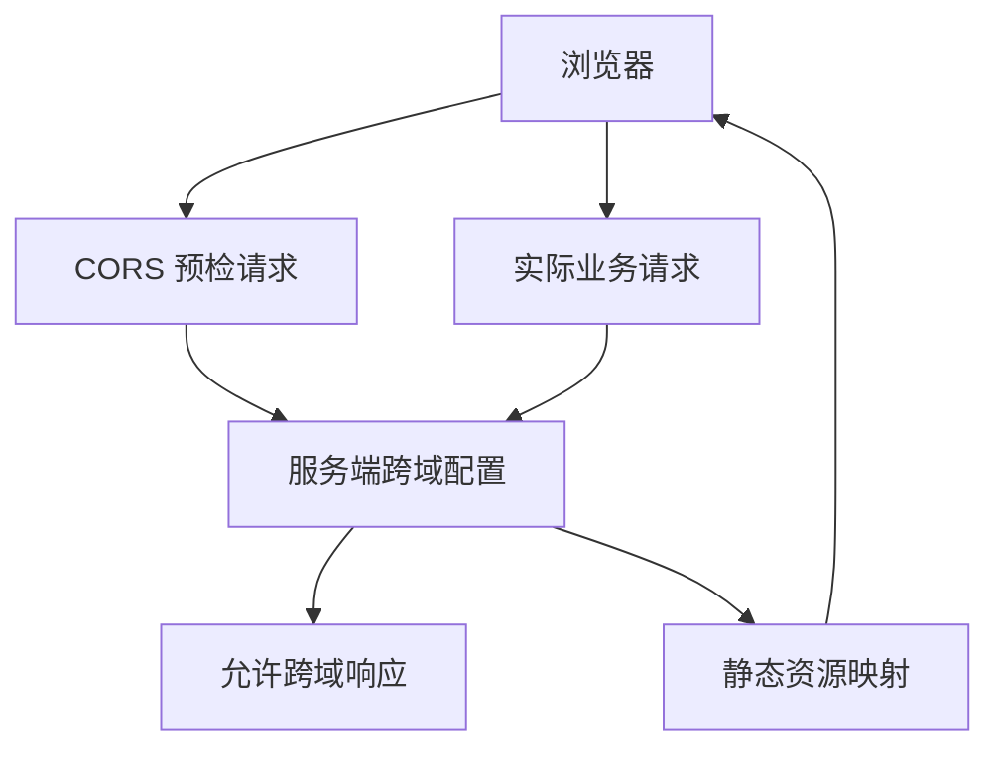

图表来源
- [pom.xml:18-62](file://PezMax-Backend/ruoyi-framework/pom.xml#L18-L62)

章节来源
- [pom.xml:18-62](file://PezMax-Backend/ruoyi-framework/pom.xml#L18-L62)

### 事务管理
- 目标：通过声明式事务保障数据一致性，简化业务代码的事务控制。
- 关键点：
  - 默认开启事务注解驱动，支持传播行为与隔离级别配置。
  - 与动态数据源集成，确保事务边界内数据源一致。
- 扩展建议：
  - 针对长事务拆分与补偿机制。
  - 接入分布式事务方案（如 Seata）。

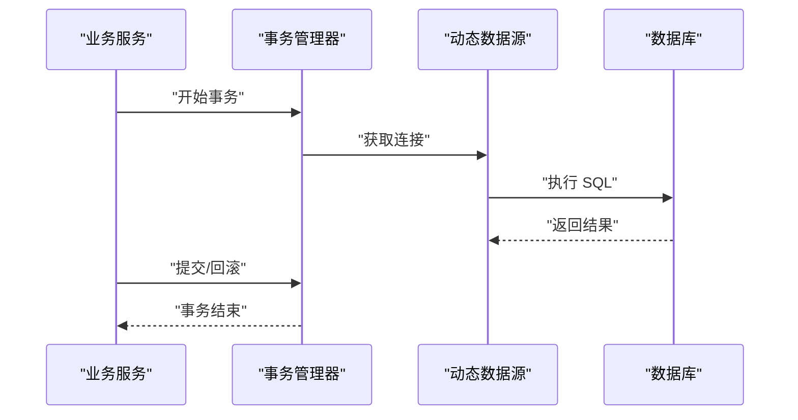

图表来源
- [pom.xml:18-62](file://PezMax-Backend/ruoyi-framework/pom.xml#L18-L62)

章节来源
- [pom.xml:18-62](file://PezMax-Backend/ruoyi-framework/pom.xml#L18-L62)

### 线程池与异步任务
- 目标：提供可配置的线程池与异步工厂，支撑高并发与后台任务。
- 关键点：
  - 合理设置核心线程数、最大线程数与队列容量。
  - 统一异常处理与任务监控。
- 扩展建议：
  - 接入任务调度中心（Quartz/XXL-Job）。
  - 增加任务优先级与超时控制。

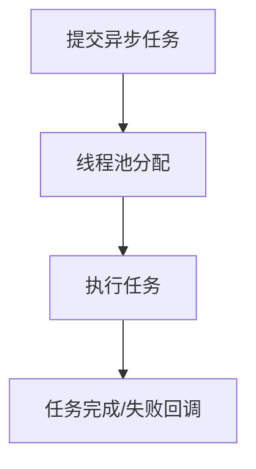

图表来源
- [pom.xml:18-62](file://PezMax-Backend/ruoyi-framework/pom.xml#L18-L62)

章节来源
- [pom.xml:18-62](file://PezMax-Backend/ruoyi-framework/pom.xml#L18-L62)

## 依赖分析
框架模块通过 Maven 聚合依赖，形成清晰的层次关系：Web 容器提供 HTTP 处理能力，AOP 提供横切能力，Druid 提供连接池与监控，Kaptcha 提供验证码能力，oshi-core 提供系统信息采集，ruoyi-system 提供系统领域模型与服务。

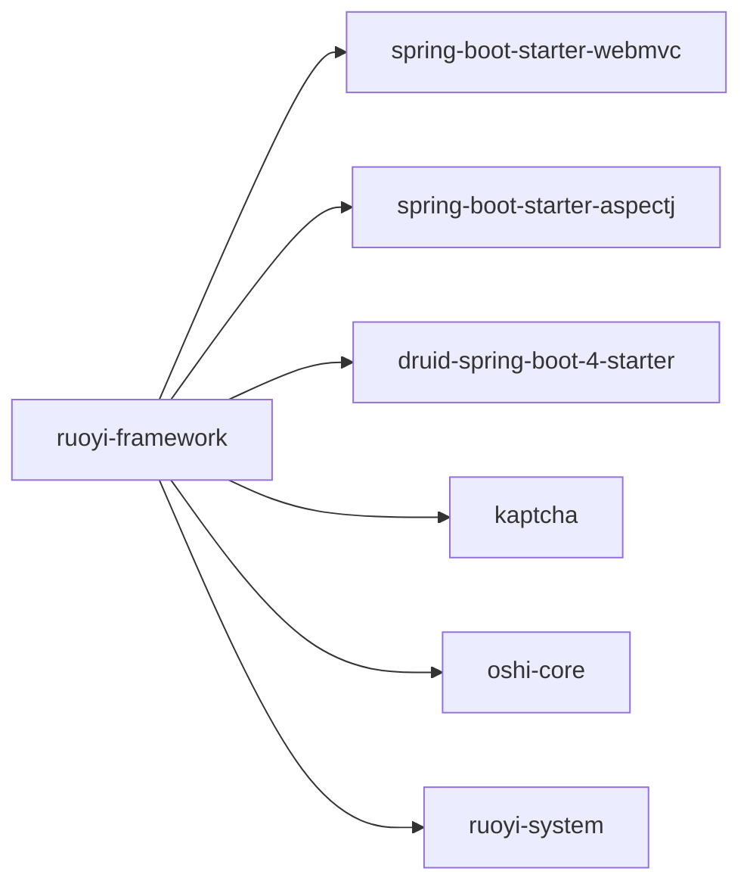

图表来源
- [pom.xml:18-62](file://PezMax-Backend/ruoyi-framework/pom.xml#L18-L62)

章节来源
- [pom.xml:18-62](file://PezMax-Backend/ruoyi-framework/pom.xml#L18-L62)

## 性能考虑
- 连接池：调整 Druid 初始大小、最大连接数与空闲回收时间，避免频繁创建销毁连接。
- 缓存：合理设置过期时间与更新策略，避免缓存击穿与雪崩。
- 限流：选择合适的算法与阈值，保护后端资源不被突发流量压垮。
- 线程池：根据 CPU 密集与 IO 密集型任务分别配置，避免线程饥饿。
- 日志：在生产环境减少冗余日志，采用异步输出与采样策略。

## 故障排查指南
- 安全相关：检查 JWT 令牌有效期、签名密钥与黑名单策略；确认白名单与权限规则是否正确。
- 数据源：查看 Druid 监控面板，关注连接泄漏、慢 SQL 与等待队列长度；核对动态数据源切换条件。
- 缓存：检查 Redis 连通性与序列化兼容性；确认键空间与过期策略是否符合预期。
- 拦截器/过滤器：打印请求链路 TraceId，确认执行顺序与跳过条件。
- 异常处理：统一错误码与消息，结合日志定位根因；区分开发与生产环境输出。

## 结论
ruoyi-framework 作为系统核心框架层，通过模块化与自动化装配，为上层业务提供了安全、数据访问、缓存、拦截、AOP、异常处理、跨域、事务与异步等统一基础能力。其设计强调解耦与可扩展，便于在不同业务场景中复用与定制。

## 附录
- 配置示例与扩展指南：
  - 安全与 JWT：在安全配置类中维护白名单与权限规则，扩展过滤器以支持更多认证方式。
  - 数据源：在动态数据源上下文中设置数据源标识，结合注解实现方法级切换。
  - 缓存：定义统一的键前缀与过期策略，必要时引入多级缓存。
  - 拦截器：在配置类中注册并排序，确保关键拦截优先执行。
  - AOP：基于注解定义切点，结合表达式实现细粒度控制。
  - 异常处理：定义标准错误码与消息模板，统一返回格式。
  - 跨域：根据部署环境动态配置允许的域名与方法。
  - 事务：合理设置传播行为与隔离级别，避免长事务与死锁。
  - 线程池：依据负载特征调优参数，接入监控与告警。