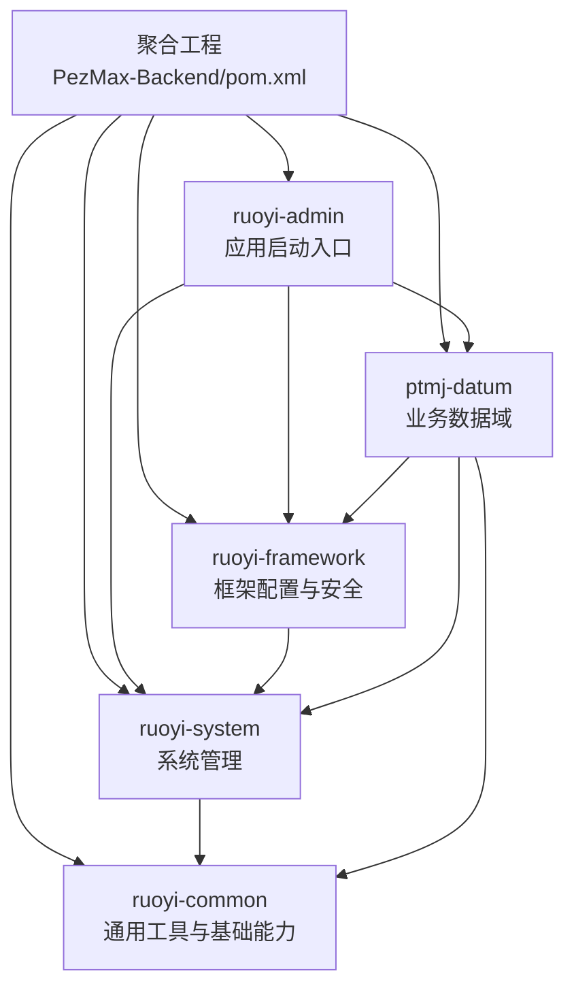
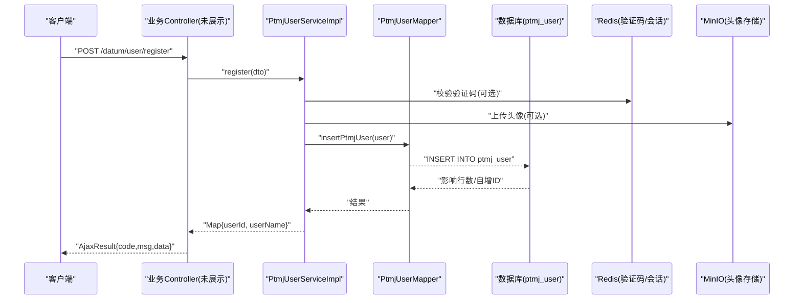
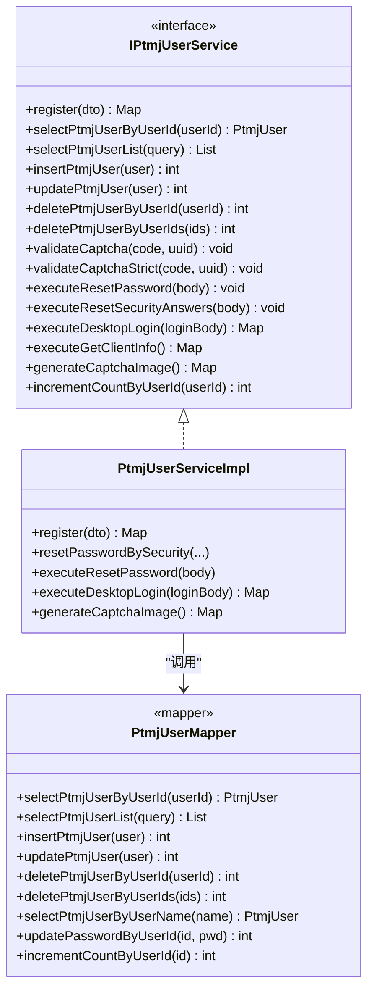
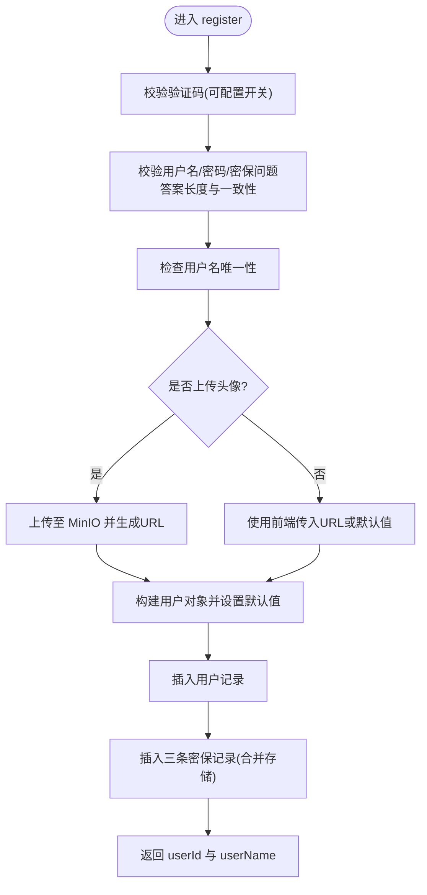
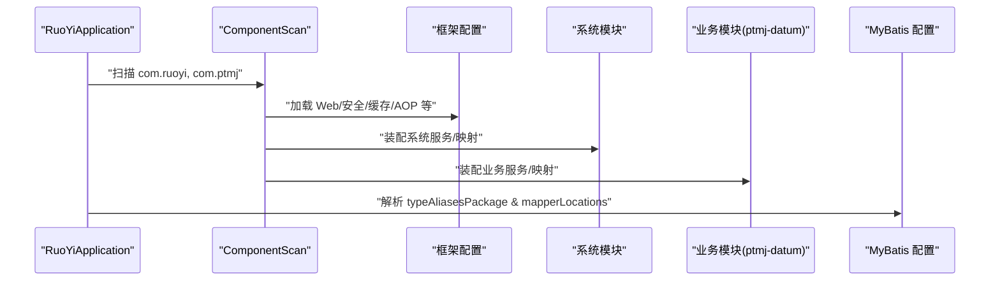
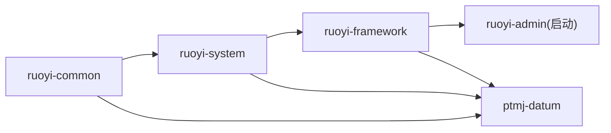

# 模块设计

<cite>
**本文引用的文件**   
- [PezMax-Backend/pom.xml](file://PezMax-Backend/pom.xml)
- [ruoyi-common/pom.xml](file://PezMax-Backend/ruoyi-common/pom.xml)
- [ruoyi-framework/pom.xml](file://PezMax-Backend/ruoyi-framework/pom.xml)
- [ruoyi-system/pom.xml](file://PezMax-Backend/ruoyi-system/pom.xml)
- [ptmj-datum/pom.xml](file://PezMax-Backend/ptmj-datum/pom.xml)
- [RuoYiApplication.java](file://PezMax-Backend/ruoyi-admin/src/main/java/com/ruoyi/RuoYiApplication.java)
- [GlobalExceptionHandler.java](file://PezMax-Backend/ruoyi-framework/src/main/java/com/ruoyi/framework/web/exception/GlobalExceptionHandler.java)
- [IPtmjUserService.java](file://PezMax-Backend/ptmj-datum/src/main/java/com/ptmj/datum/service/IPtmjUserService.java)
- [PtmjUserServiceImpl.java](file://PezMax-Backend/ptmj-datum/src/main/java/com/ptmj/datum/service/impl/PtmjUserServiceImpl.java)
- [PtmjUserMapper.java](file://PezMax-Backend/ptmj-datum/src/main/java/com/ptmj/datum/mapper/PtmjUserMapper.java)
- [PtmjUserMapper.xml](file://PezMax-Backend/ptmj-datum/src/main/resources/mapper/datum/PtmjUserMapper.xml)
- [application.yml](file://PezMax-Backend/ruoyi-admin/src/main/resources/application.yml)
</cite>

## 目录
1. [简介](#简介)
2. [项目结构](#项目结构)
3. [核心组件](#核心组件)
4. [架构总览](#架构总览)
5. [详细组件分析](#详细组件分析)
6. [依赖关系分析](#依赖关系分析)
7. [性能与可扩展性](#性能与可扩展性)
8. [故障排查指南](#故障排查指南)
9. [结论](#结论)
10. [附录：最佳实践与示例](#附录最佳实践与示例)

## 简介
本文件面向 PezMax-One 后端系统，聚焦 Maven 多模块架构与分层设计，围绕以下模块展开：
- ruoyi-common：通用工具、常量、异常、基础领域对象等
- ruoyi-framework：框架配置（Web、安全、缓存、AOP、数据源、拦截器等）
- ruoyi-system：系统管理（用户、角色、菜单、字典、日志等）
- ptmj-datum：业务数据域（学习资料、书签、通知、安全策略等）

文档将说明各模块职责边界、依赖关系、接口契约、初始化流程、配置管理、异常处理机制，并给出 Controller → Service → Mapper → Database 的分层调用示例与最佳实践。

## 项目结构
顶层聚合工程通过父 POM 统一版本管理与插件配置，声明子模块与依赖版本；各子模块通过各自的 pom.xml 声明自身依赖。应用启动入口位于 ruoyi-admin 模块，扫描 com.ruoyi 与 com.ptmj 包以发现控制器与服务。

图表来源
- [PezMax-Backend/pom.xml:177-185](file://PezMax-Backend/pom.xml#L177-L185)
- [ruoyi-framework/pom.xml:56-62](file://PezMax-Backend/ruoyi-framework/pom.xml#L56-L62)
- [ruoyi-system/pom.xml:18-26](file://PezMax-Backend/ruoyi-system/pom.xml#L18-L26)
- [ptmj-datum/pom.xml:23-49](file://PezMax-Backend/ptmj-datum/pom.xml#L23-L49)
- [RuoYiApplication.java:14-14](file://PezMax-Backend/ruoyi-admin/src/main/java/com/ruoyi/RuoYiApplication.java#L14-L14)

章节来源
- [PezMax-Backend/pom.xml:177-185](file://PezMax-Backend/pom.xml#L177-L185)
- [ruoyi-common/pom.xml:1-136](file://PezMax-Backend/ruoyi-common/pom.xml#L1-L136)
- [ruoyi-framework/pom.xml:1-64](file://PezMax-Backend/ruoyi-framework/pom.xml#L1-L64)
- [ruoyi-system/pom.xml:1-28](file://PezMax-Backend/ruoyi-system/pom.xml#L1-L28)
- [ptmj-datum/pom.xml:1-51](file://PezMax-Backend/ptmj-datum/pom.xml#L1-L51)
- [RuoYiApplication.java:14-14](file://PezMax-Backend/ruoyi-admin/src/main/java/com/ruoyi/RuoYiApplication.java#L14-L14)

## 核心组件
- 通用模块（ruoyi-common）
  - 提供全局异常体系、HTTP 状态码、分页、Redis 缓存封装、MinIO 客户端、JSON/Excel/签名/日期/UUID 等工具类
  - 为上层模块提供无业务耦合的基础能力
- 框架模块（ruoyi-framework）
  - 集成 Spring Web、AOP、Druid、验证码、系统信息获取、全局异常处理器、安全过滤器、线程池、动态数据源等
  - 依赖系统模块以复用系统管理能力
- 系统模块（ruoyi-system）
  - 实现系统级实体与持久化（用户、角色、部门、菜单、字典、操作日志等）
  - 被框架与业务模块共同依赖
- 业务数据模块（ptmj-datum）
  - 承载“学习资料”相关领域模型、服务与映射
  - 依赖框架与系统模块，使用通用工具完成注册、登录、密保、验证码、头像上传等业务逻辑

章节来源
- [ruoyi-common/pom.xml:18-134](file://PezMax-Backend/ruoyi-common/pom.xml#L18-L134)
- [ruoyi-framework/pom.xml:18-62](file://PezMax-Backend/ruoyi-framework/pom.xml#L18-L62)
- [ruoyi-system/pom.xml:18-26](file://PezMax-Backend/ruoyi-system/pom.xml#L18-L26)
- [ptmj-datum/pom.xml:23-49](file://PezMax-Backend/ptmj-datum/pom.xml#L23-L49)

## 架构总览
整体采用经典分层：Controller → Service → Mapper → DB。ptmj-datum 中的用户服务展示了典型的数据访问链路，结合全局异常处理器统一返回 AjaxResult。

图表来源
- [PtmjUserServiceImpl.java:197-350](file://PezMax-Backend/ptmj-datum/src/main/java/com/ptmj/datum/service/impl/PtmjUserServiceImpl.java#L197-L350)
- [PtmjUserMapper.java:42-45](file://PezMax-Backend/ptmj-datum/src/main/java/com/ptmj/datum/mapper/PtmjUserMapper.java#L42-L45)
- [PtmjUserMapper.xml:42-68](file://PezMax-Backend/ptmj-datum/src/main/resources/mapper/datum/PtmjUserMapper.xml#L42-L68)
- [GlobalExceptionHandler.java:58-64](file://PezMax-Backend/ruoyi-framework/src/main/java/com/ruoyi/framework/web/exception/GlobalExceptionHandler.java#L58-L64)

## 详细组件分析

### 模块职责与边界
- ruoyi-common
  - 职责：跨模块共享的注解、常量、异常、工具、基础领域对象
  - 边界：不包含任何业务逻辑，不依赖业务模块
- ruoyi-framework
  - 职责：Web容器、安全、AOP切面、缓存、数据源、全局异常、拦截器、线程池等
  - 边界：仅依赖 common 与 system，不直接暴露业务接口
- ruoyi-system
  - 职责：系统管理领域的实体、服务、映射
  - 边界：依赖 common，被 framework 与业务模块复用
- ptmj-datum
  - 职责：学习资料域的业务实现（用户、文件、书签、报告、通知、安全等）
  - 边界：依赖 framework/system/common，对外暴露 Service 接口供 Controller 调用

章节来源
- [ruoyi-common/pom.xml:1-136](file://PezMax-Backend/ruoyi-common/pom.xml#L1-L136)
- [ruoyi-framework/pom.xml:1-64](file://PezMax-Backend/ruoyi-framework/pom.xml#L1-L64)
- [ruoyi-system/pom.xml:1-28](file://PezMax-Backend/ruoyi-system/pom.xml#L1-L28)
- [ptmj-datum/pom.xml:1-51](file://PezMax-Backend/ptmj-datum/pom.xml#L1-L51)

### 分层架构与接口契约（以用户为例）
- Controller 层：接收请求、参数校验、调用 Service
- Service 层：编排业务、事务控制、调用 Mapper/外部服务
- Mapper 层：定义数据访问方法，绑定 XML SQL
- Database：MySQL 表 ptmj_user 等

图表来源
- [IPtmjUserService.java:15-166](file://PezMax-Backend/ptmj-datum/src/main/java/com/ptmj/datum/service/IPtmjUserService.java#L15-L166)
- [PtmjUserServiceImpl.java:49-786](file://PezMax-Backend/ptmj-datum/src/main/java/com/ptmj/datum/service/impl/PtmjUserServiceImpl.java#L49-L786)
- [PtmjUserMapper.java:20-101](file://PezMax-Backend/ptmj-datum/src/main/java/com/ptmj/datum/mapper/PtmjUserMapper.java#L20-L101)

章节来源
- [IPtmjUserService.java:15-166](file://PezMax-Backend/ptmj-datum/src/main/java/com/ptmj/datum/service/IPtmjUserService.java#L15-L166)
- [PtmjUserServiceImpl.java:49-786](file://PezMax-Backend/ptmj-datum/src/main/java/com/ptmj/datum/service/impl/PtmjUserServiceImpl.java#L49-L786)
- [PtmjUserMapper.java:20-101](file://PezMax-Backend/ptmj-datum/src/main/java/com/ptmj/datum/mapper/PtmjUserMapper.java#L20-L101)

### 关键业务流程（注册）

图表来源
- [PtmjUserServiceImpl.java:197-350](file://PezMax-Backend/ptmj-datum/src/main/java/com/ptmj/datum/service/impl/PtmjUserServiceImpl.java#L197-L350)
- [PtmjUserMapper.xml:42-68](file://PezMax-Backend/ptmj-datum/src/main/resources/mapper/datum/PtmjUserMapper.xml#L42-L68)

章节来源
- [PtmjUserServiceImpl.java:197-350](file://PezMax-Backend/ptmj-datum/src/main/java/com/ptmj/datum/service/impl/PtmjUserServiceImpl.java#L197-L350)
- [PtmjUserMapper.xml:42-68](file://PezMax-Backend/ptmj-datum/src/main/resources/mapper/datum/PtmjUserMapper.xml#L42-L68)

### 模块初始化流程
- 应用入口 RuoYiApplication 排除数据源自动配置，并通过 @ComponentScan 同时扫描 com.ruoyi 与 com.ptmj 包，确保业务模块的 Bean 能被装配
- MyBatis 通过 typeAliasesPackage 与 mapperLocations 扫描 domain 与 mapper XML
- Redis、MinIO、验证码、安全等由框架模块配置加载

图表来源
- [RuoYiApplication.java:14-14](file://PezMax-Backend/ruoyi-admin/src/main/java/com/ruoyi/RuoYiApplication.java#L14-L14)
- [application.yml:104-111](file://PezMax-Backend/ruoyi-admin/src/main/resources/application.yml#L104-L111)

章节来源
- [RuoYiApplication.java:14-14](file://PezMax-Backend/ruoyi-admin/src/main/java/com/ruoyi/RuoYiApplication.java#L14-L14)
- [application.yml:104-111](file://PezMax-Backend/ruoyi-admin/src/main/resources/application.yml#L104-L111)

### 配置管理策略
- 应用配置 application.yml 集中管理服务器、日志、Spring、Redis、Token、MyBatis、PageHelper、Swagger、防盗链、XSS、MinIO、业务自定义项
- 环境变量注入：如 UPLOAD_PATH、REDIS_HOST 等，便于不同环境差异化部署
- 验证码类型、MinIO 桶名、允许格式等通过配置驱动行为

章节来源
- [application.yml:1-162](file://PezMax-Backend/ruoyi-admin/src/main/resources/application.yml#L1-L162)

### 异常处理机制
- 全局异常处理器捕获权限、参数绑定、业务异常、运行时异常等，统一返回 AjaxResult
- 业务层抛出 ServiceException，携带错误码与消息，便于前端友好提示

章节来源
- [GlobalExceptionHandler.java:27-145](file://PezMax-Backend/ruoyi-framework/src/main/java/com/ruoyi/framework/web/exception/GlobalExceptionHandler.java#L27-L145)

## 依赖关系分析
- 聚合工程声明所有子模块与公共依赖版本
- 依赖方向：
  - ruoyi-framework 依赖 ruoyi-system
  - ruoyi-system 依赖 ruoyi-common
  - ptmj-datum 依赖 ruoyi-framework、ruoyi-system、ruoyi-common
  - ruoyi-admin 作为启动模块，依赖 framework/system/datum

图表来源
- [PezMax-Backend/pom.xml:177-185](file://PezMax-Backend/pom.xml#L177-L185)
- [ruoyi-framework/pom.xml:56-62](file://PezMax-Backend/ruoyi-framework/pom.xml#L56-L62)
- [ruoyi-system/pom.xml:18-26](file://PezMax-Backend/ruoyi-system/pom.xml#L18-L26)
- [ptmj-datum/pom.xml:23-49](file://PezMax-Backend/ptmj-datum/pom.xml#L23-L49)

章节来源
- [PezMax-Backend/pom.xml:177-185](file://PezMax-Backend/pom.xml#L177-L185)
- [ruoyi-framework/pom.xml:56-62](file://PezMax-Backend/ruoyi-framework/pom.xml#L56-L62)
- [ruoyi-system/pom.xml:18-26](file://PezMax-Backend/ruoyi-system/pom.xml#L18-L26)
- [ptmj-datum/pom.xml:23-49](file://PezMax-Backend/ptmj-datum/pom.xml#L23-L49)

## 性能与可扩展性
- 连接池与缓存
  - Druid 连接池提升数据库访问效率
  - Redis 用于验证码、会话与热点数据缓存
- 异步与线程池
  - 框架提供线程池配置，适合耗时任务异步化
- 分页与查询优化
  - PageHelper 简化分页；SQL 中避免全表扫描，合理使用索引
- 文件存储
  - MinIO 独立存储头像等大对象，减轻数据库压力
- 扩展建议
  - 对高频读路径增加多级缓存（本地+分布式）
  - 批量操作使用批处理与事务边界控制
  - 敏感字段脱敏与最小化返回

[本节为通用指导，无需源码引用]

## 故障排查指南
- 全局异常定位
  - 查看 GlobalExceptionHandler 日志输出，确认请求 URI 与异常类型
- 业务异常
  - 关注 ServiceException 的错误码与消息，快速定位业务校验失败点
- 验证码问题
  - 检查 Redis 中验证码键是否存在且未过期
  - 确认 application.yml 中 captchaType 与开关配置
- 文件上传失败
  - 核对 MinIO URL、Bucket、AccessKey/SecretKey 配置
  - 观察 Service 层上传日志与异常堆栈
- 数据库更新无效
  - 检查 Mapper XML 的 SQL 条件与参数绑定
  - 确认事务是否回滚

章节来源
- [GlobalExceptionHandler.java:27-145](file://PezMax-Backend/ruoyi-framework/src/main/java/com/ruoyi/framework/web/exception/GlobalExceptionHandler.java#L27-L145)
- [application.yml:149-162](file://PezMax-Backend/ruoyi-admin/src/main/resources/application.yml#L149-L162)
- [PtmjUserServiceImpl.java:197-350](file://PezMax-Backend/ptmj-datum/src/main/java/com/ptmj/datum/service/impl/PtmjUserServiceImpl.java#L197-L350)
- [PtmjUserMapper.xml:118-128](file://PezMax-Backend/ptmj-datum/src/main/resources/mapper/datum/PtmjUserMapper.xml#L118-L128)

## 结论
PezMax-One 采用清晰的多模块分层架构：common 提供通用能力，framework 提供基础设施，system 沉淀系统管理能力，datum 承载业务领域。该设计有利于代码复用、团队协作与独立演进。配合全局异常、配置中心与缓存/对象存储，具备良好可维护性与扩展性。

[本节为总结，无需源码引用]

## 附录：最佳实践与示例
- 分层调用示例（注册）
  - Controller 接收 DTO，调用 Service.register
  - Service 进行验证码校验、参数校验、头像上传、事务写入
  - Mapper 执行 INSERT，XML 中定义动态 SQL
  - 异常由全局处理器统一包装返回
- 模块间调用规范
  - 仅通过接口暴露能力，禁止跨层直连
  - 使用统一的 AjaxResult 与 ServiceException
- 配置与环境
  - 使用环境变量覆盖敏感配置（如 REDIS_HOST、MinIO 密钥）
  - 按环境拆分配置文件或使用 profiles
- 事务与幂等
  - 写操作加 @Transactional，明确 rollbackFor
  - 幂等接口需引入唯一键或去重逻辑
- 安全与合规
  - 输入校验与 XSS 过滤
  - 敏感字段脱敏与最小化返回

章节来源
- [PtmjUserServiceImpl.java:197-350](file://PezMax-Backend/ptmj-datum/src/main/java/com/ptmj/datum/service/impl/PtmjUserServiceImpl.java#L197-L350)
- [PtmjUserMapper.xml:42-68](file://PezMax-Backend/ptmj-datum/src/main/resources/mapper/datum/PtmjUserMapper.xml#L42-L68)
- [GlobalExceptionHandler.java:58-64](file://PezMax-Backend/ruoyi-framework/src/main/java/com/ruoyi/framework/web/exception/GlobalExceptionHandler.java#L58-L64)
- [application.yml:1-162](file://PezMax-Backend/ruoyi-admin/src/main/resources/application.yml#L1-L162)