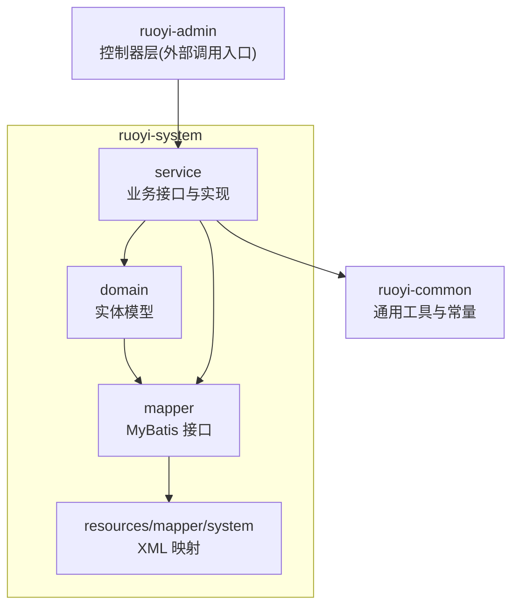
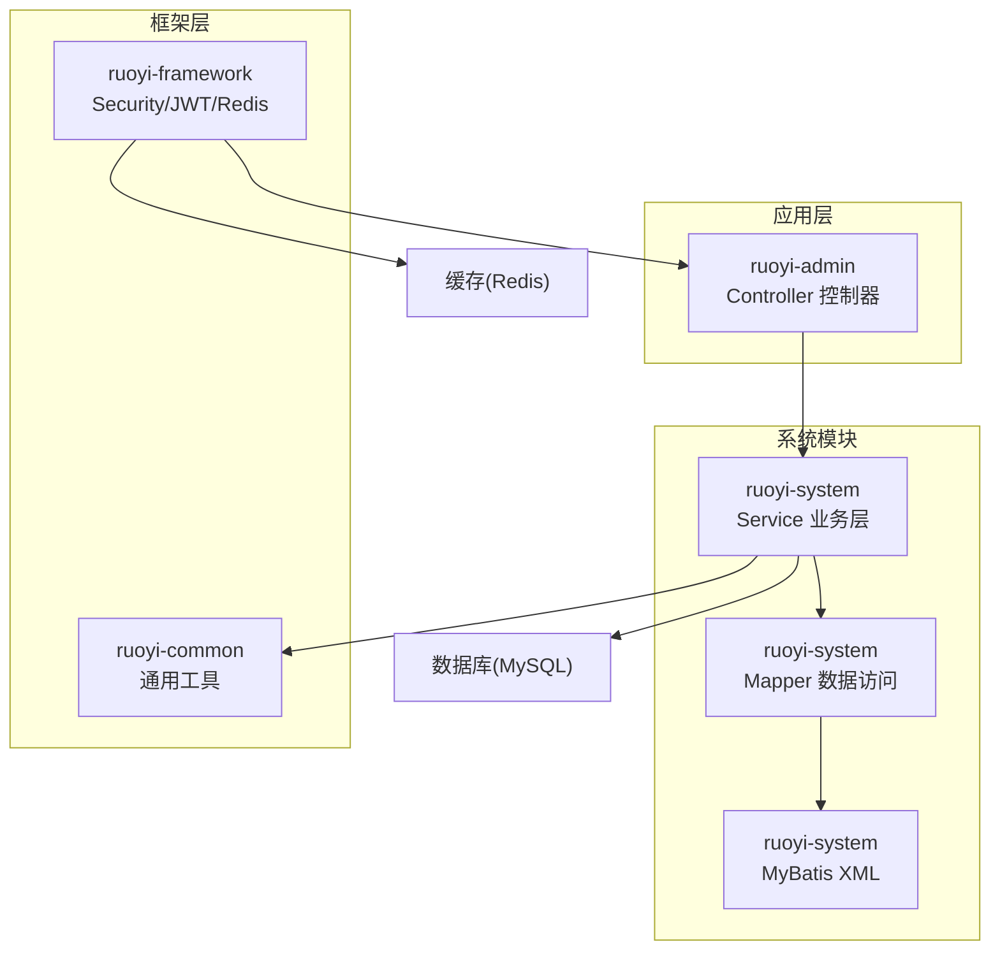
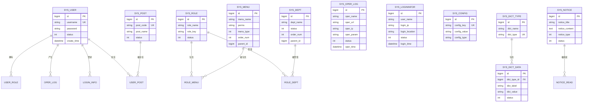
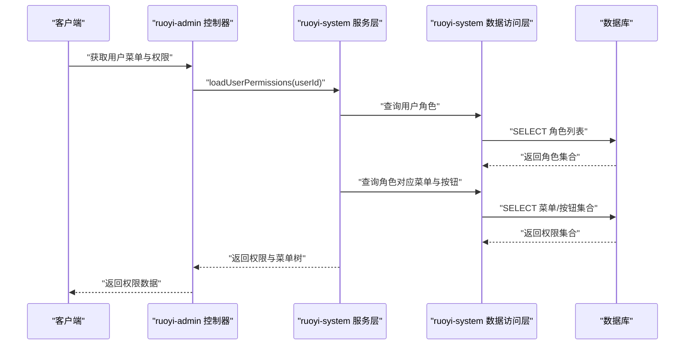
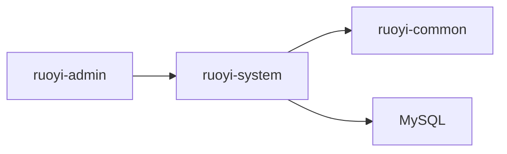

# 系统管理模块 (ruoyi-system)

<cite>
**本文引用的文件**   
- [pom.xml](file://PezMax-Backend/ruoyi-system/pom.xml)
- [README.md](file://PezMax-Backend/README.md)
</cite>

## 目录
1. [简介](#简介)
2. [项目结构](#项目结构)
3. [核心组件](#核心组件)
4. [架构总览](#架构总览)
5. [详细组件分析](#详细组件分析)
6. [依赖分析](#依赖分析)
7. [性能考虑](#性能考虑)
8. [故障排查指南](#故障排查指南)
9. [结论](#结论)
10. [附录](#附录)

## 简介
本章节面向 ruoyi-system 系统管理模块，聚焦用户、角色、菜单、部门、字典、操作日志、登录日志等基础能力，以及 RBAC 权限模型的数据设计与实现思路。同时覆盖系统配置、通知公告、岗位管理等辅助功能的业务逻辑说明，并提供 CRUD 与权限控制的最佳实践建议。

## 项目结构
ruoyi-system 作为系统基础管理模块，遵循 RuoYi 的标准分层：领域模型（domain）、数据访问（mapper）、服务接口与实现（service），并配套 MyBatis XML 映射文件。该模块通过 Maven 子模块方式集成到整体后端工程中，依赖公共工具包 ruoyi-common。

图表来源
- [pom.xml:1-28](file://PezMax-Backend/ruoyi-system/pom.xml#L1-L28)

章节来源
- [pom.xml:1-28](file://PezMax-Backend/ruoyi-system/pom.xml#L1-L28)

## 核心组件
本节概述系统管理模块的核心业务能力与边界职责：
- 用户管理：用户基本信息、状态、密码策略、多对多角色关联。
- 角色管理：角色定义、角色-菜单、角色-部门的多对多关系。
- 菜单管理：树形菜单、按钮级权限标识、路由与权限点绑定。
- 部门管理：树形组织架构、层级与排序。
- 字典管理：字典类型与字典数据的键值对维护，供前端展示与校验。
- 操作日志：记录关键操作的请求参数、执行结果、耗时等审计信息。
- 登录日志：记录登录成功/失败、IP、设备信息等安全审计信息。
- 系统配置：key-value 形式的运行时配置项。
- 通知公告：站内公告的发布、阅读状态跟踪。
- 岗位管理：用户岗位维度管理，用于组织内角色之外的职能划分。

上述能力共同支撑 RBAC（基于角色的访问控制）模型：用户-角色-权限（菜单/按钮）的多对多关系，结合部门数据范围实现细粒度授权。

章节来源
- [README.md:76-89](file://PezMax-Backend/README.md#L76-L89)

## 架构总览
从工程视角看，ruoyi-system 提供领域模型与持久化能力，上层由 ruoyi-admin 暴露 REST API，框架层（ruoyi-framework）负责安全、缓存、AOP 切面等横切关注点。

图表来源
- [pom.xml:1-28](file://PezMax-Backend/ruoyi-system/pom.xml#L1-L28)
- [README.md:76-89](file://PezMax-Backend/README.md#L76-L89)

## 详细组件分析

### RBAC 权限模型与数据设计
RBAC 的核心是“用户-角色-权限”的多对多关系，并通过菜单与按钮标识形成可执行的权限点；同时结合部门数据范围进行行级数据隔离。

说明
- 用户与角色为多对多，角色与菜单为多对多，角色与部门为多对多，从而支持灵活的权限与数据范围控制。
- 字典类型与字典数据为一对多，便于统一维护下拉选项与枚举值。
- 操作日志与登录日志以用户为外键，便于审计追踪。
- 通知公告与岗位管理作为辅助能力，增强系统的可运营性与组织管理能力。

图表来源
- [README.md:76-89](file://PezMax-Backend/README.md#L76-L89)

章节来源
- [README.md:76-89](file://PezMax-Backend/README.md#L76-L89)

### 用户管理（SysUser）
- 职责：用户生命周期管理、状态控制、密码策略、与角色/岗位的关联维护。
- 典型流程：创建用户 -> 分配角色/岗位 -> 启用/禁用 -> 重置密码。
- 关键点：
  - 用户名唯一性校验、密码加密存储。
  - 与角色、岗位的多对多关系更新需保证事务一致性。
  - 与部门的关系影响数据范围过滤。

章节来源
- [README.md:76-89](file://PezMax-Backend/README.md#L76-L89)

### 角色管理（SysRole）
- 职责：角色定义、菜单权限与部门数据范围的分配。
- 典型流程：创建角色 -> 勾选菜单/按钮 -> 选择管辖部门 -> 保存。
- 关键点：
  - 角色键（role_key）作为权限标识，配合注解或拦截器做方法级控制。
  - 角色-菜单、角色-部门的多对多表需同步更新。

章节来源
- [README.md:76-89](file://PezMax-Backend/README.md#L76-L89)

### 菜单管理（SysMenu）
- 职责：构建系统导航树、定义按钮级权限标识（perms）。
- 典型流程：新增菜单节点 -> 设置父节点与排序 -> 配置权限标识 -> 生效。
- 关键点：
  - 树形结构通过 parent_id 与 order_num 维护。
  - 权限标识与前端路由、按钮显隐联动。

章节来源
- [README.md:76-89](file://PezMax-Backend/README.md#L76-L89)

### 部门管理（SysDept）
- 职责：维护组织架构树，支撑数据范围控制。
- 典型流程：新增部门 -> 指定上级部门与排序 -> 启用/停用。
- 关键点：
  - 树形结构与层级深度影响查询性能，必要时使用冗余字段或物化路径。

章节来源
- [README.md:76-89](file://PezMax-Backend/README.md#L76-L89)

### 字典管理（SysDictType/SysDictData）
- 职责：集中维护字典类型与字典项，供前后端共享枚举值。
- 典型流程：新增字典类型 -> 添加字典项 -> 刷新缓存 -> 前端读取。
- 关键点：
  - 字典变更应触发缓存更新，避免脏读。
  - 字典项状态控制是否参与下拉列表。

章节来源
- [README.md:76-89](file://PezMax-Backend/README.md#L76-L89)

### 操作日志（SysOperLog）
- 职责：记录关键业务操作，包括请求参数、响应状态、执行耗时等。
- 典型流程：进入 Controller -> 切面收集上下文 -> 异步落库。
- 关键点：
  - 大对象参数需脱敏或截断，避免写入过大。
  - 异步写入降低主流程延迟。

章节来源
- [README.md:76-89](file://PezMax-Backend/README.md#L76-L89)

### 登录日志（SysLogininfor）
- 职责：记录登录成功/失败、来源 IP、位置、设备等安全审计信息。
- 典型流程：登录成功/失败 -> 生成日志 -> 落库。
- 关键点：
  - 失败次数限制与黑名单机制可结合 Redis 实现。

章节来源
- [README.md:76-89](file://PezMax-Backend/README.md#L76-L89)

### 系统配置（SysConfig）
- 职责：以 key-value 形式管理运行期配置，支持热更新。
- 典型流程：修改配置 -> 写入数据库 -> 更新缓存 -> 读取生效。
- 关键点：
  - 敏感配置需加密存储。
  - 配置变更需具备版本与审计。

章节来源
- [README.md:76-89](file://PezMax-Backend/README.md#L76-L89)

### 通知公告（SysNotice/SysNoticeRead）
- 职责：发布站内公告，记录用户阅读状态。
- 典型流程：管理员发布 -> 用户查看 -> 标记已读。
- 关键点：
  - 未读计数与分页查询优化。
  - 通知类型区分重要程度。

章节来源
- [README.md:76-89](file://PezMax-Backend/README.md#L76-L89)

### 岗位管理（SysPost）
- 职责：维护岗位信息，用户可兼任多个岗位。
- 典型流程：新增岗位 -> 为用户分配岗位 -> 查询岗位列表。
- 关键点：
  - 岗位与角色正交，分别承担“职能”和“权限”两个维度。

章节来源
- [README.md:76-89](file://PezMax-Backend/README.md#L76-L89)

### 权限控制最佳实践
- 方法级控制：在 Service/Controller 方法上使用权限注解，结合角色键与菜单权限标识进行校验。
- 数据范围控制：基于用户所属部门与角色管辖部门，动态拼接 SQL 条件，实现行级数据隔离。
- 前端显隐控制：根据当前用户的菜单与按钮权限集合，动态渲染按钮与路由。
- 幂等与防重：对写操作增加重复提交防护，避免并发导致数据不一致。
- 审计与追溯：关键操作必须记录操作日志，包含操作人、时间、参数摘要与结果。

章节来源
- [README.md:76-89](file://PezMax-Backend/README.md#L76-L89)

### 典型业务流程时序（以“用户-角色-菜单”授权为例）

图表来源
- [README.md:76-89](file://PezMax-Backend/README.md#L76-L89)

## 依赖分析
ruoyi-system 作为独立子模块，主要依赖公共工具包，向上被应用层（ruoyi-admin）调用，向下通过 MyBatis 访问数据库。

图表来源
- [pom.xml:1-28](file://PezMax-Backend/ruoyi-system/pom.xml#L1-L28)

章节来源
- [pom.xml:1-28](file://PezMax-Backend/ruoyi-system/pom.xml#L1-L28)

## 性能考虑
- 字典与配置缓存：将字典与配置加载至 Redis，减少数据库压力。
- 菜单树构建：采用一次性加载与增量更新策略，避免频繁递归查询。
- 日志异步写入：操作日志与登录日志采用异步队列或线程池写入，降低主流程延迟。
- 大数据量分页：合理设置分页大小，避免一次性返回过多数据。
- 索引优化：为常用查询字段建立合适索引，如用户名、角色键、菜单父ID、部门父ID等。

## 故障排查指南
- 权限不生效：检查用户-角色-菜单关联是否正确，确认权限标识与前端路由一致。
- 字典未更新：确认字典变更后是否清理或更新了缓存。
- 日志缺失：检查异步任务是否正常消费，数据库连接与磁盘空间是否充足。
- 登录失败：核对登录日志中的错误原因，检查验证码、密码策略与账号状态。
- 配置未生效：确认配置项 key 正确且缓存已刷新。

## 结论
ruoyi-system 提供了完善的系统基础管理能力，围绕 RBAC 模型构建了用户、角色、菜单、部门、字典、日志、配置、通知与岗位等核心功能。通过清晰的分层与模块化设计，既保证了扩展性，也便于在生产环境进行性能优化与问题定位。建议在开发中严格遵循权限控制与审计规范，并结合缓存与索引优化提升系统稳定性与性能。

## 附录
- 快速开始与环境准备请参考项目根文档。
- 如需了解更详细的接口契约与示例，请查阅各模块对应的 Controller 与 API 文档。

章节来源
- [README.md:45-74](file://PezMax-Backend/README.md#L45-L74)