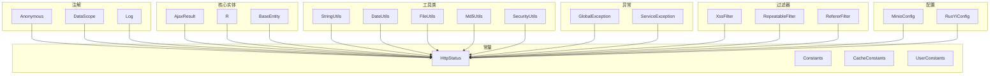
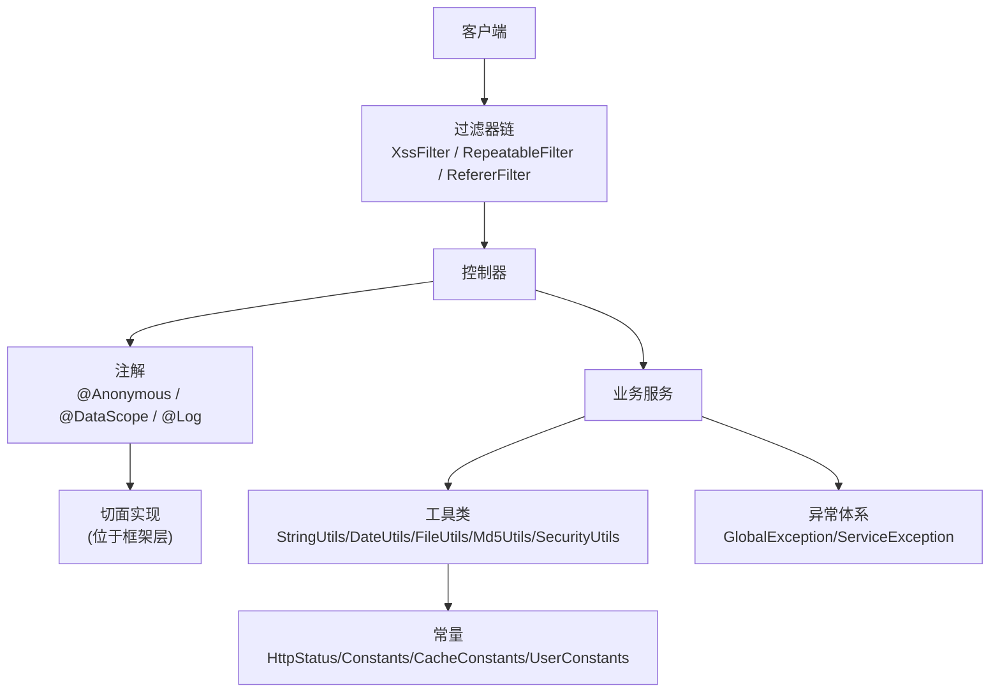
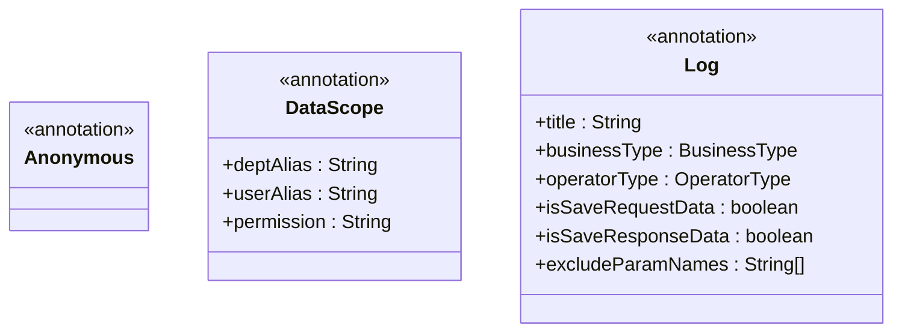
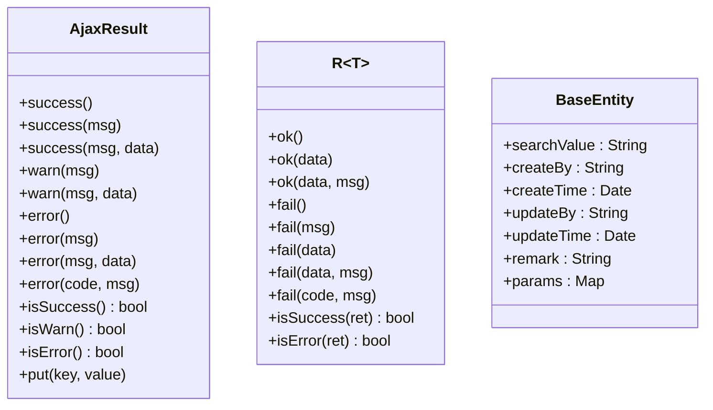
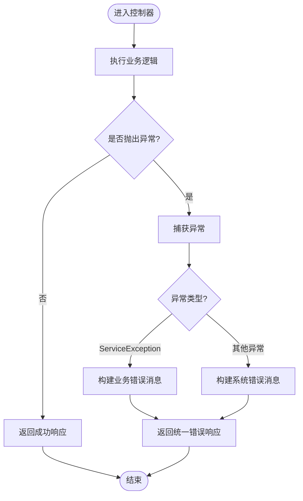
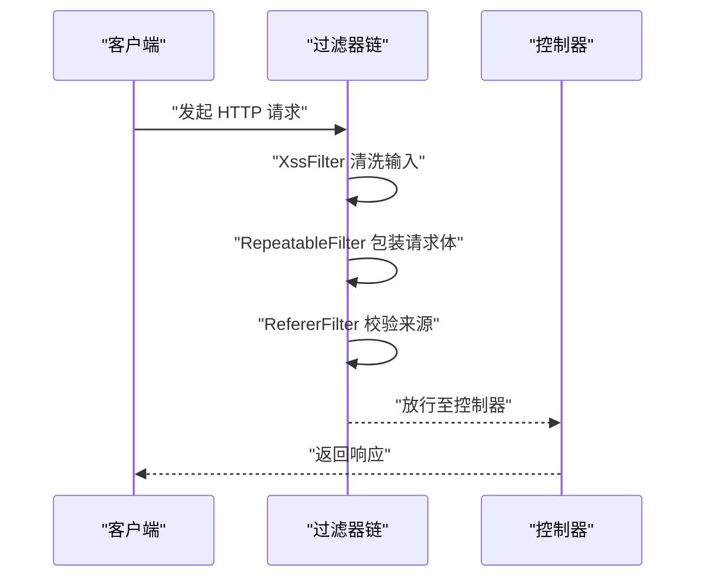
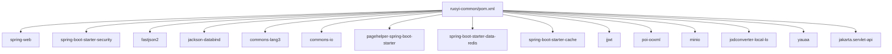

# 通用模块 (ruoyi-common)

<cite>
**本文引用的文件**
- [pom.xml](file://PezMax-Backend/ruoyi-common/pom.xml)
- [Anonymous.java](file://PezMax-Backend/ruoyi-common/src/main/java/com/ruoyi/common/annotation/Anonymous.java)
- [DataScope.java](file://PezMax-Backend/ruoyi-common/src/main/java/com/ruoyi/common/annotation/DataScope.java)
- [Log.java](file://PezMax-Backend/ruoyi-common/src/main/java/com/ruoyi/common/annotation/Log.java)
- [AjaxResult.java](file://PezMax-Backend/ruoyi-common/src/main/java/com/ruoyi/common/core/domain/AjaxResult.java)
- [BaseEntity.java](file://PezMax-Backend/ruoyi-common/src/main/java/com/ruoyi/common/core/domain/BaseEntity.java)
- [R.java](file://PezMax-Backend/ruoyi-common/src/main/java/com/ruoyi/common/core/domain/R.java)
- [HttpStatus.java](file://PezMax-Backend/ruoyi-common/src/main/java/com/ruoyi/common/constant/HttpStatus.java)
- [Constants.java](file://PezMax-Backend/ruoyi-common/src/main/java/com/ruoyi/common/constant/Constants.java)
- [CacheConstants.java](file://PezMax-Backend/ruoyi-common/src/main/java/com/ruoyi/common/constant/CacheConstants.java)
- [UserConstants.java](file://PezMax-Backend/ruoyi-common/src/main/java/com/ruoyi/common/constant/UserConstants.java)
- [StringUtils.java](file://PezMax-Backend/ruoyi-common/src/main/java/com/ruoyi/common/utils/StringUtils.java)
- [DateUtils.java](file://PezMax-Backend/ruoyi-common/src/main/java/com/ruoyi/common/utils/DateUtils.java)
- [FileUtils.java](file://PezMax-Backend/ruoyi-common/src/main/java/com/ruoyi/common/utils/file/FileUtils.java)
- [Md5Utils.java](file://PezMax-Backend/ruoyi-common/src/main/java/com/ruoyi/common/utils/sign/Md5Utils.java)
- [SecurityUtils.java](file://PezMax-Backend/ruoyi-common/src/main/java/com/ruoyi/common/utils/SecurityUtils.java)
- [GlobalException.java](file://PezMax-Backend/ruoyi-common/src/main/java/com/ruoyi/common/exception/GlobalException.java)
- [ServiceException.java](file://PezMax-Backend/ruoyi-common/src/main/java/com/ruoyi/common/exception/ServiceException.java)
- [FilterConfig.java](file://PezMax-Backend/ruoyi-framework/src/main/java/com/ruoyi/framework/config/FilterConfig.java)
- [XssFilter.java](file://PezMax-Backend/ruoyi-common/src/main/java/com/ruoyi/common/filter/XssFilter.java)
- [RepeatableFilter.java](file://PezMax-Backend/ruoyi-common/src/main/java/com/ruoyi/common/filter/RepeatableFilter.java)
- [RefererFilter.java](file://PezMax-Backend/ruoyi-common/src/main/java/com/ruoyi/common/filter/RefererFilter.java)
- [MinioConfig.java](file://PezMax-Backend/ruoyi-common/src/main/java/com/ruoyi/common/config/MinioConfig.java)
- [RuoYiConfig.java](file://PezMax-Backend/ruoyi-common/src/main/java/com/ruoyi/common/config/RuoYiConfig.java)
</cite>

## 目录
1. [简介](#简介)
2. [项目结构](#项目结构)
3. [核心组件](#核心组件)
4. [架构总览](#架构总览)
5. [详细组件分析](#详细组件分析)
6. [依赖分析](#依赖分析)
7. [性能考虑](#性能考虑)
8. [故障排查指南](#故障排查指南)
9. [结论](#结论)
10. [附录](#附录)

## 简介
本章节面向 ruoyi-common 通用模块，系统性梳理其作为系统基础工具库的定位与职责：提供跨模块复用的注解、常量、核心实体、工具类、异常体系以及过滤器等基础设施。该模块不承载业务逻辑，而是为上层框架与业务模块提供稳定、一致的能力支撑，包括统一响应体、操作日志、数据权限、匿名访问、敏感信息脱敏、文件处理、加密签名、安全上下文获取、缓存键常量等。

## 项目结构
ruoyi-common 采用按能力域划分的包结构，主要包含：
- annotation：自定义注解（匿名访问、数据权限、操作日志、限流、重复提交、Excel、敏感字段等）
- constant：全局常量（HTTP 状态码、缓存键、用户相关常量等）
- core：核心领域模型与分页封装（AjaxResult、R、BaseEntity、分页对象等）
- utils：工具类集合（字符串、日期、文件、加密、安全上下文、HTTP、IP、UUID、反射、SQL 工具等）
- exception：异常体系（全局异常、服务异常、文件异常、用户异常等）
- filter：请求过滤链（XSS、可重复读取、Referer 校验等）
- config：配置类（MinIO、应用配置等）
- xss：XSS 校验注解与校验器

图表来源
- [Anonymous.java:1-20](file://PezMax-Backend/ruoyi-common/src/main/java/com/ruoyi/common/annotation/Anonymous.java#L1-L20)
- [DataScope.java:1-34](file://PezMax-Backend/ruoyi-common/src/main/java/com/ruoyi/common/annotation/DataScope.java#L1-L34)
- [Log.java:1-52](file://PezMax-Backend/ruoyi-common/src/main/java/com/ruoyi/common/annotation/Log.java#L1-L52)
- [HttpStatus.java](file://PezMax-Backend/ruoyi-common/src/main/java/com/ruoyi/common/constant/HttpStatus.java)
- [Constants.java](file://PezMax-Backend/ruoyi-common/src/main/java/com/ruoyi/common/constant/Constants.java)
- [CacheConstants.java](file://PezMax-Backend/ruoyi-common/src/main/java/com/ruoyi/common/constant/CacheConstants.java)
- [UserConstants.java](file://PezMax-Backend/ruoyi-common/src/main/java/com/ruoyi/common/constant/UserConstants.java)
- [AjaxResult.java:1-217](file://PezMax-Backend/ruoyi-common/src/main/java/com/ruoyi/common/core/domain/AjaxResult.java#L1-L217)
- [R.java:1-116](file://PezMax-Backend/ruoyi-common/src/main/java/com/ruoyi/common/core/domain/R.java#L1-L116)
- [BaseEntity.java:1-119](file://PezMax-Backend/ruoyi-common/src/main/java/com/ruoyi/common/core/domain/BaseEntity.java#L1-L119)
- [StringUtils.java](file://PezMax-Backend/ruoyi-common/src/main/java/com/ruoyi/common/utils/StringUtils.java)
- [DateUtils.java](file://PezMax-Backend/ruoyi-common/src/main/java/com/ruoyi/common/utils/DateUtils.java)
- [FileUtils.java](file://PezMax-Backend/ruoyi-common/src/main/java/com/ruoyi/common/utils/file/FileUtils.java)
- [Md5Utils.java](file://PezMax-Backend/ruoyi-common/src/main/java/com/ruoyi/common/utils/sign/Md5Utils.java)
- [SecurityUtils.java](file://PezMax-Backend/ruoyi-common/src/main/java/com/ruoyi/common/utils/SecurityUtils.java)
- [GlobalException.java](file://PezMax-Backend/ruoyi-common/src/main/java/com/ruoyi/common/exception/GlobalException.java)
- [ServiceException.java](file://PezMax-Backend/ruoyi-common/src/main/java/com/ruoyi/common/exception/ServiceException.java)
- [XssFilter.java](file://PezMax-Backend/ruoyi-common/src/main/java/com/ruoyi/common/filter/XssFilter.java)
- [RepeatableFilter.java](file://PezMax-Backend/ruoyi-common/src/main/java/com/ruoyi/common/filter/RepeatableFilter.java)
- [RefererFilter.java](file://PezMax-Backend/ruoyi-common/src/main/java/com/ruoyi/common/filter/RefererFilter.java)
- [MinioConfig.java](file://PezMax-Backend/ruoyi-common/src/main/java/com/ruoyi/common/config/MinioConfig.java)
- [RuoYiConfig.java](file://PezMax-Backend/ruoyi-common/src/main/java/com/ruoyi/common/config/RuoYiConfig.java)

章节来源
- [pom.xml:1-136](file://PezMax-Backend/ruoyi-common/pom.xml#L1-L136)

## 核心组件
本节聚焦通用模块中最常被上层复用的三类核心组件：统一响应体、实体基类、常用工具与常量。

- 统一响应体
  - AjaxResult：基于 Map 的轻量响应包装，提供成功/警告/错误静态工厂方法与便捷判等方法，适合传统 MVC 场景。
  - R<T>：泛型响应包装，提供 ok/fail 系列静态方法与 isSuccess/isError 判断，适合 RESTful API 场景。
- 实体基类
  - BaseEntity：提供审计字段（创建者、创建时间、更新者、更新时间）、备注与扩展参数 params，配合 Jackson 注解控制序列化行为。
- 工具与常量
  - StringUtils、DateUtils、FileUtils、Md5Utils、SecurityUtils 等提供高频能力；HttpStatus、Constants、CacheConstants、UserConstants 提供全局常量。

章节来源
- [AjaxResult.java:1-217](file://PezMax-Backend/ruoyi-common/src/main/java/com/ruoyi/common/core/domain/AjaxResult.java#L1-L217)
- [R.java:1-116](file://PezMax-Backend/ruoyi-common/src/main/java/com/ruoyi/common/core/domain/R.java#L1-L116)
- [BaseEntity.java:1-119](file://PezMax-Backend/ruoyi-common/src/main/java/com/ruoyi/common/core/domain/BaseEntity.java#L1-L119)
- [HttpStatus.java](file://PezMax-Backend/ruoyi-common/src/main/java/com/ruoyi/common/constant/HttpStatus.java)
- [Constants.java](file://PezMax-Backend/ruoyi-common/src/main/java/com/ruoyi/common/constant/Constants.java)
- [CacheConstants.java](file://PezMax-Backend/ruoyi-common/src/main/java/com/ruoyi/common/constant/CacheConstants.java)
- [UserConstants.java](file://PezMax-Backend/ruoyi-common/src/main/java/com/ruoyi/common/constant/UserConstants.java)
- [StringUtils.java](file://PezMax-Backend/ruoyi-common/src/main/java/com/ruoyi/common/utils/StringUtils.java)
- [DateUtils.java](file://PezMax-Backend/ruoyi-common/src/main/java/com/ruoyi/common/utils/DateUtils.java)
- [FileUtils.java](file://PezMax-Backend/ruoyi-common/src/main/java/com/ruoyi/common/utils/file/FileUtils.java)
- [Md5Utils.java](file://PezMax-Backend/ruoyi-common/src/main/java/com/ruoyi/common/utils/sign/Md5Utils.java)
- [SecurityUtils.java](file://PezMax-Backend/ruoyi-common/src/main/java/com/ruoyi/common/utils/SecurityUtils.java)

## 架构总览
ruoyi-common 通过“注解 + 切面 + 过滤器 + 工具类 + 异常”的组合，形成横切能力的基础设施层。上层框架（如 ruoyi-framework）在运行时解析注解并织入相应逻辑，过滤器对请求进行前置处理，工具类贯穿各层复用。

图表来源
- [Anonymous.java:1-20](file://PezMax-Backend/ruoyi-common/src/main/java/com/ruoyi/common/annotation/Anonymous.java#L1-L20)
- [DataScope.java:1-34](file://PezMax-Backend/ruoyi-common/src/main/java/com/ruoyi/common/annotation/DataScope.java#L1-L34)
- [Log.java:1-52](file://PezMax-Backend/ruoyi-common/src/main/java/com/ruoyi/common/annotation/Log.java#L1-L52)
- [XssFilter.java](file://PezMax-Backend/ruoyi-common/src/main/java/com/ruoyi/common/filter/XssFilter.java)
- [RepeatableFilter.java](file://PezMax-Backend/ruoyi-common/src/main/java/com/ruoyi/common/filter/RepeatableFilter.java)
- [RefererFilter.java](file://PezMax-Backend/ruoyi-common/src/main/java/com/ruoyi/common/filter/RefererFilter.java)
- [HttpStatus.java](file://PezMax-Backend/ruoyi-common/src/main/java/com/ruoyi/common/constant/HttpStatus.java)
- [Constants.java](file://PezMax-Backend/ruoyi-common/src/main/java/com/ruoyi/common/constant/Constants.java)
- [CacheConstants.java](file://PezMax-Backend/ruoyi-common/src/main/java/com/ruoyi/common/constant/CacheConstants.java)
- [UserConstants.java](file://PezMax-Backend/ruoyi-common/src/main/java/com/ruoyi/common/constant/UserConstants.java)
- [GlobalException.java](file://PezMax-Backend/ruoyi-common/src/main/java/com/ruoyi/common/exception/GlobalException.java)
- [ServiceException.java](file://PezMax-Backend/ruoyi-common/src/main/java/com/ruoyi/common/exception/ServiceException.java)

## 详细组件分析

### 注解体系与使用场景
- @Anonymous：标记接口或方法允许匿名访问，常用于登录、验证码、公开资源等。
- @DataScope：声明数据权限范围，支持部门/用户表别名与权限字符，用于动态拼接 SQL 条件。
- @Log：记录操作日志，支持模块名、业务类型、操作人类型、是否记录请求/响应参数及排除字段。

图表来源
- [Anonymous.java:1-20](file://PezMax-Backend/ruoyi-common/src/main/java/com/ruoyi/common/annotation/Anonymous.java#L1-L20)
- [DataScope.java:1-34](file://PezMax-Backend/ruoyi-common/src/main/java/com/ruoyi/common/annotation/DataScope.java#L1-L34)
- [Log.java:1-52](file://PezMax-Backend/ruoyi-common/src/main/java/com/ruoyi/common/annotation/Log.java#L1-L52)

章节来源
- [Anonymous.java:1-20](file://PezMax-Backend/ruoyi-common/src/main/java/com/ruoyi/common/annotation/Anonymous.java#L1-L20)
- [DataScope.java:1-34](file://PezMax-Backend/ruoyi-common/src/main/java/com/ruoyi/common/annotation/DataScope.java#L1-L34)
- [Log.java:1-52](file://PezMax-Backend/ruoyi-common/src/main/java/com/ruoyi/common/annotation/Log.java#L1-L52)

### 核心实体与响应体
- AjaxResult：适用于传统 MVC 返回，提供 success/warn/error 快捷方法与 is/isWarn/isError 判断。
- R<T>：泛型响应体，适用于 REST 风格，提供 ok/fail 系列方法与 isSuccess/isError 判断。
- BaseEntity：实体基类，提供审计字段与扩展参数，默认忽略 searchValue，params 非空时序列化。

图表来源
- [AjaxResult.java:1-217](file://PezMax-Backend/ruoyi-common/src/main/java/com/ruoyi/common/core/domain/AjaxResult.java#L1-L217)
- [R.java:1-116](file://PezMax-Backend/ruoyi-common/src/main/java/com/ruoyi/common/core/domain/R.java#L1-L116)
- [BaseEntity.java:1-119](file://PezMax-Backend/ruoyi-common/src/main/java/com/ruoyi/common/core/domain/BaseEntity.java#L1-L119)

章节来源
- [AjaxResult.java:1-217](file://PezMax-Backend/ruoyi-common/src/main/java/com/ruoyi/common/core/domain/AjaxResult.java#L1-L217)
- [R.java:1-116](file://PezMax-Backend/ruoyi-common/src/main/java/com/ruoyi/common/core/domain/R.java#L1-L116)
- [BaseEntity.java:1-119](file://PezMax-Backend/ruoyi-common/src/main/java/com/ruoyi/common/core/domain/BaseEntity.java#L1-L119)

### 工具类库概览与典型用法
- 字符串与格式化
  - StringUtils：提供空值判断、去空格、判空、判非空等常用方法。
  - DateUtils：提供日期格式化、时间加减、时间戳转换等。
- 文件与存储
  - FileUtils：文件路径、大小、后缀、MIME 类型判断与常见文件处理。
  - MinioConfig：MinIO 客户端配置（连接地址、桶、凭据等）。
- 加密与安全
  - Md5Utils：MD5 摘要计算。
  - SecurityUtils：从安全上下文中获取当前用户信息。
- 其他
  - HttpUtils/HttpHelper：HTTP 请求辅助。
  - IpUtils/AddressUtils：IP 与地址解析。
  - IdUtils/Seq/UUID：ID 生成。
  - ReflectUtils：反射工具。
  - SqlUtil：SQL 注入防护工具。

最佳实践
- 对外暴露的 API 优先使用 R<T>，内部 MVC 可使用 AjaxResult。
- 实体尽量继承 BaseEntity，便于审计与扩展。
- 敏感信息输出前使用脱敏工具或注解（如 Sensitive），避免明文泄露。
- 文件上传前使用 FileTypeUtils/ImageUtils 校验类型与尺寸，结合常量限制。

章节来源
- [StringUtils.java](file://PezMax-Backend/ruoyi-common/src/main/java/com/ruoyi/common/utils/StringUtils.java)
- [DateUtils.java](file://PezMax-Backend/ruoyi-common/src/main/java/com/ruoyi/common/utils/DateUtils.java)
- [FileUtils.java](file://PezMax-Backend/ruoyi-common/src/main/java/com/ruoyi/common/utils/file/FileUtils.java)
- [Md5Utils.java](file://PezMax-Backend/ruoyi-common/src/main/java/com/ruoyi/common/utils/sign/Md5Utils.java)
- [SecurityUtils.java](file://PezMax-Backend/ruoyi-common/src/main/java/com/ruoyi/common/utils/SecurityUtils.java)
- [MinioConfig.java](file://PezMax-Backend/ruoyi-common/src/main/java/com/ruoyi/common/config/MinioConfig.java)

### 异常处理机制
- GlobalException：全局异常处理器入口，将异常转换为统一响应体。
- ServiceException：业务异常，携带消息与可选状态码，便于上层捕获并返回友好提示。
- 文件/用户/任务等细分异常：针对特定领域提供更精确的错误语义。

图表来源
- [GlobalException.java](file://PezMax-Backend/ruoyi-common/src/main/java/com/ruoyi/common/exception/GlobalException.java)
- [ServiceException.java](file://PezMax-Backend/ruoyi-common/src/main/java/com/ruoyi/common/exception/ServiceException.java)

章节来源
- [GlobalException.java](file://PezMax-Backend/ruoyi-common/src/main/java/com/ruoyi/common/exception/GlobalException.java)
- [ServiceException.java](file://PezMax-Backend/ruoyi-common/src/main/java/com/ruoyi/common/exception/ServiceException.java)

### 过滤器链配置与执行流程
- XssFilter：对请求参数与内容进行 XSS 清洗。
- RepeatableFilter：使请求体可重复读取，便于日志与鉴权拦截。
- RefererFilter：校验 Referer 白名单，防止 CSRF 风险。
- FilterConfig：注册上述过滤器到 Spring 容器。

图表来源
- [FilterConfig.java](file://PezMax-Backend/ruoyi-framework/src/main/java/com/ruoyi/framework/config/FilterConfig.java)
- [XssFilter.java](file://PezMax-Backend/ruoyi-common/src/main/java/com/ruoyi/common/filter/XssFilter.java)
- [RepeatableFilter.java](file://PezMax-Backend/ruoyi-common/src/main/java/com/ruoyi/common/filter/RepeatableFilter.java)
- [RefererFilter.java](file://PezMax-Backend/ruoyi-common/src/main/java/com/ruoyi/common/filter/RefererFilter.java)

章节来源
- [FilterConfig.java](file://PezMax-Backend/ruoyi-framework/src/main/java/com/ruoyi/framework/config/FilterConfig.java)
- [XssFilter.java](file://PezMax-Backend/ruoyi-common/src/main/java/com/ruoyi/common/filter/XssFilter.java)
- [RepeatableFilter.java](file://PezMax-Backend/ruoyi-common/src/main/java/com/ruoyi/common/filter/RepeatableFilter.java)
- [RefererFilter.java](file://PezMax-Backend/ruoyi-common/src/main/java/com/ruoyi/common/filter/RefererFilter.java)

### 权限控制注解的实现原理（概念性说明）
- 匿名访问：@Anonymous 由安全框架或自定义切面识别，匹配到后跳过鉴权。
- 数据权限：@DataScope 由数据权限切面解析 deptAlias/userAlias/permission，结合当前用户角色与部门关系，动态追加 SQL 条件。
- 操作日志：@Log 由日志切面解析 title/businessType/operatorType 等属性，在方法前后采集请求/响应参数并持久化。

注意：具体切面实现在框架层（如 ruoyi-framework 的 aspectj 包），此处仅描述通用模块提供的注解契约。

[本节为概念性说明，未直接分析具体源码文件]

## 依赖分析
ruoyi-common 的 Maven 依赖涵盖 Web、安全、JSON、Redis、POI、JWT、MinIO、JODConverter、yauaa 等，体现其作为通用工具库的广泛集成面。

图表来源
- [pom.xml:1-136](file://PezMax-Backend/ruoyi-common/pom.xml#L1-L136)

章节来源
- [pom.xml:1-136](file://PezMax-Backend/ruoyi-common/pom.xml#L1-L136)

## 性能考虑
- 工具类设计多为无状态静态方法，调用开销低，适合高频使用。
- 文件处理建议结合常量限制大小与类型，避免大文件导致内存压力。
- 日志记录应谨慎开启请求/响应体采集，避免高并发下 IO 成为瓶颈。
- 使用常量集中管理键名与状态码，减少硬编码带来的维护成本与潜在不一致。

[本节提供一般性指导，不涉及具体源码分析]

## 故障排查指南
- 统一响应码问题：检查 HttpStatus 常量定义与 AjaxResult/R 的使用是否一致。
- 日志缺失：确认 @Log 注解是否正确放置，且框架层切面已启用。
- 匿名接口被拦截：确认 @Anonymous 是否标注在目标方法或类上。
- 数据权限无效：核对 @DataScope 的 deptAlias/userAlias/permission 与实际表结构、权限标识是否匹配。
- 过滤器拦截：检查 FilterConfig 中过滤器顺序与白名单配置，必要时临时关闭某过滤器定位问题。
- 异常未捕获：确保 GlobalException 生效，并在业务层抛出 ServiceException 而非 RuntimeException。

章节来源
- [HttpStatus.java](file://PezMax-Backend/ruoyi-common/src/main/java/com/ruoyi/common/constant/HttpStatus.java)
- [Log.java:1-52](file://PezMax-Backend/ruoyi-common/src/main/java/com/ruoyi/common/annotation/Log.java#L1-L52)
- [Anonymous.java:1-20](file://PezMax-Backend/ruoyi-common/src/main/java/com/ruoyi/common/annotation/Anonymous.java#L1-L20)
- [DataScope.java:1-34](file://PezMax-Backend/ruoyi-common/src/main/java/com/ruoyi/common/annotation/DataScope.java#L1-L34)
- [FilterConfig.java](file://PezMax-Backend/ruoyi-framework/src/main/java/com/ruoyi/framework/config/FilterConfig.java)
- [GlobalException.java](file://PezMax-Backend/ruoyi-common/src/main/java/com/ruoyi/common/exception/GlobalException.java)
- [ServiceException.java](file://PezMax-Backend/ruoyi-common/src/main/java/com/ruoyi/common/exception/ServiceException.java)

## 结论
ruoyi-common 以“注解 + 常量 + 实体 + 工具 + 异常 + 过滤器”的模块化设计，为整个系统提供了稳定、可复用的基础设施。通过统一的响应体与异常处理、完善的工具集与过滤器链，显著降低了上层模块的开发复杂度与维护成本。建议在业务模块中优先复用这些通用能力，遵循最佳实践，保持代码一致性与可维护性。

[本节为总结性内容，不涉及具体源码分析]

## 附录
- 如何在其他模块中复用
  - 引入依赖：在业务模块 pom.xml 中引入 ruoyi-common 依赖。
  - 使用统一响应：在控制器返回 R<T> 或 AjaxResult。
  - 使用实体基类：业务实体继承 BaseEntity。
  - 使用工具类：直接调用 StringUtils/DateUtils/FileUtils/Md5Utils/SecurityUtils 等方法。
  - 使用注解：在需要匿名访问的方法加 @Anonymous；在需要数据权限的方法加 @DataScope；在需要记录日志的方法加 @Log。
  - 使用常量：引用 HttpStatus/Constants/CacheConstants/UserConstants 中的常量。
  - 使用过滤器：无需额外配置，框架层已注册；如需调整顺序或白名单，修改 FilterConfig。

[本节为使用指引，不涉及具体源码分析]