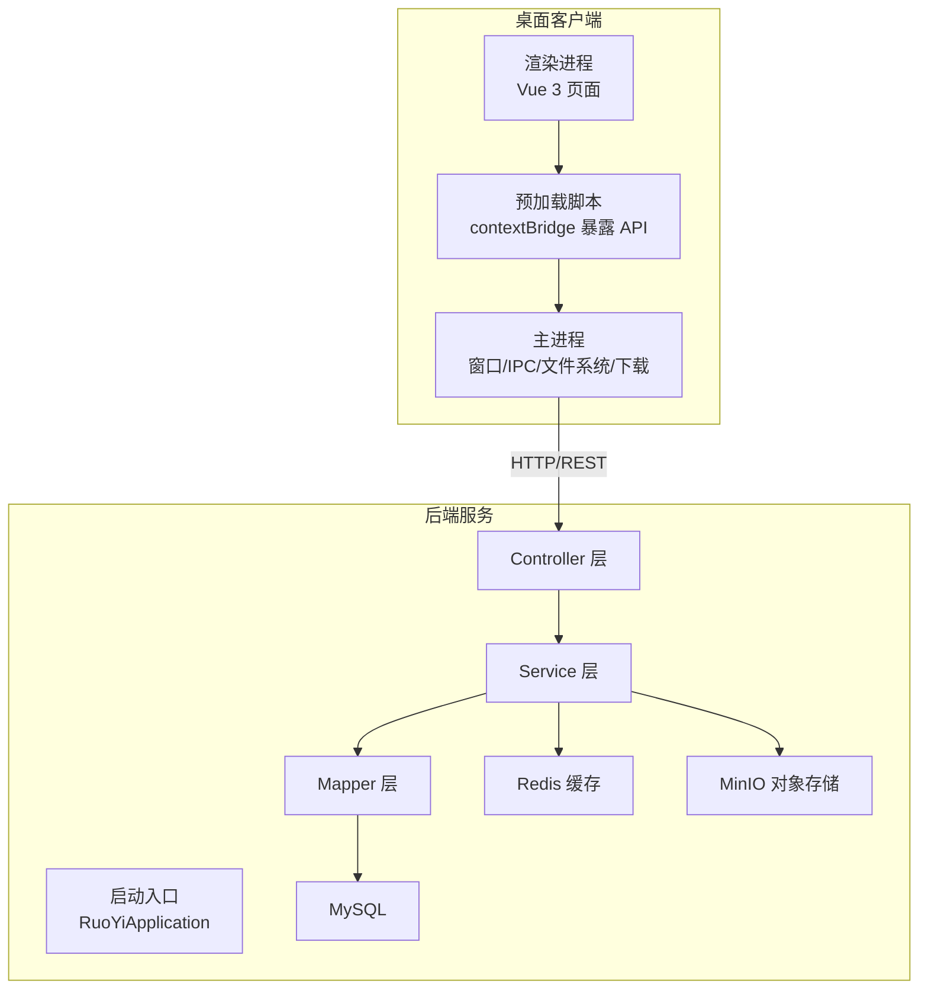
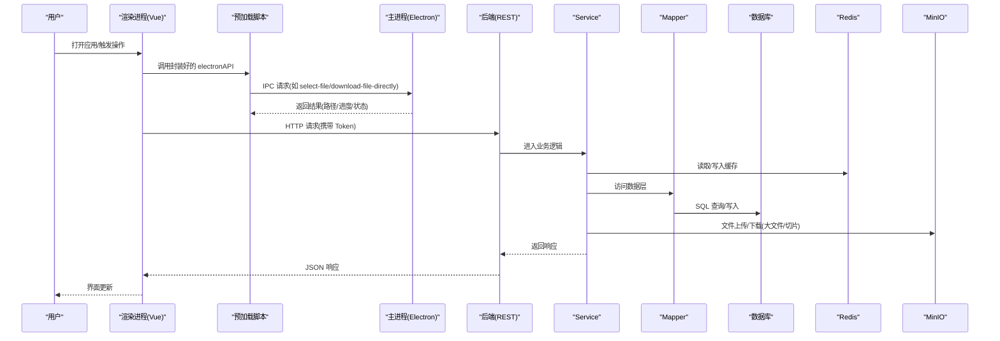
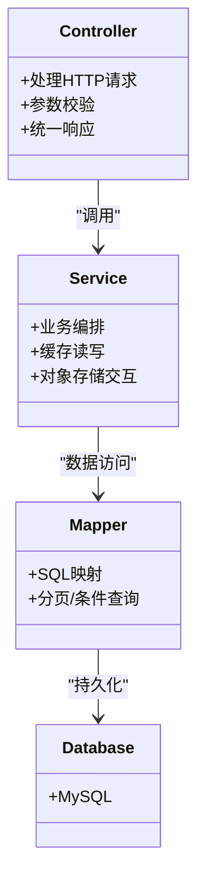
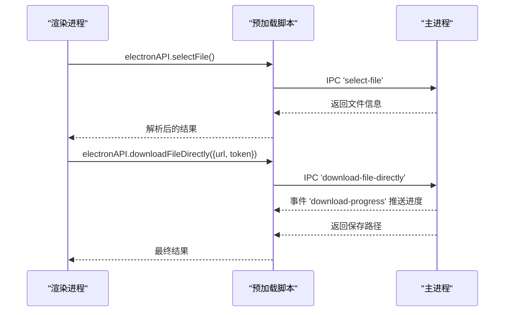
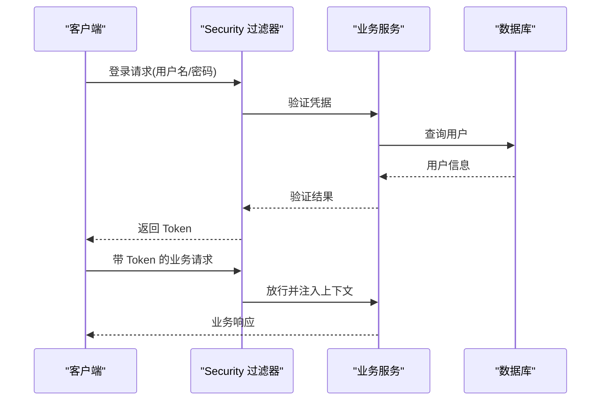
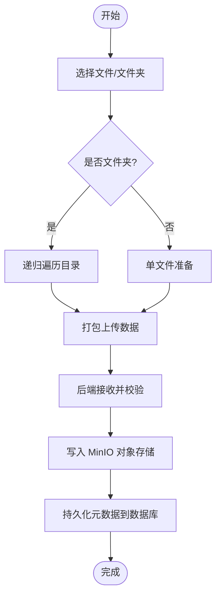
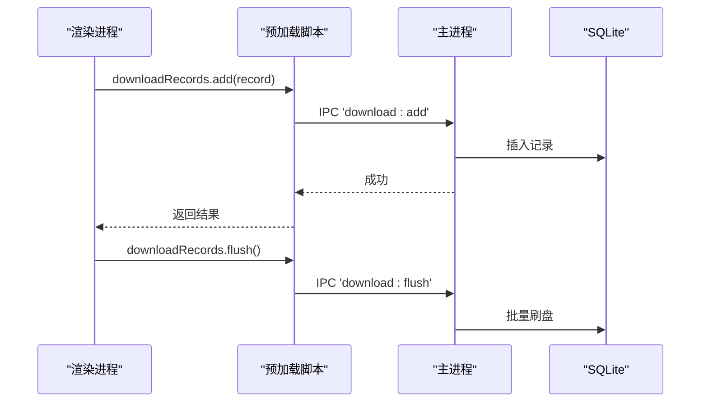
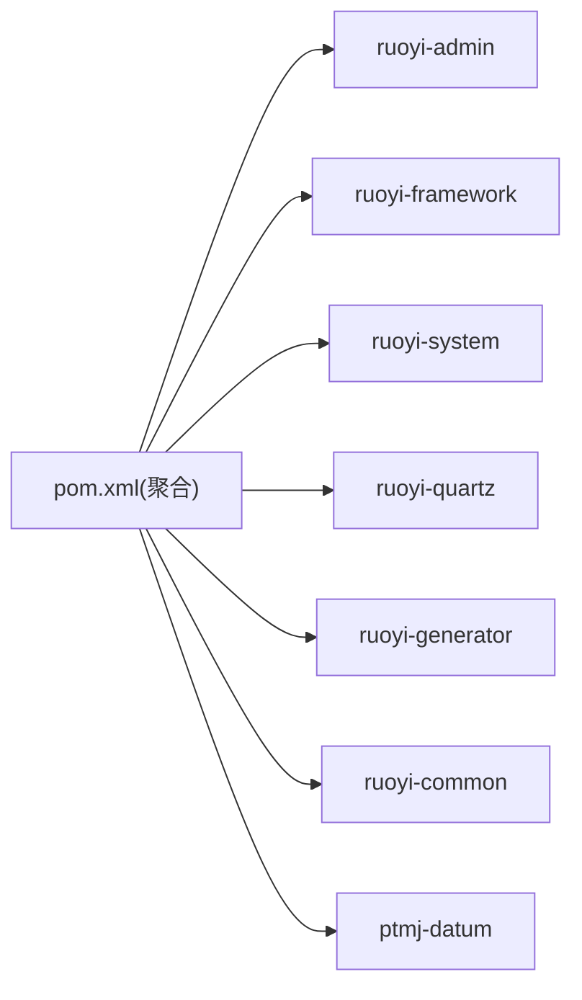

# 系统架构设计

<cite>
**本文引用的文件**   
- [PezMax-Backend/README.md](file://PezMax-Backend/README.md)
- [PezMax-Desktop/README.md](file://PezMax-Desktop/README.md)
- [PezMax-Backend/pom.xml](file://PezMax-Backend/pom.xml)
- [PezMax-Backend/ruoyi-admin/src/main/java/com/ruoyi/RuoYiApplication.java](file://PezMax-Backend/ruoyi-admin/src/main/java/com/ruoyi/RuoYiApplication.java)
- [PezMax-Desktop/package.json](file://PezMax-Desktop/package.json)
- [PezMax-Desktop/src/main/index.js](file://PezMax-Desktop/src/main/index.js)
- [PezMax-Desktop/src/preload/index.js](file://PezMax-Desktop/src/preload/index.js)
</cite>

## 目录
1. [引言](#引言)
2. [项目结构](#项目结构)
3. [核心组件](#核心组件)
4. [架构总览](#架构总览)
5. [详细组件分析](#详细组件分析)
6. [依赖分析](#依赖分析)
7. [性能考虑](#性能考虑)
8. [故障排查指南](#故障排查指南)
9. [结论](#结论)
10. [附录](#附录)

## 引言
本架构文档面向 PezMax-One 系统，覆盖后端微服务化与模块化、桌面应用双进程模型、前后端分离设计，以及 Controller → Service → Mapper → Database 的分层模式。同时说明技术选型依据（Spring Boot 微服务、Electron 桌面框架、Vue 3 前端）、数据流向、API 通信协议、缓存策略、安全认证机制、系统边界、扩展点与性能优化建议。

## 项目结构
整体由两大子系统构成：
- 后端服务（PezMax-Backend）：基于 Spring Boot 的模块化单体（多模块 Maven），提供 REST API、权限与安全、对象存储集成、定时任务、代码生成等能力。
- 桌面客户端（PezMax-Desktop）：基于 Electron + Vue 3，采用主进程/渲染进程双进程模型，通过 IPC 桥接本地能力并调用后端 API。

图表来源
- [PezMax-Backend/ruoyi-admin/src/main/java/com/ruoyi/RuoYiApplication.java:1-33](file://PezMax-Backend/ruoyi-admin/src/main/java/com/ruoyi/RuoYiApplication.java#L1-L33)
- [PezMax-Desktop/src/main/index.js:1-800](file://PezMax-Desktop/src/main/index.js#L1-L800)
- [PezMax-Desktop/src/preload/index.js:1-65](file://PezMax-Desktop/src/preload/index.js#L1-L65)

章节来源
- [PezMax-Backend/README.md:1-105](file://PezMax-Backend/README.md#L1-L105)
- [PezMax-Desktop/README.md:1-110](file://PezMax-Desktop/README.md#L1-L110)

## 核心组件
- 后端启动与扫描
  - 启动类排除默认数据源自动配置，统一使用自定义数据源；组件扫描范围包含业务包 com.ptmj，确保业务模块可被装配。
- 桌面双进程
  - 主进程负责窗口管理、全局快捷键、设置持久化、文件/文件夹选择、本地 SQLite 下载记录、底层直连下载、更新检查与安装、IPC 路由分发。
  - 预加载脚本通过 contextBridge 将受限 API 暴露给渲染进程，保障上下文隔离下的安全通信。
- 前后端通信
  - 渲染进程通过 HTTP 调用后端 REST API；部分需要系统能力的操作走 IPC 到主进程执行。

章节来源
- [PezMax-Backend/ruoyi-admin/src/main/java/com/ruoyi/RuoYiApplication.java:1-33](file://PezMax-Backend/ruoyi-admin/src/main/java/com/ruoyi/RuoYiApplication.java#L1-L33)
- [PezMax-Desktop/src/main/index.js:1-800](file://PezMax-Desktop/src/main/index.js#L1-L800)
- [PezMax-Desktop/src/preload/index.js:1-65](file://PezMax-Desktop/src/preload/index.js#L1-L65)

## 架构总览
下图展示从用户交互到数据存储的端到端流程，包括认证、业务处理、缓存与对象存储。

图表来源
- [PezMax-Desktop/src/main/index.js:293-305](file://PezMax-Desktop/src/main/index.js#L293-L305)
- [PezMax-Desktop/src/main/index.js:528-608](file://PezMax-Desktop/src/main/index.js#L528-L608)
- [PezMax-Desktop/src/preload/index.js:14-56](file://PezMax-Desktop/src/preload/index.js#L14-L56)
- [PezMax-Backend/README.md:31-44](file://PezMax-Backend/README.md#L31-L44)

## 详细组件分析

### 后端分层架构（Controller → Service → Mapper → Database）
- 职责划分
  - Controller：接收 HTTP 请求，参数校验，返回统一响应体。
  - Service：编排业务逻辑，协调缓存、对象存储、外部服务。
  - Mapper：数据访问抽象，映射 SQL 与实体。
  - Database：MySQL 持久化。
- 典型数据流
  - 浏览器/桌面发起 REST 请求 → Spring MVC 控制器 → 业务服务 → 缓存/对象存储 → 数据映射器 → 数据库。
- 关键特性
  - 匿名访问：部分查询接口支持未登录访问。
  - 对象存储：MinIO 用于海量文件存储，支持公开读策略。
  - 缓存：Redis 作为热点数据缓存与分布式会话支撑。
  - 安全：Spring Security + JWT + Redis 实现无状态鉴权与权限控制。

图表来源
- [PezMax-Backend/README.md:13-29](file://PezMax-Backend/README.md#L13-L29)
- [PezMax-Backend/README.md:91-95](file://PezMax-Backend/README.md#L91-L95)

章节来源
- [PezMax-Backend/README.md:13-29](file://PezMax-Backend/README.md#L13-L29)
- [PezMax-Backend/README.md:91-95](file://PezMax-Backend/README.md#L91-L95)

### 桌面双进程模型（主进程 ↔ 渲染进程）
- 主进程职责
  - 窗口生命周期与尺寸策略（认证页固定尺寸、主页自适应）。
  - 全局快捷键、开机自启、主题与背景设置持久化。
  - 文件/文件夹选择、拖拽读取、批量上传取消。
  - 本地下载记录（SQLite）增删查与批量刷盘。
  - 底层直连下载（net 模块），支持进度回调与错误清理。
  - 自动更新（检查/下载/安装）与更新源配置。
- 预加载脚本职责
  - 通过 contextBridge 暴露最小必要 API，保持上下文隔离。
  - 将 IPC 通道封装为 Promise 风格方法，供渲染进程调用。
- 渲染进程职责
  - 业务 UI 与状态管理，发起网络请求与本地能力调用。

图表来源
- [PezMax-Desktop/src/preload/index.js:14-56](file://PezMax-Desktop/src/preload/index.js#L14-L56)
- [PezMax-Desktop/src/main/index.js:293-305](file://PezMax-Desktop/src/main/index.js#L293-L305)
- [PezMax-Desktop/src/main/index.js:528-608](file://PezMax-Desktop/src/main/index.js#L528-L608)

章节来源
- [PezMax-Desktop/src/main/index.js:1-800](file://PezMax-Desktop/src/main/index.js#L1-L800)
- [PezMax-Desktop/src/preload/index.js:1-65](file://PezMax-Desktop/src/preload/index.js#L1-L65)

### 认证与安全流程（JWT + Spring Security）
- 客户端在登录后获取 Token，后续请求携带 Authorization 头。
- 后端通过 Spring Security 过滤器链进行令牌校验与权限判定。
- 部分接口标注匿名访问，允许未登录浏览资源列表等。

图表来源
- [PezMax-Backend/README.md:17-21](file://PezMax-Backend/README.md#L17-L21)
- [PezMax-Backend/README.md:91-95](file://PezMax-Backend/README.md#L91-L95)

章节来源
- [PezMax-Backend/README.md:17-21](file://PezMax-Backend/README.md#L17-L21)
- [PezMax-Backend/README.md:91-95](file://PezMax-Backend/README.md#L91-L95)

### 文件与书签业务流程
- 文件上传
  - 渲染进程选择文件或文件夹，主进程递归遍历目录并打包上传。
  - 后端接收后落盘至 MinIO，并记录元数据到数据库。
- 文件下载
  - 渲染进程发起下载，主进程通过 net 模块直连后端或对象存储，边下边写磁盘，支持进度上报。
- 书签管理
  - 支持封面图直传 MinIO，URL 自动修复（内部地址转公网可达地址）。

图表来源
- [PezMax-Desktop/src/main/index.js:716-777](file://PezMax-Desktop/src/main/index.js#L716-L777)
- [PezMax-Backend/README.md:23-29](file://PezMax-Backend/README.md#L23-L29)

章节来源
- [PezMax-Desktop/src/main/index.js:716-777](file://PezMax-Desktop/src/main/index.js#L716-L777)
- [PezMax-Backend/README.md:23-29](file://PezMax-Backend/README.md#L23-L29)

### 本地下载记录（SQLite）
- 主进程维护本地 SQLite 数据库，记录下载历史、本地路径、存在性检查与批量刷盘。
- 渲染进程通过 IPC 调用 list/add/delete/flush/check-files 等方法。

图表来源
- [PezMax-Desktop/src/main/index.js:435-478](file://PezMax-Desktop/src/main/index.js#L435-L478)
- [PezMax-Desktop/src/preload/index.js:49-56](file://PezMax-Desktop/src/preload/index.js#L49-L56)

章节来源
- [PezMax-Desktop/src/main/index.js:435-478](file://PezMax-Desktop/src/main/index.js#L435-L478)
- [PezMax-Desktop/src/preload/index.js:49-56](file://PezMax-Desktop/src/preload/index.js#L49-L56)

## 依赖分析
- 后端模块依赖（Maven 多模块）
  - 顶层聚合模块声明子模块：ruoyi-admin、ruoyi-framework、ruoyi-system、ruoyi-quartz、ruoyi-generator、ruoyi-common、ptmj-datum。
  - 版本管理与依赖集中声明，便于统一升级。
- 桌面端依赖（Node/Electron）
  - 构建与打包：electron-vite、electron-builder。
  - 运行时：Vue 3、Element Plus、Pinia、Axios、electron-updater 等。

图表来源
- [PezMax-Backend/pom.xml:177-185](file://PezMax-Backend/pom.xml#L177-L185)

章节来源
- [PezMax-Backend/pom.xml:1-234](file://PezMax-Backend/pom.xml#L1-L234)
- [PezMax-Desktop/package.json:1-78](file://PezMax-Desktop/package.json#L1-L78)

## 性能考虑
- 后端
  - 连接池：Druid 提升数据库连接复用与监控能力。
  - 缓存：Redis 承载热点数据与分布式会话，降低数据库压力。
  - 对象存储：MinIO 支持高吞吐文件存取，适合大文件与切片场景。
  - 异步与限流：结合注解与切面实现日志、限流、重复提交拦截等横切关注点。
- 桌面端
  - 直连下载：主进程 net 模块流式写入磁盘，避免内存峰值。
  - 批量刷盘：下载记录批量 flush，减少 I/O 次数。
  - 按需加载：生产环境环境变量驱动功能开关，缩短首屏时间。
  - 窗口模式：认证页固定尺寸减少重排，提升交互稳定性。

[本节为通用指导，不直接分析具体文件]

## 故障排查指南
- 后端
  - 启动失败：检查数据源配置与端口占用；确认 MySQL、Redis、MinIO 容器可用。
  - 权限异常：核对 JWT 配置与白名单接口；确认 @Anonymous 使用位置。
  - 文件问题：确认 MinIO 桶策略为公开读；检查上传大小限制与类型白名单。
- 桌面端
  - 无法选择文件/文件夹：确认主进程对话框权限与路径可读性。
  - 下载失败：检查网络连通性与 Token 有效性；查看主进程错误日志与临时文件清理情况。
  - 更新失败：核对更新源配置与签名校验；必要时切换更新源。

章节来源
- [PezMax-Backend/README.md:45-74](file://PezMax-Backend/README.md#L45-L74)
- [PezMax-Backend/README.md:91-95](file://PezMax-Backend/README.md#L91-L95)
- [PezMax-Desktop/src/main/index.js:528-608](file://PezMax-Desktop/src/main/index.js#L528-L608)

## 结论
PezMax-One 采用“后端模块化单体 + 桌面双进程”的组合架构，既具备企业级后端的高内聚低耦合与可扩展性，又发挥 Electron 在桌面端的原生能力优势。通过 Controller → Service → Mapper → Database 的分层模式、JWT 安全体系、Redis 缓存与 MinIO 对象存储，系统在性能、可靠性与可维护性方面达到良好平衡。未来可在网关层引入 API 网关与服务发现，逐步演进为真正的微服务集群。

## 附录
- 技术选型依据
  - Spring Boot：成熟生态、快速开发、云原生友好。
  - Electron + Vue 3：跨平台桌面体验与现代化前端工程化。
  - MyBatis + Druid：灵活 SQL 与高性能连接池。
  - Redis：高性能缓存与会话共享。
  - MinIO：兼容 S3 的对象存储，适合海量文件场景。
- 系统边界
  - 后端边界：对外暴露 REST API，内部通过模块划分职责。
  - 桌面边界：仅暴露最小 API 集，所有系统能力经主进程代理。
- 扩展点
  - 新增业务模块：在 ptmj-datum 中按 Controller/Service/Mapper 分层扩展。
  - 新增桌面能力：在主进程注册 IPC 处理器，并在预加载脚本中暴露。
  - 新增存储介质：通过 Service 层适配不同存储后端。