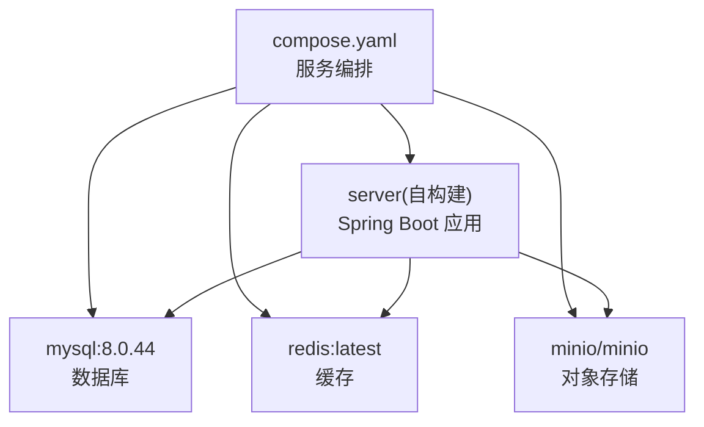
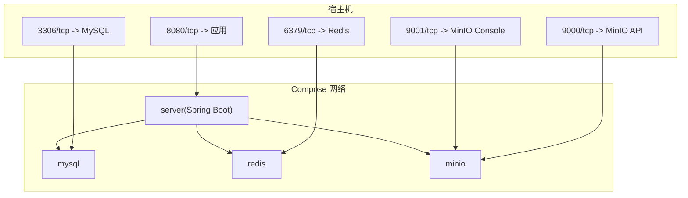
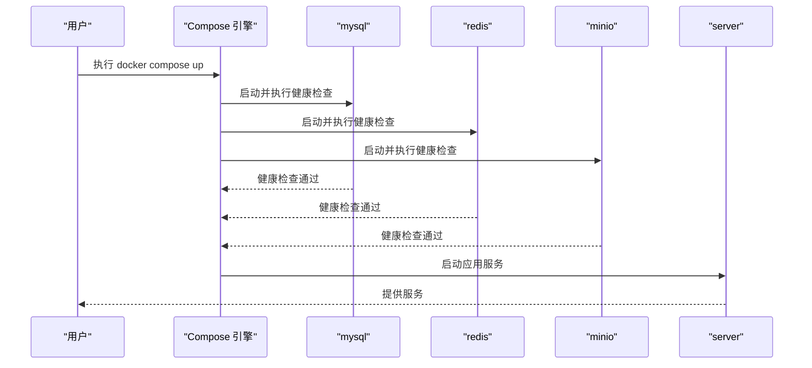
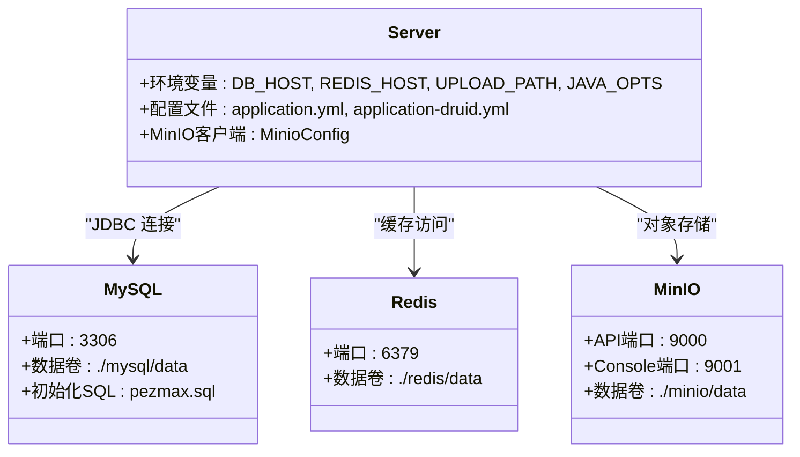

# Docker Compose 服务编排

<cite>
**本文引用的文件**
- [compose.yaml](file://PezMax-Backend/compose.yaml)
- [Dockerfile](file://PezMax-Backend/Dockerfile)
- [application.yml](file://PezMax-Backend/ruoyi-admin/src/main/resources/application.yml)
- [application-druid.yml](file://PezMax-Backend/ruoyi-admin/src/main/resources/application-druid.yml)
- [MinioConfig.java](file://PezMax-Backend/ruoyi-common/src/main/java/com/ruoyi/common/config/MinioConfig.java)
- [RedisConfig.java](file://PezMax-Backend/ruoyi-framework/src/main/java/com/ruoyi/framework/config/RedisConfig.java)
- [DruidConfig.java](file://PezMax-Backend/ruoyi-framework/src/main/java/com/ruoyi/framework/config/DruidConfig.java)
- [minio-public-policy.json](file://PezMax-Backend/ptmj-datum/src/main/resources/minio-public-policy.json)
</cite>

## 目录
1. [简介](#简介)
2. [项目结构](#项目结构)
3. [核心组件](#核心组件)
4. [架构总览](#架构总览)
5. [详细组件分析](#详细组件分析)
6. [依赖关系分析](#依赖关系分析)
7. [性能与资源限制](#性能与资源限制)
8. [故障排查指南](#故障排查指南)
9. [结论](#结论)
10. [附录](#附录)

## 简介
本文件面向使用 Docker Compose 部署 PezMax 后端服务的工程师与运维人员，围绕 compose.yaml 展开，系统解析后端应用、MySQL、Redis、MinIO 等容器的网络与服务依赖、环境变量传递机制、数据持久化策略、端口映射与健康检查、启动顺序控制以及高级编排特性。文档同时结合 Spring Boot 配置与 Java 配置类，说明敏感信息的安全管理建议与最佳实践。

## 项目结构
本项目采用多模块 Maven 工程，后端以 Spring Boot 构建，通过 Dockerfile 进行镜像构建，并通过 compose.yaml 统一编排容器服务。关键位置如下：
- 编排定义：PezMax-Backend/compose.yaml
- 应用镜像构建：PezMax-Backend/Dockerfile
- 应用配置：PezMax-Backend/ruoyi-admin/src/main/resources/application*.yml
- MinIO 客户端配置：PezMax-Backend/ruoyi-common/src/main/java/com/ruoyi/common/config/MinioConfig.java
- Redis 配置：PezMax-Backend/ruoyi-framework/src/main/java/com/ruoyi/framework/config/RedisConfig.java
- 数据源与连接池：PezMax-Backend/ruoyi-framework/src/main/java/com/ruoyi/framework/config/DruidConfig.java
- MinIO 公开策略模板：PezMax-Backend/ptmj-datum/src/main/resources/minio-public-policy.json

图表来源
- [compose.yaml:1-84](file://PezMax-Backend/compose.yaml#L1-L84)

章节来源
- [compose.yaml:1-84](file://PezMax-Backend/compose.yaml#L1-L84)
- [Dockerfile:1-114](file://PezMax-Backend/Dockerfile#L1-L114)

## 核心组件
- MySQL 服务：提供关系型数据存储，包含初始化 SQL 脚本挂载与数据卷持久化。
- Redis 服务：提供缓存与会话能力，启用数据持久化卷。
- MinIO 服务：提供 S3 兼容的对象存储，暴露 API 与控制台端口，健康检查基于内部端点。
- 后端应用服务：基于 Spring Boot，依赖上述三个中间件，通过环境变量注入连接参数，并挂载日志与上传目录。

章节来源
- [compose.yaml:1-84](file://PezMax-Backend/compose.yaml#L1-L84)

## 架构总览
下图展示了 Compose 中各服务的交互关系、网络通信方式与外部端口映射。

图表来源
- [compose.yaml:1-84](file://PezMax-Backend/compose.yaml#L1-L84)

## 详细组件分析

### 服务与网络配置
- 服务清单
  - mysql：镜像版本固定，设置数据库名与 root 密码，映射 3306 端口，挂载数据卷与初始化 SQL。
  - redis：使用最新镜像，映射 6379 端口，挂载数据卷。
  - minio：使用官方镜像，设置根用户与密码，映射 9000/9001 端口，挂载数据卷，指定控制台地址。
  - server：从本地 Dockerfile 构建，映射 8080 端口，通过环境变量注入运行期配置，挂载日志与上传目录。
- 网络模型
  - Compose 默认创建共享网络，服务间通过服务名（如 mysql、redis、minio）进行 DNS 解析与通信。
  - 应用侧通过环境变量 DB_HOST、REDIS_HOST、MINIO_URL 等指向对应服务名。
- 端口映射
  - 仅对外暴露必要端口：8080（应用）、3306（MySQL）、6379（Redis）、9000/9001（MinIO）。生产环境建议关闭不必要的对外暴露或配合反向代理与访问控制。

章节来源
- [compose.yaml:1-84](file://PezMax-Backend/compose.yaml#L1-L84)

### 服务依赖与启动顺序
- 依赖声明
  - server 显式 depends_on 依赖 mysql、redis、minio，且条件为 service_healthy，确保中间件健康后再启动应用。
- 健康检查
  - mysql：使用 mysqladmin ping 探测。
  - redis：使用 redis-cli ping 探测。
  - minio：使用 curl 访问 /minio/health/live 探测。
- 启动顺序
  - Compose 会先拉起中间件，等待其健康检查通过后，再启动 server。

图表来源
- [compose.yaml:1-84](file://PezMax-Backend/compose.yaml#L1-L84)

章节来源
- [compose.yaml:1-84](file://PezMax-Backend/compose.yaml#L1-L84)

### 环境变量传递机制与安全
- 环境变量注入
  - server 服务通过 environment 注入以下变量：
    - SPRING_PROFILES_ACTIVE=druid
    - DB_HOST=mysql
    - REDIS_HOST=redis
    - UPLOAD_PATH=/home/ruoyi/uploadPath
    - JAVA_OPTS=-Xms512m -Xmx1024m
- 应用读取方式
  - application.yml 中使用 ${ENV:default} 语法读取环境变量，例如：
    - spring.data.redis.host=${REDIS_HOST:localhost}
    - ruoyi.profile=${UPLOAD_PATH:/home/ruoyi/uploadPath}
  - application-druid.yml 中通过 ${DB_HOST:localhost} 动态拼接 JDBC URL。
  - MinIO 客户端配置类 MinioConfig 通过 @Value 读取 minio.url、minio.accessKey、minio.secretKey。
- 安全建议
  - 当前 compose.yaml 将数据库与 MinIO 的密钥以明文形式写入配置，存在泄露风险。建议：
    - 使用 .env 文件并在 .gitignore 中排除；或在 CI/CD 中注入 Secret。
    - 在 Compose 中使用 secrets 或外部密钥管理服务（如 Vault、KMS）。
    - 对 MinIO 控制台与 API 端口实施访问控制与 TLS 加密。
    - 最小权限原则：为应用分配专用账号与桶策略，避免使用 root/admin 账户直连。

章节来源
- [compose.yaml:1-84](file://PezMax-Backend/compose.yaml#L1-L84)
- [application.yml:1-162](file://PezMax-Backend/ruoyi-admin/src/main/resources/application.yml#L1-L162)
- [application-druid.yml:1-62](file://PezMax-Backend/ruoyi-admin/src/main/resources/application-druid.yml#L1-L62)
- [MinioConfig.java:1-28](file://PezMax-Backend/ruoyi-common/src/main/java/com/ruoyi/common/config/MinioConfig.java#L1-L28)

### 数据持久化与卷挂载
- MySQL
  - 数据目录：./mysql/data:/var/lib/mysql
  - 初始化脚本：./sql/pezmax.sql 挂载到 /docker-entrypoint-initdb.d/，容器首次启动自动执行。
- Redis
  - 数据目录：./redis/data:/data
- MinIO
  - 数据目录：./minio/data:/data
- 应用
  - 日志目录：./logs:/home/ruoyi/logs
  - 上传目录：./uploadPath:/home/ruoyi/uploadPath
- 注意
  - 宿主机目录需具备相应读写权限。
  - 若使用命名卷而非绑定挂载，可在 volumes 段声明并使用，便于跨主机迁移。

章节来源
- [compose.yaml:1-84](file://PezMax-Backend/compose.yaml#L1-L84)

### 容器间通信与端口映射
- 通信方式
  - 应用通过服务名访问中间件：
    - DB_HOST=mysql
    - REDIS_HOST=redis
    - MinIO 客户端 endpoint 使用 http://minio:9000（由配置项 minio.url 决定）
- 端口映射
  - 8080：应用 HTTP 服务
  - 3306：MySQL
  - 6379：Redis
  - 9000：MinIO API
  - 9001：MinIO Console

章节来源
- [compose.yaml:1-84](file://PezMax-Backend/compose.yaml#L1-L84)
- [application.yml:1-162](file://PezMax-Backend/ruoyi-admin/src/main/resources/application.yml#L1-162)
- [application-druid.yml:1-62](file://PezMax-Backend/ruoyi-admin/src/main/resources/application-druid.yml#L1-62)
- [MinioConfig.java:1-28](file://PezMax-Backend/ruoyi-common/src/main/java/com/ruoyi/common/config/MinioConfig.java#L1-28)

### 健康检查与故障恢复
- 健康检查
  - mysql：mysqladmin ping
  - redis：redis-cli ping
  - minio：curl -f http://localhost:9000/minio/health/live
- 重启策略
  - 所有服务均设置 restart: always，保证异常退出后自动重启。
- 启动依赖
  - server 依赖中间件健康状态，避免“启动过快”导致连接失败。

章节来源
- [compose.yaml:1-84](file://PezMax-Backend/compose.yaml#L1-L84)

### 应用构建与运行细节
- 构建阶段
  - 使用多阶段构建：依赖下载、打包、分层提取、最终运行镜像。
  - 安装 LibreOffice 与中文字体，支持文档转换。
  - 以非特权用户运行，提升安全性。
- 运行入口
  - ENTRYPOINT 使用 Spring Boot Loader 启动。
  - EXPOSE 8080，供 Compose 映射。

章节来源
- [Dockerfile:1-114](file://PezMax-Backend/Dockerfile#L1-L114)

### MinIO 策略与访问控制
- 公开策略模板
  - 提供 minio-public-policy.json 作为桶策略模板，允许匿名读取对象与获取桶位置。
- 建议
  - 在生产环境中按需调整策略，避免无差别公开。
  - 结合 CDN 或私有域名访问，开启 HTTPS。

章节来源
- [minio-public-policy.json:1-17](file://PezMax-Backend/ptmj-datum/src/main/resources/minio-public-policy.json#L1-L17)

## 依赖关系分析
- 运行时依赖
  - server 依赖 mysql、redis、minio，通过 Compose 网络与服务名通信。
- 配置依赖
  - application.yml 与 application-druid.yml 通过环境变量注入连接参数。
  - MinioConfig 通过 @Value 注入 MinIO 客户端参数。
- 构建依赖
  - server 镜像构建依赖本地源码与 Maven 依赖缓存。

图表来源
- [compose.yaml:1-84](file://PezMax-Backend/compose.yaml#L1-L84)
- [application.yml:1-162](file://PezMax-Backend/ruoyi-admin/src/main/resources/application.yml#L1-162)
- [application-druid.yml:1-62](file://PezMax-Backend/ruoyi-admin/src/main/resources/application-druid.yml#L1-62)
- [MinioConfig.java:1-28](file://PezMax-Backend/ruoyi-common/src/main/java/com/ruoyi/common/config/MinioConfig.java#L1-28)

章节来源
- [compose.yaml:1-84](file://PezMax-Backend/compose.yaml#L1-L84)
- [application.yml:1-162](file://PezMax-Backend/ruoyi-admin/src/main/resources/application.yml#L1-162)
- [application-druid.yml:1-62](file://PezMax-Backend/ruoyi-admin/src/main/resources/application-druid.yml#L1-62)
- [MinioConfig.java:1-28](file://PezMax-Backend/ruoyi-common/src/main/java/com/ruoyi/common/config/MinioConfig.java#L1-28)

## 性能与资源限制
- JVM 内存
  - 通过 JAVA_OPTS 设置堆大小（-Xms/-Xmx），可根据容器与宿主资源调整。
- Tomcat 线程
  - application.yml 中配置了最大线程数与队列长度，可按负载调优。
- 连接池
  - Druid 连接池参数（初始连接、最大连接、超时等）已在 application-druid.yml 中配置，建议根据并发量与数据库容量评估。
- 资源限制（推荐）
  - 建议在 Compose 中为每个服务添加 deploy.resources.limits 与 reservations，防止单服务占用过多资源影响整体稳定性。
- 缓存与序列化
  - RedisTemplate 使用自定义序列化器，注意键值大小与过期策略，避免热点键与内存膨胀。

章节来源
- [compose.yaml:1-84](file://PezMax-Backend/compose.yaml#L1-L84)
- [application.yml:1-162](file://PezMax-Backend/ruoyi-admin/src/main/resources/application.yml#L1-162)
- [application-druid.yml:1-62](file://PezMax-Backend/ruoyi-admin/src/main/resources/application-druid.yml#L1-62)
- [RedisConfig.java:1-71](file://PezMax-Backend/ruoyi-framework/src/main/java/com/ruoyi/framework/config/RedisConfig.java#L1-71)

## 故障排查指南
- 应用无法连接数据库
  - 检查 DB_HOST 是否指向 mysql，端口 3306 是否可达，root 密码是否正确。
  - 查看 MySQL 健康检查日志与初始化 SQL 是否成功执行。
- 应用无法连接 Redis
  - 检查 REDIS_HOST 是否为 redis，端口 6379 是否可达。
  - 确认 Redis 健康检查通过。
- MinIO 访问失败
  - 检查 minio.url、accessKey、secretKey 是否与 compose 中一致。
  - 确认 9000/9001 端口可访问，健康检查返回正常。
- 日志与上传目录
  - 确认宿主机 ./logs 与 ./uploadPath 目录存在且有写权限。
- 启动顺序问题
  - 观察 Compose 输出，确认中间件健康检查通过后 server 才启动。

章节来源
- [compose.yaml:1-84](file://PezMax-Backend/compose.yaml#L1-L84)
- [application.yml:1-162](file://PezMax-Backend/ruoyi-admin/src/main/resources/application.yml#L1-162)
- [application-druid.yml:1-62](file://PezMax-Backend/ruoyi-admin/src/main/resources/application-druid.yml#L1-62)
- [MinioConfig.java:1-28](file://PezMax-Backend/ruoyi-common/src/main/java/com/ruoyi/common/config/MinioConfig.java#L1-28)

## 结论
本编排方案通过 Compose 统一管理后端应用与三大中间件，利用健康检查与依赖声明保障启动顺序与可用性，结合环境变量实现灵活配置。当前配置适合开发与测试环境，生产环境应强化敏感信息管理、资源限制与网络安全策略，以提升系统的稳定性与安全性。

## 附录
- 相关配置类与文件路径
  - 数据源配置：[DruidConfig.java](file://PezMax-Backend/ruoyi-framework/src/main/java/com/ruoyi/framework/config/DruidConfig.java)
  - Redis 配置：[RedisConfig.java](file://PezMax-Backend/ruoyi-framework/src/main/java/com/ruoyi/framework/config/RedisConfig.java)
  - MinIO 客户端配置：[MinioConfig.java](file://PezMax-Backend/ruoyi-common/src/main/java/com/ruoyi/common/config/MinioConfig.java)
  - 应用主配置：[application.yml](file://PezMax-Backend/ruoyi-admin/src/main/resources/application.yml)
  - 数据源扩展配置：[application-druid.yml](file://PezMax-Backend/ruoyi-admin/src/main/resources/application-druid.yml)
  - 编排定义：[compose.yaml](file://PezMax-Backend/compose.yaml)
  - 镜像构建：[Dockerfile](file://PezMax-Backend/Dockerfile)
  - MinIO 策略模板：[minio-public-policy.json](file://PezMax-Backend/ptmj-datum/src/main/resources/minio-public-policy.json)