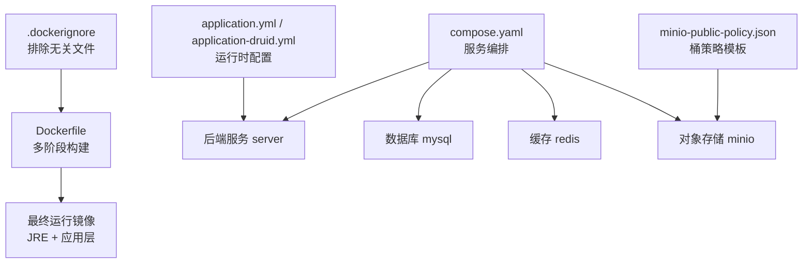
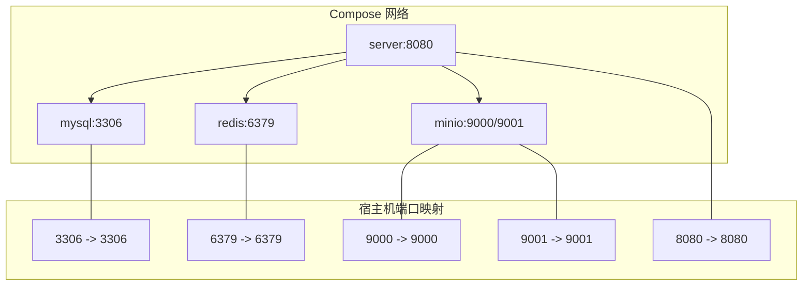
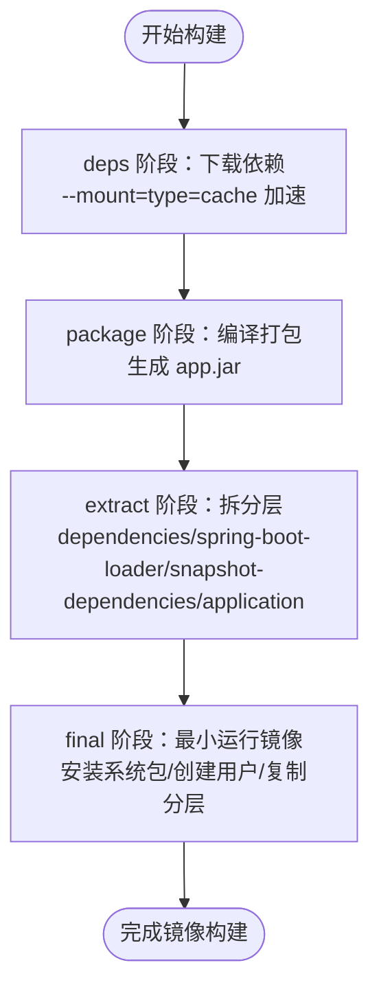
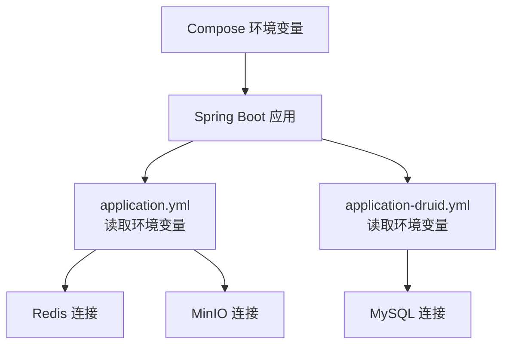
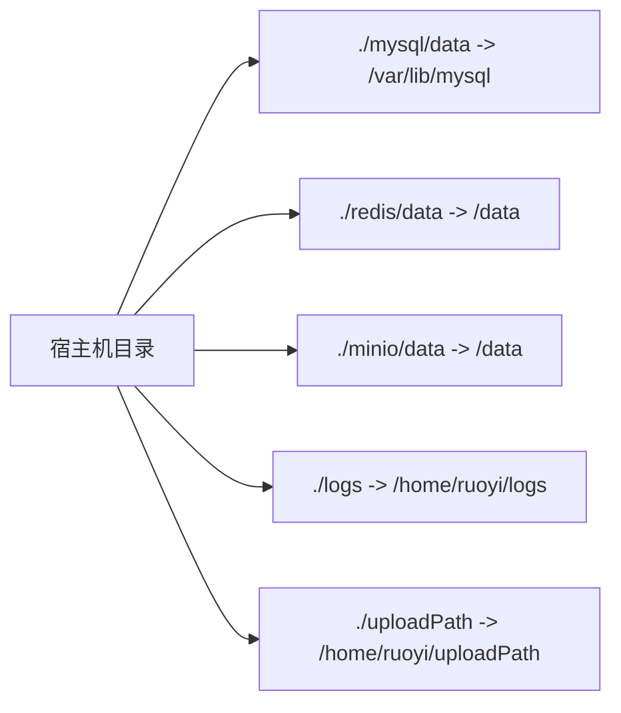
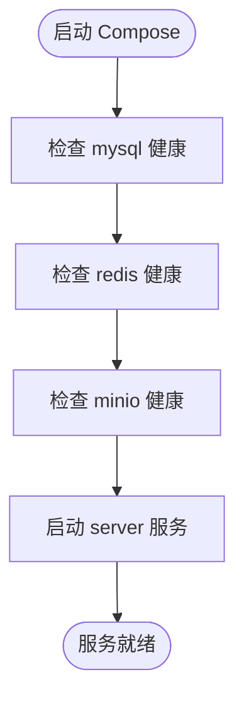
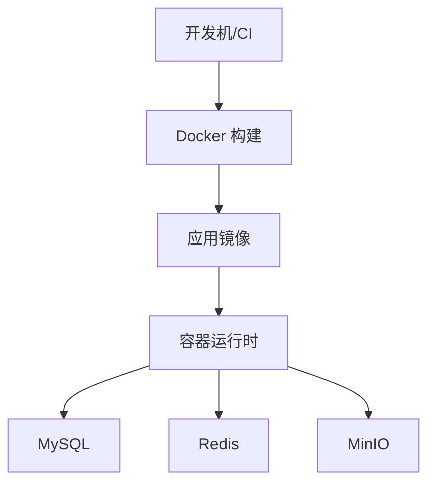

# Docker 容器化部署

<cite>
**本文引用的文件**
- [Dockerfile](file://PezMax-Backend/Dockerfile)
- [compose.yaml](file://PezMax-Backend/compose.yaml)
- [.dockerignore](file://PezMax-Backend/.dockerignore)
- [application.yml](file://PezMax-Backend/ruoyi-admin/src/main/resources/application.yml)
- [application-druid.yml](file://PezMax-Backend/ruoyi-admin/src/main/resources/application-druid.yml)
- [README.Docker.md](file://PezMax-Backend/README.Docker.md)
- [minio-public-policy.json](file://PezMax-Backend/ptmj-datum/src/main/resources/minio-public-policy.json)
</cite>

## 目录
1. [简介](#简介)
2. [项目结构](#项目结构)
3. [核心组件](#核心组件)
4. [架构总览](#架构总览)
5. [详细组件分析](#详细组件分析)
6. [依赖关系分析](#依赖关系分析)
7. [性能与构建优化](#性能与构建优化)
8. [故障排查指南](#故障排查指南)
9. [生产环境最佳实践与安全加固](#生产环境最佳实践与安全加固)
10. [结论](#结论)

## 简介
本文件面向后端服务（Java/Spring Boot）的容器化部署，围绕以下目标展开：
- 解析并说明多阶段 Dockerfile 的构建流程与优化策略
- 文档化 docker-compose 编排配置，涵盖后端、MySQL、Redis、MinIO 的网络、数据持久化与健康检查
- 提供镜像构建、容器启动与服务管理的完整操作流程
- 说明容器间通信、环境变量传递、卷挂载等高级用法
- 给出监控、日志收集、健康检查的配置示例
- 总结生产环境的编排最佳实践与安全加固建议

## 项目结构
本项目采用多模块 Maven 工程，后端以 Spring Boot 应用为核心，通过 Compose 编排 MySQL、Redis、MinIO 等依赖服务。关键文件如下：
- Dockerfile：定义多阶段构建与运行镜像
- compose.yaml：定义服务、网络、卷、健康检查与依赖顺序
- .dockerignore：控制构建上下文，减小镜像体积
- application*.yml：Spring Boot 运行时配置（数据库、缓存、MinIO、上传路径等）
- minio-public-policy.json：MinIO 桶公开读取策略模板



图示来源
- [Dockerfile:1-114](file://PezMax-Backend/Dockerfile#L1-L114)
- [compose.yaml:1-84](file://PezMax-Backend/compose.yaml#L1-L84)
- [.dockerignore:1-62](file://PezMax-Backend/.dockerignore#L1-L62)
- [application.yml:1-162](file://PezMax-Backend/ruoyi-admin/src/main/resources/application.yml#L1-L162)
- [application-druid.yml:1-62](file://PezMax-Backend/ruoyi-admin/src/main/resources/application-druid.yml#L1-L62)
- [minio-public-policy.json:1-17](file://PezMax-Backend/ptmj-datum/src/main/resources/minio-public-policy.json#L1-L17)

章节来源
- [Dockerfile:1-114](file://PezMax-Backend/Dockerfile#L1-L114)
- [compose.yaml:1-84](file://PezMax-Backend/compose.yaml#L1-L84)
- [.dockerignore:1-62](file://PezMax-Backend/.dockerignore#L1-L62)
- [application.yml:1-162](file://PezMax-Backend/ruoyi-admin/src/main/resources/application.yml#L1-L162)
- [application-druid.yml:1-62](file://PezMax-Backend/ruoyi-admin/src/main/resources/application-druid.yml#L1-L62)
- [minio-public-policy.json:1-17](file://PezMax-Backend/ptmj-datum/src/main/resources/minio-public-policy.json#L1-L17)

## 核心组件
- 后端服务（server）
  - 基于 Spring Boot 的多阶段构建产物运行
  - 暴露 8080 端口，监听 HTTP 请求
  - 通过环境变量注入数据库、缓存、MinIO 连接信息
- 数据库（mysql）
  - 使用官方镜像，初始化 SQL 脚本自动执行
  - 数据持久化到宿主机目录
  - 内置健康检查
- 缓存（redis）
  - 使用官方镜像，数据持久化到宿主机目录
  - 内置健康检查
- 对象存储（minio）
  - 提供 S3 兼容 API 与控制台
  - 数据持久化到宿主机目录
  - 内置健康检查

章节来源
- [compose.yaml:1-84](file://PezMax-Backend/compose.yaml#L1-L84)
- [application.yml:1-162](file://PezMax-Backend/ruoyi-admin/src/main/resources/application.yml#L1-L162)
- [application-druid.yml:1-62](file://PezMax-Backend/ruoyi-admin/src/main/resources/application-druid.yml#L1-L62)

## 架构总览
下图展示了 Compose 中各服务的交互关系、端口映射与数据卷挂载情况。



图示来源
- [compose.yaml:1-84](file://PezMax-Backend/compose.yaml#L1-L84)

## 详细组件分析

### Dockerfile 多阶段构建与优化
- 阶段划分
  - deps：拉取依赖（Maven offline），利用缓存加速后续构建
  - package：全量源码拷贝并打包，输出 uber jar
  - extract：使用 Spring Boot Layer Tools 将 jar 拆分为独立层
  - final：最小运行镜像（JRE），安装必要系统包，复制分层文件，设置非特权用户
- 关键优化点
  - 依赖层与应用层分离，提升增量构建速度
  - 仅引入 JRE 基础镜像，减少镜像体积
  - 使用非特权用户运行，降低安全风险
  - 安装 LibreOffice 与中文字体，满足文档转换需求
- 入口与端口
  - EXPOSE 8080
  - ENTRYPOINT 指向 Spring Boot Loader



图示来源
- [Dockerfile:1-114](file://PezMax-Backend/Dockerfile#L1-L114)

章节来源
- [Dockerfile:1-114](file://PezMax-Backend/Dockerfile#L1-L114)

### Compose 服务编排与网络
- 服务清单
  - mysql：初始化数据库与表结构，持久化数据目录
  - redis：键值缓存，持久化数据目录
  - minio：对象存储，控制台端口 9001
  - server：后端服务，依赖上述三个服务健康状态
- 网络与通信
  - 默认同一 Compose 网络，服务名即 DNS 名称（如 mysql、redis、minio）
  - 通过环境变量注入连接地址（DB_HOST=mysql、REDIS_HOST=redis、MinIO URL 使用服务名）
- 端口映射
  - 3306、6379、9000、9001、8080 分别映射至宿主机
- 数据持久化
  - 使用相对路径卷挂载到宿主机目录，便于备份与迁移
- 健康检查与启动顺序
  - 所有依赖服务均配置 healthcheck
  - server 通过 depends_on 条件等待依赖服务 healthy 后再启动

```mermaid
sequenceDiagram
participant U as "用户"
participant S as "server(8080)"
participant M as "mysql(3306)"
participant R as "redis(6379)"
participant O as "minio(9000)"
U->>S : "HTTP 请求"
S->>M : "读写业务数据"
S->>R : "读写缓存"
S->>O : "上传/下载文件"
Note over S,M,R,O : "服务间通过 Compose 网络以服务名通信"
```

图示来源
- [compose.yaml:1-84](file://PezMax-Backend/compose.yaml#L1-L84)

章节来源
- [compose.yaml:1-84](file://PezMax-Backend/compose.yaml#L1-L84)

### 环境变量与运行时配置
- 关键环境变量
  - SPRING_PROFILES_ACTIVE=druid：激活 druid 数据源配置
  - DB_HOST=mysql：数据库主机（Compose 网络中的服务名）
  - REDIS_HOST=redis：缓存主机（Compose 网络中的服务名）
  - UPLOAD_PATH=/home/ruoyi/uploadPath：本地文件上传根路径
  - JAVA_OPTS=-Xms512m -Xmx1024m：JVM 内存参数
- 配置文件对应关系
  - application.yml 中使用 ${UPLOAD_PATH}、${REDIS_HOST} 等占位符
  - application-druid.yml 中使用 ${DB_HOST} 拼接 JDBC URL
  - MinIO 配置在 application.yml 中，URL 使用服务名 minio:9000



图示来源
- [compose.yaml:63-68](file://PezMax-Backend/compose.yaml#L63-L68)
- [application.yml:9-10](file://PezMax-Backend/ruoyi-admin/src/main/resources/application.yml#L9-L10)
- [application.yml:74-75](file://PezMax-Backend/ruoyi-admin/src/main/resources/application.yml#L74-L75)
- [application-druid.yml:8-9](file://PezMax-Backend/ruoyi-admin/src/main/resources/application-druid.yml#L8-L9)
- [application.yml:150-154](file://PezMax-Backend/ruoyi-admin/src/main/resources/application.yml#L150-L154)

章节来源
- [compose.yaml:63-68](file://PezMax-Backend/compose.yaml#L63-L68)
- [application.yml:9-10](file://PezMax-Backend/ruoyi-admin/src/main/resources/application.yml#L9-L10)
- [application.yml:74-75](file://PezMax-Backend/ruoyi-admin/src/main/resources/application.yml#L74-L75)
- [application-druid.yml:8-9](file://PezMax-Backend/ruoyi-admin/src/main/resources/application-druid.yml#L8-L9)
- [application.yml:150-154](file://PezMax-Backend/ruoyi-admin/src/main/resources/application.yml#L150-L154)

### 数据持久化与卷挂载
- MySQL
  - 数据目录挂载至 ./mysql/data
  - 初始化脚本挂载至 /docker-entrypoint-initdb.d/pezmax.sql
- Redis
  - 数据目录挂载至 ./redis/data
- MinIO
  - 数据目录挂载至 ./minio/data
- 后端
  - 日志目录挂载至 ./logs
  - 上传目录挂载至 ./uploadPath



图示来源
- [compose.yaml:12-14](file://PezMax-Backend/compose.yaml#L12-L14)
- [compose.yaml:28-29](file://PezMax-Backend/compose.yaml#L28-L29)
- [compose.yaml:46-47](file://PezMax-Backend/compose.yaml#L46-L47)
- [compose.yaml:76-78](file://PezMax-Backend/compose.yaml#L76-L78)

章节来源
- [compose.yaml:12-14](file://PezMax-Backend/compose.yaml#L12-L14)
- [compose.yaml:28-29](file://PezMax-Backend/compose.yaml#L28-L29)
- [compose.yaml:46-47](file://PezMax-Backend/compose.yaml#L46-L47)
- [compose.yaml:76-78](file://PezMax-Backend/compose.yaml#L76-L78)

### 健康检查与依赖启动顺序
- 健康检查
  - MySQL：mysqladmin ping
  - Redis：redis-cli ping
  - MinIO：curl 访问 /minio/health/live
- 启动顺序
  - server 通过 depends_on 条件等待依赖服务 healthy 后启动，避免启动时连接失败



图示来源
- [compose.yaml:15-20](file://PezMax-Backend/compose.yaml#L15-L20)
- [compose.yaml:30-34](file://PezMax-Backend/compose.yaml#L30-L34)
- [compose.yaml:49-53](file://PezMax-Backend/compose.yaml#L49-L53)
- [compose.yaml:69-75](file://PezMax-Backend/compose.yaml#L69-L75)

章节来源
- [compose.yaml:15-20](file://PezMax-Backend/compose.yaml#L15-L20)
- [compose.yaml:30-34](file://PezMax-Backend/compose.yaml#L30-L34)
- [compose.yaml:49-53](file://PezMax-Backend/compose.yaml#L49-L53)
- [compose.yaml:69-75](file://PezMax-Backend/compose.yaml#L69-L75)

### MinIO 桶策略与公开读取
- 桶策略模板位于资源文件中，用于授予匿名读取权限（GetObject）
- 该策略由后端在初始化或相关逻辑中加载并应用到指定桶

章节来源
- [minio-public-policy.json:1-17](file://PezMax-Backend/ptmj-datum/src/main/resources/minio-public-policy.json#L1-L17)

## 依赖关系分析
- 构建期依赖
  - Maven Wrapper 与 pom.xml 用于离线依赖解析与打包
  - .dockerignore 排除构建产物与 IDE 文件，缩小构建上下文
- 运行期依赖
  - MySQL：业务数据存储
  - Redis：会话/缓存
  - MinIO：文件对象存储
  - LibreOffice：文档转换（可选）



图示来源
- [.dockerignore:1-62](file://PezMax-Backend/.dockerignore#L1-L62)
- [Dockerfile:1-114](file://PezMax-Backend/Dockerfile#L1-L114)
- [compose.yaml:1-84](file://PezMax-Backend/compose.yaml#L1-L84)

章节来源
- [.dockerignore:1-62](file://PezMax-Backend/.dockerignore#L1-L62)
- [Dockerfile:1-114](file://PezMax-Backend/Dockerfile#L1-L114)
- [compose.yaml:1-84](file://PezMax-Backend/compose.yaml#L1-L84)

## 性能与构建优化
- 多阶段构建与分层
  - 依赖层与应用层分离，提高缓存命中率与构建速度
- 基础镜像选择
  - 构建使用 JDK，运行使用 JRE，减小镜像体积
- 系统包精简
  - 仅安装必要的 LibreOffice 与字体，清理 apt 缓存
- JVM 参数
  - 通过 JAVA_OPTS 调整堆大小，避免过大或过小导致 GC 抖动
- 连接池与超时
  - Druid 连接池参数合理配置，避免连接泄漏与阻塞
- 日志与监控
  - 日志输出到挂载目录，便于外部采集；可结合 Prometheus/Grafana 进行指标采集

[本节为通用指导，不直接分析具体文件]

## 故障排查指南
- 常见启动问题
  - 数据库未就绪：确认 MySQL 健康检查通过且初始化脚本已执行
  - 缓存不可用：确认 Redis 健康检查通过且端口可达
  - 对象存储不可用：确认 MinIO 健康检查通过且控制台/API 端口可达
- 连接错误
  - 检查环境变量是否正确注入（DB_HOST、REDIS_HOST、MinIO URL）
  - 检查 Compose 网络是否互通（服务名解析）
- 权限与路径
  - 确认上传目录与日志目录在宿主机存在且有写入权限
  - 确认非特权用户对容器内路径有写权限
- 日志定位
  - 查看宿主机 ./logs 目录下的应用日志
  - 查看各依赖服务容器日志（docker compose logs <service>）

章节来源
- [compose.yaml:15-20](file://PezMax-Backend/compose.yaml#L15-L20)
- [compose.yaml:30-34](file://PezMax-Backend/compose.yaml#L30-L34)
- [compose.yaml:49-53](file://PezMax-Backend/compose.yaml#L49-L53)
- [compose.yaml:76-78](file://PezMax-Backend/compose.yaml#L76-L78)
- [application.yml:35-38](file://PezMax-Backend/ruoyi-admin/src/main/resources/application.yml#L35-L38)

## 生产环境最佳实践与安全加固
- 镜像安全
  - 固定基础镜像版本（使用具体标签或 SHA），避免漂移
  - 定期扫描镜像漏洞（Trivy、Clair 等）
  - 最小权限原则：仅安装必要系统包，使用非特权用户运行
- 配置安全
  - 敏感信息（数据库密码、MinIO 密钥）通过环境变量或密钥管理服务注入，不要硬编码
  - 限制对外暴露端口，必要时通过反向代理统一入口
- 高可用与弹性
  - 数据库与缓存建议使用托管服务或集群模式
  - 对象存储使用具备冗余与版本控制的方案
  - 应用无状态化，支持水平扩展
- 监控与告警
  - 启用 JVM 与中间件指标导出（Prometheus）
  - 集中式日志采集（ELK/Loki）
  - 健康检查与探针集成（Kubernetes liveness/readiness）
- 合规与审计
  - 开启访问审计与操作日志
  - 对上传文件进行类型校验与病毒扫描
  - 遵循最小权限与网络隔离策略

[本节为通用指导，不直接分析具体文件]

## 结论
通过多阶段构建与分层优化，配合 Compose 的健康检查与依赖管理，本项目实现了可重复、可移植、易维护的容器化部署。在生产环境中，应进一步关注镜像安全、配置管理、监控告警与高可用设计，以确保系统的稳定性与安全性。