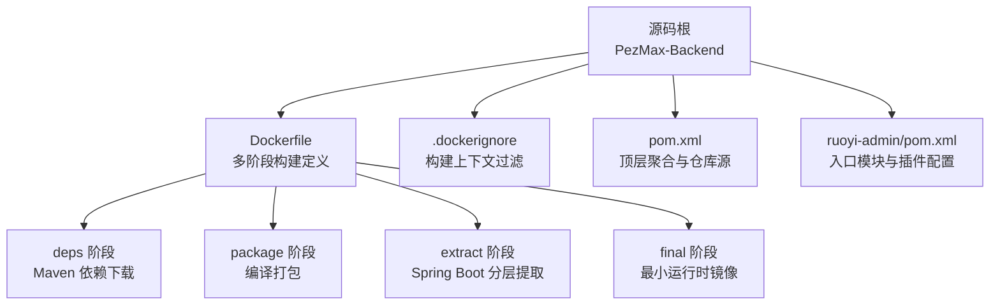
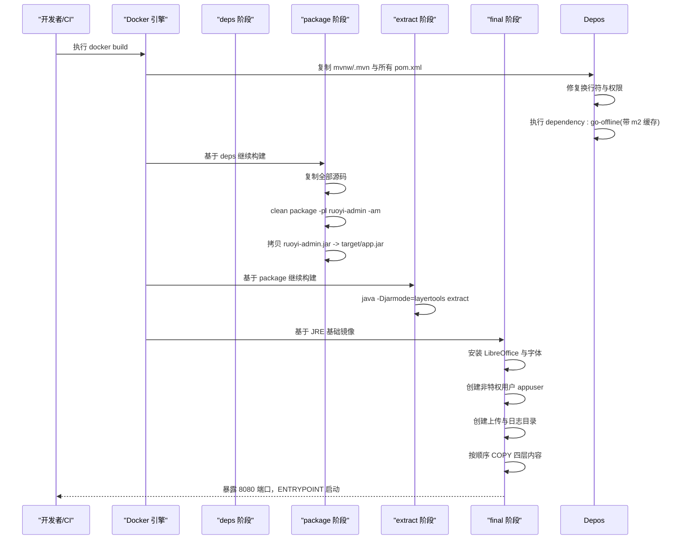
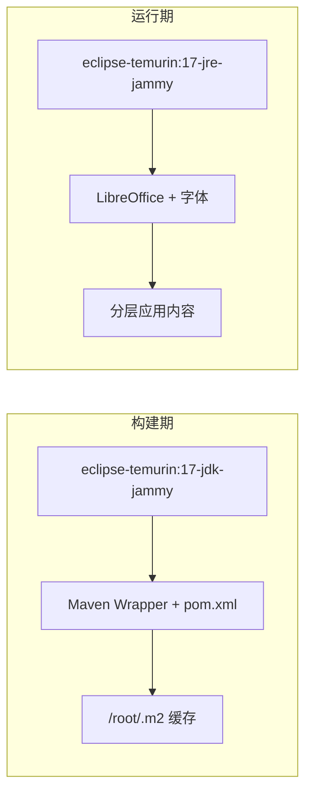

# Docker 镜像构建

<cite>
**本文引用的文件列表**
- [Dockerfile](file://PezMax-Backend/Dockerfile)
- [.dockerignore](file://PezMax-Backend/.dockerignore)
- [pom.xml](file://PezMax-Backend/pom.xml)
- [ruoyi-admin/pom.xml](file://PezMax-Backend/ruoyi-admin/pom.xml)
- [README.Docker.md](file://PezMax-Backend/README.Docker.md)
</cite>

## 目录
1. [简介](#简介)
2. [项目结构](#项目结构)
3. [核心组件](#核心组件)
4. [架构总览](#架构总览)
5. [详细组件分析](#详细组件分析)
6. [依赖关系分析](#依赖关系分析)
7. [性能考虑](#性能考虑)
8. [故障排查指南](#故障排查指南)
9. [结论](#结论)
10. [附录](#附录)

## 简介
本文件面向生产与研发环境，系统化解析该项目的多阶段 Docker 镜像构建策略，覆盖依赖下载、应用打包、分层提取与最终运行四个阶段的优化原理与实践。文档同时给出自定义构建参数（如 UID）、构建缓存优化、镜像体积优化技巧、.dockerignore 配置策略，以及构建性能调优与生产安全加固建议，帮助读者在本地与 CI/CD 中高效产出可移植、可复现、安全的镜像。

## 项目结构
后端采用 Maven 多模块工程，Docker 构建位于 PezMax-Backend 目录，使用多阶段构建将“构建期”和“运行期”解耦，并通过 Spring Boot Layer Tools 实现细粒度分层，最大化利用 Docker 层缓存。

图表来源
- [Dockerfile:1-114](file://PezMax-Backend/Dockerfile#L1-L114)
- [.dockerignore:1-62](file://PezMax-Backend/.dockerignore#L1-L62)
- [pom.xml:1-234](file://PezMax-Backend/pom.xml#L1-L234)
- [ruoyi-admin/pom.xml:1-92](file://PezMax-Backend/ruoyi-admin/pom.xml#L1-L92)

章节来源
- [Dockerfile:1-114](file://PezMax-Backend/Dockerfile#L1-L114)
- [.dockerignore:1-62](file://PezMax-Backend/.dockerignore#L1-L62)
- [pom.xml:1-234](file://PezMax-Backend/pom.xml#L1-L234)
- [ruoyi-admin/pom.xml:1-92](file://PezMax-Backend/ruoyi-admin/pom.xml#L1-L92)

## 核心组件
- 多阶段构建：通过 deps/package/extract/final 四阶段分离构建与运行环境，减少最终镜像体积并提升缓存命中率。
- Maven 依赖缓存：使用 BuildKit 的 mount=type=cache 将 /root/.m2 持久化到构建缓存，避免重复拉取远程依赖。
- Spring Boot 分层打包：借助 jarmode=layertools 将依赖、启动器、快照依赖与应用代码拆分为独立层，提高增量构建效率。
- 非特权用户运行：创建 appuser 并以非 root 身份运行，降低容器逃逸风险。
- 基础镜像选择：构建期使用 JDK 镜像，运行期使用 JRE 镜像，进一步缩小体积。
- .dockerignore：排除 IDE、构建产物、日志等无关文件，减小构建上下文体积，加速构建。

章节来源
- [Dockerfile:10-114](file://PezMax-Backend/Dockerfile#L10-L114)
- [.dockerignore:1-62](file://PezMax-Backend/.dockerignore#L1-L62)

## 架构总览
下图展示了从源码到最终运行镜像的完整流程，包括各阶段职责与数据流向。

图表来源
- [Dockerfile:10-114](file://PezMax-Backend/Dockerfile#L10-L114)

## 详细组件分析

### 依赖下载阶段（deps）
- 目标：仅复制构建必需的元数据（mvnw、.mvn、各模块 pom.xml），预拉取所有依赖，最大化后续阶段缓存命中。
- 关键优化点：
  - 使用 --mount=type=cache,target=/root/.m2 复用 Maven 本地仓库缓存。
  - 先复制少量文件再执行依赖解析，确保 pom.xml 变更才触发重新下载。
  - 修正 Windows 换行符与可执行权限，保证跨平台一致性。
- 复杂度与影响：
  - 时间复杂度取决于依赖数量与网络质量；空间复杂度为本地仓库大小。
  - 合理设置缓存卷可显著缩短冷/热构建时间。

章节来源
- [Dockerfile:10-31](file://PezMax-Backend/Dockerfile#L10-L31)
- [pom.xml:209-232](file://PezMax-Backend/pom.xml#L209-L232)

### 应用打包阶段（package）
- 目标：在已具备依赖缓存的基础上，编译并打包应用，输出可执行的 uber jar。
- 关键优化点：
  - 沿用 deps 阶段的 Maven 缓存，跳过未变更模块的重复编译。
  - 指定 -pl ruoyi-admin -am 仅构建入口模块及其依赖，避免全量构建。
  - 将产物统一复制到 target/app.jar，便于后续分层提取。
- 注意事项：
  - 若频繁修改大量公共模块，可考虑拆分缓存或调整模块依赖边界以提升缓存命中率。

章节来源
- [Dockerfile:41-53](file://PezMax-Backend/Dockerfile#L41-L53)
- [ruoyi-admin/pom.xml:66-90](file://PezMax-Backend/ruoyi-admin/pom.xml#L66-L90)

### 分层提取阶段（extract）
- 目标：使用 Spring Boot Layer Tools 将 jar 包拆分为多个独立层，以便 Docker 层缓存更精细地命中。
- 关键优化点：
  - 使用 jarmode=layertools extract 生成 dependencies、spring-boot-loader、snapshot-dependencies、application 四层。
  - 这四层的变更频率依次递减，有利于增量构建时只重建受影响层。
- 注意：
  - 默认情况下 Spring Boot 会启用分层打包；如需显式控制，可在打包阶段开启相关属性（见附录）。

章节来源
- [Dockerfile:62-66](file://PezMax-Backend/Dockerfile#L62-L66)

### 最终运行阶段（final）
- 目标：以最小运行时为基础镜像，安装必要系统依赖，创建非特权用户，按序复制分层内容，暴露端口并定义启动命令。
- 关键优化点：
  - 基础镜像切换为 JRE，去除编译工具链，减小体积。
  - 一次性安装系统依赖并清理 apt 缓存，减少层体积。
  - 创建非特权用户 appuser，遵循最小权限原则。
  - 按“稳定层→变化层”的顺序 COPY，最大化缓存命中。
  - 暴露 8080 端口，ENTRYPOINT 指向 JarLauncher。
- 安全最佳实践：
  - 非 root 运行、精简基础镜像、移除不必要的工具与缓存。

章节来源
- [Dockerfile:80-114](file://PezMax-Backend/Dockerfile#L80-L114)

### 构建上下文过滤（.dockerignore）
- 目标：排除 IDE 配置、构建产物、临时文件、敏感信息、Compose 与 Helm 开发文件等，减小构建上下文体积，提升构建速度与安全。
- 典型排除项：
  - 版本控制与 IDE：.git、.idea、.vscode、*.iml 等
  - 构建产物：target、build、dist、*.class
  - 日志与调试：*.log、hs_err_pid*、replay_pid*
  - 其他：.env、secrets.dev.yaml、compose.y*ml、Dockerfile*
- 效果：
  - 减少传输到 Docker 守护进程的数据量，加快构建启动与缓存计算。
  - 避免将敏感或无关文件打入镜像。

章节来源
- [.dockerignore:1-62](file://PezMax-Backend/.dockerignore#L1-L62)

## 依赖关系分析
- 构建期依赖：JDK 镜像、Maven Wrapper、各模块 pom.xml。
- 运行期依赖：JRE 镜像、LibreOffice、中文字体、应用分层内容。
- 外部仓库：阿里云 Maven 仓库用于加速依赖下载。

图表来源
- [Dockerfile:10-114](file://PezMax-Backend/Dockerfile#L10-L114)
- [pom.xml:209-232](file://PezMax-Backend/pom.xml#L209-L232)

章节来源
- [Dockerfile:10-114](file://PezMax-Backend/Dockerfile#L10-L114)
- [pom.xml:209-232](file://PezMax-Backend/pom.xml#L209-L232)

## 性能考虑
- 构建缓存
  - 使用 --mount=type=cache 挂载 Maven 本地仓库，避免重复下载。
  - 将依赖解析与源码编译分阶段，使依赖缓存独立于源码变更。
- 分层优化
  - 依赖层、启动器层、快照依赖层、应用层顺序 COPY，优先命中稳定层。
  - 仅在应用代码或依赖变更时重建对应层。
- 构建上下文
  - 完善 .dockerignore，剔除不必要文件，减少上下文体积。
- 并行与流水线
  - 在 CI 中启用 BuildKit 与远程缓存（如 registry cache backend），进一步提升并发与复用。
- 基础镜像
  - 固定基础镜像标签或使用 digest，兼顾稳定性与可复现性。

[本节为通用指导，不直接分析具体文件]

## 故障排查指南
- 构建失败：依赖拉取超时或校验失败
  - 检查 Maven 仓库地址与网络连通性，确认阿里云仓库可用。
  - 清理本地构建缓存后重试，观察是否因缓存损坏导致。
- 构建缓慢
  - 确认 .dockerignore 是否生效，避免大文件或无用文件进入上下文。
  - 检查是否启用了 BuildKit 与缓存挂载。
- 运行异常：权限问题
  - 确认应用写入路径（上传、日志）对 appuser 可写。
  - 如需自定义 UID/GID，可通过 ARG 传入。
- 中文显示或文档转换异常
  - 确认已安装中文字体与 LibreOffice，且镜像内字体路径正确。

章节来源
- [Dockerfile:80-114](file://PezMax-Backend/Dockerfile#L80-L114)
- [pom.xml:209-232](file://PezMax-Backend/pom.xml#L209-L232)

## 结论
本项目采用成熟的多阶段构建与 Spring Boot 分层技术，结合 Maven 缓存与非特权用户运行，实现了构建效率与运行安全的平衡。配合完善的 .dockerignore 与合理的分层顺序，可在本地与 CI/CD 环境中获得稳定、快速、可复现的镜像构建体验。生产部署建议固定基础镜像版本、启用远程缓存、最小化镜像体积并严格限制容器权限。

[本节为总结性内容，不直接分析具体文件]

## 附录

### 自定义构建参数与常用命令
- 自定义 UID
  - 通过 --build-arg UID=xxx 指定运行用户 UID，便于与宿主机或编排系统对齐。
- 构建与运行
  - 参考 README.Docker.md 中的 compose 与 docker build 示例。
- 平台兼容
  - 在多架构场景下使用 --platform 指定目标架构。

章节来源
- [Dockerfile:91-98](file://PezMax-Backend/Dockerfile#L91-L98)
- [README.Docker.md:1-19](file://PezMax-Backend/README.Docker.md#L1-L19)

### Spring Boot 分层打包说明
- 当前 Dockerfile 使用 jarmode=layertools 进行分层提取，属于官方推荐方式。
- 如需在打包阶段显式启用分层，可在 spring-boot-maven-plugin 中配置 layers 相关属性（例如启用分层打包与分层清单）。
- 分层顺序由 Spring Boot 自动决定，通常包含依赖、启动器、快照依赖与应用代码四层。

章节来源
- [Dockerfile:62-66](file://PezMax-Backend/Dockerfile#L62-L66)
- [ruoyi-admin/pom.xml:66-90](file://PezMax-Backend/ruoyi-admin/pom.xml#L66-L90)

### 生产环境镜像安全加固建议
- 使用 JRE 基础镜像，移除编译工具链与多余包。
- 固定基础镜像版本或 digest，避免隐式升级。
- 以非 root 用户运行，最小化文件系统权限。
- 扫描镜像漏洞，及时更新基础镜像与系统包。
- 仅暴露必要端口，结合网络策略限制访问。
- 使用只读根文件系统（必要时通过 volume 挂载可写目录）。

[本节为通用指导，不直接分析具体文件]