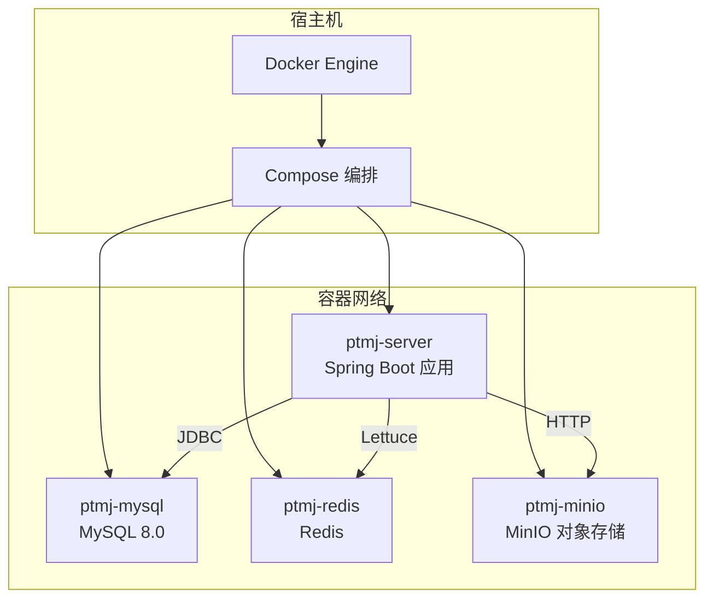
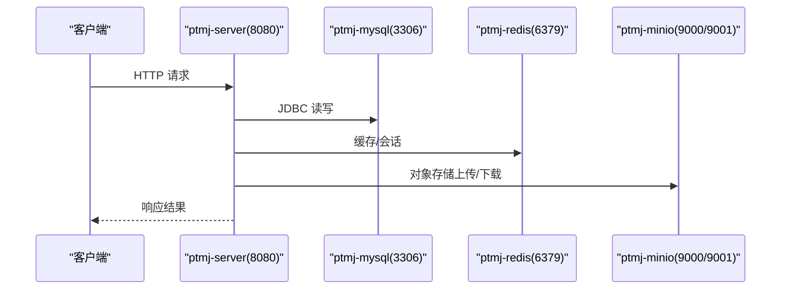
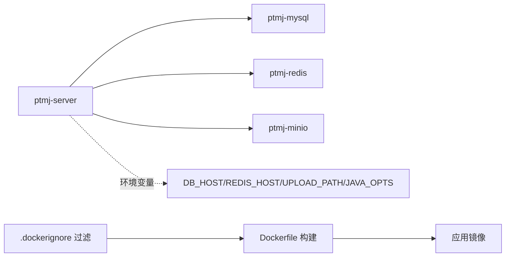
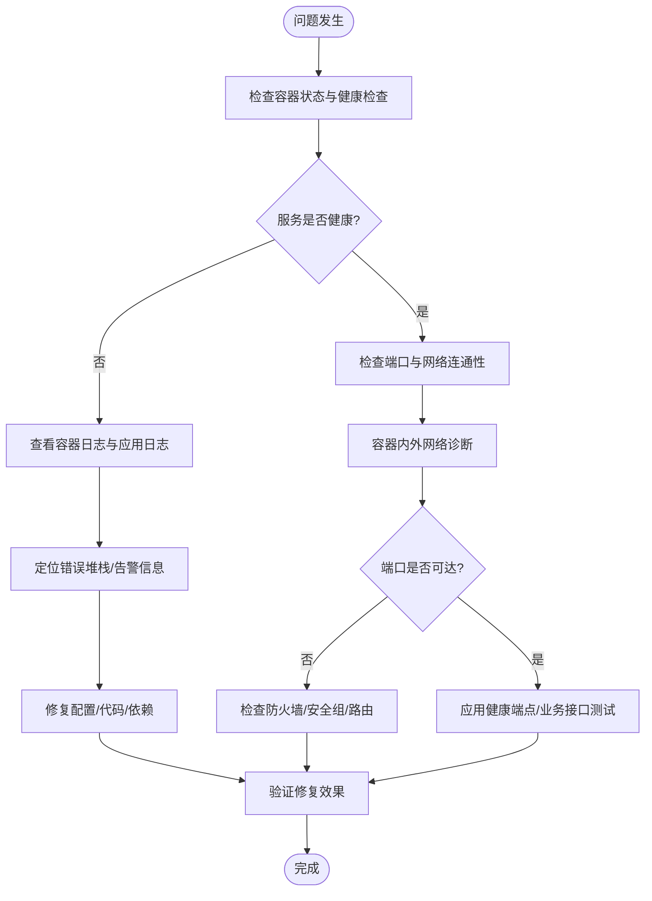

# 容器管理与运维

<cite>
**本文引用的文件**
- [Dockerfile](file://PezMax-Backend/Dockerfile)
- [compose.yaml](file://PezMax-Backend/compose.yaml)
- [.dockerignore](file://PezMax-Backend/.dockerignore)
- [application.yml](file://PezMax-Backend/ruoyi-admin/src/main/resources/application.yml)
- [application-druid.yml](file://PezMax-Backend/ruoyi-admin/src/main/resources/application-druid.yml)
- [logback.xml](file://PezMax-Backend/ruoyi-admin/src/main/resources/logback.xml)
</cite>

## 目录
1. [简介](#简介)
2. [项目结构](#项目结构)
3. [核心组件](#核心组件)
4. [架构总览](#架构总览)
5. [详细组件分析](#详细组件分析)
6. [依赖关系分析](#依赖关系分析)
7. [性能与资源管理](#性能与资源管理)
8. [监控与日志收集](#监控与日志收集)
9. [故障排查指南](#故障排查指南)
10. [安全加固与生产最佳实践](#安全加固与生产最佳实践)
11. [结论](#结论)

## 简介
本文件面向容器化部署与运维，围绕 PezMax 后端服务的镜像构建、容器编排、生命周期管理、监控与日志、资源治理、故障排查与安全加固提供完整操作指南。文档以仓库中的 Dockerfile、Compose 编排与应用配置为依据，给出可直接落地的步骤与注意事项，帮助读者在生产环境中稳定运行该服务。

## 项目结构
本项目后端采用多阶段构建的 Spring Boot 应用，通过 Docker Compose 编排 MySQL、Redis、MinIO 与后端服务。关键容器化相关文件如下：
- Dockerfile：定义多阶段构建、非特权用户、JRE 运行时、端口暴露与启动命令
- compose.yaml：定义数据库、缓存、对象存储与服务依赖、健康检查、卷挂载与环境变量
- .dockerignore：排除无关文件，减小构建上下文体积
- application.yml / application-druid.yml：应用端口、线程池、数据源、Redis、MinIO 等配置
- logback.xml：日志输出路径、滚动策略与级别控制

图表来源
- [compose.yaml:1-84](file://PezMax-Backend/compose.yaml#L1-L84)
- [Dockerfile:1-114](file://PezMax-Backend/Dockerfile#L1-L114)

章节来源
- [Dockerfile:1-114](file://PezMax-Backend/Dockerfile#L1-L114)
- [compose.yaml:1-84](file://PezMax-Backend/compose.yaml#L1-L84)
- [.dockerignore:1-62](file://PezMax-Backend/.dockerignore#L1-L62)
- [application.yml:1-162](file://PezMax-Backend/ruoyi-admin/src/main/resources/application.yml#L1-L162)
- [application-druid.yml:1-62](file://PezMax-Backend/ruoyi-admin/src/main/resources/application-druid.yml#L1-L62)
- [logback.xml:1-99](file://PezMax-Backend/ruoyi-admin/src/main/resources/logback.xml#L1-L99)

## 核心组件
- 应用镜像构建（Dockerfile）
  - 使用 eclipse-temurin:17-jdk-jammy 作为构建基础镜像，eclipse-temurin:17-jre-jammy 作为运行基础镜像
  - 多阶段构建：依赖解析 -> 打包 -> 分层提取 -> 最小运行时
  - 安装 LibreOffice 与中文字体，创建非特权用户 appuser，暴露 8080 端口，ENTRYPOINT 使用 JarLauncher
- 服务编排（compose.yaml）
  - 定义 mysql、redis、minio、server 四个服务
  - 使用 healthcheck 确保依赖就绪后再启动 server
  - 通过环境变量注入 DB_HOST、REDIS_HOST、UPLOAD_PATH、JAVA_OPTS 等
  - 将 logs 与 uploadPath 持久化到宿主机目录
- 应用配置（application*.yml）
  - 服务器端口 8080，Tomcat 线程池参数
  - Redis 连接池、MinIO 客户端地址与凭据、文件上传大小限制
  - Druid 数据源、慢 SQL 记录、控制台访问路径
- 日志系统（logback.xml）
  - 日志目录 /home/ruoyi/logs
  - 按天滚动，保留 60 天
  - 区分 INFO、ERROR、用户操作日志

章节来源
- [Dockerfile:1-114](file://PezMax-Backend/Dockerfile#L1-L114)
- [compose.yaml:1-84](file://PezMax-Backend/compose.yaml#L1-L84)
- [application.yml:1-162](file://PezMax-Backend/ruoyi-admin/src/main/resources/application.yml#L1-L162)
- [application-druid.yml:1-62](file://PezMax-Backend/ruoyi-admin/src/main/resources/application-druid.yml#L1-L62)
- [logback.xml:1-99](file://PezMax-Backend/ruoyi-admin/src/main/resources/logback.xml#L1-L99)

## 架构总览
下图展示了容器间通信与外部依赖关系，以及关键配置项的作用域。

图表来源
- [compose.yaml:1-84](file://PezMax-Backend/compose.yaml#L1-L84)
- [application.yml:1-162](file://PezMax-Backend/ruoyi-admin/src/main/resources/application.yml#L1-L162)
- [application-druid.yml:1-62](file://PezMax-Backend/ruoyi-admin/src/main/resources/application-druid.yml#L1-L62)

## 详细组件分析

### 容器生命周期管理（镜像拉取、创建、启动、停止、重启、删除）
- 本地构建镜像
  - 在仓库根目录执行构建命令，基于 Dockerfile 生成镜像
  - 参考：[Dockerfile:1-114](file://PezMax-Backend/Dockerfile#L1-L114)
- 使用 Compose 拉起服务
  - 首次运行会拉取 mysql、redis、minio 镜像并初始化数据库脚本
  - 参考：[compose.yaml:1-84](file://PezMax-Backend/compose.yaml#L1-L84)
- 常用操作
  - 启动：启动所有服务及依赖
  - 停止：停止并移除容器（保留卷数据）
  - 重启：重启指定服务或全部服务
  - 删除：清理容器与网络（不删除卷）
- 查看状态与日志
  - 查看服务状态与健康检查结果
  - 查看服务标准输出与错误日志
- 进入容器调试
  - 在运行中的容器内执行命令进行临时诊断

章节来源
- [compose.yaml:1-84](file://PezMax-Backend/compose.yaml#L1-L84)
- [Dockerfile:1-114](file://PezMax-Backend/Dockerfile#L1-L114)

### 容器监控与指标采集
- 内置健康检查
  - MySQL、Redis、MinIO 均定义了 healthcheck，用于判断服务可用性
  - 参考：[compose.yaml:1-84](file://PezMax-Backend/compose.yaml#L1-L84)
- 应用层监控建议
  - 启用 JVM 指标导出（如 Micrometer + Prometheus），并在 Compose 中暴露相应端口
  - 结合 Grafana 可视化展示 CPU、内存、GC、线程池、连接池等指标
- 外部监控系统集成
  - 将容器指标与日志统一接入企业级监控平台（Prometheus/Grafana、ELK/Loki 等）

章节来源
- [compose.yaml:1-84](file://PezMax-Backend/compose.yaml#L1-L84)

### 日志收集与外部系统集成
- 应用日志
  - 日志目录：/home/ruoyi/logs
  - 滚动策略：按天滚动，保留 60 天
  - 参考：[logback.xml:1-99](file://PezMax-Backend/ruoyi-admin/src/main/resources/logback.xml#L1-L99)
- 容器标准输出
  - 可通过容器日志驱动收集 stdout/stderr
- 外部日志系统
  - 推荐将宿主机的日志目录挂载到宿主机后，由 Filebeat/Fluent Bit 等采集器转发至 ELK/Loki
  - 也可在 Compose 中为服务配置 json-file 或 journald 驱动，集中收集

章节来源
- [logback.xml:1-99](file://PezMax-Backend/ruoyi-admin/src/main/resources/logback.xml#L1-L99)
- [compose.yaml:1-84](file://PezMax-Backend/compose.yaml#L1-L84)

### 容器资源管理（CPU、内存、磁盘、网络带宽）
- JVM 内存
  - 通过 JAVA_OPTS 设置堆大小（例如 -Xms/-Xmx）
  - 参考：[compose.yaml:1-84](file://PezMax-Backend/compose.yaml#L1-L84)
- 容器资源限制
  - 在 Compose 中使用 deploy.resources.limits/reservations 限制 CPU 与内存
  - 针对生产环境建议显式设置 limits，避免单实例抢占宿主机资源
- 磁盘空间
  - 将 /home/ruoyi/logs 与 /home/ruoyi/uploadPath 映射到宿主机目录，便于容量规划与清理
  - 参考：[compose.yaml:1-84](file://PezMax-Backend/compose.yaml#L1-L84)
- 网络带宽
  - 可在宿主机层面通过 tc/cni 插件对容器网络进行限速；或在 Kubernetes 中使用 NetworkPolicy 与 QoS 策略

章节来源
- [compose.yaml:1-84](file://PezMax-Backend/compose.yaml#L1-L84)

### 网络与端口
- 对外暴露端口
  - 后端服务：8080
  - MySQL：3306
  - Redis：6379
  - MinIO API：9000，Console：9001
- 容器间通信
  - 通过 Compose 默认网络，服务名即 DNS 名称（mysql、redis、minio）
- 安全建议
  - 生产环境不建议直接暴露数据库与缓存端口到宿主机，仅暴露网关/反向代理所需端口

章节来源
- [compose.yaml:1-84](file://PezMax-Backend/compose.yaml#L1-L84)

## 依赖关系分析
- 服务依赖
  - server 依赖 mysql、redis、minio 的健康状态
- 配置依赖
  - 应用通过环境变量注入 DB_HOST、REDIS_HOST、UPLOAD_PATH、JAVA_OPTS
  - MinIO 客户端地址与凭据在应用配置中声明
- 构建依赖
  - Maven Wrapper 与多模块 pom.xml 参与构建，.dockerignore 排除无关文件

图表来源
- [compose.yaml:1-84](file://PezMax-Backend/compose.yaml#L1-L84)
- [Dockerfile:1-114](file://PezMax-Backend/Dockerfile#L1-L114)
- [.dockerignore:1-62](file://PezMax-Backend/.dockerignore#L1-L62)

章节来源
- [compose.yaml:1-84](file://PezMax-Backend/compose.yaml#L1-L84)
- [Dockerfile:1-114](file://PezMax-Backend/Dockerfile#L1-L114)
- [.dockerignore:1-62](file://PezMax-Backend/.dockerignore#L1-L62)

## 性能与资源管理
- JVM 调优
  - 根据容器内存限制合理设置 -Xms/-Xmx，避免频繁 GC 与 OOM
  - 关注 Tomcat 线程池与连接数上限，结合压测调整
- 连接池与超时
  - Druid 连接池初始/最大连接数、等待超时、Socket 超时等需与数据库容量匹配
  - Redis Lettuce 连接池大小与超时时间需评估并发场景
- 存储与 I/O
  - 日志与上传目录应置于高性能磁盘，定期归档与清理
- 网络
  - 避免跨可用区直连数据库与缓存，优先同机房/同集群部署

章节来源
- [application.yml:1-162](file://PezMax-Backend/ruoyi-admin/src/main/resources/application.yml#L1-L162)
- [application-druid.yml:1-62](file://PezMax-Backend/ruoyi-admin/src/main/resources/application-druid.yml#L1-L62)
- [logback.xml:1-99](file://PezMax-Backend/ruoyi-admin/src/main/resources/logback.xml#L1-L99)

## 监控与日志收集

### 监控方案
- 健康检查
  - 使用 Compose 的 healthcheck 检测依赖服务可用性
  - 参考：[compose.yaml:1-84](file://PezMax-Backend/compose.yaml#L1-L84)
- 应用指标
  - 引入 Micrometer + Prometheus，暴露 /actuator/prometheus 端点
  - 在 Compose 中暴露端口并配置抓取任务
- 可视化
  - 使用 Grafana 展示 JVM、Tomcat、Druid、Redis、MinIO 等指标

章节来源
- [compose.yaml:1-84](file://PezMax-Backend/compose.yaml#L1-L84)

### 日志收集方案
- 应用日志
  - 日志写入 /home/ruoyi/logs，按天滚动，保留 60 天
  - 参考：[logback.xml:1-99](file://PezMax-Backend/ruoyi-admin/src/main/resources/logback.xml#L1-L99)
- 容器日志
  - 使用 json-file 或 journald 驱动收集 stdout/stderr
- 外部系统
  - 通过 Filebeat/Fluent Bit 采集宿主机日志目录，转发至 ELK/Loki
  - 结合结构化字段（service、container_id、host）提升检索效率

章节来源
- [logback.xml:1-99](file://PezMax-Backend/ruoyi-admin/src/main/resources/logback.xml#L1-L99)
- [compose.yaml:1-84](file://PezMax-Backend/compose.yaml#L1-L84)

## 故障排查指南

### 常见问题定位流程

### 具体操作步骤
- 查看容器状态与健康检查
  - 使用编排工具查看服务状态与最近健康检查结果
- 查看日志
  - 容器标准输出：查看实时日志流
  - 应用日志：进入宿主机查看 /home/ruoyi/logs 下的滚动日志文件
- 进程与资源
  - 进入容器查看进程、内存占用、线程数、打开文件句柄
- 网络连接
  - 在容器内 ping/traceroute/telnet 目标主机与端口
  - 检查宿主机防火墙、云安全组、NAT 规则
- 数据库与缓存
  - 验证 JDBC 连接、账号权限、时区与字符集
  - 检查 Redis 连接池与超时配置
- 对象存储
  - 校验 MinIO 地址、AK/SK、Bucket 权限与网络可达

章节来源
- [compose.yaml:1-84](file://PezMax-Backend/compose.yaml#L1-L84)
- [logback.xml:1-99](file://PezMax-Backend/ruoyi-admin/src/main/resources/logback.xml#L1-L99)
- [application.yml:1-162](file://PezMax-Backend/ruoyi-admin/src/main/resources/application.yml#L1-L162)
- [application-druid.yml:1-62](file://PezMax-Backend/ruoyi-admin/src/main/resources/application-druid.yml#L1-L62)

## 安全加固与生产最佳实践

### 镜像与构建安全
- 使用最小运行时镜像（JRE）
  - 参考：[Dockerfile:1-114](file://PezMax-Backend/Dockerfile#L1-L114)
- 固定基础镜像版本（使用 SHA 摘要）
- 扫描镜像漏洞（Trivy/Clair 等）
- 使用 .dockerignore 减少构建上下文与敏感文件泄露
  - 参考：[.dockerignore:1-62](file://PezMax-Backend/.dockerignore#L1-L62)

### 容器运行时安全
- 非特权用户运行
  - 参考：[Dockerfile:1-114](file://PezMax-Backend/Dockerfile#L1-L114)
- 只读文件系统
  - 将可写目录（logs、uploadPath）单独挂载为卷，其余文件系统设为只读
- 权限最小化
  - 仅开放必要端口，关闭不必要的系统与 Java 特性
- 网络安全策略
  - 生产环境仅暴露网关/反向代理端口，数据库与缓存不直接暴露给宿主机
  - 使用网络命名空间隔离不同环境

### 配置与密钥管理
- 敏感信息使用环境变量或密钥管理服务注入
- 应用配置与密钥分离，避免硬编码
- 定期轮换密码与密钥

### 日志与审计
- 开启结构化日志，包含请求 ID、用户标识、IP 等
- 集中收集与留存，满足合规要求
- 对敏感信息进行脱敏处理

章节来源
- [Dockerfile:1-114](file://PezMax-Backend/Dockerfile#L1-L114)
- [.dockerignore:1-62](file://PezMax-Backend/.dockerignore#L1-L62)
- [compose.yaml:1-84](file://PezMax-Backend/compose.yaml#L1-L84)

## 结论
通过对 Dockerfile、Compose 与应用配置的梳理，本文给出了从镜像构建、容器编排、生命周期管理到监控日志、资源治理、故障排查与安全加固的全链路指南。建议在生产环境中进一步引入指标采集、集中日志、镜像扫描与密钥管理等能力，持续提升系统的稳定性与安全性。